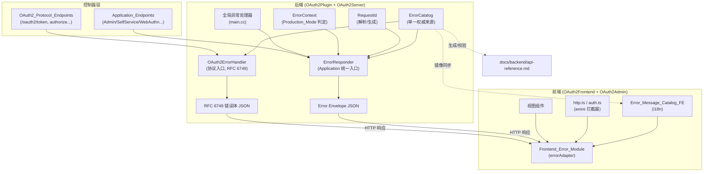
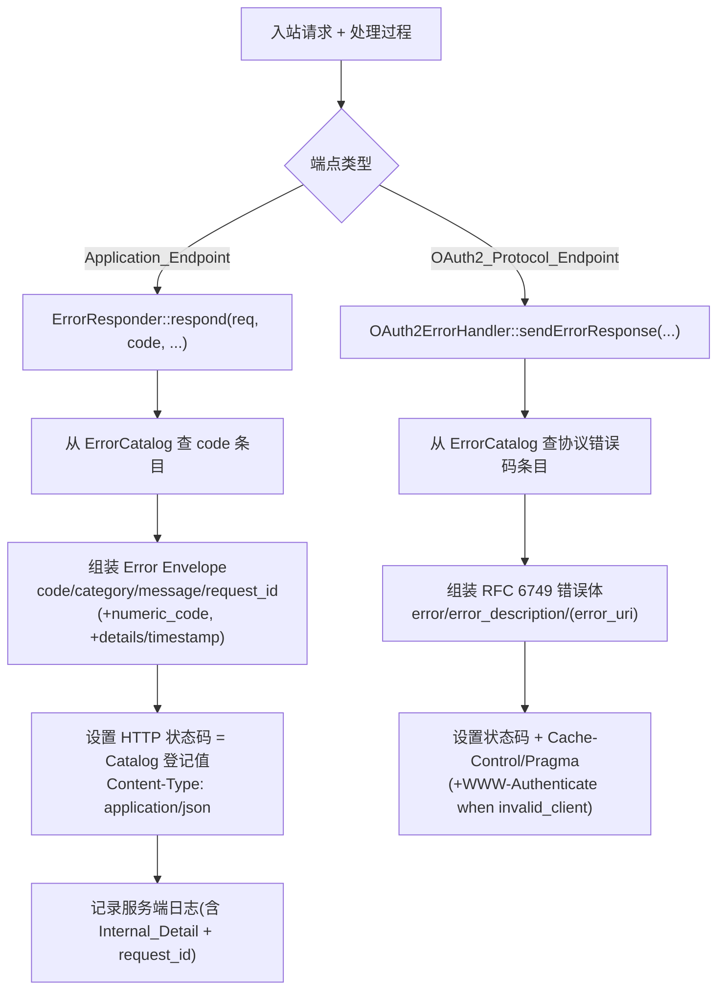

# Design Document

## Overview

本设计为 OAuth2 平台前后端建立统一、稳定、可文档化、可测试的「错误码 + 错误信息」体系，以达到发版（生产可用）标准。设计的核心是引入一份**单一权威来源（single source of truth）的错误码目录（Error Catalog）**，并围绕它重构后端的两条错误处理入口（Application 与 OAuth2 协议）与前端的共享错误模块（Frontend_Error_Module）。

设计需要同时满足三组相互制约的目标：

1. **统一化**：所有业务端点（Application_Endpoint）返回结构一致的 Error Envelope；前端以单一逻辑解析。
2. **协议合规**：OAuth2 协议端点（OAuth2_Protocol_Endpoint）继续遵循 RFC 6749 §5.2，错误体格式、缓存头、状态码不变。
3. **迁移安全**：保持现有 HTTP 路径/方法、成功响应体、现有不冲突的 Numeric_Error_Code 取值与 Error_Category 枚举名称不变。

### 现状分析（研究结论）

通过审阅现有代码，确认了需求引言中描述的四种并存错误格式，并据此定位重构点：

| 来源 | 文件 | 现有格式 | 处理 |
| --- | --- | --- | --- |
| 数值错误体系 | `OAuth2Plugin/.../error/ErrorTypes.h`、`ErrorHandler.cc` | `{ "error": { "code": <int>, "category", "message", "details", "request_id" } }`，`code` 为整数 | 演进为 Error Envelope 权威实现，`code` 改为字符串 Error_Code，整数迁移至 `numeric_code` |
| RFC 6749 错误 | `OAuth2ErrorHandler.cc` | `{ "error": <string>, "error_description", "error_uri" }` + `Cache-Control: no-store`、`Pragma: no-cache` | 保留并补全（状态码改由 Catalog 驱动、补 `WWW-Authenticate`） |
| 校验响应器 | `validation/HttpResponder.cc` | `{ "error": { "code": "VALIDATION_ERROR", "message", "details"\|"reason", "timestamp" } }` | 改为输出 VALIDATION 类 Error Envelope |
| 控制器即兴格式 | `UserSelfServiceController.cc`、`EmailVerificationController.cc`、`AdminController.cc`、`ApiDocController.cc`、`ClientRegistrationController.cc` 等 | `{ "error": "not_found" }`、`{ "message": ... }`、`{ "status": "error", "message", "detail" }`、纯文本/HTML | 迁移到统一入口 |

关键发现：

- 现有 `Error::toHttpStatusCode()`（`ErrorHandler.cc`）已实现 Requirement 4 第 1-6、8 条几乎全部的类别映射逻辑（VALIDATION→400、AUTHENTICATION→401、AUTHORIZATION→403、DATABASE/INTERNAL→500、NETWORK 下 TIMEOUT→504 否则 502）。设计将该逻辑作为 Catalog 中 HTTP 状态码的生成规则，使运行时以 Catalog 登记值为权威取值。
- 现有 `ErrorHandler::generateRequestId()` 产出 `req_` 前缀的十六进制串，但**未复用入站请求头**。`AuditLogger.cc` 已读取 `X-Request-ID` 请求头并在为空时回退到 `drogon::utils::getUuid()`。设计将统一为一个 RequestId 解析/生成工具，复用 `X-Request-ID` 头并做字符集/长度校验（Requirement 6）。
- 现有 `HttpResponder::detailedErrorsAllowed()` 已通过 `#ifdef DEBUG` + `DETAILED_VALIDATION_ERRORS` 环境变量区分 Production_Mode。设计将该判定提升为统一的 `ErrorContext::detailedErrorsAllowed()`，供所有入口共享（Requirement 5）。
- `main.cc` 的全局 `setExceptionHandler` 当前返回 `{ "error": "server_error", "error_description": ... }`（OAuth2 风格）。设计将其改为对 Application 路径输出 Error Envelope（Requirement 7 第 7 条）。
- 后端测试框架为 **Drogon 自带的 `drogon_test.h`（`DROGON_TEST` 宏）**；前端无单元测试框架（仅 Playwright e2e）。这影响测试策略：后端属性测试需在 `DROGON_TEST` 内手写随机生成循环（≥100 次迭代）；前端需引入 `vitest` + `fast-check`。

### 设计范围

- **后端**：新增 `ErrorCatalog`（权威来源）、重构 `Error`/`ErrorTypes`、引入统一响应工厂 `ErrorResponder`、`RequestId` 工具、`ErrorContext`；改造 `OAuth2ErrorHandler`、`HttpResponder`、全局异常处理器与各控制器。
- **前端**：新增共享 `errorAdapter`（Frontend_Error_Module）与 `Error_Message_Catalog_FE`（i18n 资源），改造 `http.ts`/`auth.ts` 拦截器与各视图错误展示。
- **文档与测试**：由 Catalog 生成/校验 `docs/backend/api-reference.md` 错误码章节；新增后端属性/一致性测试与前端 vitest 属性测试，纳入 CI。

## Architecture

### 总体架构



### 后端两条错误处理通道

设计明确区分两类端点，并强制各自走专属入口（Requirement 7 第 1-2 条）：



### 关键架构决策

- **AD-1：Catalog 作为单一权威来源。** 后端在编译期以一张静态表（`std::array`/不可变 map）定义全部 Error_Code 及全部 OAuth2 协议码的属性（Numeric_Error_Code、Category、HTTP 状态码、默认 Client_Safe_Message、说明）。运行时所有入口、文档生成、测试枚举都从此表读取，杜绝散落的硬编码（Requirement 3 第 5、8 条）。
- **AD-2：`code` 字段语义迁移。** 现有 Envelope 的 `code`（整数）改为字符串 Error_Code（如 `AUTH_INVALID_CREDENTIALS`），整数下沉为可选的 `numeric_code`。这是满足 Requirement 1 第 2-3 条所必需的破坏性结构调整，但仅影响错误体（非成功体），且 Numeric_Error_Code 取值与 Error_Category 枚举名保持不变（Requirement 11 第 5 条）。
- **AD-3：HTTP 状态码以 Catalog 为运行时权威值。** Catalog 中每个条目的 HTTP 状态码在构建时按 Requirement 4 的类别/数值规则生成；运行时直接读取，保证「同类别同状态码」与「同 code 任意调用一致」（Requirement 4 第 7、9 条）。
- **AD-4：Production_Mode 统一判定。** 抽取 `ErrorContext::detailedErrorsAllowed()`（`#ifdef DEBUG` 或 `DETAILED_VALIDATION_ERRORS` 开关），所有入口共享，决定是否输出 `details`（Requirement 5 第 1、4 条）。
- **AD-5：前端目录镜像后端。** `Error_Message_Catalog_FE` 的键集合必须覆盖后端 Catalog 的全部 Error_Code 与全部协议码（Requirement 9 第 1 条）。提供构建期校验脚本检测缺失键。
- **AD-6：前端单一适配函数。** `errorAdapter` 是纯函数（输入 axios 错误，输出规范化结构），永不抛出（Requirement 8 第 1 条），便于属性测试与跨应用复用（Requirement 8 第 6 条）。

## Components and Interfaces

### 后端组件

#### 1. ErrorCatalog（新增，单一权威来源）

```cpp
namespace common::error
{
// 一条目录条目（Application 错误码）
struct CatalogEntry
{
    std::string_view code;            // 稳定字符串 Error_Code，目录内唯一
    int numericCode;                  // Numeric_Error_Code，目录内唯一，落在 category 段位内
    ErrorCategory category;           // 错误分类
    int httpStatus;                   // 100..599，按 Requirement 4 规则生成
    std::string_view defaultMessage;  // 默认 Client_Safe_Message（非空、无 Internal_Detail）
    std::string_view description;     // 简短说明，长度 1..200
};

// OAuth2 协议错误码条目
struct OAuthCatalogEntry
{
    std::string_view error;             // 协议字符串错误码（invalid_request 等）
    int httpStatus;                     // 登记的 HTTP 状态码
    std::string_view defaultErrorDesc;  // 默认 error_description（Client_Safe_Message）
    std::string_view errorUri;          // 可选 error_uri，空表示无
};

class ErrorCatalog
{
  public:
    // 查表：未登记返回 nullptr
    static const CatalogEntry *find(std::string_view code);
    static const CatalogEntry *findByNumeric(int numericCode);
    static const OAuthCatalogEntry *findOAuth(std::string_view error);

    // 全量遍历（供文档生成与测试枚举）
    static const std::vector<CatalogEntry> &allEntries();
    static const std::vector<OAuthCatalogEntry> &allOAuthEntries();

    // 内部错误兜底条目（Numeric 6001），供未登记异常使用
    static const CatalogEntry &internalError();
};
}  // namespace common::error
```

Error_Code 命名约定：`<CATEGORY前缀>_<语义>`，例如 `NET_CONNECTION_FAILED`、`DB_QUERY_ERROR`、`VALIDATION_INVALID_INPUT`、`AUTH_INVALID_CREDENTIALS`、`AUTHZ_ACCESS_DENIED`、`INTERNAL_ERROR`。现有 14 个数值码各对应一条目，整数取值保持不变（Requirement 3 第 6 条、Requirement 11 第 5 条）。

#### 2. Error / ErrorTypes（重构）

```cpp
namespace common::error
{
struct Error
{
    std::string code;          // 字符串 Error_Code（取代旧整数 code）
    ErrorCategory category;
    std::string message;       // Client_Safe_Message（生产环境=Catalog 默认值）
    std::string details;       // 仅非生产/开关开启时输出
    std::string requestId;

    int  toHttpStatusCode() const;          // 改为查 Catalog
    bool hasNumericCode() const;            // Catalog 是否登记 numeric
    int  numericCode() const;               // Catalog 登记的整数码
    Json::Value toJson(bool includeDetails) const;  // 输出 Error Envelope

    static Error fromCode(std::string code, std::string requestId);
    static Error fromException(const std::exception &e, ErrorCategory category,
                               std::string requestId);  // 未登记→internalError()
};
// ErrorCategory 枚举名保持不变（NETWORK/DATABASE/VALIDATION/AUTHENTICATION/AUTHORIZATION/INTERNAL/UNKNOWN）
}  // namespace common::error
```

`toJson` 生成的 Envelope（Requirement 1）：

```json
{
  "error": {
    "code": "AUTH_INVALID_CREDENTIALS",
    "category": "AUTHENTICATION",
    "message": "用户名或密码错误",
    "numeric_code": 4001,
    "request_id": "req_0a1b2c3d",
    "details": "...仅非生产环境...",
    "timestamp": "2025-01-01T00:00:00Z"
  }
}
```

规则：顶层仅含 `error` 键（第 1 条）；`numeric_code` 仅在 Catalog 登记时出现，否则整字段省略（第 3、7 条）；生产环境完全不含 `details` 键（第 5 条 / Requirement 5 第 1 条）。

#### 3. ErrorResponder（新增，Application 统一入口）

```cpp
namespace common::error
{
class ErrorResponder
{
  public:
    using Callback = std::function<void(const drogon::HttpResponsePtr &)>;

    // 主入口：根据 Error_Code 组装并发送 Error Envelope
    static void respond(const drogon::HttpRequestPtr &req, Callback &&cb,
                        std::string code, std::string detailForLog = "",
                        std::string clientDetails = "");

    // 校验错误便捷入口（Requirement 7 第 4、6 条）
    static void respondValidation(const drogon::HttpRequestPtr &req, Callback &&cb,
                                  const std::vector<FieldError> &fieldErrors);

    // 异常便捷入口：未登记异常→INTERNAL_ERROR（Requirement 5 第 5 条）
    static void respondException(const drogon::HttpRequestPtr &req, Callback &&cb,
                                 const std::exception &e, ErrorCategory category);

    // 构建 HttpResponsePtr（供全局异常处理器复用）
    static drogon::HttpResponsePtr buildResponse(const drogon::HttpRequestPtr &req,
                                                 const Error &error);
};
}  // namespace common::error
```

职责：查 Catalog → 取默认 Client_Safe_Message（生产环境强制使用，Requirement 5 第 6 条）→ 注入 request_id（来自 `RequestId`）→ 按 `ErrorContext` 决定 details → 设置 HTTP 状态码与 `Content-Type: application/json` → 调 `ErrorHandler::logError`（含 Internal_Detail 与 request_id，Requirement 5 第 2 条）。

#### 4. RequestId（新增）

```cpp
namespace common::error
{
class RequestId
{
  public:
    // Requirement 6：复用合法 X-Request-ID，否则生成
    static std::string resolve(const drogon::HttpRequestPtr &req);
    static bool isValid(const std::string &v);  // 1..128, [A-Za-z0-9_-]
    static std::string generate();              // 非空、跨请求唯一
  private:
    static constexpr const char *kHeader = "X-Request-ID";
};
}  // namespace common::error
```

#### 5. ErrorContext（新增）

```cpp
namespace common::error
{
class ErrorContext
{
  public:
    static bool detailedErrorsAllowed();  // #ifdef DEBUG || DETAILED_VALIDATION_ERRORS
};
}
```

#### 6. OAuth2ErrorHandler（改造）

`getHttpStatusCode` 改为查 `ErrorCatalog::findOAuth`（Requirement 2 第 7 条）；`sendErrorResponse` 在 `error_description` 为空时回退为 Catalog 默认值（第 8 条），并新增可选 `authScheme` 参数以在 `invalid_client` 时设置 `WWW-Authenticate`（第 9 条）。保留 `Cache-Control: no-store`、`Pragma: no-cache`（第 3 条）与 `Content-Type: application/json`（第 1 条）。

#### 7. HttpResponder（改造）

`buildErrorJson` 改为产出 VALIDATION 类 Error Envelope（`code = "VALIDATION_INVALID_INPUT"`、`category = "VALIDATION"`、HTTP 400），内部委托 `ErrorResponder`；非生产环境在 `details` 中列出字段名与失败原因（Requirement 7 第 4、6 条）。移除 `error_description`/`reason`/`VALIDATION_ERROR` 等别名（Requirement 7 第 5 条）。

#### 8. 全局异常处理器（改造，main.cc）

按请求路径区分：OAuth2 协议路径走 `OAuth2ErrorHandler`，其余走 `ErrorResponder::buildResponse(INTERNAL_ERROR)` 输出 Error Envelope，替换当前的 `server_error` 文本（Requirement 7 第 7 条）。

### 前端组件

#### 9. Frontend_Error_Module（新增 `errorAdapter`）

```typescript
export interface NormalizedError {
  code: string          // Error_Code 或协议码或回退码
  message: string       // 非空本地化用户信息
  request_id: string    // 无则空字符串
  httpStatus: number    // 无 HTTP 响应则 0
}

// 单一函数，永不抛出（Requirement 8 第 1 条）
export function normalizeError(err: unknown, locale?: string): NormalizedError
```

解析优先级：① Error Envelope（顶层对象且 `error.code` 为字符串）→ 取 `error.code`、`error.request_id`；② RFC 6749（顶层 `error` 为字符串）→ 取顶层 `error`；③ 有响应体但不匹配 → 通用未知码；④ 无响应体（网络/超时）→ 网络回退码、`httpStatus = 0`。再经 `Error_Message_Catalog_FE` 按 locale 映射为本地化信息（缺失语言回退简体中文，缺失键回退通用未知信息并 `console.warn`）。

#### 10. Error_Message_Catalog_FE（新增 i18n 资源）

```typescript
// messages/zh-CN.ts —— 键覆盖后端全部 Error_Code + 全部协议码
export const zhCN: Record<string, string> = {
  AUTH_INVALID_CREDENTIALS: '用户名或密码错误',
  invalid_grant: '授权已失效，请重新登录',
  __unknown__: '发生未知错误，请稍后重试',
  __network__: '网络连接失败，请检查网络后重试',
  // ...
}
```

#### 11. http.ts / auth.ts（改造）与视图

axios 响应拦截器在 401 刷新失败后，经 `normalizeError` 得到会话失效信息并跳转登录视图（Requirement 10 第 4、5 条）。视图统一调用 `normalizeError` 展示，禁止直接读 `e.response.data.*`（第 3 条）；Admin 不使用原生 `alert`（第 6 条）。两应用共享同一 `errorAdapter` 实现来源（第 6 条 / Requirement 8 第 6 条）。

## Data Models

### 后端数据模型

**ErrorCategory（不变）**：`NETWORK | DATABASE | VALIDATION | AUTHENTICATION | AUTHORIZATION | INTERNAL | UNKNOWN`。

**Numeric_Error_Code 段位**：NETWORK 1000-1099、DATABASE 2000-2099、VALIDATION 3000-3099、AUTHENTICATION 4000-4099、AUTHORIZATION 5000-5099、INTERNAL 6000-6099。

**Error_Catalog 初始条目（保留现有整数取值，Requirement 3 第 6 条）**：

| Error_Code | numeric | category | http | 默认 Client_Safe_Message（zh-CN） |
| --- | --- | --- | --- | --- |
| `NET_CONNECTION_FAILED` | 1001 | NETWORK | 502 | 上游连接失败 |
| `NET_TIMEOUT` | 1002 | NETWORK | 504 | 请求超时 |
| `DB_CONNECTION_ERROR` | 2001 | DATABASE | 500 | 服务暂时不可用 |
| `DB_QUERY_ERROR` | 2002 | DATABASE | 500 | 服务暂时不可用 |
| `DB_CONSTRAINT_VIOLATION` | 2003 | DATABASE | 500 | 数据冲突 |
| `VALIDATION_INVALID_INPUT` | 3001 | VALIDATION | 400 | 输入参数有误 |
| `VALIDATION_MISSING_REQUIRED_FIELD` | 3002 | VALIDATION | 400 | 缺少必填字段 |
| `VALIDATION_FORMAT_ERROR` | 3003 | VALIDATION | 400 | 格式不正确 |
| `AUTH_INVALID_CREDENTIALS` | 4001 | AUTHENTICATION | 401 | 用户名或密码错误 |
| `AUTH_TOKEN_EXPIRED` | 4002 | AUTHENTICATION | 401 | 登录已过期 |
| `AUTH_TOKEN_INVALID` | 4003 | AUTHENTICATION | 401 | 登录凭证无效 |
| `AUTHZ_ACCESS_DENIED` | 5001 | AUTHORIZATION | 403 | 没有访问权限 |
| `AUTHZ_INSUFFICIENT_PERMISSIONS` | 5002 | AUTHORIZATION | 403 | 权限不足 |
| `INTERNAL_ERROR` | 6001 | INTERNAL | 500 | 服务器内部错误 |

> 迁移期会枚举各控制器即兴错误（如 `not_found`、`Client not found`），为其分配 Catalog 条目（如新增 `VALIDATION_*` 或合适类别码，整数在对应段位内顺序分配）。新增码不与现有码冲突（Requirement 3 第 3、4 条）。

**OAuth2 协议错误码目录（Requirement 2 第 6 条）**：

| error | http | 默认 error_description |
| --- | --- | --- |
| `invalid_request` | 400 | 请求参数缺失或无效 |
| `invalid_client` | 401 | 客户端认证失败 |
| `invalid_grant` | 400 | 授权许可无效或已过期 |
| `unauthorized_client` | 400 | 客户端无权使用该授权类型 |
| `unsupported_grant_type` | 400 | 不支持的授权类型 |
| `invalid_scope` | 400 | 请求的 scope 无效 |
| `server_error` | 500 | 服务器内部错误 |
| `temporarily_unavailable` | 503 | 服务暂时不可用 |

> RFC 7009/7662/8628 定义的相关错误码（如 `unsupported_token_type`）一并登记。

### 前端数据模型

`NormalizedError { code: string; message: string; request_id: string; httpStatus: number }`。

`Error_Message_Catalog_FE`：`Record<locale, Record<errorCode, string>>`，默认语言 `zh-CN`，含两个保留键 `__unknown__`（通用未知）与 `__network__`（网络回退）。

## Correctness Properties

*属性（property）是指在系统所有有效执行下都应保持为真的特征或行为——本质上是对系统应当做什么的形式化陈述。属性是连接人类可读规约与机器可验证正确性保证之间的桥梁。*

下列属性来自对验收标准的逐条 prework 分析，并经过去冗余合并（详见各属性的 Validates 注记）。每条属性均以「对任意…」开头，作为后续基于属性的测试（property-based testing, PBT）的规约。

### Property 1: Error Envelope 结构不变量

*对任意* 已在 Error_Catalog 中登记的 Error_Code，经统一入口产生的 Application 错误响应，其 JSON 顶层有且仅有一个键 `error`（值为对象）；该 `error` 对象包含非空字符串 `code`（且 `code` 属于 Error_Catalog 已登记集合）、属于枚举集合 {NETWORK, DATABASE, VALIDATION, AUTHENTICATION, AUTHORIZATION, INTERNAL, UNKNOWN} 的字符串 `category`、长度 1..500 的字符串 `message`、非空字符串 `request_id`；该对象的键集合仅取自 {`code`, `category`, `message`, `request_id`, `numeric_code`, `details`, `timestamp`}（不含 `error_description`、`reason` 等别名）；且响应头 `Content-Type` 为 `application/json`。

**Validates: Requirements 1.1, 1.2, 1.4, 1.6, 7.5**

### Property 2: numeric_code 正确性与省略

*对任意* Error_Code：若该 code 在 Error_Catalog 中登记了 Numeric_Error_Code，则 Envelope 含 `numeric_code` 字段且取值等于登记值；若未登记，则 Envelope 完全不含 `numeric_code` 键（而非 null 或空字符串）。

**Validates: Requirements 1.3, 1.7**

### Property 3: Error Envelope 序列化 round-trip

*对任意* 有效的 Error（含或不含 numeric_code、含或不含 details），将其序列化为 JSON 字符串后再反序列化，还原出的 `code`、`category`、`message`、`numeric_code`、`request_id` 字段取值与序列化前相等。

**Validates: Requirements 1.5, 12.3**

### Property 4: HTTP 状态码一致性

*对任意* Error_Code，经统一入口产生的响应的运行时 HTTP 状态码等于该 code 在 Error_Catalog 中登记的 HTTP_Status_Code，且该登记值满足类别映射规则：VALIDATION→400、AUTHENTICATION→401、AUTHORIZATION→403、DATABASE→500、INTERNAL→500、UNKNOWN→500、NETWORK 且 Numeric_Error_Code 为 1002→504、NETWORK 且其他→502；进而属于同一 Error_Category 的全部 code 返回相同状态码（NETWORK 类别按数值码区分 504/502 除外），同一 code 在任意一次调用下状态码保持相同。

**Validates: Requirements 4.1, 4.2, 4.3, 4.4, 4.6, 4.7, 4.8, 4.9, 2.7, 7.4, 12.2**

### Property 5: Error_Catalog 完整性与唯一性

*对任意* Error_Catalog 条目，其 `code` 为非空字符串、`numeric_code` 为整数且落在其 Error_Category 对应的段位区间内（Network 1000-1099、Database 2000-2099、Validation 3000-3099、Authentication 4000-4099、Authorization 5000-5099、Internal 6000-6099）、`category` 属于枚举集合、`httpStatus` 在 100..599 之间、默认 Client_Safe_Message 非空、说明长度 1..200；并且在整个目录中 `code` 唯一、`numeric_code` 唯一；同时 RFC 6749/7009/7662/8628 允许集合中的每个协议错误码在目录中都登记了恰好一条含 HTTP 状态码与默认 error_description 的条目。

**Validates: Requirements 3.1, 3.2, 3.3, 3.8, 2.6, 11.6**

### Property 6: 生产模式安全隔离

*对任意* Error_Code 或异常（包括其文本含 SQL 语句、数据库驱动错误、文件系统路径或堆栈样式片段的情形），当后端运行于 Production_Mode 时产生的 Envelope：完全不含 `details` 键；`message` 字段取值等于该 code 在 Error_Catalog 中登记的默认 Client_Safe_Message；且所有返回给客户端的字符串字段均不含 SQL 语句、数据库驱动错误文本、文件系统路径或堆栈跟踪。

**Validates: Requirements 5.1, 5.3, 5.6, 12.4**

### Property 7: 非生产模式诊断信息

*对任意* 错误（在非 Production_Mode 或显式开启详细错误开关时），Envelope 的 `details` 字段存在并包含附加诊断信息；对由校验错误转换得到的 VALIDATION Envelope，`details` 包含触发失败的字段名称与对应的失败原因。

**Validates: Requirements 5.4, 7.6**

### Property 8: 未登记异常的内部错误兜底

*对任意* 未在 Error_Catalog 中登记映射的异常，统一入口返回的 Envelope 满足 `category` 为 INTERNAL、`code` 为内部错误码（Numeric_Error_Code 6001）、且 `message` 等于该 code 在 Error_Catalog 中登记的默认 Client_Safe_Message。

**Validates: Requirements 5.5**

### Property 9: OAuth2 协议端点 RFC 6749 合规

*对任意* OAuth2 协议错误码，经协议入口产生的错误响应：顶层含字符串字段 `error`（其值属于允许的协议错误码集合，且不取该集合之外的值），`error` 为字符串而非 Error Envelope 对象；存在 `error_uri` 时其为字符串；`error_description` 非空、等于（或包含）Catalog 登记的默认值且不含 Internal_Detail；响应头含 `Content-Type: application/json`、`Cache-Control: no-store` 与 `Pragma: no-cache`。

**Validates: Requirements 2.1, 2.2, 2.3, 2.5, 2.8, 11.3**

### Property 10: Request_ID 解析与生成

*对任意* 入站请求：若其携带的关联 ID 请求头取值合法（非空、长度不超过 128、仅由 ASCII 字母数字及 `-`、`_` 组成），则解析结果等于该头取值；若请求头缺失、为空、超过 128 字符或包含约定字符集之外的字符，则解析结果是一个新生成的、长度 1..128 的非空 Request_ID；并且连续多次生成所得的 Request_ID 互不相同。

**Validates: Requirements 6.1, 6.3, 6.4, 6.5**

### Property 11: 前端规范化全域性与字段不变量

*对任意* 输入值（包括任意 axios 错误对象、畸形响应体，乃至无 HTTP 响应的网络/超时错误），`normalizeError` 永不抛出异常，且返回的规范化结构满足：`message` 为非空字符串、`request_id` 为字符串（无该值时为空字符串）、`httpStatus` 为数字；当输入无 HTTP 响应时 `code` 为网络类回退码且 `httpStatus` 为 0；当响应体含 Request_ID 时规范化结构的 `request_id` 等于该取值。

**Validates: Requirements 8.1, 8.5, 9.5**

### Property 12: 前端格式解析与本地化映射

*对任意* 错误响应体：若其符合 Error Envelope（顶层对象且 `error.code` 为字符串），则规范化结构的 `code` 取自 `error.code`；若其符合 RFC 6749（顶层 `error` 为字符串），则 `code` 取自顶层 `error`；若两者都不匹配，则 `code` 为通用未知错误码；在简体中文界面下，对任一 code（含未知码与当前语言缺失条目时回退默认语言 zh-CN）均返回该 code 对应的非空本地化用户信息。

**Validates: Requirements 8.2, 8.3, 8.4, 9.2, 9.6, 12.5**

### Property 13: 前端信息目录覆盖与清洁性

*对任意* 后端 Error_Catalog 中登记的 Error_Code 以及任一 OAuth2 协议错误码，Error_Message_Catalog_FE 都提供一条非空、不含未替换占位符标记的本地化条目；且 Error_Message_Catalog_FE 中所有展示给用户的信息（含通用回退信息）均不包含 Request_ID 之外的后端 Internal_Detail（如 SQL、文件路径、堆栈片段）。

**Validates: Requirements 9.1, 9.4**

### Property 14: 跨应用映射确定性一致

*对任意* Error_Code，在界面语言相同的条件下，OAuth2Frontend 与 OAuth2Admin 经共享 `errorAdapter` 与共享目录得到的本地化用户信息相同。

**Validates: Requirements 10.7**

## Error Handling

本特性本身就是错误处理子系统，因此「错误处理」聚焦于设计自身的健壮性与失败模式。

### 后端

- **未登记 Error_Code（编程错误）**：`ErrorResponder::respond` 收到 Catalog 中不存在的 code 时，记录 `LOG_ERROR`（含传入 code 与 request_id）并回退为 `INTERNAL_ERROR` 条目产出 Envelope，绝不向客户端泄露原始未知 code 或抛出。
- **未捕获异常 / 框架默认错误**：`main.cc` 全局 `setExceptionHandler` 按路径分流——OAuth2 协议路径经 `OAuth2ErrorHandler` 产出 `server_error` 体；其余经 `ErrorResponder::buildResponse(INTERNAL_ERROR)` 产出 Envelope，替换现有 `{ "error": "server_error", "error_description": ... }` 文本（Requirement 7 第 7 条）。保留现有 CORS 头注入逻辑。
- **数据库异常**：沿用 `ErrorHandler::handleDbException` 的模式匹配（connection/constraint/其他）映射到 `DB_CONNECTION_ERROR`/`DB_CONSTRAINT_VIOLATION`/`DB_QUERY_ERROR`；原始 `e.base().what()` 仅进日志（Internal_Detail），不进生产 Envelope。
- **Catalog 构建期自检**：Catalog 提供一个在进程启动（`registerBeginningAdvice`）或测试中调用的 `validateInvariants()`，断言 Property 5 的不变量；任一不满足则致命退出（fail-fast），防止带病发布。
- **Request_ID 缺失/非法**：`RequestId::resolve` 永远返回合法值，不因头部异常而失败。
- **JSON 序列化**：使用 JsonCpp，字段均为基本类型，序列化不抛；反序列化失败（理论上不应发生）在测试中以 round-trip 属性兜底。

### 前端

- **`normalizeError` 永不抛出**（Property 11）：所有字段访问使用可选链与类型守卫，任意畸形输入都落入通用未知或网络回退分支。
- **目录缺键**：返回 `__unknown__` 通用信息并 `console.warn(missingCode)`（Requirement 9 第 3 条），不影响渲染。
- **语言缺失**：回退到默认语言 zh-CN 条目（Requirement 9 第 6 条）。
- **401 刷新失败**：拦截器经 `normalizeError` 给出会话失效信息并跳转登录视图（`/login`），清理令牌（Requirement 10 第 4、5 条）。

## Testing Strategy

本特性高度适合基于属性的测试（PBT）：核心逻辑是纯函数式的——Error Envelope 序列化/反序列化、code→HTTP 状态码映射、Catalog 不变量、Request_ID 校验/生成、前端错误规范化与本地化映射，均可表述为「对任意输入 X，性质 P(X) 成立」。同时辅以示例测试覆盖具体取值、集成测试覆盖端点级行为、烟雾/静态检查覆盖配置与规范约束。

### 双重测试方法

- **单元 / 示例测试**：具体取值与边界（如 `invalid_client`→401、`NET_TIMEOUT`→504、现有 14 个 numeric 取值的回归、401 刷新失败跳转）。
- **属性测试**：上述 14 条 Correctness Properties，每条以单一属性测试实现，覆盖广泛随机输入。
- **集成测试**：端点级保证——枚举全部 Application_Endpoint 错误响应均可解析为 Envelope（Requirement 12.6 / 7.1 / 7.3）、协议端点符合 RFC（7.2）、抛异常端点经统一入口（7.7）、成功响应体黄金快照回归（11.2）。
- **烟雾 / 静态检查**：文档由 Catalog 生成或对其校验（3.5/3.7/12.1）、路由清单快照（11.1）、前端共享来源校验（8.6）、禁止直接读 `e.response.data.*` 与 Admin `alert` 的 lint（10.3/10.6）、CI 门禁（12.7）。

### 后端属性测试实现

- **框架**：复用现有 **Drogon `drogon_test.h`（`DROGON_TEST` 宏）**，无需引入新库；在测试体内手写随机输入生成循环，**每条属性最少迭代 100 次**，使用固定可打印的种子（失败时打印反例：所用 code/输入与种子）以便复现。
- **生成器**：从 `ErrorCatalog::allEntries()`/`allOAuthEntries()` 随机抽取 code；用 `std::mt19937` 生成随机字符串（含 ASCII、非 ASCII、含 SQL/路径/堆栈样式片段的"恶意"文本）用于安全属性；Request_ID 生成合法与非法（空、超长、越界字符）样本。
- **新增测试文件（建议）**：`OAuth2Server/test/unit/error/` 下
  - `ErrorEnvelopePropertyTest.cc` —— Property 1、2、3、6、7、8
  - `ErrorCatalogPropertyTest.cc` —— Property 4、5
  - `OAuth2ErrorPropertyTest.cc` —— Property 9
  - `RequestIdPropertyTest.cc` —— Property 10
  - 示例/回归：`ErrorCatalogRegressionTest.cc`（14 个 numeric 取值、`invalid_client`→401、`NET_TIMEOUT`→504、黄金快照）
  - 由于 `test/CMakeLists.txt` 使用 `file(GLOB_RECURSE UNIT_TESTS ... unit/*.cc)`，新增文件会被自动纳入，无需改 CMake。
- **生产模式属性**：通过 `ErrorContext` 的可注入开关在测试内切换 Production_Mode，分别验证 Property 6（生产）与 Property 7（非生产）。

### 前端属性测试实现

- **框架**：在 OAuth2Frontend 与 OAuth2Admin 引入 **`vitest` + `fast-check`**（现仅有 Playwright e2e，需新增 devDependency 与 `test:unit` 脚本）。
- **共享来源**：`errorAdapter` 与 `Error_Message_Catalog_FE` 作为单一实现来源（同一文件或共享包），两应用导入同源，使 Property 14 成立且仅需在一处编写属性测试。
- **测试**：
  - `errorAdapter.property.test.ts` —— Property 11（`fc.anything()` 与构造的 axios 错误，断言不抛与字段不变量）、Property 12（生成 Envelope/RFC/畸形响应体）。
  - `messageCatalog.property.test.ts` —— Property 13（遍历后端 code/协议码集合断言覆盖与清洁性）、Property 9.2/9.6 本地化非空与语言回退。
  - Property 14 —— 断言两应用对同一 code+locale 得到相同 message（同源确定性）。
- **每条属性最少迭代 100 次**（fast-check 默认 100，可显式 `{ numRuns: 100 }`）。

### 属性测试标注规范

每条属性测试以注释标注其对应的设计属性，格式：

`Feature: error-code-message-standardization, Property {number}: {property_text}`

例如：

```cpp
// Feature: error-code-message-standardization, Property 3: Error Envelope 序列化 round-trip
DROGON_TEST(Property_ErrorEnvelope_SerializationRoundTrip)
{
    std::mt19937 gen(/* fixed seed */ 0xE12C0DE);
    for (int i = 0; i < 100; ++i) { /* generate random Error, encode→decode, CHECK fields */ }
}
```

```typescript
// Feature: error-code-message-standardization, Property 11: 前端规范化全域性与字段不变量
it('normalizeError never throws and returns well-formed result', () => {
  fc.assert(fc.property(fc.anything(), (input) => {
    const r = normalizeError(input)
    expect(typeof r.message).toBe('string'); expect(r.message.length).toBeGreaterThan(0)
  }), { numRuns: 100 })
})
```

### CI 集成（Requirement 12.7）

发版前流水线运行并门禁：后端属性 + 一致性 + 安全测试（对应 Requirement 12.2-12.4）、前端映射属性测试（12.5）、Application_Endpoint 枚举集成测试（12.6）；安全属性（Property 6 / Requirement 12.4）在开发、预发布、生产配置下均执行；任一未通过则发版就绪检查失败。
