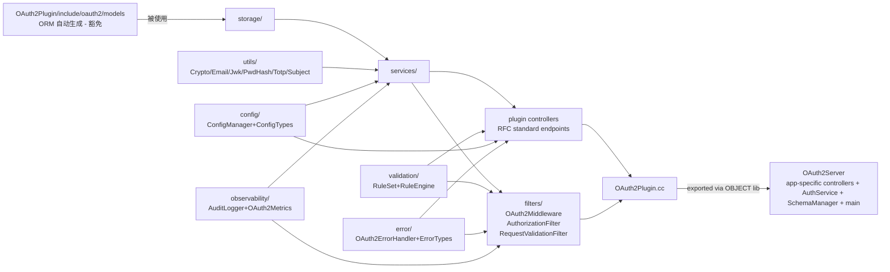

# Design Document: 仓库结构重构 (repo-structure-refactor)

> **Spec 类型 / Spec type**: New Feature (engineering refactor tracked as a feature)
> **工作流 / Workflow**: Design-First with High-Level + Low-Level Design artifacts
> **目标仓库 / Target repository**: `OAuth2-plugin-example`（Drogon C++ OAuth2 Plugin + Server + Admin Vue3 控制台 + Frontend Vue3 用户站点）
> **输出语言**: 中文散文，代码 / 标识符 / 文件路径保持英文。重要章节标题双语。

---

## Overview

本设计文档（`design.md`）规划 `OAuth2-plugin-example` 仓库的结构性重构。改动按 12 个独立可绿（`P0`–`P12`）阶段推进，覆盖：公共头镜像化、验证层 4 类整合、Filter / Middleware 命名统一、Admin / OAuth2 controller 合并与拆分、可观测性子层抽取、CMake 兼容层抽取、部署文件 (`Dockerfile` / `docker-compose*.yml` / `prometheus.yml`) 进入 `deploy/`、Windows/Linux/macOS 脚本对等、文档 kebab-case 重组、`.gitignore` 整合，以及 forwarding shim 的延迟移除。

**关键约束**：Drogon ORM 自动生成的 14 个模型类（`Oauth2*`、`Users`、`Roles`、`Permissions`、`Organizations` 等）严格豁免于命名变更，详见 §0。所有 HTTP 路径、状态码、响应体、RFC 6749/6750/7009/7517/7591/7662/8414/8628 + OIDC Discovery 行为零回归。Linux/macOS/Windows × Debug/Release 的 6 格 ctest 矩阵保留；`scripts/backend/test-{admin,oauth2}-endpoints.{ps1,sh}` 与 OAuth2Admin / OAuth2Frontend Playwright e2e 在每阶段必须通过。

> **本节为 Kiro 规范布局所必需的 Overview 入口；详细内容见后续第 1–17 章。**

## Architecture

整体架构与目标态、依赖方向、跨切关注点布局已在以下章节完整描述：

- **当前态架构图**：见 §2.1 (Mermaid graph)。
- **目标态架构图**：见 §2.2 (Mermaid graph，含模块边界与公共 include 表面)。
- **依赖方向**：见 §2.3 (Plugin / Server / Admin / Frontend 单向依赖；`include/oauth2/**` 严格镜像 `src/**`)。
- **横切关注点（config / error / validation / observability / utils）布局**：见 §2.5。
- **部署 / Docker 重组**：见 §2.6 (`deploy/{docker,observability,env,nginx,keys}/`)。
- **CMake 构建拓扑**：见 §7 (`cmake/Compatibility.cmake`、`cmake/Version.cmake`、OBJECT vs STATIC 决策)。

> **本节为 Kiro 规范布局所必需的 Architecture 入口；详细内容见 §2 与 §7。**

## Components and Interfaces

各组件 / 类的目标 API、命名空间、责任边界与迁移映射在 §6 命名整合章节给出，按组组织：

- **§6.1 Validation 层**：`oauth2::validation::{Rules, RuleEngine, RuleSet, HttpResponder}` + `oauth2::filters::RequestValidationFilter`。
- **§6.2 Filter / Middleware 统一**：`oauth2::filters::{OAuth2AuthFilter, AuthorizationFilter, RequestValidationFilter}`。
- **§6.3 AdminController 合并**：`AdminApiController` + `AdminController` → 单一 `AdminController`（31 个端点）。
- **§6.4 OAuth2Controller 拆分**：`SessionController` + `HealthController` + `UserSelfServiceController::registerUser`；Plugin 侧 `OAuth2StandardController` 维持不变。
- **§6.5 Plugin vs Server 控制器边界规则**。
- **§6.6 Observability 子层**：`AuditLogger`, `OAuth2Metrics`, `OpenApiGenerator` 迁入 `observability/`。
- **§6.7 manage.{ps1,sh} 命令面**：统一 entrypoint。

最终公共 include 树见 §5，文件 / 目录迁移表见 §4。

> **本节为 Kiro 规范布局所必需的 Components and Interfaces 入口；详细内容见 §4–§7。**

## Data Models

本次重构**不修改**任何持久化数据模型 / 数据库 schema / Drogon ORM 类。

- **ORM 模型豁免清单**（14 个类）：见 §0.1（`Oauth2AccessTokens` / `Oauth2Clients` / `Oauth2Codes` / `Oauth2RefreshTokens` / `Oauth2Scopes` / `Oauth2ClientScopes` / `Oauth2SubjectMappings` / `Oauth2UserConsents` / `Organizations` / `Permissions` / `Roles` / `RolePermissions` / `UserRoles` / `Users`）。
- **SQL migrations** (`V001__*.sql` … `V018__*.sql`) 文件名与内容严格冻结，见 §4.2。
- **配置数据结构**：`oauth2::validation::Rule` / `oauth2::validation::Result` / `oauth2::validation::RuleType` 是仅作内存中校验配置的 POD struct / enum，不参与持久化；其重命名映射见 §6.1.5。
- **HTTP API 数据契约**：`OAuth2Server/openapi.yaml` 内容字段不变，仅可能更新 `description` 中的 controller 类名引用，见 §10.2。

> **本节为 Kiro 规范布局所必需的 Data Models 入口；详细内容见 §0、§4.2、§6.1。**

## Error Handling

- **错误处理类的迁移**：`OAuth2Plugin/src/common/error/{ErrorHandler,OAuth2ErrorHandler}.cc` 迁入 `OAuth2Plugin/src/error/`，公共头进入 `include/oauth2/error/`，详见 §4.1.4。
- **HTTP 校验错误响应**：`oauth2::validation::HttpResponder`（前 `ValidationHelper`）统一负责把校验错误转为 HTTP JSON 响应，行为不变，详见 §6.1.3。
- **回滚策略**：每个 phase 都设计为 `git revert` 可独立回滚；forwarding shim 在 P11 之前保护下游，详见 §2.9 风险登记。
- **复审拒绝处理**：reviewer agent 输出以 `REJECTED` 起始时，spec 作者修正后重新提交（§13.4）。
- **Doc 链接误改修复**：自动 sed 脚本仅作用于非 fenced 段，并由 reviewer 手工 review §10.5 列出的散文密集文档。

> **本节为 Kiro 规范布局所必需的 Error Handling 入口；详细内容见 §2.9、§6.1、§13.4。**

## Testing Strategy

完整验证策略见 §12，要点如下：

- **ctest 矩阵**：Linux / macOS / Windows × Debug / Release 共 6 格，命令面 `cmake --build build --config <Cfg> && ctest -C <Cfg> --output-on-failure`。
- **后端 API 测试**：`scripts/backend/test-admin-endpoints.{ps1,sh}` + `test-oauth2-endpoints.{ps1,sh}`，CI 双侧调用并通过 `tools/api-test-coverage-check.py` 校验端点覆盖一致。
- **Playwright e2e**：`OAuth2Admin/tests/e2e/` 与 `OAuth2Frontend/tests/e2e/`，各自由 `npx playwright test` 触发。
- **本地烟测**：见 §12.4（`/health/*`、`/.well-known/*`、`/oauth2/{token,introspect,revoke}`、`/metrics`）。
- **Docker 烟测**：见 §12.5（含 Prometheus 9090 / Admin 8081 / Frontend 8080 / Backend 5555 健康）。
- **阶段验收门**：§12.6 给出每个 P0–P12 阶段必跑测试与通过条件。
- **ORM 不变性**：`./manage.sh generate-models` 后 git diff 仅含时间戳级别变化，否则视为回归，见 §12.7。
- **属性测试 (PBT)**：本次重构本身不引入新业务逻辑，故无新增 PBT；现有测试套件保持。

> **本节为 Kiro 规范布局所必需的 Testing Strategy 入口；详细内容见 §12。**

## Correctness Properties

本次重构本身**不引入新行为**，因此 correctness 等价于「与基线行为完全一致」。下列 8 条可机械验证的属性覆盖 ORM 豁免、HTTP 行为、ctest 集合、Docker 健康、跨平台命令面、文档链接、include 表面与阶段独立绿。每条属性都映射到一个 §12 的具体校验脚本。

### Property 1: ORM 类签名不变 (ORM-exempt symbol stability)

**Validates: Requirements 1.1** (Success Criterion G7 — `generate_models` 重新生成后仅产生时间戳级别差异；§0 ORM 豁免规则)

```pseudocode
FOR each (cls, header, source) IN ORM_EXEMPT_LIST (§0.1):
    ASSERT class_name_unchanged(cls)
    ASSERT public_methods(cls, after) == public_methods(cls, before)
    ASSERT include_path_for(header) == "OAuth2Plugin/include/oauth2/models/"
```
**校验脚本**: `tools/check-orm-exempt.sh`（在每个 phase PR 的 CI 中跑）。

### Property 2: HTTP 端点全集与响应等价 (Endpoint behavior equivalence)

**Validates: Requirements 2.1** (Success Criterion G2 — `test-{admin,oauth2}-endpoints` 通过率 100%；零行为回归约束)

```pseudocode
FOR each endpoint IN baseline_endpoint_list:
    ASSERT endpoint EXISTS in refactored_repo
    FOR each scenario IN scenario_suite[endpoint]:
        ASSERT response.status(after) == response.status(before)
        ASSERT response.headers.content_type(after) == before
        ASSERT response.body.shape(after) == before  // JSON schema-level
```
**校验脚本**: `scripts/backend/test-{admin,oauth2}-endpoints.{ps1,sh}` + 基线快照对比工具 `tools/diff-endpoint-baseline.py`。

### Property 3: ctest 集合不缩减 (ctest test set monotonicity)

**Validates: Requirements 3.1** (Success Criterion G1 — Linux/macOS/Windows × Debug/Release 6 格 ctest 全过)

```pseudocode
ASSERT ctest_test_names(after) ⊇ ctest_test_names(before)
FOR all t IN ctest_test_names(before):
    ASSERT t.passes(after)
```
**校验脚本**: `tools/check-ctest-coverage.sh`（解析 `ctest -N` 输出对比 baseline）。

### Property 4: Docker compose 健康 (Docker stack liveness)

**Validates: Requirements 4.1** (Success Criterion G4 — pure-docker 环境 `docker compose up -d` 后所有 healthcheck 健康，端点 200)

```pseudocode
FOR each compose_file IN {docker-compose.yml, .debug.yml, .prod.yml}:
    ASSERT (docker compose -f deploy/docker/<file> up -d) → all services healthy within 90s
    ASSERT curl /health/ready → 200
    ASSERT curl /metrics → 200
    ASSERT curl /.well-known/openid-configuration → 200
```
**校验脚本**: `scripts/smoke-parity.{sh,ps1}` 与 §12.5 docker 烟测清单。

### Property 5: 跨平台命令面对等 (manage.{ps1,sh} parity)

**Validates: Requirements 5.1** (Success Criterion G5 — Windows-only 脚本均有 `.sh` 等价；manage 入口命令集对等)

```pseudocode
ASSERT command_set(manage.ps1) == command_set(manage.sh)
FOR each cmd IN command_set(manage.sh):
    ASSERT subscript_exists(cmd) on linux
FOR each cmd IN command_set(manage.ps1):
    ASSERT subscript_exists(cmd) on windows
```
**校验脚本**: `tools/manage-parity-check.sh`（CI 在 P8 之后必跑）。

### Property 6: 文档无悬挂引用 (No dangling doc links)

**Validates: Requirements 6.1** (Success Criterion G6 — 重构后所有文档相对引用解析成功，零悬挂)

```pseudocode
FOR each link IN all_markdown_links(repo):
    IF link.is_relative_filesystem_path():
        ASSERT file_exists(link.target)
```
**校验脚本**: `scripts/check-doc-links.sh`（CI 在 P9 之后必跑）。

### Property 7: 公共 include 严格镜像 src (Include layout mirrors src)

**Validates: Requirements 7.1** (目标态架构约束 §2.2 — `include/oauth2/**` 严格镜像 `src/**`，无扁平 `.h`)

```pseudocode
FOR each subdir IN {config, error, utils, validation, services, storage, filters,
                    controllers, models, plugin, types, observability}:
    ASSERT exists(OAuth2Plugin/include/oauth2/<subdir>/)
    // 注意：src/ 下不一定每个 subdir 都有 .cc（如 types/ 仅头），但 include/ 必须存在
ASSERT NOT exists OR contains_only_subdirs(OAuth2Plugin/include/oauth2/*.h)  // 在 P11 后无扁平 .h
```
**校验脚本**: `tools/check-include-mirror.sh`（CI 在 P11 之后必跑）。

### Property 8: 阶段独立绿 (Per-phase atomic greenness)

**Validates: Requirements 8.1** (Success Criterion G8 — 每个迁移阶段结束时 ctest + e2e + docker compose 三项独立通过；§2.8 增量阶段约束)

```pseudocode
FOR each phase P IN [P0..P12]:
    after applying P:
        ASSERT ctest_matrix_passes()  // 6 cells
        ASSERT acceptance_gate(P)     // per §12.6
```
**校验**: §12.6 的 phase gate 表 + CI workflow 在每个 phase PR 上跑全套。

> 详细命令实现与 baseline 快照流程见 §12 验证策略。

---

## 0. ORM 自动生成代码豁免清单 / ORM-Generated Files Exemption (CRITICAL)

> **此规则在整个设计中具有最高优先级，凌驾于"统一命名风格"等其它通用规则之上。**

Drogon 通过 `drogon_ctl create model` 从 PostgreSQL 表名直接生成模型类，类名 = 表名的 CamelCase 化结果。修改这些文件名 / 类名会破坏 ORM 生成器的幂等性，并导致每次重新生成时出现噪声 diff，因此**统一禁止重命名**。

### 0.1 Exempt symbols (ORM 自动生成，禁止重命名)

| 类名 (Class) | 来源表 (Source table) | 头文件 (Header) | 实现 (Source) |
| --- | --- | --- | --- |
| `Oauth2AccessTokens` | `oauth2_access_tokens` | `OAuth2Plugin/include/oauth2/models/Oauth2AccessTokens.h` | `OAuth2Plugin/src/models/Oauth2AccessTokens.cc` |
| `Oauth2Clients` | `oauth2_clients` | `.../models/Oauth2Clients.h` | `.../models/Oauth2Clients.cc` |
| `Oauth2Codes` | `oauth2_codes` | `.../models/Oauth2Codes.h` | `.../models/Oauth2Codes.cc` |
| `Oauth2RefreshTokens` | `oauth2_refresh_tokens` | `.../models/Oauth2RefreshTokens.h` | `.../models/Oauth2RefreshTokens.cc` |
| `Oauth2Scopes` | `oauth2_scopes` | `.../models/Oauth2Scopes.h` | `.../models/Oauth2Scopes.cc` |
| `Oauth2ClientScopes` | `oauth2_client_scopes` | `.../models/Oauth2ClientScopes.h` | `.../models/Oauth2ClientScopes.cc` |
| `Oauth2SubjectMappings` | `oauth2_subject_mappings` | `.../models/Oauth2SubjectMappings.h` | `.../models/Oauth2SubjectMappings.cc` |
| `Oauth2UserConsents` | `oauth2_user_consents` | `.../models/Oauth2UserConsents.h` | `.../models/Oauth2UserConsents.cc` |
| `Organizations` | `organizations` | `.../models/Organizations.h` | `.../models/Organizations.cc` |
| `Permissions` | `permissions` | `.../models/Permissions.h` | `.../models/Permissions.cc` |
| `Roles` | `roles` | `.../models/Roles.h` | `.../models/Roles.cc` |
| `RolePermissions` | `role_permissions` | `.../models/RolePermissions.h` | `.../models/RolePermissions.cc` |
| `UserRoles` | `user_roles` | `.../models/UserRoles.h` | `.../models/UserRoles.cc` |
| `Users` | `users` | `.../models/Users.h` | `.../models/Users.cc` |

### 0.2 Allowed operations on exempt files

- ✅ **可以**整目录搬迁（保持相对结构），如 `OAuth2Plugin/src/models/` → 仍保持在同位置；如有必要可在 include 树下做镜像，但**头文件名、类名、命名空间一律不得修改**。
- ✅ **可以**重新生成（通过 `scripts/backend/generate_models.bat` / 新增的 `generate_models.sh`）。
- ✅ **可以**调整 `model.json` 配置（数据库连接、表过滤），但不能在生成的 `.cc/.h` 内手工修改。
- ❌ **禁止**：重命名类（如 `Oauth2Clients` → `OAuth2Client`）、改命名空间、splitting / merging 模型类、把 ORM 生成头从 `include/oauth2/models/` 移到其它目录然后改 include 路径。

### 0.3 Detection / 防回归

在迁移每一阶段后执行以下校验：
1. `grep -RIn "drogon_model_postgresql_oauth2.* gen by drogon_ctl" OAuth2Plugin/src/models/` 必须命中所有列出的 `.cc` 文件头注释。
2. `scripts/backend/generate_models.bat` / `generate_models.sh` 重新生成后对比 `git diff`，若仅剩时间戳/编译开关相关变更则通过；若出现重命名 / 类签名变更则视为回归。

---

## 1. Goals, Non-Goals, Success Criteria / 目标与非目标

### 1.1 Goals (目标)

1. **可读性**：通过统一命名（除 ORM 豁免）和稳定的目录边界，使新贡献者在 30 分钟内能定位任何 RFC 端点的实现入口。
2. **模块边界清晰**：`OAuth2Plugin`（核心库）、`OAuth2Server`（示例应用）、`OAuth2Admin`（管理控制台）、`OAuth2Frontend`（用户前台）四者依赖方向单向，公共 include 表面 = `OAuth2Plugin/include/oauth2/**` 完整镜像 `src/`。
3. **构建产物一致**：保留当前 `ctest` Debug/Release 矩阵以及 Linux/macOS/Windows CI；保留 docker-compose 三件套（`docker-compose.yml` / `.debug.yml` / `.prod.yml`）。
4. **跨平台脚本平等**：所有 `.bat` / `.ps1` 都有 `.sh` 等价物，且通过 `manage.ps1`（Windows）+ `manage.sh`（Linux/macOS）两套等价 entrypoint 暴露。
5. **零行为回归**：所有 RFC 端点的 path / status code / 响应体保持不变；后台 PowerShell 测试套件、Playwright e2e 全部通过。
6. **文档同步**：所有引用被搬迁路径 / 重命名符号的文档（README / docs / PRD / .agent / .claude / CLAUDE.md / CHANGELOG）同步更新，并通过自动化 grep 验证不存在悬挂引用。

### 1.2 Non-Goals (非目标)

1. **不修改 ORM 自动生成的模型类**（见 §0）。
2. **不引入新的运行期能力**（无新 RFC、无新管理 API、无新 UI 页面）。
3. **不切换主要依赖版本**（Drogon、jsoncpp、OpenSSL、Vue、Vite 保持现版本）。
4. **不重构 SQL migration 历史**（V001-V018 文件名严格保持）。
5. **不调整数据库 schema**（包括字段名、约束）。
6. **不引入 monorepo 工具链**（Nx / Turborepo / Bazel）；保留 CMake + npm 两栈。

### 1.3 Success Criteria (验收标准)

1. **G1 构建绿**：`cmake --build build --config Debug` 和 `Release` 在 Linux / macOS / Windows 上均成功，对应 `ctest -C <Cfg> --output-on-failure` 全部通过。
2. **G2 端点回归**：`scripts/backend/test-oauth2-endpoints.{ps1,sh}` 与 `test-admin-endpoints.{ps1,sh}` 通过率 100%。
3. **G3 Playwright 通过**：`OAuth2Admin/tests/e2e/` 与 `OAuth2Frontend/tests/e2e/` 在重构后的目录布局下全部通过。
4. **G4 双环境启动**：
   - 纯本地：`./manage.ps1 build-backend; ./manage.ps1 test-backend; ./manage.{ps1,sh} run-backend` 启动 server，`/health/ready` 返回 200。
   - 纯 Docker：`docker compose up -d` 启动后所有 `healthcheck` 健康，`http://localhost:8080`、`http://localhost:8081`、`http://localhost:5555/health/ready` 全部 200。
5. **G5 脚本平等**：脚本平等矩阵中所有 Windows 脚本均有 `.sh` 等价物，跨平台烟测脚本 `scripts/smoke-parity.sh` 通过。
6. **G6 文档无悬挂引用**：`grep` 校验脚本（见 §11）在重构后无命中。
7. **G7 ORM 不变性**：`generate_models.{bat,sh}` 重新生成后仅产生时间戳级别差异。
8. **G8 阶段独立绿**：每个迁移阶段（§4）结束时，`ctest` + `e2e` + `docker compose up` 三项独立通过。
9. **G9 Sub-agent 复审**：`design.md` 与 `tasks.md` 各自获得 reviewer agent 一次明确 "APPROVED" 输出。

---

## 2. High-Level Design / 高层设计

### 2.1 Current-State Architecture (当前状态)

```mermaid
graph TD
    subgraph Repo[OAuth2-plugin-example]
        direction TB
        subgraph Code[源代码]
            Plugin[OAuth2Plugin\nOBJECT lib\ninclude/oauth2/**\nsrc/**]
            Server[OAuth2Server\nDrogon app\ncontrollers/, filters/(空), test/]
            Admin[OAuth2Admin\nVue3 控制台\nplaywright e2e]
            FE[OAuth2Frontend\nVue3 用户前台\nplaywright e2e]
        end
        subgraph Infra[基础设施 & 工具]
            CMake[根 CMakeLists.txt\nproject(OAuth2FullProject)]
            Dockerfile[根 Dockerfile\n多 stage]
            DC[docker-compose.yml\n.debug.yml / .prod.yml]
            Prom[prometheus.yml 在根目录]
            Scripts[scripts/ scripts/backend/\n.bat .ps1 .sh 混杂]
            Manage[manage.ps1 仅 Windows]
        end
        subgraph Docs[文档与 PRD]
            Docs1[docs/backend/**\ndocs/superpowers/**]
            PRD[PRD/**\nPRD/superpowers/**]
            Agent[.agent/ .claude/ CLAUDE.md]
            Top[README.md TECH_SPECS.md CHANGELOG.md]
        end
    end

    Server -->|link| Plugin
    Admin -->|HTTP| Server
    FE -->|HTTP| Server
    DC -->|build target| Dockerfile
    Manage -->|invoke| Scripts
    Server -->|reads| PRom_note[(prometheus.yml)]
```

**痛点 (Pain Points)**:
- 公共头根目录扁平：`include/oauth2/*.h` 与子目录 `controllers/`、`filters/`、`models/` 混合，没有按 `src/common/{config,error,utils,validation}` 镜像。
- 命名重叠：`Validator` / `ValidationHelper` / `ValidatorHelper` / `ValidationFilter` 四件套含义模糊；`AuthorizationFilter` / `OAuth2Middleware` 混用 Drogon Filter 与 "Middleware" 两个概念；`AdminController` 与 `AdminApiController` 同时存在；`OAuth2Controller`（Server）与 `OAuth2StandardController`（Plugin）边界不清。
- 部署文件散落根目录：`docker-compose*.yml`、`Dockerfile`、`prometheus.yml`、`.env.docker.example`、`docker-quick-verify-debug.sh` 全在根。
- 脚本不平等：`reset-admin-password.ps1`、`reset-account-lockout.ps1`、`test-admin-endpoints.ps1`、`test-oauth2-endpoints.ps1`、`common-test-functions.ps1`、`generate_models.bat`、`run_server.bat`、`setup_database.bat`、`docker_postgres_*.bat`、`full_test*.bat` 没有 `.sh` 对应物。
- 空目录/孤儿目录：`OAuth2Server/filters/`（空）、`OAuth2Plugin/src/common/types/`（空）、`OAuth2Plugin/models_backup/`（生成器副产品被 ignore 但占用工作树）。
- 文档碎片：`PRD/superpowers/` 与 `docs/superpowers/` 两套并存；`docs/` 内大小写混搭（`ACCOUNT_LOCKOUT.md` / `security-checklist.md`）。

### 2.2 Target-State Architecture (目标状态)

```mermaid
graph TD
    subgraph Repo[OAuth2-plugin-example]
        direction TB
        subgraph Code[源代码 - 模块边界清晰]
            Plugin[OAuth2Plugin\nOBJECT lib\ninclude/oauth2/{config,error,utils,validation,services,storage,filters,controllers,models,plugin,types,observability}\n严格镜像 src/**]
            Server[OAuth2Server\nDrogon app\nsrc/{controllers,filters,services} + sql/ + views/ + test/]
            Admin[OAuth2Admin\n保持现状, README/路径同步]
            FE[OAuth2Frontend\n保持现状, README/路径同步]
        end
        subgraph Infra[基础设施 - 集中化]
            CMake[根 CMakeLists.txt\nproject(oauth2-plugin-example)\ncmake/version.cmake\ncmake/Compatibility.cmake]
            Deploy[deploy/docker/\n  Dockerfile\n  docker-compose.yml\n  docker-compose.debug.yml\n  docker-compose.prod.yml\ndeploy/observability/prometheus.yml\ndeploy/env/.env.docker.example]
            Tools[tools/test/scripts/\n  move_tests.py\n  test_migrate.py\n  naming_validator.sh]
            Scripts[scripts/\n  manage.sh / manage.ps1 一致命令\n  scripts/backend/*.bat *.ps1 *.sh 全套对齐]
        end
        subgraph Docs[文档统一]
            Docs1[docs/\n  backend/, frontend/, admin/, ops/, design/\n  全部 kebab-case]
            PRD[PRD/ 仅保留产品需求文档]
            Agent[.agent/ .claude/ CLAUDE.md\n跟随路径变化更新]
        end
    end

    Server -->|link OAuth2Plugin OBJECT| Plugin
    Admin -->|HTTP| Server
    FE -->|HTTP| Server
    Deploy -->|target=backend-runtime| Plugin
    Deploy -->|build context = repo root| Code
```

**关键变化 (Key Changes)**:
- `include/oauth2/` 严格镜像 `src/`：`config/`、`error/`、`utils/`、`validation/`、`services/`、`storage/`、`filters/`、`controllers/`、`models/`、`plugin/`、`types/`、`observability/`。
- Docker / Compose / Prometheus 统一进 `deploy/`。
- `manage.ps1` 与 `manage.sh` 提供一致的命令子集（`build-backend`、`test-backend`、`run-backend`、`build-frontend`、`docker-up/down`、`generate-models`、`reset-password`、`reset-lockout`、`smoke`）。
- 文档统一进 `docs/{backend,admin,frontend,ops,design}` 下，PRD 仅保留产品需求；`docs/superpowers/` 与 `PRD/superpowers/` 整合到 `docs/design/superpowers/`。

### 2.3 Module Boundaries & Dependency Direction / 模块边界与依赖方向



**依赖规则 (Dependency Rules)**:
1. `OAuth2Plugin` 不依赖 `OAuth2Server`、`OAuth2Admin`、`OAuth2Frontend` 中的任何符号或文件。反向依赖被 CMake target 链关系强制：`target_link_libraries(OAuth2Server PRIVATE OAuth2Plugin)`。
2. `include/oauth2/**` 是 Plugin 的**公共表面**；`src/**` 仅在 Plugin 内部可见（CMake 通过 `PRIVATE` include dir 限制）。
3. `OAuth2Server/controllers/**` 与 `OAuth2Server/filters/**`（搬空目录后填充）只引用 `<oauth2/...>` 公共头与自身文件；不引用 Plugin 私有 `src/` 路径。
4. `OAuth2Admin` / `OAuth2Frontend` 仅通过 HTTP 与 `OAuth2Server` 通信，源码层零依赖。
5. ORM 模型类只允许 `storage/`、`services/` 直接 include；`controllers/` 与 `filters/` 应通过 Service 接口访问。

### 2.4 Naming Conventions / 命名规范（含豁免）

| 范畴 (Scope) | 规则 | 例子 (合规) | 豁免 |
| --- | --- | --- | --- |
| C++ 类名 | UpperCamelCase | `TokenService`, `JwkManager` | ORM 生成类（§0） |
| C++ 文件名 | 与类名一致，`.h`/`.cc` | `TokenService.h` / `TokenService.cc` | ORM 生成文件 |
| C++ 命名空间 | `oauth2::<sublayer>`，sublayer 全小写 | `oauth2::filters`, `oauth2::services` | ORM 生成保留原命名空间 `drogon_model::...` |
| 目录名 (C++) | 全小写，单数 (容器例外用复数) | `services/`, `controllers/`, `models/` | 无 |
| 目录名 (脚本/文档) | kebab-case | `docker-guide.md` | 无 |
| 文档文件名 | kebab-case `.md` | `account-lockout.md` | `README.md`, `CHANGELOG.md`, `LICENSE`, `CLAUDE.md`, `MEMORY.md`, `SKILL.md`, `POWER.md`（生态约定保留） |
| 脚本文件名 | kebab-case，名词-动词倒装 | `build-backend.sh` | 现存 `.bat` 因 Windows cmd 兼容保留下划线 |
| CMake target | UpperCamelCase | `OAuth2Plugin`, `OAuth2Server` | 无 |
| Docker image | kebab-case，仓库名前缀 | `oauth2-plugin/backend-runtime` | 无 |
| Docker service | kebab-case | `oauth2-backend`, `oauth2-postgres` | 无 |

### 2.5 Cross-Cutting Concerns Layout / 横切关注点布局

| 关注点 | 当前位置 | 目标位置 |
| --- | --- | --- |
| 配置 (Config) | `OAuth2Plugin/src/common/config/ConfigManager.cc` + `include/oauth2/{ConfigManager,ConfigTypes}.h` | `src/config/`, `include/oauth2/config/` |
| 错误处理 | `src/common/error/{ErrorHandler,OAuth2ErrorHandler}.cc` + 散落 include | `src/error/`, `include/oauth2/error/` |
| 验证 | `src/common/validation/{Validator,ValidationHelper,ValidatorHelper}.cc` + `filters/ValidationFilter.cc` | `src/validation/{rules,engine,http}` + `src/filters/RequestValidationFilter.cc`（详见 §6.1） |
| 日志/审计 | `src/common/AuditLogger.cc` + `include/oauth2/AuditLogger.h` | `src/observability/AuditLogger.cc`，`include/oauth2/observability/AuditLogger.h` |
| 指标 | `src/common/OAuth2Metrics.cc` + `include/oauth2/OAuth2Metrics.h` | `src/observability/OAuth2Metrics.cc`，`include/oauth2/observability/OAuth2Metrics.h`；prometheus 配置进 `deploy/observability/prometheus.yml` |
| 通用工具 | `src/common/utils/{EmailService,JwkManager,PasswordHasher,TotpUtils}.cc` + 多个 include | `src/utils/`, `include/oauth2/utils/` |
| 文档生成 | `src/common/documentation/OpenApiGenerator.cc` + `include/oauth2/OpenApiGenerator.h` | `src/observability/openapi/OpenApiGenerator.cc`（`OpenApiGenerator` 既不属于 utils 也不是横切，归档至 observability 子层下的 `openapi/`），`include/oauth2/observability/openapi/OpenApiGenerator.h` |
| 配置秘密 | `OAuth2Server/.env.example`、`.env.docker.example` 在根 | `deploy/env/{server.env.example,docker.env.example}` |
| Compat (MSVC FI / codecvt 等) | 写在 `OAuth2Plugin/CMakeLists.txt` & `OAuth2Server/CMakeLists.txt` | 抽取到 `cmake/Compatibility.cmake`，由两侧 `include(Compatibility)` 复用 |

### 2.6 Deployment / Docker Reorganization / 部署重组

目标布局：

```
deploy/
├── docker/
│   ├── Dockerfile                       # 来自 ./Dockerfile
│   ├── docker-compose.yml               # 来自 ./docker-compose.yml
│   ├── docker-compose.debug.yml         # 来自 ./docker-compose.debug.yml
│   ├── docker-compose.prod.yml          # 来自 ./docker-compose.prod.yml
│   ├── docker-quick-verify-debug.sh     # 来自 ./docker-quick-verify-debug.sh
│   └── .dockerignore                    # 来自 ./.dockerignore（保留根级软链或副本）
├── env/
│   ├── docker.env.example               # 来自 ./.env.docker.example
│   └── server.env.example               # 来自 OAuth2Server/.env.example
├── observability/
│   └── prometheus.yml                   # 来自 ./prometheus.yml
├── nginx/
│   ├── nginx.conf                       # 不动
│   └── ssl/                             # 不动
└── keys/
    └── .gitkeep                         # 不动
```

**关键迁移规则**:
1. **Build context 不变**：`docker compose -f deploy/docker/docker-compose.yml build` 仍以仓库根为 build context（compose 文件内显式 `context: ../..`）；这样 `Dockerfile COPY .` 行为完全一致。
2. **`docker compose` 入口**：在根目录提供软入口 `manage.{ps1,sh} docker-up` 实际调用 `docker compose -f deploy/docker/docker-compose.yml --project-directory . up -d`，保持用户可用的 working directory 不变。
3. **`prometheus.yml` 路径**：compose 中 volume 由 `./prometheus.yml:/etc/prometheus/prometheus.yml` → `../observability/prometheus.yml:/etc/prometheus/prometheus.yml`。
4. **`.dockerignore`**：根目录保留一份只含 "redirect to deploy/docker" 注释的副本不可行（Docker 不支持），所以**根级 `.dockerignore` 保留实体内容**；`deploy/docker/.dockerignore` 是其只读镜像；CI 在 P7 之后引入 `tools/check-dockerignore-sync.sh` 校验二者一致。
5. **`docker-quick-verify-debug.sh`**：移至 `deploy/docker/`，并在 `scripts/` 增 `verify-docker.sh` 作为小型 wrapper（保留旧调用面的别名）。

### 2.7 Documentation Reorganization / 文档重组

**目标**：消除 `docs/` 与 `PRD/` 之间的语义重叠，确保单一真相源。

| 目录 | 用途 | 内容 |
| --- | --- | --- |
| `PRD/` | 产品需求 / 项目阶段计划 | 保留 `admin_console_design.md`、`frontend_design.md`、`production_hardening_*.md`、`PROGRESS.md` 等所有现有 md。这些是已发布产品历史，不重组内部结构。 |
| `docs/backend/` | 后端工程文档 | API 参考、架构、CI/CD、部署、测试指南 |
| `docs/admin/` | 管理控制台文档 | 来自 `OAuth2Admin/docs/E2E_TESTING_GUIDE.md` 等 |
| `docs/frontend/` | 前台文档 | 来自 `OAuth2Frontend/docs/{DESIGN,IMPLEMENTATION_PLAN}.md` |
| `docs/ops/` | 运维 / 部署 | `account-lockout.md`、`deployment.md`、`security-checklist.md`（来自 `docs/` 根） |
| `docs/design/` | 通用设计文档 | 接收 `docs/superpowers/`、`PRD/superpowers/`（合并去重，保留唯一一份） |
| `.agent/` `.claude/` | Agent 工作流 | 不重组，但所有 path 引用需 sync |

**文件名规范转换**:
- 大写 `.md` 文件名（如 `ACCOUNT_LOCKOUT.md`、`DEPLOYMENT.md`）改为 kebab-case（`account-lockout.md`、`deployment.md`）。
- 蛇形命名（如 `api_reference.md`、`docker_deployment.md`）改为 kebab-case（`api-reference.md`、`docker-deployment.md`）。
- 例外（保留生态约定）：`README.md`、`CHANGELOG.md`、`LICENSE`、`CLAUDE.md`、`MEMORY.md`、`SKILL.md`、`POWER.md`、`PROGRESS.md`、`TECH_SPECS.md`。

**Cross-link 更新策略**：见 §10「文档更新计划」。

### 2.8 Migration Phases / 迁移阶段（增量、阶段独立绿）

每一阶段结束时仓库必须同时满足：`ctest` 通过、Playwright e2e 通过、`docker compose up -d` 健康。**严禁单次大爆炸式提交**。

| Phase | 主题 | 范围（粗粒度） | 验收 (Gate) |
| --- | --- | --- | --- |
| **P0** | 基线快照 | 不修改源代码；建立 `tools/refactor-baseline/` 收集当前 ctest/e2e 输出与 SHA-256；冻结 `git tag refactor-baseline`。 | baseline 文件存在；`tag` 推送成功 |
| **P1** | 公共头镜像化 | `include/oauth2/{config,error,utils,validation,services}` 子目录建立，把扁平头按归属移入；保留旧头作为 forwarding shim 一段过渡期。 | G1, G2 |
| **P2** | observability 抽取 | 把 `AuditLogger` 与 `OAuth2Metrics` 从 `src/common/` 与扁平 include 移到 `src/observability/` + `include/oauth2/observability/`；`OpenApiGenerator` 同步迁入 `observability/openapi/`。 | G1, G2 |
| **P3** | 验证层整合 | 执行 §6.1 的 Validator/ValidationHelper/ValidatorHelper/ValidationFilter 整合，落地 `oauth2::validation::{Rule,RuleSet,RuleEngine,HttpResponder}` 与 `RequestValidationFilter`。保留旧符号 typedef shim 一段过渡期。 | G1, G2 |
| **P4** | Filter / Middleware 边界 | 执行 §6.2：`OAuth2Middleware` → `OAuth2AuthFilter`（命名空间 `oauth2::filters`），`AuthorizationFilter` → `AuthorizationFilter`（保留名称）。统一 Drogon Filter 模式，删除 "Middleware" 概念。 | G1, G2, G3 |
| **P5** | Server controllers 整合 | 执行 §6.3 / §6.4：`AdminController` 合并入 `AdminApiController`（再重命名为 `AdminController`），`OAuth2Controller`（Server）改名 `SessionController`，与 `OAuth2StandardController`（Plugin）建立明确分工。 | G1, G2, G3 |
| **P6** | CMake / 构建基础设施 | 抽取 `cmake/Compatibility.cmake`、`cmake/version.cmake`；`project()` 重命名；清理 `include_directories`；`drogon_create_views` 路径如未变则保留；`OAuth2Server/test/scripts/` → `tools/test/`。 | G1, G2, G3 |
| **P7** | 部署文件搬迁 | `Dockerfile`、`docker-compose*.yml`、`prometheus.yml`、`.env.docker.example`、`docker-quick-verify-debug.sh` → `deploy/`；`manage.{ps1,sh}` 调整调用路径；`docker compose` 仍以仓库根为 working directory。 | G4 |
| **P8** | 脚本平等 | 为每个 `.bat/.ps1` 补齐 `.sh`；引入 `manage.sh`；统一脚本目录命名。 | G5 |
| **P9** | 文档重组 + 引用修复 | 执行 §10：`docs/` 子目录化、kebab-case 重命名、`PRD/superpowers/` 与 `docs/superpowers/` 合并到 `docs/design/superpowers/`。批量 search/replace 引用。 | G6 |
| **P10** | .gitignore 与工作树清理 | 合并 `.gitignore`；删除 `OAuth2Plugin/models_backup/`（如存在）、空目录、被 ignore 但已跟踪的 logs/uploads。 | G1, G2, G3, G4 |
| **P11** | Forwarding shim 移除 | 删除 P1/P3/P4/P5 的过渡 shim；解除 typedef；最终类名 / 路径定型。 | G1, G2, G3 |
| **P12** | 最终复审 | sub-agent reviewer 复审 `design.md` + 实施得到的 `tasks.md` + 仓库 final state。 | G9 |

### 2.9 Risk Register & Rollback Strategy / 风险登记与回滚

| ID | 风险 | 影响 | 概率 | 缓解 | 回滚 |
| --- | --- | --- | --- | --- | --- |
| R1 | ORM 模型被错误重命名 | 编译失败 + 生成器幂等性丢失 | 中 | §0 显式豁免，`generate_models` 重跑作为合并门 | revert phase commit；保留 baseline tag |
| R2 | 公共 include 路径变更导致下游无法编译 | 阻塞 CI | 中 | P1 保留 forwarding shim；P11 才删除 | shim 复活：在 P11 之前的任意 phase 都可 revert |
| R3 | docker compose path 变化破坏 `prometheus.yml` 挂载 | metrics 端点失败 | 低 | P7 烟测 `/metrics` 端点 | git revert P7 |
| R4 | `manage.ps1` / `manage.sh` 命令面不一致 | 跨平台用户体验割裂 | 中 | P8 时同一 PR 提交两个文件，提供 `tools/manage-parity-check.sh` | revert P8 |
| R5 | 文档批量 sed 误改 fenced code block 内的路径 | 文档失真 | 中 | §10 的 search/replace 仅作用于非 code block；建立 white-list；commit 阶段人工 review diff | per-doc revert |
| R6 | `OAuth2Middleware` 命名空间内类删除导致用户代码 break | 第三方集成回归 | 低（仅 demo 工程） | P4 保留 `OAuth2Middleware` 作为 typedef alias 直到 P11 | typedef 撤销 |
| R7 | `AdminController` 合并破坏前端 e2e | OAuth2Admin 登录后无 dashboard | 中 | P5 保留 `/api/admin/dashboard` 路由；e2e 在 PR 内必跑 | revert P5 |
| R8 | `cmake/Compatibility.cmake` MSVC `/FI` 路径误写 | Windows 构建失败 | 中 | P6 在 Windows runner 必跑 | revert P6 |
| R9 | `.gitignore` 误把生成模型纳入忽略 | 生成失败被 git 静默 | 中 | P10 验证 `git status` 在 `generate_models` 后无新增 ignored 警告 | revert P10 |
| R10 | Reviewer agent 误判设计 | 误阻塞 | 低 | §12 reviewer 必须给出可操作 checklist；可由人复核否决 | 人工 override |

---

## 3. Low-Level Design / 低层设计


### 3.0 Migration Table Conventions / 迁移表约定

- **Action 列**取值：`move`（仅搬迁）、`rename`（重命名 + 搬迁）、`split`（拆为多个目标）、`merge`（多源合一）、`delete`（删除）、`new`（新建）、`exempt`（明确豁免，列出原位置）。
- 所有目标路径相对于仓库根。
- 所有标记 `exempt` 的条目同时受 §0 约束。
- "Phase" 列对应 §2.8 的阶段编号；`-` 表示该项跨多 Phase。

---

## 4. File / Directory Migration Table / 文件目录迁移表

### 4.1 OAuth2Plugin core lib

#### 4.1.1 ORM-generated models (EXEMPT)

| Source | Destination | Action | Phase | Notes |
| --- | --- | --- | --- | --- |
| `OAuth2Plugin/src/models/Oauth2AccessTokens.{h,cc}` | unchanged | exempt | - | ORM gen |
| `OAuth2Plugin/src/models/Oauth2Clients.{h,cc}` | unchanged | exempt | - | ORM gen |
| `OAuth2Plugin/src/models/Oauth2Codes.{h,cc}` | unchanged | exempt | - | ORM gen |
| `OAuth2Plugin/src/models/Oauth2RefreshTokens.{h,cc}` | unchanged | exempt | - | ORM gen |
| `OAuth2Plugin/src/models/Oauth2Scopes.{h,cc}` | unchanged | exempt | - | ORM gen |
| `OAuth2Plugin/src/models/Oauth2ClientScopes.{h,cc}` | unchanged | exempt | - | ORM gen |
| `OAuth2Plugin/src/models/Oauth2SubjectMappings.{h,cc}` | unchanged | exempt | - | ORM gen |
| `OAuth2Plugin/src/models/Oauth2UserConsents.{h,cc}` | unchanged | exempt | - | ORM gen |
| `OAuth2Plugin/src/models/Organizations.{h,cc}` | unchanged | exempt | - | ORM gen |
| `OAuth2Plugin/src/models/Permissions.{h,cc}` | unchanged | exempt | - | ORM gen |
| `OAuth2Plugin/src/models/Roles.{h,cc}` | unchanged | exempt | - | ORM gen |
| `OAuth2Plugin/src/models/RolePermissions.{h,cc}` | unchanged | exempt | - | ORM gen |
| `OAuth2Plugin/src/models/UserRoles.{h,cc}` | unchanged | exempt | - | ORM gen |
| `OAuth2Plugin/src/models/Users.{h,cc}` | unchanged | exempt | - | ORM gen |
| `OAuth2Plugin/src/models/model.json` | unchanged | exempt | - | ORM gen config |
| `OAuth2Plugin/src/models/model-postgresql.json` | unchanged | exempt | - | ORM gen config |
| `OAuth2Plugin/src/models/.clang-format` | unchanged | exempt | - | format opt-out |
| `OAuth2Plugin/include/oauth2/models/*.h` | unchanged | exempt | - | ORM gen public headers |

#### 4.1.2 Plugin entry & cleanup service

| Source | Destination | Action | Phase | Notes |
| --- | --- | --- | --- | --- |
| `OAuth2Plugin/src/OAuth2Plugin.cc` | `OAuth2Plugin/src/plugin/OAuth2Plugin.cc` | move | P1 | 与 include 镜像 |
| `OAuth2Plugin/src/OAuth2CleanupService.cc` | `OAuth2Plugin/src/plugin/OAuth2CleanupService.cc` | move | P1 | 同上 |
| `OAuth2Plugin/include/oauth2/OAuth2Plugin.h` | `OAuth2Plugin/include/oauth2/plugin/OAuth2Plugin.h` | move | P1 | shim 暂留 |
| `OAuth2Plugin/include/oauth2/OAuth2CleanupService.h` | `OAuth2Plugin/include/oauth2/plugin/OAuth2CleanupService.h` | move | P1 | shim 暂留 |
| `OAuth2Plugin/include/oauth2/OAuth2Types.h` | `OAuth2Plugin/include/oauth2/types/OAuth2Types.h` | move | P1 | |
| `OAuth2Plugin/include/oauth2/orm_compat.h` | `OAuth2Plugin/include/oauth2/types/orm_compat.h` | move | P1 | CMake `/FI` 路径同步更新 |

#### 4.1.3 Config layer

| Source | Destination | Action | Phase |
| --- | --- | --- | --- |
| `OAuth2Plugin/src/common/config/ConfigManager.cc` | `OAuth2Plugin/src/config/ConfigManager.cc` | move | P1 |
| `OAuth2Plugin/include/oauth2/ConfigManager.h` | `OAuth2Plugin/include/oauth2/config/ConfigManager.h` | move | P1 |
| `OAuth2Plugin/include/oauth2/ConfigTypes.h` | `OAuth2Plugin/include/oauth2/config/ConfigTypes.h` | move | P1 |

#### 4.1.4 Error layer

| Source | Destination | Action | Phase |
| --- | --- | --- | --- |
| `OAuth2Plugin/src/common/error/ErrorHandler.cc` | `OAuth2Plugin/src/error/ErrorHandler.cc` | move | P1 |
| `OAuth2Plugin/src/common/error/OAuth2ErrorHandler.cc` | `OAuth2Plugin/src/error/OAuth2ErrorHandler.cc` | move | P1 |
| `OAuth2Plugin/include/oauth2/ErrorHandler.h` | `OAuth2Plugin/include/oauth2/error/ErrorHandler.h` | move | P1 |
| `OAuth2Plugin/include/oauth2/OAuth2ErrorHandler.h` | `OAuth2Plugin/include/oauth2/error/OAuth2ErrorHandler.h` | move | P1 |
| `OAuth2Plugin/include/oauth2/ErrorTypes.h` | `OAuth2Plugin/include/oauth2/error/ErrorTypes.h` | move | P1 |

#### 4.1.5 Utils layer

| Source | Destination | Action | Phase |
| --- | --- | --- | --- |
| `OAuth2Plugin/src/common/utils/EmailService.cc` | `OAuth2Plugin/src/utils/EmailService.cc` | move | P1 |
| `OAuth2Plugin/src/common/utils/JwkManager.cc` | `OAuth2Plugin/src/utils/JwkManager.cc` | move | P1 |
| `OAuth2Plugin/src/common/utils/PasswordHasher.cc` | `OAuth2Plugin/src/utils/PasswordHasher.cc` | move | P1 |
| `OAuth2Plugin/src/common/utils/TotpUtils.cc` | `OAuth2Plugin/src/utils/TotpUtils.cc` | move | P1 |
| `OAuth2Plugin/include/oauth2/CryptoUtils.h` | `OAuth2Plugin/include/oauth2/utils/CryptoUtils.h` | move | P1 |
| `OAuth2Plugin/include/oauth2/EmailService.h` | `OAuth2Plugin/include/oauth2/utils/EmailService.h` | move | P1 |
| `OAuth2Plugin/include/oauth2/JwkManager.h` | `OAuth2Plugin/include/oauth2/utils/JwkManager.h` | move | P1 |
| `OAuth2Plugin/include/oauth2/PasswordHasher.h` | `OAuth2Plugin/include/oauth2/utils/PasswordHasher.h` | move | P1 |
| `OAuth2Plugin/include/oauth2/SubjectGenerator.h` | `OAuth2Plugin/include/oauth2/utils/SubjectGenerator.h` | move | P1 |
| `OAuth2Plugin/include/oauth2/TotpUtils.h` | `OAuth2Plugin/include/oauth2/utils/TotpUtils.h` | move | P1 |

#### 4.1.6 Validation layer (consolidation - see §6.1)

| Source | Destination | Action | Phase |
| --- | --- | --- | --- |
| `OAuth2Plugin/src/common/validation/Validator.cc` | `OAuth2Plugin/src/validation/RuleEngine.cc` | rename + split | P3 |
| `OAuth2Plugin/src/common/validation/ValidationHelper.cc` | `OAuth2Plugin/src/validation/HttpResponder.cc` | rename | P3 |
| `OAuth2Plugin/src/common/validation/ValidatorHelper.cc` | `OAuth2Plugin/src/validation/RuleSet.cc` | rename + merge | P3 |
| `OAuth2Plugin/include/oauth2/Validator.h` | `OAuth2Plugin/include/oauth2/validation/RuleEngine.h` | rename | P3 |
| `OAuth2Plugin/include/oauth2/ValidationHelper.h` | `OAuth2Plugin/include/oauth2/validation/HttpResponder.h` | rename | P3 |
| `OAuth2Plugin/include/oauth2/ValidatorHelper.h` | `OAuth2Plugin/include/oauth2/validation/RuleSet.h` | rename | P3 |
| `OAuth2Plugin/include/oauth2/ValidationRules.h` | `OAuth2Plugin/include/oauth2/validation/Rules.h` | rename | P3 |

#### 4.1.7 Services layer

| Source | Destination | Action | Phase |
| --- | --- | --- | --- |
| `OAuth2Plugin/src/services/ClientService.cc` | unchanged path 但 include 调整 | move (within) | P1 |
| `OAuth2Plugin/src/services/IdentityService.cc` | unchanged | move | P1 |
| `OAuth2Plugin/src/services/TokenService.cc` | unchanged | move | P1 |
| `OAuth2Plugin/include/oauth2/ClientService.h` | `OAuth2Plugin/include/oauth2/services/ClientService.h` | move | P1 |
| `OAuth2Plugin/include/oauth2/IdentityService.h` | `OAuth2Plugin/include/oauth2/services/IdentityService.h` | move | P1 |
| `OAuth2Plugin/include/oauth2/TokenService.h` | `OAuth2Plugin/include/oauth2/services/TokenService.h` | move | P1 |

#### 4.1.8 Storage layer

**Rationale (公开化原因)**: 下游 consumer（如 Server 自定义 storage 子类、第三方集成测试）需要看到具体类型；将 `Cached/Memory/Postgres/Redis OAuth2Storage.h` 提升到 `include/oauth2/storage/` 是为了让 `IOAuth2Storage` 接口与具体实现一同公开，避免下游无法链接到具体类型符号。

| Source | Destination | Action | Phase |
| --- | --- | --- | --- |
| `OAuth2Plugin/include/oauth2/IOAuth2Storage.h` | `OAuth2Plugin/include/oauth2/storage/IOAuth2Storage.h` | move | P1 |
| `OAuth2Plugin/src/storage/CachedOAuth2Storage.h` | `OAuth2Plugin/include/oauth2/storage/CachedOAuth2Storage.h` | move | P1 |
| `OAuth2Plugin/src/storage/MemoryOAuth2Storage.h` | `OAuth2Plugin/include/oauth2/storage/MemoryOAuth2Storage.h` | move | P1 |
| `OAuth2Plugin/src/storage/PostgresOAuth2Storage.h` | `OAuth2Plugin/include/oauth2/storage/PostgresOAuth2Storage.h` | move | P1 |
| `OAuth2Plugin/src/storage/RedisOAuth2Storage.h` | `OAuth2Plugin/include/oauth2/storage/RedisOAuth2Storage.h` | move | P1 |
| `OAuth2Plugin/src/storage/CachedOAuth2Storage.cc` | unchanged | move (no path change) | P1 |
| `OAuth2Plugin/src/storage/MemoryOAuth2Storage.cc` | unchanged | move | P1 |
| `OAuth2Plugin/src/storage/PostgresOAuth2Storage.cc` | unchanged | move | P1 |
| `OAuth2Plugin/src/storage/RedisOAuth2Storage.cc` | unchanged | move | P1 |

#### 4.1.9 Filters layer (consolidation - see §6.2)

| Source | Destination | Action | Phase |
| --- | --- | --- | --- |
| `OAuth2Plugin/src/filters/OAuth2Middleware.cc` | `OAuth2Plugin/src/filters/OAuth2AuthFilter.cc` | rename | P4 |
| `OAuth2Plugin/include/oauth2/filters/OAuth2Middleware.h` | `OAuth2Plugin/include/oauth2/filters/OAuth2AuthFilter.h` | rename | P4 |
| `OAuth2Plugin/src/filters/AuthorizationFilter.cc` | unchanged | move | P4 |
| `OAuth2Plugin/include/oauth2/filters/AuthorizationFilter.h` | unchanged | move | P4 |
| `OAuth2Plugin/src/filters/ValidationFilter.cc` | `OAuth2Plugin/src/filters/RequestValidationFilter.cc` | rename | P3/P4 |
| `OAuth2Plugin/include/oauth2/filters/ValidationFilter.h` | `OAuth2Plugin/include/oauth2/filters/RequestValidationFilter.h` | rename | P3/P4 |

#### 4.1.10 Controllers layer (Plugin)

| Source | Destination | Action | Phase |
| --- | --- | --- | --- |
| `OAuth2Plugin/src/controllers/OAuth2StandardController.cc` | unchanged path | move | P1 |
| `OAuth2Plugin/include/oauth2/controllers/OAuth2StandardController.h` | unchanged path | move | P1 |

#### 4.1.11 Observability layer (new)

| Source | Destination | Action | Phase |
| --- | --- | --- | --- |
| `OAuth2Plugin/src/common/AuditLogger.cc` | `OAuth2Plugin/src/observability/AuditLogger.cc` | move | P2 |
| `OAuth2Plugin/include/oauth2/AuditLogger.h` | `OAuth2Plugin/include/oauth2/observability/AuditLogger.h` | move | P2 |
| `OAuth2Plugin/src/common/OAuth2Metrics.cc` | `OAuth2Plugin/src/observability/OAuth2Metrics.cc` | move | P2 |
| `OAuth2Plugin/include/oauth2/OAuth2Metrics.h` | `OAuth2Plugin/include/oauth2/observability/OAuth2Metrics.h` | move | P2 |
| `OAuth2Plugin/src/common/documentation/OpenApiGenerator.cc` | `OAuth2Plugin/src/observability/openapi/OpenApiGenerator.cc` | move | P2 |
| `OAuth2Plugin/include/oauth2/OpenApiGenerator.h` | `OAuth2Plugin/include/oauth2/observability/openapi/OpenApiGenerator.h` | move | P2 |

#### 4.1.12 Empty / orphan removals

| Source | Destination | Action | Phase | Notes |
| --- | --- | --- | --- | --- |
| `OAuth2Plugin/src/common/types/` (empty) | (none) | delete | P10 | confirmed empty |
| `OAuth2Plugin/src/common/` (final state empty after P1-P2) | (none) | delete | P10 | 仅当所有子项均迁出后 |
| `OAuth2Plugin/src/common/documentation/` (empty after P2) | (none) | delete | P10 | |
| `OAuth2Plugin/models_backup/` (if present) | (none) | delete | P10 | 已被 ignore 但需确保工作树无残留 |
| `OAuth2Server/filters/` (empty) | `OAuth2Server/filters/.gitkeep` | new | P5 | 保留作为后续 server-only filter 的占位 |

### 4.2 OAuth2Server

| Source | Destination | Action | Phase | Notes |
| --- | --- | --- | --- | --- |
| `OAuth2Server/main.cc` | unchanged | - | - | |
| `OAuth2Server/AuthService.{h,cc}` | unchanged | - | - | server-local service，命名不冲突 |
| `OAuth2Server/SchemaManager.{h,cc}` | unchanged | - | - | server-local |
| `OAuth2Server/controllers/AdminController.{h,cc}` | merge into `AdminApiController` 然后整体 rename | merge + rename | P5 | 见 §6.3 |
| `OAuth2Server/controllers/AdminApiController.{h,cc}` | `OAuth2Server/controllers/AdminController.{h,cc}` | rename (after merge) | P5 | 见 §6.3 |
| `OAuth2Server/controllers/OAuth2Controller.{h,cc}` | `OAuth2Server/controllers/SessionController.{h,cc}` | rename | P5 | 见 §6.4 |
| `OAuth2Server/controllers/ApiDocController.{h,cc}` | unchanged | - | - | |
| `OAuth2Server/controllers/ClientRegistrationController.{h,cc}` | unchanged | - | - | RFC 7591 |
| `OAuth2Server/controllers/DeviceAuthController.{h,cc}` | unchanged | - | - | RFC 8628 |
| `OAuth2Server/controllers/EmailVerificationController.{h,cc}` | unchanged | - | - | |
| `OAuth2Server/controllers/GitHubController.{h,cc}` | unchanged | - | - | |
| `OAuth2Server/controllers/GoogleController.{h,cc}` | unchanged | - | - | |
| `OAuth2Server/controllers/MfaController.{h,cc}` | unchanged | - | - | |
| `OAuth2Server/controllers/OrganizationController.{h,cc}` | unchanged | - | - | |
| `OAuth2Server/controllers/PasswordResetController.{h,cc}` | unchanged | - | - | |
| `OAuth2Server/controllers/UserSelfServiceController.{h,cc}` | unchanged | - | - | |
| `OAuth2Server/controllers/WebAuthnController.{h,cc}` | unchanged | - | - | |
| `OAuth2Server/controllers/WeChatController.{h,cc}` | unchanged | - | - | |
| `OAuth2Server/views/{login.csp,consent.csp}` | unchanged | - | - | drogon_create_views 路径不变 |
| `OAuth2Server/test/scripts/{move_tests.py,test_migrate.py,naming_validator.sh}` | `tools/test/scripts/...` | move | P6 | 测试基础设施工具不应在 product test 目录 |
| `OAuth2Server/openapi.yaml` | unchanged | - | - | |
| `OAuth2Server/model.json` | unchanged | - | - | server-side ORM gen 入口 |
| `OAuth2Server/config{,.ci,.dev,.prod}.json` | unchanged | - | - | |
| `OAuth2Server/sql/migrations/V*.sql` | unchanged | - | - | 历史不可改 |
| `OAuth2Server/sql/seed/*.sql` | unchanged | - | - | |
| `OAuth2Server/.env.example` | `deploy/env/server.env.example` | move | P7 | 同时在 OAuth2Server/ 留 README 指向新位置 |
| `OAuth2Server/.dockerignore` | unchanged | - | - | local override 仍需在原位 |
| `OAuth2Server/logs/` (运行期) | (none in repo) | delete-ignore | P10 | `.gitignore` 已忽略；确保工作树无 |
| `OAuth2Server/uploads/` (运行期) | (none in repo) | delete-ignore | P10 | 同上 |

### 4.3 Root-level deployment files

| Source | Destination | Action | Phase |
| --- | --- | --- | --- |
| `Dockerfile` | `deploy/docker/Dockerfile` | move | P7 |
| `docker-compose.yml` | `deploy/docker/docker-compose.yml` | move | P7 |
| `docker-compose.debug.yml` | `deploy/docker/docker-compose.debug.yml` | move | P7 |
| `docker-compose.prod.yml` | `deploy/docker/docker-compose.prod.yml` | move | P7 |
| `docker-quick-verify-debug.sh` | `deploy/docker/docker-quick-verify-debug.sh` | move | P7 |
| `prometheus.yml` | `deploy/observability/prometheus.yml` | move | P7 |
| `.env.docker.example` | `deploy/env/docker.env.example` | move | P7 |
| `.dockerignore` | unchanged | - | - | Docker 要求在 build context 根 |
| `.dockerignore` (root) | `deploy/docker/.dockerignore` | new | P7 | Mirror of root `.dockerignore`; CI step `tools/check-dockerignore-sync.sh` (added in P7) ensures byte-identical content |

### 4.4 CMake / 构建基础设施

| Source | Destination | Action | Phase |
| --- | --- | --- | --- |
| `CMakeLists.txt` (root) | unchanged，但内容更新 | edit | P6 |
| (new) | `cmake/Compatibility.cmake` | new | P6 |
| (new) | `cmake/Version.cmake` | new | P6 |
| `OAuth2Plugin/CMakeLists.txt` | edit (include subdir cleanup, includes Compatibility) | edit | P6 |
| `OAuth2Server/CMakeLists.txt` | edit (includes Compatibility, includes Version) | edit | P6 |
| `OAuth2Server/test/CMakeLists.txt` | edit (paths to tools/test/) | edit | P6 |

### 4.5 Scripts

详见 §9 平等矩阵；此处仅列搬迁与增项。

| Source | Destination | Action | Phase |
| --- | --- | --- | --- |
| `manage.ps1` | unchanged path，内容跟随脚本搬迁 | edit | P7/P8 |
| (new) | `manage.sh` | new | P8 |
| `scripts/cleanup-docker.sh` | unchanged | - | - |
| `scripts/emoji_manager.py` | unchanged | - | - |
| `scripts/generate-certs.sh` | unchanged | - | - |
| `scripts/generate-jwt-keys.sh` | unchanged | - | - |
| `scripts/security-check.sh` | unchanged | - | - |
| `scripts/test-frontend-url-config.sh` | unchanged | - | - |
| `scripts/backend/build.{bat,sh}` | unchanged | - | - |
| `scripts/backend/test.bat` | unchanged + add `test.sh` | new | P8 |
| `scripts/backend/run_server.bat` | unchanged + add `run-server.sh` | new | P8 |
| `scripts/backend/setup_database.bat` | unchanged + add `setup-database.sh` | new | P8 |
| `scripts/backend/generate_models.bat` | unchanged + add `generate-models.sh` | new | P8 |
| `scripts/backend/full_test.bat` | unchanged + add `full-test.sh` | new | P8 |
| `scripts/backend/full_test_docker.bat` | unchanged + add `full-test-docker.sh` | new | P8 |
| `scripts/backend/docker_postgres_start.bat` | unchanged + add `docker-postgres-start.sh` | new | P8 |
| `scripts/backend/docker_postgres_stop.bat` | unchanged + add `docker-postgres-stop.sh` | new | P8 |
| `scripts/backend/env_setup.bat` | unchanged | - | - | env_common.{bat,sh} 已存在 |
| `scripts/backend/test-admin-endpoints.{bat,ps1}` | + `test-admin-endpoints.sh` | new | P8 |
| `scripts/backend/test-oauth2-endpoints.{bat,ps1}` | + `test-oauth2-endpoints.sh` | new | P8 |
| `scripts/backend/common-test-functions.ps1` | + `common-test-functions.sh` | new | P8 |
| `scripts/backend/reset-admin-password.ps1` | + `reset-admin-password.sh` | new | P8 |
| `scripts/backend/reset-account-lockout.ps1` | + `reset-account-lockout.sh` | new | P8 |
| `scripts/backend/rebuild-debug-image.sh` | unchanged | - | - |
| `scripts/backend/install-hooks.sh` | unchanged | - | - |
| `scripts/backend/validate-openapi.sh` | unchanged | - | - |
| `scripts/backend/README.build.md` | rename `scripts/backend/README.md` (kebab unify) | rename | P9 |
| (new) | `scripts/smoke-parity.sh` | new | P8 | 跨平台参数对齐校验 |
| (new) | `scripts/smoke-parity.ps1` | new | P8 | Windows 等价烟测，覆盖本地 + docker 路径 |
| (new) | `tools/manage-parity-check.sh` | new | P8 | 校验 manage.sh 与 manage.ps1 命令集一致 |

### 4.6 OAuth2Admin / OAuth2Frontend

源代码不动；仅同步 README / docs 中对后端路径的引用（详见 §10）。

| Source | Destination | Action | Phase |
| --- | --- | --- | --- |
| `OAuth2Admin/README.md` | edit (paths) | edit | P9 |
| `OAuth2Admin/docs/E2E_TESTING_GUIDE.md` | `docs/admin/e2e-testing-guide.md` | move + rename | P9 |
| `OAuth2Frontend/docs/DESIGN.md` | `docs/frontend/design.md` | move + rename | P9 |
| `OAuth2Frontend/docs/IMPLEMENTATION_PLAN.md` | `docs/frontend/implementation-plan.md` | move + rename | P9 |
| `OAuth2Admin/playwright.config.ts` | unchanged | - | - |
| `OAuth2Frontend/playwright.config.ts` | unchanged | - | - |

### 4.7 Documentation

详见 §10。

---

## 5. Public Include Layout / 公共 Include 最终树

```
OAuth2Plugin/include/oauth2/
├── config/
│   ├── ConfigManager.h
│   └── ConfigTypes.h
├── controllers/
│   └── OAuth2StandardController.h
├── error/
│   ├── ErrorHandler.h
│   ├── ErrorTypes.h
│   └── OAuth2ErrorHandler.h
├── filters/
│   ├── AuthorizationFilter.h
│   ├── OAuth2AuthFilter.h            # 来自旧 OAuth2Middleware.h
│   └── RequestValidationFilter.h     # 来自旧 ValidationFilter.h
├── models/                            # 全部 ORM 生成，§0 豁免
│   ├── Oauth2AccessTokens.h
│   ├── Oauth2Clients.h
│   ├── Oauth2ClientScopes.h
│   ├── Oauth2Codes.h
│   ├── Oauth2RefreshTokens.h
│   ├── Oauth2Scopes.h
│   ├── Oauth2SubjectMappings.h
│   ├── Oauth2UserConsents.h
│   ├── Organizations.h
│   ├── Permissions.h
│   ├── RolePermissions.h
│   ├── Roles.h
│   ├── UserRoles.h
│   └── Users.h
├── observability/
│   ├── AuditLogger.h
│   ├── OAuth2Metrics.h
│   └── openapi/
│       └── OpenApiGenerator.h
├── plugin/
│   ├── OAuth2CleanupService.h
│   └── OAuth2Plugin.h
├── services/
│   ├── ClientService.h
│   ├── IdentityService.h
│   └── TokenService.h
├── storage/
│   ├── CachedOAuth2Storage.h
│   ├── IOAuth2Storage.h
│   ├── MemoryOAuth2Storage.h
│   ├── PostgresOAuth2Storage.h
│   └── RedisOAuth2Storage.h
├── types/
│   ├── OAuth2Types.h
│   └── orm_compat.h
├── utils/
│   ├── CryptoUtils.h
│   ├── EmailService.h
│   ├── JwkManager.h
│   ├── PasswordHasher.h
│   ├── SubjectGenerator.h
│   └── TotpUtils.h
└── validation/
    ├── HttpResponder.h               # 来自旧 ValidationHelper.h
    ├── RuleEngine.h                  # 来自旧 Validator.h
    ├── Rules.h                       # 来自旧 ValidationRules.h
    └── RuleSet.h                     # 来自旧 ValidatorHelper.h
```

`include/oauth2/` 根目录在 P11 之后**不再有任何扁平 `.h`**（除每个子目录），从而满足"严格镜像 src"的目标。


---

## 6. Naming Consolidation Design / 命名整合设计

> 每一组都包含：当前文件/类与职责（基于实际代码）、问题、目标设计、迁移映射、shim 策略、验收检查。

### 6.1 Group 1: Validator / ValidationHelper / ValidatorHelper / ValidationFilter / ValidationRules

#### 6.1.1 当前文件与职责（基于代码）

| 文件 | 命名空间 | 职责 |
| --- | --- | --- |
| `Validator.h/.cc` | `common::validation::Validator` | 静态方法集合，按字段做基本校验：`notEmpty`、`length`、`regex`、`numericRange`，以及 OAuth2 专项 `validateClientId/Secret/RedirectUri/Scope/ResponseType/GrantType/Token`。提供 `validateAll(fields, rules)` 批处理。 |
| `ValidationRules.h` | `common::validation` | 数据：常量字符串模式（CLIENT_ID_PATTERN 等）、`enum ValidationRuleType`、`struct ValidationRuleConfig`、`struct ValidationResult`。 |
| `ValidatorHelper.h/.cc` | `common::validation::ValidatorHelper` | 把 `Validator` 包装成"返回 `optional<string>` / `vector<string>` 错误信息"的友好 API；从 `HttpRequest` 提取字段；提供 `validateOAuth2AuthorizeParams/TokenParams/IntrospectParams/RevokeParams/LoginParams` 等场景化组合。 |
| `ValidationHelper.h/.cc` | `common::validation::ValidationHelper` | 把校验错误**转换成 HTTP 响应**：`createValidationErrorResponse`、`returnValidationError(s)`、`returnValidationErrorsIfAny`。环境感知（dev/prod 的错误详细程度）。 |
| `filters/ValidationFilter.h/.cc` | (顶层 `ValidationFilter`，`HttpFilter`) | 在 Drogon 路由前自动校验：通过 `OAUTH2_VALIDATION_RULES` 路由→规则映射，使用 `ValidatorHelper::validateRequest` 然后 `ValidationHelper::returnValidationErrorsIfAny`。 |

#### 6.1.2 问题

1. **三个 "Helper" 类**（`Validator`, `ValidatorHelper`, `ValidationHelper`）容易产生混淆：哪个返回 `bool`、哪个返回 `optional<string>`、哪个返回 `HttpResponse`？读者必须打开三个文件才能拼出全貌。
2. 命名不一致：模块叫 "validation"，但主类叫 `Validator`（后缀名词）和 `ValidatorHelper`（"helper of Validator"）→ 命名嵌套分层不直观。
3. `ValidationFilter` 在顶层命名空间（无 `oauth2::filters`），与同目录的 `OAuth2Middleware`（`oauth2::filters` 命名空间）风格冲突。
4. `ValidationRules.h` 既放常量，又放枚举，又放结构体：体量虽小但语义混杂，建议保留但更名为 `Rules.h` 与目录名 `validation/` 配合更可读。

#### 6.1.3 目标设计

最终四个类，命名空间统一为 `oauth2::validation`：

```cpp
// include/oauth2/validation/Rules.h
namespace oauth2::validation {
    // 常量: CLIENT_ID_PATTERN 等保持不变
    enum class RuleType { NotEmpty, LengthLimit, Regex, NumericRange, UrlFormat, EmailFormat };

    struct Rule {
        std::string field;
        std::string source;           // "query" | "body" | "header"
        bool required;
        size_t minLength = 0;
        size_t maxLength = 0;
        std::string pattern;
        std::function<bool(const std::string&)> custom;
    };

    struct Result {
        bool ok;
        std::string field;
        std::string message;
        static Result success();
        static Result failure(std::string field, std::string message);
    };
}
```

```cpp
// include/oauth2/validation/RuleEngine.h
namespace oauth2::validation {
    // 来自 Validator: 单字段静态校验，对外仍提供原签名（避免 caller 大改）
    class RuleEngine {
      public:
        static Result notEmpty(const std::string& v, const std::string& field);
        static Result length(const std::string& v, const std::string& field, size_t min, size_t max);
        static Result regex(const std::string& v, const std::string& field, const std::string& pattern);
        static Result numericRange(int v, const std::string& field, int min, int max);

        static Result validateClientId(const std::string& clientId);
        static Result validateClientSecret(const std::string& secret);
        static Result validateRedirectUri(const std::string& uri);
        static Result validateScope(const std::string& scope);
        static Result validateResponseType(const std::string& type);
        static Result validateGrantType(const std::string& type);
        static Result validateToken(const std::string& token);

        static std::vector<Result> validateAll(
            const std::vector<std::pair<std::string, std::string>>& fieldsAndValues,
            const std::vector<RuleType>& rules);
    };
}
```

```cpp
// include/oauth2/validation/RuleSet.h
namespace oauth2::validation {
    // 来自 ValidatorHelper: HttpRequest 抽取 + 批量校验 + 场景化组合
    class RuleSet {
      public:
        static std::optional<std::string> validateField(
            const std::string& value, const std::string& field, const Rule& rule);
        static std::vector<std::string> validateFields(
            const std::vector<std::pair<std::string, std::string>>& fields,
            const std::vector<Rule>& rules);
        static std::vector<std::string> validateRequest(
            const drogon::HttpRequestPtr& req, const std::vector<Rule>& rules);

        // 场景化：OAuth2 标准端点
        static std::vector<std::string> oauth2Authorize(const drogon::HttpRequestPtr& req);
        static std::vector<std::string> oauth2Token(const drogon::HttpRequestPtr& req);
        static std::vector<std::string> oauth2Introspect(const drogon::HttpRequestPtr& req);
        static std::vector<std::string> oauth2Revoke(const drogon::HttpRequestPtr& req);
        static std::vector<std::string> login(const drogon::HttpRequestPtr& req);

      private:
        static std::string extractFieldValue(const drogon::HttpRequestPtr& req,
                                             const std::string& field, const std::string& source);
    };
}
```

```cpp
// include/oauth2/validation/HttpResponder.h
namespace oauth2::validation {
    // 来自 ValidationHelper: 把校验错误转 HttpResponse
    class HttpResponder {
      public:
        static drogon::HttpResponsePtr buildErrorResponse(const std::vector<std::string>& errors);
        static void respondWithError(
            const std::string& field, const std::string& reason,
            std::function<void(const drogon::HttpResponsePtr&)>&& cb);
        static void respondWithErrors(
            const std::vector<std::string>& errors,
            std::function<void(const drogon::HttpResponsePtr&)>&& cb);
        static bool respondIfErrors(
            const std::vector<std::string>& errors,
            std::function<void(const drogon::HttpResponsePtr&)>&& cb);

      private:
        static Json::Value buildErrorJson(const std::vector<std::string>& errors);
        static bool detailedErrorsAllowed();
    };
}
```

`RequestValidationFilter` 改名后类签名改为：

```cpp
// include/oauth2/filters/RequestValidationFilter.h
namespace oauth2::filters {
    class RequestValidationFilter : public drogon::HttpFilter<RequestValidationFilter> {
      public:
        void doFilter(const drogon::HttpRequestPtr&, drogon::FilterCallback&&,
                      drogon::FilterChainCallback&&) override;
      private:
        struct RouteRules { std::vector<oauth2::validation::Rule> rules; bool enabled; };
        RouteRules rulesFor(const std::string& path) const;
        static std::map<std::string, RouteRules> kOAuth2Rules;
        static void initRules();
    };
}
```

#### 6.1.4 依赖方向

```
HttpResponder ──depends──> Rules
RuleEngine    ──depends──> Rules
RuleSet       ──depends──> Rules, RuleEngine
RequestValidationFilter ──depends──> Rules, RuleSet, HttpResponder
Controllers / Services  ──may use──> RuleSet, HttpResponder
```

`RuleEngine` 自下而上，**不**依赖 HTTP 类型；这样它可以被非 HTTP 调用方（CLI 工具、单元测试）复用。`RuleSet` 与 `HttpResponder` 拥抱 Drogon 类型。

#### 6.1.5 迁移映射 (旧 → 新)

| 旧 | 新 |
| --- | --- |
| `common::validation::Validator` | `oauth2::validation::RuleEngine` |
| `common::validation::ValidatorHelper` | `oauth2::validation::RuleSet` |
| `common::validation::ValidationHelper` | `oauth2::validation::HttpResponder` |
| `common::validation::ValidationRuleConfig` | `oauth2::validation::Rule` |
| `common::validation::ValidationRuleType` | `oauth2::validation::RuleType`（成员改为 `NotEmpty` 等 PascalCase） |
| `common::validation::ValidationResult` | `oauth2::validation::Result` |
| `::ValidationFilter` | `oauth2::filters::RequestValidationFilter` |
| `ValidatorHelper::validateOAuth2AuthorizeParams` | `RuleSet::oauth2Authorize` |
| `ValidatorHelper::validateOAuth2TokenParams` | `RuleSet::oauth2Token` |
| `ValidatorHelper::validateOAuth2IntrospectParams` | `RuleSet::oauth2Introspect` |
| `ValidatorHelper::validateOAuth2RevokeParams` | `RuleSet::oauth2Revoke` |
| `ValidatorHelper::validateLoginParams` | `RuleSet::login` |
| `ValidationHelper::createValidationErrorResponse` | `HttpResponder::buildErrorResponse` |
| `ValidationHelper::returnValidationError` | `HttpResponder::respondWithError` |
| `ValidationHelper::returnValidationErrors` | `HttpResponder::respondWithErrors` |
| `ValidationHelper::returnValidationErrorsIfAny` | `HttpResponder::respondIfErrors` |
| `ValidationRuleType::NOT_EMPTY` 等 | `RuleType::NotEmpty` 等 |

#### 6.1.6 Shim 策略 (P3 → P11)

P3 落地新类后，在 `include/oauth2/validation/legacy.h`（仅过渡期存在）提供：

```cpp
namespace common::validation {
    using Validator = ::oauth2::validation::RuleEngine;
    using ValidatorHelper = ::oauth2::validation::RuleSet;
    using ValidationHelper = ::oauth2::validation::HttpResponder;
    using ValidationRuleConfig = ::oauth2::validation::Rule;
    using ValidationResult = ::oauth2::validation::Result;
    enum class ValidationRuleType {
        NOT_EMPTY = static_cast<int>(::oauth2::validation::RuleType::NotEmpty),
        // ... 全部映射
    };
}
using ValidationFilter = ::oauth2::filters::RequestValidationFilter;
```

P11 删除 `legacy.h` 与所有引用。

#### 6.1.7 验收检查

- `grep -RIn "common::validation::" OAuth2Plugin/ OAuth2Server/` 返回空（P11 后）。
- `grep -RIn "ValidationFilter" OAuth2Plugin/include OAuth2Plugin/src OAuth2Server` 返回空（P11 后）。
- `grep -RIn "RuleEngine\|RuleSet\|HttpResponder\|RequestValidationFilter" OAuth2Plugin/include` 各自命中至少 1 个目标头。
- `ctest -C Debug` / `ctest -C Release` 通过。
- `test-oauth2-endpoints.{ps1,sh}` 校验失败用例（缺 `client_id`、错误 `redirect_uri` 等）返回的 JSON 字段名保持不变。

---

### 6.2 Group 2: Filter vs Middleware (`AuthorizationFilter`, `ValidationFilter`, `OAuth2Middleware`)

#### 6.2.1 当前文件与职责

| 文件 | 命名空间 | 类型 | 职责 |
| --- | --- | --- | --- |
| `OAuth2Middleware.h/.cc` | `oauth2::filters::OAuth2Middleware` | `drogon::HttpFilter` | RFC 6749 access token 校验（Bearer header / form post 等），把 token claims 注入 `req->attributes()`。 |
| `AuthorizationFilter.h/.cc` | 顶层 `AuthorizationFilter` | `drogon::HttpFilter` | RBAC：检查 `req->attributes()->get<roles>()` 与 path-based `RbacRule` 列表。**前置依赖**是 `OAuth2Middleware` 已注入用户身份。 |
| `ValidationFilter.h/.cc` | 顶层 `ValidationFilter` | `drogon::HttpFilter` | 请求参数校验（见 §6.1）。 |

#### 6.2.2 问题

1. 同样是 `drogon::HttpFilter` 子类，一个叫 "Filter"、一个叫 "Middleware" → 概念分裂，无收益。
2. Drogon 框架本身**没有** "Middleware" 概念，只有 `HttpFilter`；继续叫 `Middleware` 会误导读者。
3. 命名空间不统一：`oauth2::filters::OAuth2Middleware` vs 顶层 `AuthorizationFilter` / `ValidationFilter`。

#### 6.2.3 目标设计

**统一为 Drogon `HttpFilter`，统一命名空间 `oauth2::filters`，统一后缀 `Filter`。**

| 旧 | 新 | 注释 |
| --- | --- | --- |
| `oauth2::filters::OAuth2Middleware` | `oauth2::filters::OAuth2AuthFilter` | 名称聚焦其职责：access token authentication |
| `::AuthorizationFilter` | `oauth2::filters::AuthorizationFilter` | 命名空间归位 |
| `::ValidationFilter` | `oauth2::filters::RequestValidationFilter` | 见 §6.1 |

文件名同步：`OAuth2AuthFilter.{h,cc}`、`AuthorizationFilter.{h,cc}`（无变化）、`RequestValidationFilter.{h,cc}`。

#### 6.2.4 公共 API outline

```cpp
namespace oauth2::filters {

class OAuth2AuthFilter : public drogon::HttpFilter<OAuth2AuthFilter> {
  public:
    OAuth2AuthFilter() = default;
    void doFilter(const drogon::HttpRequestPtr&,
                  drogon::FilterCallback&&,
                  drogon::FilterChainCallback&&) override;
};

class AuthorizationFilter : public drogon::HttpFilter<AuthorizationFilter> {
  public:
    AuthorizationFilter();
    void doFilter(const drogon::HttpRequestPtr&,
                  drogon::FilterCallback&&,
                  drogon::FilterChainCallback&&) override;
  private:
    struct RbacRule {
        std::regex pathPattern;
        std::vector<std::string> allowedRoles;
    };
    std::vector<RbacRule> rules_;
    std::vector<std::regex> publicPaths_;
    bool initialized_ = false;
    void loadConfig();
    bool checkAccess(const std::vector<std::string>& userRoles, const std::string& path);
};

class RequestValidationFilter : public drogon::HttpFilter<RequestValidationFilter> {
    // 见 §6.1.3
};

}  // namespace oauth2::filters
```

#### 6.2.5 依赖方向

```
OAuth2AuthFilter ──depends──> services/TokenService, observability/AuditLogger
AuthorizationFilter ──depends──> ConfigManager (RbacRule loading)
                              └─ runtime-depends──> OAuth2AuthFilter（pipeline 顺序）
RequestValidationFilter ──depends──> oauth2::validation::*
```

Drogon `METHOD_LIST_BEGIN` 中过滤器名字符串变更：
- `"oauth2::filters::OAuth2Middleware"` → `"oauth2::filters::OAuth2AuthFilter"`
- `"AuthorizationFilter"` → `"oauth2::filters::AuthorizationFilter"`
- `"ValidationFilter"` → `"oauth2::filters::RequestValidationFilter"`

> **重要**：Drogon Filter 名查找是字符串匹配，因此必须同时在每个 controller 头中更新。

#### 6.2.6 迁移映射

P4 同时执行：
1. 重命名文件 + 类。
2. 更新所有 controller 头中的字符串过滤器名。
3. 在 P11 之前保留过渡 typedef：
   ```cpp
   namespace oauth2::filters {
       using OAuth2Middleware [[deprecated("Use OAuth2AuthFilter")]] = OAuth2AuthFilter;
   }
   using AuthorizationFilter [[deprecated]] = oauth2::filters::AuthorizationFilter;
   using ValidationFilter [[deprecated]] = oauth2::filters::RequestValidationFilter;
   ```
4. 但**不**为字符串过滤器名提供 alias（Drogon 不支持），所以 `ADD_METHOD_TO` 中字符串必须一次性切换。

#### 6.2.7 验收检查

- `grep -RIn "OAuth2Middleware" OAuth2Plugin/ OAuth2Server/` 在 P11 后只命中 deprecated typedef 或不命中。
- 所有 `ADD_METHOD_TO(...)` 字符串只剩 `oauth2::filters::*`。
- e2e: `test-oauth2-endpoints.{ps1,sh}`、`test-admin-endpoints.{ps1,sh}` 全通过（确认 Bearer 校验、RBAC 拒绝、参数校验三类响应行为不变）。
- Playwright admin login flow 通过。

---

### 6.3 Group 3: AdminController vs AdminApiController

#### 6.3.1 当前文件与职责

| 文件 | 路由 | 数量 | 职责 |
| --- | --- | --- | --- |
| `AdminController.h/.cc` | `/api/admin/dashboard` (GET) | 1 个端点 | 仅提供 dashboard 主入口（"hello/welcome" 性质） |
| `AdminApiController.h/.cc` | `/api/admin/{clients,users,scopes,roles,tokens,logs,dashboard/stats,oidc/keys,...}` | 30+ 端点 | 真正的管理 API：CRUD、统计、操作 |

#### 6.3.2 问题

1. `AdminController` 只承载 1 个端点，分裂出独立类毫无价值，徒增 controller 列表噪声。
2. 路径上**两者都用 `/api/admin/...`**，没有"页面 vs API"边界差。
3. `AdminApiController` 名称里 "Api" 冗余（所有 controller 都暴露 API，不需要后缀强调）。

#### 6.3.3 目标设计

**合并 + 重命名**：把 `AdminController::dashboard` 合入 `AdminApiController`（已存在的 `getDashboardStats` 是 `/api/admin/dashboard/stats`，与 `dashboard` 不冲突）；然后将合并后的类**整体重命名为 `AdminController`**（接续单一控制器的更短、自然命名）。

```cpp
// OAuth2Server/controllers/AdminController.h（合并后的最终形态）
class AdminController : public drogon::HttpController<AdminController> {
  public:
    METHOD_LIST_BEGIN
    // Dashboard 主入口（来自旧 AdminController）
    ADD_METHOD_TO(AdminController::dashboard, "/api/admin/dashboard", Get,
                  "oauth2::filters::AuthorizationFilter");
    // Dashboard 统计（来自旧 AdminApiController::getDashboardStats）
    ADD_METHOD_TO(AdminController::getDashboardStats, "/api/admin/dashboard/stats", Get,
                  "oauth2::filters::AuthorizationFilter");
    // ... 所有 Client / User / Role / Scope / Token / Log / OIDC 端点（来自旧 AdminApiController）
    METHOD_LIST_END

    void dashboard(...);
    void getDashboardStats(...);
    // 全部从 AdminApiController 继承下来的方法签名
};
```

#### 6.3.4 公共 API outline

合并后总端点数：1（旧 Admin）+ 30（旧 AdminApi）= 31 个。所有路径**保持不变**，因此前端无需改动 axios 调用面。

#### 6.3.5 依赖方向

```
AdminController ──depends──>
    services/ClientService, IdentityService, TokenService,
    observability/AuditLogger, OAuth2Metrics
    OAuth2Server/AuthService, SchemaManager
    oauth2::filters::AuthorizationFilter (string-named filter)
```

#### 6.3.6 迁移映射

| 旧 | 新 |
| --- | --- |
| `AdminController` (class, 1 method) | merged into `AdminController` (合并后) |
| `AdminApiController` (class, 30 methods) | renamed to `AdminController` |
| `AdminController::dashboard` | `AdminController::dashboard` |
| `AdminApiController::*` | `AdminController::*` |
| 文件 `AdminApiController.{h,cc}` | 删除 |
| 文件 `AdminController.{h,cc}` | 重写为合并版 |

**步骤（P5）**:
1. 把 `AdminApiController.h/.cc` 内容拷入新的 `AdminController.h/.cc`，移植 `dashboard()` 方法。
2. 删除旧 `AdminApiController.h/.cc`。
3. 全局替换 `AdminApiController` → `AdminController` 在 OAuth2Server 范围内。
4. e2e 验证 `/api/admin/dashboard`、`/api/admin/dashboard/stats` 等共存。

#### 6.3.7 Shim 策略

P5 后**不保留** `AdminApiController` 别名（合并发生在同一 commit；前端 / 测试只引用 HTTP 路径，路径不变）。

#### 6.3.8 验收检查

- `grep -RIn "AdminApiController" OAuth2Server/ OAuth2Admin/ OAuth2Frontend/` 命中 0。
- e2e: Playwright admin 登录后 dashboard 加载成功；`/api/admin/clients` GET 列表 200；`/api/admin/users` PUT disable 成功。
- `test-admin-endpoints.{ps1,sh}` 全部通过。

---

### 6.4 Group 4: OAuth2StandardController (Plugin) vs OAuth2Controller (Server)

#### 6.4.1 当前文件与职责

| 文件 | 路由 | 职责 |
| --- | --- | --- |
| `OAuth2Plugin/.../OAuth2StandardController.h/.cc` | `/oauth2/{authorize,token,userinfo,introspect,revoke}`、`/.well-known/{oauth-authorization-server,openid-configuration,jwks.json}` | RFC 6749/6750/7009/7662 + OIDC discovery + JWKS。**全是协议标准端点**。 |
| `OAuth2Server/.../OAuth2Controller.h/.cc` | `/login` (GET), `/oauth2/login` (POST), `/oauth2/consent` (POST), `/oauth2/logout` (POST), `/api/register` (POST), `/health{,/live,/ready}` (GET) | **会话登录页面 + 注册 + 健康检查** —— 不是 RFC 标准端点，是 Server 应用层逻辑。 |

#### 6.4.2 问题

1. 名称冲突：两者都叫 "OAuth2Controller / OAuth2StandardController"，但**职责完全不同**——一个是协议端点，一个是应用层会话/注册/健康。
2. 当前命名让读者误以为 `OAuth2Controller` 是 server 自定义的"非标准 OAuth2"端点；实际上它装的是登录表单、consent 表单、健康探针等。
3. `/api/register` 与 `/health` 放在"OAuth2Controller"里语义不通。

#### 6.4.3 目标设计

**Plugin 侧保留 `OAuth2StandardController`**（名称已合理：标准 RFC 端点）。
**Server 侧重命名 `OAuth2Controller` → `SessionController`**，并按职责把 `/api/register`、`/health*` 拆出：

```
OAuth2Server/controllers/
├── SessionController.{h,cc}     # /login (GET), /oauth2/login (POST),
│                                #  /oauth2/consent (POST), /oauth2/logout (POST)
├── HealthController.{h,cc}      # /health, /health/live, /health/ready  (新)
└── UserSelfServiceController.{h,cc}  # 已存在，把 /api/register 合并进来
```

#### 6.4.4 责任划分（明确边界）

| 路由 | 归属（重构后） | 理由 |
| --- | --- | --- |
| `/oauth2/authorize` | Plugin `OAuth2StandardController` | RFC 6749 §4.1 |
| `/oauth2/token` | Plugin `OAuth2StandardController` | RFC 6749 §4 |
| `/oauth2/userinfo` | Plugin `OAuth2StandardController` | OIDC §5.3 |
| `/oauth2/introspect` | Plugin `OAuth2StandardController` | RFC 7662 |
| `/oauth2/revoke` | Plugin `OAuth2StandardController` | RFC 7009 |
| `/.well-known/openid-configuration` | Plugin | OIDC Discovery |
| `/.well-known/oauth-authorization-server` | Plugin | RFC 8414 |
| `/.well-known/jwks.json` | Plugin | RFC 7517 |
| `/login` GET (页面) | Server `SessionController` | UI 渲染（CSP 模板）|
| `/oauth2/login` POST | Server `SessionController` | 会话表单提交（非 RFC） |
| `/oauth2/consent` POST | Server `SessionController` | 同意页提交（非 RFC，由 server 选实现） |
| `/oauth2/logout` POST | Server `SessionController` | logout 是 OIDC 增项，但具体表单提交属应用层 |
| `/health/{,live,ready}` | Server `HealthController` | 应用基础设施 |
| `/api/register` | Server `UserSelfServiceController::register` | 用户自注册 |

> 备注：把 `/api/register` 从原 `OAuth2Controller` 移入 `UserSelfServiceController` 是**纯文件归位**，路径与 handler 行为不变。

#### 6.4.5 公共 API outline

```cpp
// SessionController.h
class SessionController : public drogon::HttpController<SessionController> {
  public:
    METHOD_LIST_BEGIN
    ADD_METHOD_TO(SessionController::showLoginPage, "/login", Get);
    ADD_METHOD_TO(SessionController::login, "/oauth2/login", Post);
    ADD_METHOD_TO(SessionController::consent, "/oauth2/consent", Post);
    ADD_METHOD_TO(SessionController::logout, "/oauth2/logout", Post,
                  "oauth2::filters::OAuth2AuthFilter");
    METHOD_LIST_END

    void showLoginPage(...);
    void login(...);
    void consent(...);
    void logout(...);
};
```

```cpp
// HealthController.h
class HealthController : public drogon::HttpController<HealthController> {
  public:
    METHOD_LIST_BEGIN
    ADD_METHOD_TO(HealthController::live, "/health/live", Get);
    ADD_METHOD_TO(HealthController::ready, "/health/ready", Get);
    ADD_METHOD_TO(HealthController::root, "/health", Get);  // backward compatible
    METHOD_LIST_END

    void live(...);
    void ready(...);
    void root(...);
};
```

`UserSelfServiceController` 已存在，仅追加 `registerUser()` 方法 + 路由 `ADD_METHOD_TO(...::registerUser, "/api/register", Post)`。

#### 6.4.6 依赖方向

```
Plugin/OAuth2StandardController ──depends──> services::TokenService, services::IdentityService, services::ClientService,
                                              filters::OAuth2AuthFilter (string ref)
Server/SessionController        ──depends──> AuthService, IdentityService, services::ClientService,
                                              views (login.csp, consent.csp)
Server/HealthController         ──depends──> drogon DB/Redis client (probe)
Server/UserSelfServiceController ──depends──> AuthService (扩展 register 方法)
```

#### 6.4.7 迁移映射

| 旧 | 新 |
| --- | --- |
| `OAuth2Controller::showLoginPage` | `SessionController::showLoginPage` |
| `OAuth2Controller::login` | `SessionController::login` |
| `OAuth2Controller::consent` | `SessionController::consent` |
| `OAuth2Controller::logout` | `SessionController::logout` |
| `OAuth2Controller::registerUser` | `UserSelfServiceController::registerUser` |
| `OAuth2Controller::health{,Live,Ready}` | `HealthController::{root,live,ready}` |
| `OAuth2Controller.h/.cc` | 删除 |

#### 6.4.8 Shim 策略

P5 内一次性切换；**不保留 `OAuth2Controller` 别名**（避免与 Plugin 的 `OAuth2StandardController` 概念混淆继续存在）。HTTP 路径全保留，前端 / Playwright 不需调整。

#### 6.4.9 验收检查

- `grep -RIn "class OAuth2Controller" OAuth2Server/` 命中 0。
- `grep -RIn "OAuth2Controller::" OAuth2Server/` 命中 0。
- `curl /login`、`POST /oauth2/login`、`POST /oauth2/consent`、`POST /oauth2/logout`、`POST /api/register`、`GET /health/*` 全部状态码与响应体不变。
- Playwright login + consent 流程通过。

---

### 6.5 Group 5: Plugin-level vs Server-level controllers boundary

#### 6.5.1 总则

> **Plugin 提供 RFC / OIDC 标准端点；Server 提供应用层（会话、注册、健康、社交登录、管理后台、自助服务）。**

#### 6.5.2 Plugin 拥有的 controller（最终）

| Controller | 路由前缀 | RFC / 规范 |
| --- | --- | --- |
| `oauth2::controllers::OAuth2StandardController` | `/oauth2/{authorize,token,userinfo,introspect,revoke}`, `/.well-known/*` | RFC 6749, 6750, 7009, 7517, 7662, 8414, OIDC Discovery |

#### 6.5.3 Server 拥有的 controller（最终）

| Controller | 路由前缀 | 性质 |
| --- | --- | --- |
| `SessionController` | `/login`, `/oauth2/{login,consent,logout}` | 应用层会话 |
| `HealthController` | `/health{,/live,/ready}` | 探针 |
| `AdminController` | `/api/admin/**` | 管理后台 API（合并自 Admin + AdminApi） |
| `ApiDocController` | `/docs/api/**` | Swagger UI 静态托管 |
| `ClientRegistrationController` | `/connect/register` | RFC 7591 (DCR) — 边界讨论：见下文 |
| `DeviceAuthController` | `/oauth2/device_authorization`, `/device` | RFC 8628 — 边界讨论：见下文 |
| `EmailVerificationController` | `/api/email/**` | 应用层 |
| `MfaController` | `/api/mfa/**` | 应用层 |
| `WebAuthnController` | `/api/webauthn/**` | 应用层 |
| `OrganizationController` | `/api/organizations/**` | 应用层（多租户） |
| `PasswordResetController` | `/api/password/**` | 应用层 |
| `UserSelfServiceController` | `/api/users/me/**`, `/api/register` | 应用层（注册并入此处） |
| `GitHubController` | `/oauth2/github/**` | 应用层（社交登录代理） |
| `GoogleController` | `/oauth2/google/**` | 应用层 |
| `WeChatController` | `/oauth2/wechat/**` | 应用层 |

#### 6.5.4 边界讨论（DCR 与 Device Authz 的归属）

`ClientRegistrationController`（RFC 7591）和 `DeviceAuthController`（RFC 8628）在 RFC 意义上是"标准端点"，但其实现深度依赖 server 配置（admin 审核策略、设备验证 UI）。**为避免 Plugin 引入额外的 UI / 审核状态机依赖，在本次重构中保持其留在 Server 层**，并在 §6.5.5 明确这条边界：Plugin 仅承担"协议核心 + 元数据发布"，UI 与人审策略由 Server 拥有。后续 Plugin 提取迁移可在独立 spec 中评估。

#### 6.5.5 Boundary Rule（明文记入 design）

> **Plugin contains controllers iff (RFC 强制 + 实现完全独立于人机交互 UI)。否则放 Server。**
> 当前所有协议端点（authorize/token/userinfo/introspect/revoke/.well-known/*）满足条件；DCR、Device Authorization 因依赖 UI / 审核策略而留 Server。

#### 6.5.6 验收检查

- `grep -lR "drogon::HttpController" OAuth2Plugin/include OAuth2Plugin/src` 命中文件 ⊆ {`OAuth2StandardController.h`, `OAuth2StandardController.cc`}。
- 任一 Server controller 不出现在 Plugin 目录。

---

### 6.6 Group 6: common/ subfolders relocation (AuditLogger, OAuth2Metrics, OpenApiGenerator)

#### 6.6.1 当前

- `OAuth2Plugin/src/common/AuditLogger.cc` + `include/oauth2/AuditLogger.h`
- `OAuth2Plugin/src/common/OAuth2Metrics.cc` + `include/oauth2/OAuth2Metrics.h`
- `OAuth2Plugin/src/common/documentation/OpenApiGenerator.cc` + `include/oauth2/OpenApiGenerator.h`

#### 6.6.2 问题

`common/` 是无语义垃圾桶：里面同时有 config、validation、utils、错误处理、审计、指标、文档生成。横切关注点（telemetry / observability / docs gen）需要明确独立目录。

#### 6.6.3 目标

设立 `observability/` 子层 + `observability/openapi/` 子目录：

```
OAuth2Plugin/src/observability/
├── AuditLogger.cc
├── OAuth2Metrics.cc
└── openapi/
    └── OpenApiGenerator.cc
OAuth2Plugin/include/oauth2/observability/
├── AuditLogger.h
├── OAuth2Metrics.h
└── openapi/
    └── OpenApiGenerator.h
```

类名 / 命名空间不变（避免 cascading rename），仅路径调整：
- `class AuditLogger` 保留（命名空间若已是 `oauth2::observability` 则保留，否则在 P2 时统一加入命名空间 `oauth2::observability`）。
- `class OAuth2Metrics` 同上。
- `class OpenApiGenerator` 命名空间收敛到 `oauth2::observability::openapi`。

#### 6.6.4 迁移映射

| 旧 include | 新 include |
| --- | --- |
| `<oauth2/AuditLogger.h>` | `<oauth2/observability/AuditLogger.h>` |
| `<oauth2/OAuth2Metrics.h>` | `<oauth2/observability/OAuth2Metrics.h>` |
| `<oauth2/OpenApiGenerator.h>` | `<oauth2/observability/openapi/OpenApiGenerator.h>` |

旧扁平头作为 forwarding shim：
```cpp
// OAuth2Plugin/include/oauth2/AuditLogger.h (P2-P11 过渡)
#pragma once
#include <oauth2/observability/AuditLogger.h>
```

P11 删除。

#### 6.6.5 验收检查

- `OAuth2Plugin/src/common/` 在 P10 之后被删除（仅当 §4.1.12 列出的子目录全部清空）。
- `grep -RIn "include <oauth2/AuditLogger.h>\|include <oauth2/OAuth2Metrics.h>\|include <oauth2/OpenApiGenerator.h>"` 在 P11 后命中 0。

---

### 6.7 Group 7: 脚本命名规范 + 单一入口策略

#### 6.7.1 当前问题

- `.bat` / `.ps1` 多用 `snake_case`（`run_server.bat`、`generate_models.bat`、`full_test_docker.bat`、`docker_postgres_start.bat`）。
- `.sh` 多用 kebab-case（`generate-jwt-keys.sh`、`security-check.sh`、`rebuild-debug-image.sh`）。
- 仅 Windows 有 `manage.ps1` 总入口；Linux/macOS 用户必须直接调用 sub-script 或 cmake，体验割裂。

#### 6.7.2 目标命名

| 平台 | 文件名规范 | 备注 |
| --- | --- | --- |
| `.sh` (Linux/macOS) | kebab-case | `build-backend.sh`, `run-server.sh` |
| `.ps1` (PowerShell) | kebab-case verb-Noun（PS 习惯但允许 `verb-noun.ps1`） | `reset-admin-password.ps1`（已合规） |
| `.bat` (cmd) | 保留现有 `snake_case`（cmd 对 hyphen 不敏感但 `set` 与 `goto` 历史用 underscore）。**新增的 `.bat` 也允许使用 kebab-case**，因新版 cmd 完全支持。 | 不强制 rename 现有 `.bat`，避免破坏 doc 引用 |

> **决议**：现有 `.bat` 不改名（避免 doc 引用大改和 git diff 噪声）；新生成的 `.sh` 一律 kebab-case；现有 `.sh` 保持原样。

#### 6.7.3 单一入口策略

提供两个等价 entrypoint，命令子集**完全一致**：

```
manage.ps1 <command> [options]   # Windows
manage.sh  <command> [options]   # Linux / macOS / WSL
```

最终命令集（P8 落地）：

| 命令 | 说明 | Windows 实际调用 | Linux/macOS 实际调用 |
| --- | --- | --- | --- |
| `build-backend [-debug]` | 构建 plugin + server | `scripts\backend\build.bat` | `scripts/backend/build.sh` |
| `test-backend [-debug]` | 运行 ctest | `ctest -C <Cfg>` | `ctest -C <Cfg>` |
| `build-frontend` | npm install + build | `OAuth2Frontend` | `OAuth2Frontend` |
| `dev-frontend` | npm run dev | 同上 | 同上 |
| `build-admin` | npm install + build | `OAuth2Admin` | `OAuth2Admin` |
| `dev-admin` | npm run dev | 同上 | 同上 |
| `run-backend` | 启动 server 二进制 | `scripts\backend\run_server.bat` | `scripts/backend/run-server.sh` |
| `setup-db` | 初始化 PostgreSQL | `scripts\backend\setup_database.bat` | `scripts/backend/setup-database.sh` |
| `generate-models` | drogon_ctl 生成 ORM | `scripts\backend\generate_models.bat` | `scripts/backend/generate-models.sh` |
| `reset-password` | 重置 admin 密码 | `scripts\backend\reset-admin-password.ps1` | `scripts/backend/reset-admin-password.sh` |
| `reset-lockout` | 解锁 admin | `scripts\backend\reset-account-lockout.ps1` | `scripts/backend/reset-account-lockout.sh` |
| `test-admin-endpoints` | 后端 admin API 测试 | `scripts\backend\test-admin-endpoints.ps1` | `scripts/backend/test-admin-endpoints.sh` |
| `test-oauth2-endpoints` | 后端 OAuth2 端点测试 | `scripts\backend\test-oauth2-endpoints.ps1` | `scripts/backend/test-oauth2-endpoints.sh` |
| `e2e-admin` | Playwright admin | `npx playwright test` (cwd=OAuth2Admin) | 同 |
| `e2e-frontend` | Playwright frontend | 同上 | 同 |
| `full-test [-docker]` | 一键全跑 | `scripts\backend\full_test{,_docker}.bat` | `scripts/backend/full-test{,-docker}.sh` |
| `docker-up [-debug] [-prod]` | docker compose up | `docker compose -f deploy/docker/docker-compose{,.debug,.prod}.yml up -d` | 同 |
| `docker-down [-debug] [-prod]` | docker compose down | 同上 down | 同 |
| `clean` | 清理 build / dist | 删 `build/`, `*/dist/` | 同 |

#### 6.7.4 一致性校验工具

`tools/manage-parity-check.sh`：
- 解析 `manage.ps1` switch 块和 `manage.sh` case 块，确保二者命令集 ⊆ 上表且差集为空。
- 在 CI 中 P8 之后必跑。

#### 6.7.5 验收检查

- `manage.ps1 help` 与 `manage.sh help` 输出命令列表完全一致（仅 prompt/字体差）。
- `tools/manage-parity-check.sh` 退出码 0。

---

## 7. CMake / Build Infrastructure Changes / 构建基础设施变更

### 7.1 根 `CMakeLists.txt`

**当前**:
```cmake
cmake_minimum_required(VERSION 3.10)
project(OAuth2FullProject)
enable_testing()
add_subdirectory(OAuth2Plugin)
add_subdirectory(OAuth2Server)
```

**目标 (P6)**:
```cmake
cmake_minimum_required(VERSION 3.16)  # match Drogon's modern feature set

list(APPEND CMAKE_MODULE_PATH "${CMAKE_SOURCE_DIR}/cmake")
include(Version)
include(Compatibility)

project(oauth2-plugin-example
        VERSION ${OAUTH2_PROJECT_VERSION}
        LANGUAGES CXX
        DESCRIPTION "OAuth2 / OIDC Plugin & Reference Server (Drogon)")

set(CMAKE_CXX_STANDARD 17)
set(CMAKE_CXX_STANDARD_REQUIRED ON)
set(CMAKE_CXX_EXTENSIONS OFF)

enable_testing()

add_subdirectory(OAuth2Plugin)
add_subdirectory(OAuth2Server)
```

> 决策：项目名 `oauth2-plugin-example`（与仓库目录名一致；区分 lower-case 项目名 与 UpperCamel target 名 `OAuth2Plugin` / `OAuth2Server`）。

### 7.2 `cmake/Version.cmake` (新)

```cmake
# Single source of truth for repo-wide version
set(OAUTH2_PROJECT_VERSION_MAJOR 1)
set(OAUTH2_PROJECT_VERSION_MINOR 0)
set(OAUTH2_PROJECT_VERSION_PATCH 0)
set(OAUTH2_PROJECT_VERSION "${OAUTH2_PROJECT_VERSION_MAJOR}.${OAUTH2_PROJECT_VERSION_MINOR}.${OAUTH2_PROJECT_VERSION_PATCH}")
```

`OAuth2Plugin` / `OAuth2Server` 子目录的 `project(... VERSION ...)` 改为 `project(... VERSION ${OAUTH2_PROJECT_VERSION} ...)`，避免三处独立维护版本号。

### 7.3 `cmake/Compatibility.cmake` (新)

```cmake
# Cross-compiler compatibility shims for Drogon ORM-generated code on MSVC,
# and the C++17 codecvt deprecation silencing.

function(oauth2_apply_compat target)
    if(NOT TARGET ${target})
        message(FATAL_ERROR "oauth2_apply_compat: target '${target}' does not exist")
    endif()

    set(_compat_header "${CMAKE_SOURCE_DIR}/OAuth2Plugin/include/oauth2/types/orm_compat.h")

    if(MSVC)
        target_compile_options(${target} PRIVATE
            "/FI${_compat_header}"
            "/utf-8"
        )
        target_compile_definitions(${target} PRIVATE
            _SILENCE_CXX17_CODECVT_HEADER_DEPRECATION_WARNING
        )
    else()
        target_compile_options(${target} PRIVATE
            "-include" "${_compat_header}"
        )
    endif()
endfunction()
```

`OAuth2Plugin/CMakeLists.txt` 与 `OAuth2Server/CMakeLists.txt` 各自调用 `oauth2_apply_compat(${PROJECT_NAME})` 替代当前重复 13 行的 `if(MSVC) ... else() ... endif()` 块。

### 7.4 `OAuth2Plugin/CMakeLists.txt` (P6 后)

```cmake
project(OAuth2Plugin VERSION ${OAUTH2_PROJECT_VERSION} LANGUAGES CXX)

find_package(Drogon CONFIG REQUIRED)
find_package(OpenSSL REQUIRED)

# Decision: keep OBJECT library to allow whole-archive linking by Server,
# avoid two-step static link issues with drogon Plugin auto-registration.
add_library(${PROJECT_NAME} OBJECT)

target_include_directories(${PROJECT_NAME}
    PUBLIC
        $<BUILD_INTERFACE:${CMAKE_CURRENT_SOURCE_DIR}/include>
        $<INSTALL_INTERFACE:include>
    PRIVATE
        ${CMAKE_CURRENT_SOURCE_DIR}/src
)

# Sources mirror include layout
file(GLOB_RECURSE PLUGIN_SOURCES "src/*.cc")
target_sources(${PROJECT_NAME} PRIVATE ${PLUGIN_SOURCES})

target_link_libraries(${PROJECT_NAME} PUBLIC Drogon::Drogon OpenSSL::Crypto)

oauth2_apply_compat(${PROJECT_NAME})

# Install (header tree已严格镜像 src，install 表面更干净)
include(GNUInstallDirs)
install(TARGETS ${PROJECT_NAME}
    EXPORT OAuth2PluginTargets
    LIBRARY DESTINATION ${CMAKE_INSTALL_LIBDIR}
    ARCHIVE DESTINATION ${CMAKE_INSTALL_LIBDIR}
    RUNTIME DESTINATION ${CMAKE_INSTALL_BINDIR}
    INCLUDES DESTINATION ${CMAKE_INSTALL_INCLUDEDIR}
)
install(DIRECTORY include/oauth2 DESTINATION ${CMAKE_INSTALL_INCLUDEDIR})
install(EXPORT OAuth2PluginTargets
    FILE OAuth2PluginConfig.cmake
    NAMESPACE OAuth2Plugin::
    DESTINATION ${CMAKE_INSTALL_LIBDIR}/cmake/OAuth2Plugin
)
```

**变化点**：
- 删除 `${CMAKE_CURRENT_SOURCE_DIR}/src/storage`、`/src/models`、`/src/services`、`/src/common`、`/include/oauth2/models` 这五条多余 PRIVATE include（因为头都已镜像在 `include/oauth2/**` 下，`src/` 仅持私有 .cc）。
- 删除 `if(MSVC)` 13 行重复块，改用 `oauth2_apply_compat()`。

### 7.5 `OAuth2Server/CMakeLists.txt` (P6 后)

```cmake
project(OAuth2Server VERSION ${OAUTH2_PROJECT_VERSION} LANGUAGES CXX)

find_package(Drogon CONFIG REQUIRED)

add_executable(${PROJECT_NAME}
    main.cc
    AuthService.cc
    SchemaManager.cc
)

aux_source_directory(controllers CTL_SRC)
aux_source_directory(filters     FILTER_SRC)

drogon_create_views(${PROJECT_NAME}
    ${CMAKE_CURRENT_SOURCE_DIR}/views
    ${CMAKE_CURRENT_BINARY_DIR})

target_sources(${PROJECT_NAME} PRIVATE ${CTL_SRC} ${FILTER_SRC})

target_link_libraries(${PROJECT_NAME} PRIVATE OAuth2Plugin)

target_include_directories(${PROJECT_NAME} PRIVATE ${CMAKE_CURRENT_SOURCE_DIR})

oauth2_apply_compat(${PROJECT_NAME})

# Swagger UI 静态资源 copy 路径不变
add_custom_command(TARGET ${PROJECT_NAME} POST_BUILD
    COMMAND ${CMAKE_COMMAND} -E copy_directory
        "${CMAKE_CURRENT_SOURCE_DIR}/../docs/backend/api/swagger-ui"
        "$<TARGET_FILE_DIR:${PROJECT_NAME}>/docs/api/swagger-ui"
)

enable_testing()
add_subdirectory(test)
```

**注意**：`OAuth2Server/views/` 路径不变，`drogon_create_views` 不需要调整。

### 7.6 `OAuth2Server/test/CMakeLists.txt` (P6 后)

唯一变化：把对 `test/scripts/*` 的相对引用更新到 `tools/test/scripts/*`（如有）。读取 `OAuth2Server/test/CMakeLists.txt` 时若发现没有引用，则无需变更（脚本仅供人工 / CI 调用）。

### 7.7 OBJECT vs STATIC library 决策

| 选项 | 优点 | 缺点 |
| --- | --- | --- |
| **OBJECT (当前 + 保留)** | Drogon Plugin 注册依赖 ctor 全局对象触发；OBJECT lib 把 .o 直接拷入 Server 可执行，确保所有注册 ctor 进入。 | 无法独立 install 共享库 |
| STATIC | 可独立分发；但 Drogon 自注册 ctor 易被 linker dead-strip 掉，需要 `--whole-archive`/`/WHOLEARCHIVE`。 | 需要多平台 link flag 维护 |

**决策**：保留 OBJECT。理由：示例工程，无外部 consumer；OBJECT 已工作；切 STATIC 与本次重构正交。

### 7.8 验收检查

- `cmake -S . -B build && cmake --build build --config Debug` 在 Linux/macOS/Windows 上均成功。
- `cmake --build build --config Release` 在 Windows 上成功。
- `ctest -C Debug --output-on-failure`、`ctest -C Release --output-on-failure` 全过。

---

## 8. Script Parity Matrix / 脚本平等矩阵

> "用途说明" 与 "shell 特性" 列指明每个 `.sh` 等价物所需的 shell 能力（bash 4+ vs POSIX sh），以决定 shebang。

### 8.1 Backend 脚本

| Windows 脚本 | Linux/macOS 等价物 | 主要功能 | shell 特性 | 当前状态 | 阶段 |
| --- | --- | --- | --- | --- | --- |
| `scripts/backend/build.bat` | `scripts/backend/build.sh` | CMake 配置 + 构建（Release/Debug） | POSIX sh | 已有 ✅ | - |
| `scripts/backend/test.bat` | `scripts/backend/test.sh` (新) | `ctest -C <Cfg>` | POSIX sh | 待新增 | P8 |
| `scripts/backend/run_server.bat` | `scripts/backend/run-server.sh` (新) | 启动 build/OAuth2Server | POSIX sh | 待新增 | P8 |
| `scripts/backend/setup_database.bat` | `scripts/backend/setup-database.sh` (新) | psql 创建 db / user / 跑 V001-V018 | bash 4 + psql | 待新增 | P8 |
| `scripts/backend/generate_models.bat` | `scripts/backend/generate-models.sh` (新) | `drogon_ctl create model` | bash 4 + drogon_ctl | 待新增 | P8 |
| `scripts/backend/full_test.bat` | `scripts/backend/full-test.sh` (新) | build → unit test → API test 串联 | bash 4 | 待新增 | P8 |
| `scripts/backend/full_test_docker.bat` | `scripts/backend/full-test-docker.sh` (新) | docker compose up + API test + down | bash 4 + docker | 待新增 | P8 |
| `scripts/backend/docker_postgres_start.bat` | `scripts/backend/docker-postgres-start.sh` (新) | 仅启 postgres 容器 | bash | 待新增 | P8 |
| `scripts/backend/docker_postgres_stop.bat` | `scripts/backend/docker-postgres-stop.sh` (新) | 仅停 postgres 容器 | bash | 待新增 | P8 |
| `scripts/backend/env_setup.bat` | (现有) `env_common.sh` | 环境变量加载 | POSIX sh | 已有 ✅ | - |
| `scripts/backend/env_common.bat` | `scripts/backend/env_common.sh` | 共享环境变量 | POSIX sh | 已有 ✅ | - |
| `scripts/backend/test-admin-endpoints.ps1` | `scripts/backend/test-admin-endpoints.sh` (新) | 调用 admin API 全部端点的回归测试 | bash 4 + curl + jq | 待新增 | P8 |
| `scripts/backend/test-admin-endpoints.bat` | (映射到 `.ps1`) | wrapper | cmd | 已有 ✅ | - |
| `scripts/backend/test-oauth2-endpoints.ps1` | `scripts/backend/test-oauth2-endpoints.sh` (新) | OAuth2 端点回归 | bash 4 + curl + jq | 待新增 | P8 |
| `scripts/backend/test-oauth2-endpoints.bat` | (映射到 `.ps1`) | wrapper | cmd | 已有 ✅ | - |
| `scripts/backend/common-test-functions.ps1` | `scripts/backend/common-test-functions.sh` (新) | 共享函数库（assert, curl helper） | bash 4 | 待新增 | P8 |
| `scripts/backend/reset-admin-password.ps1` | `scripts/backend/reset-admin-password.sh` (新) | 直接 psql update users | bash + psql | 待新增 | P8 |
| `scripts/backend/reset-account-lockout.ps1` | `scripts/backend/reset-account-lockout.sh` (新) | 解锁 | bash + psql | 待新增 | P8 |
| `scripts/backend/rebuild-debug-image.sh` | (无 Windows 等价；Docker) | 重建 debug 镜像 | bash | 已有 (Linux only by design) | - |
| `scripts/backend/install-hooks.sh` | (无 Windows 等价；git hook) | 安装 git hook | bash | 已有 (Linux only by design) | - |
| `scripts/backend/validate-openapi.sh` | (无 Windows 等价；spectral) | spectral 校验 openapi.yaml | bash + spectral | 已有 (Linux only by design) | - |

> "Linux only by design" 行不强制等价，因 Windows 用户使用 WSL/Git-bash 即可执行。

**manage 入口豁免规则**: `rebuild-debug-image.sh` / `install-hooks.sh` / `validate-openapi.sh` 不通过 `manage.sh` 暴露——它们是开发者面向 CI 维护的辅助脚本，不构成正常开发流程的一部分。`tools/manage-parity-check.sh` 的 allowlist 应显式排除这三条，避免误报为缺失等价物。

### 8.2 Top-level scripts/

| 文件 | Windows 等价 | 备注 |
| --- | --- | --- |
| `scripts/cleanup-docker.sh` | 无（Docker 命令本身跨平台；Windows 用户在 PowerShell 里直接用 docker cli） | 不强制 |
| `scripts/emoji_manager.py` | 跨平台 Python | 不需要 bash 等价 |
| `scripts/generate-certs.sh` | (新增 `.ps1`?) | **可选**，本次重构不强制；Windows 可在 WSL/Git-bash 执行 |
| `scripts/generate-jwt-keys.sh` | 同上 | 同上 |
| `scripts/security-check.sh` | 同上 | 同上 |
| `scripts/test-frontend-url-config.sh` | 同上 | 同上 |

> **决议**：根 `scripts/` 下的 `.sh` 是开发者侧的辅助工具，未在 `manage.ps1` 中暴露；不要求 `.ps1` 等价物。如有需要可在后续 spec 补全。

### 8.3 manage.{ps1,sh} 一致性校验

`tools/manage-parity-check.sh`：
1. 提取 `manage.ps1` `switch ($Action)` 中所有 case 标签。
2. 提取 `manage.sh` `case "$action" in ... esac` 中所有 pattern。
3. 对集合求差，要求空。
4. 用 `--dry-run` 对每个命令调用，确认子脚本存在。

CI 步骤（在 P8 之后）：
```yaml
- name: Manage parity
  run: bash tools/manage-parity-check.sh
```

### 8.4 跨平台烟测脚本

`scripts/smoke-parity.sh`（仅 Linux/macOS 跑；Windows 走 `smoke-parity.ps1` 等价）：
1. `manage.sh build-backend` → 退出码 0
2. `manage.sh test-backend` → ctest 全过
3. `manage.sh run-backend &` → 1.5s 后 `curl http://localhost:5555/health/ready` 返回 200
4. kill server
5. `manage.sh docker-up` → wait healthy → `curl localhost:5555/health/ready` → `manage.sh docker-down`

### 8.5 验收检查

- 平等矩阵中所有标 "待新增" 的 `.sh` 文件存在并可执行（`chmod +x`）。
- `manage.sh help` 输出非空且包含 §6.7.3 所有命令。
- `tools/manage-parity-check.sh` 退出 0。
- `scripts/smoke-parity.sh` 在 Linux runner 上退出 0；`smoke-parity.ps1` 在 Windows runner 上退出 0。

---

## 9. CI 矩阵保留 / CI Matrix Preservation

当前 CI（GitHub Actions，路径 `.github/workflows/`）矩阵：Linux + macOS + Windows × Debug + Release。重构期间**不修改** workflow 文件结构，仅做以下精确调整：

1. P7 之后，docker compose 调用从 `docker compose up -d` 改为 `docker compose -f deploy/docker/docker-compose.yml up -d` 或通过 `manage.sh docker-up`。
2. P8 之后，新增 `bash tools/manage-parity-check.sh` 步骤。
3. P9 之后，新增 `bash scripts/check-doc-links.sh`（见 §10.4）。
4. ctest 调用面**保持不变**：`ctest -C Debug --output-on-failure` / `ctest -C Release --output-on-failure`。

---

## 10. Documentation Update Plan / 文档更新计划

### 10.1 文档分级与目标布局

```
docs/
├── README.md (新，索引)
├── backend/
│   ├── api-reference.md          # 来自 docs/backend/api_reference.md
│   ├── architecture-overview.md
│   ├── ci-cd-guide.md
│   ├── configuration-guide.md
│   ├── data-consistency.md
│   ├── data-persistence.md
│   ├── database-encoding-guide.md
│   ├── docker-deployment.md
│   ├── docker-guide.md
│   ├── documentation-standards.md
│   ├── google-guide.md
│   ├── observability.md
│   ├── oidc-guide.md
│   ├── plugin-integration.md
│   ├── rbac-guide.md
│   ├── security-architecture.md
│   ├── security-hardening.md
│   ├── testing-guide.md
│   ├── wechat-guide.md
│   └── api/
│       ├── openapi.json
│       └── swagger-ui/             # 静态托管
├── admin/
│   └── e2e-testing-guide.md      # 来自 OAuth2Admin/docs/E2E_TESTING_GUIDE.md
├── frontend/
│   ├── design.md                  # 来自 OAuth2Frontend/docs/DESIGN.md
│   └── implementation-plan.md     # 来自 OAuth2Frontend/docs/IMPLEMENTATION_PLAN.md
├── ops/
│   ├── account-lockout.md         # 来自 docs/ACCOUNT_LOCKOUT.md
│   ├── deployment.md              # 来自 docs/DEPLOYMENT.md
│   └── security-checklist.md      # 来自 docs/security-checklist.md
└── design/
    └── superpowers/                # 来自 docs/superpowers/ + PRD/superpowers/ 合并去重
        ├── plans/
        ├── specs/
        ├── analysis/
        ├── validation/
        └── migration-guide.md
```

PRD 目录保留**仅产品需求**：`PRD/admin_console_design.md`、`PRD/admin_console_phase5_design.md`、`PRD/fix_macos_ci_failure.md`、`PRD/frontend_design.md`、`PRD/implementation_plan.md`、`PRD/non_functional_tasks.md`、`PRD/production_hardening_*.md`、`PRD/PROGRESS.md` —— 这些是真实的产品/项目需求文档，**不重命名 / 不移动**，但其内部对其它 doc 的引用需 §10.4 自动更新。

### 10.2 需要更新的文档清单

**根目录文档**：
- `README.md` — 主入口；更新 quick start 中的 docker-compose 路径、build/run 命令。
- `TECH_SPECS.md` — 列出技术栈与端点；同步 controller 命名变化（OAuth2Controller → SessionController 等）。
- `CHANGELOG.md` — 添加 `[Unreleased]` 章节，记录本次重构。
- `CLAUDE.md` — 路径引用更新（如 controller 路径示例）。

**`.agent/` 工作流（11 个文件）**：所有引用 `OAuth2Plugin/src/common/`、`OAuth2Server/filters`（空）、根级 `docker-compose.yml`、根级 `prometheus.yml` 的位置。

**`.claude/` 配置 / 技能**：
- `.claude/MEMORY.md`
- `.claude/skills/build-and-test/SKILL.md`
- `.claude/skills/ci-status/SKILL.md`
- `.claude/skills/create-migration/SKILL.md`
- `.claude/skills/orm-gen/SKILL.md`（注意：包含 `models_backup_*` 引用，§0 豁免范围；不修改 ORM 流程）
- `.claude/agents/*.md`

**docs/backend/**：所有现有 `*.md` 文件 rename + 内容更新。其中：
- `architecture_overview.md` 必须重写图表，反映新 include 树与 observability/validation 模块。
- `plugin_integration.md` 必须更新 include 路径示例：`#include <oauth2/services/TokenService.h>` 等。
- `testing_guide.md` 必须更新脚本调用面（kebab-case sh）。
- `docker-guide.md` / `docker_deployment.md` 必须更新 `deploy/docker/` 路径。
- `observability.md` 必须更新 `prometheus.yml` 位置。

**OAuth2Admin / OAuth2Frontend**：
- `OAuth2Admin/README.md` — quick start, e2e 路径指向 `docs/admin/e2e-testing-guide.md`。
- `OAuth2Frontend/README.md`（若存在）— 同上。

**OpenAPI 定义**：
- `OAuth2Server/openapi.yaml` — 不需要内容变更（描述 HTTP 路径，路径不变），但 `description` 字段中如有 controller 类名引用需更新。

### 10.3 Search/Replace 策略

#### 10.3.1 路径替换（只对非 fenced 区域）

使用专门工具：`tools/refactor-doc-paths.py`（新增），逻辑：
1. 读取 markdown 文件，按 fenced code block (```) 与 inline code (`...`) 切分。
2. 仅在**非 code 段**做替换，避免误改示例代码（保留示例代码不变是设计原则）。
3. 对 `code` 段中的路径引用做白名单审计（手工确认）。

#### 10.3.2 替换映射表（regex）

**实现注意**：本节 regex 中的 `\|` 转义是 Markdown 表格的产物（Markdown 把单 pipe 当作列分隔符）。`tools/refactor-doc-paths.py` 在加载这些 regex 时必须先把 `\|` 还原为 `|`，否则替换会失败。CI 中 `tools/refactor-doc-paths.py --selftest` 必须包含一个 fixture 用例覆盖该转义。

| Pattern (regex) | Replacement | 备注 |
| --- | --- | --- |
| `(?<!\w)docker-compose(\.[a-z]+)?\.yml` | `deploy/docker/docker-compose$1.yml` | 仅当前文未已含 `deploy/docker/` 前缀 |
| `(?<!\w)\./Dockerfile` | `./deploy/docker/Dockerfile` | 同上 |
| `(?<!\w)prometheus\.yml` | `deploy/observability/prometheus.yml` | 同上 |
| `(?<!\w)\.env\.docker\.example` | `deploy/env/docker.env.example` | |
| `OAuth2Server/\.env\.example` | `deploy/env/server.env.example` | |
| `OAuth2Plugin/src/common/AuditLogger\.cc` | `OAuth2Plugin/src/observability/AuditLogger.cc` | |
| `OAuth2Plugin/src/common/OAuth2Metrics\.cc` | `OAuth2Plugin/src/observability/OAuth2Metrics.cc` | |
| `OAuth2Plugin/src/common/documentation/OpenApiGenerator\.cc` | `OAuth2Plugin/src/observability/openapi/OpenApiGenerator.cc` | |
| `OAuth2Plugin/src/common/config/ConfigManager\.cc` | `OAuth2Plugin/src/config/ConfigManager.cc` | |
| `OAuth2Plugin/src/common/error/ErrorHandler\.cc` | `OAuth2Plugin/src/error/ErrorHandler.cc` | |
| `OAuth2Plugin/src/common/error/OAuth2ErrorHandler\.cc` | `OAuth2Plugin/src/error/OAuth2ErrorHandler.cc` | |
| `OAuth2Plugin/src/common/utils/(\w+)\.cc` | `OAuth2Plugin/src/utils/$1.cc` | |
| `OAuth2Plugin/src/common/validation/Validator\.cc` | `OAuth2Plugin/src/validation/RuleEngine.cc` | |
| `OAuth2Plugin/src/common/validation/ValidationHelper\.cc` | `OAuth2Plugin/src/validation/HttpResponder.cc` | |
| `OAuth2Plugin/src/common/validation/ValidatorHelper\.cc` | `OAuth2Plugin/src/validation/RuleSet.cc` | |
| `<oauth2/AuditLogger\.h>` | `<oauth2/observability/AuditLogger.h>` | |
| `<oauth2/OAuth2Metrics\.h>` | `<oauth2/observability/OAuth2Metrics.h>` | |
| `<oauth2/OpenApiGenerator\.h>` | `<oauth2/observability/openapi/OpenApiGenerator.h>` | |
| `<oauth2/Validator\.h>` | `<oauth2/validation/RuleEngine.h>` | |
| `<oauth2/ValidationHelper\.h>` | `<oauth2/validation/HttpResponder.h>` | |
| `<oauth2/ValidatorHelper\.h>` | `<oauth2/validation/RuleSet.h>` | |
| `<oauth2/ValidationRules\.h>` | `<oauth2/validation/Rules.h>` | |
| `<oauth2/ConfigManager\.h>` / `<oauth2/ConfigTypes\.h>` | `<oauth2/config/...>` | |
| `<oauth2/ErrorHandler\.h>` / `<oauth2/OAuth2ErrorHandler\.h>` / `<oauth2/ErrorTypes\.h>` | `<oauth2/error/...>` | |
| `<oauth2/(EmailService|JwkManager|PasswordHasher|TotpUtils\|CryptoUtils\|SubjectGenerator)\.h>` | `<oauth2/utils/$1.h>` | |
| `<oauth2/(ClientService\|IdentityService\|TokenService)\.h>` | `<oauth2/services/$1.h>` | |
| `<oauth2/IOAuth2Storage\.h>` | `<oauth2/storage/IOAuth2Storage.h>` | |
| `<oauth2/(OAuth2Plugin\|OAuth2CleanupService)\.h>` | `<oauth2/plugin/$1.h>` | |
| `<oauth2/OAuth2Types\.h>` / `<oauth2/orm_compat\.h>` | `<oauth2/types/...>` | |
| `\bAdminApiController\b` | `AdminController` | 仅 prose；类名更名 |
| `\bOAuth2Controller\b(?!.*plugin)` | `SessionController` 或 `HealthController` 视上下文（手工） | **手工确认** |
| `\bOAuth2Middleware\b` | `OAuth2AuthFilter` | |
| `\bValidationFilter\b` | `RequestValidationFilter` | |
| `\bValidatorHelper\b` | `RuleSet` | |
| `\bValidationHelper\b` | `HttpResponder` | |

#### 10.3.3 文件名 rename 映射（kebab-case 化）

| 旧文件名 | 新文件名 |
| --- | --- |
| `docs/ACCOUNT_LOCKOUT.md` | `docs/ops/account-lockout.md` |
| `docs/DEPLOYMENT.md` | `docs/ops/deployment.md` |
| `docs/security-checklist.md` | `docs/ops/security-checklist.md` |
| `docs/backend/api_reference.md` | `docs/backend/api-reference.md` |
| `docs/backend/architecture_overview.md` | `docs/backend/architecture-overview.md` |
| `docs/backend/ci_cd_guide.md` | `docs/backend/ci-cd-guide.md` |
| `docs/backend/configuration_guide.md` | `docs/backend/configuration-guide.md` |
| `docs/backend/data_consistency.md` | `docs/backend/data-consistency.md` |
| `docs/backend/data_persistence.md` | `docs/backend/data-persistence.md` |
| `docs/backend/database_encoding_guide.md` | `docs/backend/database-encoding-guide.md` |
| `docs/backend/docker_deployment.md` | merge into `docs/backend/docker-guide.md`（去重；保留更全的） |
| `docs/backend/docker-guide.md` | unchanged path |
| `docs/backend/documentation_standards.md` | `docs/backend/documentation-standards.md` |
| `docs/backend/google_guide.md` | `docs/backend/google-guide.md` |
| `docs/backend/oidc_guide.md` | `docs/backend/oidc-guide.md` |
| `docs/backend/plugin_integration.md` | `docs/backend/plugin-integration.md` |
| `docs/backend/rbac_guide.md` | `docs/backend/rbac-guide.md` |
| `docs/backend/security_architecture.md` | `docs/backend/security-architecture.md` |
| `docs/backend/security_hardening.md` | `docs/backend/security-hardening.md` |
| `docs/backend/testing_guide.md` | `docs/backend/testing-guide.md` |
| `docs/backend/wechat_guide.md` | `docs/backend/wechat-guide.md` |
| `docs/backend/observability.md` | unchanged path |
| `docs/superpowers/` | `docs/design/superpowers/`（合并 PRD/superpowers/） |
| `OAuth2Admin/docs/E2E_TESTING_GUIDE.md` | `docs/admin/e2e-testing-guide.md` |
| `OAuth2Frontend/docs/DESIGN.md` | `docs/frontend/design.md` |
| `OAuth2Frontend/docs/IMPLEMENTATION_PLAN.md` | `docs/frontend/implementation-plan.md` |
| `scripts/backend/README.build.md` | `scripts/backend/README.md` |

### 10.4 链接校验脚本

`scripts/check-doc-links.sh` (新增，P9)：
1. 列出所有 `.md` 文件。
2. 解析 `[text](path)` 与 `<path>` 引用。
3. 对相对路径检查 `test -f` 通过；不通过则失败退出。
4. 对绝对仓内路径（以 `/OAuth2` 开头等）同样校验。
5. 排除 `http(s)://` 与 `mailto:`。

CI 集成：`p9` 后 CI 添加 `- run: bash scripts/check-doc-links.sh`。

### 10.5 手工 review 清单

以下文件涉及大量散文性描述，在自动 search/replace 后需要 reviewer 逐段读：
- `docs/backend/architecture-overview.md`
- `docs/backend/plugin-integration.md`
- `docs/backend/testing-guide.md`
- `README.md`
- `CLAUDE.md`
- `.agent/workflows/build.md`、`test.md`、`docker-setup.md`、`orm-gen.md`、`start.md`、`stop.md`、`verify-docker.md`
- `PRD/superpowers/specs/2026-05-18-project-skills-modernization-design.md`（含 ASCII 目录树，需手工同步）
- `PRD/superpowers/plans/2026-05-18-project-skills-modernization.md`（同上）

---

## 11. .gitignore Consolidation Plan / `.gitignore` 整合计划

### 11.1 当前问题

- 根 `.gitignore`：`build/`、`models_backup/`、`**/logs/`、`**/uploads/`、`.venv/`、`.vscode/.../local`、`OAuth2Frontend/.env`、`*.pem` 等。
- `OAuth2Server/.gitignore`：`build/`、`models_backup/`（重复）。
- 散在 `OAuth2Admin/.gitignore` 与 `OAuth2Frontend/.gitignore`：`node_modules/`、`dist/`。

### 11.2 目标

**单一根级 `.gitignore` 持有跨项目模式**；子目录 ignore 仅持本目录特有规则。

新增/合并到根：
```gitignore
# Cross-project artifacts (root catch-all)
**/node_modules/
**/dist/
**/.venv/
**/test-results/
**/__pycache__/
**/*.pyc

# Build / generated
build/
build-*/
CMakeUserPresets.json
OAuth2Plugin/models_backup/
**/logs/
**/uploads/

# Editor / IDE
.vscode/settings.local.json
.vscode/tasks.local.json
.vscode/launch.local.json
.vscode/.intellicache/

# Secrets
.env
.env.local
.env.*.local
.env.docker
*.pem
*.key
*.cert
*.crt
secrets/
credentials/
deploy/keys/*.pem
deploy/nginx/ssl/*.pem
OAuth2Frontend/.env

# Test / coverage
*_test_logs/
*.log.files/
test_config_env_runtime.json
```

`OAuth2Server/.gitignore` 简化为：
```gitignore
# Local server runtime overrides only
config.local.json
```

`OAuth2Admin/.gitignore` 与 `OAuth2Frontend/.gitignore` 简化为：
```gitignore
# Local environment overrides
.env.local
```

### 11.3 已跟踪 ignored artifacts 清理

P10 执行：
1. `git rm -r --cached OAuth2Plugin/models_backup/` （如曾被跟踪）
2. `git rm -r --cached OAuth2Server/logs/ OAuth2Server/uploads/` （如曾被跟踪）
3. 删除工作树中残留的空目录。

### 11.4 验收检查

- `git check-ignore -v build/ OAuth2Plugin/models_backup/ OAuth2Server/logs/` 命中根 `.gitignore`。
- `git ls-files OAuth2Plugin/models_backup/` 输出空。
- `git status` 干净。

---

## 12. Validation & Verification Strategy / 验证与验证策略

### 12.1 ctest 命令矩阵

| OS | Configurations | 命令 |
| --- | --- | --- |
| Linux | Debug, Release | `cmake -S . -B build -DCMAKE_BUILD_TYPE=$Cfg && cmake --build build && ctest --test-dir build -C $Cfg --output-on-failure` |
| macOS | Debug, Release | 同上 |
| Windows (MSVC, multi-config) | Debug, Release | `cmake -S . -B build && cmake --build build --config $Cfg && ctest --test-dir build -C $Cfg --output-on-failure` |

每一阶段 PR 必跑全 6 格矩阵。

### 12.2 后端 API 测试

```powershell
# Windows
.\scripts\backend\test-admin-endpoints.ps1
.\scripts\backend\test-oauth2-endpoints.ps1
```

```bash
# Linux/macOS
bash scripts/backend/test-admin-endpoints.sh
bash scripts/backend/test-oauth2-endpoints.sh
```

CI 调用面（`.github/workflows/`）：
- Windows runner 调用 `.ps1`。
- Linux runner 调用 `.sh`。
- 二者**必须**断言相同的 endpoint coverage（`tools/api-test-coverage-check.py` 在 P8 后比对两套脚本的 endpoint 列表）。

### 12.3 Playwright e2e

```bash
# OAuth2Admin
cd OAuth2Admin
npm ci
npx playwright install --with-deps
npx playwright test
```

```bash
# OAuth2Frontend
cd OAuth2Frontend
npm ci
npx playwright install --with-deps
npx playwright test
```

通过 `manage.{ps1,sh} e2e-admin` 与 `e2e-frontend` 暴露。

### 12.4 本地环境烟测清单

```
1. ./manage.{ps1,sh} build-backend
2. ./manage.{ps1,sh} setup-db
3. ./manage.{ps1,sh} run-backend &       # 启动 Drogon
4. curl -fsS http://localhost:5555/health/live
5. curl -fsS http://localhost:5555/health/ready
6. curl -fsS http://localhost:5555/.well-known/openid-configuration
7. curl -fsS http://localhost:5555/.well-known/jwks.json
8. curl -fsS http://localhost:5555/metrics
9. # password grant
   curl -fsS -X POST http://localhost:5555/oauth2/token \
     -d 'grant_type=password&username=admin&password=...&client_id=...&client_secret=...'
10. # introspect & revoke (with bearer)
    curl -fsS -X POST http://localhost:5555/oauth2/introspect ...
    curl -fsS -X POST http://localhost:5555/oauth2/revoke ...
11. ./manage.{ps1,sh} clean
```

### 12.5 Docker 环境烟测清单

```
1. ./manage.{ps1,sh} docker-up
2. # wait healthy
   docker compose -f deploy/docker/docker-compose.yml ps
3. curl -fsS http://localhost:5555/health/ready
4. curl -fsS http://localhost:5555/.well-known/openid-configuration
5. curl -fsS http://localhost:5555/metrics
6. curl -fsS http://localhost:9090/-/healthy        # Prometheus
7. curl -fsS http://localhost:8080/                 # OAuth2Frontend
8. curl -fsS http://localhost:8081/                 # OAuth2Admin
9. ./manage.{ps1,sh} docker-down
```

### 12.6 阶段验收门 (Acceptance Gate per Phase)

| Phase | 必跑测试 | 通过条件 |
| --- | --- | --- |
| P0 | (baseline only) | tag 推送 |
| P1 | ctest matrix | G1 |
| P2 | ctest matrix | G1 |
| P3 | ctest matrix + API tests | G1, G2 |
| P4 | ctest matrix + API tests + Playwright admin | G1, G2, G3 |
| P5 | ctest matrix + API tests + Playwright admin & frontend | G1, G2, G3 |
| P6 | ctest matrix in all 6 cells | G1 |
| P7 | docker compose smoke | G4 |
| P8 | manage parity + smoke-parity | G5 |
| P9 | doc link check | G6 |
| P10 | ctest + docker + git status clean | G1, G4, G7 |
| P11 | ctest matrix + API tests + Playwright | G1, G2, G3 |
| P12 | reviewer agent APPROVED | G9 |

### 12.7 ORM 生成不变性验证

在 P11 之前，每一阶段都跑：
```bash
./manage.sh generate-models
git diff --stat OAuth2Plugin/src/models/ OAuth2Plugin/include/oauth2/models/
# 期望 diff 仅包含时间戳行；任何符号 / 路径变化均视为回归
```

---

## 13. Review and Approval Workflow / 复审与批准流程

### 13.1 双重复审

**两个文档都需要 sub-agent reviewer 显式 APPROVED**：
1. 本 `design.md`（refactor 整体方案）。
2. 后续 `tasks.md`（按 §2.8 阶段拆分的实施计划）。

### 13.2 Reviewer agent

- **首选**：`code-reviewer`（来自 `.claude/agents/code-reviewer.md`）。
- **备选**：`compliance-checker`（专门检查 ORM 豁免规则、命名空间一致性、依赖方向）。

调用方式：实施 agent（`general-task-execution` 或 `spec-task-execution`）通过 `invoke_sub_agent` 触发 reviewer，`prompt` 必须显式包含：
- 设计文档绝对路径。
- §13.3 的 checklist。
- 要求最后输出以 `APPROVED` 或 `REJECTED` 开头。

### 13.3 Reviewer Checklist (Pass/Fail)

Reviewer 必须按以下清单逐条标 ✅/❌，并最终汇总：

#### A. ORM 豁免合规
- [ ] §0 中列出的 14 个 ORM 类在迁移表中均无 rename/refactor 操作。
- [ ] `<oauth2/models/*.h>` 路径在重构后仍存在；不存在用别名替代。
- [ ] `generate_models` 流程未被改写，仅可能新增 `.sh` 等价物。

#### B. 命名整合一致性
- [ ] §6.1 (validation) 全部 7 个旧类/枚举/struct 都有明确目标。
- [ ] §6.2 三个 filter 都改名 / 收命名空间。
- [ ] §6.3 `AdminController` + `AdminApiController` 合并方案明确。
- [ ] §6.4 `OAuth2Controller` 改名 `SessionController`，并把 `/health` `/api/register` 拆分到 `HealthController` / `UserSelfServiceController`。
- [ ] §6.5 Plugin / Server boundary 规则清晰。
- [ ] §6.6 observability 子层明确。
- [ ] §6.7 manage.{ps1,sh} 命令面一致。

#### C. 增量阶段独立绿
- [ ] §2.8 每个 phase 都给出单独 acceptance gate。
- [ ] forwarding shim 策略覆盖所有有破坏的 rename。
  - [ ] 例外：当 rename 不暴露任何 "out-of-target consumer"（即类只在同一目录/同一进程内被引用，例如 `AdminController` 合并 §6.3.7、`OAuth2Controller` → `SessionController` §6.4.8）时，可豁免 shim；豁免理由必须在迁移表 Notes 列与 reviewer checklist 中各记一笔。
- [ ] 没有一次性大爆炸式搬迁。

#### D. 跨平台脚本平等
- [ ] §8.1 平等矩阵每条 Windows-only 脚本都列出 .sh 等价物或明确豁免理由。
- [ ] manage.sh 命令集 = manage.ps1 命令集。

#### E. 部署 / Docker
- [ ] `deploy/docker/docker-compose*.yml` 内 build context 显式回指仓库根。
- [ ] `prometheus.yml` 路径在 compose 内同步更新。
- [ ] `.dockerignore` 维护策略明确。

#### F. 文档同步
- [ ] §10.2 文档清单完整覆盖根 README / docs / OAuth2Admin docs / OAuth2Frontend docs / .agent / .claude / CLAUDE.md / CHANGELOG / PRD。
- [ ] §10.3 search/replace 表覆盖所有 §4 中的搬迁与 §6 中的命名改动。
- [ ] §10.4 link check 脚本会被 CI 调用。

#### G. CI 矩阵保留
- [ ] §9 明确不破坏现有 6 格矩阵。

### 13.4 通过标准

Reviewer 输出**第一行**必须是：
```
APPROVED
```
或
```
REJECTED
```

- `APPROVED`：所有 §13.3 项 ✅；进入实施。
- `REJECTED`：列出失败项；spec 作者修正后重新提交复审。

### 13.5 Tasks.md 同样流程

Tasks.md 复审 checklist 在 tasks.md 创建时另行提供，但必须最低包含：
- 每个 task 引用 design.md 的具体小节。
- 每个 PBT/test task 可执行。
- 每个 phase 的 task 顺序与 §2.8 一致。
- 每个 phase 末尾有"运行 §12.6 acceptance gate 命令"task。

---

## 14. Out-of-Band Concerns / 边角问题

### 14.1 prometheus.yml & metrics 端点

Drogon 处理器路径不变，`OAuth2Metrics` 类只换 include 路径 → metrics endpoint `/metrics` 行为零变化。Prometheus scrape config 在 `deploy/observability/prometheus.yml`，需更新 `targets:` 主机名为 `oauth2-backend:5555`（compose 服务名，已正确）。

### 14.2 OAuth2Server runtime dirs (`logs/`, `uploads/`)

被根 `.gitignore` 的 `**/logs/`、`**/uploads/` 覆盖。Drogon 启动时自动创建。无需重构。P10 仅删除工作树中的残余空目录。

### 14.3 CHANGELOG.md

P11 末尾新增条目：

```markdown
## [Unreleased] - Refactor: repository structure

### Changed
- 公共头 `include/oauth2/**` 严格镜像 `src/**`，新增 `config/`, `error/`, `utils/`, `validation/`, `services/`, `storage/`, `filters/`, `controllers/`, `models/`, `plugin/`, `types/`, `observability/` 子目录。
- 验证层重组：`Validator` → `validation::RuleEngine`；`ValidatorHelper` → `validation::RuleSet`；`ValidationHelper` → `validation::HttpResponder`；`ValidationFilter` → `filters::RequestValidationFilter`。
- Filter / Middleware 边界统一：`OAuth2Middleware` → `OAuth2AuthFilter`，`AuthorizationFilter` 收纳到 `oauth2::filters` 命名空间。
- `AdminController` 与 `AdminApiController` 合并为单一 `AdminController`。
- `OAuth2Controller`（Server 内）拆分为 `SessionController` + `HealthController` + 把 `/api/register` 并入 `UserSelfServiceController`。
- 部署文件 (`Dockerfile`, `docker-compose*.yml`, `prometheus.yml`, `.env.docker.example`) 迁移至 `deploy/`。
- 文档统一进入 `docs/{backend,admin,frontend,ops,design}` 子目录，文件名 kebab-case 化。
- `manage.sh` 提供 Linux/macOS 等价于 `manage.ps1` 的统一入口。

### Not changed
- ORM 自动生成的模型类（`Oauth2*`, `Organizations`, `Users`, `Roles`, ...）— 见 spec §0。
- HTTP 路径 / 状态码 / 响应体 / RFC 行为 — 零回归。
- Drogon / OpenSSL / Vue / Vite 版本。
- SQL migration 历史 (`V001-V018`)。
```

---

## 15. Summary of Migration Phases / 迁移阶段总览（一句话版本）

| # | Phase | One-line summary |
| --- | --- | --- |
| P0 | Baseline | Tag baseline, snapshot test outputs. |
| P1 | Header mirroring | `include/oauth2/{config,error,utils,validation,services,storage,plugin,types}/` 建立，扁平头迁入并保留 forwarding shim。 |
| P2 | Observability split | `AuditLogger` / `OAuth2Metrics` / `OpenApiGenerator` 迁入 `observability/`。 |
| P3 | Validation consolidation | 4-class validation 重组为 `Rules + RuleEngine + RuleSet + HttpResponder`。 |
| P4 | Filter / Middleware unify | 三个 Filter 进入 `oauth2::filters` 命名空间，`OAuth2Middleware` → `OAuth2AuthFilter`。 |
| P5 | Server controllers consolidate | `AdminController` 合并；`OAuth2Controller` 拆为 `SessionController` + `HealthController`，`/api/register` 并入 `UserSelfServiceController`。 |
| P6 | CMake refactor | 抽 `Compatibility.cmake` / `Version.cmake`，清理冗余 include。 |
| P7 | Deploy reorg | Docker / compose / prometheus.yml 进 `deploy/`。 |
| P8 | Script parity | 每个 `.bat/.ps1` 补 `.sh`，提供 `manage.sh`。 |
| P9 | Doc reorg | 文档 kebab-case、子目录化、链接修复。 |
| P10 | gitignore + workspace cleanup | 整合 `.gitignore`，删除空目录与跟踪的临时产物。 |
| P11 | Shim removal | 删除 P1-P5 的 forwarding shim / typedef alias，最终命名定型。 |
| P12 | Final review | sub-agent reviewer APPROVED → spec 关闭。 |

---

## 16. Open Questions (To resolve in tasks.md or via clarification round)

1. `ClientRegistrationController` (RFC 7591) 与 `DeviceAuthController` (RFC 8628) 是否在未来 Plugin 化？— **本次重构不动**；§6.5.4 已解释。
2. `manage.sh` 是否需要 `pwsh` shim（Windows + WSL 用户跨调用）？— 当前认为否；CI matrix 已分离。
3. P11 移除 shim 是否需要给外部 consumer 一个 deprecation 周期？— 因本仓为示例工程，无外部 consumer，可一次性删除。
4. `cmake/Version.cmake` 是否同时被 npm package.json 读取？— **否**，npm 端独立维护版本（与本次重构正交）。

---

## 17. Cross-Reference Index / 交叉索引

| 主题 | 相关章节 |
| --- | --- |
| ORM 豁免 | §0, §4.1.1, §6 各小节, §13.3 A |
| 验证层重组 | §6.1, §4.1.6, §10.3.2 |
| Filter / Middleware 统一 | §6.2, §4.1.9, §10.3.2 |
| Admin controller 合并 | §6.3, §4.2 |
| Session controller 拆分 | §6.4, §4.2 |
| Plugin / Server boundary | §6.5 |
| Observability 抽取 | §6.6, §4.1.11 |
| 脚本入口策略 | §6.7, §8 |
| CMake 调整 | §7 |
| Docker 重组 | §2.6, §4.3, §7 |
| 文档计划 | §10 |
| .gitignore 整合 | §11 |
| 验证策略 | §12 |
| Reviewer 流程 | §13 |

---

**End of Design Document.**
