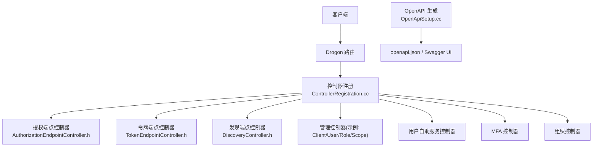
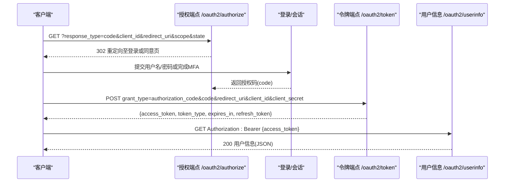
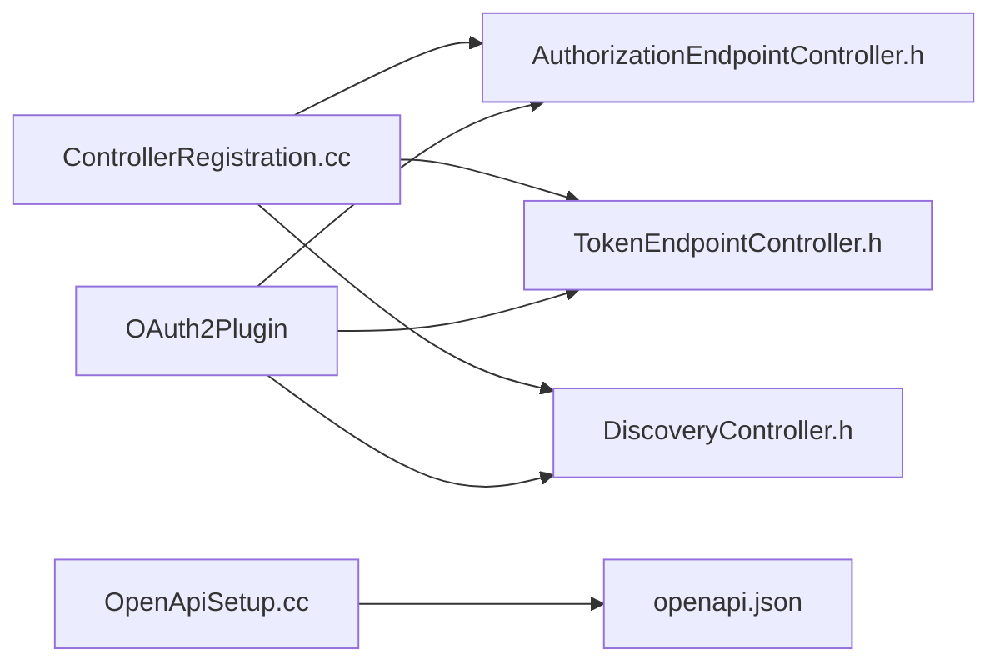

# API参考文档

<cite>
**本文引用的文件**
- [apps/server/openapi.yaml](file://apps/server/openapi.yaml)
- [docs/backend/api-reference.md](file://docs/backend/api-reference.md)
- [libs/drogon/include/authforge/drogon/controllers/AuthorizationEndpointController.h](file://libs/drogon/include/authforge/drogon/controllers/AuthorizationEndpointController.h)
- [libs/drogon/include/authforge/drogon/controllers/TokenEndpointController.h](file://libs/drogon/include/authforge/drogon/controllers/TokenEndpointController.h)
- [libs/drogon/include/authforge/drogon/controllers/DiscoveryController.h](file://libs/drogon/include/authforge/drogon/controllers/DiscoveryController.h)
- [apps/server/src/bootstrap/ControllerRegistration.cc](file://apps/server/src/bootstrap/ControllerRegistration.cc)
- [apps/server/src/bootstrap/OpenApiSetup.cc](file://apps/server/src/bootstrap/OpenApiSetup.cc)
- [docs/backend/security-hardening.md](file://docs/backend/security-hardening.md)
</cite>

## 目录
1. [简介](#简介)
2. [项目结构](#项目结构)
3. [核心组件](#核心组件)
4. [架构总览](#架构总览)
5. [详细组件分析](#详细组件分析)
6. [依赖关系分析](#依赖关系分析)
7. [性能与速率限制](#性能与速率限制)
8. [故障排查指南](#故障排查指南)
9. [结论](#结论)
10. [附录](#附录)

## 简介
本文件为 AuthForge 的完整 API 参考，覆盖 OAuth2/OIDC、管理接口、用户自助服务、外部身份提供商集成等。内容基于仓库中的 OpenAPI 规范与控制器头文件整理，提供端点方法、URL 模式、请求/响应格式、认证方式、错误码与安全注意事项。版本信息来源于 OpenAPI 元数据；向后兼容性以 OpenAPI 变更为准。

## 项目结构
AuthForge 后端采用 Drogon 框架，通过显式注册控制器暴露 HTTP 端点，OpenAPI 规范在启动时生成并输出到 docs/api/openapi.json，同时提供 Swagger UI 浏览。关键入口包括：
- 控制器注册：集中注册所有控制器（OAuth2、OIDC、Admin、User Self-Service、MFA、WebAuthn、组织管理等）
- OpenAPI 设置：根据监听器配置生成 server URL 并写入 openapi.json
- 安全与限流：全局安全头注入与 Hodor 插件速率限制

图表来源
- [apps/server/src/bootstrap/ControllerRegistration.cc:41-120](file://apps/server/src/bootstrap/ControllerRegistration.cc#L41-L120)
- [apps/server/src/bootstrap/OpenApiSetup.cc:10-60](file://apps/server/src/bootstrap/OpenApiSetup.cc#L10-L60)

章节来源
- [apps/server/src/bootstrap/ControllerRegistration.cc:41-120](file://apps/server/src/bootstrap/ControllerRegistration.cc#L41-L120)
- [apps/server/src/bootstrap/OpenApiSetup.cc:10-60](file://apps/server/src/bootstrap/OpenApiSetup.cc#L10-L60)

## 核心组件
- OAuth2/OIDC 协议端点：授权、令牌、用户信息、发现、JWKS、设备授权、令牌撤销与探测
- 管理 API：客户端、用户、角色、权限范围、令牌、审计日志、仪表盘统计
- 用户自助服务：个人资料、密码修改、已授权应用、邮箱验证、密码重置、WebAuthn
- 外部身份提供商：Google、GitHub、微信（可选编译开关）
- 系统健康检查与健康探针

章节来源
- [apps/server/openapi.yaml:41-1695](file://apps/server/openapi.yaml#L41-L1695)
- [docs/backend/api-reference.md:7-17](file://docs/backend/api-reference.md#L7-L17)

## 架构总览
下图展示典型授权码流程中各端点的调用顺序与交互主体。

图表来源
- [libs/drogon/include/authforge/drogon/controllers/AuthorizationEndpointController.h:25-32](file://libs/drogon/include/authforge/drogon/controllers/AuthorizationEndpointController.h#L25-L32)
- [libs/drogon/include/authforge/drogon/controllers/TokenEndpointController.h:33-63](file://libs/drogon/include/authforge/drogon/controllers/TokenEndpointController.h#L33-L63)
- [apps/server/openapi.yaml:1231-1600](file://apps/server/openapi.yaml#L1231-L1600)

## 详细组件分析

### OAuth2/OIDC 协议端点
- 授权端点
  - URL: /oauth2/authorize
  - 方法: GET
  - 参数: response_type=code, client_id, redirect_uri, scope, state
  - 响应: 302 重定向携带 code 或错误
  - 认证: 公开（需用户登录）
  - 参考路径: [apps/server/openapi.yaml:1231-1274](file://apps/server/openapi.yaml#L1231-L1274), [AuthorizationEndpointController.h:25-32](file://libs/drogon/include/authforge/drogon/controllers/AuthorizationEndpointController.h#L25-L32)

- 令牌端点
  - URL: /oauth2/token
  - 方法: POST
  - 参数: grant_type(authorization_code|refresh_token|client_credentials), code/refresh_token, client_id, client_secret
  - 响应: 200 {access_token, token_type, expires_in, refresh_token}
  - 认证: 客户端认证（Basic 或表单）
  - 参考路径: [apps/server/openapi.yaml:1564-1600](file://apps/server/openapi.yaml#L1564-L1600), [TokenEndpointController.h:33-68](file://libs/drogon/include/authforge/drogon/controllers/TokenEndpointController.h#L33-L68)

- 用户信息端点
  - URL: /oauth2/userinfo
  - 方法: GET
  - 认证: Bearer Token
  - 响应: 200 {sub, name, email, picture...}
  - 参考路径: [apps/server/openapi.yaml:113-145](file://docs/backend/api-reference.md#L113-L145), [TokenEndpointController.h:35-40](file://libs/drogon/include/authforge/drogon/controllers/TokenEndpointController.h#L35-L40)

- OIDC 发现与 JWKS
  - /.well-known/openid-configuration: GET 返回提供者元数据
  - /.well-known/jwks.json: GET 返回公钥集合
  - /.well-known/oauth-authorization-server: GET 返回 OAuth 服务器元数据
  - 参考路径: [DiscoveryController.h:22-34](file://libs/drogon/include/authforge/drogon/controllers/DiscoveryController.h#L22-L34), [apps/server/openapi.yaml:42-71](file://apps/server/openapi.yaml#L42-L71)

- 其他协议端点
  - /oauth2/introspect: POST (RFC 7662)，客户端凭据认证
  - /oauth2/revoke: POST (RFC 7009)，客户端凭据认证
  - /oauth2/device_authorization: POST 设备授权
  - /oauth2/device/verify: GET/POST 设备验证
  - 参考路径: [apps/server/openapi.yaml:1326-1397](file://apps/server/openapi.yaml#L1326-L1397), [apps/server/openapi.yaml:1535-1563](file://apps/server/openapi.yaml#L1535-L1563)

章节来源
- [apps/server/openapi.yaml:113-1600](file://apps/server/openapi.yaml#L113-L1600)
- [libs/drogon/include/authforge/drogon/controllers/AuthorizationEndpointController.h:25-32](file://libs/drogon/include/authforge/drogon/controllers/AuthorizationEndpointController.h#L25-L32)
- [libs/drogon/include/authforge/drogon/controllers/TokenEndpointController.h:33-68](file://libs/drogon/include/authforge/drogon/controllers/TokenEndpointController.h#L33-L68)
- [libs/drogon/include/authforge/drogon/controllers/DiscoveryController.h:22-34](file://libs/drogon/include/authforge/drogon/controllers/DiscoveryController.h#L22-L34)

### 管理 API
- 客户端管理
  - /api/admin/clients: GET/POST
  - /api/admin/clients/{clientId}: GET/PUT/DELETE
  - /api/admin/clients/{clientId}/reset-secret: POST
  - /api/admin/clients/{clientId}/scopes: GET/PUT
  - 认证: Bearer Token
  - 参考路径: [apps/server/openapi.yaml:72-241](file://apps/server/openapi.yaml#L72-L241)

- 用户管理
  - /api/admin/users: GET
  - /api/admin/users/{userId}: GET/PUT
  - /api/admin/users/{userId}/disable: PUT
  - /api/admin/users/{userId}/enable: POST
  - /api/admin/users/{userId}/roles: GET/PUT
  - 认证: Bearer Token
  - 参考路径: [apps/server/openapi.yaml:345-561](file://apps/server/openapi.yaml#L345-L561)

- 角色与权限范围
  - /api/admin/roles: GET/POST
  - /api/admin/roles/{roleId}: PUT/DELETE
  - /api/admin/scopes: GET/POST
  - /api/admin/scopes/{scopeId}: PUT/DELETE
  - 认证: Bearer Token
  - 参考路径: [apps/server/openapi.yaml:562-808](file://apps/server/openapi.yaml#L562-L808)

- 令牌与审计
  - /api/admin/tokens: GET
  - /api/admin/tokens/{tokenPrefix}: DELETE
  - /api/admin/tokens/revoke-by-client: POST
  - /api/admin/tokens/revoke-by-user: POST
  - /api/admin/logs: GET
  - 认证: Bearer Token
  - 参考路径: [apps/server/openapi.yaml:242-344](file://apps/server/openapi.yaml#L242-L344)

- 仪表盘统计
  - /api/admin/dashboard/stats: GET
  - 认证: Bearer Token
  - 参考路径: [apps/server/openapi.yaml:809-839](file://apps/server/openapi.yaml#L809-L839)

章节来源
- [apps/server/openapi.yaml:72-839](file://apps/server/openapi.yaml#L72-L839)

### 用户自助服务与辅助接口
- 用户资料与会话
  - /api/me: GET/DELETE
  - /api/me/password: PUT
  - /api/me/authorized-apps: GET
  - /api/me/authorized-apps/{clientId}: DELETE
  - 认证: Bearer Token
  - 参考路径: [apps/server/openapi.yaml:912-997](file://apps/server/openapi.yaml#L912-L997)

- 邮箱验证与密码重置
  - /api/verify-email: GET
  - /api/verify-email/resend: POST
  - /api/password-reset/request: POST
  - /api/password-reset/confirm: POST
  - 参考路径: [apps/server/openapi.yaml:1094-1182](file://apps/server/openapi.yaml#L1094-L1182)

- WebAuthn
  - /api/me/webauthn/credentials: GET
  - /api/me/webauthn/register/begin: POST
  - /api/me/webauthn/register/finish: POST
  - 认证: Bearer Token
  - 参考路径: [apps/server/openapi.yaml:998-1041](file://apps/server/openapi.yaml#L998-L1041)

- 外部身份提供商（可选）
  - /api/google/login: POST
  - /api/github/login: POST
  - /api/wechat/login: POST
  - 参考路径: [apps/server/openapi.yaml:840-911](file://apps/server/openapi.yaml#L840-L911), [apps/server/openapi.yaml:1183-1215](file://apps/server/openapi.yaml#L1183-L1215)

- 健康检查
  - /health: GET
  - 参考路径: [apps/server/openapi.yaml:1216-1230](file://apps/server/openapi.yaml#L1216-L1230)

章节来源
- [apps/server/openapi.yaml:840-1230](file://apps/server/openapi.yaml#L840-L1230)

### 认证方法与鉴权
- Bearer Token: 用于受保护的管理与用户自助接口
- 客户端凭据: Basic 或表单参数（client_id/client_secret），用于 /oauth2/token、/oauth2/introspect、/oauth2/revoke
- 过滤器: OAuth2AuthFilter 对 /oauth2/userinfo 等端点进行访问令牌校验
- 参考路径: [apps/server/openapi.yaml:27-35](file://apps/server/openapi.yaml#L27-L35), [TokenEndpointController.h:33-63](file://libs/drogon/include/authforge/drogon/controllers/TokenEndpointController.h#L33-L63)

章节来源
- [apps/server/openapi.yaml:27-35](file://apps/server/openapi.yaml#L27-L35)
- [libs/drogon/include/authforge/drogon/controllers/TokenEndpointController.h:33-63](file://libs/drogon/include/authforge/drogon/controllers/TokenEndpointController.h#L33-L63)

### 错误码定义
- 应用错误码: 统一 Error Envelope，包含 category/code/details/message/request_id
- OAuth2 协议错误码: RFC 6749 §5.2 标准 error/error_description/error_uri
- HTTP 状态码映射: 400/401/403/429/500/503 等
- 参考路径: [docs/backend/api-reference.md:213-281](file://docs/backend/api-reference.md#L213-L281)

章节来源
- [docs/backend/api-reference.md:213-281](file://docs/backend/api-reference.md#L213-L281)

### WebSocket 与实时通信
- 当前仓库未提供 WebSocket 相关控制器或路由定义。如需实时通信，建议在后端引入 WebSocket 控制器并在 ControllerRegistration 中注册。

[本节不直接分析具体代码文件]

## 依赖关系分析
- 控制器注册依赖：所有控制器通过显式 registerController 注册，确保路由与 OpenAPI 文档一致
- 插件依赖：OAuth2Plugin 注入到各控制器与过滤器，提供统一的认证、限流、审计能力
- OpenAPI 生成：启动时读取监听器配置生成 server URL，并输出 openapi.json

图表来源
- [apps/server/src/bootstrap/ControllerRegistration.cc:41-120](file://apps/server/src/bootstrap/ControllerRegistration.cc#L41-L120)
- [apps/server/src/bootstrap/OpenApiSetup.cc:10-60](file://apps/server/src/bootstrap/OpenApiSetup.cc#L10-L60)

章节来源
- [apps/server/src/bootstrap/ControllerRegistration.cc:41-120](file://apps/server/src/bootstrap/ControllerRegistration.cc#L41-L120)
- [apps/server/src/bootstrap/OpenApiSetup.cc:10-60](file://apps/server/src/bootstrap/OpenApiSetup.cc#L10-L60)

## 性能与速率限制
- 速率限制：使用 Hodor 插件实现令牌桶算法，支持 IP/用户/全局多层级限制，白名单跳过限制
- 关键接口限制示例：/oauth2/login、/oauth2/token、/api/register 有严格每分钟限制，超限返回 429
- 安全响应头：全局注入现代安全头，防御常见 Web 攻击
- 参考路径: [docs/backend/security-hardening.md:5-32](file://docs/backend/security-hardening.md#L5-L32)

章节来源
- [docs/backend/security-hardening.md:5-32](file://docs/backend/security-hardening.md#L5-L32)

## 故障排查指南
- 无法访问 Swagger UI：确认静态资源目录存在且服务已启用
- OpenAPI 生成失败：运行单元测试定位注册错误，检查控制器是否已正确注册
- 文档不一致：确保控制器变更后重新生成 openapi.json 并提交
- 参考路径: [docs/backend/api-reference.md:284-310](file://docs/backend/api-reference.md#L284-L310)

章节来源
- [docs/backend/api-reference.md:284-310](file://docs/backend/api-reference.md#L284-L310)

## 结论
AuthForge 提供了完整的 OAuth2/OIDC 协议端点与管理 API，遵循标准规范并通过 OpenAPI 进行契约化管理。结合 Hodor 速率限制与安全响应头，具备生产可用性与可观测性。建议按本参考文档进行集成与测试，关注错误码与限流策略，确保稳定运行。

[本节不直接分析具体代码文件]

## 附录

### API 版本与向后兼容
- 版本: 1.0.0（来自 OpenAPI info.version）
- 向后兼容: 以 OpenAPI 变更为准；新增字段应向后兼容，删除或破坏性变更需评估影响

章节来源
- [apps/server/openapi.yaml:36-40](file://apps/server/openapi.yaml#L36-L40)

### 调试与监控
- 健康检查: /health 返回服务状态与版本
- 审计日志: /api/admin/logs 获取分页审计记录
- 仪表盘统计: /api/admin/dashboard/stats 获取活跃令牌、失败指标等
- 参考路径: [apps/server/openapi.yaml:242-344](file://apps/server/openapi.yaml#L242-L344), [apps/server/openapi.yaml:809-839](file://apps/server/openapi.yaml#L809-L839), [apps/server/openapi.yaml:1216-1230](file://apps/server/openapi.yaml#L1216-L1230)

章节来源
- [apps/server/openapi.yaml:242-344](file://apps/server/openapi.yaml#L242-L344)
- [apps/server/openapi.yaml:809-839](file://apps/server/openapi.yaml#L809-L839)
- [apps/server/openapi.yaml:1216-1230](file://apps/server/openapi.yaml#L1216-L1230)