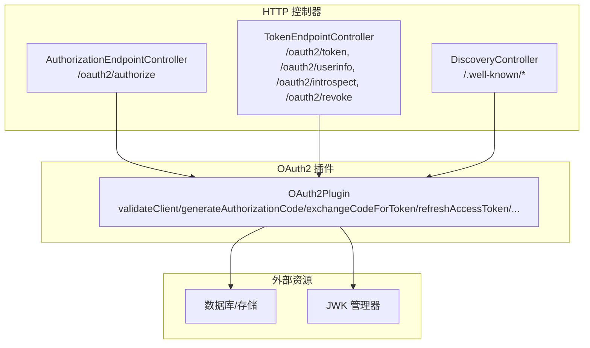
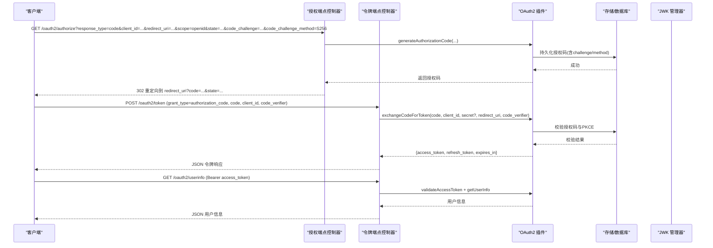
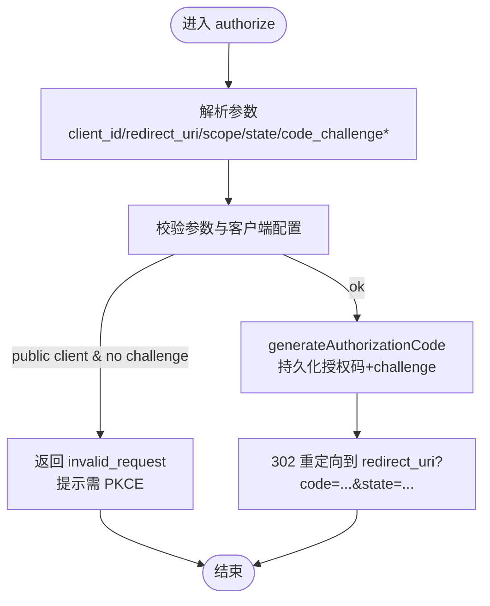
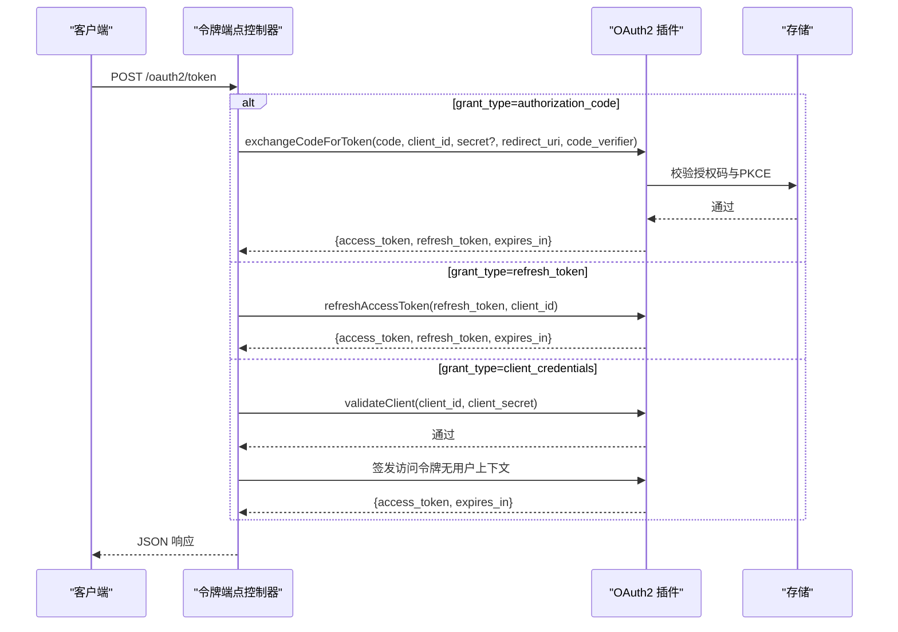
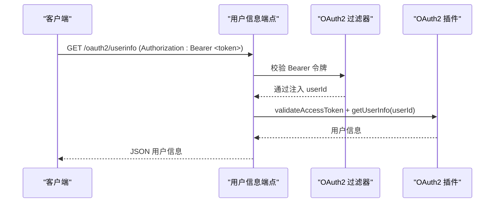
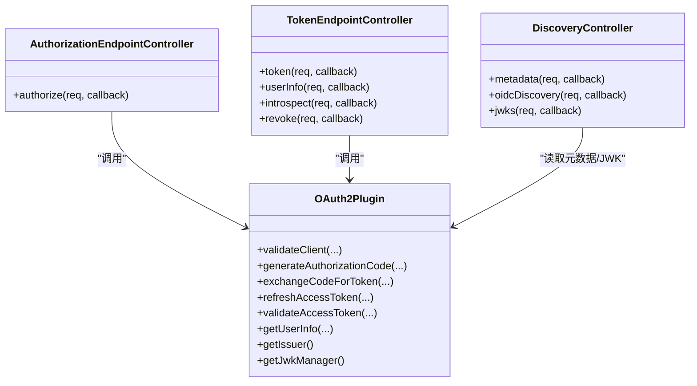

# OAuth2/OIDC协议端点

<cite>
**本文引用的文件**
- [apps/server/openapi.yaml](file://apps/server/openapi.yaml)
- [apps/server/docs/api/openapi.json](file://apps/server/docs/api/openapi.json)
- [libs/drogon/include/authforge/drogon/controllers/AuthorizationEndpointController.h](file://libs/drogon/include/authforge/drogon/controllers/AuthorizationEndpointController.h)
- [libs/drogon/src/controllers/AuthorizationEndpointController.cc](file://libs/drogon/src/controllers/AuthorizationEndpointController.cc)
- [libs/drogon/include/authforge/drogon/controllers/TokenEndpointController.h](file://libs/drogon/include/authforge/drogon/controllers/TokenEndpointController.h)
- [libs/drogon/src/controllers/TokenEndpointController.cc](file://libs/drogon/src/controllers/TokenEndpointController.cc)
- [libs/drogon/include/authforge/drogon/controllers/DiscoveryController.h](file://libs/drogon/include/authforge/drogon/controllers/DiscoveryController.h)
- [libs/drogon/include/authforge/drogon/plugin/OAuth2Plugin.h](file://libs/drogon/include/authforge/drogon/plugin/OAuth2Plugin.h)
- [libs/drogon/src/plugin/OAuth2Plugin.cc](file://libs/drogon/src/plugin/OAuth2Plugin.cc)
- [docs/backend/oidc-guide.md](file://docs/backend/oidc-guide.md)
- [docs/history/PRD/mfa_auth_code_pkce_design.md](file://docs/history/PRD/mfa_auth_code_pkce_design.md)
</cite>

## 目录
1. [简介](#简介)
2. [项目结构](#项目结构)
3. [核心组件](#核心组件)
4. [架构总览](#架构总览)
5. [详细组件分析](#详细组件分析)
6. [依赖关系分析](#依赖关系分析)
7. [性能考虑](#性能考虑)
8. [故障排查指南](#故障排查指南)
9. [结论](#结论)
10. [附录](#附录)

## 简介
本文件为 OAuth2/OIDC 协议端点的权威 API 文档，覆盖授权端点、令牌端点、用户信息端点、发现端点与 JWKS 端点。内容包含：
- HTTP 方法与 URL 模式
- 请求参数、响应格式与认证方式
- 授权码流程、客户端凭证流程、刷新令牌流程的完整示例
- PKCE 支持、scope 权限范围、state/nonce 等 OIDC 特性
- 错误处理、重定向处理与安全性建议
- 实际代码路径与调试技巧

## 项目结构
本项目采用分层与按功能域组织的方式：
- Drogon 控制器层负责路由与协议端点实现（授权、令牌、用户信息、发现、JWKS）
- OAuth2 插件封装领域服务、存储与密钥管理，提供统一的异步接口
- OpenAPI 定义位于 apps/server 下，用于描述管理与部分协议端点
- 后端文档 docs/backend/oidc-guide.md 提供 OIDC 集成说明与示例

**图表来源**
- [libs/drogon/include/authforge/drogon/controllers/AuthorizationEndpointController.h:25-27](file://libs/drogon/include/authforge/drogon/controllers/AuthorizationEndpointController.h#L25-L27)
- [libs/drogon/include/authforge/drogon/controllers/TokenEndpointController.h:33-63](file://libs/drogon/include/authforge/drogon/controllers/TokenEndpointController.h#L33-L63)
- [libs/drogon/include/authforge/drogon/controllers/DiscoveryController.h:22-34](file://libs/drogon/include/authforge/drogon/controllers/DiscoveryController.h#L22-L34)
- [libs/drogon/include/authforge/drogon/plugin/OAuth2Plugin.h:118-228](file://libs/drogon/include/authforge/drogon/plugin/OAuth2Plugin.h#L118-L228)

**章节来源**
- [apps/server/openapi.yaml:41-71](file://apps/server/openapi.yaml#L41-L71)
- [apps/server/docs/api/openapi.json:79-141](file://apps/server/docs/api/openapi.json#L79-L141)

## 核心组件
- 授权端点控制器：处理 /oauth2/authorize，支持授权码流程与 PKCE
- 令牌端点控制器：处理 /oauth2/token（授权码、客户端凭证、刷新令牌）、/oauth2/userinfo（受保护的用户信息）
- 发现控制器：处理 /.well-known/openid-configuration 与 /.well-known/jwks.json
- OAuth2 插件：封装客户端校验、授权码生成、令牌交换、刷新、鉴权、PKCE 验证、作用域校验、审计与指标等能力

**章节来源**
- [libs/drogon/include/authforge/drogon/controllers/AuthorizationEndpointController.h:25-32](file://libs/drogon/include/authforge/drogon/controllers/AuthorizationEndpointController.h#L25-L32)
- [libs/drogon/include/authforge/drogon/controllers/TokenEndpointController.h:33-80](file://libs/drogon/include/authforge/drogon/controllers/TokenEndpointController.h#L33-L80)
- [libs/drogon/include/authforge/drogon/controllers/DiscoveryController.h:22-47](file://libs/drogon/include/authforge/drogon/controllers/DiscoveryController.h#L22-L47)
- [libs/drogon/include/authforge/drogon/plugin/OAuth2Plugin.h:118-331](file://libs/drogon/include/authforge/drogon/plugin/OAuth2Plugin.h#L118-L331)

## 架构总览
协议端点通过 Drogon 控制器暴露，调用 OAuth2 插件进行业务逻辑处理；插件内部组合领域服务、存储与 JWK 管理器，完成授权码签发、令牌颁发、用户信息查询与密钥发布。

**图表来源**
- [libs/drogon/include/authforge/drogon/controllers/AuthorizationEndpointController.h:25-32](file://libs/drogon/include/authforge/drogon/controllers/AuthorizationEndpointController.h#L25-L32)
- [libs/drogon/include/authforge/drogon/controllers/TokenEndpointController.h:33-80](file://libs/drogon/include/authforge/drogon/controllers/TokenEndpointController.h#L33-L80)
- [libs/drogon/include/authforge/drogon/plugin/OAuth2Plugin.h:167-228](file://libs/drogon/include/authforge/drogon/plugin/OAuth2Plugin.h#L167-L228)

## 详细组件分析

### 授权端点 /oauth2/authorize
- 方法：GET
- 用途：发起 OIDC 授权码流程，支持 PKCE
- 关键参数
  - response_type=code
  - client_id
  - redirect_uri（必须与注册一致）
  - scope（至少 openid）
  - state（防 CSRF）
  - code_challenge、code_challenge_method（S256 或 plain；公共客户端强制 S256）
  - nonce（OIDC 可选，用于 id_token）
- 响应
  - 成功：302 重定向至 redirect_uri?code=...&state=...
  - 失败：返回标准 OAuth2 错误 JSON（如 invalid_request），并附带 error_description
- 安全要点
  - 公共客户端强制 PKCE
  - 校验 code_challenge 长度与字符集
  - 仅允许已注册的 redirect_uri
  - 支持 MFA 流程（登录/MFA 页面后 302 回跳）

**图表来源**
- [libs/drogon/src/controllers/AuthorizationEndpointController.cc:424-451](file://libs/drogon/src/controllers/AuthorizationEndpointController.cc#L424-L451)
- [libs/drogon/include/authforge/drogon/plugin/OAuth2Plugin.h:167-189](file://libs/drogon/include/authforge/drogon/plugin/OAuth2Plugin.h#L167-L189)

**章节来源**
- [libs/drogon/include/authforge/drogon/controllers/AuthorizationEndpointController.h:25-32](file://libs/drogon/include/authforge/drogon/controllers/AuthorizationEndpointController.h#L25-L32)
- [libs/drogon/src/controllers/AuthorizationEndpointController.cc:424-451](file://libs/drogon/src/controllers/AuthorizationEndpointController.cc#L424-L451)
- [docs/history/PRD/mfa_auth_code_pkce_design.md:28-93](file://docs/history/PRD/mfa_auth_code_pkce_design.md#L28-L93)

### 令牌端点 /oauth2/token
- 方法：POST
- 用途：交换授权码、刷新令牌、客户端凭证
- 支持的 grant_type
  - authorization_code：需要 code、client_id、redirect_uri；公共客户端需提供 code_verifier
  - refresh_token：需要 refresh_token、client_id
  - client_credentials：需要 client_id、client_secret（仅机密客户端）
- 请求体字段（application/x-www-form-urlencoded）
  - grant_type（必填）
  - code（授权码流程）
  - redirect_uri（授权码流程）
  - client_id（所有流程）
  - client_secret（机密客户端）
  - refresh_token（刷新流程）
  - code_verifier（PKCE）
- 响应
  - 成功：JSON 包含 access_token、token_type、expires_in、refresh_token（可选）
  - 失败：标准 OAuth2 错误 JSON（invalid_grant、invalid_client、invalid_request 等）
- 安全要点
  - 严格校验 redirect_uri
  - PKCE 校验（S256 优先）
  - 仅机密客户端使用 client_credentials
  - 审计与指标上报

**图表来源**
- [libs/drogon/include/authforge/drogon/controllers/TokenEndpointController.h:33-80](file://libs/drogon/include/authforge/drogon/controllers/TokenEndpointController.h#L33-L80)
- [libs/drogon/include/authforge/drogon/plugin/OAuth2Plugin.h:191-228](file://libs/drogon/include/authforge/drogon/plugin/OAuth2Plugin.h#L191-L228)
- [apps/server/docs/api/openapi.json:1924-1970](file://apps/server/docs/api/openapi.json#L1924-L1970)

**章节来源**
- [libs/drogon/src/controllers/TokenEndpointController.cc:790-822](file://libs/drogon/src/controllers/TokenEndpointController.cc#L790-L822)
- [apps/server/docs/api/openapi.json:1924-1970](file://apps/server/docs/api/openapi.json#L1924-L1970)

### 用户信息端点 /oauth2/userinfo
- 方法：GET
- 用途：获取当前授权用户的身份信息（OpenID Connect）
- 认证：Bearer access_token（由过滤器 OAuth2AuthFilter 校验）
- 响应：JSON 用户信息（包含 sub、email、profile 等，取决于 scope）
- 错误：401 无效/过期令牌，404 用户不存在

**图表来源**
- [libs/drogon/include/authforge/drogon/controllers/TokenEndpointController.h:33-40](file://libs/drogon/include/authforge/drogon/controllers/TokenEndpointController.h#L33-L40)
- [libs/drogon/include/authforge/drogon/plugin/OAuth2Plugin.h:222-228](file://libs/drogon/include/authforge/drogon/plugin/OAuth2Plugin.h#L222-L228)

**章节来源**
- [libs/drogon/src/controllers/TokenEndpointController.cc:1381-1418](file://libs/drogon/src/controllers/TokenEndpointController.cc#L1381-L1418)

### 发现端点 /.well-known/openid-configuration
- 方法：GET
- 用途：返回 OIDC Provider 元数据（issuer、各端点地址、支持的 scopes/response_types/signing alg 等）
- 响应：JSON 对象（Provider Metadata）

**章节来源**
- [libs/drogon/include/authforge/drogon/controllers/DiscoveryController.h:22-33](file://libs/drogon/include/authforge/drogon/controllers/DiscoveryController.h#L22-L33)
- [apps/server/openapi.yaml:57-71](file://apps/server/openapi.yaml#L57-L71)
- [docs/backend/oidc-guide.md:5-27](file://docs/backend/oidc-guide.md#L5-L27)

### JWKS 端点 /.well-known/jwks.json
- 方法：GET
- 用途：返回用于验证 id_token 签名的公钥集合（JWKS）
- 响应：JSON Web Key Set

**章节来源**
- [libs/drogon/include/authforge/drogon/controllers/DiscoveryController.h:33-47](file://libs/drogon/include/authforge/drogon/controllers/DiscoveryController.h#L33-L47)
- [apps/server/openapi.yaml:41-56](file://apps/server/openapi.yaml#L41-L56)
- [docs/backend/oidc-guide.md:29-52](file://docs/backend/oidc-guide.md#L29-L52)

### 其他协议端点（令牌端点内）
- /oauth2/introspect（RFC 7662）：查询访问令牌状态
- /oauth2/revoke（RFC 7009）：撤销访问令牌
- 注意：这些端点走“客户端认证”而非“用户访问令牌”，因此未挂载用户态过滤器

**章节来源**
- [libs/drogon/include/authforge/drogon/controllers/TokenEndpointController.h:41-63](file://libs/drogon/include/authforge/drogon/controllers/TokenEndpointController.h#L41-L63)
- [libs/drogon/include/authforge/drogon/plugin/OAuth2Plugin.h:333-364](file://libs/drogon/include/authforge/drogon/plugin/OAuth2Plugin.h#L333-L364)

## 依赖关系分析
- 控制器依赖 OAuth2 插件提供的统一接口，屏蔽底层存储与领域细节
- 插件组合了客户端仓库、令牌仓库、同意记录仓库、身份服务、JWK 管理器、审计与指标端口
- 控制器之间松耦合，职责清晰：授权、令牌、用户信息、发现各自独立

**图表来源**
- [libs/drogon/include/authforge/drogon/controllers/AuthorizationEndpointController.h:25-32](file://libs/drogon/include/authforge/drogon/controllers/AuthorizationEndpointController.h#L25-L32)
- [libs/drogon/include/authforge/drogon/controllers/TokenEndpointController.h:33-80](file://libs/drogon/include/authforge/drogon/controllers/TokenEndpointController.h#L33-L80)
- [libs/drogon/include/authforge/drogon/controllers/DiscoveryController.h:22-47](file://libs/drogon/include/authforge/drogon/controllers/DiscoveryController.h#L22-L47)
- [libs/drogon/include/authforge/drogon/plugin/OAuth2Plugin.h:50-106](file://libs/drogon/include/authforge/drogon/plugin/OAuth2Plugin.h#L50-L106)

**章节来源**
- [libs/drogon/include/authforge/drogon/plugin/OAuth2Plugin.h:412-448](file://libs/drogon/include/authforge/drogon/plugin/OAuth2Plugin.h#L412-L448)

## 性能考虑
- 令牌颁发与用户信息查询涉及存储与 JWK 操作，应启用连接池与缓存（如 JWKS 缓存）
- 审计与指标上报应异步化，避免阻塞主流程
- 合理设置 TTL（访问令牌、刷新令牌、授权码），减少存储压力
- 对高频端点（userinfo、introspect）考虑限流与缓存策略

[本节为通用指导，不直接分析具体文件]

## 故障排查指南
- 常见错误
  - invalid_request：参数缺失或格式错误（如缺少 code_challenge、redirect_uri 不匹配）
  - invalid_client：客户端认证失败（client_id/client_secret 错误或非机密客户端使用 client_credentials）
  - invalid_grant：授权码失效或 PKCE 校验失败
  - unauthorized：访问令牌无效或过期
- 重定向问题
  - 确认 redirect_uri 已在客户端注册且完全匹配
  - 检查 state 是否原样回传
- PKCE 问题
  - 公共客户端必须使用 S256
  - code_verifier 必须与 code_challenge 匹配
- 调试技巧
  - 启用审计日志，定位请求链路
  - 使用 OpenAPI 文档与测试脚本逐步验证参数
  - 检查 JWKS 是否可获取，id_token 签名是否有效

**章节来源**
- [libs/drogon/src/controllers/AuthorizationEndpointController.cc:424-451](file://libs/drogon/src/controllers/AuthorizationEndpointController.cc#L424-L451)
- [libs/drogon/src/controllers/TokenEndpointController.cc:790-822](file://libs/drogon/src/controllers/TokenEndpointController.cc#L790-L822)
- [docs/backend/oidc-guide.md:72-90](file://docs/backend/oidc-guide.md#L72-L90)

## 结论
本系统实现了标准的 OAuth2/OIDC 协议端点，涵盖授权码、客户端凭证、刷新令牌流程，并提供发现与 JWKS 能力。通过控制器与插件的分层设计，保证了可扩展性与可维护性。建议在生产环境启用 PKCE、严格校验 redirect_uri、合理配置 TTL 与缓存，并结合审计与监控保障安全与稳定性。

[本节为总结，不直接分析具体文件]

## 附录

### 授权码流程（含 PKCE）完整示例
- 步骤
  1) 客户端生成 code_verifier 与 code_challenge（S256）
  2) 浏览器跳转至 /oauth2/authorize，携带 response_type=code、client_id、redirect_uri、scope=openid、state、code_challenge、code_challenge_method=S256
  3) 服务端校验并返回 302 重定向到回调地址，附带 code 与 state
  4) 客户端用 code 与 code_verifier 向 /oauth2/token 换取 access_token 与 refresh_token
- 参考实现路径
  - 授权端点：[AuthorizationEndpointController:25-32](file://libs/drogon/include/authforge/drogon/controllers/AuthorizationEndpointController.h#L25-L32)
  - 令牌交换：[TokenEndpointController:33-80](file://libs/drogon/include/authforge/drogon/controllers/TokenEndpointController.h#L33-L80)
  - PKCE 设计与流程：[mfa_auth_code_pkce_design:28-93](file://docs/history/PRD/mfa_auth_code_pkce_design.md#L28-L93)

**章节来源**
- [docs/history/PRD/mfa_auth_code_pkce_design.md:28-93](file://docs/history/PRD/mfa_auth_code_pkce_design.md#L28-L93)

### 客户端凭证流程完整示例
- 步骤
  1) 客户端以 Basic 或表单提交 client_id、client_secret
  2) 请求 /oauth2/token，grant_type=client_credentials
  3) 服务端校验客户端并返回 access_token（无用户上下文）
- 参考实现路径
  - 客户端凭证分支：[TokenEndpointController.cc:790-822](file://libs/drogon/src/controllers/TokenEndpointController.cc#L790-L822)

**章节来源**
- [libs/drogon/src/controllers/TokenEndpointController.cc:790-822](file://libs/drogon/src/controllers/TokenEndpointController.cc#L790-L822)

### 刷新令牌流程完整示例
- 步骤
  1) 客户端携带 refresh_token、client_id 请求 /oauth2/token，grant_type=refresh_token
  2) 服务端校验并返回新的 access_token（可能伴随新的 refresh_token）
- 参考实现路径
  - 刷新令牌接口：[OAuth2Plugin.h:212-220](file://libs/drogon/include/authforge/drogon/plugin/OAuth2Plugin.h#L212-L220)

**章节来源**
- [libs/drogon/include/authforge/drogon/plugin/OAuth2Plugin.h:212-220](file://libs/drogon/include/authforge/drogon/plugin/OAuth2Plugin.h#L212-L220)

### OIDC 特性说明
- scope
  - openid（必需）、profile、email 等
  - 管理员相关 scope 可能需要角色校验
- state
  - 防 CSRF，需在回调中校验
- nonce
  - 用于 id_token 校验，防止重放攻击
- PKCE
  - 公共客户端强制 S256；私有客户端可使用 plain/S256
- 参考
  - OIDC 指南与 claims 说明：[oidc-guide:55-98](file://docs/backend/oidc-guide.md#L55-L98)

**章节来源**
- [docs/backend/oidc-guide.md:55-98](file://docs/backend/oidc-guide.md#L55-L98)

### 错误处理与重定向
- 授权端点错误：返回标准 OAuth2 错误 JSON，并设置对应 HTTP 状态码
- 令牌端点错误：根据 RFC 6749/7009/7662 返回相应错误
- 重定向：仅在授权码流程成功后 302 回跳，确保 state 一致性

**章节来源**
- [libs/drogon/src/controllers/AuthorizationEndpointController.cc:424-451](file://libs/drogon/src/controllers/AuthorizationEndpointController.cc#L424-L451)
- [apps/server/openapi.yaml:41-71](file://apps/server/openapi.yaml#L41-L71)