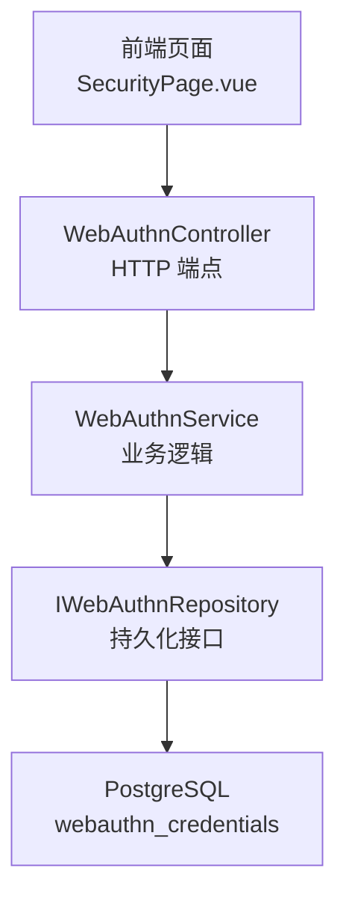
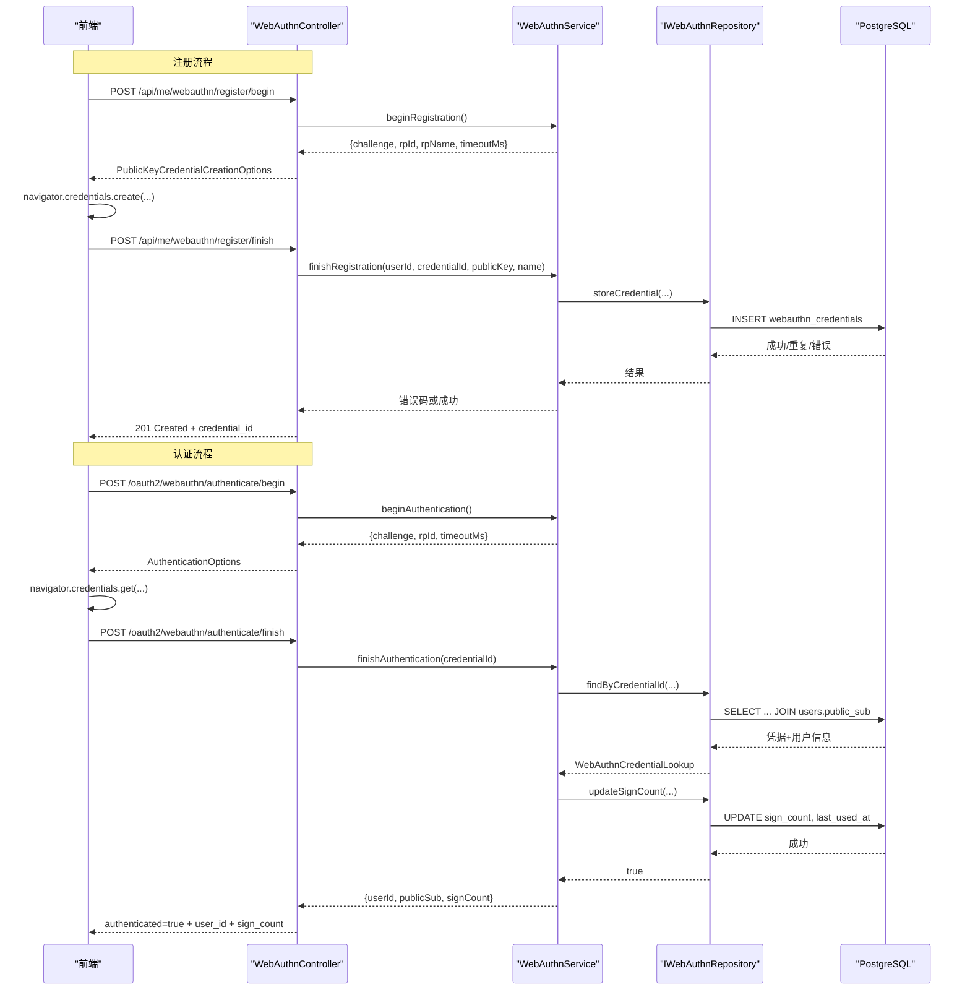
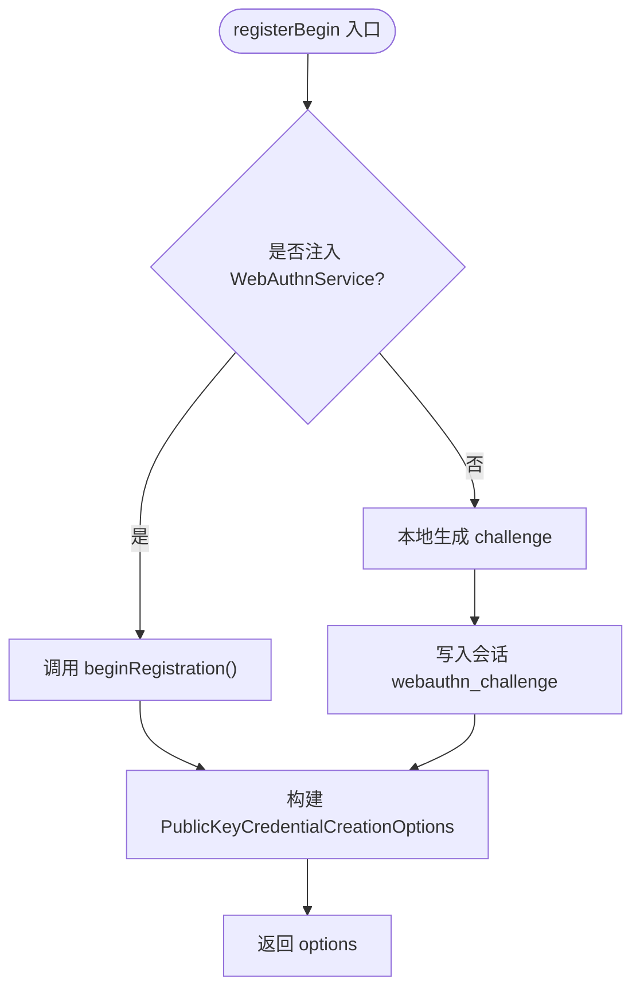
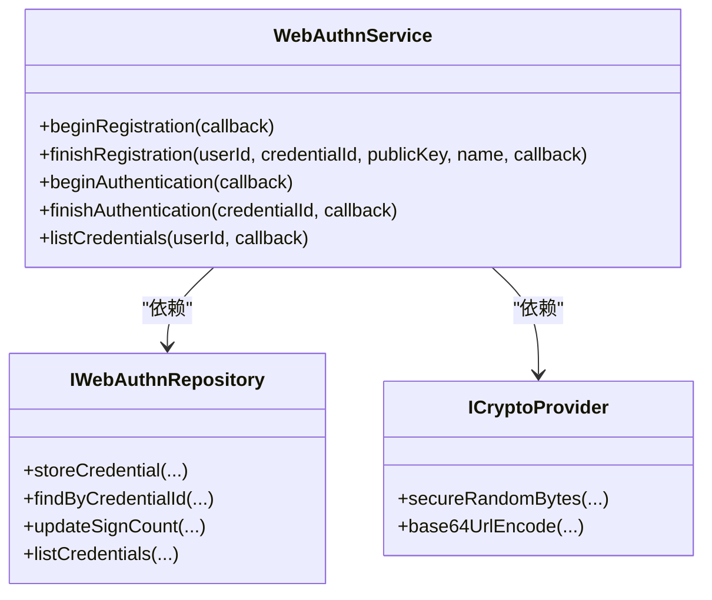
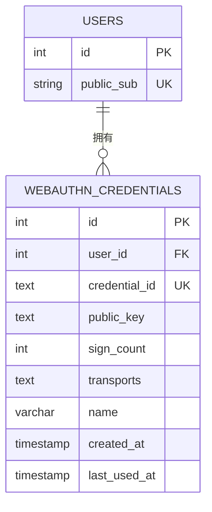
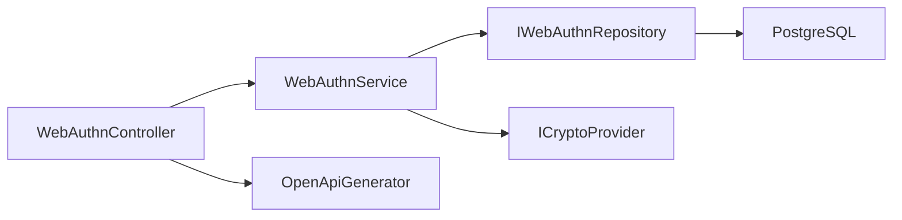
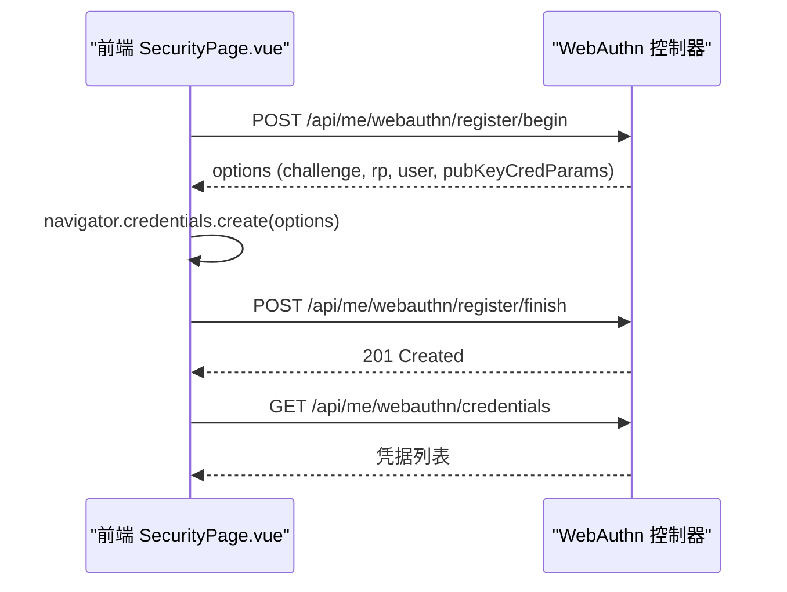

# WebAuthn生物识别API

<cite>
**本文引用的文件**
- [WebAuthnController.h](file://libs/drogon/include/authforge/drogon/controllers/WebAuthnController.h)
- [WebAuthnController.cc](file://libs/drogon/src/controllers/WebAuthnController.cc)
- [WebAuthnService.h](file://libs/identity/include/authforge/identity/WebAuthnService.h)
- [WebAuthnService.cc](file://libs/identity/src/webauthn/WebAuthnService.cc)
- [IWebAuthnRepository.h](file://libs/identity/include/authforge/identity/IWebAuthnRepository.h)
- [V018__webauthn.sql](file://apps/server/migrations/V018__webauthn.sql)
- [IdentityAssembly.cc](file://apps/server/src/bootstrap/IdentityAssembly.cc)
- [SecurityPage.vue](file://frontends/user/src/pages/account/SecurityPage.vue)
- [openapi.json](file://apps/server/docs/api/openapi.json)
</cite>

## 目录
1. [简介](#简介)
2. [项目结构](#项目结构)
3. [核心组件](#核心组件)
4. [架构总览](#架构总览)
5. [详细组件分析](#详细组件分析)
6. [依赖关系分析](#依赖关系分析)
7. [性能与安全性考虑](#性能与安全性考虑)
8. [故障排查指南](#故障排查指南)
9. [结论](#结论)
10. [附录：前端集成与用户体验流程](#附录：前端集成与用户体验流程)

## 简介
本文件为 AuthForge 项目中 WebAuthn（Passkey）生物识别能力的 API 文档，覆盖设备注册、认证、凭据管理三大能力，并说明协议实现要点、FIDO2 支持现状、设备绑定与安全存储机制，以及跨平台兼容性与前端集成示例。当前实现提供完整的注册/认证流程控制面与持久化，但尚未在服务器端执行真正的 FIDO2 密码学校验（挑战签名验证），属于“简化模式”的过渡实现。

## 项目结构
- 控制器层：Drogon HTTP 控制器暴露 WebAuthn 相关端点，负责请求解析、会话挑战存储、响应组装与审计日志。
- 领域服务层：WebAuthnService 封装业务逻辑（挑战生成、凭据登记、认证完成、凭据列表）。
- 仓储接口层：IWebAuthnRepository 抽象凭据持久化操作，Postgres 实现由装配阶段注入。
- 数据库迁移：V018__webauthn.sql 定义 webauthn_credentials 表及索引。
- 前端集成：用户安全页面调用 WebAuthn 浏览器 API 并与后端交互完成注册与展示。

图表来源
- [WebAuthnController.cc:114-226](file://libs/drogon/src/controllers/WebAuthnController.cc#L114-L226)
- [WebAuthnService.cc:41-174](file://libs/identity/src/webauthn/WebAuthnService.cc#L41-L174)
- [IWebAuthnRepository.h:92-133](file://libs/identity/include/authforge/identity/IWebAuthnRepository.h#L92-L133)
- [V018__webauthn.sql:1-16](file://apps/server/migrations/V018__webauthn.sql#L1-L16)

章节来源
- [WebAuthnController.h:50-82](file://libs/drogon/include/authforge/drogon/controllers/WebAuthnController.h#L50-L82)
- [WebAuthnController.cc:96-112](file://libs/drogon/src/controllers/WebAuthnController.cc#L96-L112)
- [IdentityAssembly.cc:115-140](file://apps/server/src/bootstrap/IdentityAssembly.cc#L115-L140)

## 核心组件
- WebAuthnController：提供注册开始/结束、认证开始/结束、凭据列表等 HTTP 端点；维护 RP 配置（rp_id/rp_name）；将挑战存入会话；统一错误响应与审计日志。
- WebAuthnService：无框架依赖的业务层，负责生成挑战、登记凭据、完成认证（更新 sign_count）、列出凭据；通过注入的仓库和加密端口工作。
- IWebAuthnRepository：定义凭据增删改查的异步接口，屏蔽具体存储实现细节。
- 数据库迁移 V018：创建 webauthn_credentials 表，包含 user_id、credential_id、public_key、sign_count、transports、name、时间戳等字段，并建立索引。

章节来源
- [WebAuthnController.h:28-108](file://libs/drogon/include/authforge/drogon/controllers/WebAuthnController.h#L28-L108)
- [WebAuthnService.h:79-223](file://libs/identity/include/authforge/identity/WebAuthnService.h#L79-L223)
- [IWebAuthnRepository.h:40-133](file://libs/identity/include/authforge/identity/IWebAuthnRepository.h#L40-L133)
- [V018__webauthn.sql:1-16](file://apps/server/migrations/V018__webauthn.sql#L1-L16)

## 架构总览
WebAuthn 流程分为两条主线：
- 注册流程：客户端先请求注册开始，获取 challenge/rp/user/pubKeyCredParams 等选项；调用浏览器 credentials.create；将 attestation 结果提交到注册结束端点，服务端存储凭据并返回成功。
- 认证流程：客户端请求认证开始，获取 challenge/rpId/timeout；调用浏览器 credentials.get；将 assertion 结果提交到认证结束端点，服务端查找凭据并返回认证成功信息（含 sign_count）。

图表来源
- [WebAuthnController.cc:114-226](file://libs/drogon/src/controllers/WebAuthnController.cc#L114-L226)
- [WebAuthnController.cc:389-453](file://libs/drogon/src/controllers/WebAuthnController.cc#L389-L453)
- [WebAuthnController.cc:455-604](file://libs/drogon/src/controllers/WebAuthnController.cc#L455-L604)
- [WebAuthnService.cc:41-174](file://libs/identity/src/webauthn/WebAuthnService.cc#L41-L174)
- [IWebAuthnRepository.h:92-133](file://libs/identity/include/authforge/identity/IWebAuthnRepository.h#L92-L133)
- [V018__webauthn.sql:1-16](file://apps/server/migrations/V018__webauthn.sql#L1-L16)

## 详细组件分析

### 控制器：WebAuthnController
- 端点清单
  - POST /api/me/webauthn/register/begin：需要已登录（OAuth2 过滤器），返回注册选项。
  - POST /api/me/webauthn/register/finish：需要已登录，接收凭据并存储。
  - POST /oauth2/webauthn/authenticate/begin：无需登录，返回认证选项。
  - POST /oauth2/webauthn/authenticate/finish：无需登录，完成认证并返回用户标识与 sign_count。
  - GET /api/me/webauthn/credentials：需要已登录，列出用户已注册的凭据。
- 关键行为
  - 挑战生成：优先使用注入的 WebAuthnService 生成挑战，否则回退到本地随机数生成。
  - 会话存储：将 challenge 写入会话，用于后续校验（当前实现中 registerFinish/authenticateFinish 未再读取校验，仅作为历史兼容路径）。
  - RP 配置：从自定义配置读取 rp_id/rp_name，默认值分别为 localhost/OAuth2 Server。
  - 错误处理：统一通过 ErrorResponder 输出结构化错误信封。
  - 审计日志：注册成功与认证成功均记录审计事件。

图表来源
- [WebAuthnController.cc:114-226](file://libs/drogon/src/controllers/WebAuthnController.cc#L114-L226)
- [WebAuthnController.cc:96-112](file://libs/drogon/src/controllers/WebAuthnController.cc#L96-L112)

章节来源
- [WebAuthnController.h:50-82](file://libs/drogon/include/authforge/drogon/controllers/WebAuthnController.h#L50-L82)
- [WebAuthnController.cc:114-226](file://libs/drogon/src/controllers/WebAuthnController.cc#L114-L226)
- [WebAuthnController.cc:389-453](file://libs/drogon/src/controllers/WebAuthnController.cc#L389-L453)
- [WebAuthnController.cc:455-604](file://libs/drogon/src/controllers/WebAuthnController.cc#L455-L604)
- [WebAuthnController.cc:606-708](file://libs/drogon/src/controllers/WebAuthnController.cc#L606-L708)

### 服务：WebAuthnService
- 职责边界
  - 生成安全挑战（基于注入的加密端口）。
  - 凭据登记：参数校验后调用仓库存储，映射存储结果为标准错误码。
  - 认证完成：按 credentialId 查找凭据，更新 sign_count（失败不阻塞认证结果返回），返回用户内部 ID、public_sub 与新 sign_count。
  - 凭据列表：按用户 ID 列出凭据摘要。
- 设计要点
  - 无框架类型依赖，便于在不同宿主环境复用。
  - 挑战生成与存储分离：服务只生成挑战，存储由调用方（控制器）负责。
  - 明确区分内部 user id 与公开 sub：服务以内部 ID 为主键，public_sub 仅在认证结果中透出。

图表来源
- [WebAuthnService.h:127-223](file://libs/identity/include/authforge/identity/WebAuthnService.h#L127-L223)
- [IWebAuthnRepository.h:92-133](file://libs/identity/include/authforge/identity/IWebAuthnRepository.h#L92-L133)

章节来源
- [WebAuthnService.h:79-223](file://libs/identity/include/authforge/identity/WebAuthnService.h#L79-L223)
- [WebAuthnService.cc:41-174](file://libs/identity/src/webauthn/WebAuthnService.cc#L41-L174)

### 数据模型与持久化
- 表结构：webauthn_credentials
  - 主键：id
  - 外键：user_id -> users(id)，级联删除
  - 唯一约束：credential_id（防止重复注册）
  - 字段：public_key、sign_count、transports、name、created_at、last_used_at
  - 索引：user_id、credential_id
- 查询与更新
  - 认证完成时查找凭据并关联 users.public_sub，随后更新 sign_count 与 last_used_at。
  - 列表凭据时按 created_at 倒序返回。

图表来源
- [V018__webauthn.sql:1-16](file://apps/server/migrations/V018__webauthn.sql#L1-L16)

章节来源
- [V018__webauthn.sql:1-16](file://apps/server/migrations/V018__webauthn.sql#L1-L16)

### 装配与配置
- 依赖注入：IdentityAssembly 装配 PostgresWebAuthnRepository、CryptoProvider、WebAuthnService，并将 Service 注入到 WebAuthnController。
- RP 配置：custom_config 中的 webauthn.rp_id/rp_name 可覆盖默认值，确保跨域与浏览器提示正确显示。

章节来源
- [IdentityAssembly.cc:115-140](file://apps/server/src/bootstrap/IdentityAssembly.cc#L115-L140)
- [IdentityAssembly.cc:195-197](file://apps/server/src/bootstrap/IdentityAssembly.cc#L195-L197)
- [WebAuthnController.cc:96-112](file://libs/drogon/src/controllers/WebAuthnController.cc#L96-L112)

## 依赖关系分析
- 控制器依赖服务与用户仓库（可选），若未注入则回退到直接 ORM 访问。
- 服务依赖仓储接口与加密端口，避免对 Drogon/DB 的直接耦合。
- 仓储接口屏蔽具体存储实现，便于替换或扩展。
- OpenAPI 文档通过控制器内嵌的 EndpointInfo 动态注册，便于自动生成 API 文档。

图表来源
- [WebAuthnController.cc:43-94](file://libs/drogon/src/controllers/WebAuthnController.cc#L43-L94)
- [WebAuthnService.cc:28-39](file://libs/identity/src/webauthn/WebAuthnService.cc#L28-L39)
- [IWebAuthnRepository.h:92-133](file://libs/identity/include/authforge/identity/IWebAuthnRepository.h#L92-L133)

章节来源
- [WebAuthnController.cc:43-94](file://libs/drogon/src/controllers/WebAuthnController.cc#L43-L94)
- [WebAuthnService.cc:28-39](file://libs/identity/src/webauthn/WebAuthnService.cc#L28-L39)

## 性能与安全性考虑
- 性能
  - 认证完成时的 sign_count 更新采用“尽力而为”策略，即使更新失败也不影响认证结果返回，降低失败路径延迟。
  - 列表凭据按 created_at 排序，建议结合分页与过滤优化大数据量场景。
- 安全性
  - 当前实现未在服务器端执行 FIDO2 密码校验收银（挑战签名验证），属于简化模式；生产部署应引入 CBOR/密码学校验链路。
  - 凭据唯一性由数据库唯一约束保障，避免重复注册。
  - 审计日志记录注册与认证成功事件，便于追踪。
  - RP 配置需与实际域名一致，避免浏览器拒绝 Passkey 操作。

[本节为通用指导，不直接分析具体文件]

## 故障排查指南
- 常见错误码
  - VALIDATION_INVALID_INPUT：请求体缺失或格式不正确。
  - VALIDATION_MISSING_REQUIRED_FIELD：缺少必要字段（如 credential_id/public_key）。
  - VALIDATION_CREDENTIAL_ALREADY_REGISTERED：重复注册同一 credential_id。
  - AUTH_INVALID_CREDENTIALS：凭据不存在或无效。
  - DB_QUERY_ERROR：数据库查询或写入异常。
  - INTERNAL_ERROR：内部错误（如挑战生成失败）。
- 排查步骤
  - 检查 RP 配置是否正确（rp_id/rp_name）。
  - 确认浏览器是否支持 WebAuthn（前端检测 PublicKeyCredential）。
  - 查看审计日志中的 webauthn_registered/webauthn_authenticated 事件。
  - 核对数据库索引与唯一约束是否生效。

章节来源
- [WebAuthnController.cc:28-41](file://libs/drogon/src/controllers/WebAuthnController.cc#L28-L41)
- [WebAuthnController.cc:228-387](file://libs/drogon/src/controllers/WebAuthnController.cc#L228-L387)
- [WebAuthnController.cc:455-604](file://libs/drogon/src/controllers/WebAuthnController.cc#L455-L604)

## 结论
本项目提供了完整的 WebAuthn 注册、认证与凭据管理能力，具备清晰的层次划分与可扩展的仓储接口。当前处于“简化模式”，未实现服务器端 FIDO2 密码校验收银，建议在后续版本中补齐 CBOR/签名验证链路，以完全符合 FIDO2 标准。同时，RP 配置与审计日志已就绪，有助于生产环境的稳定运行与问题定位。

[本节为总结性内容，不直接分析具体文件]

## 附录：前端集成与用户体验流程
- 前端能力检测：检测 window.PublicKeyCredential 是否存在。
- 注册流程
  - 调用 /api/me/webauthn/register/begin 获取 options。
  - 使用 navigator.credentials.create 触发生物识别或安全密钥。
  - 将 attestationObject/clientDataJSON 等数据提交到 /api/me/webauthn/register/finish。
- 认证流程
  - 调用 /oauth2/webauthn/authenticate/begin 获取 options。
  - 使用 navigator.credentials.get 触发生物识别或安全密钥。
  - 将 assertion 结果提交到 /oauth2/webauthn/authenticate/finish。
- 凭据管理
  - 调用 /api/me/webauthn/credentials 列出已注册凭据，供用户查看与管理。

图表来源
- [SecurityPage.vue:100-146](file://frontends/user/src/pages/account/SecurityPage.vue#L100-L146)
- [SecurityPage.vue:255-279](file://frontends/user/src/pages/account/SecurityPage.vue#L255-L279)
- [WebAuthnController.cc:114-226](file://libs/drogon/src/controllers/WebAuthnController.cc#L114-L226)
- [WebAuthnController.cc:606-708](file://libs/drogon/src/controllers/WebAuthnController.cc#L606-L708)

章节来源
- [SecurityPage.vue:100-146](file://frontends/user/src/pages/account/SecurityPage.vue#L100-L146)
- [SecurityPage.vue:255-279](file://frontends/user/src/pages/account/SecurityPage.vue#L255-L279)