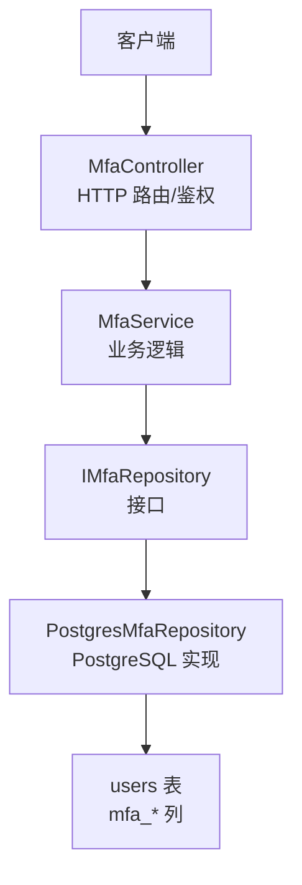
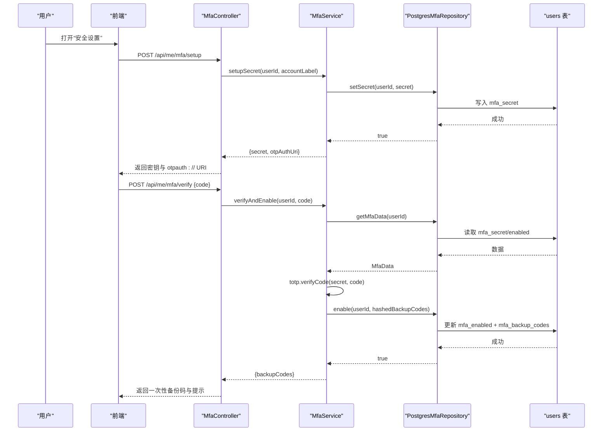
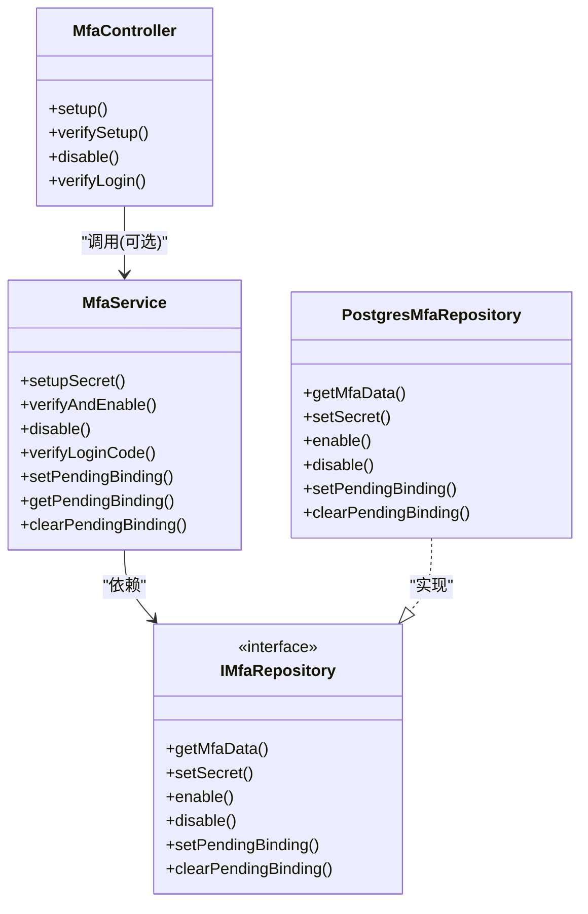

# 多因素认证API

<cite>
**本文引用的文件**
- [MfaController.h](file://libs/drogon/include/authforge/drogon/controllers/MfaController.h)
- [MfaController.cc](file://libs/drogon/src/controllers/MfaController.cc)
- [MfaService.h](file://libs/identity/include/authforge/identity/MfaService.h)
- [MfaService.cc](file://libs/identity/src/mfa/MfaService.cc)
- [IMfaRepository.h](file://libs/identity/include/authforge/identity/IMfaRepository.h)
- [PostgresMfaRepository.h](file://libs/storage-postgres/include/authforge/storage/postgres/PostgresMfaRepository.h)
- [PostgresMfaRepository.cc](file://libs/storage-postgres/src/PostgresMfaRepository.cc)
- [TotpUtils.h](file://libs/identity/include/authforge/identity/TotpUtils.h)
- [TotpUtils.cc](file://libs/identity/src/mfa/TotpUtils.cc)
- [V011__mfa_support.sql](file://apps/server/migrations/V011__mfa_support.sql)
- [openapi.yaml](file://apps/server/openapi.yaml)
- [openapi.json](file://apps/server/docs/api/openapi.json)
- [ControllerRegistration.cc](file://apps/server/src/bootstrap/ControllerRegistration.cc)
- [MfaEndpointHttpTest.cc](file://tests/integration/controllers/MfaEndpointHttpTest.cc)
- [SecurityPage.vue](file://frontends/user/src/pages/account/SecurityPage.vue)
</cite>

## 目录
1. [简介](#简介)
2. [项目结构](#项目结构)
3. [核心组件](#核心组件)
4. [架构总览](#架构总览)
5. [详细组件分析](#详细组件分析)
6. [依赖关系分析](#依赖关系分析)
7. [性能与安全考虑](#性能与安全考虑)
8. [故障排查指南](#故障排查指南)
9. [结论](#结论)
10. [附录：前端集成与用户体验流程](#附录前端集成与用户体验流程)

## 简介
本文件为 AuthForge 的多因素认证（MFA）API 的完整技术文档，覆盖 TOTP 设置、验证、禁用、登录时二次校验、备份码生成与恢复机制，以及 MFA 状态管理与前后端集成要点。系统提供以下关键能力：
- 用户自助开启 MFA：生成 TOTP 密钥与 otpauth:// URI（可渲染二维码），并引导用户完成首次验证码校验以启用 MFA。
- 登录时 MFA 校验：在 OAuth2 授权流程中，对已启用 MFA 的用户进行 TOTP 二次校验，通过后继续发放令牌。
- 备份码：启用 MFA 时一次性下发若干不可逆哈希存储的备份码，用于账户恢复。
- 安全存储：TOTP 密钥与备份码均以安全方式持久化；禁用 MFA 会彻底清理敏感数据。
- 跨客户端绑定保护：记录登录时的 client_id 与 redirect_uri，并在 MFA 校验时严格匹配，防止会话劫持。

## 项目结构
MFA 功能由三层组成：
- 控制器层（HTTP 路由与鉴权）：定义 /api/me/mfa/* 与 /oauth2/mfa/verify 等接口，负责参数校验、错误响应与审计日志。
- 领域服务层（框架无关的业务逻辑）：封装 TOTP 密钥生成、验证码校验、备份码生成、MFA 状态变更与待绑定信息维护。
- 存储适配层（PostgreSQL 实现）：将领域服务调用映射到 users 表的 mfa_* 字段读写。

图表来源
- [MfaController.h:52-72](file://libs/drogon/include/authforge/drogon/controllers/MfaController.h#L52-L72)
- [MfaService.h:72-161](file://libs/identity/include/authforge/identity/MfaService.h#L72-L161)
- [IMfaRepository.h:38-75](file://libs/identity/include/authforge/identity/IMfaRepository.h#L38-L75)
- [PostgresMfaRepository.h:24-51](file://libs/storage-postgres/include/authforge/storage/postgres/PostgresMfaRepository.h#L24-L51)
- [V011__mfa_support.sql:4-6](file://apps/server/migrations/V011__mfa_support.sql#L4-L6)

章节来源
- [MfaController.h:52-72](file://libs/drogon/include/authforge/drogon/controllers/MfaController.h#L52-L72)
- [ControllerRegistration.cc:79-81](file://apps/server/src/bootstrap/ControllerRegistration.cc#L79-L81)
- [openapi.yaml:1474-1517](file://apps/server/openapi.yaml#L1474-L1517)

## 核心组件
- MfaController：暴露 HTTP 接口，处理请求解析、鉴权、错误响应与审计日志；同时兼容注入式服务与原始 SQL 回退路径。
- MfaService：框架无关的 MFA 业务服务，负责密钥生成、验证码校验、启用/禁用、备份码生成与待绑定信息管理。
- IMfaRepository/PostgresMfaRepository：抽象与实现 MFA 数据的持久化操作，映射至 users 表的 mfa_* 列。
- TotpUtils：提供 TOTP 密钥生成、otpauth:// URI 构建、验证码生成与校验、备份码生成等工具方法。
- 数据库迁移 V011：为 users 表增加 mfa_enabled、mfa_secret、mfa_backup_codes 等列。

章节来源
- [MfaController.cc:92-458](file://libs/drogon/src/controllers/MfaController.cc#L92-L458)
- [MfaService.cc:21-183](file://libs/identity/src/mfa/MfaService.cc#L21-L183)
- [IMfaRepository.h:22-75](file://libs/identity/include/authforge/identity/IMfaRepository.h#L22-L75)
- [PostgresMfaRepository.cc:15-208](file://libs/storage-postgres/src/PostgresMfaRepository.cc#L15-L208)
- [TotpUtils.h:63-82](file://libs/identity/include/authforge/identity/TotpUtils.h#L63-L82)
- [TotpUtils.cc:153-184](file://libs/identity/src/mfa/TotpUtils.cc#L153-L184)
- [V011__mfa_support.sql:4-6](file://apps/server/migrations/V011__mfa_support.sql#L4-L6)

## 架构总览
MFA 相关 API 的端到端调用链如下：
- 用户自助设置：POST /api/me/mfa/setup → 生成密钥与 otpauth:// URI → 返回给前端展示二维码或手动密钥。
- 用户确认启用：POST /api/me/mfa/verify → 校验 TOTP 码 → 启用 MFA 并生成备份码（仅一次返回）。
- 用户禁用：POST /api/me/mfa/disable → 关闭 MFA 并清理密钥与备份码。
- 登录时二次校验：POST /oauth2/mfa/verify → 校验 TOTP 码 → 校验并匹配登录会话中的 client_id/redirect_uri → 生成授权码并换取令牌。

图表来源
- [MfaController.cc:92-376](file://libs/drogon/src/controllers/MfaController.cc#L92-L376)
- [MfaService.cc:21-103](file://libs/identity/src/mfa/MfaService.cc#L21-L103)
- [PostgresMfaRepository.cc:59-121](file://libs/storage-postgres/src/PostgresMfaRepository.cc#L59-L121)
- [V011__mfa_support.sql:4-6](file://apps/server/migrations/V011__mfa_support.sql#L4-L6)

## 详细组件分析

### 控制器层：MfaController
- 路由与鉴权
  - /api/me/mfa/setup：需要 Bearer Token（OAuth2AuthFilter），返回 secret 与 otpauth:// URI。
  - /api/me/mfa/verify：需要 Bearer Token，校验 TOTP 码并启用 MFA，返回一次性备份码。
  - /api/me/mfa/disable：需要 Bearer Token，关闭 MFA 并清理敏感数据。
  - /oauth2/mfa/verify：登录流程中的 MFA 校验，无需 Bearer Token，但需携带 mfa_token、code、client_id、redirect_uri、scope、nonce。
- 错误与审计
  - 统一通过 ErrorResponder 返回结构化错误码（如 AUTH_INVALID_CREDENTIALS、VALIDATION_FORMAT_ERROR 等）。
  - 成功启用与校验后记录审计日志（mfa_enabled、mfa_verified）。

章节来源
- [MfaController.h:52-72](file://libs/drogon/include/authforge/drogon/controllers/MfaController.h#L52-L72)
- [MfaController.cc:31-88](file://libs/drogon/src/controllers/MfaController.cc#L31-L88)
- [MfaController.cc:92-458](file://libs/drogon/src/controllers/MfaController.cc#L92-L458)
- [MfaController.cc:460-800](file://libs/drogon/src/controllers/MfaController.cc#L460-L800)

### 领域服务层：MfaService
- 职责边界
  - 不直接驱动 OAuth2 令牌发放，仅负责 TOTP 校验与 MFA 状态管理；令牌交换由上层编排。
  - 将 client_id/redirect_uri 视为不透明字符串，作为身份域内的“待绑定”状态保存与校验。
- 关键方法
  - setupSecret：生成随机密钥与 otpauth:// URI，写入 mfa_secret。
  - verifyAndEnable：校验 TOTP 码，启用 MFA，生成并哈希备份码后持久化。
  - disable：关闭 MFA，清空密钥与备份码。
  - verifyLoginCode：登录时校验 TOTP 码（需已启用且当前时间步有效）。
  - setPendingBinding/getPendingBinding/clearPendingBinding：维护登录会话与 MFA 校验之间的绑定关系。

章节来源
- [MfaService.h:47-161](file://libs/identity/include/authforge/identity/MfaService.h#L47-L161)
- [MfaService.cc:21-183](file://libs/identity/src/mfa/MfaService.cc#L21-L183)

### 存储适配层：IMfaRepository 与 PostgresMfaRepository
- 接口设计
  - 按列族拆分职责，避免 IUserRepository 膨胀；只关注 mfa_* 列的读写。
- PostgreSQL 实现
  - 使用 Drogon ORM Mapper 读写 users 表，序列化/反序列化 JSON 数组存储备份码。
  - 支持 pending 绑定字段（mfa_pending_client_id、mfa_pending_redirect_uri）的设置与清理。

章节来源
- [IMfaRepository.h:22-75](file://libs/identity/include/authforge/identity/IMfaRepository.h#L22-L75)
- [PostgresMfaRepository.h:24-51](file://libs/storage-postgres/include/authforge/storage/postgres/PostgresMfaRepository.h#L24-L51)
- [PostgresMfaRepository.cc:15-208](file://libs/storage-postgres/src/PostgresMfaRepository.cc#L15-L208)

### TOTP 工具：TotpUtils
- 密钥与 URI
  - generateSecret：基于安全随机源生成 Base32 密钥。
  - generateOtpAuthUri：构造标准 otpauth:// URI，便于扫码添加。
- 验证码
  - generateCode/verifyCode：基于时间步长与容差窗口生成与校验 6 位数字码。
- 备份码
  - generateBackupCodes：生成若干 8 字符、去歧义字符集的备用码，供一次性下发。

章节来源
- [TotpUtils.h:63-82](file://libs/identity/include/authforge/identity/TotpUtils.h#L63-L82)
- [TotpUtils.cc:153-184](file://libs/identity/src/mfa/TotpUtils.cc#L153-L184)

### 数据库模型：users 表 MFA 字段
- 新增列
  - mfa_enabled：是否启用 MFA。
  - mfa_secret：Base32 格式的 TOTP 密钥。
  - mfa_backup_codes：JSON 数组，存储备份码的哈希值。

章节来源
- [V011__mfa_support.sql:4-6](file://apps/server/migrations/V011__mfa_support.sql#L4-L6)

## 依赖关系分析
- 控制器依赖
  - MfaController 可选注入 MfaService 与 IUserRepository；未注入时回退到原始 SQL 路径，保证向后兼容。
- 服务依赖
  - MfaService 依赖 IMfaRepository、ICryptoProvider、IClock，并通过构造函数注入，保持框架无关性。
- 存储依赖
  - PostgresMfaRepository 依赖 Drogon ORM DbClient，实现 IMfaRepository 的所有方法。

图表来源
- [MfaController.h:23-99](file://libs/drogon/include/authforge/drogon/controllers/MfaController.h#L23-L99)
- [MfaService.h:72-161](file://libs/identity/include/authforge/identity/MfaService.h#L72-L161)
- [IMfaRepository.h:38-75](file://libs/identity/include/authforge/identity/IMfaRepository.h#L38-L75)
- [PostgresMfaRepository.h:24-51](file://libs/storage-postgres/include/authforge/storage/postgres/PostgresMfaRepository.h#L24-L51)

章节来源
- [MfaController.cc:107-141](file://libs/drogon/src/controllers/MfaController.cc#L107-L141)
- [MfaService.cc:8-18](file://libs/identity/src/mfa/MfaService.cc#L8-L18)
- [PostgresMfaRepository.cc:15-57](file://libs/storage-postgres/src/PostgresMfaRepository.cc#L15-L57)

## 性能与安全考虑
- 性能
  - 所有写操作均通过 ORM Mapper 执行单行更新，避免大事务；备份码以 JSON 数组存储，减少额外表。
  - 验证码校验使用固定时间步长与容差窗口，降低时钟漂移带来的失败率。
- 安全
  - TOTP 密钥与备份码均以安全方式存储；备份码仅存哈希，禁止明文落库。
  - 登录时 MFA 校验必须匹配登录会话绑定的 client_id 与 redirect_uri，防止跨客户端劫持。
  - 禁用 MFA 会彻底清除密钥与备份码，避免残留风险。
  - 统一错误响应，避免泄露过多细节（如区分“未配置”与“验证码错误”的策略需谨慎）。

章节来源
- [MfaService.cc:82-100](file://libs/identity/src/mfa/MfaService.cc#L82-L100)
- [PostgresMfaRepository.cc:96-121](file://libs/storage-postgres/src/PostgresMfaRepository.cc#L96-L121)
- [MfaController.cc:534-681](file://libs/drogon/src/controllers/MfaController.cc#L534-L681)

## 故障排查指南
- 常见错误码
  - AUTH_INVALID_CREDENTIALS：用户不存在、客户端无效或重定向地址未注册。
  - VALIDATION_FORMAT_ERROR：缺少必填字段或格式不正确（如 TOTP 码非 6 位）。
  - AUTH_MFA_NOT_CONFIGURED：未先调用设置或未找到待验证的密钥。
  - AUTH_MFA_CODE_INVALID：验证码不正确。
  - DB_QUERY_ERROR：数据库写入失败。
- 排查步骤
  - 检查请求是否携带有效的 Bearer Token（/api/me/mfa/*）。
  - 确认已调用 /api/me/mfa/setup 并获取到 secret 与 otpauth:// URI。
  - 核对 TOTP 码是否为 6 位数字，且在当前时间步容差范围内。
  - 登录时校验需确保 client_id 与 redirect_uri 与登录会话一致。
  - 查看审计日志（mfa_enabled、mfa_verified）定位成功路径。

章节来源
- [MfaController.cc:210-218](file://libs/drogon/src/controllers/MfaController.cc#L210-L218)
- [MfaController.cc:244-259](file://libs/drogon/src/controllers/MfaController.cc#L244-L259)
- [MfaController.cc:490-514](file://libs/drogon/src/controllers/MfaController.cc#L490-L514)
- [MfaController.cc:554-599](file://libs/drogon/src/controllers/MfaController.cc#L554-L599)

## 结论
AuthForge 的 MFA 模块采用清晰的三层架构，将 HTTP 路由、业务逻辑与数据存储解耦，既保证了安全性（密钥与备份码的安全存储、严格的会话绑定校验），又具备良好的可扩展性与兼容性（注入式服务与原始 SQL 回退）。通过标准化的 TOTP 流程与一次性备份码机制，为用户提供了可靠的二次认证体验。

## 附录：前端集成与用户体验流程
- 典型流程
  - 进入“安全设置”，调用 /api/me/mfa/setup，获取 secret 与 otpauth:// URI，前端可渲染二维码或显示手动密钥。
  - 用户在认证器 App 中扫码或手动输入密钥，获得 6 位验证码。
  - 调用 /api/me/mfa/verify 提交验证码，成功后一次性获取备份码，提示用户妥善保存。
  - 如需关闭 MFA，调用 /api/me/mfa/disable，系统将清理密钥与备份码。
  - 登录时若检测到用户启用了 MFA，跳转至 /oauth2/mfa/verify 进行二次校验，通过后继续授权流程。
- 前端示例参考
  - 页面结构与交互逻辑可参考 SecurityPage.vue，包含密钥展示、验证码输入、启用与禁用按钮等。

章节来源
- [SecurityPage.vue:218-239](file://frontends/user/src/pages/account/SecurityPage.vue#L218-L239)
- [MfaEndpointHttpTest.cc:47-80](file://tests/integration/controllers/MfaEndpointHttpTest.cc#L47-L80)
- [MfaEndpointHttpTest.cc:109-131](file://tests/integration/controllers/MfaEndpointHttpTest.cc#L109-L131)