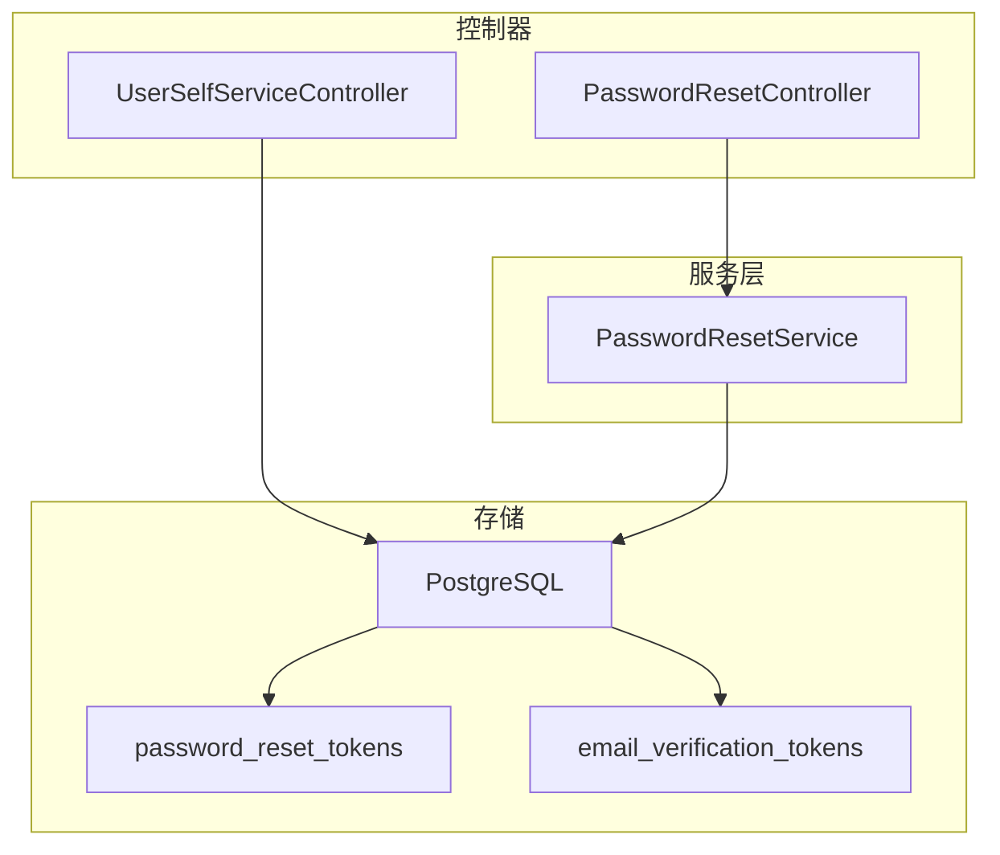
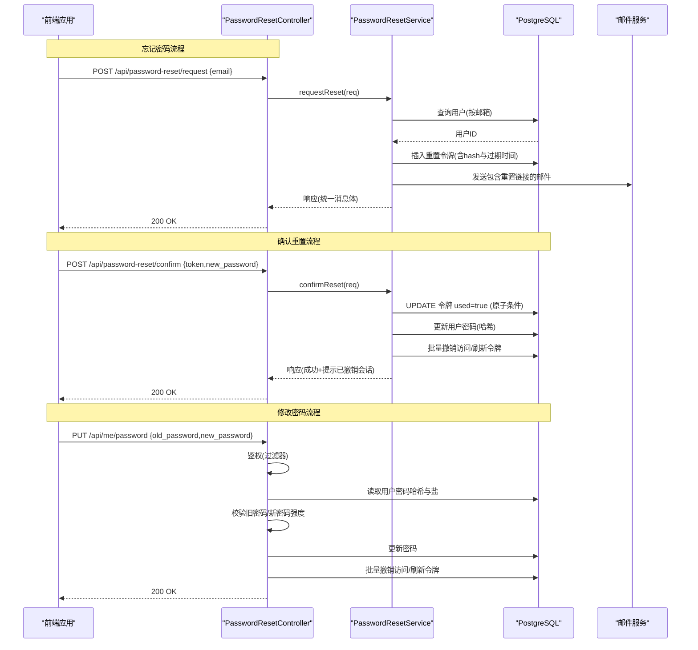
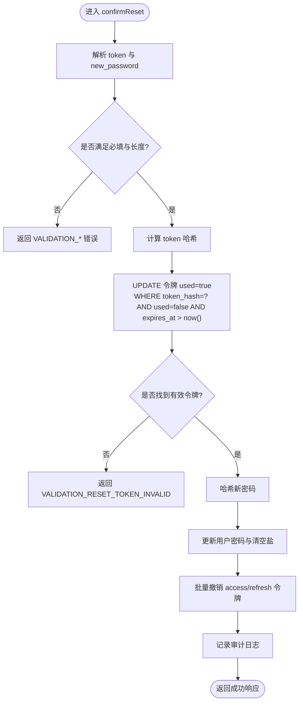
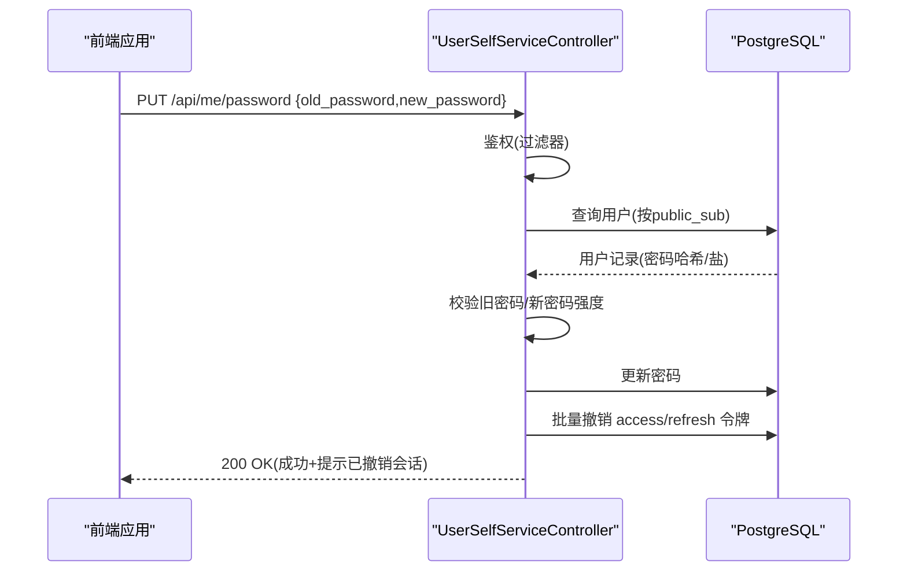
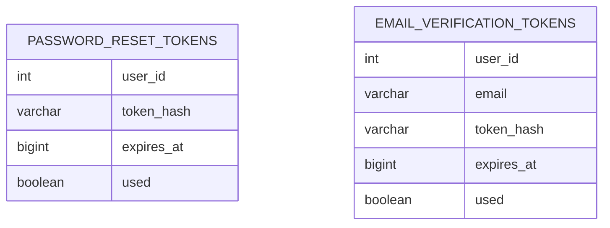
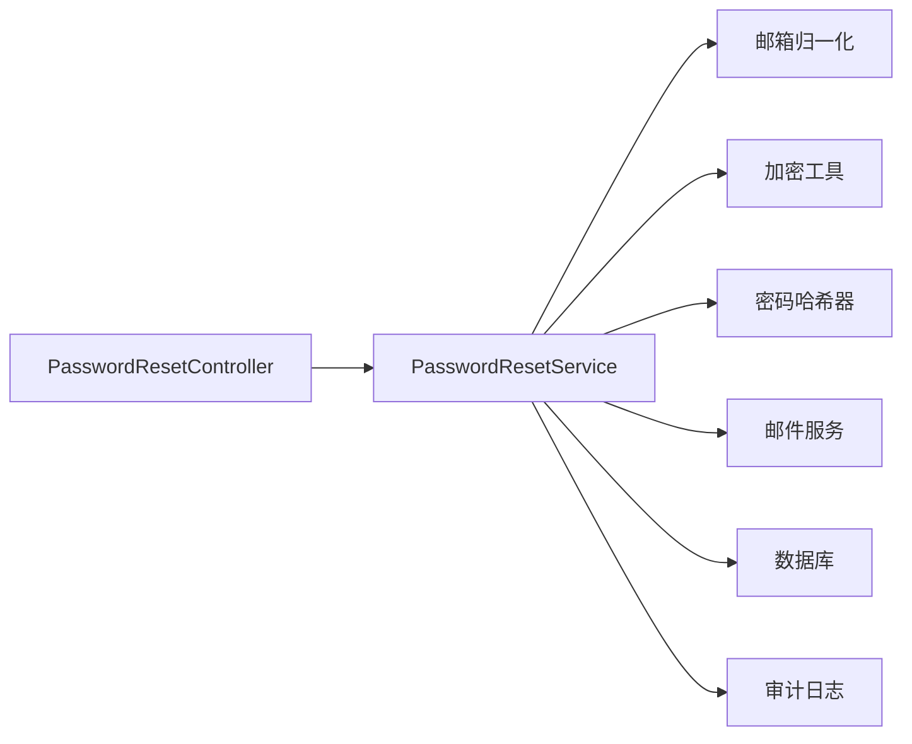

# 密码管理API

<cite>
**本文引用的文件**
- [PasswordResetController.h](file://libs/drogon/include/authforge/drogon/controllers/PasswordResetController.h)
- [PasswordResetController.cc](file://libs/drogon/src/controllers/PasswordResetController.cc)
- [PasswordResetService.cc](file://libs/drogon/src/services/PasswordResetService.cc)
- [UserSelfServiceController.h](file://libs/drogon/include/authforge/drogon/controllers/UserSelfServiceController.h)
- [UserSelfServiceController.cc](file://libs/drogon/src/controllers/UserSelfServiceController.cc)
- [V009__password_reset_tokens.sql](file://apps/server/migrations/V009__password_reset_tokens.sql)
- [V010__email_verification.sql](file://apps/server/migrations/V010__email_verification.sql)
- [V021__widen_email_verification_tokens_email.sql](file://apps/server/migrations/V021__widen_email_verification_tokens_email.sql)
</cite>

## 目录
1. [简介](#简介)
2. [项目结构](#项目结构)
3. [核心组件](#核心组件)
4. [架构总览](#架构总览)
5. [详细组件分析](#详细组件分析)
6. [依赖关系分析](#依赖关系分析)
7. [性能与安全考量](#性能与安全考量)
8. [故障排查指南](#故障排查指南)
9. [结论](#结论)
10. [附录：前端集成与用户体验流程](#附录：前端集成与用户体验流程)

## 简介
本文件面向密码管理相关API，覆盖以下能力：
- 忘记密码：请求重置链接（邮箱发送）
- 确认重置：使用令牌设置新密码
- 修改密码：已登录用户更新自身密码

文档重点说明：
- 密码重置流程、邮箱验证机制、临时令牌管理与安全策略
- 密码强度校验规则、令牌有效期与防暴力破解机制
- 完整的用户体验流程与前端集成要点

## 项目结构
密码管理功能由控制器与服务层组成，数据持久化通过迁移脚本维护。关键路径如下：
- 控制器：定义路由与OpenAPI文档元信息
- 服务层：实现业务逻辑（令牌生成、邮件发送、密码更新、会话撤销等）
- 数据库：密码重置令牌表、邮箱验证令牌表及相关索引

图表来源
- [PasswordResetController.h:12-18](file://libs/drogon/include/authforge/drogon/controllers/PasswordResetController.h#L12-L18)
- [UserSelfServiceController.h:13-47](file://libs/drogon/include/authforge/drogon/controllers/UserSelfServiceController.h#L13-L47)
- [V009__password_reset_tokens.sql:4-13](file://apps/server/migrations/V009__password_reset_tokens.sql#L4-L13)
- [V010__email_verification.sql:6-15](file://apps/server/migrations/V010__email_verification.sql#L6-L15)

章节来源
- [PasswordResetController.h:12-18](file://libs/drogon/include/authforge/drogon/controllers/PasswordResetController.h#L12-L18)
- [UserSelfServiceController.h:13-47](file://libs/drogon/include/authforge/drogon/controllers/UserSelfServiceController.h#L13-L47)
- [V009__password_reset_tokens.sql:4-13](file://apps/server/migrations/V009__password_reset_tokens.sql#L4-L13)
- [V010__email_verification.sql:6-15](file://apps/server/migrations/V010__email_verification.sql#L6-L15)

## 核心组件
- PasswordResetController：暴露“请求重置”和“确认重置”两个无鉴权接口，并注册OpenAPI文档。
- PasswordResetService：实现密码重置的核心流程，包括邮箱归一化、令牌生成与哈希、过期时间控制、发送邮件、令牌校验、密码更新与会话批量撤销。
- UserSelfServiceController：提供“修改密码”的受保护接口，要求当前用户认证，校验旧密码与新密码强度，成功后批量撤销该用户所有会话。

章节来源
- [PasswordResetController.cc:16-32](file://libs/drogon/src/controllers/PasswordResetController.cc#L16-L32)
- [PasswordResetService.cc:64-156](file://libs/drogon/src/services/PasswordResetService.cc#L64-L156)
- [PasswordResetService.cc:158-373](file://libs/drogon/src/services/PasswordResetService.cc#L158-L373)
- [UserSelfServiceController.cc:64-71](file://libs/drogon/src/controllers/UserSelfServiceController.cc#L64-L71)
- [UserSelfServiceController.cc:140-351](file://libs/drogon/src/controllers/UserSelfServiceController.cc#L140-L351)

## 架构总览
下图展示了从前端到后端再到存储的端到端调用链，涵盖“忘记密码”和“修改密码”两条主线。

图表来源
- [PasswordResetController.h:12-18](file://libs/drogon/include/authforge/drogon/controllers/PasswordResetController.h#L12-L18)
- [PasswordResetController.cc:46-64](file://libs/drogon/src/controllers/PasswordResetController.cc#L46-L64)
- [PasswordResetService.cc:64-156](file://libs/drogon/src/services/PasswordResetService.cc#L64-L156)
- [PasswordResetService.cc:158-373](file://libs/drogon/src/services/PasswordResetService.cc#L158-L373)
- [UserSelfServiceController.h:23-28](file://libs/drogon/include/authforge/drogon/controllers/UserSelfServiceController.h#L23-L28)
- [UserSelfServiceController.cc:140-351](file://libs/drogon/src/controllers/UserSelfServiceController.cc#L140-L351)

## 详细组件分析

### 组件A：密码重置控制器与服务
- 路由与文档
  - POST /api/password-reset/request：请求重置链接（无需鉴权）
  - POST /api/password-reset/confirm：确认重置（无需鉴权）
- 业务流程
  - 请求重置：
    - 解析邮箱（支持JSON或表单），进行邮箱归一化
    - 查找用户，生成安全随机令牌并计算哈希
    - 写入重置令牌表，设置过期时间为15分钟
    - 构造前端重置链接并发送邮件
    - 返回统一消息体（不泄露是否存在该邮箱）
  - 确认重置：
    - 校验必填字段与密码长度（至少8位）
    - 将令牌哈希与当前时间作为条件原子更新令牌为已用，并返回user_id
    - 哈希新密码并更新用户记录
    - 批量撤销该用户的所有访问令牌与刷新令牌
    - 记录审计日志并返回成功响应

图表来源
- [PasswordResetService.cc:158-373](file://libs/drogon/src/services/PasswordResetService.cc#L158-L373)

章节来源
- [PasswordResetController.cc:16-32](file://libs/drogon/src/controllers/PasswordResetController.cc#L16-L32)
- [PasswordResetController.cc:46-64](file://libs/drogon/src/controllers/PasswordResetController.cc#L46-L64)
- [PasswordResetService.cc:64-156](file://libs/drogon/src/services/PasswordResetService.cc#L64-L156)
- [PasswordResetService.cc:158-373](file://libs/drogon/src/services/PasswordResetService.cc#L158-L373)

### 组件B：用户自服务（修改密码）
- 路由与鉴权
  - PUT /api/me/password：需要OAuth2鉴权过滤器
- 业务流程
  - 解析JSON请求体，校验 old_password 与 new_password 必填且新密码长度≥8
  - 根据当前用户public_sub查询用户，校验旧密码
  - 哈希新密码并更新用户记录
  - 批量撤销该用户所有访问令牌与刷新令牌
  - 记录审计日志并返回成功响应

图表来源
- [UserSelfServiceController.h:23-28](file://libs/drogon/include/authforge/drogon/controllers/UserSelfServiceController.h#L23-L28)
- [UserSelfServiceController.cc:140-351](file://libs/drogon/src/controllers/UserSelfServiceController.cc#L140-L351)

章节来源
- [UserSelfServiceController.h:23-28](file://libs/drogon/include/authforge/drogon/controllers/UserSelfServiceController.h#L23-L28)
- [UserSelfServiceController.cc:140-351](file://libs/drogon/src/controllers/UserSelfServiceController.cc#L140-L351)

### 数据模型与持久化
- 密码重置令牌表
  - 字段：令牌哈希、用户ID、过期时间、是否已用
  - 索引：按用户ID、过期时间优化查询
- 邮箱验证令牌表（与密码重置并列存在）
  - 字段：令牌哈希、用户ID、邮箱、过期时间、是否已用
  - 索引：按用户ID、过期时间优化查询
- 版本演进
  - V021 对邮箱验证令牌的邮箱字段进行了扩容，不影响密码重置令牌表

图表来源
- [V009__password_reset_tokens.sql:4-13](file://apps/server/migrations/V009__password_reset_tokens.sql#L4-L13)
- [V010__email_verification.sql:6-15](file://apps/server/migrations/V010__email_verification.sql#L6-L15)
- [V021__widen_email_verification_tokens_email.sql:1-8](file://apps/server/migrations/V021__widen_email_verification_tokens_email.sql#L1-L8)

章节来源
- [V009__password_reset_tokens.sql:4-13](file://apps/server/migrations/V009__password_reset_tokens.sql#L4-L13)
- [V010__email_verification.sql:6-15](file://apps/server/migrations/V010__email_verification.sql#L6-L15)
- [V021__widen_email_verification_tokens_email.sql:1-8](file://apps/server/migrations/V021__widen_email_verification_tokens_email.sql#L1-L8)

## 依赖关系分析
- 控制器依赖服务层处理业务逻辑，并通过Drogon框架获取数据库客户端
- 服务层依赖：
  - 邮箱归一化工具（保证查找一致性）
  - 加密工具（生成安全令牌、哈希令牌）
  - 密码哈希器（安全存储密码）
  - 邮件服务（发送重置链接）
  - 审计日志适配器（记录敏感操作）
- 数据库层通过Mapper或直接SQL执行完成CRUD与批量撤销

图表来源
- [PasswordResetController.cc:46-64](file://libs/drogon/src/controllers/PasswordResetController.cc#L46-L64)
- [PasswordResetService.cc:64-156](file://libs/drogon/src/services/PasswordResetService.cc#L64-L156)
- [PasswordResetService.cc:158-373](file://libs/drogon/src/services/PasswordResetService.cc#L158-L373)

章节来源
- [PasswordResetController.cc:46-64](file://libs/drogon/src/controllers/PasswordResetController.cc#L46-L64)
- [PasswordResetService.cc:64-156](file://libs/drogon/src/services/PasswordResetService.cc#L64-L156)
- [PasswordResetService.cc:158-373](file://libs/drogon/src/services/PasswordResetService.cc#L158-L373)

## 性能与安全考量
- 性能
  - 使用索引优化令牌查询（按过期时间与用户ID）
  - 批量撤销令牌采用直接SQL，避免N次Mapper更新带来的开销
  - 异步数据库操作减少阻塞
- 安全
  - 令牌以哈希形式存储，避免明文泄露
  - 令牌有效期为15分钟，过期即失效
  - 确认重置使用原子条件更新，防止并发重复使用
  - 重置成功后批量撤销所有会话，降低重放风险
  - 统一错误响应，避免泄露用户是否存在
  - 审计日志记录敏感操作（密码重置、修改密码）
- 防暴力破解
  - 建议在前端与网关层增加速率限制（例如同一邮箱/IP在短时间内的请求上限）
  - 服务端可结合限流中间件对无鉴权接口进行防护（当前代码未内置，需部署侧配置）

[本节为通用指导，不直接分析具体文件]

## 故障排查指南
- 常见错误码与含义
  - VALIDATION_MISSING_REQUIRED_FIELD：缺少必填字段（如email、token、new_password）
  - VALIDATION_FORMAT_ERROR：格式不合法（如新密码长度不足）
  - VALIDATION_RESET_TOKEN_INVALID：令牌无效、已过期或已被使用
  - AUTH_INVALID_CREDENTIALS：旧密码不正确（修改密码场景）
  - DB_CONNECTION_ERROR：数据库不可用
  - DB_QUERY_ERROR：数据库查询失败
  - INTERNAL_ERROR：内部异常（如密码哈希失败）
- 排查步骤
  - 检查请求体字段是否完整、类型是否正确
  - 检查邮箱是否已归一化（大小写、空格）
  - 检查令牌是否在有效期内且未被使用
  - 查看审计日志定位敏感操作轨迹
  - 检查数据库连接与权限

章节来源
- [PasswordResetService.cc:81-89](file://libs/drogon/src/services/PasswordResetService.cc#L81-L89)
- [PasswordResetService.cc:179-199](file://libs/drogon/src/services/PasswordResetService.cc#L179-L199)
- [PasswordResetService.cc:217-225](file://libs/drogon/src/services/PasswordResetService.cc#L217-L225)
- [UserSelfServiceController.cc:162-182](file://libs/drogon/src/controllers/UserSelfServiceController.cc#L162-L182)
- [UserSelfServiceController.cc:195-215](file://libs/drogon/src/controllers/UserSelfServiceController.cc#L195-L215)

## 结论
本套密码管理API实现了安全的密码重置与修改流程：
- 通过令牌哈希与短有效期保障重置链路安全
- 通过原子更新与批量会话撤销降低重放与横向移动风险
- 通过统一错误响应与审计日志提升可观测性与合规性
建议在部署侧补充速率限制与WAF策略，进一步增强抗暴力破解能力。

[本节为总结，不直接分析具体文件]

## 附录：前端集成与用户体验流程
- 忘记密码流程
  - 用户在“忘记密码”页面输入邮箱
  - 调用 POST /api/password-reset/request
  - 收到统一消息后，引导用户前往邮箱点击重置链接
  - 跳转至前端重置页面，携带token参数
  - 提交新密码至 POST /api/password-reset/confirm
  - 成功后提示用户重新登录（因会话已撤销）
- 修改密码流程
  - 已登录用户进入“账户安全”页面
  - 输入旧密码与新密码（新密码≥8位）
  - 调用 PUT /api/me/password
  - 成功后提示用户所有设备将被强制下线

- 前端校验建议
  - 邮箱格式校验
  - 新密码强度提示（长度、复杂度）
  - 网络错误重试与友好提示
  - 令牌过期时引导重新请求重置链接

- 安全最佳实践
  - 使用HTTPS传输
  - 不要在前端存储或展示令牌
  - 重置成功后强制重新认证

[本节为概念性内容，不直接分析具体文件]