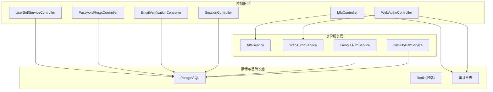
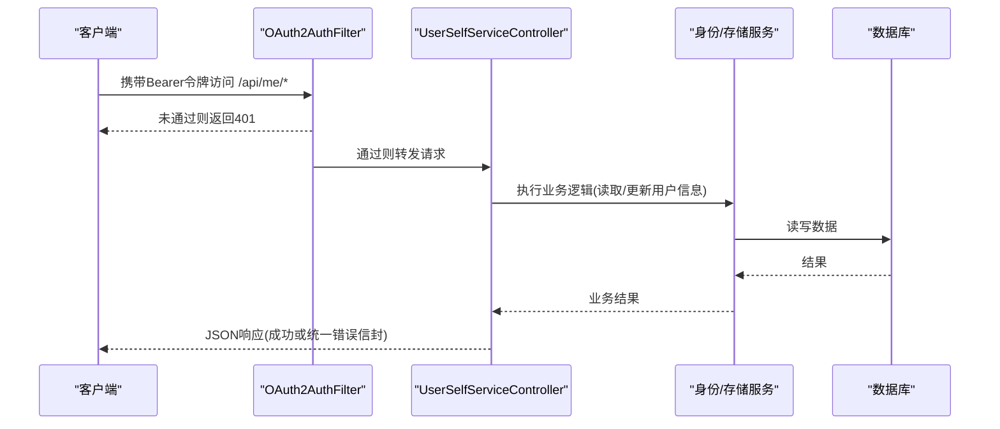
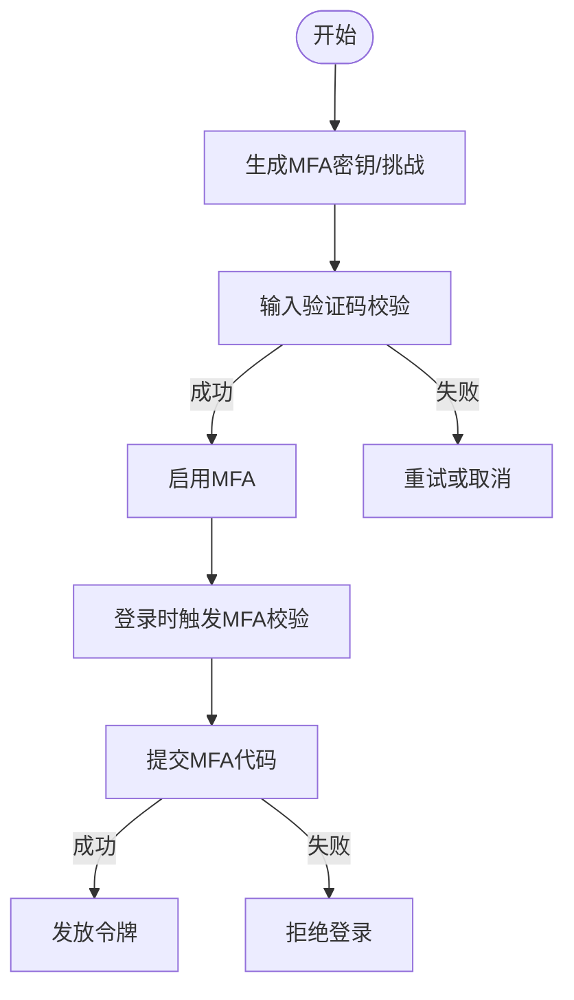
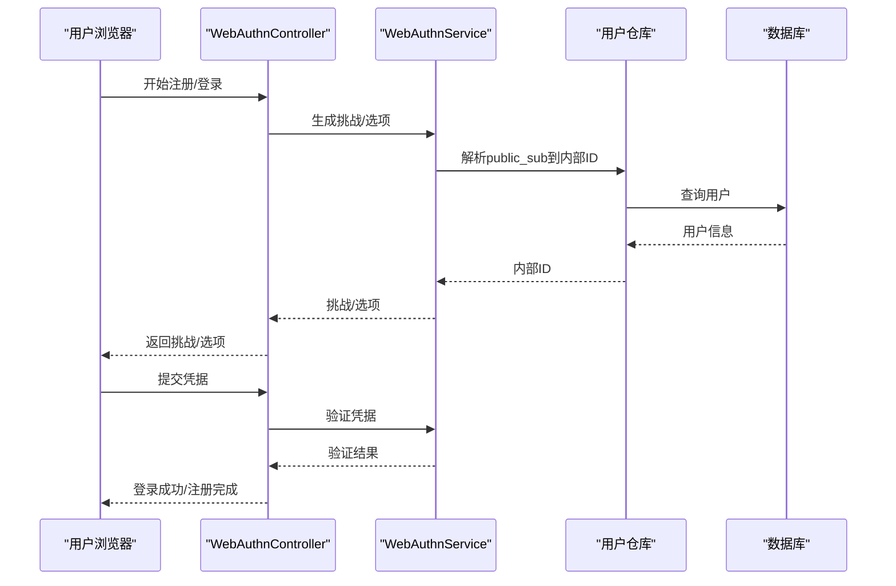
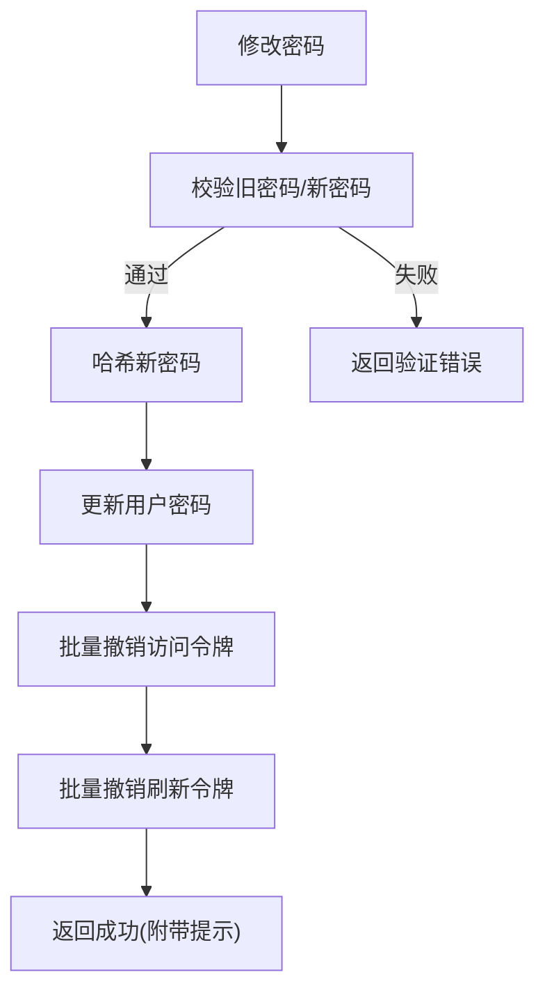
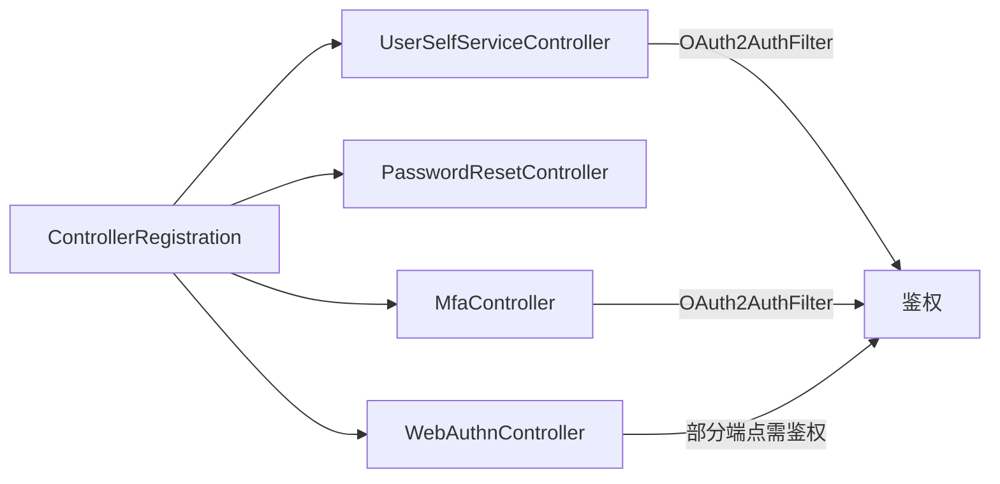

# 用户自服务API

<cite>
**本文引用的文件**
- [apps/server/docs/api/openapi.json](file://apps/server/docs/api/openapi.json)
- [apps/server/openapi.yaml](file://apps/server/openapi.yaml)
- [apps/server/src/bootstrap/ControllerRegistration.cc](file://apps/server/src/bootstrap/ControllerRegistration.cc)
- [libs/drogon/include/authforge/drogon/controllers/UserSelfServiceController.h](file://libs/drogon/include/authforge/drogon/controllers/UserSelfServiceController.h)
- [libs/drogon/src/controllers/UserSelfServiceController.cc](file://libs/drogon/src/controllers/UserSelfServiceController.cc)
- [libs/drogon/include/authforge/drogon/controllers/MfaController.h](file://libs/drogon/include/authforge/drogon/controllers/MfaController.h)
- [libs/drogon/include/authforge/drogon/controllers/PasswordResetController.h](file://libs/drogon/include/authforge/drogon/controllers/PasswordResetController.h)
- [libs/drogon/src/controllers/PasswordResetController.cc](file://libs/drogon/src/controllers/PasswordResetController.cc)
- [libs/drogon/include/authforge/drogon/controllers/EmailVerificationController.h](file://libs/drogon/include/authforge/drogon/controllers/EmailVerificationController.h)
- [libs/drogon/include/authforge/drogon/controllers/WebAuthnController.h](file://libs/drogon/include/authforge/drogon/controllers/WebAuthnController.h)
- [libs/drogon/src/controllers/WebAuthnController.cc](file://libs/drogon/src/controllers/WebAuthnController.cc)
- [libs/identity/include/authforge/identity/WebAuthnService.h](file://libs/identity/include/authforge/identity/WebAuthnService.h)
- [libs/identity/src/social/GitHubAuthService.cc](file://libs/identity/src/social/GitHubAuthService.cc)
- [libs/identity/include/authforge/identity/SocialAuthService.h](file://libs/identity/include/authforge/identity/SocialAuthService.h)
- [libs/identity/src/social/GoogleAuthService.cc](file://libs/identity/src/social/GoogleAuthService.cc)
- [libs/drogon/src/controllers/SessionController.cc](file://libs/drogon/src/controllers/SessionController.cc)
</cite>

## 目录
1. [简介](#简介)
2. [项目结构](#项目结构)
3. [核心组件](#核心组件)
4. [架构总览](#架构总览)
5. [详细组件分析](#详细组件分析)
6. [依赖关系分析](#依赖关系分析)
7. [性能考虑](#性能考虑)
8. [故障排查指南](#故障排查指南)
9. [结论](#结论)
10. [附录](#附录)

## 简介
本文件面向“用户自服务”能力，覆盖注册、登录、密码重置、邮箱验证、MFA（双因素认证）、WebAuthn（生物识别/无密码）等端点。文档聚焦：
- 每个端点的认证流程、参数校验与响应格式
- 社交登录集成（GitHub/Google）
- 会话管理与安全策略
- 前端集成示例与错误处理最佳实践
- 完整用户生命周期管理示例

## 项目结构
后端采用分层控制器+服务的设计，控制器负责HTTP路由、请求解析与响应封装；业务逻辑下沉至身份层服务（如 MfaService、WebAuthnService、SocialAuthService）。控制器通过Drogon框架注册，并在启动时集中装配。

图表来源
- [apps/server/src/bootstrap/ControllerRegistration.cc:83-95](file://apps/server/src/bootstrap/ControllerRegistration.cc#L83-L95)
- [libs/drogon/include/authforge/drogon/controllers/UserSelfServiceController.h:13-47](file://libs/drogon/include/authforge/drogon/controllers/UserSelfServiceController.h#L13-L47)
- [libs/drogon/include/authforge/drogon/controllers/MfaController.h:52-72](file://libs/drogon/include/authforge/drogon/controllers/MfaController.h#L52-L72)
- [libs/drogon/include/authforge/drogon/controllers/WebAuthnController.h:50-82](file://libs/drogon/include/authforge/drogon/controllers/WebAuthnController.h#L50-L82)

章节来源
- [apps/server/src/bootstrap/ControllerRegistration.cc:83-95](file://apps/server/src/bootstrap/ControllerRegistration.cc#L83-L95)

## 核心组件
- 用户自服务控制器：提供个人资料查询、修改密码、授权应用列表与撤销、账户删除等能力
- 密码重置控制器：发起重置、确认重置
- 邮箱验证控制器：验证邮箱、重发验证邮件
- MFA控制器：启用/禁用MFA、登录时MFA校验
- WebAuthn控制器：注册/登录/列出凭据
- 会话控制器：注册、登录、同意页等通用认证流程
- 社交登录服务：GitHub/Google OAuth2授权码交换与本地账号关联

章节来源
- [libs/drogon/include/authforge/drogon/controllers/UserSelfServiceController.h:13-47](file://libs/drogon/include/authforge/drogon/controllers/UserSelfServiceController.h#L13-L47)
- [libs/drogon/include/authforge/drogon/controllers/PasswordResetController.h:12-29](file://libs/drogon/include/authforge/drogon/controllers/PasswordResetController.h#L12-L29)
- [libs/drogon/include/authforge/drogon/controllers/EmailVerificationController.h:13-39](file://libs/drogon/include/authforge/drogon/controllers/EmailVerificationController.h#L13-L39)
- [libs/drogon/include/authforge/drogon/controllers/MfaController.h:23-72](file://libs/drogon/include/authforge/drogon/controllers/MfaController.h#L23-L72)
- [libs/drogon/include/authforge/drogon/controllers/WebAuthnController.h:21-82](file://libs/drogon/include/authforge/drogon/controllers/WebAuthnController.h#L21-L82)
- [libs/drogon/src/controllers/SessionController.cc:172-224](file://libs/drogon/src/controllers/SessionController.cc#L172-L224)
- [libs/identity/include/authforge/identity/SocialAuthService.h:227-270](file://libs/identity/include/authforge/identity/SocialAuthService.h#L227-L270)

## 架构总览
下图展示用户自服务相关端点在控制器与服务层之间的调用关系，以及安全过滤器对受保护端点的鉴权作用。

图表来源
- [libs/drogon/include/authforge/drogon/controllers/UserSelfServiceController.h:17-46](file://libs/drogon/include/authforge/drogon/controllers/UserSelfServiceController.h#L17-L46)
- [libs/drogon/src/controllers/UserSelfServiceController.cc:99-138](file://libs/drogon/src/controllers/UserSelfServiceController.cc#L99-L138)

## 详细组件分析

### 注册与登录（/api/register、/api/login）
- 注册
  - 路径：POST /api/register
  - 认证：无需登录
  - 主要参数：用户名、邮箱、密码等（由服务端校验规则决定）
  - 响应：注册成功或返回统一错误信封
  - 说明：注册流程在会话控制器中登记OpenAPI文档并实现注册逻辑
- 登录
  - 路径：/oauth2/token 或会话控制器提供的登录入口（根据客户端流选择）
  - 认证：无需登录
  - 主要参数：用户名/邮箱、密码、grant_type等
  - 响应：access_token、refresh_token、expires_in、token_type
  - 说明：登录成功后可进入后续MFA或WebAuthn流程

章节来源
- [libs/drogon/src/controllers/SessionController.cc:172-224](file://libs/drogon/src/controllers/SessionController.cc#L172-L224)
- [apps/server/openapi.yaml:16-26](file://apps/server/openapi.yaml#L16-L26)

### 密码重置（/api/password-reset/request、/api/password-reset/confirm）
- 请求重置
  - 路径：POST /api/password-reset/request
  - 认证：无需登录
  - 参数：邮箱（用于定位用户）
  - 行为：生成一次性重置令牌并发送邮件
- 确认重置
  - 路径：POST /api/password-reset/confirm
  - 认证：无需登录
  - 参数：重置令牌、新密码
  - 行为：校验令牌并更新密码
- 安全要点
  - 令牌短期有效、一次性使用
  - 失败不泄露用户是否存在

章节来源
- [libs/drogon/include/authforge/drogon/controllers/PasswordResetController.h:12-29](file://libs/drogon/include/authforge/drogon/controllers/PasswordResetController.h#L12-L29)
- [libs/drogon/src/controllers/PasswordResetController.cc:46-64](file://libs/drogon/src/controllers/PasswordResetController.cc#L46-L64)

### 邮箱验证（/api/verify-email、/api/verify-email/resend）
- 验证邮箱
  - 路径：GET /api/verify-email
  - 认证：无需登录（基于令牌）
  - 行为：校验邮箱验证令牌并标记已验证
- 重发验证邮件
  - 路径：POST /api/verify-email/resend
  - 认证：需要登录（OAuth2AuthFilter）
  - 行为：为当前用户重新发送验证邮件

章节来源
- [libs/drogon/include/authforge/drogon/controllers/EmailVerificationController.h:13-39](file://libs/drogon/include/authforge/drogon/controllers/EmailVerificationController.h#L13-L39)

### 双因素认证（MFA）
- 设置MFA
  - 路径：POST /api/me/mfa/setup
  - 认证：需要登录
  - 行为：生成MFA密钥/二维码，供客户端绑定
- 验证设置
  - 路径：POST /api/me/mfa/verify
  - 认证：需要登录
  - 行为：校验一次验证码以启用MFA
- 禁用MFA
  - 路径：POST /api/me/mfa/disable
  - 认证：需要登录
  - 行为：关闭MFA
- 登录时MFA校验
  - 路径：POST /oauth2/mfa/verify
  - 认证：登录流程中的二次校验阶段
  - 行为：校验MFA代码完成登录

图表来源
- [libs/drogon/include/authforge/drogon/controllers/MfaController.h:52-72](file://libs/drogon/include/authforge/drogon/controllers/MfaController.h#L52-L72)

章节来源
- [libs/drogon/include/authforge/drogon/controllers/MfaController.h:23-72](file://libs/drogon/include/authforge/drogon/controllers/MfaController.h#L23-L72)

### WebAuthn（生物识别/无密码）
- 注册流程（需登录）
  - 开始：POST /api/me/webauthn/register/begin
  - 完成：POST /api/me/webauthn/register/finish
- 登录流程（无需登录）
  - 开始：POST /oauth2/webauthn/authenticate/begin
  - 完成：POST /oauth2/webauthn/authenticate/finish
- 列出凭据：GET /api/me/webauthn/credentials（需登录）

图表来源
- [libs/drogon/include/authforge/drogon/controllers/WebAuthnController.h:50-82](file://libs/drogon/include/authforge/drogon/controllers/WebAuthnController.h#L50-L82)
- [libs/drogon/src/controllers/WebAuthnController.cc:43-67](file://libs/drogon/src/controllers/WebAuthnController.cc#L43-L67)
- [libs/identity/include/authforge/identity/WebAuthnService.h:79-107](file://libs/identity/include/authforge/identity/WebAuthnService.h#L79-L107)

章节来源
- [libs/drogon/include/authforge/drogon/controllers/WebAuthnController.h:21-108](file://libs/drogon/include/authforge/drogon/controllers/WebAuthnController.h#L21-L108)
- [libs/drogon/src/controllers/WebAuthnController.cc:43-67](file://libs/drogon/src/controllers/WebAuthnController.cc#L43-L67)

### 社交登录集成（GitHub/Google）
- GitHub
  - 回调后交换授权码为用户信息，并查找或创建本地账号
- Google
  - 类似流程，使用授权码换取访问令牌并拉取用户资料
- 注意：社交服务仅负责外部平台交互与本地账号关联，不直接签发OAuth2令牌

章节来源
- [libs/identity/src/social/GitHubAuthService.cc:1-44](file://libs/identity/src/social/GitHubAuthService.cc#L1-L44)
- [libs/identity/include/authforge/identity/SocialAuthService.h:227-270](file://libs/identity/include/authforge/identity/SocialAuthService.h#L227-L270)
- [libs/identity/src/social/GoogleAuthService.cc:1-47](file://libs/identity/src/social/GoogleAuthService.cc#L1-L47)

### 用户自服务（个人资料、密码、授权应用、账户删除）
- 获取个人资料：GET /api/me（需登录）
- 修改密码：PUT /api/me/password（需登录）
  - 校验旧密码与新密码强度
  - 成功后批量撤销该用户所有访问令牌与刷新令牌
- 列出授权应用：GET /api/me/authorized-apps（需登录）
- 撤销应用授权：DELETE /api/me/authorized-apps/{clientId}（需登录）
  - 撤销同意后批量撤销对应client的访问令牌
- 删除账户：DELETE /api/me（需登录）
  - 软删除：匿名化用户名、清空邮箱、置密码占位符
  - 批量撤销该用户所有令牌

图表来源
- [libs/drogon/src/controllers/UserSelfServiceController.cc:140-350](file://libs/drogon/src/controllers/UserSelfServiceController.cc#L140-L350)

章节来源
- [libs/drogon/include/authforge/drogon/controllers/UserSelfServiceController.h:13-47](file://libs/drogon/include/authforge/drogon/controllers/UserSelfServiceController.h#L13-L47)
- [libs/drogon/src/controllers/UserSelfServiceController.cc:99-700](file://libs/drogon/src/controllers/UserSelfServiceController.cc#L99-L700)

## 依赖关系分析
- 控制器注册：启动时集中注册各控制器，包括用户自服务、密码重置、MFA、WebAuthn等
- 鉴权过滤器：受保护端点通过OAuth2AuthFilter进行令牌校验
- 服务注入：MFA/WebAuthn控制器通过setter注入身份服务与用户仓库，便于测试与解耦
- 审计：关键操作（密码变更、应用授权撤销、账户删除）记录审计日志

图表来源
- [apps/server/src/bootstrap/ControllerRegistration.cc:83-95](file://apps/server/src/bootstrap/ControllerRegistration.cc#L83-L95)
- [libs/drogon/include/authforge/drogon/controllers/UserSelfServiceController.h:17-46](file://libs/drogon/include/authforge/drogon/controllers/UserSelfServiceController.h#L17-L46)
- [libs/drogon/include/authforge/drogon/controllers/MfaController.h:52-72](file://libs/drogon/include/authforge/drogon/controllers/MfaController.h#L52-L72)
- [libs/drogon/include/authforge/drogon/controllers/WebAuthnController.h:50-82](file://libs/drogon/include/authforge/drogon/controllers/WebAuthnController.h#L50-L82)

章节来源
- [apps/server/src/bootstrap/ControllerRegistration.cc:83-95](file://apps/server/src/bootstrap/ControllerRegistration.cc#L83-L95)

## 性能考虑
- 批量撤销令牌：在密码修改与账户删除场景采用批量SQL更新，避免逐条更新的N次往返
- 分步查询：授权应用列表先查用户，再查同意记录，最后批量查客户端，减少JOIN复杂度
- 异步DB操作：大量使用异步回调执行数据库操作，提升吞吐
- 缓存与限流：建议结合Redis实现令牌黑名单、速率限制（按IP/用户），降低暴力破解风险

## 故障排查指南
- 统一错误信封：所有错误通过统一错误响应器返回，包含category、code、message、details、request_id等字段，便于前端一致化处理
- 常见错误分类
  - VALIDATION_*：参数校验失败
  - AUTH_INVALID_CREDENTIALS：凭证无效
  - DB_QUERY_ERROR/DB_CONNECTION_ERROR：数据库异常
  - INTERNAL_ERROR：内部错误
- 排查步骤
  - 检查请求体字段是否齐全且符合约束
  - 核对鉴权令牌是否有效、是否过期
  - 查看审计日志定位具体操作节点
  - 关注数据库连接与慢查询

章节来源
- [apps/server/openapi.yaml:3-26](file://apps/server/openapi.yaml#L3-L26)
- [libs/drogon/src/controllers/UserSelfServiceController.cc:24-40](file://libs/drogon/src/controllers/UserSelfServiceController.cc#L24-L40)

## 结论
本系统提供了完整的用户自服务能力，涵盖注册登录、密码重置、邮箱验证、MFA与WebAuthn等高级认证方式，并通过统一的鉴权过滤器与错误信封保障安全性与一致性。配合社交登录与审计机制，可满足多场景下的用户生命周期管理需求。

## 附录

### API参考（用户自服务相关）
- 注册：POST /api/register
- 登录：/oauth2/token（或会话控制器提供的登录入口）
- 密码重置：POST /api/password-reset/request、POST /api/password-reset/confirm
- 邮箱验证：GET /api/verify-email、POST /api/verify-email/resend
- MFA：POST /api/me/mfa/setup、POST /api/me/mfa/verify、POST /api/me/mfa/disable、POST /oauth2/mfa/verify
- WebAuthn：POST /api/me/webauthn/register/begin、POST /api/me/webauthn/register/finish、POST /oauth2/webauthn/authenticate/begin、POST /oauth2/webauthn/authenticate/finish、GET /api/me/webauthn/credentials
- 个人资料：GET /api/me
- 修改密码：PUT /api/me/password
- 授权应用：GET /api/me/authorized-apps、DELETE /api/me/authorized-apps/{clientId}
- 删除账户：DELETE /api/me

章节来源
- [libs/drogon/src/controllers/SessionController.cc:172-224](file://libs/drogon/src/controllers/SessionController.cc#L172-L224)
- [libs/drogon/include/authforge/drogon/controllers/PasswordResetController.h:12-29](file://libs/drogon/include/authforge/drogon/controllers/PasswordResetController.h#L12-L29)
- [libs/drogon/include/authforge/drogon/controllers/EmailVerificationController.h:13-39](file://libs/drogon/include/authforge/drogon/controllers/EmailVerificationController.h#L13-L39)
- [libs/drogon/include/authforge/drogon/controllers/MfaController.h:52-72](file://libs/drogon/include/authforge/drogon/controllers/MfaController.h#L52-L72)
- [libs/drogon/include/authforge/drogon/controllers/WebAuthnController.h:50-82](file://libs/drogon/include/authforge/drogon/controllers/WebAuthnController.h#L50-L82)
- [libs/drogon/include/authforge/drogon/controllers/UserSelfServiceController.h:17-46](file://libs/drogon/include/authforge/drogon/controllers/UserSelfServiceController.h#L17-L46)

### 前端集成示例（要点）
- 登录/注册
  - 调用注册接口后引导邮箱验证；登录成功后保存令牌并跳转
- 密码重置
  - 提交邮箱后等待邮件；点击链接后提交新密码
- MFA
  - 首次设置时生成密钥/二维码；登录时若检测到MFA则要求输入验证码
- WebAuthn
  - 注册：调用begin获取挑战，调用finish提交凭据；登录：调用authenticate/begin与authenticate/finish
- 错误处理
  - 统一解析错误信封，显示友好提示；对网络/数据库错误做降级与重试

[本节为概念性指导，不直接引用具体源码]

### 会话管理与安全策略
- 会话与会话续期：登录后获得access_token与refresh_token；必要时使用refresh token续期
- 安全策略
  - 强密码策略与长度校验
  - 失败次数限制与账户锁定（结合审计日志）
  - 敏感操作（改密、删号）强制二次确认或MFA
- 用户体验优化
  - 渐进式启用MFA与WebAuthn，默认可回退到密码
  - 友好的错误消息与操作指引

[本节为概念性指导，不直接引用具体源码]