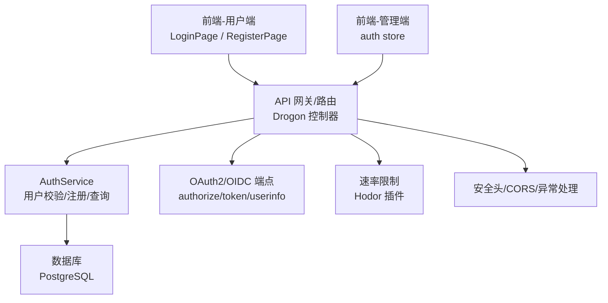
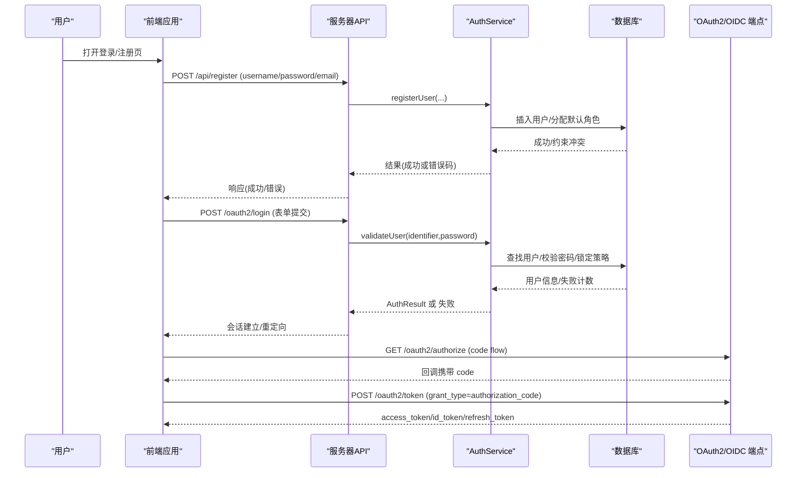
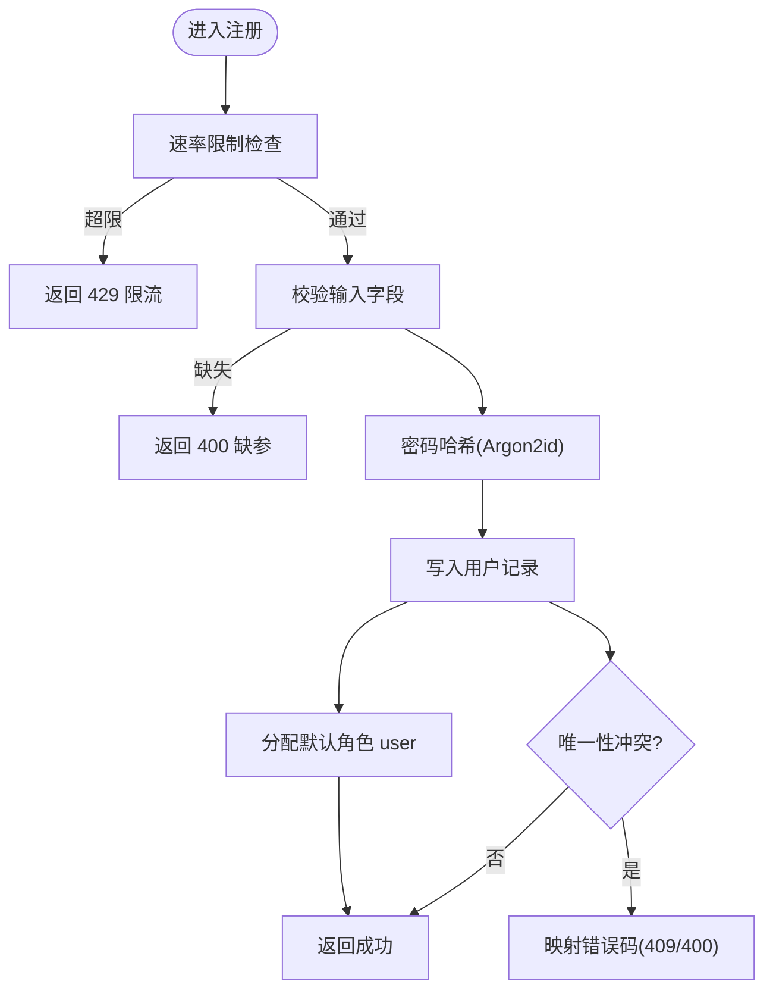
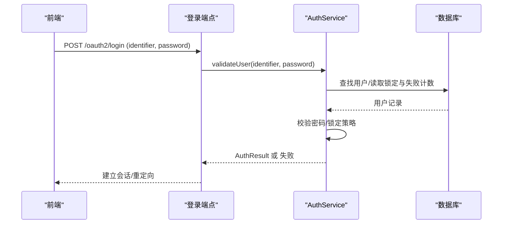
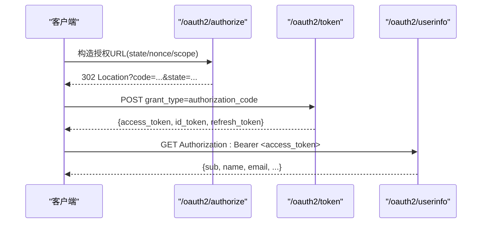
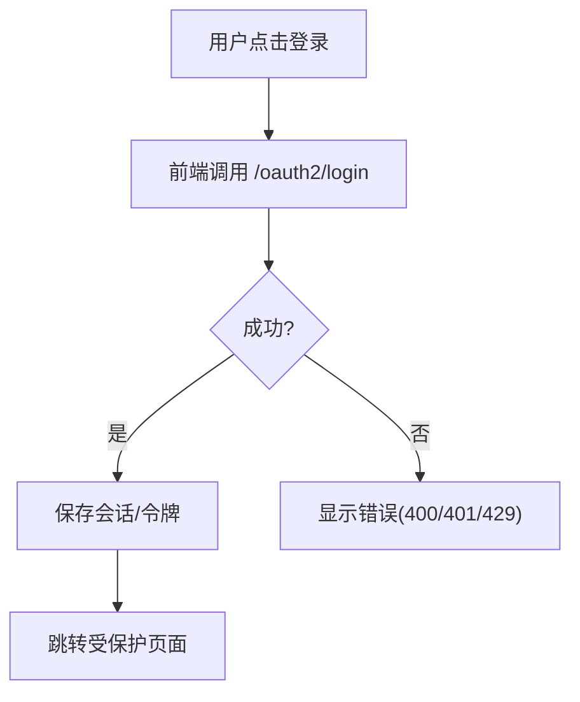
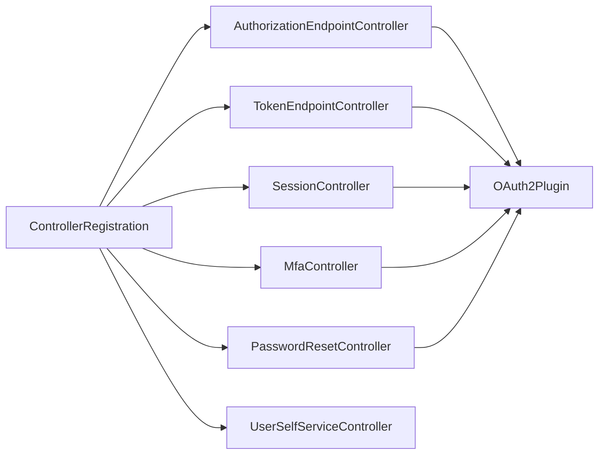

# 用户认证API

<cite>
**本文引用的文件**
- [apps/server/docs/api/openapi.json](file://apps/server/docs/api/openapi.json)
- [apps/server/openapi.yaml](file://apps/server/openapi.yaml)
- [docs/backend/api-reference.md](file://docs/backend/api-reference.md)
- [docs/backend/oidc-guide.md](file://docs/backend/oidc-guide.md)
- [libs/drogon/include/authforge/drogon/AuthService.h](file://libs/drogon/include/authforge/drogon/AuthService.h)
- [libs/drogon/src/AuthService.cc](file://libs/drogon/src/AuthService.cc)
- [apps/server/src/bootstrap/ControllerRegistration.cc](file://apps/server/src/bootstrap/ControllerRegistration.cc)
- [frontends/user/src/services/authService.ts](file://frontends/user/src/services/authService.ts)
- [frontends/admin/src/stores/auth.ts](file://frontends/admin/src/stores/auth.ts)
- [frontends/user/src/pages/auth/LoginPage.vue](file://frontends/user/src/pages/auth/LoginPage.vue)
- [frontends/user/src/pages/auth/RegisterPage.vue](file://frontends/user/src/pages/auth/RegisterPage.vue)
</cite>

## 目录
1. [简介](#简介)
2. [项目结构](#项目结构)
3. [核心组件](#核心组件)
4. [架构总览](#架构总览)
5. [详细组件分析](#详细组件分析)
6. [依赖关系分析](#依赖关系分析)
7. [性能与安全考虑](#性能与安全考虑)
8. [故障排查指南](#故障排查指南)
9. [结论](#结论)
10. [附录](#附录)

## 简介
本文件面向使用本项目的开发者与集成方，系统化说明用户认证相关API：注册、登录、登出等端点；并覆盖密码验证规则、会话管理、CSRF防护、速率限制、错误处理以及OAuth2/OIDC集成方式与令牌获取流程。文档同时提供前端集成示例与最佳实践建议，帮助快速完成端到端对接。

## 项目结构
本项目采用分层与按功能域组织的方式：
- 应用服务层（apps/server）：控制器注册、OpenAPI 定义、迁移脚本、种子数据等。
- 库层（libs）：通用能力（drogon、oauth2、storage-*、common）、认证服务实现（AuthService）。
- 前端（frontends）：用户端与管理端，包含登录/注册页面与服务调用封装。
- 文档（docs）：后端API参考、OIDC集成指南等。

图表来源
- [apps/server/src/bootstrap/ControllerRegistration.cc:41-119](file://apps/server/src/bootstrap/ControllerRegistration.cc#L41-L119)
- [libs/drogon/src/AuthService.cc:16-191](file://libs/drogon/src/AuthService.cc#L16-L191)
- [apps/server/openapi.yaml:41-72](file://apps/server/openapi.yaml#L41-L72)

章节来源
- [apps/server/src/bootstrap/ControllerRegistration.cc:41-119](file://apps/server/src/bootstrap/ControllerRegistration.cc#L41-L119)
- [apps/server/openapi.yaml:1-72](file://apps/server/openapi.yaml#L1-L72)

## 核心组件
- AuthService：负责用户凭证校验、用户注册、用户信息查询。支持邮箱/用户名登录、账户锁定策略、密码哈希升级（PBKDF2）、默认角色分配等。
- 控制器注册：集中注册所有HTTP控制器（健康检查、授权/令牌端点、邮件验证、MFA、密码重置、会话、用户自服务、管理等），并注入OAuth2插件依赖。
- OpenAPI/Swagger：统一描述API契约，便于前后端联调与自动化测试。
- 前端服务：封装HTTP请求、错误适配、状态管理（登录态、令牌存储）。

章节来源
- [libs/drogon/include/authforge/drogon/AuthService.h:17-64](file://libs/drogon/include/authforge/drogon/AuthService.h#L17-L64)
- [libs/drogon/src/AuthService.cc:16-423](file://libs/drogon/src/AuthService.cc#L16-L423)
- [apps/server/src/bootstrap/ControllerRegistration.cc:41-119](file://apps/server/src/bootstrap/ControllerRegistration.cc#L41-L119)
- [apps/server/openapi.yaml:1-72](file://apps/server/openapi.yaml#L1-L72)

## 架构总览
下图展示从前端到后端的认证主流程，包括注册、登录、会话与OAuth2/OIDC令牌交换。

图表来源
- [libs/drogon/src/AuthService.cc:16-191](file://libs/drogon/src/AuthService.cc#L16-L191)
- [docs/backend/api-reference.md:20-111](file://docs/backend/api-reference.md#L20-L111)
- [docs/backend/oidc-guide.md:5-27](file://docs/backend/oidc-guide.md#L5-L27)

## 详细组件分析

### 用户注册 /api/register
- 方法：POST
- 内容类型：application/x-www-form-urlencoded
- 请求参数
  - username：必填（可为空字符串时走邮箱优先模型，服务端允许为空）
  - password：必填（明文传输，服务端进行哈希存储）
  - email：可选（会被规范化）
- 限流：每IP每分钟最多5次，全局每分钟5000次（Hodor 插件）
- 成功响应：文本“User Registered”
- 失败响应
  - 400：缺少用户名或密码
  - 500：用户名已存在等（具体错误由ErrorCatalog映射为统一错误信封）
- 安全机制
  - 密码以Argon2id哈希存储；登录时兼容PBKDF2与旧版SHA-256+Salt，并在必要时异步升级
  - 邮箱唯一性校验；用户名唯一性校验
  - 失败次数累计与渐进式锁定（5/10/15/20次对应不同锁定时间）
- 错误码映射
  - VALIDATION_USERNAME_TAKEN → 409
  - VALIDATION_EMAIL_TAKEN → 409
  - VALIDATION_INVALID_INPUT → 400
  - INTERNAL_ERROR → 500

图表来源
- [docs/backend/api-reference.md:175-195](file://docs/backend/api-reference.md#L175-L195)
- [libs/drogon/src/AuthService.cc:193-315](file://libs/drogon/src/AuthService.cc#L193-L315)

章节来源
- [docs/backend/api-reference.md:175-195](file://docs/backend/api-reference.md#L175-L195)
- [libs/drogon/src/AuthService.cc:193-315](file://libs/drogon/src/AuthService.cc#L193-L315)

### 用户登录 /oauth2/login（内部表单登录）
- 方法：POST
- 用途：内部使用的表单提交接口，用于Session登录并重定向
- 行为要点
  - 支持邮箱或用户名作为标识符（含@视为邮箱，先归一化再查）
  - 校验账户锁定状态与失败次数
  - 成功后重置失败计数，必要时异步升级密码哈希
  - 失败则递增失败计数并按策略设置锁定时间
- 会话：登录后建立会话并可能触发重定向至受保护资源或回调地址

图表来源
- [libs/drogon/src/AuthService.cc:16-191](file://libs/drogon/src/AuthService.cc#L16-L191)

章节来源
- [docs/backend/api-reference.md:150-160](file://docs/backend/api-reference.md#L150-L160)
- [libs/drogon/src/AuthService.cc:16-191](file://libs/drogon/src/AuthService.cc#L16-L191)

### 登出 /api/logout（会话注销）
- 说明：当前仓库未直接暴露独立的 /api/logout 端点。通常通过清除本地会话/令牌或调用会话管理相关接口实现登出。若需显式登出，请结合会话控制器（SessionController）与前端清理逻辑实现。
- 建议做法
  - 前端清除本地存储的访问令牌与会话标记
  - 如需服务端失效会话，可调用会话控制器的注销接口（如存在）或使刷新令牌失效

章节来源
- [apps/server/src/bootstrap/ControllerRegistration.cc:85-87](file://apps/server/src/bootstrap/ControllerRegistration.cc#L85-L87)

### OAuth2/OIDC 令牌获取流程
- 授权端点：GET /oauth2/authorize
  - 参数：response_type=code、client_id、redirect_uri、scope、state（防CSRF）
  - 成功：302重定向至redirect_uri并附带code与state
- 令牌端点：POST /oauth2/token
  - grant_type=authorization_code，携带code、redirect_uri、client_id、client_secret
  - 成功：返回access_token、token_type、expires_in、refresh_token、scope
  - 失败：标准OAuth2错误体（error、error_description、error_uri）
- 用户信息端点：GET /oauth2/userinfo
  - 需要Bearer Token
  - 返回sub、name、email、picture等
- Discovery/JWKS
  - /.well-known/openid-configuration：发现元数据
  - /.well-known/jwks.json：公钥集合，用于验证id_token签名

图表来源
- [docs/backend/api-reference.md:20-145](file://docs/backend/api-reference.md#L20-L145)
- [docs/backend/oidc-guide.md:5-27](file://docs/backend/oidc-guide.md#L5-L27)
- [apps/server/openapi.yaml:41-72](file://apps/server/openapi.yaml#L41-L72)

章节来源
- [docs/backend/api-reference.md:20-145](file://docs/backend/api-reference.md#L20-L145)
- [docs/backend/oidc-guide.md:5-27](file://docs/backend/oidc-guide.md#L5-L27)
- [apps/server/openapi.yaml:41-72](file://apps/server/openapi.yaml#L41-L72)

### 错误处理与统一错误信封
- 应用错误：统一Error Envelope，包含category、code、details、message、request_id
- OAuth2协议错误：遵循RFC 6749 §5.2，返回{error, error_description, error_uri}
- HTTP状态码映射：网络/数据库/验证/认证/授权/内部错误均有明确映射
- 常见错误码
  - VALIDATION_*：输入校验、重复、限流等
  - AUTH_*：凭证无效、令牌过期、MFA错误等
  - AUTHZ_*：权限不足
  - NET_* / DB_*：连接/超时/约束冲突等

章节来源
- [apps/server/docs/api/openapi.json:6-55](file://apps/server/docs/api/openapi.json#L6-L55)
- [docs/backend/api-reference.md:213-281](file://docs/backend/api-reference.md#L213-L281)

### 前端集成示例与最佳实践
- 用户端登录/注册页面
  - LoginPage.vue：调用登录接口，处理重定向与错误提示
  - RegisterPage.vue：提交注册表单，处理限流与唯一性冲突
- 服务封装
  - authService.ts：封装HTTP请求、错误适配、令牌存取
- 管理端状态
  - auth.ts：维护登录态、令牌刷新与鉴权拦截

图表来源
- [frontends/user/src/pages/auth/LoginPage.vue](file://frontends/user/src/pages/auth/LoginPage.vue)
- [frontends/user/src/pages/auth/RegisterPage.vue](file://frontends/user/src/pages/auth/RegisterPage.vue)
- [frontends/user/src/services/authService.ts](file://frontends/user/src/services/authService.ts)
- [frontends/admin/src/stores/auth.ts](file://frontends/admin/src/stores/auth.ts)

章节来源
- [frontends/user/src/pages/auth/LoginPage.vue](file://frontends/user/src/pages/auth/LoginPage.vue)
- [frontends/user/src/pages/auth/RegisterPage.vue](file://frontends/user/src/pages/auth/RegisterPage.vue)
- [frontends/user/src/services/authService.ts](file://frontends/user/src/services/authService.ts)
- [frontends/admin/src/stores/auth.ts](file://frontends/admin/src/stores/auth.ts)

## 依赖关系分析
- 控制器注册集中管理，确保所有API端点正确挂载，并注入OAuth2插件依赖，保证过滤器与服务的一致性。
- AuthService依赖数据库ORM模型（Users/Roles/UserRoles）与密码哈希工具，提供异步回调风格的结果返回。
- OpenAPI规范与控制器实现保持同步，便于生成文档与测试用例。

图表来源
- [apps/server/src/bootstrap/ControllerRegistration.cc:41-119](file://apps/server/src/bootstrap/ControllerRegistration.cc#L41-L119)
- [apps/server/src/bootstrap/ControllerRegistration.cc:122-175](file://apps/server/src/bootstrap/ControllerRegistration.cc#L122-L175)

章节来源
- [apps/server/src/bootstrap/ControllerRegistration.cc:41-119](file://apps/server/src/bootstrap/ControllerRegistration.cc#L41-L119)
- [apps/server/src/bootstrap/ControllerRegistration.cc:122-175](file://apps/server/src/bootstrap/ControllerRegistration.cc#L122-L175)

## 性能与安全考虑
- 速率限制
  - 注册端点：每IP每分钟最多5次，全局每分钟5000次（Hodor 插件）
  - 令牌端点：触发限流返回429
- 密码安全
  - 注册：Argon2id哈希存储
  - 登录：兼容PBKDF2与旧版SHA-256+Salt，并在必要时异步升级
  - 失败次数与渐进式锁定，防止暴力破解
- CSRF防护
  - 授权流程使用state参数防止CSRF
  - 前端在回调中校验state一致性
- 会话管理
  - 登录后建立会话，必要时重定向至目标资源
  - 登出可通过清除本地令牌与会话实现
- 安全头与CORS
  - 通过安全头配置与CORS设置增强安全性
- 令牌验证
  - 使用JWKS获取公钥，验证id_token签名与claims（iss/aud/exp/nonce）

章节来源
- [docs/backend/api-reference.md:175-111](file://docs/backend/api-reference.md#L175-L111)
- [docs/backend/oidc-guide.md:72-90](file://docs/backend/oidc-guide.md#L72-L90)
- [apps/server/openapi.yaml:27-35](file://apps/server/openapi.yaml#L27-L35)

## 故障排查指南
- 常见问题
  - 注册失败：检查唯一性约束（用户名/邮箱）与限流
  - 登录失败：检查账户是否被锁定、密码是否正确、是否启用MFA
  - 令牌获取失败：检查client_secret、redirect_uri一致性、授权码是否过期
  - 用户信息获取失败：检查Bearer Token是否有效
- 错误定位
  - 查看统一错误信封中的category、code、message
  - 关注日志中的数据库异常与限流告警
  - 使用Swagger UI调试端点，核对参数与响应格式

章节来源
- [apps/server/docs/api/openapi.json:6-55](file://apps/server/docs/api/openapi.json#L6-L55)
- [docs/backend/api-reference.md:213-281](file://docs/backend/api-reference.md#L213-L281)

## 结论
本项目提供了完整的用户认证能力：注册、登录、会话管理与OAuth2/OIDC令牌流程。通过统一的错误信封、严格的密码安全策略、速率限制与CSRF防护，保障了系统的安全性与稳定性。前端集成清晰，便于快速落地。建议在生产环境严格配置安全头、合理设置限流阈值，并定期轮换密钥与审查审计日志。

## 附录
- 常用端点速览
  - 注册：POST /api/register
  - 登录（内部）：POST /oauth2/login
  - 授权：GET /oauth2/authorize
  - 令牌：POST /oauth2/token
  - 用户信息：GET /oauth2/userinfo
  - 发现：GET /.well-known/openid-configuration
  - JWKS：GET /.well-known/jwks.json

章节来源
- [docs/backend/api-reference.md:20-145](file://docs/backend/api-reference.md#L20-L145)
- [docs/backend/oidc-guide.md:5-27](file://docs/backend/oidc-guide.md#L5-L27)
- [apps/server/openapi.yaml:41-72](file://apps/server/openapi.yaml#L41-L72)