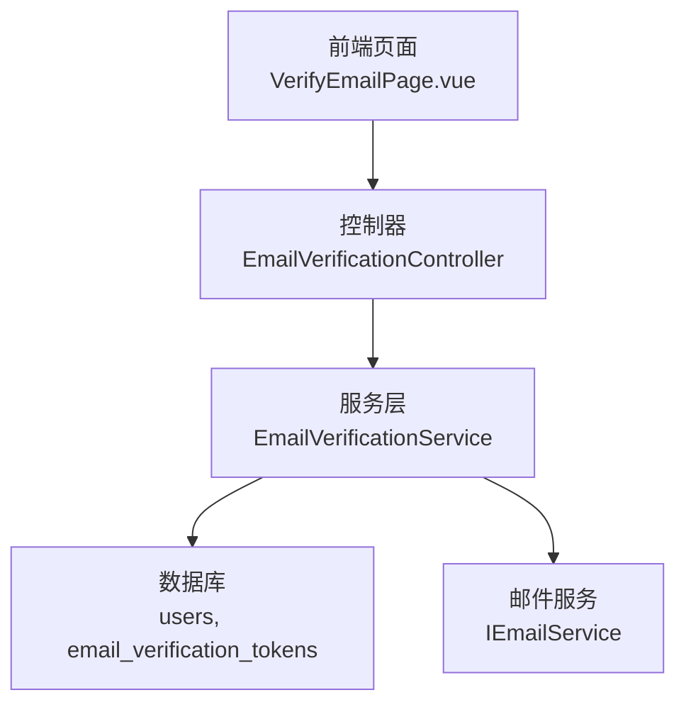
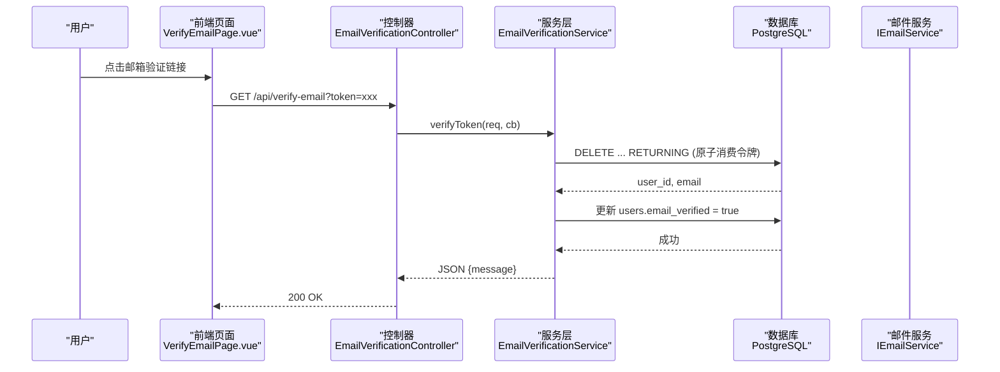
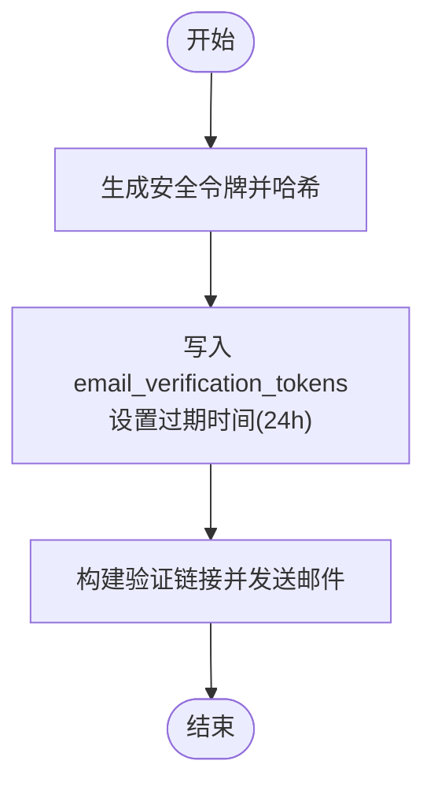
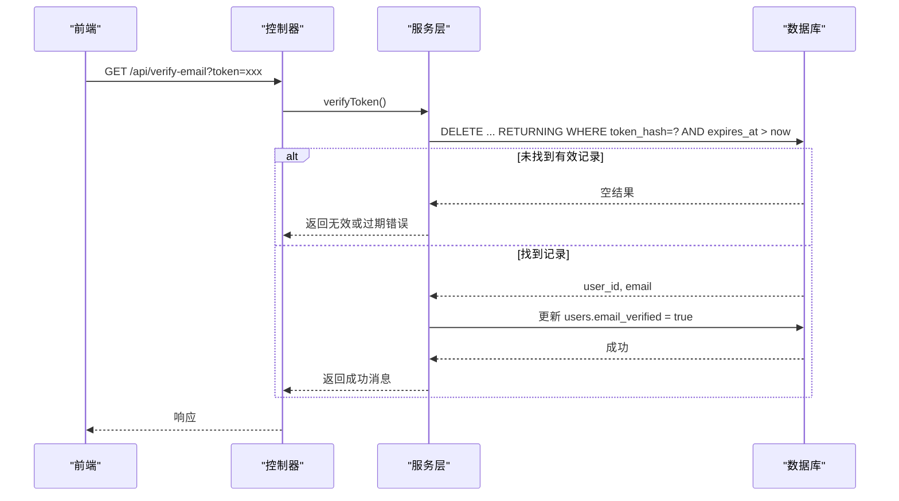
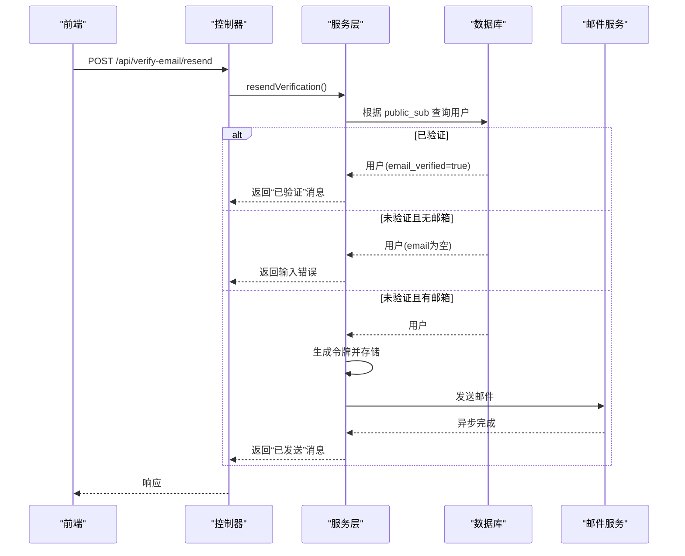
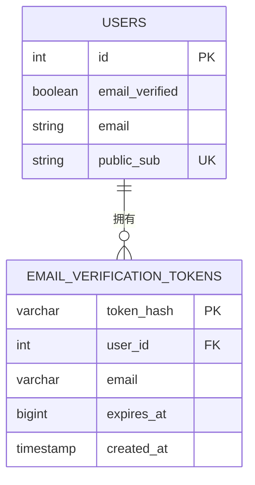
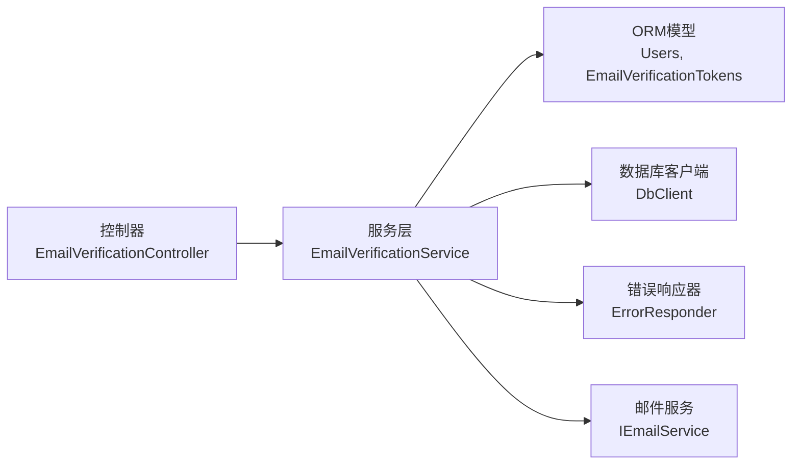

# 邮箱验证API

<cite>
**本文引用的文件**
- [EmailVerificationController.cc](file://libs/drogon/src/controllers/EmailVerificationController.cc)
- [EmailVerificationService.h](file://libs/drogon/include/authforge/drogon/services/EmailVerificationService.h)
- [EmailVerificationService.cc](file://libs/drogon/src/services/EmailVerificationService.cc)
- [V010__email_verification.sql](file://apps/server/migrations/V010__email_verification.sql)
- [V021__widen_email_verification_tokens_email.sql](file://apps/server/migrations/V021__widen_email_verification_tokens_email.sql)
- [Users.cc](file://libs/storage-postgres/src/models/Users.cc)
- [VerifyEmailPage.vue](file://frontends/user/src/pages/auth/VerifyEmailPage.vue)
- [openapi.json](file://apps/server/docs/api/openapi.json)
</cite>

## 目录
1. [简介](#简介)
2. [项目结构](#项目结构)
3. [核心组件](#核心组件)
4. [架构总览](#架构总览)
5. [详细组件分析](#详细组件分析)
6. [依赖关系分析](#依赖关系分析)
7. [性能考虑](#性能考虑)
8. [故障排查指南](#故障排查指南)
9. [结论](#结论)
10. [附录](#附录)

## 简介
本文件面向“邮箱验证”能力，覆盖以下接口与流程：
- 请求发送验证邮件（由注册或业务侧触发，调用服务层生成令牌并发送邮件）
- 执行邮箱验证（GET /api/verify-email?token=...）
- 重新发送验证邮件（POST /api/verify-email/resend，需已认证用户）

文档将说明：
- 邮箱验证端到端流程、令牌生成与存储、有效期策略
- 邮件模板与前端集成示例
- 防滥用保护现状与建议
- 状态管理（用户邮箱是否已验证）
- 错误码与响应约定

## 项目结构
邮箱验证功能横跨控制器、服务层、ORM模型、数据库迁移以及前端页面：
- 控制器：负责路由与OpenAPI元数据登记，委托服务处理
- 服务层：实现令牌生成、存储、验证、重发等核心逻辑
- ORM模型：映射 email_verification_tokens 与 users 表
- 迁移脚本：定义邮箱验证相关表结构与字段
- 前端：提供验证结果页与重发邮件入口

图表来源
- [EmailVerificationController.cc:10-33](file://libs/drogon/src/controllers/EmailVerificationController.cc#L10-L33)
- [EmailVerificationService.cc:66-109](file://libs/drogon/src/services/EmailVerificationService.cc#L66-L109)
- [V010__email_verification.sql:4-15](file://apps/server/migrations/V010__email_verification.sql#L4-L15)

章节来源
- [EmailVerificationController.cc:10-33](file://libs/drogon/src/controllers/EmailVerificationController.cc#L10-L33)
- [EmailVerificationService.cc:66-109](file://libs/drogon/src/services/EmailVerificationService.cc#L66-L109)
- [V010__email_verification.sql:4-15](file://apps/server/migrations/V010__email_verification.sql#L4-L15)

## 核心组件
- 控制器 EmailVerificationController
  - 暴露两个端点：GET /api/verify-email、POST /api/verify-email/resend
  - 仅做参数解析与回调封装，业务逻辑下沉至服务层
- 服务 EmailVerificationService
  - verifyToken：校验并消费一次性令牌，标记用户邮箱为已验证
  - resendVerification：在已认证用户下重新发送验证邮件
  - sendVerificationEmail：生成安全令牌、哈希后持久化，并构造验证链接发送邮件
- 数据模型与迁移
  - users.email_verified：布尔标志表示邮箱是否已验证
  - email_verification_tokens：存储令牌哈希、关联用户、过期时间等
- 前端 VerifyEmailPage.vue
  - 读取URL中的token，调用验证接口并展示结果

章节来源
- [EmailVerificationController.cc:47-65](file://libs/drogon/src/controllers/EmailVerificationController.cc#L47-L65)
- [EmailVerificationService.h:23-40](file://libs/drogon/include/authforge/drogon/services/EmailVerificationService.h#L23-L40)
- [EmailVerificationService.cc:113-203](file://libs/drogon/src/services/EmailVerificationService.cc#L113-L203)
- [V010__email_verification.sql:4-15](file://apps/server/migrations/V010__email_verification.sql#L4-L15)
- [VerifyEmailPage.vue:11-26](file://frontends/user/src/pages/auth/VerifyEmailPage.vue#L11-L26)

## 架构总览
下图展示了从前端到后端再到数据库与邮件服务的完整调用链。

图表来源
- [EmailVerificationController.cc:47-55](file://libs/drogon/src/controllers/EmailVerificationController.cc#L47-L55)
- [EmailVerificationService.cc:113-203](file://libs/drogon/src/services/EmailVerificationService.cc#L113-L203)
- [V010__email_verification.sql:4-15](file://apps/server/migrations/V010__email_verification.sql#L4-L15)

## 详细组件分析

### 接口定义与行为
- GET /api/verify-email?token=xxx
  - 作用：使用一次性令牌完成邮箱验证
  - 行为要点：
    - 校验 token 参数是否存在
    - 计算令牌哈希，原子删除并返回对应用户信息（防止重复使用）
    - 若未找到有效记录，返回无效或过期错误
    - 将对应用户的 email_verified 置为 true
    - 返回统一JSON消息体
- POST /api/verify-email/resend
  - 作用：为当前已认证用户重新发送验证邮件
  - 行为要点：
    - 从请求属性中获取 userId（OAuth2中间件注入）
    - 根据 public_sub 查询用户
    - 若已验证则直接返回提示
    - 若用户无邮箱则返回输入错误
    - 否则生成新令牌并发送邮件，返回成功消息

章节来源
- [EmailVerificationController.cc:10-33](file://libs/drogon/src/controllers/EmailVerificationController.cc#L10-L33)
- [EmailVerificationController.cc:47-65](file://libs/drogon/src/controllers/EmailVerificationController.cc#L47-L65)
- [EmailVerificationService.cc:113-203](file://libs/drogon/src/services/EmailVerificationService.cc#L113-L203)
- [EmailVerificationService.cc:205-263](file://libs/drogon/src/services/EmailVerificationService.cc#L205-L263)
- [openapi.json:1211-1235](file://apps/server/docs/api/openapi.json#L1211-L1235)

### 令牌生成、存储与有效期
- 令牌生成
  - 使用安全随机源生成原始令牌
  - 对原始令牌进行哈希，仅存储哈希值
- 存储结构
  - 表：email_verification_tokens
  - 关键字段：token_hash、user_id、email、expires_at、created_at
  - 索引：按 user_id 与 expires_at 建立索引以优化查询
- 有效期
  - 默认24小时（当前时间 + 86400秒）
  - 验证时通过 expires_at > now 限制有效窗口
- 原子消费
  - 使用 DELETE ... RETURNING 在一次原子操作中“取走”令牌并返回用户信息，避免并发重复使用

图表来源
- [EmailVerificationService.cc:66-109](file://libs/drogon/src/services/EmailVerificationService.cc#L66-L109)
- [V010__email_verification.sql:6-15](file://apps/server/migrations/V010__email_verification.sql#L6-L15)

章节来源
- [EmailVerificationService.cc:66-109](file://libs/drogon/src/services/EmailVerificationService.cc#L66-L109)
- [V010__email_verification.sql:6-15](file://apps/server/migrations/V010__email_verification.sql#L6-L15)

### 验证执行流程
- 参数校验：必须包含 token 查询参数
- 令牌校验：计算哈希并与数据库比对，同时检查过期时间
- 原子消费：DELETE ... RETURNING 确保一次使用
- 状态更新：将 users.email_verified 设置为 true
- 响应：返回统一的JSON消息体

图表来源
- [EmailVerificationService.cc:113-203](file://libs/drogon/src/services/EmailVerificationService.cc#L113-L203)
- [Users.cc:1670-1733](file://libs/storage-postgres/src/models/Users.cc#L1670-L1733)

章节来源
- [EmailVerificationService.cc:113-203](file://libs/drogon/src/services/EmailVerificationService.cc#L113-L203)
- [Users.cc:1670-1733](file://libs/storage-postgres/src/models/Users.cc#L1670-L1733)

### 重新发送验证邮件
- 鉴权要求：需要已认证用户（userId 来自请求属性）
- 流程：
  - 根据 public_sub 查找用户
  - 若已验证，直接返回提示
  - 若无邮箱，返回输入错误
  - 否则生成新令牌并发送邮件，返回成功消息

图表来源
- [EmailVerificationService.cc:205-263](file://libs/drogon/src/services/EmailVerificationService.cc#L205-L263)

章节来源
- [EmailVerificationService.cc:205-263](file://libs/drogon/src/services/EmailVerificationService.cc#L205-L263)

### 邮件模板与前端集成
- 邮件内容
  - 主题：固定标题
  - 正文：包含前端验证链接与过期提示
  - 链接构造：基于配置的前端URL拼接 /verify-email?token=...
- 前端页面
  - 从路由参数读取 token
  - 调用验证接口并展示加载、成功、失败三种状态
  - 成功后引导跳转登录

章节来源
- [EmailVerificationService.cc:91-103](file://libs/drogon/src/services/EmailVerificationService.cc#L91-L103)
- [VerifyEmailPage.vue:11-26](file://frontends/user/src/pages/auth/VerifyEmailPage.vue#L11-L26)
- [VerifyEmailPage.vue:29-50](file://frontends/user/src/pages/auth/VerifyEmailPage.vue#L29-L50)

### 防滥用保护与重试机制
- 当前实现
  - 令牌一次性使用：通过原子删除保证不可重用
  - 有效期限制：默认24小时
  - 重发接口：需要已认证用户，避免匿名滥用
- 建议增强
  - 增加频率限制（如每分钟最多N次重发）
  - 针对同一用户/邮箱的短期冷却期
  - 审计日志与告警（异常高频请求）
  - 可配置的验证码强度与过期时间

章节来源
- [EmailVerificationService.cc:113-203](file://libs/drogon/src/services/EmailVerificationService.cc#L113-L203)
- [EmailVerificationService.cc:205-263](file://libs/drogon/src/services/EmailVerificationService.cc#L205-L263)

### 状态管理与数据模型
- 用户状态
  - users.email_verified：布尔字段，表示邮箱是否已验证
- 令牌表
  - email_verification_tokens：存储令牌哈希、关联用户、邮箱、过期时间、创建时间
  - 索引：user_id、expires_at 用于高效查询
- 长度兼容
  - V021 将 email_verification_tokens.email 扩展至 VARCHAR(254)，与 users.email 保持一致，避免长邮箱导致插入失败

图表来源
- [V010__email_verification.sql:4-15](file://apps/server/migrations/V010__email_verification.sql#L4-L15)
- [V021__widen_email_verification_tokens_email.sql:1-8](file://apps/server/migrations/V021__widen_email_verification_tokens_email.sql#L1-L8)

章节来源
- [V010__email_verification.sql:4-15](file://apps/server/migrations/V010__email_verification.sql#L4-L15)
- [V021__widen_email_verification_tokens_email.sql:1-8](file://apps/server/migrations/V021__widen_email_verification_tokens_email.sql#L1-L8)

## 依赖关系分析
- 控制器依赖服务层，服务层依赖ORM模型与数据库客户端，并通过统一错误响应器输出错误
- 邮件服务通过抽象接口注入，便于替换实现
- OpenAPI元数据由控制器内联注册，便于自动生成文档

图表来源
- [EmailVerificationController.cc:47-65](file://libs/drogon/src/controllers/EmailVerificationController.cc#L47-L65)
- [EmailVerificationService.cc:18-56](file://libs/drogon/src/services/EmailVerificationService.cc#L18-L56)
- [EmailVerificationService.cc:66-109](file://libs/drogon/src/services/EmailVerificationService.cc#L66-L109)

章节来源
- [EmailVerificationController.cc:47-65](file://libs/drogon/src/controllers/EmailVerificationController.cc#L47-L65)
- [EmailVerificationService.cc:18-56](file://libs/drogon/src/services/EmailVerificationService.cc#L18-L56)

## 性能考虑
- 原子操作减少竞争：使用 DELETE ... RETURNING 避免并发重复验证
- 索引优化：对 user_id 与 expires_at 建立索引提升查询效率
- 异步邮件发送：邮件发送不阻塞主流程
- 建议
  - 对重发接口增加限流
  - 监控数据库慢查询与连接池使用
  - 缓存热点配置（如前端URL）以减少配置读取开销

[本节为通用指导，无需特定文件引用]

## 故障排查指南
- 常见错误与定位
  - 缺少 token：检查前端是否正确传递 URL 参数
  - 令牌无效或过期：确认链接是否在24小时内，是否已被使用
  - 数据库不可用：检查数据库连接与权限
  - 重发失败：确认用户已认证、存在邮箱且未验证
- 日志与调试
  - 服务层在数据库异常时记录错误详情
  - 可通过统一错误响应查看错误码与消息
- 前端交互
  - 加载态、成功态、失败态应清晰反馈
  - 错误信息经适配器规范化后展示

章节来源
- [EmailVerificationService.cc:18-56](file://libs/drogon/src/services/EmailVerificationService.cc#L18-L56)
- [EmailVerificationService.cc:113-203](file://libs/drogon/src/services/EmailVerificationService.cc#L113-L203)
- [EmailVerificationService.cc:205-263](file://libs/drogon/src/services/EmailVerificationService.cc#L205-L263)
- [VerifyEmailPage.vue:11-26](file://frontends/user/src/pages/auth/VerifyEmailPage.vue#L11-L26)

## 结论
该邮箱验证方案通过“一次性令牌+短有效期+原子消费”的组合，实现了安全可靠的验证流程；配合清晰的错误响应与前端友好交互，满足基本用户体验需求。建议在后续迭代中加入频率限制、审计日志与更灵活的配置项，以进一步提升安全性与可运维性。

[本节为总结性内容，无需特定文件引用]

## 附录
- 接口清单
  - GET /api/verify-email?token=xxx：执行邮箱验证
  - POST /api/verify-email/resend：重新发送验证邮件（需已认证）
- 数据模型
  - users.email_verified：邮箱验证状态
  - email_verification_tokens：令牌存储与过期控制
- 前端集成要点
  - 从URL读取token并调用验证接口
  - 展示加载、成功、失败状态
  - 成功后引导登录

章节来源
- [openapi.json:1211-1235](file://apps/server/docs/api/openapi.json#L1211-L1235)
- [V010__email_verification.sql:4-15](file://apps/server/migrations/V010__email_verification.sql#L4-L15)
- [VerifyEmailPage.vue:11-26](file://frontends/user/src/pages/auth/VerifyEmailPage.vue#L11-L26)