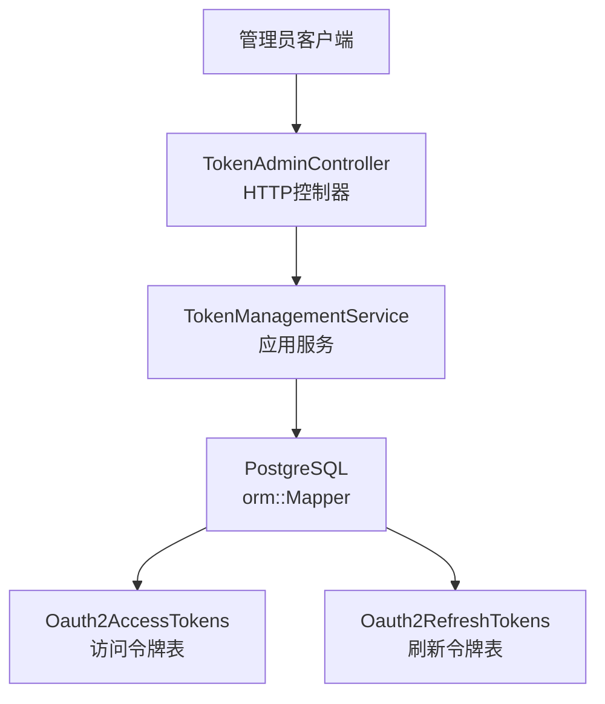
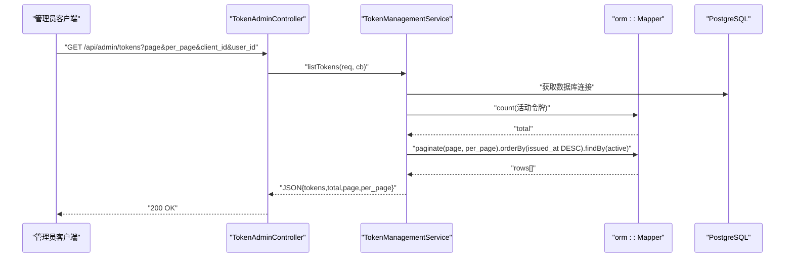
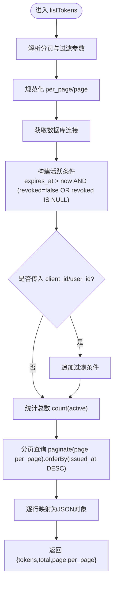
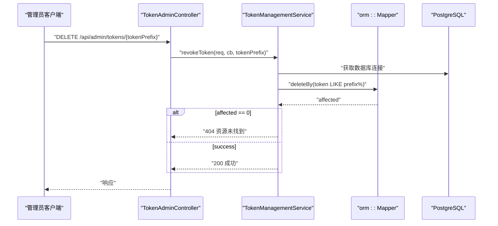
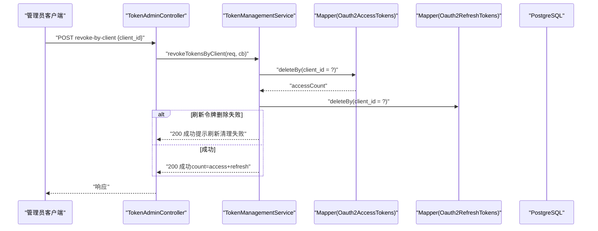
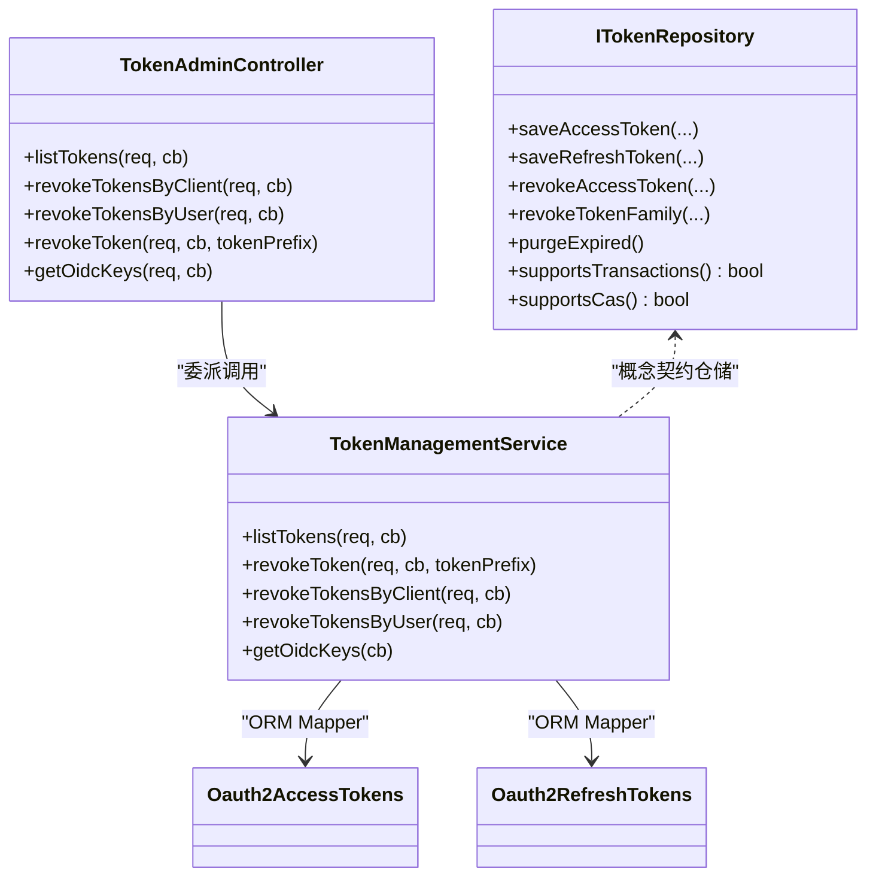

# 令牌管理API

<cite>
**本文引用的文件**
- [TokenAdminController.h](file://libs/drogon/include/authforge/drogon/controllers/TokenAdminController.h)
- [TokenAdminController.cc](file://libs/drogon/src/controllers/TokenAdminController.cc)
- [TokenManagementService.h](file://libs/drogon/include/authforge/drogon/admin/TokenManagementService.h)
- [TokenManagementService.cc](file://libs/drogon/src/admin/TokenManagementService.cc)
- [Oauth2AccessTokens.h](file://libs/storage-postgres/include/authforge/storage/postgres/models/Oauth2AccessTokens.h)
- [Oauth2RefreshTokens.h](file://libs/storage-postgres/include/authforge/storage/postgres/models/Oauth2RefreshTokens.h)
- [ITokenRepository.h](file://libs/oauth2/include/authforge/oauth2/repository/ITokenRepository.h)
- [AdminTokenApiHttpTest.cc](file://tests/integration/admin/AdminTokenApiHttpTest.cc)
- [openapi.json](file://apps/server/docs/api/openapi.json)
</cite>

## 目录
1. [简介](#简介)
2. [项目结构](#项目结构)
3. [核心组件](#核心组件)
4. [架构总览](#架构总览)
5. [详细组件分析](#详细组件分析)
6. [依赖关系分析](#依赖关系分析)
7. [性能考虑](#性能考虑)
8. [故障排除指南](#故障排除指南)
9. [结论](#结论)
10. [附录](#附录)

## 简介
本文件面向OAuth2令牌的监控与管理，聚焦以下管理接口：
- 活动令牌列表查询：GET /api/admin/tokens
- 按客户端撤销令牌：POST /api/admin/tokens/revoke-by-client
- 按用户撤销令牌：POST /api/admin/tokens/revoke-by-user
- 按令牌前缀撤销特定令牌：DELETE /api/admin/tokens/{tokenPrefix}

文档涵盖令牌生命周期、批量撤销机制、状态监控、安全策略、工作原理与性能考量，并提供实际使用场景与故障排除建议。

## 项目结构
令牌管理功能采用“控制器-服务-存储模型”的分层组织：
- 控制器层：负责路由注册、请求解析与响应回调转发
- 服务层：封装业务逻辑（分页、过滤、删除等）并调用ORM
- 存储模型层：基于Drogon ORM的访问令牌与刷新令牌模型

图表来源
- [TokenAdminController.h:17-47](file://libs/drogon/include/authforge/drogon/controllers/TokenAdminController.h#L17-L47)
- [TokenManagementService.cc:67-162](file://libs/drogon/src/admin/TokenManagementService.cc#L67-L162)
- [Oauth2AccessTokens.h:43-61](file://libs/storage-postgres/include/authforge/storage/postgres/models/Oauth2AccessTokens.h#L43-L61)
- [Oauth2RefreshTokens.h:43-58](file://libs/storage-postgres/include/authforge/storage/postgres/models/Oauth2RefreshTokens.h#L43-L58)

章节来源
- [TokenAdminController.h:17-47](file://libs/drogon/include/authforge/drogon/controllers/TokenAdminController.h#L17-L47)
- [TokenAdminController.cc:16-74](file://libs/drogon/src/controllers/TokenAdminController.cc#L16-L74)
- [TokenManagementService.h:23-55](file://libs/drogon/include/authforge/drogon/admin/TokenManagementService.h#L23-L55)

## 核心组件
- TokenAdminController：声明并实现四个令牌管理端点，统一通过AuthorizationFilter鉴权，并将请求委派给TokenManagementService。
- TokenManagementService：实现令牌列表查询（分页+过滤）、按前缀撤销、按客户端/用户批量撤销，以及OIDC密钥元数据查询。
- 存储模型：Oauth2AccessTokens与Oauth2RefreshTokens提供ORM映射，支持条件构建、分页、计数与删除。
- ITokenRepository：定义令牌仓储契约（保存、撤销、家族级撤销、清理过期等），用于上层业务与存储解耦。

章节来源
- [TokenAdminController.h:17-47](file://libs/drogon/include/authforge/drogon/controllers/TokenAdminController.h#L17-L47)
- [TokenManagementService.cc:67-337](file://libs/drogon/src/admin/TokenManagementService.cc#L67-L337)
- [ITokenRepository.h:21-173](file://libs/oauth2/include/authforge/oauth2/repository/ITokenRepository.h#L21-L173)

## 架构总览
令牌管理API的请求处理流程如下：

图表来源
- [TokenAdminController.cc:76-84](file://libs/drogon/src/controllers/TokenAdminController.cc#L76-L84)
- [TokenManagementService.cc:67-162](file://libs/drogon/src/admin/TokenManagementService.cc#L67-L162)

章节来源
- [TokenAdminController.cc:76-84](file://libs/drogon/src/controllers/TokenAdminController.cc#L76-L84)
- [TokenManagementService.cc:67-162](file://libs/drogon/src/admin/TokenManagementService.cc#L67-L162)

## 详细组件分析

### 活动令牌列表查询 GET /api/admin/tokens
- 功能：返回当前未过期且未撤销的访问令牌列表，支持分页与按client_id、user_id过滤。
- 参数：
  - page：页码，默认1，最小1
  - per_page：每页条数，默认50，上限100，下限1
  - client_id：可选，按客户端过滤
  - user_id：可选，按用户过滤
- 响应体：
  - tokens：令牌数组，每项包含token_prefix（前8字符）、client_id、user_id、scope、created_at、expires_at
  - total：总数
  - page：当前页
  - per_page：每页条数
- 活跃判定：expires_at > 当前时间 且 revoked为false或null；比较在应用侧计算now()，等价于服务端时钟（NTP同步）。
- 排序：按issued_at降序。

图表来源
- [TokenManagementService.cc:67-162](file://libs/drogon/src/admin/TokenManagementService.cc#L67-L162)

章节来源
- [TokenManagementService.cc:67-162](file://libs/drogon/src/admin/TokenManagementService.cc#L67-L162)
- [Oauth2AccessTokens.h:43-61](file://libs/storage-postgres/include/authforge/storage/postgres/models/Oauth2AccessTokens.h#L43-L61)

### 按令牌前缀撤销 DELETE /api/admin/tokens/{tokenPrefix}
- 功能：根据令牌值前缀匹配并删除对应的访问令牌记录。
- 行为：
  - 若tokenPrefix为空：返回验证错误
  - 若未找到匹配记录：返回资源未找到
  - 成功：返回成功状态与消息
- 注意：该接口仅删除访问令牌，不直接操作刷新令牌。

图表来源
- [TokenManagementService.cc:164-202](file://libs/drogon/src/admin/TokenManagementService.cc#L164-L202)

章节来源
- [TokenManagementService.cc:164-202](file://libs/drogon/src/admin/TokenManagementService.cc#L164-L202)

### 按客户端撤销 POST /api/admin/tokens/revoke-by-client
- 功能：批量撤销指定客户端的所有访问令牌与刷新令牌。
- 请求体：
  - client_id：必填，非空
- 行为：
  - 先删除该client_id下的所有访问令牌
  - 再尝试删除该client_id下的所有刷新令牌（尽力而为，即使失败也返回成功并附带已删除数量）
  - 返回status、message与count（access + refresh）

图表来源
- [TokenManagementService.cc:204-263](file://libs/drogon/src/admin/TokenManagementService.cc#L204-L263)

章节来源
- [TokenManagementService.cc:204-263](file://libs/drogon/src/admin/TokenManagementService.cc#L204-L263)

### 按用户撤销 POST /api/admin/tokens/revoke-by-user
- 功能：批量撤销指定用户的所有访问令牌与刷新令牌。
- 请求体：
  - user_id：必填，非空
- 行为：与按客户端撤销类似，先删访问令牌，再尽力删除刷新令牌，返回合并计数。

章节来源
- [TokenManagementService.cc:265-321](file://libs/drogon/src/admin/TokenManagementService.cc#L265-L321)

### OIDC 密钥信息 GET /api/admin/oidc/keys
- 功能：返回当前签名密钥元数据（kid、kty、alg、use、jwks_uri、discovery_uri、key_status、note）。
- 说明：纯元数据接口，无数据库访问；仍需管理员鉴权。

章节来源
- [TokenManagementService.cc:323-337](file://libs/drogon/src/admin/TokenManagementService.cc#L323-L337)

## 依赖关系分析
- 控制器依赖服务：TokenAdminController将请求委派给TokenManagementService。
- 服务依赖ORM与存储模型：通过drogon::orm::Mapper对Oauth2AccessTokens与Oauth2RefreshTokens进行count/paginate/delete等操作。
- 仓储契约：ITokenRepository定义了令牌生命周期操作的抽象，便于不同存储后端替换与测试分层。

图表来源
- [TokenAdminController.h:17-47](file://libs/drogon/include/authforge/drogon/controllers/TokenAdminController.h#L17-L47)
- [TokenManagementService.h:23-55](file://libs/drogon/include/authforge/drogon/admin/TokenManagementService.h#L23-L55)
- [ITokenRepository.h:21-173](file://libs/oauth2/include/authforge/oauth2/repository/ITokenRepository.h#L21-L173)

章节来源
- [TokenAdminController.h:17-47](file://libs/drogon/include/authforge/drogon/controllers/TokenAdminController.h#L17-L47)
- [TokenManagementService.h:23-55](file://libs/drogon/include/authforge/drogon/admin/TokenManagementService.h#L23-L55)
- [ITokenRepository.h:21-173](file://libs/oauth2/include/authforge/oauth2/repository/ITokenRepository.h#L21-L173)

## 性能考虑
- 分页与限制：per_page默认50，上限100，避免一次性拉取过多数据导致内存与网络压力。
- 活跃条件优化：通过Criteria组合expires_at与revoked字段，减少无效扫描；必要时可结合索引提升count与分页性能。
- 批量撤销顺序：先删访问令牌，再删刷新令牌；刷新令牌删除失败不影响整体成功，但应关注日志与告警。
- 时间一致性：活跃判断使用应用侧now()，需确保服务器NTP同步，避免跨节点时间漂移导致误判。
- 事务与原子性：仓储接口ITokenRepository定义了saveTokenPair的事务能力标志；令牌管理侧当前以ORM deleteBy为主，如需强一致可在更高层引入事务包装。

[本节为通用性能指导，无需具体文件引用]

## 故障排除指南
- 401 未授权：访问管理接口需携带有效管理员令牌；未携带或令牌失效将返回401。
- 400 参数校验失败：
  - revoke-by-client缺少或为空client_id
  - revoke-by-user缺少或为空user_id
  - revoke-token缺少tokenPrefix
- 404 资源未找到：按前缀撤销时未匹配到任何访问令牌。
- 数据库不可用：服务层捕获数据库连接异常并返回DB_CONNECTION_ERROR；检查数据库配置与连通性。
- 查询异常：ORM操作抛出异常时返回DB_QUERY_ERROR；检查SQL生成与索引情况。

章节来源
- [AdminTokenApiHttpTest.cc:47-176](file://tests/integration/admin/AdminTokenApiHttpTest.cc#L47-L176)
- [TokenManagementService.cc:16-48](file://libs/drogon/src/admin/TokenManagementService.cc#L16-L48)

## 结论
令牌管理API提供了完整的令牌监控与撤销能力，覆盖活动令牌列表、按前缀精确撤销、按客户端/用户批量撤销，以及OIDC密钥元信息查询。通过控制器-服务-ORM的分层设计，代码职责清晰、易于扩展与维护。建议在大规模部署中关注分页限制、索引优化与时间同步，以确保高可用与高性能。

[本节为总结性内容，无需具体文件引用]

## 附录

### API 参考
- GET /api/admin/tokens
  - 描述：列出活动令牌（分页、过滤）
  - 鉴权：需要管理员令牌
  - 响应：{tokens[], total, page, per_page}
- POST /api/admin/tokens/revoke-by-client
  - 描述：按客户端撤销所有令牌
  - 请求体：{client_id}
  - 响应：{status, message, count}
- POST /api/admin/tokens/revoke-by-user
  - 描述：按用户撤销所有令牌
  - 请求体：{user_id}
  - 响应：{status, message, count}
- DELETE /api/admin/tokens/{tokenPrefix}
  - 描述：按令牌前缀撤销访问令牌
  - 路径参数：tokenPrefix
  - 响应：成功或404（未找到）
- GET /api/admin/oidc/keys
  - 描述：获取OIDC签名密钥元数据
  - 响应：{kid, kty, alg, use, jwks_uri, discovery_uri, key_status, note}

章节来源
- [TokenAdminController.h:17-47](file://libs/drogon/include/authforge/drogon/controllers/TokenAdminController.h#L17-L47)
- [TokenAdminController.cc:16-74](file://libs/drogon/src/controllers/TokenAdminController.cc#L16-L74)
- [openapi.json:72-79](file://apps/server/docs/api/openapi.json#L72-L79)

### 令牌生命周期与撤销机制
- 生命周期：创建（访问令牌与刷新令牌对）→ 使用 → 过期 → 清理
- 撤销机制：
  - 访问令牌：可通过前缀删除（当前实现）
  - 刷新令牌：支持家族级撤销（仓储接口定义）
- 清理：仓储接口提供purgeExpired用于清理过期令牌（由外部调度触发）

章节来源
- [ITokenRepository.h:66-154](file://libs/oauth2/include/authforge/oauth2/repository/ITokenRepository.h#L66-L154)

### 安全策略
- 鉴权：所有管理端点均受AuthorizationFilter保护，需管理员令牌
- 输入校验：严格校验必填字段与范围（如per_page上下限）
- 审计：撤销操作可通过revoked_by、revoked_at等字段记录（模型已具备）

章节来源
- [TokenAdminController.h:17-47](file://libs/drogon/include/authforge/drogon/controllers/TokenAdminController.h#L17-L47)
- [Oauth2AccessTokens.h:43-61](file://libs/storage-postgres/include/authforge/storage/postgres/models/Oauth2AccessTokens.h#L43-L61)
- [Oauth2RefreshTokens.h:43-58](file://libs/storage-postgres/include/authforge/storage/postgres/models/Oauth2RefreshTokens.h#L43-L58)