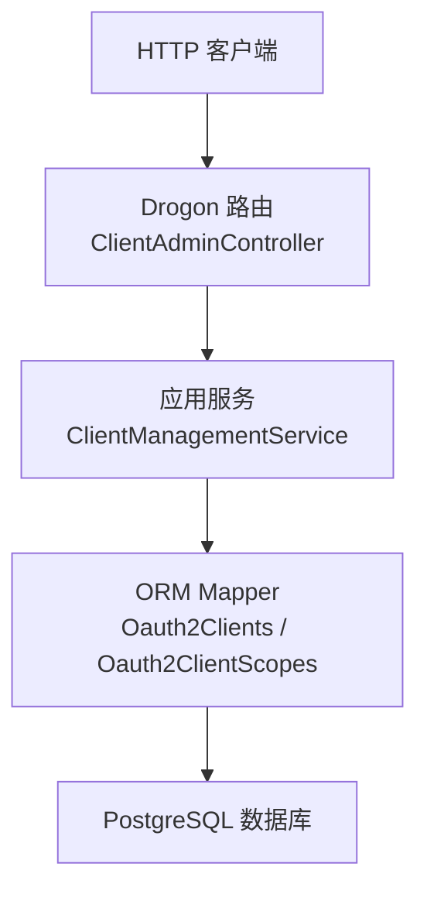
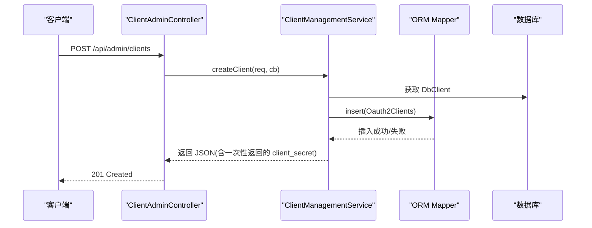
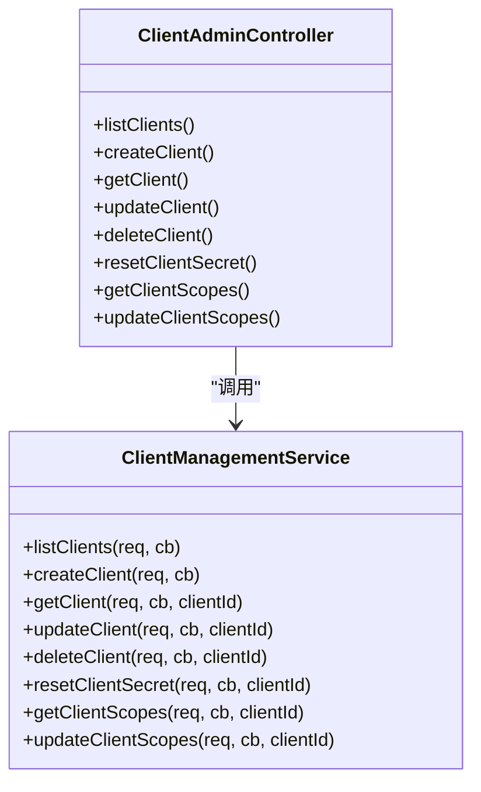

# 客户端管理API

<cite>
**本文引用的文件**
- [ClientAdminController.h](file://libs/drogon/include/authforge/drogon/controllers/ClientAdminController.h)
- [ClientAdminController.cc](file://libs/drogon/src/controllers/ClientAdminController.cc)
- [ClientManagementService.h](file://libs/drogon/include/authforge/drogon/admin/ClientManagementService.h)
- [ClientManagementService.cc](file://libs/drogon/src/admin/ClientManagementService.cc)
- [openapi.yaml](file://apps/server/openapi.yaml)
- [openapi.json](file://apps/server/docs/api/openapi.json)
</cite>

## 目录
1. [简介](#简介)
2. [项目结构](#项目结构)
3. [核心组件](#核心组件)
4. [架构总览](#架构总览)
5. [详细接口说明](#详细接口说明)
6. [依赖关系分析](#依赖关系分析)
7. [性能与一致性](#性能与一致性)
8. [故障排查指南](#故障排查指南)
9. [结论](#结论)
10. [附录：请求与响应示例](#附录请求与响应示例)

## 简介
本文件为 OAuth2 客户端管理 API 的权威文档，覆盖以下能力：
- 客户端 CRUD：创建、列表、详情、更新、删除
- 客户端密钥重置：安全地轮换 client_secret
- 权限范围管理：查询与更新客户端的 scopes
所有接口均受统一鉴权过滤器保护，错误响应遵循统一的 Error Envelope 规范。

## 项目结构
客户端管理相关代码采用“控制器薄层 + 应用服务”的分层设计：
- 控制器负责路由注册、参数解析与调用服务
- 服务层封装业务逻辑与数据访问（ORM Mapper + Criteria）
- OpenAPI 元数据由控制器内联注册并同步到 openapi.yaml/json

图表来源
- [ClientAdminController.h:18-67](file://libs/drogon/include/authforge/drogon/controllers/ClientAdminController.h#L18-L67)
- [ClientManagementService.h:45-91](file://libs/drogon/include/authforge/drogon/admin/ClientManagementService.h#L45-L91)

章节来源
- [ClientAdminController.h:18-67](file://libs/drogon/include/authforge/drogon/controllers/ClientAdminController.h#L18-L67)
- [openapi.yaml:72-241](file://apps/server/openapi.yaml#L72-L241)

## 核心组件
- ClientAdminController：声明并实现 /api/admin/clients* 的路由映射，统一挂载 AuthorizationFilter 进行鉴权；将请求转发给 ClientManagementService。
- ClientManagementService：实现客户端 CRUD、secret 重置、scopes 查询与更新的完整业务逻辑；通过 ORM Mapper 操作 oauth2_clients 与 oauth2_client_scopes 表。
- OpenAPI 元数据：在控制器构造时注册端点信息，最终汇总至 openapi.yaml/json。

章节来源
- [ClientAdminController.cc:17-97](file://libs/drogon/src/controllers/ClientAdminController.cc#L17-L97)
- [ClientManagementService.cc:68-577](file://libs/drogon/src/admin/ClientManagementService.cc#L68-L577)

## 架构总览
下图展示一次典型请求从 HTTP 入口到数据落库的调用链。

图表来源
- [ClientAdminController.cc:112-120](file://libs/drogon/src/controllers/ClientAdminController.cc#L112-L120)
- [ClientManagementService.cc:110-169](file://libs/drogon/src/admin/ClientManagementService.cc#L110-L169)

## 详细接口说明

### 通用要求
- 鉴权：所有接口需携带有效的 bearer token（AuthorizationFilter）。
- 内容类型：JSON 请求体使用 application/json。
- 错误格式：统一 Error Envelope，包含 category、code、message、details、request_id。
- 分页：列表接口返回 total 字段用于前端分页。

章节来源
- [openapi.yaml:72-241](file://apps/server/openapi.yaml#L72-L241)
- [ClientManagementService.cc:24-55](file://libs/drogon/src/admin/ClientManagementService.cc#L24-L55)

### 创建客户端
- 路径与方法：POST /api/admin/clients
- 鉴权：Bearer Token
- 请求体字段
  - name: 字符串，可选
  - redirect_uris: 字符串，可选（URI 列表序列化形式）
  - allowed_grant_types: 字符串，默认 authorization_code
  - client_type: 字符串，默认 CONFIDENTIAL
- 响应
  - 201 Created：status=success，返回 client_id、client_secret（仅首次创建返回）、note
  - 401 Unauthorized
  - 400 无效输入
  - 404 资源不存在（如关联校验失败）
- 行为要点
  - 自动生成 client_id 与安全随机 secret
  - secret 以 salt+hash 形式存储，不直接落库明文
  - 成功后返回一次性 client_secret，务必妥善保存

章节来源
- [openapi.yaml:87-100](file://apps/server/openapi.yaml#L87-L100)
- [ClientManagementService.cc:110-169](file://libs/drogon/src/admin/ClientManagementService.cc#L110-L169)

### 获取客户端列表
- 路径与方法：GET /api/admin/clients
- 鉴权：Bearer Token
- 查询参数：无（当前实现返回全部）
- 响应
  - 200 OK：{ status, clients[], total }
- 行为要点
  - 按 client_id 稳定排序（显示用途）

章节来源
- [openapi.yaml:72-86](file://apps/server/openapi.yaml#L72-L86)
- [ClientManagementService.cc:68-108](file://libs/drogon/src/admin/ClientManagementService.cc#L68-L108)

### 获取客户端详情
- 路径与方法：GET /api/admin/clients/{clientId}
- 鉴权：Bearer Token
- 路径参数：clientId（必填）
- 响应
  - 200 OK：{ status, client_id, client_type, name, redirect_uris, allowed_grant_types, scopes[] }
  - 401 Unauthorized
  - 404 Not Found
- 行为要点
  - 若 scopes 查询失败，仍返回客户端基本信息，scopes 为空数组

章节来源
- [openapi.yaml:125-147](file://apps/server/openapi.yaml#L125-L147)
- [ClientManagementService.cc:171-232](file://libs/drogon/src/admin/ClientManagementService.cc#L171-L232)

### 更新客户端信息
- 路径与方法：PUT /api/admin/clients/{clientId}
- 鉴权：Bearer Token
- 路径参数：clientId（必填）
- 请求体字段（至少提供一项）
  - name
  - redirect_uris
  - allowed_grant_types
- 响应
  - 200 OK：{ status, message, client_id }
  - 400 无效输入或无字段可更新
  - 401 Unauthorized
  - 404 Not Found
- 行为要点
  - 仅更新提供的字段，避免覆盖其他字段

章节来源
- [openapi.yaml:148-172](file://apps/server/openapi.yaml#L148-L172)
- [ClientManagementService.cc:234-315](file://libs/drogon/src/admin/ClientManagementService.cc#L234-L315)

### 删除客户端
- 路径与方法：DELETE /api/admin/clients/{clientId}
- 鉴权：Bearer Token
- 路径参数：clientId（必填）
- 响应
  - 200 OK：{ status, message, client_id }
  - 401 Unauthorized
  - 404 Not Found
- 行为要点
  - 影响行数为 0 视为未找到

章节来源
- [openapi.yaml:101-124](file://apps/server/openapi.yaml#L101-L124)
- [ClientManagementService.cc:317-356](file://libs/drogon/src/admin/ClientManagementService.cc#L317-L356)

### 重置客户端密钥
- 路径与方法：POST /api/admin/clients/{clientId}/reset-secret
- 鉴权：Bearer Token
- 路径参数：clientId（必填）
- 响应
  - 200 OK：{ status, message, client_id, client_secret, note }
  - 401 Unauthorized
  - 404 Not Found
- 行为要点
  - 生成新的 client_secret，同时轮换 salt 并重新计算哈希后存储
  - 新 secret 仅在此处返回一次，请妥善保存

章节来源
- [openapi.yaml:173-196](file://apps/server/openapi.yaml#L173-L196)
- [ClientManagementService.cc:358-416](file://libs/drogon/src/admin/ClientManagementService.cc#L358-L416)

### 权限范围管理（Scopes）
- 查询已分配范围
  - 路径与方法：GET /api/admin/clients/{clientId}/scopes
  - 鉴权：Bearer Token
  - 路径参数：clientId（必填）
  - 响应：200 OK { status, scopes[] }
- 更新已分配范围
  - 路径与方法：PUT /api/admin/clients/{clientId}/scopes
  - 鉴权：Bearer Token
  - 路径参数：clientId（必填）
  - 请求体：{ scopes: string[] }（必填且为数组）
  - 响应：200 OK { status, message, scopes[] }
  - 行为要点
    - 事务性替换：先清空该客户端旧 scopes，再批量插入新 scopes
    - 并发插入使用原子计数与互斥量保证最终一致

章节来源
- [openapi.yaml:197-241](file://apps/server/openapi.yaml#L197-L241)
- [ClientManagementService.cc:418-577](file://libs/drogon/src/admin/ClientManagementService.cc#L418-L577)

## 依赖关系分析
- 控制器与服务解耦：控制器仅做路由与分发，服务承载业务与数据访问
- 数据访问通过 ORM Mapper，避免手写 SQL，便于维护与测试
- 错误处理统一经 ErrorResponder 输出标准错误信封
- 鉴权由 AuthorizationFilter 统一拦截，所有客户端管理接口均需有效令牌

图表来源
- [ClientAdminController.h:18-67](file://libs/drogon/include/authforge/drogon/controllers/ClientAdminController.h#L18-L67)
- [ClientManagementService.h:45-91](file://libs/drogon/include/authforge/drogon/admin/ClientManagementService.h#L45-L91)

章节来源
- [ClientAdminController.cc:102-186](file://libs/drogon/src/controllers/ClientAdminController.cc#L102-L186)
- [ClientManagementService.cc:68-577](file://libs/drogon/src/admin/ClientManagementService.cc#L68-L577)

## 性能与一致性
- 列表查询：Mapper::findBy 全表扫描，适合中小规模；如需大规模分页建议扩展查询条件与分页参数
- 详情查询：单条 findOne + 二次查询 scopes，避免复杂 JOIN，符合项目数据库操作规范
- 更新 scopes：使用事务 + 批量插入，确保“清空-重建”的原子性；并发插入通过原子计数器与互斥量保证结果正确
- 密钥重置：每次重置均轮换 salt 并重新哈希，安全性强；注意在高并发场景下对同一客户端的连续重置可能带来短暂不一致，建议在上层加幂等控制

[本节为通用指导，无需特定文件引用]

## 故障排查指南
- 401 Unauthorized：检查请求是否携带有效 bearer token，以及过滤器是否启用
- 400 Invalid input：检查请求体是否为合法 JSON，必要字段是否齐全（如 scopes 必须为数组）
- 404 Not Found：确认 clientId 是否存在；更新/删除前可先调用详情接口验证
- 数据库错误：关注错误码 DB_QUERY_ERROR/DB_CONNECTION_ERROR，检查数据库连接与权限
- scopes 更新异常：确认事务是否提交；若部分插入失败，整体回滚，重试即可

章节来源
- [ClientManagementService.cc:24-55](file://libs/drogon/src/admin/ClientManagementService.cc#L24-L55)
- [ClientManagementService.cc:461-577](file://libs/drogon/src/admin/ClientManagementService.cc#L461-L577)

## 结论
客户端管理 API 提供了完整的 OAuth2 客户端生命周期管理能力，并通过统一鉴权、统一错误信封与 ORM 数据访问保障一致性与可维护性。密钥重置与 scopes 更新具备完善的安全与事务语义，适合在生产环境使用。

[本节为总结，无需特定文件引用]

## 附录：请求与响应示例
以下为基于实现的典型交互示例（不含敏感真实值）：

- 创建客户端
  - 请求：POST /api/admin/clients
    - Header: Authorization: Bearer <token>
    - Body: { "name": "MyApp", "redirect_uris": "https://app.example/callback", "allowed_grant_types": "authorization_code", "client_type": "CONFIDENTIAL" }
  - 响应：201 Created
    - { "status": "success", "client_id": "...", "client_secret": "...", "note": "Store the client_secret securely. It will not be shown again." }

- 获取客户端详情
  - 请求：GET /api/admin/clients/{clientId}
  - 响应：200 OK
    - { "status": "success", "client_id": "...", "client_type": "CONFIDENTIAL", "name": "MyApp", "redirect_uris": "...", "allowed_grant_types": "authorization_code", "scopes": ["openid","profile"] }

- 更新客户端信息
  - 请求：PUT /api/admin/clients/{clientId}
    - Body: { "name": "MyApp v2" }
  - 响应：200 OK
    - { "status": "success", "message": "Client updated successfully", "client_id": "..." }

- 删除客户端
  - 请求：DELETE /api/admin/clients/{clientId}
  - 响应：200 OK
    - { "status": "success", "message": "Client deleted successfully", "client_id": "..." }

- 重置客户端密钥
  - 请求：POST /api/admin/clients/{clientId}/reset-secret
  - 响应：200 OK
    - { "status": "success", "message": "Client secret reset successfully", "client_id": "...", "client_secret": "...", "note": "Store the new client_secret securely. It will not be shown again." }

- 查询 scopes
  - 请求：GET /api/admin/clients/{clientId}/scopes
  - 响应：200 OK
    - { "status": "success", "scopes": ["openid","profile"] }

- 更新 scopes
  - 请求：PUT /api/admin/clients/{clientId}/scopes
    - Body: { "scopes": ["openid","profile","email"] }
  - 响应：200 OK
    - { "status": "success", "message": "Scopes updated", "scopes": ["openid","profile","email"] }

章节来源
- [openapi.yaml:72-241](file://apps/server/openapi.yaml#L72-L241)
- [ClientManagementService.cc:110-577](file://libs/drogon/src/admin/ClientManagementService.cc#L110-L577)