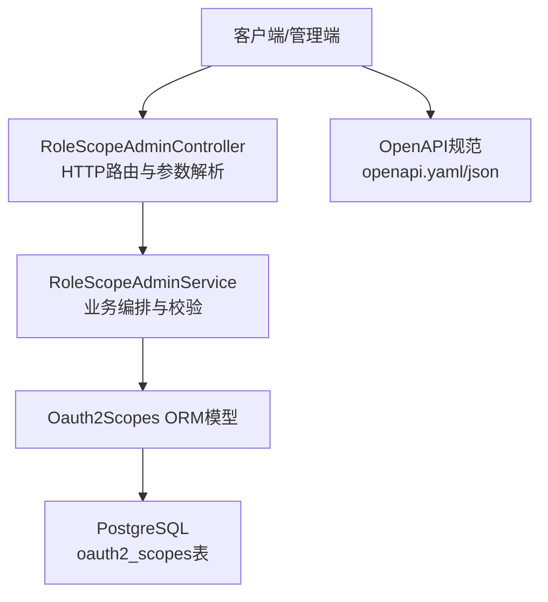
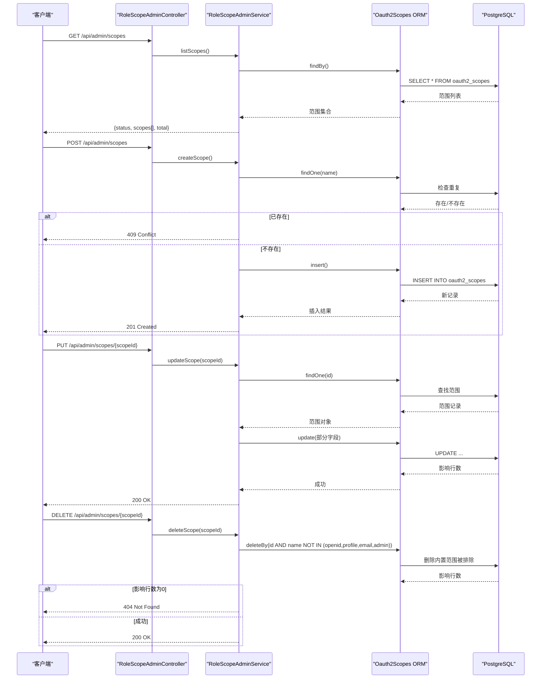
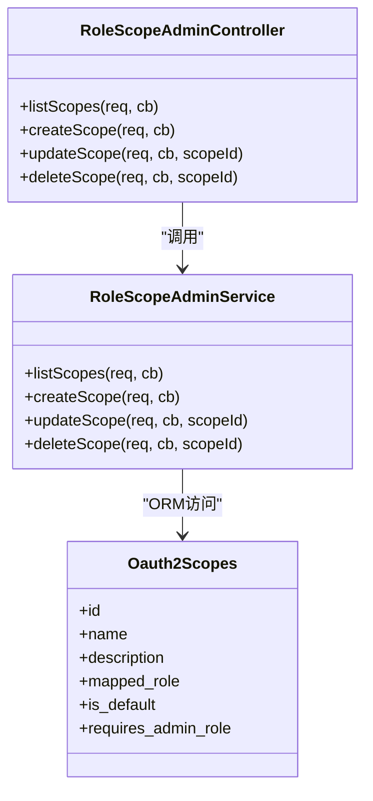
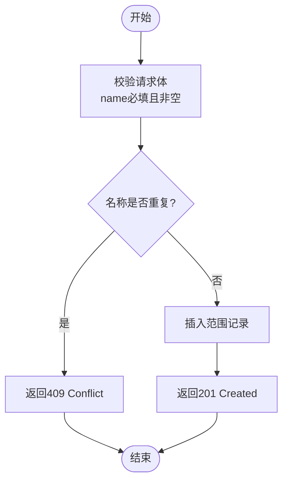
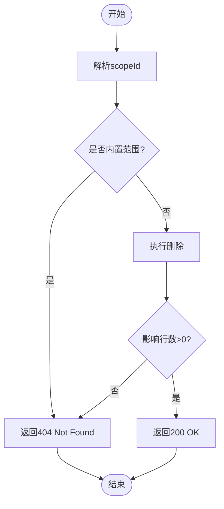

# 权限范围管理API

<cite>
**本文引用的文件**
- [RoleScopeAdminController.cc](file://libs/drogon/src/controllers/RoleScopeAdminController.cc)
- [RoleScopeAdminService.h](file://libs/drogon/include/authforge/drogon/admin/RoleScopeAdminService.h)
- [RoleScopeAdminService.cc](file://libs/drogon/src/admin/RoleScopeAdminService.cc)
- [Oauth2Scopes.h](file://libs/storage-postgres/include/authforge/storage/postgres/models/Oauth2Scopes.h)
- [V006__oauth2_scopes.sql](file://apps/server/migrations/V006__oauth2_scopes.sql)
- [openapi.yaml](file://apps/server/openapi.yaml)
- [openapi.json](file://apps/server/docs/api/openapi.json)
- [IdentityService.cc](file://libs/drogon/src/services/IdentityService.cc)
- [test-admin-endpoints.sh](file://scripts/backend/test-admin-endpoints.sh)
- [test-admin-endpoints.ps1](file://scripts/backend/test-admin-endpoints.ps1)
- [scopes-management.spec.ts](file://frontends/admin/tests/e2e/scopes-management.spec.ts)
</cite>

## 目录
1. [简介](#简介)
2. [项目结构](#项目结构)
3. [核心组件](#核心组件)
4. [架构总览](#架构总览)
5. [详细组件分析](#详细组件分析)
6. [依赖关系分析](#依赖关系分析)
7. [性能考虑](#性能考虑)
8. [故障排查指南](#故障排查指南)
9. [结论](#结论)
10. [附录](#附录)

## 简介
本文件面向“权限范围（Scope）管理”的完整API文档，覆盖以下能力：
- 范围列表查询：GET /api/admin/scopes
- 范围创建：POST /api/admin/scopes
- 范围详情获取：通过列表或更新接口返回字段体现
- 范围属性更新：PUT /api/admin/scopes/{scopeId}
- 范围删除：DELETE /api/admin/scopes/{scopeId}

同时说明内置范围（openid、profile、email、admin）的保护机制与自定义范围的创建规则，范围与角色的映射关系、默认范围设置、管理员权限要求等配置项，并提供最佳实践建议。

## 项目结构
该功能位于后端Drogon控制器与服务层之间，数据模型由PostgreSQL迁移脚本定义并通过ORM模型暴露给服务层。OpenAPI规范在server目录下维护，用于对外描述接口契约。前端管理页面提供可视化操作入口并调用上述API。

图表来源
- [RoleScopeAdminController.cc:23-93](file://libs/drogon/src/controllers/RoleScopeAdminController.cc#L23-L93)
- [RoleScopeAdminService.cc:340-591](file://libs/drogon/src/admin/RoleScopeAdminService.cc#L340-L591)
- [Oauth2Scopes.h:44-159](file://libs/storage-postgres/include/authforge/storage/postgres/models/Oauth2Scopes.h#L44-L159)
- [V006__oauth2_scopes.sql:3-54](file://apps/server/migrations/V006__oauth2_scopes.sql#L3-L54)
- [openapi.yaml:690-808](file://apps/server/openapi.yaml#L690-L808)

章节来源
- [RoleScopeAdminController.cc:23-93](file://libs/drogon/src/controllers/RoleScopeAdminController.cc#L23-L93)
- [openapi.yaml:690-808](file://apps/server/openapi.yaml#L690-L808)
- [V006__oauth2_scopes.sql:3-54](file://apps/server/migrations/V006__oauth2_scopes.sql#L3-L54)

## 核心组件
- 控制器层：负责注册OpenAPI端点、接收请求并委派到服务层。
- 服务层：实现范围CRUD的业务逻辑，包括必填字段校验、重复名称冲突处理、内置范围保护、更新字段白名单等。
- 数据模型：基于PostgreSQL表的ORM模型，包含name、description、mapped_role、is_default、requires_admin_role等字段。
- 数据库迁移：初始化oauth2_scopes表及默认范围数据，建立唯一约束与索引。
- OpenAPI规范：声明所有端点的请求/响应结构与认证方式。

章节来源
- [RoleScopeAdminService.h:25-58](file://libs/drogon/include/authforge/drogon/admin/RoleScopeAdminService.h#L25-L58)
- [RoleScopeAdminService.cc:340-591](file://libs/drogon/src/admin/RoleScopeAdminService.cc#L340-L591)
- [Oauth2Scopes.h:44-159](file://libs/storage-postgres/include/authforge/storage/postgres/models/Oauth2Scopes.h#L44-L159)
- [V006__oauth2_scopes.sql:3-54](file://apps/server/migrations/V006__oauth2_scopes.sql#L3-L54)
- [openapi.yaml:690-808](file://apps/server/openapi.yaml#L690-L808)

## 架构总览
下图展示了从HTTP请求到数据库操作的完整流程，以及内置范围保护的关键决策点。

图表来源
- [RoleScopeAdminController.cc:23-93](file://libs/drogon/src/controllers/RoleScopeAdminController.cc#L23-L93)
- [RoleScopeAdminService.cc:340-591](file://libs/drogon/src/admin/RoleScopeAdminService.cc#L340-L591)
- [V006__oauth2_scopes.sql:3-54](file://apps/server/migrations/V006__oauth2_scopes.sql#L3-L54)

## 详细组件分析

### API端点与契约
- 列表查询
  - 路径：GET /api/admin/scopes
  - 认证：Bearer Token
  - 响应：包含status、scopes数组、total计数
- 创建范围
  - 路径：POST /api/admin/scopes
  - 认证：Bearer Token
  - 请求体：name（必填）、description（可选）、mapped_role（可选）、is_default（可选）、requires_admin_role（可选）
  - 响应：201 Created；若名称重复返回409 Conflict
- 更新范围
  - 路径：PUT /api/admin/scopes/{scopeId}
  - 认证：Bearer Token
  - 请求体：description、mapped_role、is_default、requires_admin_role中至少一个
  - 响应：200 OK；未找到返回404
- 删除范围
  - 路径：DELETE /api/admin/scopes/{scopeId}
  - 认证：Bearer Token
  - 行为：内置范围（openid、profile、email、admin）不可删除，尝试删除将返回404
  - 响应：200 OK；未找到或内置范围返回404

章节来源
- [openapi.yaml:690-808](file://apps/server/openapi.yaml#L690-L808)
- [openapi.json:454-534](file://apps/server/docs/api/openapi.json#L454-L534)
- [RoleScopeAdminController.cc:23-93](file://libs/drogon/src/controllers/RoleScopeAdminController.cc#L23-L93)

### 数据模型与存储
- 表：oauth2_scopes
  - 字段：id（自增主键）、name（唯一）、description（文本）、mapped_role（角色名）、is_default（布尔）、requires_admin_role（布尔）
- 默认范围：系统启动时插入openid、profile、email、admin、read、write等初始范围
- 关联表：oauth2_client_scopes（客户端允许的范围）、oauth2_user_consents（用户授权范围）

章节来源
- [V006__oauth2_scopes.sql:3-54](file://apps/server/migrations/V006__oauth2_scopes.sql#L3-L54)
- [Oauth2Scopes.h:44-159](file://libs/storage-postgres/include/authforge/storage/postgres/models/Oauth2Scopes.h#L44-L159)

### 业务逻辑与保护机制
- 创建校验
  - 必填字段：name不能为空
  - 唯一性：name重复返回409
  - 可选字段：description、mapped_role、is_default、requires_admin_role
- 更新校验
  - 必须提供至少一个可更新字段（description、mapped_role、is_default、requires_admin_role）
  - scopeId需为整数
- 删除保护
  - 内置范围（openid、profile、email、admin）禁止删除，删除条件使用NOT IN过滤
  - 未找到或受保护范围返回404
- 角色映射与默认范围
  - mapped_role：将范围映射到某个角色，便于后续权限判断
  - is_default：标记是否为默认范围
  - requires_admin_role：标记是否需要管理员角色才能使用该范围

章节来源
- [RoleScopeAdminService.cc:371-450](file://libs/drogon/src/admin/RoleScopeAdminService.cc#L371-L450)
- [RoleScopeAdminService.cc:452-536](file://libs/drogon/src/admin/RoleScopeAdminService.cc#L452-L536)
- [RoleScopeAdminService.cc:538-591](file://libs/drogon/src/admin/RoleScopeAdminService.cc#L538-L591)
- [V006__oauth2_scopes.sql:46-54](file://apps/server/migrations/V006__oauth2_scopes.sql#L46-L54)

### 内置范围与管理员权限
- 内置范围保护：openid、profile、email、admin不可删除
- 管理员范围判定：系统对某些范围进行“管理员范围”识别，例如以“admin:”前缀的范围会被视为需要管理员角色
- 范围与角色映射：可通过mapped_role将范围绑定到角色，结合requires_admin_role控制是否强制管理员角色

章节来源
- [RoleScopeAdminService.cc:538-591](file://libs/drogon/src/admin/RoleScopeAdminService.cc#L538-L591)
- [IdentityService.cc:227-240](file://libs/drogon/src/services/IdentityService.cc#L227-L240)
- [V006__oauth2_scopes.sql:46-54](file://apps/server/migrations/V006__oauth2_scopes.sql#L46-L54)

### 前端交互与测试用例
- 前端页面支持创建、编辑、删除范围，显示“默认范围”和“需要管理员角色”开关
- E2E测试覆盖：
  - 列表展示、内置范围标识、创建/编辑/删除流程
  - 无法删除内置范围、重复名称冲突等边界情况

章节来源
- [scopes-management.spec.ts:56-87](file://frontends/admin/tests/e2e/scopes-management.spec.ts#L56-L87)
- [test-admin-endpoints.sh:459-480](file://scripts/backend/test-admin-endpoints.sh#L459-L480)
- [test-admin-endpoints.ps1:519-546](file://scripts/backend/test-admin-endpoints.ps1#L519-L546)

## 依赖关系分析
- 控制器依赖服务层：RoleScopeAdminController仅做路由与参数传递，具体逻辑在RoleScopeAdminService
- 服务层依赖ORM模型：通过Mapper<T>访问数据库，避免直接拼接SQL
- 数据模型依赖迁移脚本：oauth2_scopes表结构与默认数据由V006__oauth2_scopes.sql定义
- OpenAPI与实现一致性：控制器内注册端点信息，openapi.yaml/json作为契约文档

图表来源
- [RoleScopeAdminController.cc:142-182](file://libs/drogon/src/controllers/RoleScopeAdminController.cc#L142-L182)
- [RoleScopeAdminService.h:25-58](file://libs/drogon/include/authforge/drogon/admin/RoleScopeAdminService.h#L25-L58)
- [Oauth2Scopes.h:44-159](file://libs/storage-postgres/include/authforge/storage/postgres/models/Oauth2Scopes.h#L44-L159)

章节来源
- [RoleScopeAdminController.cc:142-182](file://libs/drogon/src/controllers/RoleScopeAdminController.cc#L142-L182)
- [RoleScopeAdminService.cc:340-591](file://libs/drogon/src/admin/RoleScopeAdminService.cc#L340-L591)
- [Oauth2Scopes.h:44-159](file://libs/storage-postgres/include/authforge/storage/postgres/models/Oauth2Scopes.h#L44-L159)

## 性能考虑
- 列表查询：直接SELECT全量范围，适用于规模较小的场景；如范围数量增长，建议增加分页或筛选参数
- 更新与删除：单条记录的查找与更新/删除，复杂度低；注意避免频繁批量操作
- 唯一性检查：创建前通过findOne(name)检查重复，减少数据库约束异常；在高并发下可结合数据库唯一约束保证一致性
- 索引：oauth2_scopes.name具有唯一约束，天然具备索引；其他查询可按需添加索引

[本节为通用指导，不直接分析具体文件]

## 故障排查指南
- 409 Conflict：创建范围时名称重复，检查是否存在同名范围
- 404 Not Found：更新或删除时未找到范围，或尝试删除内置范围
- 400 Bad Request：请求体缺少必填字段或格式错误，检查JSON结构与字段类型
- 数据库连接/查询错误：检查数据库可用性与权限，查看日志中的DB_QUERY_ERROR

章节来源
- [RoleScopeAdminService.cc:371-450](file://libs/drogon/src/admin/RoleScopeAdminService.cc#L371-L450)
- [RoleScopeAdminService.cc:452-536](file://libs/drogon/src/admin/RoleScopeAdminService.cc#L452-L536)
- [RoleScopeAdminService.cc:538-591](file://libs/drogon/src/admin/RoleScopeAdminService.cc#L538-L591)

## 结论
权限范围管理API提供了完整的CRUD能力，并通过内置范围保护、角色映射、默认范围与管理员权限标志等机制，确保范围体系的安全与可控。建议在扩展范围时遵循最小权限原则，合理设置mapped_role与requires_admin_role，并结合客户端允许范围与用户授权进行细粒度控制。

[本节为总结，不直接分析具体文件]

## 附录

### API流程图（创建范围）

图表来源
- [RoleScopeAdminService.cc:371-450](file://libs/drogon/src/admin/RoleScopeAdminService.cc#L371-L450)

### 删除范围流程图（内置保护）

图表来源
- [RoleScopeAdminService.cc:538-591](file://libs/drogon/src/admin/RoleScopeAdminService.cc#L538-L591)

### 最佳实践
- 命名规范：范围名称应语义清晰，避免歧义；管理员相关范围建议使用“admin:”前缀以便统一识别
- 最小权限：默认不开启is_default与requires_admin_role，按需启用
- 角色映射：将范围映射到合适角色，便于后续RBAC策略管理
- 客户端限制：在客户端层面限定允许的范围集合，避免越权
- 审计与监控：记录范围变更操作，结合审计日志追踪变更历史

[本节为通用指导，不直接分析具体文件]