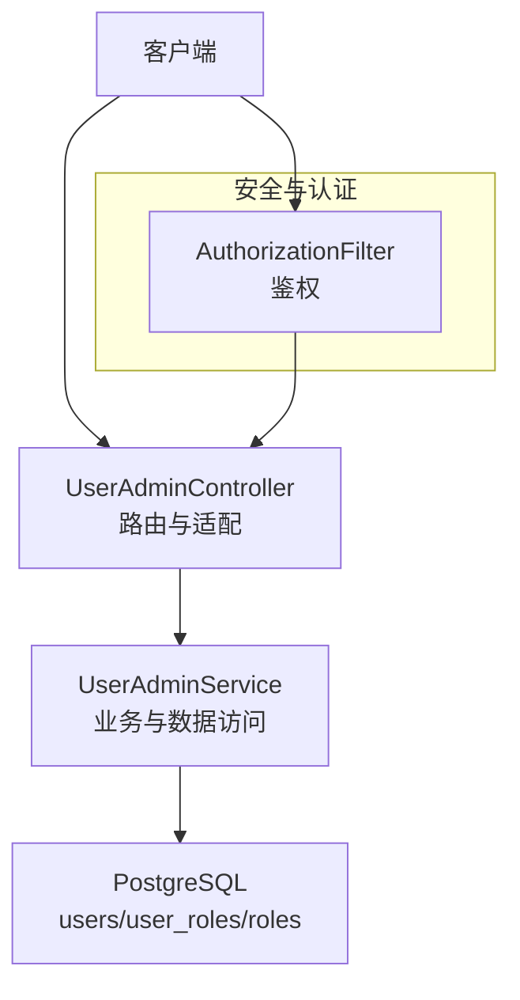
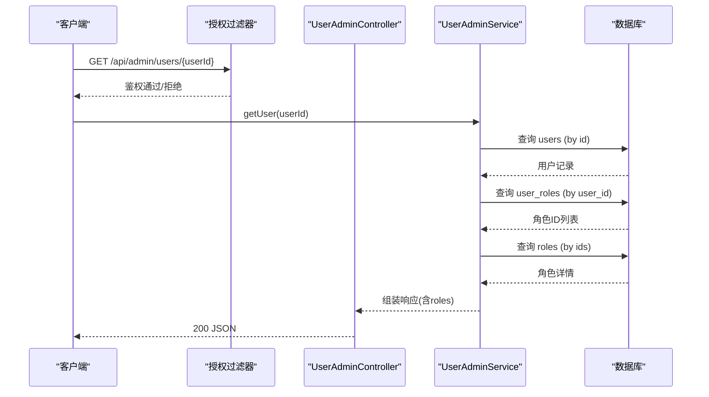
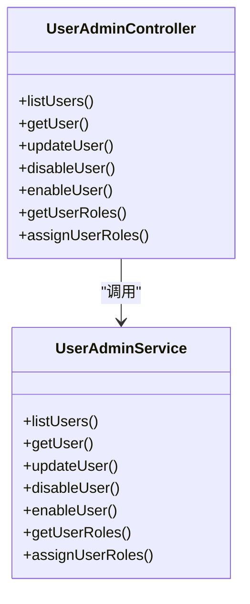

# 用户管理API

<cite>
**本文引用的文件**
- [UserAdminController.h](file://libs/drogon/include/authforge/drogon/controllers/UserAdminController.h)
- [UserAdminController.cc](file://libs/drogon/src/controllers/UserAdminController.cc)
- [UserAdminService.h](file://libs/drogon/include/authforge/drogon/admin/UserAdminService.h)
- [UserAdminService.cc](file://libs/drogon/src/admin/UserAdminService.cc)
- [AdminUserApiHttpTest.cc](file://tests/integration/admin/AdminUserApiHttpTest.cc)
- [openapi.json](file://apps/server/docs/api/openapi.json)
- [V011__mfa_support.sql](file://apps/server/migrations/V011__mfa_support.sql)
- [V013__account_lockout.sql](file://apps/server/migrations/V013__account_lockout.sql)
- [MfaController.cc](file://libs/drogon/src/controllers/MfaController.cc)
</cite>

## 目录
1. [简介](#简介)
2. [项目结构](#项目结构)
3. [核心组件](#核心组件)
4. [架构总览](#架构总览)
5. [详细组件分析](#详细组件分析)
6. [依赖关系分析](#依赖关系分析)
7. [性能考虑](#性能考虑)
8. [故障排查指南](#故障排查指南)
9. [结论](#结论)
10. [附录](#附录)

## 简介
本文件为“用户管理”管理端 API 的完整技术文档，覆盖以下能力：
- 用户列表查询：GET /api/admin/users
- 用户详情获取：GET /api/admin/users/{userId}
- 用户信息更新：PUT /api/admin/users/{userId}
- 用户启用/禁用：POST /api/admin/users/{userId}/enable、PUT /api/admin/users/{userId}/disable
- 用户角色管理：GET /api/admin/users/{userId}/roles（获取）、PUT /api/admin/users/{userId}/roles（分配）
- 高级功能：账户锁定机制、MFA 设置与校验（通过 MFA 相关接口联动）

所有接口均受授权过滤器保护，需携带有效的访问令牌。

## 项目结构
用户管理 API 由控制器层与服务层组成：
- 控制器层：负责路由注册、参数解析、调用服务并返回响应
- 服务层：封装业务逻辑与数据访问（使用 ORM Mapper + Criteria）
- 数据库迁移：包含 MFA 字段与账户锁定字段定义
- 集成测试：覆盖各接口的成功与失败路径

图表来源
- [UserAdminController.h:17-59](file://libs/drogon/include/authforge/drogon/controllers/UserAdminController.h#L17-L59)
- [UserAdminService.cc:74-186](file://libs/drogon/src/admin/UserAdminService.cc#L74-L186)

章节来源
- [UserAdminController.h:17-59](file://libs/drogon/include/authforge/drogon/controllers/UserAdminController.h#L17-L59)
- [UserAdminController.cc:20-85](file://libs/drogon/src/controllers/UserAdminController.cc#L20-L85)

## 核心组件
- UserAdminController：声明并实现用户管理相关 HTTP 路由，统一委派给 UserAdminService
- UserAdminService：实现用户列表、详情、更新、启用/禁用、角色获取与分配等核心逻辑
- 错误处理：统一通过 ErrorResponder 返回结构化错误码与消息
- 数据模型：基于 ORM 的 Users、UserRoles、Roles 模型进行查询与更新

章节来源
- [UserAdminController.h:17-59](file://libs/drogon/include/authforge/drogon/controllers/UserAdminController.h#L17-L59)
- [UserAdminService.h:25-61](file://libs/drogon/include/authforge/drogon/admin/UserAdminService.h#L25-L61)
- [UserAdminService.cc:24-56](file://libs/drogon/src/admin/UserAdminService.cc#L24-L56)

## 架构总览
下图展示一次“用户详情获取”请求从进入控制器到返回响应的完整流程，包括角色信息的二次查询。

图表来源
- [UserAdminController.cc:123-132](file://libs/drogon/src/controllers/UserAdminController.cc#L123-L132)
- [UserAdminService.cc:244-313](file://libs/drogon/src/admin/UserAdminService.cc#L244-L313)

## 详细组件分析

### 用户列表查询 GET /api/admin/users
- 功能：分页列出用户，附带每个用户的角色名称数组与总数
- 鉴权：需要有效令牌
- 关键行为：
  - 无用户时返回空数组与 total=0
  - 批量拉取用户角色与角色名，内存中聚合
- 典型响应体字段：status、users[]、total

章节来源
- [UserAdminController.cc:22-29](file://libs/drogon/src/controllers/UserAdminController.cc#L22-L29)
- [UserAdminService.cc:74-186](file://libs/drogon/src/admin/UserAdminService.cc#L74-L186)

### 用户详情获取 GET /api/admin/users/{userId}
- 功能：获取指定用户详细信息，包括邮箱验证状态、MFA 开关、登录失败次数、锁定状态及角色列表
- 参数校验：userId 必须为整数，否则返回 400
- 资源不存在：返回 404
- 典型响应体字段：status、id、username、email、email_verified、mfa_enabled、failed_login_count、locked、locked_until、created_at、roles[]

章节来源
- [UserAdminController.cc:49-57](file://libs/drogon/src/controllers/UserAdminController.cc#L49-L57)
- [UserAdminService.cc:244-313](file://libs/drogon/src/admin/UserAdminService.cc#L244-L313)

### 用户信息更新 PUT /api/admin/users/{userId}
- 功能：更新用户可编辑字段（当前支持 email、email_verified）
- 参数校验：
  - userId 必须为整数
  - 请求体必须包含至少一个可更新字段，否则返回 400
- 行为：
  - email 写入前会进行规范化
  - 更新成功后返回成功消息
- 典型响应体字段：status、message

章节来源
- [UserAdminController.cc:59-66](file://libs/drogon/src/controllers/UserAdminController.cc#L59-L66)
- [UserAdminService.cc:315-391](file://libs/drogon/src/admin/UserAdminService.cc#L315-L391)

### 用户禁用 PUT /api/admin/users/{userId}/disable
- 功能：禁用用户账户（将 locked_until 设置为“永久锁定”哨兵值）
- 典型响应体字段：status、message、user_id

章节来源
- [UserAdminController.cc:31-38](file://libs/drogon/src/controllers/UserAdminController.cc#L31-L38)
- [UserAdminService.cc:393-445](file://libs/drogon/src/admin/UserAdminService.cc#L393-L445)

### 用户启用 POST /api/admin/users/{userId}/enable
- 功能：启用被禁用的用户（重置 locked_until 与 failed_login_count）
- 典型响应体字段：status、message、user_id

章节来源
- [UserAdminController.cc:68-75](file://libs/drogon/src/controllers/UserAdminController.cc#L68-L75)
- [UserAdminService.cc:447-500](file://libs/drogon/src/admin/UserAdminService.cc#L447-L500)

### 用户角色管理
- 获取角色 GET /api/admin/users/{userId}/roles
  - 返回该用户已分配的角色集合（按 name 升序），包含 id、name、description
- 分配角色 PUT /api/admin/users/{userId}/roles
  - 请求体必须包含 roles 数组（字符串）
  - 先清空用户现有角色，再根据名称解析为角色 ID 并插入
  - 未匹配的角色将被忽略（保持向后兼容）
  - 返回成功消息与最终分配的角色列表

章节来源
- [UserAdminController.cc:77-84](file://libs/drogon/src/controllers/UserAdminController.cc#L77-L84)
- [UserAdminService.cc:502-585](file://libs/drogon/src/admin/UserAdminService.cc#L502-L585)
- [UserAdminService.cc:587-744](file://libs/drogon/src/admin/UserAdminService.cc#L587-L744)

### 账户锁定机制
- 数据模型：
  - failed_login_count：累计失败登录次数
  - locked_until：锁定截止时间戳（0 表示未锁定；大于当前时间表示锁定）
  - last_failed_login：最近一次失败登录时间戳
- 行为：
  - 禁用用户会将 locked_until 设为“永久锁定”哨兵值
  - 启用用户会重置 locked_until 与 failed_login_count
  - 前端在用户详情页面显示锁定状态并提供解锁操作入口

章节来源
- [V013__account_lockout.sql:1-6](file://apps/server/migrations/V013__account_lockout.sql#L1-L6)
- [UserAdminService.cc:58-60](file://libs/drogon/src/admin/UserAdminService.cc#L58-L60)
- [UserAdminService.cc:281-288](file://libs/drogon/src/admin/UserAdminService.cc#L281-L288)
- [UserAdminService.cc:393-500](file://libs/drogon/src/admin/UserAdminService.cc#L393-L500)

### MFA 设置与校验（关联接口）
- 提供 MFA 设置、验证与关闭接口，用于开启/关闭多因素认证
- 数据模型：
  - mfa_enabled：是否启用 MFA
  - mfa_secret：TOTP 密钥
  - mfa_backup_codes：备份验证码（JSON 数组）
- 典型流程：
  - 生成 TOTP 密钥与二维码链接
  - 校验验证码以完成启用
  - 登录过程中进行 MFA 校验

章节来源
- [V011__mfa_support.sql:1-6](file://apps/server/migrations/V011__mfa_support.sql#L1-L6)
- [openapi.json:1755-1831](file://apps/server/docs/api/openapi.json#L1755-L1831)
- [MfaController.cc:239-301](file://libs/drogon/src/controllers/MfaController.cc#L239-L301)

## 依赖关系分析
- 控制器依赖服务：UserAdminController 仅做路由适配，实际逻辑在 UserAdminService
- 服务依赖 ORM：通过 Mapper<T> + Criteria 访问 users、user_roles、roles 表
- 错误处理：统一通过 ErrorResponder 输出标准错误信封
- 测试驱动：集成测试覆盖鉴权缺失、参数非法、资源不存在、更新与启用/禁用往返等场景

图表来源
- [UserAdminController.h:17-59](file://libs/drogon/include/authforge/drogon/controllers/UserAdminController.h#L17-L59)
- [UserAdminService.h:25-61](file://libs/drogon/include/authforge/drogon/admin/UserAdminService.h#L25-L61)

章节来源
- [UserAdminController.cc:91-165](file://libs/drogon/src/controllers/UserAdminController.cc#L91-L165)
- [UserAdminService.cc:74-744](file://libs/drogon/src/admin/UserAdminService.cc#L74-L744)

## 性能考虑
- 列表与详情采用“分步查询”策略：先查用户，再批量查角色，避免复杂 JOIN，降低单次查询复杂度
- 角色分配采用“先删后插”模式，保证角色集一致性
- 对大量角色的分配采用并发插入与原子计数汇总，提升吞吐
- 建议：
  - 为 users、user_roles、roles 建立合适索引（如 user_id、role_id、name）
  - 对高频查询增加缓存层（如角色映射）
  - 监控慢查询与数据库连接池使用情况

[本节为通用指导，不直接分析具体文件]

## 故障排查指南
- 鉴权失败（401）：检查请求头是否携带有效 Bearer Token
- 参数非法（400）：
  - userId 非整数
  - 更新请求未包含任何可更新字段
  - 角色分配请求缺少 roles 数组
- 资源不存在（404）：用户 ID 不存在
- 数据库异常（DB_QUERY_ERROR）：检查数据库连接与权限
- 账户锁定：
  - 查看 locked_until 与 failed_login_count
  - 使用启用接口重置锁定状态
- MFA 问题：
  - 确认是否已完成 setup 与 verify
  - 校验验证码是否正确

章节来源
- [AdminUserApiHttpTest.cc:150-177](file://tests/integration/admin/AdminUserApiHttpTest.cc#L150-L177)
- [AdminUserApiHttpTest.cc:183-232](file://tests/integration/admin/AdminUserApiHttpTest.cc#L183-L232)
- [AdminUserApiHttpTest.cc:239-294](file://tests/integration/admin/AdminUserApiHttpTest.cc#L239-L294)
- [AdminUserApiHttpTest.cc:302-335](file://tests/integration/admin/AdminUserApiHttpTest.cc#L302-L335)
- [UserAdminService.cc:24-56](file://libs/drogon/src/admin/UserAdminService.cc#L24-L56)

## 结论
用户管理 API 提供了完整的用户生命周期管理能力，涵盖查询、更新、启用/禁用与角色分配，并与账户锁定和 MFA 能力协同工作。通过清晰的控制器-服务分层与统一的错误处理，接口具备良好的可维护性与扩展性。建议在部署环境中完善索引与监控，确保在高并发下的稳定表现。

[本节为总结性内容，不直接分析具体文件]

## 附录

### API 清单与说明
- GET /api/admin/users
  - 描述：获取用户列表（分页），包含用户基本信息与角色数组
  - 鉴权：需要
  - 成功响应示例字段：status、users[]、total
- GET /api/admin/users/{userId}
  - 描述：获取用户详情（含角色、锁定状态、MFA 状态等）
  - 鉴权：需要
  - 成功响应示例字段：status、id、username、email、email_verified、mfa_enabled、failed_login_count、locked、locked_until、created_at、roles[]
- PUT /api/admin/users/{userId}
  - 描述：更新用户信息（email、email_verified）
  - 鉴权：需要
  - 成功响应示例字段：status、message
- PUT /api/admin/users/{userId}/disable
  - 描述：禁用用户（设置永久锁定）
  - 鉴权：需要
  - 成功响应示例字段：status、message、user_id
- POST /api/admin/users/{userId}/enable
  - 描述：启用用户（重置锁定与失败计数）
  - 鉴权：需要
  - 成功响应示例字段：status、message、user_id
- GET /api/admin/users/{userId}/roles
  - 描述：获取用户已分配角色（id、name、description）
  - 鉴权：需要
  - 成功响应示例字段：status、roles[]
- PUT /api/admin/users/{userId}/roles
  - 描述：为用户分配角色（传入角色名数组）
  - 鉴权：需要
  - 成功响应示例字段：status、message、user_id、roles[]

章节来源
- [UserAdminController.cc:20-85](file://libs/drogon/src/controllers/UserAdminController.cc#L20-L85)
- [UserAdminService.cc:74-744](file://libs/drogon/src/admin/UserAdminService.cc#L74-L744)
- [AdminUserApiHttpTest.cc:150-359](file://tests/integration/admin/AdminUserApiHttpTest.cc#L150-L359)

### 错误码与含义
- VALIDATION_INVALID_INPUT：参数校验失败（如 userId 非整数）
- VALIDATION_MISSING_REQUIRED_FIELD：必填字段缺失（如 roles 数组）
- VALIDATION_RESOURCE_NOT_FOUND：资源不存在（如用户不存在）
- DB_CONNECTION_ERROR：数据库不可用
- DB_QUERY_ERROR：数据库查询或更新失败

章节来源
- [UserAdminService.cc:24-56](file://libs/drogon/src/admin/UserAdminService.cc#L24-L56)
- [UserAdminService.cc:244-744](file://libs/drogon/src/admin/UserAdminService.cc#L244-L744)

### 数据模型要点
- users 表新增字段：
  - mfa_enabled、mfa_secret、mfa_backup_codes（MFA）
  - failed_login_count、locked_until、last_failed_login（账户锁定）
- 角色与用户关系：
  - user_roles 表维护用户与角色的多对多关系

章节来源
- [V011__mfa_support.sql:1-6](file://apps/server/migrations/V011__mfa_support.sql#L1-L6)
- [V013__account_lockout.sql:1-6](file://apps/server/migrations/V013__account_lockout.sql#L1-L6)