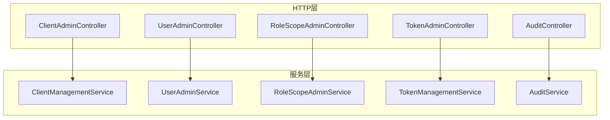
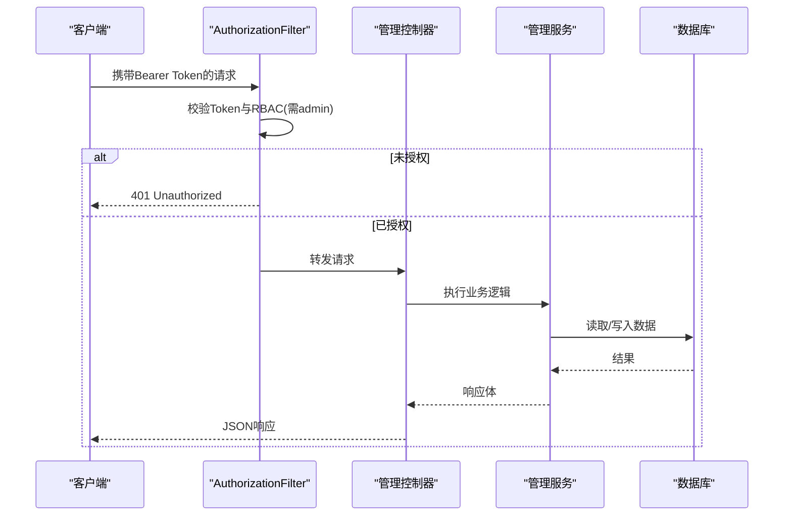
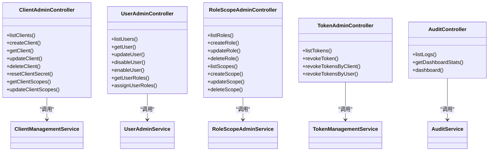

# 管理API

<cite>
**本文引用的文件**
- [apps/server/docs/api/openapi.json](file://apps/server/docs/api/openapi.json)
- [apps/server/openapi.yaml](file://apps/server/openapi.yaml)
- [libs/drogon/include/authforge/drogon/controllers/ClientAdminController.h](file://libs/drogon/include/authforge/drogon/controllers/ClientAdminController.h)
- [libs/drogon/src/controllers/ClientAdminController.cc](file://libs/drogon/src/controllers/ClientAdminController.cc)
- [libs/drogon/include/authforge/drogon/admin/ClientManagementService.h](file://libs/drogon/include/authforge/drogon/admin/ClientManagementService.h)
- [libs/drogon/include/authforge/drogon/controllers/UserAdminController.h](file://libs/drogon/include/authforge/drogon/controllers/UserAdminController.h)
- [libs/drogon/src/controllers/UserAdminController.cc](file://libs/drogon/src/controllers/UserAdminController.cc)
- [libs/drogon/include/authforge/drogon/admin/UserAdminService.h](file://libs/drogon/include/authforge/drogon/admin/UserAdminService.h)
- [libs/drogon/include/authforge/drogon/controllers/RoleScopeAdminController.h](file://libs/drogon/include/authforge/drogon/controllers/RoleScopeAdminController.h)
- [libs/drogon/src/controllers/RoleScopeAdminController.cc](file://libs/drogon/src/controllers/RoleScopeAdminController.cc)
- [libs/drogon/include/authforge/drogon/admin/RoleScopeAdminService.h](file://libs/drogon/include/authforge/drogon/admin/RoleScopeAdminService.h)
- [libs/drogon/include/authforge/drogon/controllers/TokenAdminController.h](file://libs/drogon/include/authforge/drogon/controllers/TokenAdminController.h)
- [libs/drogon/include/authforge/drogon/admin/TokenManagementService.h](file://libs/drogon/include/authforge/drogon/admin/TokenManagementService.h)
- [libs/drogon/include/authforge/drogon/controllers/AuditController.h](file://libs/drogon/include/authforge/drogon/controllers/AuditController.h)
- [libs/drogon/include/authforge/drogon/admin/AuditService.h](file://libs/drogon/include/authforge/drogon/admin/AuditService.h)
- [tests/integration/admin/AdminClientApiHttpTest.cc](file://tests/integration/admin/AdminClientApiHttpTest.cc)
- [tests/integration/admin/AdminUserApiHttpTest.cc](file://tests/integration/admin/AdminUserApiHttpTest.cc)
- [tests/integration/admin/AdminRoleScopeApiHttpTest.cc](file://tests/integration/admin/AdminRoleScopeApiHttpTest.cc)
- [tests/integration/admin/AdminAuditApiHttpTest.cc](file://tests/integration/admin/AdminAuditApiHttpTest.cc)
- [tests/integration/admin/AdminTokenApiHttpTest.cc](file://tests/integration/admin/AdminTokenApiHttpTest.cc)
- [docs/history/PRD/production_hardening_p1_tasks.md](file://docs/history/PRD/production_hardening_p1_tasks.md)
</cite>

## 目录
1. [简介](#简介)
2. [项目结构](#项目结构)
3. [核心组件](#核心组件)
4. [架构总览](#架构总览)
5. [详细组件分析](#详细组件分析)
6. [依赖关系分析](#依赖关系分析)
7. [性能考虑](#性能考虑)
8. [故障排查指南](#故障排查指南)
9. [结论](#结论)
10. [附录](#附录)

## 简介
本参考文档面向管理员与集成方，系统化说明 AuthForge 的管理端 API，覆盖客户端管理、用户管理、角色与权限范围（Scope）管理、令牌管理与审计日志等。所有管理端点均受统一鉴权过滤器保护，要求具备管理员权限；支持分页查询、批量撤销等操作；提供一致的请求/响应结构与错误处理约定。

## 项目结构
管理端 API 采用“控制器 + 服务”的分层设计：
- 控制器：负责路由注册、参数解析与调用服务。
- 服务：封装业务逻辑与数据访问（通过 ORM Mapper/Criteria）。
- OpenAPI：集中描述接口契约与安全方案。

图表来源
- [libs/drogon/include/authforge/drogon/controllers/ClientAdminController.h:15-41](file://libs/drogon/include/authforge/drogon/controllers/ClientAdminController.h#L15-L41)
- [libs/drogon/include/authforge/drogon/controllers/UserAdminController.h:14-44](file://libs/drogon/include/authforge/drogon/controllers/UserAdminController.h#L14-L44)
- [libs/drogon/include/authforge/drogon/controllers/RoleScopeAdminController.h:14-67](file://libs/drogon/include/authforge/drogon/controllers/RoleScopeAdminController.h#L14-L67)
- [libs/drogon/include/authforge/drogon/controllers/TokenAdminController.h:14-42](file://libs/drogon/include/authforge/drogon/controllers/TokenAdminController.h#L14-L42)
- [libs/drogon/include/authforge/drogon/controllers/AuditController.h:16-39](file://libs/drogon/include/authforge/drogon/controllers/AuditController.h#L16-L39)

章节来源
- [apps/server/docs/api/openapi.json:142-771](file://apps/server/docs/api/openapi.json#L142-L771)
- [apps/server/openapi.yaml:72-800](file://apps/server/openapi.yaml#L72-L800)

## 核心组件
- 客户端管理：CRUD 与 Scope 分配、密钥重置。
- 用户管理：分页列表、详情、启用/禁用、角色分配。
- 角色与权限范围：CRUD 与内置保护。
- 令牌管理：列表、按客户端/用户批量撤销、按前缀撤销、OIDC 密钥信息。
- 审计与仪表盘：分页审计日志、统计概览。

章节来源
- [libs/drogon/include/authforge/drogon/admin/ClientManagementService.h:45-91](file://libs/drogon/include/authforge/drogon/admin/ClientManagementService.h#L45-L91)
- [libs/drogon/include/authforge/drogon/admin/UserAdminService.h:31-61](file://libs/drogon/include/authforge/drogon/admin/UserAdminService.h#L31-L61)
- [libs/drogon/include/authforge/drogon/admin/RoleScopeAdminService.h:31-57](file://libs/drogon/include/authforge/drogon/admin/RoleScopeAdminService.h#L31-L57)
- [libs/drogon/include/authforge/drogon/admin/TokenManagementService.h:37-54](file://libs/drogon/include/authforge/drogon/admin/TokenManagementService.h#L37-L54)
- [libs/drogon/include/authforge/drogon/admin/AuditService.h:34-41](file://libs/drogon/include/authforge/drogon/admin/AuditService.h#L34-L41)

## 架构总览
所有管理端点挂载 AuthorizationFilter，强制 Bearer Token 认证，并通过 RBAC 规则限制为 admin 角色。

图表来源
- [docs/history/PRD/production_hardening_p1_tasks.md:478-485](file://docs/history/PRD/production_hardening_p1_tasks.md#L478-L485)
- [apps/server/openapi.yaml:27-35](file://apps/server/openapi.yaml#L27-L35)

## 详细组件分析

### 客户端管理 /api/admin/clients
- 列表：GET /api/admin/clients，返回分页结构 clients[] 与 total。
- 创建：POST /api/admin/clients，请求体包含 name、redirect_uris、allowed_grant_types、client_type 等字段，成功返回 201 并包含 client_id、client_secret。
- 详情：GET /api/admin/clients/{clientId}。
- 更新：PUT /api/admin/clients/{clientId}。
- 删除：DELETE /api/admin/clients/{clientId}。
- 重置密钥：POST /api/admin/clients/{clientId}/reset-secret。
- 分配/查看 Scope：GET/PUT /api/admin/clients/{clientId}/scopes。

安全与权限
- 全部需要 Bearer Token，且需 admin 角色。

分页与过滤
- 列表返回 clients 数组与 total，具体分页参数由查询实现决定（可结合通用分页参数 page/page_size 或后端约定）。

错误码
- 401：未认证或无效 Token。
- 404：资源不存在。
- 400：请求体无效。

示例（来自测试）
- 创建客户端时发送 name、redirect_uris、allowed_grant_types、client_type，返回 201 并包含 client_id/client_secret。
- 无 Token 访问返回 401；无效 Token 返回 401；删除未知 ID 返回 404。

章节来源
- [apps/server/openapi.yaml:72-241](file://apps/server/openapi.yaml#L72-L241)
- [apps/server/docs/api/openapi.json:142-305](file://apps/server/docs/api/openapi.json#L142-L305)
- [tests/integration/admin/AdminClientApiHttpTest.cc:64-166](file://tests/integration/admin/AdminClientApiHttpTest.cc#L64-L166)
- [libs/drogon/include/authforge/drogon/controllers/ClientAdminController.h:15-41](file://libs/drogon/include/authforge/drogon/controllers/ClientAdminController.h#L15-L41)
- [libs/drogon/include/authforge/drogon/admin/ClientManagementService.h:45-91](file://libs/drogon/include/authforge/drogon/admin/ClientManagementService.h#L45-L91)

### 用户管理 /api/admin/users
- 列表：GET /api/admin/users，分页。
- 详情：GET /api/admin/users/{userId}，返回 email、username、roles、status、locked、mfa_enabled 等。
- 更新：PUT /api/admin/users/{userId}，可更新 email、email_verified。
- 禁用：PUT /api/admin/users/{userId}/disable。
- 启用：POST /api/admin/users/{userId}/enable。
- 角色：GET/PUT /api/admin/users/{userId}/roles，获取/分配角色。

安全与权限
- 全部需要 Bearer Token，且需 admin 角色。

分页与过滤
- 列表返回分页结构（status、total 等），具体查询参数依实现而定。

错误码
- 401：未认证或无效 Token。
- 404：用户不存在。
- 400：请求体无效。

示例（来自测试）
- 禁用后启用流程：先 PUT disable 返回 200，再 POST enable 返回 200。
- 获取用户角色：GET /api/admin/users/{id}/roles 返回 roles 数组与 status。

章节来源
- [apps/server/openapi.yaml:345-561](file://apps/server/openapi.yaml#L345-L561)
- [apps/server/docs/api/openapi.json:624-771](file://apps/server/docs/api/openapi.json#L624-L771)
- [tests/integration/admin/AdminUserApiHttpTest.cc:310-347](file://tests/integration/admin/AdminUserApiHttpTest.cc#L310-L347)
- [libs/drogon/include/authforge/drogon/controllers/UserAdminController.h:14-44](file://libs/drogon/include/authforge/drogon/controllers/UserAdminController.h#L14-L44)
- [libs/drogon/include/authforge/drogon/admin/UserAdminService.h:31-61](file://libs/drogon/include/authforge/drogon/admin/UserAdminService.h#L31-L61)

### 角色与权限范围管理 /api/admin/roles 与 /api/admin/scopes
- 角色
  - 列表：GET /api/admin/roles，返回 roles[]、total、status。
  - 创建：POST /api/admin/roles，必填 name，可选 description。
  - 更新：PUT /api/admin/roles/{roleId}，更新 description。
  - 删除：DELETE /api/admin/roles/{roleId}，内置角色不可删除。
- 权限范围
  - 列表：GET /api/admin/scopes，返回 scopes[]、total、status。
  - 创建：POST /api/admin/scopes，必填 name，可选 is_default、mapped_role、requires_admin_role、description。
  - 更新：PUT /api/admin/scopes/{scopeId}。
  - 删除：DELETE /api/admin/scopes/{scopeId}，内置 scope 不可删除。

安全与权限
- 全部需要 Bearer Token，且需 admin 角色。

错误码
- 409：名称冲突（重复的 role/scope 名称）。
- 400：请求体无效。
- 404：资源不存在或为内置不可删除。

章节来源
- [apps/server/openapi.yaml:562-800](file://apps/server/openapi.yaml#L562-L800)
- [apps/server/docs/api/openapi.json:372-535](file://apps/server/docs/api/openapi.json#L372-L535)
- [libs/drogon/include/authforge/drogon/controllers/RoleScopeAdminController.h:14-67](file://libs/drogon/include/authforge/drogon/controllers/RoleScopeAdminController.h#L14-L67)
- [libs/drogon/include/authforge/drogon/admin/RoleScopeAdminService.h:31-57](file://libs/drogon/include/authforge/drogon/admin/RoleScopeAdminService.h#L31-L57)

### 令牌管理 /api/admin/tokens 与 OIDC 密钥
- 列表：GET /api/admin/tokens，返回活跃令牌列表。
- 撤销
  - 按客户端：POST /api/admin/tokens/revoke-by-client。
  - 按用户：POST /api/admin/tokens/revoke-by-user。
  - 按前缀：DELETE /api/admin/tokens/{tokenPrefix}。
- OIDC 密钥信息：GET /api/admin/oidc/keys。

安全与权限
- 全部需要 Bearer Token，且需 admin 角色。

错误码
- 401：未认证或无效 Token。
- 400：请求体无效。
- 404：令牌不存在。

章节来源
- [apps/server/openapi.yaml:272-344](file://apps/server/openapi.yaml#L272-L344)
- [apps/server/docs/api/openapi.json:536-623](file://apps/server/docs/api/openapi.json#L536-L623)
- [libs/drogon/include/authforge/drogon/controllers/TokenAdminController.h:14-42](file://libs/drogon/include/authforge/drogon/controllers/TokenAdminController.h#L14-L42)
- [libs/drogon/include/authforge/drogon/admin/TokenManagementService.h:37-54](file://libs/drogon/include/authforge/drogon/admin/TokenManagementService.h#L37-L54)

### 审计日志与仪表盘 /api/admin/logs 与 /api/admin/dashboard/stats
- 审计日志：GET /api/admin/logs，分页返回系统审计日志。
- 仪表盘统计：GET /api/admin/dashboard/stats，返回用户数、客户端数、活跃令牌数、失败指标等。
- 仪表盘页面：GET /api/admin/dashboard（静态欢迎页）。

安全与权限
- 全部需要 Bearer Token，且需 admin 角色。

错误码
- 401：未认证或无效 Token。

章节来源
- [apps/server/openapi.yaml:242-271](file://apps/server/openapi.yaml#L242-L271)
- [apps/server/docs/api/openapi.json:306-371](file://apps/server/docs/api/openapi.json#L306-L371)
- [libs/drogon/include/authforge/drogon/controllers/AuditController.h:16-39](file://libs/drogon/include/authforge/drogon/controllers/AuditController.h#L16-L39)
- [libs/drogon/include/authforge/drogon/admin/AuditService.h:34-41](file://libs/drogon/include/authforge/drogon/admin/AuditService.h#L34-L41)

## 依赖关系分析
- 控制器仅做 HTTP 适配，将请求委派给对应服务。
- 服务通过 ORM Mapper/Criteria 访问数据库，避免内联 SQL。
- 所有管理端点统一挂载 AuthorizationFilter，基于 RBAC 规则限制为 admin。

图表来源
- [libs/drogon/include/authforge/drogon/controllers/ClientAdminController.h:15-41](file://libs/drogon/include/authforge/drogon/controllers/ClientAdminController.h#L15-L41)
- [libs/drogon/include/authforge/drogon/controllers/UserAdminController.h:14-44](file://libs/drogon/include/authforge/drogon/controllers/UserAdminController.h#L14-L44)
- [libs/drogon/include/authforge/drogon/controllers/RoleScopeAdminController.h:14-67](file://libs/drogon/include/authforge/drogon/controllers/RoleScopeAdminController.h#L14-L67)
- [libs/drogon/include/authforge/drogon/controllers/TokenAdminController.h:14-42](file://libs/drogon/include/authforge/drogon/controllers/TokenAdminController.h#L14-L42)
- [libs/drogon/include/authforge/drogon/controllers/AuditController.h:16-39](file://libs/drogon/include/authforge/drogon/controllers/AuditController.h#L16-L39)

章节来源
- [docs/history/PRD/production_hardening_p1_tasks.md:478-485](file://docs/history/PRD/production_hardening_p1_tasks.md#L478-L485)

## 性能考虑
- 列表接口普遍支持分页，建议合理设置 page/page_size 以避免大结果集。
- 批量撤销令牌（按客户端/用户）在高并发场景下应控制频率，必要时配合限流策略。
- 审计日志查询建议使用时间范围过滤以减少扫描量。
- 控制器与服务解耦，便于后续引入缓存或异步化优化。

[本节为通用指导，不直接分析具体文件]

## 故障排查指南
常见错误与定位要点：
- 401 Unauthorized
  - 检查是否携带有效的 Bearer Token。
  - 确认当前 Token 对应的用户具备 admin 角色。
- 404 Not Found
  - 检查路径参数是否正确（如 clientId、userId、roleId、scopeId、tokenPrefix）。
  - 确认资源是否存在或被删除。
- 400 Bad Request
  - 检查请求体字段是否符合 OpenAPI 定义（必填项、类型）。
- 409 Conflict
  - 创建角色/范围时名称冲突，更换唯一名称。

调试建议：
- 使用 OpenAPI 文档进行请求构造与校验。
- 借助集成测试用例中的请求模式作为参考（例如创建客户端、禁用/启用用户、撤销令牌等）。

章节来源
- [tests/integration/admin/AdminClientApiHttpTest.cc:87-108](file://tests/integration/admin/AdminClientApiHttpTest.cc#L87-L108)
- [tests/integration/admin/AdminUserApiHttpTest.cc:310-347](file://tests/integration/admin/AdminUserApiHttpTest.cc#L310-L347)
- [apps/server/openapi.yaml:72-800](file://apps/server/openapi.yaml#L72-L800)

## 结论
管理 API 以清晰的控制器-服务分层组织，统一鉴权与 RBAC 控制，提供完整的 CRUD、分页、批量操作能力。通过 OpenAPI 文档与集成测试保障契约一致性与稳定性。建议在集成时严格遵循认证与权限要求，合理使用分页与批量接口，并结合审计日志进行运维监控。

[本节为总结性内容，不直接分析具体文件]

## 附录

### 安全与最佳实践
- 始终使用 HTTPS 传输。
- 仅向可信环境暴露管理端点，并限制来源 IP。
- 定期轮换客户端密钥与管理员凭据。
- 最小权限原则：仅授予必要的 admin 角色。
- 对敏感操作（如重置密钥、批量撤销令牌）开启审计记录与告警。

[本节为通用指导，不直接分析具体文件]

### 典型使用场景
- 新应用接入：创建客户端并分配必要 Scope，验证回调地址与授权类型。
- 用户治理：分页查看用户、启用/禁用账户、调整角色。
- 令牌治理：按用户或客户端批量撤销异常会话。
- 合规审计：导出审计日志，核查敏感操作轨迹。

[本节为概念性内容，不直接分析具体文件]