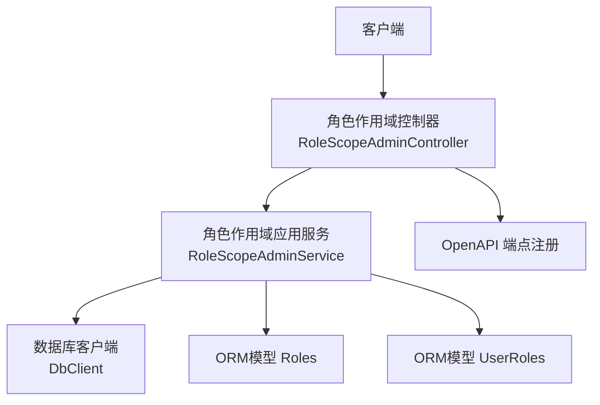
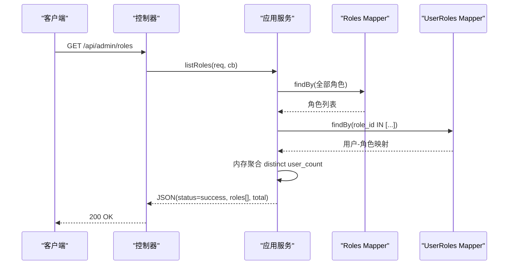
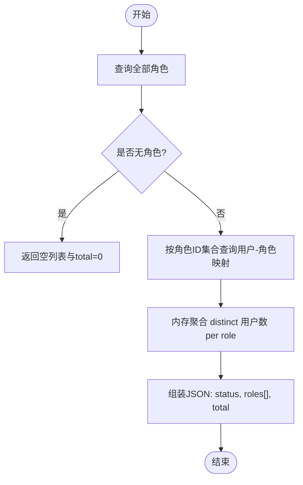
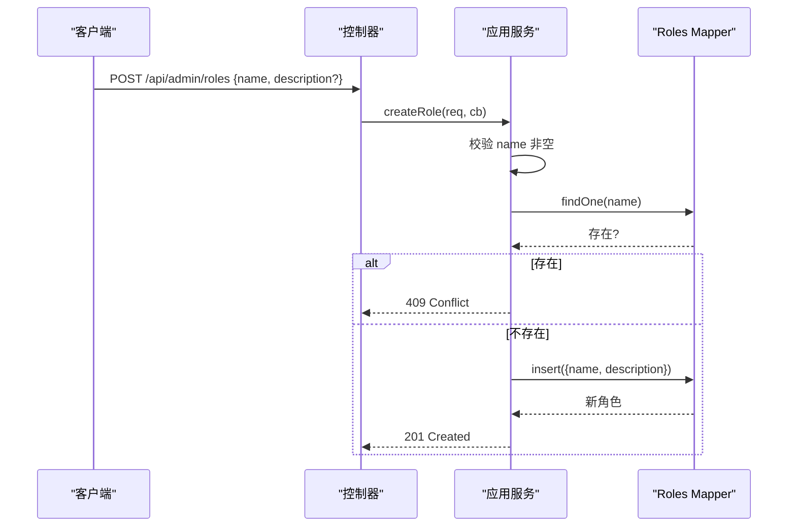
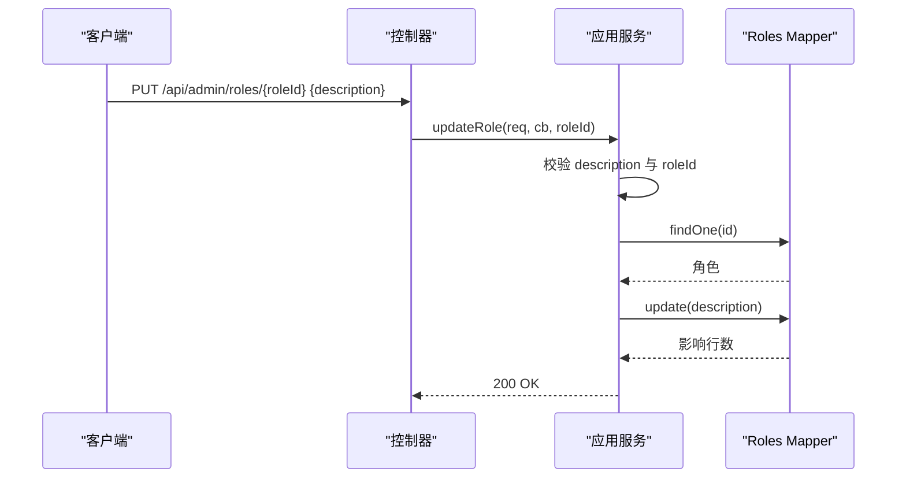
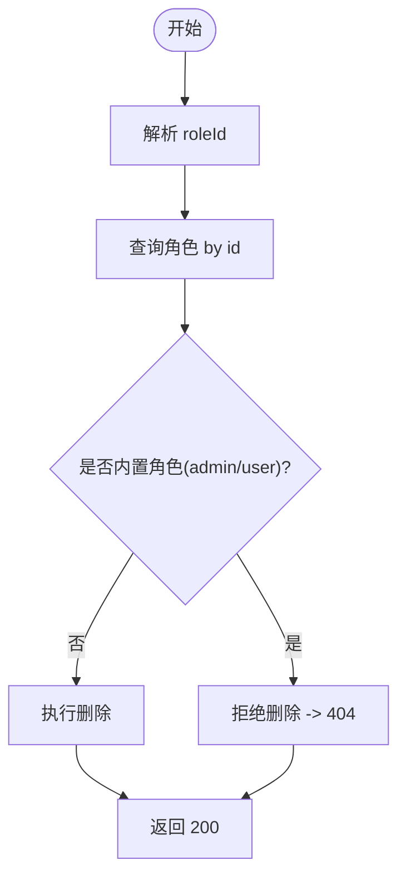
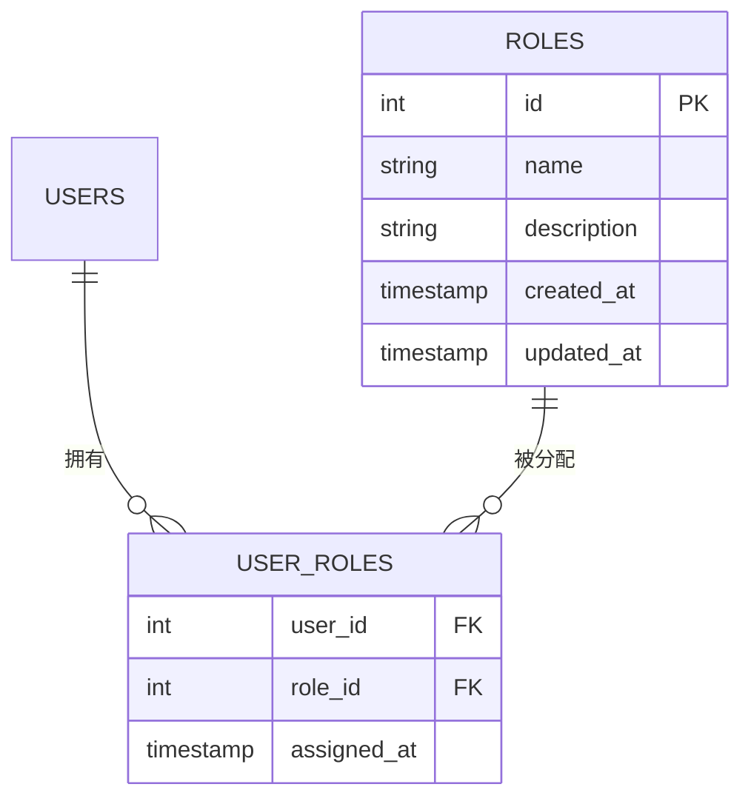
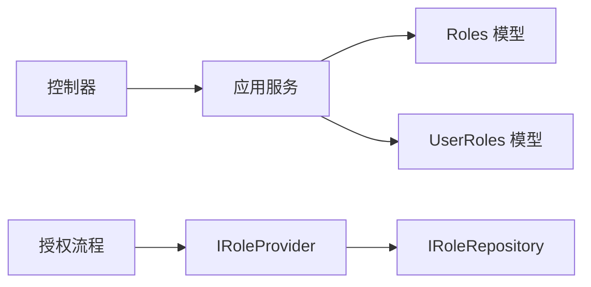

# 角色管理API

<cite>
**本文引用的文件**
- [RoleScopeAdminController.cc](file://libs/drogon/src/controllers/RoleScopeAdminController.cc)
- [RoleScopeAdminService.h](file://libs/drogon/include/authforge/drogon/admin/RoleScopeAdminService.h)
- [RoleScopeAdminService.cc](file://libs/drogon/src/admin/RoleScopeAdminService.cc)
- [Roles.h](file://libs/storage-postgres/include/authforge/storage/postgres/models/Roles.h)
- [UserRoles.h](file://libs/storage-postgres/include/authforge/storage/postgres/models/UserRoles.h)
- [IRoleProvider.h](file://libs/common/include/authforge/common/ports/IRoleProvider.h)
- [IRoleRepository.h](file://libs/identity/include/authforge/identity/IRoleRepository.h)
- [openapi.json](file://apps/server/docs/api/openapi.json)
- [AdminRoleScopeApiHttpTest.cc](file://tests/integration/admin/AdminRoleScopeApiHttpTest.cc)
</cite>

## 目录
1. [简介](#简介)
2. [项目结构](#项目结构)
3. [核心组件](#核心组件)
4. [架构总览](#架构总览)
5. [详细组件分析](#详细组件分析)
6. [依赖关系分析](#依赖关系分析)
7. [性能考量](#性能考量)
8. [故障排查指南](#故障排查指南)
9. [结论](#结论)
10. [附录](#附录)

## 简介
本文件面向角色管理相关API，覆盖角色的完整生命周期：列表查询、创建、详情获取（通过用户详情接口关联）、更新与删除。文档同时说明内置角色（admin、user）的保护机制、自定义角色的创建规则、角色与用户的关联关系、权限继承与用户计数统计等能力，并给出最佳实践与安全建议。

## 项目结构
角色管理API位于Drogon控制器与应用服务层之间，数据访问通过ORM模型完成，OpenAPI元数据由控制器侧注册。关键路径如下：
- HTTP路由与文档注册：控制器
- 业务编排与校验：应用服务
- 持久化：PostgreSQL ORM模型（Roles、UserRoles）
- 运行时鉴权：基于Bearer Token的认证
- OpenAPI文档：集中定义在服务器文档中

图表来源
- [RoleScopeAdminController.cc:23-66](file://libs/drogon/src/controllers/RoleScopeAdminController.cc#L23-L66)
- [RoleScopeAdminService.cc:77-153](file://libs/drogon/src/admin/RoleScopeAdminService.cc#L77-L153)
- [Roles.h:46-167](file://libs/storage-postgres/include/authforge/storage/postgres/models/Roles.h#L46-L167)
- [UserRoles.h:44-143](file://libs/storage-postgres/include/authforge/storage/postgres/models/UserRoles.h#L44-L143)

章节来源
- [RoleScopeAdminController.cc:1-185](file://libs/drogon/src/controllers/RoleScopeAdminController.cc#L1-L185)
- [RoleScopeAdminService.h:1-61](file://libs/drogon/include/authforge/drogon/admin/RoleScopeAdminService.h#L1-L61)
- [RoleScopeAdminService.cc:1-594](file://libs/drogon/src/admin/RoleScopeAdminService.cc#L1-L594)
- [openapi.json:372-453](file://apps/server/docs/api/openapi.json#L372-L453)

## 核心组件
- 控制器层：负责HTTP路由、参数解析、调用应用服务、返回响应；同时注册OpenAPI端点信息。
- 应用服务层：实现角色CRUD、用户计数聚合、错误响应封装、数据库访问编排。
- 数据模型层：Roles、UserRoles等ORM模型，提供Mapper查询与插入/更新/删除操作。
- 身份与权限集成：通过IRoleProvider/IRoleRepository在授权流程中读取用户角色，支撑权限判定与OIDC claims注入。

章节来源
- [RoleScopeAdminController.cc:100-140](file://libs/drogon/src/controllers/RoleScopeAdminController.cc#L100-L140)
- [RoleScopeAdminService.cc:155-338](file://libs/drogon/src/admin/RoleScopeAdminService.cc#L155-L338)
- [IRoleProvider.h:29-74](file://libs/common/include/authforge/common/ports/IRoleProvider.h#L29-L74)
- [IRoleRepository.h:23-49](file://libs/identity/include/authforge/identity/IRoleRepository.h#L23-L49)

## 架构总览
角色管理API采用分层设计：控制器仅做薄适配，业务逻辑集中在应用服务，数据访问通过ORM Mapper完成。列表接口通过两次查询（先取角色，再按角色ID集合取用户角色映射）并在内存中聚合用户计数，避免单条JOIN查询。

图表来源
- [RoleScopeAdminController.cc:100-108](file://libs/drogon/src/controllers/RoleScopeAdminController.cc#L100-L108)
- [RoleScopeAdminService.cc:77-153](file://libs/drogon/src/admin/RoleScopeAdminService.cc#L77-L153)

## 详细组件分析

### API 规范与行为
- 列表查询：GET /api/admin/roles
  - 功能：返回所有角色及每个角色的用户数量，包含total字段。
  - 安全：需要Bearer认证。
  - 响应：status、roles数组、total。
- 创建角色：POST /api/admin/roles
  - 输入：name（必填）、description（可选）。
  - 规则：名称唯一；内置角色不可重复创建。
  - 成功：201 Created，返回id、name、description。
  - 冲突：409 Conflict（名称已存在）。
  - 校验失败：400 Bad Request（缺少或空name）。
- 更新角色：PUT /api/admin/roles/{roleId}
  - 输入：description（必填）。
  - 行为：更新指定角色的描述；不存在返回404。
- 删除角色：DELETE /api/admin/roles/{roleId}
  - 保护：内置角色（admin、user）禁止删除。
  - 行为：删除成功返回200；未找到或尝试删除内置角色返回404。

章节来源
- [openapi.json:372-453](file://apps/server/docs/api/openapi.json#L372-L453)
- [RoleScopeAdminService.cc:155-338](file://libs/drogon/src/admin/RoleScopeAdminService.cc#L155-L338)
- [AdminRoleScopeApiHttpTest.cc:65-158](file://tests/integration/admin/AdminRoleScopeApiHttpTest.cc#L65-L158)

### 角色列表与用户计数
- 实现策略：先查询全部角色，再根据角色ID集合查询用户-角色映射，内存中按角色聚合distinct用户数。
- 复杂度：O(N+M)，N为角色数，M为用户-角色映射记录数。
- 优势：避免复杂JOIN，符合“禁止单条JOIN查询”的约束。

图表来源
- [RoleScopeAdminService.cc:77-153](file://libs/drogon/src/admin/RoleScopeAdminService.cc#L77-L153)

章节来源
- [RoleScopeAdminService.cc:77-153](file://libs/drogon/src/admin/RoleScopeAdminService.cc#L77-L153)

### 角色创建流程
- 校验：请求体必须包含非空的name。
- 查重：检查是否存在同名角色，存在则返回409。
- 写入：插入新角色，返回201及新增角色信息。

图表来源
- [RoleScopeAdminService.cc:155-218](file://libs/drogon/src/admin/RoleScopeAdminService.cc#L155-L218)

章节来源
- [RoleScopeAdminService.cc:155-218](file://libs/drogon/src/admin/RoleScopeAdminService.cc#L155-L218)

### 角色更新流程
- 校验：请求体必须包含description；roleId需为整数。
- 查找：按id查找角色，不存在返回404。
- 更新：更新description并返回成功。

图表来源
- [RoleScopeAdminService.cc:220-284](file://libs/drogon/src/admin/RoleScopeAdminService.cc#L220-L284)

章节来源
- [RoleScopeAdminService.cc:220-284](file://libs/drogon/src/admin/RoleScopeAdminService.cc#L220-L284)

### 角色删除流程与内置角色保护
- 校验：roleId需为整数。
- 保护：内置角色（admin、user）禁止删除。
- 行为：删除成功返回200；未找到或受保护角色返回404。

图表来源
- [RoleScopeAdminService.cc:286-338](file://libs/drogon/src/admin/RoleScopeAdminService.cc#L286-L338)

章节来源
- [RoleScopeAdminService.cc:286-338](file://libs/drogon/src/admin/RoleScopeAdminService.cc#L286-L338)

### 角色与用户关联、权限继承与用户计数
- 关联关系：通过UserRoles表维护用户与角色的多对多关系。
- 用户计数：列表接口在内存中按角色聚合distinct用户数，反映当前分配情况。
- 权限继承：系统通过IRoleProvider/IRoleRepository在授权时读取用户角色，用于权限决策与OIDC claims注入。

图表来源
- [Roles.h:46-167](file://libs/storage-postgres/include/authforge/storage/postgres/models/Roles.h#L46-L167)
- [UserRoles.h:44-143](file://libs/storage-postgres/include/authforge/storage/postgres/models/UserRoles.h#L44-L143)

章节来源
- [IRoleProvider.h:29-74](file://libs/common/include/authforge/common/ports/IRoleProvider.h#L29-L74)
- [IRoleRepository.h:23-49](file://libs/identity/include/authforge/identity/IRoleRepository.h#L23-L49)

### 角色详情获取
- 角色详情可通过用户详情接口查看其已分配的角色，从而间接获取角色信息。
- 该方式体现了角色与用户的关联关系，便于从用户视角查看权限上下文。

章节来源
- [openapi.json:646-666](file://apps/server/docs/api/openapi.json#L646-L666)

## 依赖关系分析
- 控制器依赖应用服务进行业务编排。
- 应用服务依赖ORM模型进行数据访问。
- 授权流程依赖IRoleProvider/IRoleRepository以获取用户角色，参与权限判定与OIDC claims生成。

图表来源
- [RoleScopeAdminController.cc:100-140](file://libs/drogon/src/controllers/RoleScopeAdminController.cc#L100-L140)
- [RoleScopeAdminService.cc:1-153](file://libs/drogon/src/admin/RoleScopeAdminService.cc#L1-L153)
- [IRoleProvider.h:29-74](file://libs/common/include/authforge/common/ports/IRoleProvider.h#L29-L74)
- [IRoleRepository.h:23-49](file://libs/identity/include/authforge/identity/IRoleRepository.h#L23-L49)

章节来源
- [RoleScopeAdminController.cc:100-140](file://libs/drogon/src/controllers/RoleScopeAdminController.cc#L100-L140)
- [RoleScopeAdminService.cc:1-153](file://libs/drogon/src/admin/RoleScopeAdminService.cc#L1-L153)
- [IRoleProvider.h:29-74](file://libs/common/include/authforge/common/ports/IRoleProvider.h#L29-L74)
- [IRoleRepository.h:23-49](file://libs/identity/include/authforge/identity/IRoleRepository.h#L23-L49)

## 性能考量
- 列表接口采用两阶段查询与内存聚合，避免复杂JOIN，降低数据库压力。
- 使用Criteria::In批量查询用户-角色映射，减少往返次数。
- 建议在大规模场景下考虑分页或增量统计，以降低内存占用与响应时间。

[本节为通用指导，不直接分析具体文件]

## 故障排查指南
- 401 未认证：确保携带有效的Bearer Token。
- 400 参数校验失败：检查请求体字段（如name、description）是否为必填且格式正确；确保roleId为整数。
- 404 资源不存在：确认角色ID有效；注意内置角色无法删除。
- 409 冲突：创建同名角色会冲突，请更换名称。
- 数据库异常：若出现DB_QUERY_ERROR，检查数据库连接与权限。

章节来源
- [AdminRoleScopeApiHttpTest.cc:85-158](file://tests/integration/admin/AdminRoleScopeApiHttpTest.cc#L85-L158)
- [RoleScopeAdminService.cc:155-338](file://libs/drogon/src/admin/RoleScopeAdminService.cc#L155-L338)

## 结论
角色管理API提供了完整的角色生命周期管理能力，并通过内置角色保护、用户计数统计、以及角色与用户的关联关系，满足常见的RBAC需求。结合IRoleProvider/IRoleRepository，系统在授权流程中可准确读取用户角色，支持权限继承与OIDC claims注入。遵循本文的最佳实践与安全建议，可确保系统的稳定性与安全性。

[本节为总结性内容，不直接分析具体文件]

## 附录
- 最佳实践
  - 命名规范：角色名应简洁明确，避免特殊字符与过长字符串。
  - 最小权限：为新角色仅授予必要权限，逐步扩展。
  - 审计与监控：关注角色变更日志与用户计数变化，及时发现异常。
- 安全考虑
  - 强制认证：所有角色管理接口均需Bearer Token。
  - 内置角色保护：禁止删除admin、user，防止破坏系统基础权限。
  - 输入校验：严格校验请求体，防止非法输入导致的数据不一致。

[本节为通用指导，不直接分析具体文件]