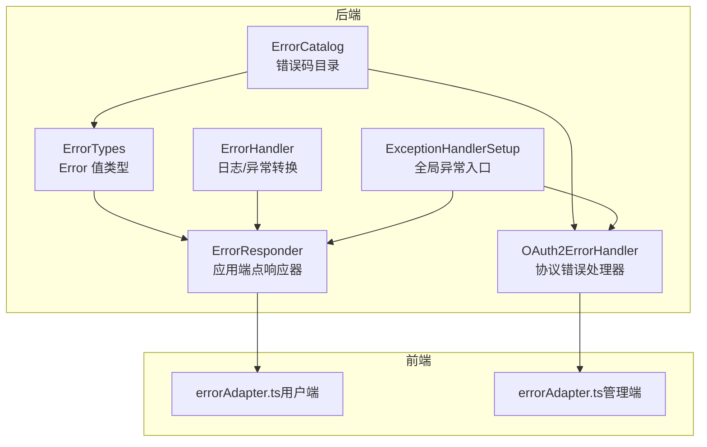
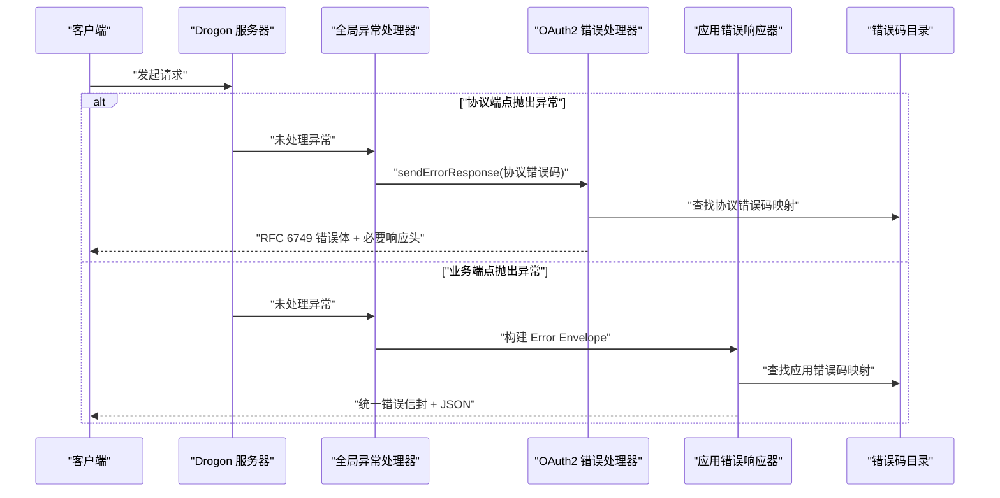
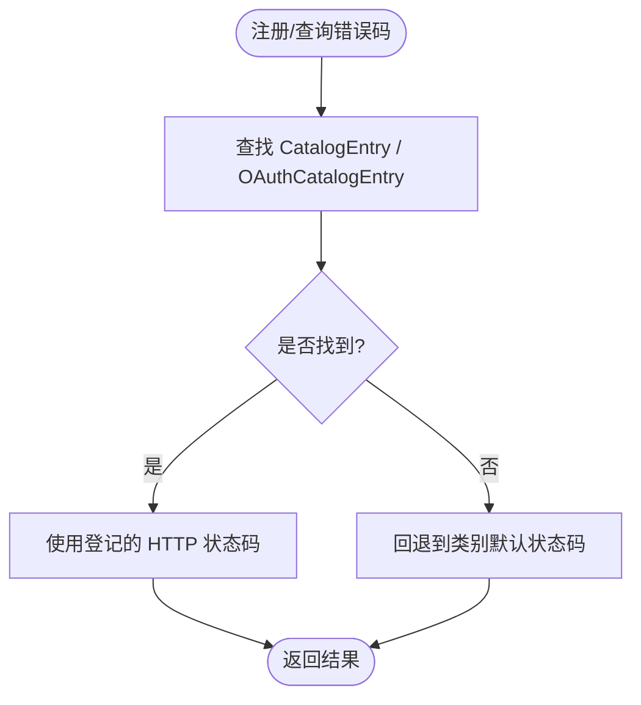
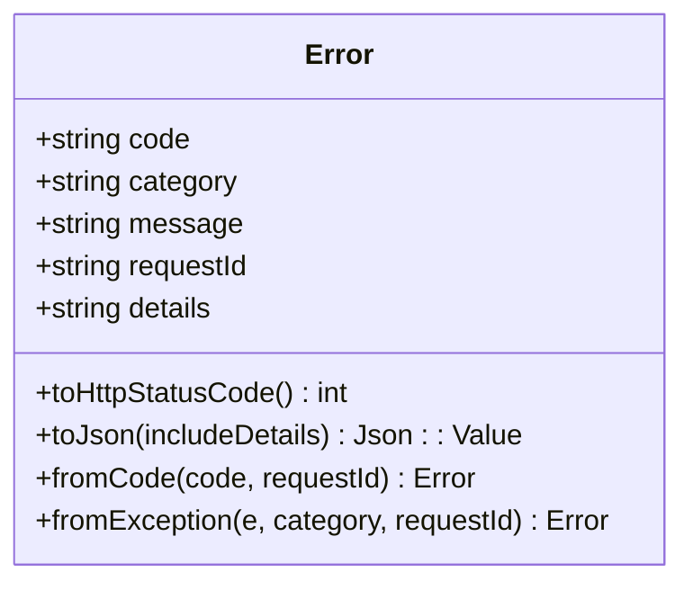
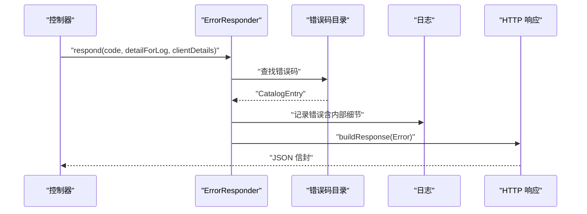
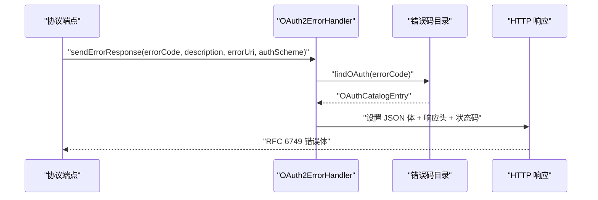
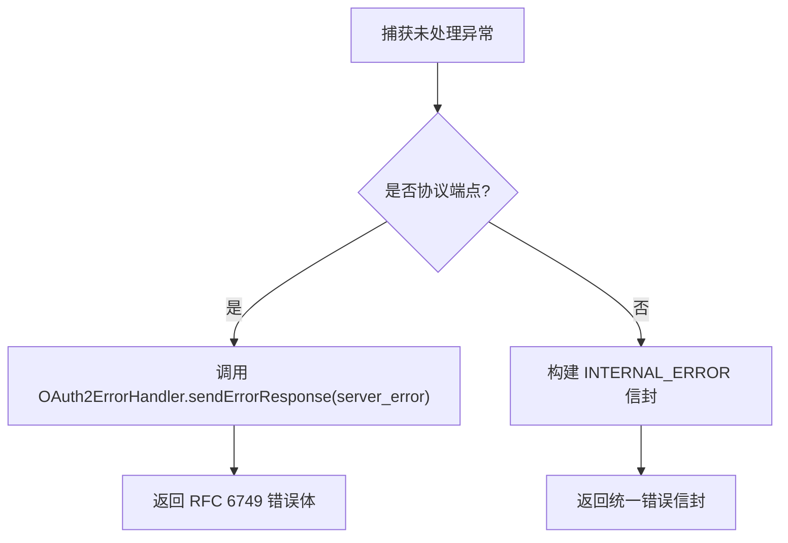
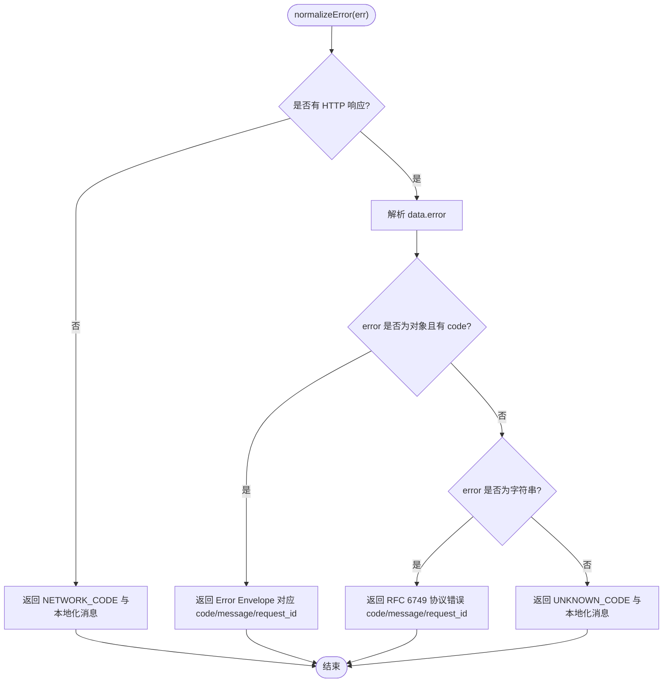
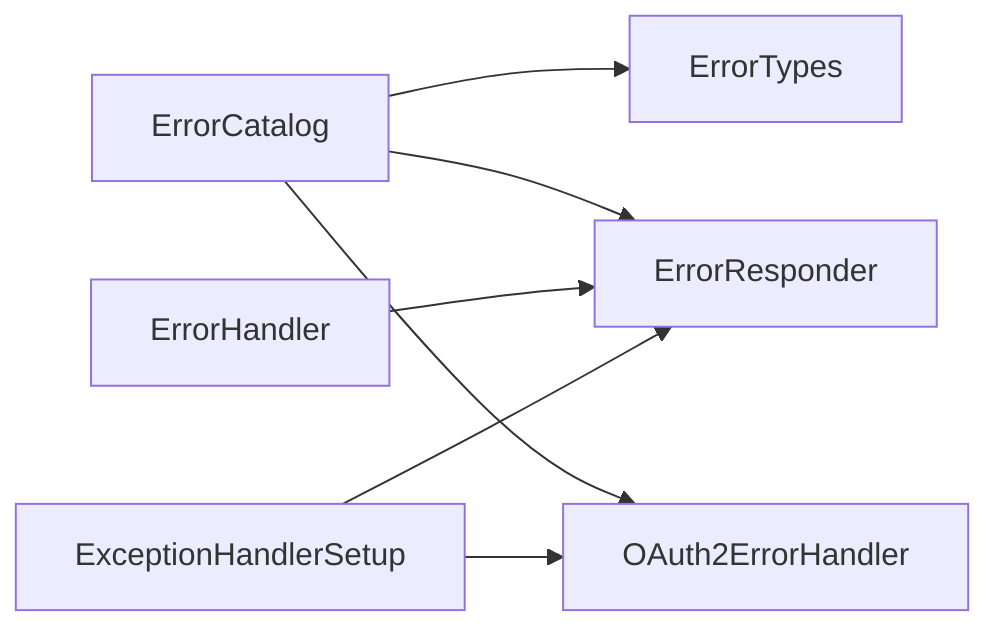

# 错误处理与状态码

<cite>
**本文引用的文件**
- [ErrorCatalog.cc](file://libs/common/src/error/ErrorCatalog.cc)
- [ErrorTypes.cc](file://libs/common/src/error/ErrorTypes.cc)
- [OAuth2ErrorHandler.cc](file://libs/drogon/src/error/OAuth2ErrorHandler.cc)
- [ErrorHandler.cc](file://libs/drogon/src/error/ErrorHandler.cc)
- [ErrorResponder.cc](file://libs/drogon/src/error/ErrorResponder.cc)
- [ExceptionHandlerSetup.cc](file://apps/server/src/bootstrap/ExceptionHandlerSetup.cc)
- [api-reference.md](file://docs/backend/api-reference.md)
- [errorAdapter.ts（用户端）](file://frontends/user/src/services/errorAdapter.ts)
- [errorAdapter.ts（管理端）](file://frontends/admin/src/services/errorAdapter.ts)
</cite>

## 目录
1. [简介](#简介)
2. [项目结构](#项目结构)
3. [核心组件](#核心组件)
4. [架构总览](#架构总览)
5. [详细组件分析](#详细组件分析)
6. [依赖关系分析](#依赖关系分析)
7. [性能考虑](#性能考虑)
8. [故障排查指南](#故障排查指南)
9. [结论](#结论)
10. [附录](#附录)

## 简介
本参考文档统一说明本项目的错误处理与 HTTP 状态码规范，覆盖 OAuth2 协议错误、业务逻辑错误与系统错误三类。文档包含：
- 统一的错误响应封套（Error Envelope）与 OAuth2 协议错误体格式
- 错误分类与错误码定义（含数值段与默认消息）
- HTTP 状态码映射规则与对照表
- 客户端错误处理指南、重试策略与监控建议
- 调试工具使用与错误追踪方法（Request_ID）

## 项目结构
后端错误处理由“领域层（common）+ 适配层（drogon）+ 启动装配（bootstrap）”三层组成；前端提供统一的错误适配器模块，负责解析后端返回并本地化展示。

图表来源
- [ErrorCatalog.cc:23-51](file://libs/common/src/error/ErrorCatalog.cc#L23-L51)
- [ErrorTypes.cc:79-148](file://libs/common/src/error/ErrorTypes.cc#L79-L148)
- [ErrorResponder.cc:53-181](file://libs/drogon/src/error/ErrorResponder.cc#L53-L181)
- [OAuth2ErrorHandler.cc:36-107](file://libs/drogon/src/error/OAuth2ErrorHandler.cc#L36-L107)
- [ErrorHandler.cc:16-95](file://libs/drogon/src/error/ErrorHandler.cc#L16-L95)
- [ExceptionHandlerSetup.cc:13-63](file://apps/server/src/bootstrap/ExceptionHandlerSetup.cc#L13-L63)

章节来源
- [ErrorCatalog.cc:23-51](file://libs/common/src/error/ErrorCatalog.cc#L23-L51)
- [ErrorTypes.cc:79-148](file://libs/common/src/error/ErrorTypes.cc#L79-L148)
- [ErrorResponder.cc:53-181](file://libs/drogon/src/error/ErrorResponder.cc#L53-L181)
- [OAuth2ErrorHandler.cc:36-107](file://libs/drogon/src/error/OAuth2ErrorHandler.cc#L36-L107)
- [ErrorHandler.cc:16-95](file://libs/drogon/src/error/ErrorHandler.cc#L16-L95)
- [ExceptionHandlerSetup.cc:13-63](file://apps/server/src/bootstrap/ExceptionHandlerSetup.cc#L13-L63)

## 核心组件
- 错误码目录（ErrorCatalog）：集中维护所有应用错误码与 OAuth2 协议错误码，以及对应的 HTTP 状态码、默认消息和描述。
- 错误值类型（ErrorTypes）：定义 Error 结构及其序列化、HTTP 状态码推导、从异常/代码构造等纯函数逻辑。
- 应用端点响应器（ErrorResponder）：为业务端点生成统一 Error Envelope 响应，控制 details 的可见性。
- OAuth2 协议错误处理器（OAuth2ErrorHandler）：为协议端点生成 RFC 6749 §5.2 兼容的错误体，并设置必要响应头。
- 全局异常处理器（ExceptionHandlerSetup）：捕获未处理异常，按路径区分协议端点或业务端点，分别输出协议错误或统一信封。
- 前端错误适配器（errorAdapter.ts）：统一解析 Error Envelope 与 OAuth2 协议错误，映射为本地化消息。

章节来源
- [ErrorCatalog.cc:217-333](file://libs/common/src/error/ErrorCatalog.cc#L217-L333)
- [ErrorTypes.cc:121-169](file://libs/common/src/error/ErrorTypes.cc#L121-L169)
- [ErrorResponder.cc:53-181](file://libs/drogon/src/error/ErrorResponder.cc#L53-L181)
- [OAuth2ErrorHandler.cc:36-107](file://libs/drogon/src/error/OAuth2ErrorHandler.cc#L36-L107)
- [ExceptionHandlerSetup.cc:13-63](file://apps/server/src/bootstrap/ExceptionHandlerSetup.cc#L13-L63)
- [errorAdapter.ts（用户端）:89-174](file://frontends/user/src/services/errorAdapter.ts#L89-L174)

## 架构总览
后端通过单一错误码目录驱动错误响应，确保协议端点与业务端点的错误格式、状态码一致且可测试。前端通过统一适配器将不同后端错误格式归一化为稳定结构，便于 UI 展示与 i18n。

图表来源
- [ExceptionHandlerSetup.cc:13-63](file://apps/server/src/bootstrap/ExceptionHandlerSetup.cc#L13-L63)
- [OAuth2ErrorHandler.cc:36-107](file://libs/drogon/src/error/OAuth2ErrorHandler.cc#L36-L107)
- [ErrorResponder.cc:53-181](file://libs/drogon/src/error/ErrorResponder.cc#L53-L181)
- [ErrorCatalog.cc:217-333](file://libs/common/src/error/ErrorCatalog.cc#L217-L333)

## 详细组件分析

### 错误码目录（ErrorCatalog）
- 职责：集中登记应用错误码与 OAuth2 协议错误码，提供 HTTP 状态码推导与校验。
- 关键行为：
  - 应用错误码按类别推导默认 HTTP 状态码，支持条目级覆盖（如资源不存在 404、冲突 409）。
  - OAuth2 协议错误码集合固定，严格限制 error 取值范围，并提供默认 error_description。
  - 提供验证函数保证目录完整性与一致性。

图表来源
- [ErrorCatalog.cc:23-51](file://libs/common/src/error/ErrorCatalog.cc#L23-L51)
- [ErrorCatalog.cc:217-333](file://libs/common/src/error/ErrorCatalog.cc#L217-L333)
- [ErrorCatalog.cc:384-512](file://libs/common/src/error/ErrorCatalog.cc#L384-L512)

章节来源
- [ErrorCatalog.cc:23-51](file://libs/common/src/error/ErrorCatalog.cc#L23-L51)
- [ErrorCatalog.cc:217-333](file://libs/common/src/error/ErrorCatalog.cc#L217-L333)
- [ErrorCatalog.cc:384-512](file://libs/common/src/error/ErrorCatalog.cc#L384-L512)

### 错误值类型（ErrorTypes）
- 职责：定义 Error 结构及序列化、HTTP 状态码推导、从代码/异常构造等纯函数逻辑。
- 关键点：
  - toHttpStatusCode() 优先使用目录登记的状态码，否则按类别回退。
  - toJson(includeDetails) 在启用详情时输出 details，生产模式隐藏敏感信息。
  - fromCode/fromException 提供稳定的错误构造方式，未知码回退到内部错误。

图表来源
- [ErrorTypes.cc:79-169](file://libs/common/src/error/ErrorTypes.cc#L79-L169)

章节来源
- [ErrorTypes.cc:79-169](file://libs/common/src/error/ErrorTypes.cc#L79-L169)

### 应用端点响应器（ErrorResponder）
- 职责：为业务端点生成统一 Error Envelope 响应，控制 details 的可见性，记录日志并注入 Request_ID。
- 关键点：
  - respond()/respondValidation()/respondException() 统一入口。
  - buildResponse() 根据 ErrorContext 决定是否包含 details，并设置 Content-Type 与状态码。
  - 对未注册错误码进行安全回退，避免泄露实现细节。

图表来源
- [ErrorResponder.cc:53-181](file://libs/drogon/src/error/ErrorResponder.cc#L53-L181)

章节来源
- [ErrorResponder.cc:53-181](file://libs/drogon/src/error/ErrorResponder.cc#L53-L181)

### OAuth2 协议错误处理器（OAuth2ErrorHandler）
- 职责：为协议端点生成 RFC 6749 §5.2 兼容的错误体，设置必要响应头与状态码。
- 关键点：
  - sendErrorResponse() 组装 error、error_description、error_uri，设置 Cache-Control/Pragma。
  - getHttpStatusCode() 以目录为准，未登记码回退 400。
  - invalid_client 且携带 Authorization 头时附加 WWW-Authenticate。

图表来源
- [OAuth2ErrorHandler.cc:36-107](file://libs/drogon/src/error/OAuth2ErrorHandler.cc#L36-L107)
- [ErrorCatalog.cc:217-333](file://libs/common/src/error/ErrorCatalog.cc#L217-L333)

章节来源
- [OAuth2ErrorHandler.cc:36-107](file://libs/drogon/src/error/OAuth2ErrorHandler.cc#L36-L107)
- [ErrorCatalog.cc:217-333](file://libs/common/src/error/ErrorCatalog.cc#L217-L333)

### 全局异常处理器（ExceptionHandlerSetup）
- 职责：捕获未处理异常，按路径区分协议端点或业务端点，分别输出协议错误或统一信封。
- 关键点：
  - 协议端点路径前缀匹配，输出 server_error 信封。
  - 其他路径输出 INTERNAL_ERROR 信封。
  - 保持 CORS 头注入。

图表来源
- [ExceptionHandlerSetup.cc:13-63](file://apps/server/src/bootstrap/ExceptionHandlerSetup.cc#L13-L63)

章节来源
- [ExceptionHandlerSetup.cc:13-63](file://apps/server/src/bootstrap/ExceptionHandlerSetup.cc#L13-L63)

### 前端错误适配器（errorAdapter.ts）
- 职责：统一解析后端 Error Envelope 与 OAuth2 协议错误，映射为本地化消息。
- 关键点：
  - normalizeError() 优先级：Error Envelope → RFC 6749 → 未知 → 网络失败。
  - 始终返回非空 message，永不抛出异常。
  - 提取 request_id 用于问题定位。

图表来源
- [errorAdapter.ts（用户端）:89-174](file://frontends/user/src/services/errorAdapter.ts#L89-L174)
- [errorAdapter.ts（管理端）:89-174](file://frontends/admin/src/services/errorAdapter.ts#L89-L174)

章节来源
- [errorAdapter.ts（用户端）:89-174](file://frontends/user/src/services/errorAdapter.ts#L89-L174)
- [errorAdapter.ts（管理端）:89-174](file://frontends/admin/src/services/errorAdapter.ts#L89-L174)

## 依赖关系分析
- 耦合与内聚：
  - ErrorCatalog 作为单一事实源，被 ErrorTypes、ErrorResponder、OAuth2ErrorHandler 共同依赖，提升内聚性。
  - ErrorResponder 与 OAuth2ErrorHandler 分别面向应用端点与协议端点，职责清晰。
  - ExceptionHandlerSetup 仅负责路由选择，不直接参与错误构造。
- 外部依赖：
  - Drogon 框架用于 HTTP 响应构建与状态码枚举。
  - JSON 库用于序列化错误体。
- 循环依赖：未发现明显循环依赖，分层清晰。

图表来源
- [ErrorCatalog.cc:217-333](file://libs/common/src/error/ErrorCatalog.cc#L217-L333)
- [ErrorTypes.cc:79-169](file://libs/common/src/error/ErrorTypes.cc#L79-L169)
- [ErrorResponder.cc:53-181](file://libs/drogon/src/error/ErrorResponder.cc#L53-L181)
- [OAuth2ErrorHandler.cc:36-107](file://libs/drogon/src/error/OAuth2ErrorHandler.cc#L36-L107)
- [ErrorHandler.cc:16-95](file://libs/drogon/src/error/ErrorHandler.cc#L16-L95)
- [ExceptionHandlerSetup.cc:13-63](file://apps/server/src/bootstrap/ExceptionHandlerSetup.cc#L13-L63)

章节来源
- [ErrorCatalog.cc:217-333](file://libs/common/src/error/ErrorCatalog.cc#L217-L333)
- [ErrorTypes.cc:79-169](file://libs/common/src/error/ErrorTypes.cc#L79-L169)
- [ErrorResponder.cc:53-181](file://libs/drogon/src/error/ErrorResponder.cc#L53-L181)
- [OAuth2ErrorHandler.cc:36-107](file://libs/drogon/src/error/OAuth2ErrorHandler.cc#L36-L107)
- [ErrorHandler.cc:16-95](file://libs/drogon/src/error/ErrorHandler.cc#L16-L95)
- [ExceptionHandlerSetup.cc:13-63](file://apps/server/src/bootstrap/ExceptionHandlerSetup.cc#L13-L63)

## 性能考虑
- 错误码查找为线性扫描，但目录规模小，开销可忽略。
- 生产模式隐藏 details，减少响应体大小与敏感信息暴露风险。
- 协议错误设置 no-store/no-cache，避免缓存导致的不一致。
- 建议在高频路径上复用 Request_ID 以减少重复生成成本。

## 故障排查指南
- 使用 Request_ID：
  - 后端在 Error Envelope 中返回 request_id，前端应保留并在反馈问题时附带。
  - 服务端日志统一打印 request_id，便于跨日志关联。
- 常见错误定位：
  - 协议端点错误：检查 OAuth2 错误码是否在目录中登记，确认状态码与默认描述一致。
  - 业务端点错误：检查 Error_Code 是否已注册，未注册会回退到 INTERNAL_ERROR。
  - 字段校验错误：查看 details（非生产环境）中的字段名与原因。
- 调试工具：
  - 使用 Swagger/OpenAPI 文档验证接口契约与示例。
  - 通过浏览器开发者工具查看响应头（Content-Type、Cache-Control、WWW-Authenticate）。
  - 结合日志系统搜索 request_id 快速定位问题链路。

章节来源
- [ErrorHandler.cc:16-95](file://libs/drogon/src/error/ErrorHandler.cc#L16-L95)
- [ErrorResponder.cc:53-181](file://libs/drogon/src/error/ErrorResponder.cc#L53-L181)
- [OAuth2ErrorHandler.cc:36-107](file://libs/drogon/src/error/OAuth2ErrorHandler.cc#L36-L107)
- [errorAdapter.ts（用户端）:89-174](file://frontends/user/src/services/errorAdapter.ts#L89-L174)

## 结论
本项目通过单一错误码目录与统一响应器，实现了协议端点与业务端点的错误处理规范化。前端通过统一适配器将不同后端错误格式归一化，提升了用户体验与可维护性。遵循本文档的规范与最佳实践，可有效降低错误处理的复杂度，提高系统的可观测性与稳定性。

## 附录

### HTTP 状态码速查
- 200 OK：请求成功
- 302 Found：重定向（如 OAuth2 授权跳转）
- 400 Bad Request：参数错误（如 invalid_grant、unauthorized_client）
- 401 Unauthorized：令牌无效或过期（如 invalid_client）
- 403 Forbidden：权限不足（如 access_denied）
- 429 Too Many Requests：触发限流
- 500 Internal Server Error：服务器内部错误

章节来源
- [api-reference.md:270-281](file://docs/backend/api-reference.md#L270-L281)

### 应用错误码与 HTTP 状态码对照表
- NET_CONNECTION_FAILED（1001）→ 502
- NET_TIMEOUT（1002）→ 504
- DB_CONNECTION_ERROR（2001）→ 500
- DB_QUERY_ERROR（2002）→ 500
- DB_CONSTRAINT_VIOLATION（2003）→ 500
- VALIDATION_INVALID_INPUT（3001）→ 400
- VALIDATION_MISSING_REQUIRED_FIELD（3002）→ 400
- VALIDATION_FORMAT_ERROR（3003）→ 400
- VALIDATION_RESOURCE_NOT_FOUND（3004）→ 404
- VALIDATION_RESOURCE_CONFLICT（3005）→ 409
- AUTH_INVALID_CREDENTIALS（4001）→ 401
- AUTH_TOKEN_EXPIRED（4002）→ 401
- AUTH_TOKEN_INVALID（4003）→ 401
- AUTH_MFA_CODE_INVALID（4004）→ 401
- AUTH_MFA_NOT_CONFIGURED（4005）→ 401
- AUTHZ_ACCESS_DENIED（5001）→ 403
- AUTHZ_INSUFFICIENT_PERMISSIONS（5002）→ 403
- INTERNAL_ERROR（6001）→ 500

章节来源
- [api-reference.md:240-249](file://docs/backend/api-reference.md#L240-L249)
- [ErrorCatalog.cc:70-213](file://libs/common/src/error/ErrorCatalog.cc#L70-L213)

### OAuth2 协议错误码与 HTTP 状态码对照表
- invalid_request → 400
- invalid_client → 401
- invalid_grant → 400
- unauthorized_client → 400
- unsupported_grant_type → 400
- invalid_scope → 400
- server_error → 500
- temporarily_unavailable → 503
- access_denied → 403
- unsupported_token_type → 400
- authorization_pending → 400
- slow_down → 400
- expired_token → 400

章节来源
- [api-reference.md:250-269](file://docs/backend/api-reference.md#L250-L269)
- [ErrorCatalog.cc:217-236](file://libs/common/src/error/ErrorCatalog.cc#L217-L236)

### 客户端错误处理指南
- 解析优先级：
  1. Error Envelope：取 error.code 与 error.request_id
  2. RFC 6749：取顶层 error 字符串
  3. 其他：视为未知错误
  4. 无响应：视为网络错误
- 本地化展示：
  - 使用前端错误消息目录将错误码映射为用户可读信息
  - 默认语言为 zh-CN，支持切换
- 会话过期处理：
  - 401 且刷新失败时，统一返回 AUTH_TOKEN_EXPIRED 并提示登录已过期

章节来源
- [errorAdapter.ts（用户端）:89-174](file://frontends/user/src/services/errorAdapter.ts#L89-L174)
- [errorAdapter.ts（管理端）:89-174](file://frontends/admin/src/services/errorAdapter.ts#L89-L174)

### 重试机制建议
- 幂等请求（GET、HEAD、OPTIONS）：
  - 429：指数退避重试，最多 3 次
  - 503：短暂不可用，延迟后重试
- 非幂等请求（POST、PUT、DELETE）：
  - 谨慎重试，仅在明确可重试状态码下执行
  - 结合业务语义判断是否允许重试
- 网络错误：
  - 无响应或超时：重试一次，失败后提示用户

### 错误监控与追踪
- 采集指标：
  - 各错误码出现频率、P95/P99 延迟
  - 协议错误与应用错误的比例
- 日志关联：
  - 使用 request_id 关联请求全链路日志
  - 记录错误上下文（模块、参数摘要、堆栈摘要）
- 告警策略：
  - 内部错误率突增告警
  - 协议错误占比异常告警