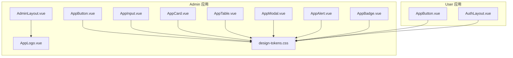
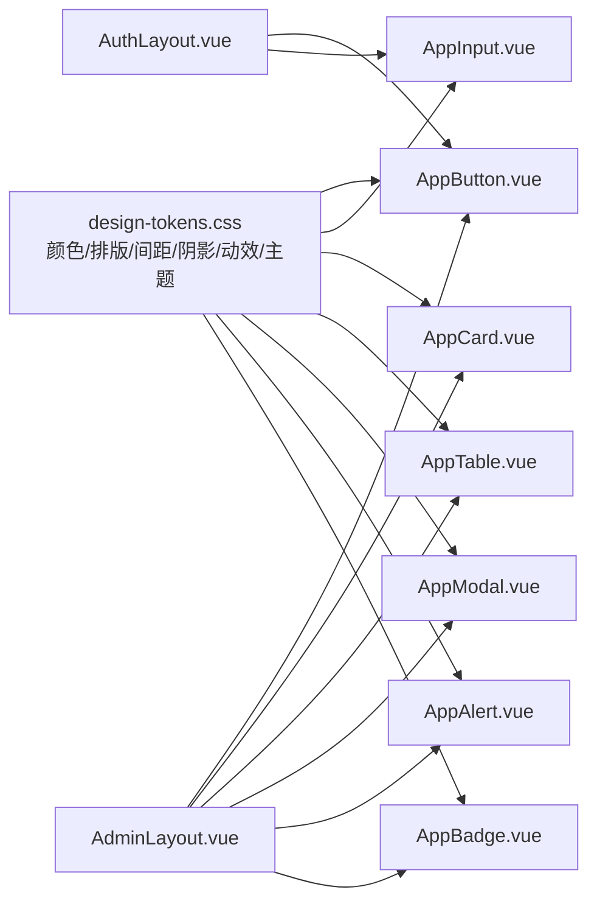
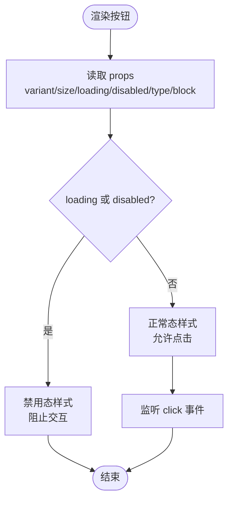
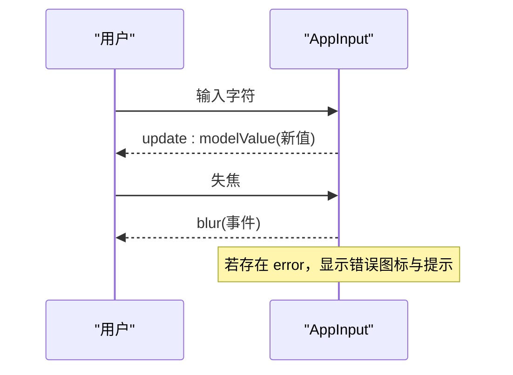
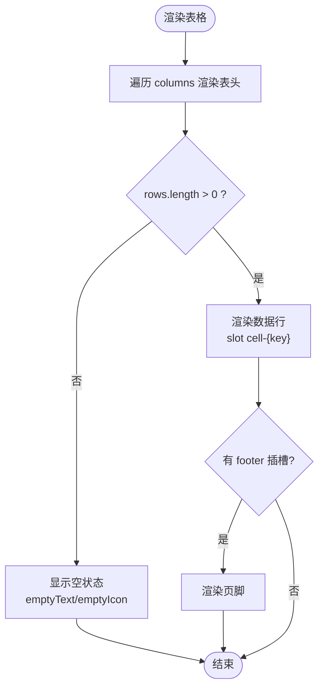
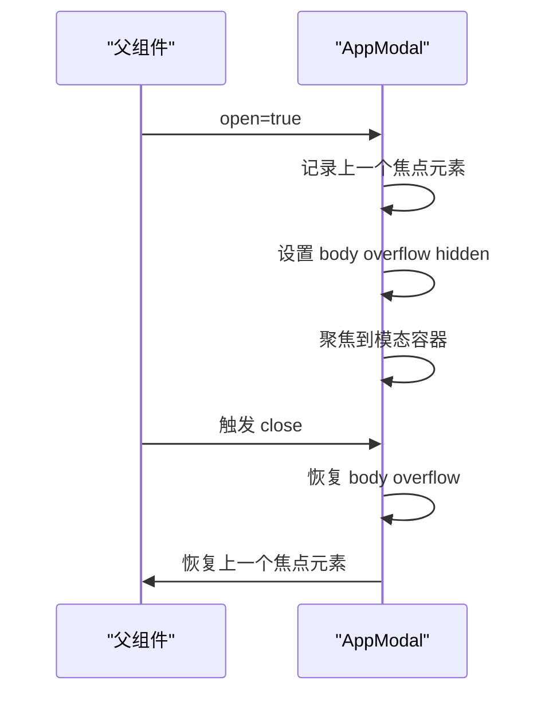
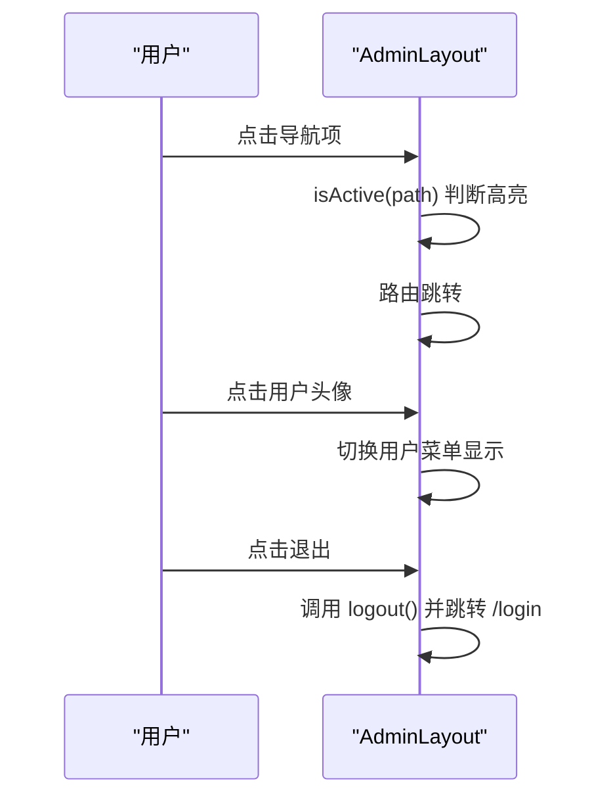
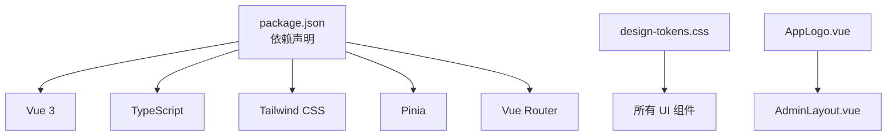

# UI组件库

<cite>
**本文引用的文件**
- [frontends/admin/src/components/ui/AppButton.vue](file://frontends/admin/src/components/ui/AppButton.vue)
- [frontends/admin/src/components/ui/AppInput.vue](file://frontends/admin/src/components/ui/AppInput.vue)
- [frontends/admin/src/components/ui/AppCard.vue](file://frontends/admin/src/components/ui/AppCard.vue)
- [frontends/admin/src/components/ui/AppTable.vue](file://frontends/admin/src/components/ui/AppTable.vue)
- [frontends/admin/src/components/ui/AppModal.vue](file://frontends/admin/src/components/ui/AppModal.vue)
- [frontends/admin/src/components/ui/AppAlert.vue](file://frontends/admin/src/components/ui/AppAlert.vue)
- [frontends/admin/src/components/ui/AppBadge.vue](file://frontends/admin/src/components/ui/AppBadge.vue)
- [frontends/admin/src/components/layout/AdminLayout.vue](file://frontends/admin/src/components/layout/AdminLayout.vue)
- [frontends/user/src/layouts/AuthLayout.vue](file://frontends/user/src/layouts/AuthLayout.vue)
- [frontends/admin/src/styles/design-tokens.css](file://frontends/admin/src/styles/design-tokens.css)
- [frontends/admin/src/components/shared/AppLogo.vue](file://frontends/admin/src/components/shared/AppLogo.vue)
- [frontends/user/src/components/ui/AppButton.vue](file://frontends/user/src/components/ui/AppButton.vue)
- [frontends/admin/package.json](file://frontends/admin/package.json)
</cite>

## 目录
1. [简介](#简介)
2. [项目结构](#项目结构)
3. [核心组件](#核心组件)
4. [架构总览](#架构总览)
5. [详细组件分析](#详细组件分析)
6. [依赖关系分析](#依赖关系分析)
7. [性能与可访问性](#性能与可访问性)
8. [主题与样式定制](#主题与样式定制)
9. [使用示例与最佳实践](#使用示例与最佳实践)
10. [测试策略](#测试策略)
11. [文档生成与维护规范](#文档生成与维护规范)
12. [结论](#结论)

## 简介
本文件为 AuthForge 前端 UI 组件库的权威文档，覆盖基础组件（按钮、输入框、卡片、表格、模态框、警报、徽章）、布局组件（管理后台 AdminLayout、认证 AuthLayout）以及共享组件复用策略。文档从设计理念、属性接口、事件处理、插槽使用、样式定制、响应式与可访问性支持、主题能力、测试策略、文档维护等方面进行全面说明，帮助开发者快速理解并高效使用组件库。

## 项目结构
前端采用 Vue 3 + TypeScript + Tailwind CSS 技术栈，按应用划分：
- admin：管理后台应用，包含完整的 UI 组件与布局
- user：用户端应用，包含认证相关页面与部分 UI 组件

UI 组件统一位于各应用的 src/components/ui 目录下；布局位于 layout 或 layouts 目录；共享组件位于 shared 目录；设计令牌集中定义在 styles/design-tokens.css。

图表来源
- [frontends/admin/src/components/ui/AppButton.vue:1-60](file://frontends/admin/src/components/ui/AppButton.vue#L1-L60)
- [frontends/admin/src/components/ui/AppInput.vue:1-81](file://frontends/admin/src/components/ui/AppInput.vue#L1-L81)
- [frontends/admin/src/components/ui/AppCard.vue:1-25](file://frontends/admin/src/components/ui/AppCard.vue#L1-L25)
- [frontends/admin/src/components/ui/AppTable.vue:1-101](file://frontends/admin/src/components/ui/AppTable.vue#L1-L101)
- [frontends/admin/src/components/ui/AppModal.vue:1-128](file://frontends/admin/src/components/ui/AppModal.vue#L1-L128)
- [frontends/admin/src/components/ui/AppAlert.vue:1-73](file://frontends/admin/src/components/ui/AppAlert.vue#L1-L73)
- [frontends/admin/src/components/ui/AppBadge.vue:1-28](file://frontends/admin/src/components/ui/AppBadge.vue#L1-L28)
- [frontends/admin/src/components/layout/AdminLayout.vue:1-332](file://frontends/admin/src/components/layout/AdminLayout.vue#L1-L332)
- [frontends/user/src/layouts/AuthLayout.vue:1-81](file://frontends/user/src/layouts/AuthLayout.vue#L1-L81)
- [frontends/admin/src/styles/design-tokens.css:1-371](file://frontends/admin/src/styles/design-tokens.css#L1-L371)
- [frontends/admin/src/components/shared/AppLogo.vue:1-47](file://frontends/admin/src/components/shared/AppLogo.vue#L1-L47)
- [frontends/user/src/components/ui/AppButton.vue:1-56](file://frontends/user/src/components/ui/AppButton.vue#L1-L56)

章节来源
- [frontends/admin/package.json:1-35](file://frontends/admin/package.json#L1-L35)

## 核心组件
本节概述各基础组件的职责与设计要点，后续章节将展开属性、事件、插槽与样式细节。

- AppButton：提供多种变体、尺寸、加载状态与块级模式，支持键盘聚焦与无障碍提示。
- AppInput：受控输入，支持标签、占位符、错误/提示文案、必填标记、禁用/只读、自动完成等。
- AppCard：容器化内容区块，支持内边距与悬停效果，提供头部插槽。
- AppTable：数据展示表格，支持列配置、排序触发、空状态、骨架屏、自定义单元格插槽与页脚插槽。
- AppModal：对话框，支持尺寸、标题、ESC关闭、点击遮罩关闭、焦点陷阱与过渡动画。
- AppAlert：信息提示，支持类型、标题、可关闭与图标。
- AppBadge：轻量状态标识，支持变体与尺寸。

章节来源
- [frontends/admin/src/components/ui/AppButton.vue:1-60](file://frontends/admin/src/components/ui/AppButton.vue#L1-L60)
- [frontends/admin/src/components/ui/AppInput.vue:1-81](file://frontends/admin/src/components/ui/AppInput.vue#L1-L81)
- [frontends/admin/src/components/ui/AppCard.vue:1-25](file://frontends/admin/src/components/ui/AppCard.vue#L1-L25)
- [frontends/admin/src/components/ui/AppTable.vue:1-101](file://frontends/admin/src/components/ui/AppTable.vue#L1-L101)
- [frontends/admin/src/components/ui/AppModal.vue:1-128](file://frontends/admin/src/components/ui/AppModal.vue#L1-L128)
- [frontends/admin/src/components/ui/AppAlert.vue:1-73](file://frontends/admin/src/components/ui/AppAlert.vue#L1-L73)
- [frontends/admin/src/components/ui/AppBadge.vue:1-28](file://frontends/admin/src/components/ui/AppBadge.vue#L1-L28)

## 架构总览
组件库以“原子化基础组件 + 组合型布局”的方式组织。所有基础组件通过 Tailwind 类名与全局设计令牌（CSS 变量）实现一致的视觉语言；布局组件负责页面级结构与导航交互；共享组件用于跨页面复用品牌元素。

图表来源
- [frontends/admin/src/styles/design-tokens.css:1-371](file://frontends/admin/src/styles/design-tokens.css#L1-L371)
- [frontends/admin/src/components/layout/AdminLayout.vue:1-332](file://frontends/admin/src/components/layout/AdminLayout.vue#L1-L332)
- [frontends/user/src/layouts/AuthLayout.vue:1-81](file://frontends/user/src/layouts/AuthLayout.vue#L1-L81)
- [frontends/admin/src/components/ui/AppButton.vue:1-60](file://frontends/admin/src/components/ui/AppButton.vue#L1-L60)
- [frontends/admin/src/components/ui/AppInput.vue:1-81](file://frontends/admin/src/components/ui/AppInput.vue#L1-L81)
- [frontends/admin/src/components/ui/AppCard.vue:1-25](file://frontends/admin/src/components/ui/AppCard.vue#L1-L25)
- [frontends/admin/src/components/ui/AppTable.vue:1-101](file://frontends/admin/src/components/ui/AppTable.vue#L1-L101)
- [frontends/admin/src/components/ui/AppModal.vue:1-128](file://frontends/admin/src/components/ui/AppModal.vue#L1-L128)
- [frontends/admin/src/components/ui/AppAlert.vue:1-73](file://frontends/admin/src/components/ui/AppAlert.vue#L1-L73)
- [frontends/admin/src/components/ui/AppBadge.vue:1-28](file://frontends/admin/src/components/ui/AppBadge.vue#L1-L28)

## 详细组件分析

### 按钮 AppButton
- 属性接口
  - variant：primary | secondary | danger | ghost
  - size：sm | md | lg
  - loading：boolean
  - disabled：boolean
  - type：button | submit | reset
  - block：boolean
- 事件
  - click：透传原生 MouseEvent
- 插槽
  - 默认插槽：按钮内容（文本、图标等）
- 样式与可访问性
  - 基于 Tailwind 类名控制尺寸、变体、禁用态与聚焦环
  - 加载时显示旋转图标，aria-hidden 避免屏幕阅读器重复朗读
  - 支持 focus-visible 聚焦样式
- 响应式
  - 通过 size 与 block 适配不同场景

图表来源
- [frontends/admin/src/components/ui/AppButton.vue:1-60](file://frontends/admin/src/components/ui/AppButton.vue#L1-L60)

章节来源
- [frontends/admin/src/components/ui/AppButton.vue:1-60](file://frontends/admin/src/components/ui/AppButton.vue#L1-L60)
- [frontends/user/src/components/ui/AppButton.vue:1-56](file://frontends/user/src/components/ui/AppButton.vue#L1-L56)

### 输入框 AppInput
- 属性接口
  - modelValue：string（双向绑定 v-model）
  - label：string
  - type：string（input 类型）
  - placeholder：string
  - error：string（错误消息）
  - hint：string（辅助提示）
  - required：boolean
  - disabled：boolean
  - readonly：boolean
  - autocomplete：string
  - inputmode：string
  - maxlength：number
- 事件
  - update:modelValue：值变更
  - blur：失焦事件
- 插槽
  - 无显式插槽，但可通过外层包裹扩展
- 样式与可访问性
  - 错误态边框与聚焦环变化
  - 使用 aria-invalid 与 aria-describedby 关联错误信息
  - 必填星号与 sr-only 文本提升可访问性
- 响应式
  - 根据 error/hint 动态切换样式与提示区域

图表来源
- [frontends/admin/src/components/ui/AppInput.vue:1-81](file://frontends/admin/src/components/ui/AppInput.vue#L1-L81)

章节来源
- [frontends/admin/src/components/ui/AppInput.vue:1-81](file://frontends/admin/src/components/ui/AppInput.vue#L1-L81)

### 卡片 AppCard
- 属性接口
  - padding：none | sm | md | lg
  - hover：boolean
- 插槽
  - header：可选头部区域
  - 默认插槽：主体内容
- 样式与可访问性
  - 圆角、边框、阴影与悬停效果
  - 通过 padding 控制内边距

章节来源
- [frontends/admin/src/components/ui/AppCard.vue:1-25](file://frontends/admin/src/components/ui/AppCard.vue#L1-L25)

### 表格 AppTable
- 属性接口
  - columns：列定义数组（key、label、sortable、align、width）
  - rows：数据行数组
  - rowKey：唯一键字段名
  - loading：boolean
  - emptyText：空状态文案
  - emptyIcon：是否显示空图标
- 事件
  - sort：当可排序列被点击时触发，参数为列 key
- 插槽
  - cell-{col.key}：自定义单元格渲染，传入 row、value、index
  - footer：页脚区域
- 样式与可访问性
  - 表头与数据行分隔清晰，支持对齐方式
  - 空状态与骨架屏提升加载体验
- 响应式
  - 横向滚动容器保证小屏可用

图表来源
- [frontends/admin/src/components/ui/AppTable.vue:1-101](file://frontends/admin/src/components/ui/AppTable.vue#L1-L101)

章节来源
- [frontends/admin/src/components/ui/AppTable.vue:1-101](file://frontends/admin/src/components/ui/AppTable.vue#L1-L101)

### 模态框 AppModal
- 属性接口
  - open：boolean（控制显示）
  - title：string（标题）
  - size：sm | md | lg
- 事件
  - close：关闭事件
- 插槽
  - header：自定义头部
  - footer：自定义底部
  - 默认插槽：主体内容
- 行为与可访问性
  - ESC 关闭、点击遮罩关闭
  - 焦点陷阱：Tab 在模态内循环
  - 打开时记录上一个焦点元素，关闭后恢复
  - 使用 role="dialog"、aria-modal、aria-label 提升可访问性
- 样式与动画
  - 背景模糊遮罩、圆角、阴影与过渡动画

图表来源
- [frontends/admin/src/components/ui/AppModal.vue:1-128](file://frontends/admin/src/components/ui/AppModal.vue#L1-L128)

章节来源
- [frontends/admin/src/components/ui/AppModal.vue:1-128](file://frontends/admin/src/components/ui/AppModal.vue#L1-L128)

### 警报 AppAlert
- 属性接口
  - type：info | success | warning | error
  - title：string
  - dismissible：boolean
- 事件
  - dismiss：关闭事件
- 插槽
  - 默认插槽：正文内容
- 样式与可访问性
  - 根据 type 显示对应图标与配色
  - role="alert" 与可关闭按钮提升可访问性

章节来源
- [frontends/admin/src/components/ui/AppAlert.vue:1-73](file://frontends/admin/src/components/ui/AppAlert.vue#L1-L73)

### 徽章 AppBadge
- 属性接口
  - variant：default | success | warning | error | info
  - size：sm | md
- 插槽
  - 默认插槽：文本或图标
- 样式
  - 圆角胶囊样式，语义化配色

章节来源
- [frontends/admin/src/components/ui/AppBadge.vue:1-28](file://frontends/admin/src/components/ui/AppBadge.vue#L1-L28)

### 布局组件

#### 管理后台布局 AdminLayout
- 功能
  - 侧边栏导航（分组、图标、当前路由高亮）
  - 面包屑导航（基于路由路径计算）
  - 顶部用户菜单（设置、退出登录）
  - 移动端抽屉菜单与遮罩
  - 响应式折叠侧边栏
- 交互
  - 路由变化时关闭用户菜单与移动端菜单
  - 登出调用 auth store 并跳转登录页
- 样式
  - 使用设计令牌与 Tailwind 构建一致风格

图表来源
- [frontends/admin/src/components/layout/AdminLayout.vue:1-332](file://frontends/admin/src/components/layout/AdminLayout.vue#L1-L332)

章节来源
- [frontends/admin/src/components/layout/AdminLayout.vue:1-332](file://frontends/admin/src/components/layout/AdminLayout.vue#L1-L332)

#### 认证布局 AuthLayout
- 功能
  - 左侧品牌展示区（装饰图案、标语、特性列表）
  - 右侧表单内容区（通过插槽注入页面内容）
  - 移动端隐藏左侧面板，仅保留 Logo 与表单
- 样式
  - 渐变背景与装饰 SVG，强调安全与专业感

章节来源
- [frontends/user/src/layouts/AuthLayout.vue:1-81](file://frontends/user/src/layouts/AuthLayout.vue#L1-L81)

### 共享组件
- AppLogo：品牌标志，支持尺寸与单色模式，用于侧边栏与认证页。

章节来源
- [frontends/admin/src/components/shared/AppLogo.vue:1-47](file://frontends/admin/src/components/shared/AppLogo.vue#L1-L47)

## 依赖关系分析
- 组件对设计令牌的依赖：所有 UI 组件通过 Tailwind 类名与 CSS 变量（颜色、字体、间距、阴影、动效、主题）保持一致的视觉表现。
- 布局对共享组件的依赖：AdminLayout 依赖 AppLogo 作为品牌标识。
- 工具与框架依赖：Vue 3、TypeScript、Tailwind CSS、Pinia（状态管理）、Vue Router（路由）。

图表来源
- [frontends/admin/package.json:1-35](file://frontends/admin/package.json#L1-L35)
- [frontends/admin/src/styles/design-tokens.css:1-371](file://frontends/admin/src/styles/design-tokens.css#L1-L371)
- [frontends/admin/src/components/shared/AppLogo.vue:1-47](file://frontends/admin/src/components/shared/AppLogo.vue#L1-L47)
- [frontends/admin/src/components/layout/AdminLayout.vue:1-332](file://frontends/admin/src/components/layout/AdminLayout.vue#L1-L332)

章节来源
- [frontends/admin/package.json:1-35](file://frontends/admin/package.json#L1-L35)

## 性能与可访问性
- 性能
  - 表格支持骨架屏与空状态，减少无效渲染
  - 模态框使用 Teleport 与 Transition 优化 DOM 与动画
  - 按钮与输入框避免不必要的重绘，使用条件渲染与 class 拼接
- 可访问性
  - 按钮与输入框支持键盘操作与聚焦环
  - 输入框使用 aria-invalid 与 aria-describedby 关联错误信息
  - 模态框使用 role="dialog"、aria-modal、焦点陷阱与 ESC 关闭
  - 警报使用 role="alert" 与可关闭按钮
  - 设计令牌中定义了 focus ring、目标尺寸最小值与减少动效媒体查询

章节来源
- [frontends/admin/src/components/ui/AppInput.vue:1-81](file://frontends/admin/src/components/ui/AppInput.vue#L1-L81)
- [frontends/admin/src/components/ui/AppModal.vue:1-128](file://frontends/admin/src/components/ui/AppModal.vue#L1-L128)
- [frontends/admin/src/components/ui/AppAlert.vue:1-73](file://frontends/admin/src/components/ui/AppAlert.vue#L1-L73)
- [frontends/admin/src/styles/design-tokens.css:1-371](file://frontends/admin/src/styles/design-tokens.css#L1-L371)

## 主题与样式定制
- 设计令牌体系
  - 原语颜色（OKLCH 色彩空间），语义化颜色抽象，便于暗色主题切换
  - 排版、间距、圆角、阴影、动效、层级 z-index、布局尺寸等统一令牌
  - 暗色主题通过 data-theme="dark" 覆盖语义令牌
- 组件样式
  - 基于 Tailwind 类名与 CSS 变量组合，确保一致性
  - 组件内部不硬编码颜色，优先使用设计令牌对应的类名
- 定制建议
  - 通过覆盖 CSS 变量或 Tailwind 配置进行主题扩展
  - 新增语义颜色时，保持明度对比与可访问性要求

章节来源
- [frontends/admin/src/styles/design-tokens.css:1-371](file://frontends/admin/src/styles/design-tokens.css#L1-L371)

## 使用示例与最佳实践
- 按钮
  - 使用 variant 表达语义（主操作、次要、危险、幽灵）
  - 使用 size 控制视觉权重，block 用于全宽场景
  - 异步操作时使用 loading 禁用交互并显示加载指示
- 输入框
  - 使用 v-model 进行双向绑定
  - 使用 error 与 hint 提供即时反馈
  - 必填字段配合 required 与视觉星号
- 表格
  - 使用 columns 描述数据结构与展示规则
  - 使用 slot cell-{key} 自定义复杂单元格（如链接、操作按钮）
  - 大数据量时结合分页与懒加载
- 模态框
  - 使用 open 控制显隐，close 事件处理业务逻辑
  - 使用 header/footer 插槽组织操作按钮与信息
  - 注意焦点管理与 ESC 关闭
- 布局
  - AdminLayout 用于管理后台，AuthLayout 用于认证流程
  - 通过路由与面包屑提升导航清晰度
- 共享组件
  - AppLogo 统一品牌呈现，避免分散样式

[本节为概念性指导，不直接分析具体文件]

## 测试策略
- E2E 测试
  - 使用 Playwright 进行端到端测试，覆盖导航、认证、权限、错误处理、UX 等场景
  - 测试用例位于各应用的 tests/e2e 目录
- 单元测试
  - 使用 Vitest 进行单元与属性测试，验证组件行为与边界条件
- 组件测试建议
  - 针对按钮：点击、禁用、加载态、键盘交互
  - 针对输入框：v-model 同步、错误态、必填校验、失焦事件
  - 针对表格：排序事件、空状态、自定义单元格渲染
  - 针对模态框：打开/关闭、焦点陷阱、ESC 关闭、遮罩点击
  - 针对警报：类型切换、可关闭、屏幕阅读器提示
  - 针对布局：路由高亮、用户菜单、移动端菜单

章节来源
- [frontends/admin/package.json:1-35](file://frontends/admin/package.json#L1-L35)

## 文档生成与维护规范
- 文档生成
  - 建议在组件源码中添加 JSDoc/TSDoc 注释，便于自动生成 API 文档
  - 使用 Storybook 或类似工具搭建可视化文档站点，展示组件用法与示例
- 维护规范
  - 组件命名：统一以 App 前缀（如 AppButton、AppInput）
  - 属性与事件：遵循 Vue 3 Composition API 的 defineProps/defineEmits
  - 样式：优先使用 Tailwind 类名与设计令牌，避免内联样式
  - 可访问性：确保键盘可达、语义化标签、Aria 属性完整
  - 版本管理：通过 package.json 与 Git 标签管理组件版本
  - 代码质量：使用 TypeScript 严格模式与 ESLint/Prettier 统一风格

[本节为通用实践指导，不直接分析具体文件]

## 结论
AuthForge 前端 UI 组件库以设计令牌为核心，结合 Vue 3 与 Tailwind CSS，提供了高质量、可访问、易定制的 UI 组件与布局方案。通过统一的属性接口、事件模型与插槽机制，组件具备良好的可扩展性与复用性。配合完善的测试策略与维护规范，能够支撑管理后台与用户端的多场景需求。