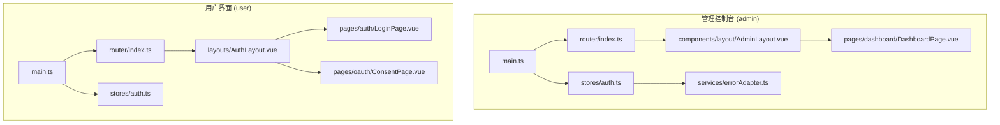
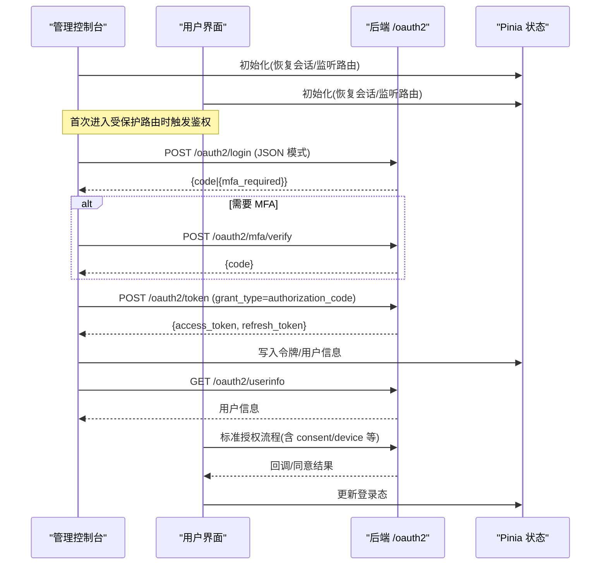
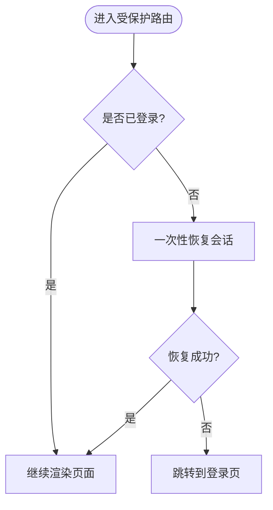
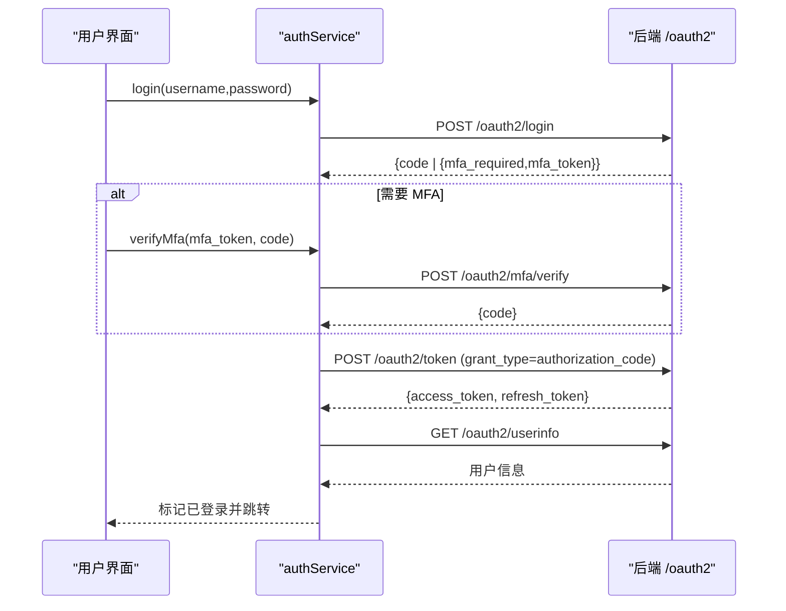
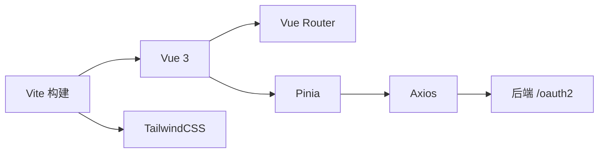

# 前端应用

<cite>
**本文引用的文件**
- [frontends/admin/package.json](file://frontends/admin/package.json)
- [frontends/user/package.json](file://frontends/user/package.json)
- [frontends/admin/src/main.ts](file://frontends/admin/src/main.ts)
- [frontends/user/src/main.ts](file://frontends/user/src/main.ts)
- [frontends/admin/vite.config.ts](file://frontends/admin/vite.config.ts)
- [frontends/user/vite.config.ts](file://frontends/user/vite.config.ts)
- [frontends/admin/src/router/index.ts](file://frontends/admin/src/router/index.ts)
- [frontends/user/src/router/index.ts](file://frontends/user/src/router/index.ts)
- [frontends/admin/src/stores/auth.ts](file://frontends/admin/src/stores/auth.ts)
- [frontends/user/src/stores/auth.ts](file://frontends/user/src/stores/auth.ts)
- [frontends/admin/src/App.vue](file://frontends/admin/src/App.vue)
- [frontends/user/src/App.vue](file://frontends/user/src/App.vue)
- [frontends/admin/src/components/layout/AdminLayout.vue](file://frontends/admin/src/components/layout/AdminLayout.vue)
- [frontends/user/src/layouts/AuthLayout.vue](file://frontends/user/src/layouts/AuthLayout.vue)
- [frontends/admin/src/pages/dashboard/DashboardPage.vue](file://frontends/admin/src/pages/dashboard/DashboardPage.vue)
- [frontends/user/src/pages/auth/LoginPage.vue](file://frontends/user/src/pages/auth/LoginPage.vue)
- [frontends/user/src/pages/oauth/ConsentPage.vue](file://frontends/user/src/pages/oauth/ConsentPage.vue)
- [frontends/admin/src/services/errorAdapter.ts](file://frontends/admin/src/services/errorAdapter.ts)
</cite>

## 目录
1. [简介](#简介)
2. [项目结构](#项目结构)
3. [核心组件](#核心组件)
4. [架构总览](#架构总览)
5. [详细组件分析](#详细组件分析)
6. [依赖关系分析](#依赖关系分析)
7. [性能考虑](#性能考虑)
8. [故障排查指南](#故障排查指南)
9. [结论](#结论)
10. [附录](#附录)

## 简介
本文件为 AuthForge 前端应用的完整技术文档，覆盖管理控制台（frontends/admin）与用户界面（frontends/user）的功能、实现与开发指南。重点包括：
- 管理控制台模块结构与页面：仪表板、应用管理、用户管理、角色权限、令牌管理等
- 用户界面认证流程、账户管理与 OAuth 同意页等自服务功能
- 前端技术栈：Vue 3 + Vite + Pinia + TailwindCSS
- 路由配置、状态管理、组件复用与样式系统
- 开发环境搭建、构建流程与测试方法
- UI 组件使用示例与自定义指南

## 项目结构
两个独立的前端应用共享相似的技术栈与工程化方案，但职责不同：
- frontends/admin：管理控制台，面向管理员，提供平台运营能力
- frontends/user：用户界面，面向终端用户，提供登录注册、OAuth 同意、账户管理等

图表来源
- [frontends/admin/src/main.ts:1-23](file://frontends/admin/src/main.ts#L1-L23)
- [frontends/user/src/main.ts:1-11](file://frontends/user/src/main.ts#L1-L11)
- [frontends/admin/src/router/index.ts:1-97](file://frontends/admin/src/router/index.ts#L1-L97)
- [frontends/user/src/router/index.ts:1-97](file://frontends/user/src/router/index.ts#L1-L97)
- [frontends/admin/src/stores/auth.ts:1-270](file://frontends/admin/src/stores/auth.ts#L1-L270)
- [frontends/user/src/stores/auth.ts:1-101](file://frontends/user/src/stores/auth.ts#L1-L101)
- [frontends/admin/src/components/layout/AdminLayout.vue:1-332](file://frontends/admin/src/components/layout/AdminLayout.vue#L1-L332)
- [frontends/user/src/layouts/AuthLayout.vue:1-81](file://frontends/user/src/layouts/AuthLayout.vue#L1-L81)
- [frontends/admin/src/pages/dashboard/DashboardPage.vue:1-199](file://frontends/admin/src/pages/dashboard/DashboardPage.vue#L1-L199)
- [frontends/user/src/pages/auth/LoginPage.vue:1-146](file://frontends/user/src/pages/auth/LoginPage.vue#L1-L146)
- [frontends/user/src/pages/oauth/ConsentPage.vue:1-106](file://frontends/user/src/pages/oauth/ConsentPage.vue#L1-L106)
- [frontends/admin/src/services/errorAdapter.ts:1-200](file://frontends/admin/src/services/errorAdapter.ts#L1-L200)

章节来源
- [frontends/admin/package.json:1-35](file://frontends/admin/package.json#L1-L35)
- [frontends/user/package.json:1-33](file://frontends/user/package.json#L1-L33)
- [frontends/admin/vite.config.ts:1-40](file://frontends/admin/vite.config.ts#L1-L40)
- [frontends/user/vite.config.ts:1-29](file://frontends/user/vite.config.ts#L1-L29)

## 核心组件
- 应用入口
  - admin：创建 Vue 应用、挂载 Pinia 与 Router，启动时恢复会话并挂载根组件
  - user：创建 Vue 应用、挂载 Pinia 与 Router，并在存在刷新令牌时尝试恢复会话
- 路由守卫与会话恢复
  - admin：对 requiresAuth 的路由进行鉴权，必要时等待一次性会话恢复后再放行或跳转登录
  - user：根据 meta.auth/guest 控制访问，未登录且需要保护时重定向到登录并携带 redirect
- 状态管理
  - admin：集中管理 access_token、refresh_token、用户信息；封装登录、刷新、登出、错误归一化与拦截器
  - user：通过 service 层调用后端接口，维护用户信息与登录态，支持 MFA、授权码交换与退出
- 布局与页面
  - admin：AdminLayout 提供侧边栏导航、面包屑、用户菜单与响应式交互；Dashboard 聚合健康检查与统计卡片
  - user：AuthLayout 提供品牌展示与表单容器；LoginPage 处理登录与 MFA；ConsentPage 处理 OAuth 同意与参数透传

章节来源
- [frontends/admin/src/main.ts:1-23](file://frontends/admin/src/main.ts#L1-L23)
- [frontends/user/src/main.ts:1-11](file://frontends/user/src/main.ts#L1-L11)
- [frontends/admin/src/router/index.ts:1-97](file://frontends/admin/src/router/index.ts#L1-L97)
- [frontends/user/src/router/index.ts:1-97](file://frontends/user/src/router/index.ts#L1-L97)
- [frontends/admin/src/stores/auth.ts:1-270](file://frontends/admin/src/stores/auth.ts#L1-L270)
- [frontends/user/src/stores/auth.ts:1-101](file://frontends/user/src/stores/auth.ts#L1-L101)
- [frontends/admin/src/components/layout/AdminLayout.vue:1-332](file://frontends/admin/src/components/layout/AdminLayout.vue#L1-L332)
- [frontends/user/src/layouts/AuthLayout.vue:1-81](file://frontends/user/src/layouts/AuthLayout.vue#L1-L81)
- [frontends/admin/src/pages/dashboard/DashboardPage.vue:1-199](file://frontends/admin/src/pages/dashboard/DashboardPage.vue#L1-L199)
- [frontends/user/src/pages/auth/LoginPage.vue:1-146](file://frontends/user/src/pages/auth/LoginPage.vue#L1-L146)
- [frontends/user/src/pages/oauth/ConsentPage.vue:1-106](file://frontends/user/src/pages/oauth/ConsentPage.vue#L1-L106)

## 架构总览
前后端分离，Vite 作为开发与构建工具，TailwindCSS 提供原子化样式，Pinia 管理状态，Vue Router 负责路由与导航。管理控制台采用“登录后直调”的 JSON 模式获取授权码并换发令牌；用户界面遵循标准 OAuth/OIDC 流程，包含登录、MFA、授权同意与回调。

图表来源
- [frontends/admin/src/stores/auth.ts:73-129](file://frontends/admin/src/stores/auth.ts#L73-L129)
- [frontends/admin/src/stores/auth.ts:151-175](file://frontends/admin/src/stores/auth.ts#L151-L175)
- [frontends/user/src/pages/oauth/ConsentPage.vue:33-63](file://frontends/user/src/pages/oauth/ConsentPage.vue#L33-L63)
- [frontends/user/src/stores/auth.ts:21-35](file://frontends/user/src/stores/auth.ts#L21-L35)

## 详细组件分析

### 管理控制台（Admin）
- 路由与鉴权
  - 定义登录、回调及受保护的子路由（仪表板、应用、用户、角色、范围、日志、令牌、设置）
  - beforeEach 中等待一次性会话恢复，避免误判未登录而跳转
- 布局与导航
  - 侧边栏分组导航、折叠、移动端抽屉、面包屑与用户下拉菜单
  - 登出调用 store.logout 并跳转登录页
- 仪表板
  - 并行请求健康检查与统计数据，失败时统一归一化错误并展示
  - 骨架屏在加载期间提升体验
- 状态管理
  - 登录流程：POST /oauth2/login → 可选 MFA → POST /oauth2/token → 获取用户信息 → 校验 admin 角色
  - 自动刷新：Axios 拦截器在 401 时尝试刷新令牌，失败则清理会话并提示“登录已过期”
  - 安全策略：access_token 仅内存存储，refresh_token 持久化于 sessionStorage，异常降级不影响基本功能

图表来源
- [frontends/admin/src/router/index.ts:79-94](file://frontends/admin/src/router/index.ts#L79-L94)
- [frontends/admin/src/stores/auth.ts:191-210](file://frontends/admin/src/stores/auth.ts#L191-L210)

章节来源
- [frontends/admin/src/router/index.ts:1-97](file://frontends/admin/src/router/index.ts#L1-L97)
- [frontends/admin/src/components/layout/AdminLayout.vue:1-332](file://frontends/admin/src/components/layout/AdminLayout.vue#L1-L332)
- [frontends/admin/src/pages/dashboard/DashboardPage.vue:1-199](file://frontends/admin/src/pages/dashboard/DashboardPage.vue#L1-L199)
- [frontends/admin/src/stores/auth.ts:1-270](file://frontends/admin/src/stores/auth.ts#L1-L270)

### 用户界面（User）
- 路由与布局
  - 认证相关页面使用 AuthLayout，账户相关页面使用 AppLayout
  - 路由元信息区分 guest/auth，配合前置守卫进行重定向
- 登录与 MFA
  - 支持邮箱/用户名+密码登录，若返回 mfa_required 则进入 MFA 验证流程
  - 支持 GitHub 第三方登录（通过环境变量注入客户端 ID）
- OAuth 同意页
  - 从查询参数读取 client_id、scope、redirect_uri、state、code_challenge、nonce 等
  - 提交同意/拒绝后，服务端返回重定向地址，浏览器完成授权码回调
- 状态管理
  - 基于 service 层封装登录、MFA、授权码交换、用户信息查询与登出
  - 页面重载时尝试用 refresh_token 恢复会话，成功后拉取用户信息

图表来源
- [frontends/user/src/stores/auth.ts:37-85](file://frontends/user/src/stores/auth.ts#L37-L85)
- [frontends/user/src/pages/auth/LoginPage.vue:22-37](file://frontends/user/src/pages/auth/LoginPage.vue#L22-L37)
- [frontends/user/src/pages/oauth/ConsentPage.vue:33-63](file://frontends/user/src/pages/oauth/ConsentPage.vue#L33-L63)

章节来源
- [frontends/user/src/router/index.ts:1-97](file://frontends/user/src/router/index.ts#L1-L97)
- [frontends/user/src/layouts/AuthLayout.vue:1-81](file://frontends/user/src/layouts/AuthLayout.vue#L1-L81)
- [frontends/user/src/pages/auth/LoginPage.vue:1-146](file://frontends/user/src/pages/auth/LoginPage.vue#L1-L146)
- [frontends/user/src/pages/oauth/ConsentPage.vue:1-106](file://frontends/user/src/pages/oauth/ConsentPage.vue#L1-L106)
- [frontends/user/src/stores/auth.ts:1-101](file://frontends/user/src/stores/auth.ts#L1-L101)

### 错误处理与国际化
- 统一错误归一化模块
  - 将 Axios 错误转换为稳定结构，包含 code、message、request_id、httpStatus
  - 优先级：错误信封 > RFC 6749 协议错误 > 未知错误 > 网络错误
  - 会话过期场景生成专用 NormalizedError，便于拦截器统一处理
- 消息目录
  - 默认语言 zh-CN，所有用户可见消息均通过目录映射，保证一致性与可本地化

章节来源
- [frontends/admin/src/services/errorAdapter.ts:1-200](file://frontends/admin/src/services/errorAdapter.ts#L1-L200)

## 依赖关系分析
- 技术栈与插件
  - Vue 3、Vue Router、Pinia、Axios、TailwindCSS、Vite、TypeScript、Playwright、Vitest
- 构建与代理
  - Vite 启用 Vue 与 Tailwind 插件，开发服务器端口与路径别名配置
  - 代理 /api、/oauth2、/health、/.well-known 至本地后端服务
- 应用间一致性
  - 错误归一化逻辑在两个前端保持一致，确保跨应用错误展示统一

图表来源
- [frontends/admin/package.json:1-35](file://frontends/admin/package.json#L1-L35)
- [frontends/user/package.json:1-33](file://frontends/user/package.json#L1-L33)
- [frontends/admin/vite.config.ts:1-40](file://frontends/admin/vite.config.ts#L1-L40)
- [frontends/user/vite.config.ts:1-29](file://frontends/user/vite.config.ts#L1-L29)

章节来源
- [frontends/admin/package.json:1-35](file://frontends/admin/package.json#L1-L35)
- [frontends/user/package.json:1-33](file://frontends/user/package.json#L1-L33)
- [frontends/admin/vite.config.ts:1-40](file://frontends/admin/vite.config.ts#L1-L40)
- [frontends/user/vite.config.ts:1-29](file://frontends/user/vite.config.ts#L1-L29)

## 性能考虑
- 并发刷新令牌去重：防止多请求同时刷新导致令牌失效
- 一次性会话恢复：避免重复恢复导致的多次网络请求
- 骨架屏与并行请求：仪表板使用骨架屏与 Promise.all 提升首屏体验
- 按需加载：路由级动态导入减少初始包体积
- 代理与缓存：开发期通过 Vite 代理减少跨域开销；生产部署建议结合 CDN 与静态资源缓存

[本节为通用指导，不直接分析具体文件]

## 故障排查指南
- 401 自动刷新失败
  - 现象：登录后一段时间请求失败并跳转登录
  - 原因：refresh_token 过期或被撤销，刷新失败
  - 处理：清理会话、显示“登录已过期”、跳转登录
- 网络错误
  - 现象：无 HTTP 响应或超时
  - 处理：归一化为网络错误码，展示友好提示
- 会话恢复失败
  - 现象：刷新页面后仍被重定向到登录
  - 处理：检查 sessionStorage 中的 refresh_token 是否存在且有效
- 授权同意页参数丢失
  - 现象：授权码颁发未携带 PKCE/nonce
  - 处理：确认同意页正确透传 code_challenge、code_challenge_method、nonce 等参数

章节来源
- [frontends/admin/src/stores/auth.ts:220-255](file://frontends/admin/src/stores/auth.ts#L220-L255)
- [frontends/admin/src/services/errorAdapter.ts:89-174](file://frontends/admin/src/services/errorAdapter.ts#L89-L174)
- [frontends/user/src/pages/oauth/ConsentPage.vue:11-21](file://frontends/user/src/pages/oauth/ConsentPage.vue#L11-L21)

## 结论
AuthForge 前端以 Vue 3 + Vite + Pinia + TailwindCSS 为基础，构建了清晰的管理控制台与用户界面。通过统一的状态管理、错误归一化与路由守卫，实现了安全的认证流程与良好的用户体验。管理控制台聚焦平台管理能力，用户界面聚焦自服务与 OAuth 流程。建议在后续迭代中持续优化首屏性能、完善端到端测试覆盖，并加强可观测性指标采集。

[本节为总结，不直接分析具体文件]

## 附录

### 开发环境搭建
- 安装依赖
  - 进入对应前端目录执行包管理器安装命令
- 启动开发服务器
  - 运行开发脚本，Vite 将启动本地服务并代理后端接口
- 构建与预览
  - 执行构建脚本生成静态资源，使用预览脚本查看产物

章节来源
- [frontends/admin/package.json:6-13](file://frontends/admin/package.json#L6-L13)
- [frontends/user/package.json:6-13](file://frontends/user/package.json#L6-L13)
- [frontends/admin/vite.config.ts:18-38](file://frontends/admin/vite.config.ts#L18-L38)
- [frontends/user/vite.config.ts:7-27](file://frontends/user/vite.config.ts#L7-L27)

### 构建流程
- 插件与别名
  - 启用 Vue 与 Tailwind 插件，配置路径别名与扩展名解析
- 代理配置
  - 将 /api、/oauth2、/health、/.well-known 代理至后端服务地址

章节来源
- [frontends/admin/vite.config.ts:1-17](file://frontends/admin/vite.config.ts#L1-L17)
- [frontends/user/vite.config.ts:1-17](file://frontends/user/vite.config.ts#L1-L17)

### 测试方法
- 单元测试
  - 使用 Vitest 运行单元与属性测试
- 端到端测试
  - 使用 Playwright 编写 e2e 用例，支持 UI 模式与有头模式

章节来源
- [frontends/admin/package.json:10-13](file://frontends/admin/package.json#L10-L13)
- [frontends/user/package.json:10-13](file://frontends/user/package.json#L10-L13)

### UI 组件使用示例与自定义指南
- 基础组件
  - 按钮、输入框、告警、卡片、表格、模态框、空状态、骨架屏等
- 布局组件
  - 管理控制台侧边栏布局、用户界面认证布局
- 自定义指南
  - 基于 Tailwind 原子类快速组合样式
  - 通过 props 暴露可控行为，保持组件单一职责
  - 复用全局设计令牌与主题变量，确保视觉一致性

章节来源
- [frontends/admin/src/components/ui/*.vue](file://frontends/admin/src/components/ui/AppButton.vue)
- [frontends/user/src/components/ui/*.vue](file://frontends/user/src/components/ui/AppInput.vue)
- [frontends/admin/src/components/layout/AdminLayout.vue:1-332](file://frontends/admin/src/components/layout/AdminLayout.vue#L1-L332)
- [frontends/user/src/layouts/AuthLayout.vue:1-81](file://frontends/user/src/layouts/AuthLayout.vue#L1-L81)