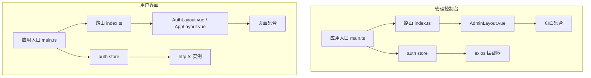
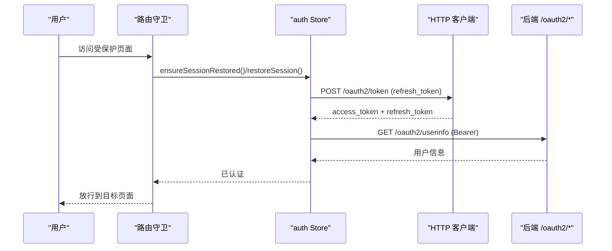
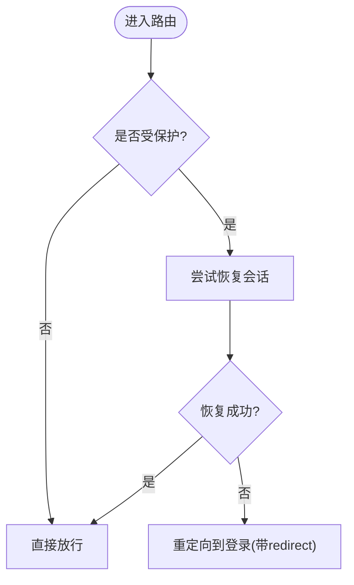
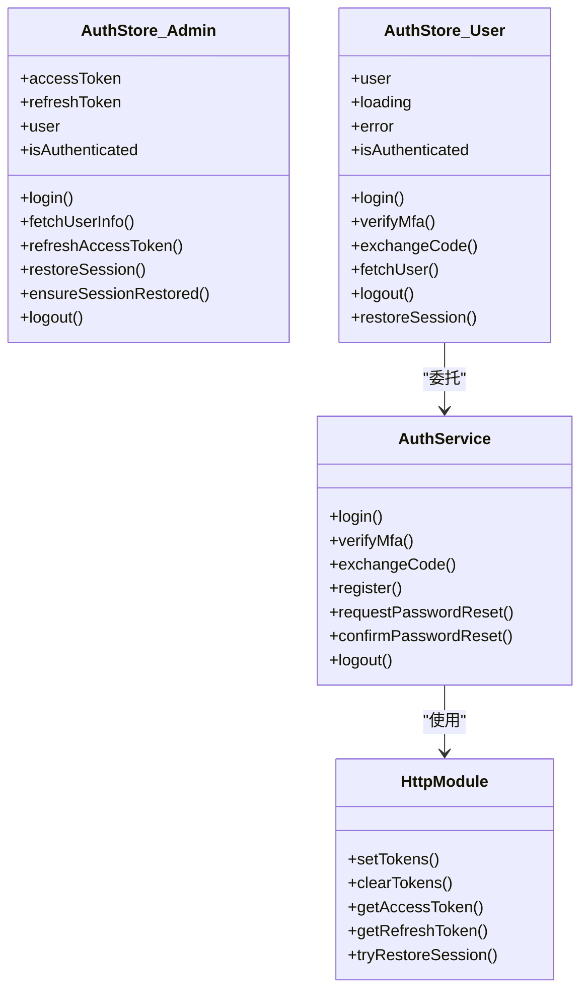
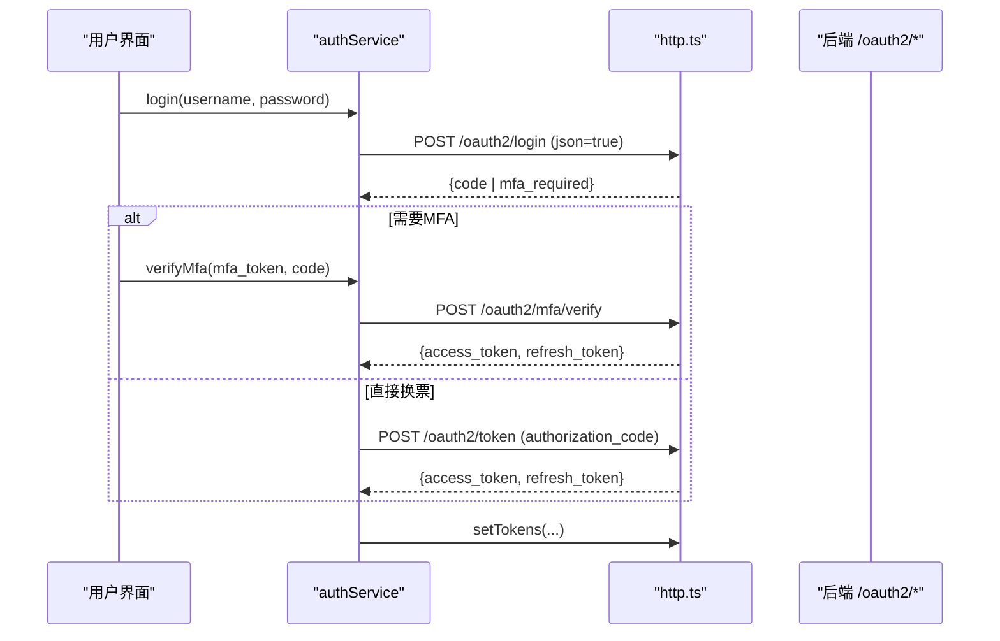
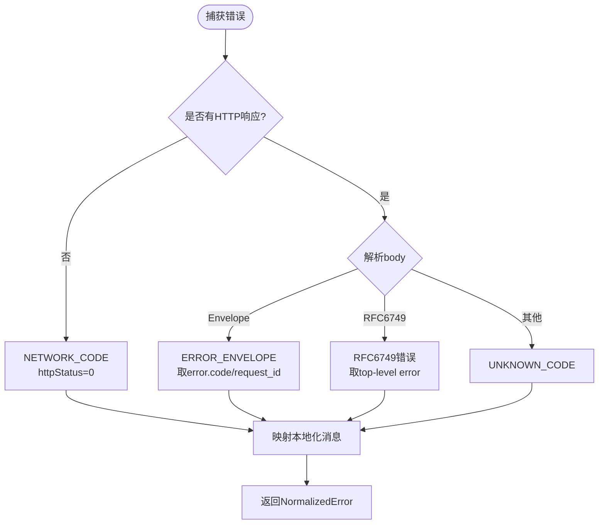
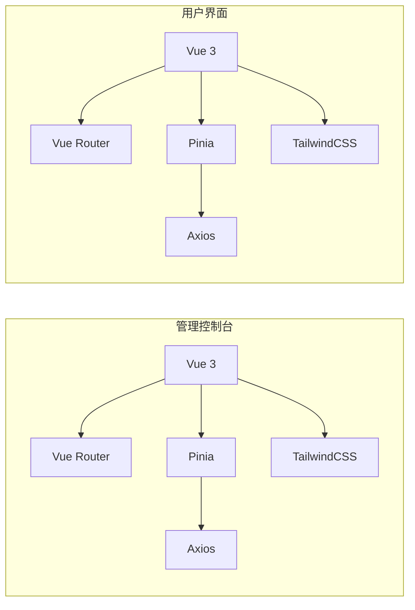

# 前端架构

<cite>
**本文引用的文件**
- [frontends/admin/package.json](file://frontends/admin/package.json)
- [frontends/user/package.json](file://frontends/user/package.json)
- [frontends/admin/src/main.ts](file://frontends/admin/src/main.ts)
- [frontends/user/src/main.ts](file://frontends/user/src/main.ts)
- [frontends/admin/vite.config.ts](file://frontends/admin/vite.config.ts)
- [frontends/user/vite.config.ts](file://frontends/user/vite.config.ts)
- [frontends/admin/src/router/index.ts](file://frontends/admin/src/router/index.ts)
- [frontends/user/src/router/index.ts](file://frontends/user/src/router/index.ts)
- [frontends/admin/src/stores/auth.ts](file://frontends/admin/src/stores/auth.ts)
- [frontends/user/src/stores/auth.ts](file://frontends/user/src/stores/auth.ts)
- [frontends/admin/src/App.vue](file://frontends/admin/src/App.vue)
- [frontends/user/src/App.vue](file://frontends/user/src/App.vue)
- [frontends/admin/src/services/errorAdapter.ts](file://frontends/admin/src/services/errorAdapter.ts)
- [frontends/user/src/services/errorAdapter.ts](file://frontends/user/src/services/errorAdapter.ts)
- [frontends/user/src/services/http.ts](file://frontends/user/src/services/http.ts)
- [frontends/user/src/services/authService.ts](file://frontends/user/src/services/authService.ts)
- [frontends/admin/src/components/layout/AdminLayout.vue](file://frontends/admin/src/components/layout/AdminLayout.vue)
- [frontends/user/src/layouts/AuthLayout.vue](file://frontends/user/src/layouts/AuthLayout.vue)
</cite>

## 目录
1. [简介](#简介)
2. [项目结构](#项目结构)
3. [核心组件](#核心组件)
4. [架构总览](#架构总览)
5. [详细组件分析](#详细组件分析)
6. [依赖分析](#依赖分析)
7. [性能考虑](#性能考虑)
8. [故障排查指南](#故障排查指南)
9. [结论](#结论)
10. [附录](#附录)

## 简介
本文件为 AuthForge 前端应用的架构设计文档，覆盖两个独立的前端应用：管理控制台（admin）与用户界面（user）。两者采用一致的技术栈与架构模式：Vue 3 Composition API、TypeScript、Vite、Pinia、TailwindCSS。文档重点说明共同的设计原则、路由与状态管理、服务层与错误处理、前后端通信协议与数据格式、构建与开发环境、质量保障、性能优化、安全与可维护性扩展策略，并提供最佳实践与常见问题解决方案。

## 项目结构
两个前端应用均位于 frontends 目录下，各自拥有独立的包配置、构建脚本与测试套件，彼此解耦但共享相同的设计理念与错误处理规范。

- 技术栈与工具
  - Vue 3 + TypeScript + Vite + Pinia + TailwindCSS
  - 单元测试使用 Vitest，端到端测试使用 Playwright
  - 开发服务器通过 Vite 代理将 /api、/oauth2、/.well-known、/health 转发至后端

- 应用入口与初始化
  - 管理控制台：在应用启动时尝试恢复会话，确保受保护路由守卫能正确判断认证状态
  - 用户界面：在路由守卫中按需恢复会话，避免不必要的网络请求

- 路由与布局
  - 管理控制台：基于嵌套路由，根路由挂载 AdminLayout，子路由包含仪表盘、应用、用户、角色、范围、令牌、日志、设置等页面
  - 用户界面：区分访客页（登录、注册、忘记密码、重置密码、邮箱验证）、OAuth 协议页（回调、同意、设备验证）与受保护的账户页（仪表盘、个人资料、安全、授权应用），并通过 meta 控制布局

**图表来源**
- [frontends/admin/src/main.ts:1-23](file://frontends/admin/src/main.ts#L1-L23)
- [frontends/admin/src/router/index.ts:1-97](file://frontends/admin/src/router/index.ts#L1-L97)
- [frontends/admin/src/components/layout/AdminLayout.vue:1-332](file://frontends/admin/src/components/layout/AdminLayout.vue#L1-L332)
- [frontends/admin/src/stores/auth.ts:1-270](file://frontends/admin/src/stores/auth.ts#L1-L270)
- [frontends/user/src/main.ts:1-11](file://frontends/user/src/main.ts#L1-L11)
- [frontends/user/src/router/index.ts:1-97](file://frontends/user/src/router/index.ts#L1-L97)
- [frontends/user/src/layouts/AuthLayout.vue:1-81](file://frontends/user/src/layouts/AuthLayout.vue#L1-L81)
- [frontends/user/src/stores/auth.ts:1-101](file://frontends/user/src/stores/auth.ts#L1-L101)
- [frontends/user/src/services/http.ts:1-121](file://frontends/user/src/services/http.ts#L1-L121)

**章节来源**
- [frontends/admin/package.json:1-35](file://frontends/admin/package.json#L1-L35)
- [frontends/user/package.json:1-33](file://frontends/user/package.json#L1-L33)
- [frontends/admin/vite.config.ts:1-40](file://frontends/admin/vite.config.ts#L1-L40)
- [frontends/user/vite.config.ts:1-29](file://frontends/user/vite.config.ts#L1-L29)
- [frontends/admin/src/main.ts:1-23](file://frontends/admin/src/main.ts#L1-L23)
- [frontends/user/src/main.ts:1-11](file://frontends/user/src/main.ts#L1-L11)

## 核心组件
- 应用壳与路由
  - 管理控制台：App.vue 仅渲染 router-view；路由集中定义并启用导航守卫进行鉴权
  - 用户界面：App.vue 根据路由 meta 动态选择布局（AuthLayout 或默认布局）

- 状态管理（Pinia）
  - 管理控制台：auth store 直接封装登录、刷新、获取用户信息、会话恢复、登出，并在 axios 拦截器中自动附加 Bearer Token 与处理 401 刷新失败
  - 用户界面：auth store 委托 authService 与 http 模块完成令牌管理与会话恢复，保持 store 职责单一

- 服务层与 HTTP
  - 管理控制台：直接使用 axios 并注入全局拦截器
  - 用户界面：封装 axios 实例 http.ts，提供令牌存取、自动刷新、统一错误处理与跳转逻辑；authService 负责 OAuth2 流程调用

- 错误处理
  - 两应用均使用统一的错误归一化模块 errorAdapter，将后端 Error Envelope、RFC 6749 错误、未知错误与网络异常转换为一致的 NormalizedError，并映射本地化消息

**章节来源**
- [frontends/admin/src/App.vue:1-4](file://frontends/admin/src/App.vue#L1-L4)
- [frontends/user/src/App.vue:1-16](file://frontends/user/src/App.vue#L1-L16)
- [frontends/admin/src/stores/auth.ts:1-270](file://frontends/admin/src/stores/auth.ts#L1-L270)
- [frontends/user/src/stores/auth.ts:1-101](file://frontends/user/src/stores/auth.ts#L1-L101)
- [frontends/user/src/services/http.ts:1-121](file://frontends/user/src/services/http.ts#L1-L121)
- [frontends/user/src/services/authService.ts:1-90](file://frontends/user/src/services/authService.ts#L1-L90)
- [frontends/admin/src/services/errorAdapter.ts:1-200](file://frontends/admin/src/services/errorAdapter.ts#L1-L200)
- [frontends/user/src/services/errorAdapter.ts:1-184](file://frontends/user/src/services/errorAdapter.ts#L1-L184)

## 架构总览
两个前端应用遵循“视图层（Vue 组件/页面）— 状态层（Pinia Store）— 服务层（HTTP/业务服务）— 后端 API”的分层架构。路由守卫负责访问控制，Store 负责认证状态与会话生命周期，服务层封装与后端的交互，错误处理集中在 errorAdapter 中实现跨应用一致性。

**图表来源**
- [frontends/admin/src/router/index.ts:79-94](file://frontends/admin/src/router/index.ts#L79-L94)
- [frontends/admin/src/stores/auth.ts:184-210](file://frontends/admin/src/stores/auth.ts#L184-L210)
- [frontends/admin/src/stores/auth.ts:151-175](file://frontends/admin/src/stores/auth.ts#L151-L175)
- [frontends/user/src/router/index.ts:78-94](file://frontends/user/src/router/index.ts#L78-L94)
- [frontends/user/src/stores/auth.ts:21-35](file://frontends/user/src/stores/auth.ts#L21-L35)
- [frontends/user/src/services/http.ts:37-54](file://frontends/user/src/services/http.ts#L37-L54)

## 详细组件分析

### 路由系统与鉴权
- 管理控制台
  - 使用 createWebHistory('/admin/')，根路由挂载 AdminLayout，子路由按功能域划分
  - beforeEach 守卫检查 requiresAuth，必要时等待会话恢复后再决定是否放行或跳转到登录页
- 用户界面
  - 使用 createWebHistory()，路由分为访客页（guest）、OAuth 协议页（无 layout）、受保护页（auth）
  - beforeEach 守卫在首次进入受保护路由时尝试恢复会话，未恢复则重定向到登录并携带 redirect

**图表来源**
- [frontends/admin/src/router/index.ts:79-94](file://frontends/admin/src/router/index.ts#L79-L94)
- [frontends/user/src/router/index.ts:78-94](file://frontends/user/src/router/index.ts#L78-L94)

**章节来源**
- [frontends/admin/src/router/index.ts:1-97](file://frontends/admin/src/router/index.ts#L1-L97)
- [frontends/user/src/router/index.ts:1-97](file://frontends/user/src/router/index.ts#L1-L97)

### 状态管理模式（Pinia）
- 管理控制台
  - 存储 accessToken（内存）、refreshToken（sessionStorage）、用户信息
  - 提供 login、fetchUserInfo、refreshAccessToken、restoreSession、ensureSessionRestored、logout
  - 通过 axios 拦截器自动附加 Authorization 头，并在 401 时执行刷新；刷新失败则清理会话并提示“登录已过期”
- 用户界面
  - 存储 user、loading、error、tokenPresent、sessionRestored
  - 委托 authService 与 http 模块完成登录、MFA 校验、代码交换、登出
  - 在构造函数中检测是否存在 refresh_token 并异步恢复会话

**图表来源**
- [frontends/admin/src/stores/auth.ts:60-270](file://frontends/admin/src/stores/auth.ts#L60-L270)
- [frontends/user/src/stores/auth.ts:9-101](file://frontends/user/src/stores/auth.ts#L9-L101)
- [frontends/user/src/services/authService.ts:7-90](file://frontends/user/src/services/authService.ts#L7-L90)
- [frontends/user/src/services/http.ts:11-54](file://frontends/user/src/services/http.ts#L11-L54)

**章节来源**
- [frontends/admin/src/stores/auth.ts:1-270](file://frontends/admin/src/stores/auth.ts#L1-L270)
- [frontends/user/src/stores/auth.ts:1-101](file://frontends/user/src/stores/auth.ts#L1-L101)

### 服务层架构与前后端通信
- 管理控制台
  - 直接通过 axios 调用 /oauth2/login、/oauth2/token、/oauth2/userinfo
  - 登录流程：POST /oauth2/login（json=true）获取 code 或 mfa_required；若需要 MFA 则返回 mfa_token；否则 exchange code 换取 tokens；随后获取用户信息并校验 admin 角色
- 用户界面
  - 通过 http.ts 创建 axios 实例，baseURL 来自环境变量，超时 15s，默认表单编码
  - 令牌管理：access_token 内存保存，refresh_token 持久化 localStorage；提供 tryRestoreSession 在页面加载时静默刷新
  - 登录流程：POST /oauth2/login（json=true）→ 可选 MFA → exchange code → setTokens；支持 register、password-reset、revoke 等接口

**图表来源**
- [frontends/user/src/services/authService.ts:7-58](file://frontends/user/src/services/authService.ts#L7-L58)
- [frontends/user/src/services/http.ts:1-121](file://frontends/user/src/services/http.ts#L1-L121)
- [frontends/admin/src/stores/auth.ts:73-130](file://frontends/admin/src/stores/auth.ts#L73-L130)

**章节来源**
- [frontends/admin/src/stores/auth.ts:73-130](file://frontends/admin/src/stores/auth.ts#L73-L130)
- [frontends/user/src/services/authService.ts:1-90](file://frontends/user/src/services/authService.ts#L1-L90)
- [frontends/user/src/services/http.ts:1-121](file://frontends/user/src/services/http.ts#L1-L121)

### 错误处理机制
- 统一错误归一化
  - 解析优先级：Error Envelope → RFC 6749 字符串错误 → 未知错误 → 网络异常
  - 输出 NormalizedError：code、message、request_id、httpStatus
  - 会话过期专用错误：AUTH_TOKEN_EXPIRED，用于 401 刷新失败路径
- 管理控制台
  - axios 响应拦截器：401 且存在 refresh_token 时执行刷新；失败则清理会话、设置登录错误、跳转登录
- 用户界面
  - http.ts 响应拦截器：对非 /oauth2 请求的 401 执行刷新；失败则清理会话、构造 sessionExpiredError、跳转登录

**图表来源**
- [frontends/admin/src/services/errorAdapter.ts:89-174](file://frontends/admin/src/services/errorAdapter.ts#L89-L174)
- [frontends/user/src/services/errorAdapter.ts:73-158](file://frontends/user/src/services/errorAdapter.ts#L73-L158)
- [frontends/admin/src/stores/auth.ts:220-255](file://frontends/admin/src/stores/auth.ts#L220-L255)
- [frontends/user/src/services/http.ts:82-118](file://frontends/user/src/services/http.ts#L82-L118)

**章节来源**
- [frontends/admin/src/services/errorAdapter.ts:1-200](file://frontends/admin/src/services/errorAdapter.ts#L1-L200)
- [frontends/user/src/services/errorAdapter.ts:1-184](file://frontends/user/src/services/errorAdapter.ts#L1-L184)
- [frontends/admin/src/stores/auth.ts:212-255](file://frontends/admin/src/stores/auth.ts#L212-L255)
- [frontends/user/src/services/http.ts:56-118](file://frontends/user/src/services/http.ts#L56-L118)

### 构建配置与开发环境
- 管理控制台
  - base 设置为 /admin/，便于以子路径部署
  - 开发端口 5174，代理 /api、/oauth2、/health、/.well-known 到后端 5555
- 用户界面
  - 开发端口 5173，代理同上
- 环境变量
  - 用户界面通过 VITE_API_BASE_URL、VITE_CLIENT_ID、VITE_REDIRECT_URI 控制基础 URL、客户端标识与回调地址

**章节来源**
- [frontends/admin/vite.config.ts:1-40](file://frontends/admin/vite.config.ts#L1-L40)
- [frontends/user/vite.config.ts:1-29](file://frontends/user/vite.config.ts#L1-L29)
- [frontends/user/src/services/http.ts:5-8](file://frontends/user/src/services/http.ts#L5-L8)
- [frontends/user/src/services/authService.ts:4-5](file://frontends/user/src/services/authService.ts#L4-L5)

### 组件设计规范与布局
- 管理控制台
  - AdminLayout 提供侧边栏、面包屑、用户菜单与移动端适配；导航项分组清晰，支持折叠与高亮
- 用户界面
  - AuthLayout 提供品牌展示区与表单区域，适用于登录、注册、密码重置等场景
  - App.vue 根据路由 meta 动态切换布局，保证不同场景下的视觉一致性

**章节来源**
- [frontends/admin/src/components/layout/AdminLayout.vue:1-332](file://frontends/admin/src/components/layout/AdminLayout.vue#L1-L332)
- [frontends/user/src/layouts/AuthLayout.vue:1-81](file://frontends/user/src/layouts/AuthLayout.vue#L1-L81)
- [frontends/user/src/App.vue:1-16](file://frontends/user/src/App.vue#L1-L16)

## 依赖分析
- 管理控制台依赖
  - Vue、Vue Router、Pinia、Axios、TailwindCSS、Headless UI、Heroicons
- 用户界面依赖
  - Vue、Vue Router、Pinia、Axios、TailwindCSS
- 构建与测试
  - Vite、TypeScript、Vitest、Playwright、fast-check

**图表来源**
- [frontends/admin/package.json:15-33](file://frontends/admin/package.json#L15-L33)
- [frontends/user/package.json:15-31](file://frontends/user/package.json#L15-L31)

**章节来源**
- [frontends/admin/package.json:1-35](file://frontends/admin/package.json#L1-L35)
- [frontends/user/package.json:1-33](file://frontends/user/package.json#L1-L33)

## 性能考虑
- 路由懒加载：页面组件通过动态 import 减少首屏体积
- 会话恢复去重：管理控制台通过 ensureSessionRestored 保证一次页面加载内只执行一次恢复，避免重复刷新
- 并发刷新保护：refreshInFlight 保证多个 401 请求共享一次刷新，防止后端旋转 refresh token 导致冲突
- 令牌最小暴露：access_token 仅存内存，refresh_token 分别存储在 sessionStorage（管理控制台）或 localStorage（用户界面），降低 XSS 风险
- 构建优化：Vite 插件与 TailwindCSS 按需生成样式，减少 CSS 体积

[本节为通用性能建议，不直接分析具体文件]

## 故障排查指南
- 登录后仍被重定向到登录页
  - 检查路由守卫是否正确等待会话恢复（ensureSessionRestored/restoreSession）
  - 确认后端返回的 refresh_token 是否有效且未被撤销
- 401 频繁出现或循环刷新
  - 检查 axios/http 拦截器的 _retry 标记与刷新逻辑
  - 确认服务端 refresh token 轮换策略与客户端刷新时机匹配
- 错误消息不显示或显示为未知
  - 确认 errorAdapter 是否正确解析后端 Error Envelope 或 RFC 6749 错误
  - 检查本地化消息是否包含对应 code
- 开发环境无法访问后端接口
  - 核对 vite.config.ts 中的 proxy 配置与后端运行端口
  - 确认浏览器同源策略与 CORS 设置

**章节来源**
- [frontends/admin/src/router/index.ts:79-94](file://frontends/admin/src/router/index.ts#L79-L94)
- [frontends/admin/src/stores/auth.ts:144-175](file://frontends/admin/src/stores/auth.ts#L144-L175)
- [frontends/admin/src/stores/auth.ts:220-255](file://frontends/admin/src/stores/auth.ts#L220-L255)
- [frontends/user/src/router/index.ts:78-94](file://frontends/user/src/router/index.ts#L78-L94)
- [frontends/user/src/services/http.ts:82-118](file://frontends/user/src/services/http.ts#L82-L118)
- [frontends/admin/src/services/errorAdapter.ts:89-174](file://frontends/admin/src/services/errorAdapter.ts#L89-L174)
- [frontends/user/src/services/errorAdapter.ts:73-158](file://frontends/user/src/services/errorAdapter.ts#L73-L158)

## 结论
AuthForge 前端采用统一的技术栈与分层架构，通过路由守卫、Pinia 状态管理、服务层封装与统一错误处理，实现了管理控制台与用户界面的一致体验与高可维护性。结合 Vite 构建优化、安全的令牌存储策略与完善的测试体系，系统在性能、安全与可扩展性方面具备良好基础。建议在后续迭代中持续强化类型约束、错误可观测性与国际化能力，并保持前后端契约的一致性。

[本节为总结性内容，不直接分析具体文件]

## 附录
- 最佳实践
  - 所有 API 调用统一通过服务层封装，避免在组件中直接发起请求
  - 错误处理一律使用 normalizeError，确保用户可见消息一致且可本地化
  - 敏感数据（如 access_token）尽量保存在内存，refresh_token 使用合适的存储策略
  - 路由 meta 明确标注 guest/auth/layout，便于守卫与布局逻辑统一处理
- 常见问题
  - 多标签页会话不一致：注意 refresh token 的存储与作用域，必要时在标签页间同步状态
  - 开发环境与生产环境差异：通过环境变量与构建 base 路径区分部署位置
  - 第三方集成：确保 redirect_uri 与后端配置一致，避免回调失败

[本节为通用指导，不直接分析具体文件]