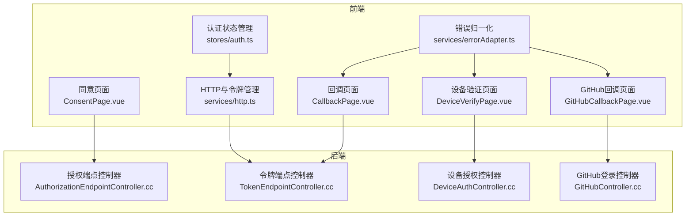
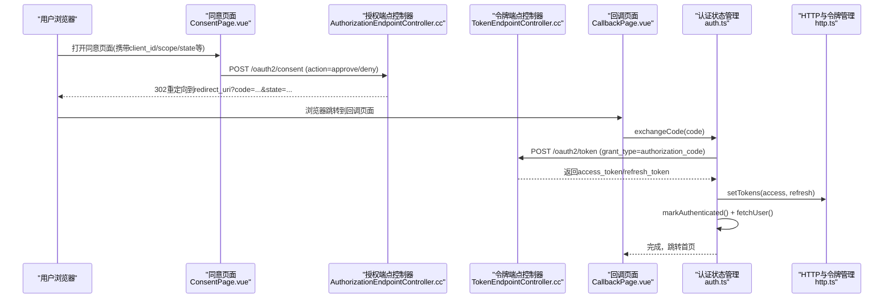
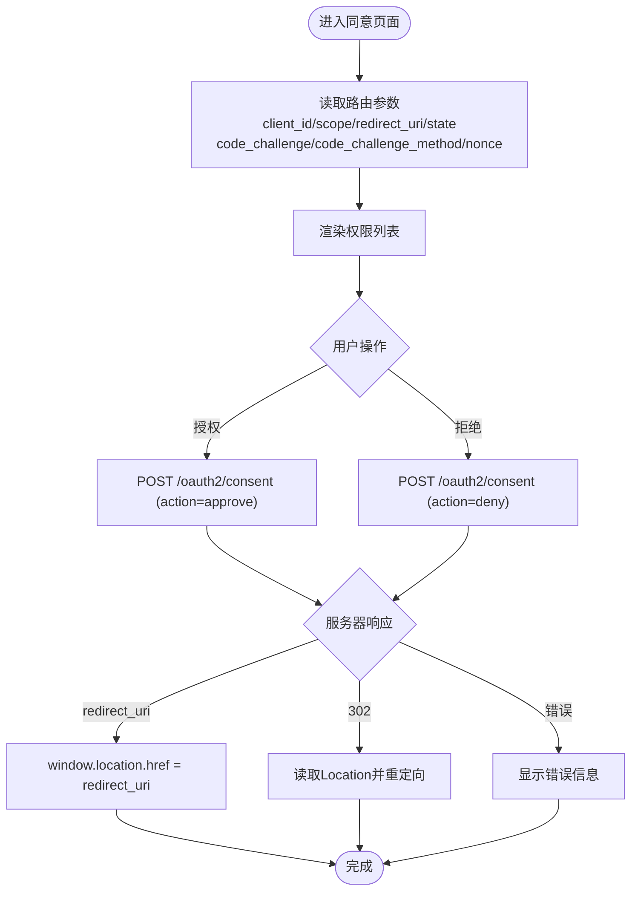
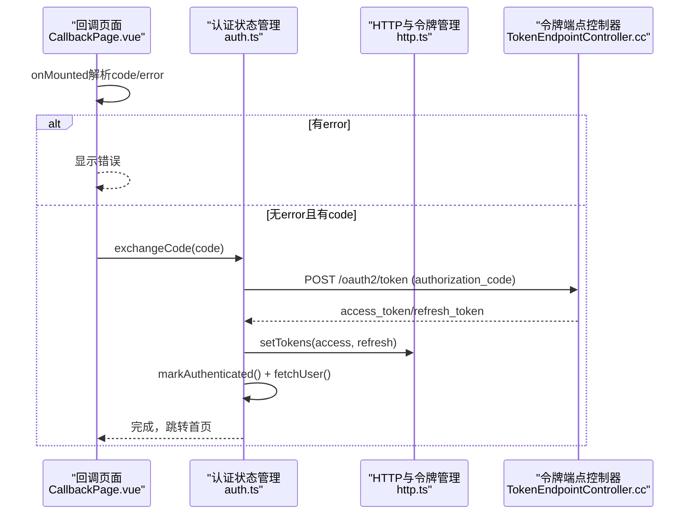
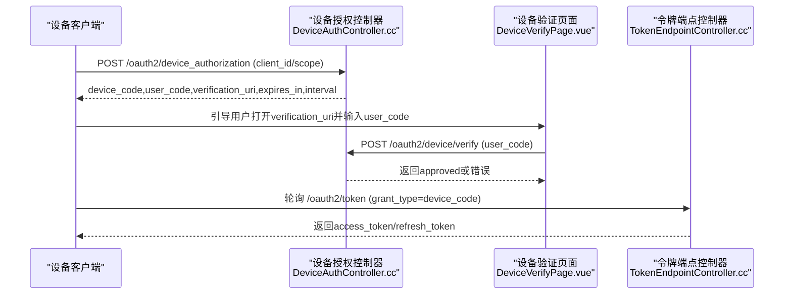
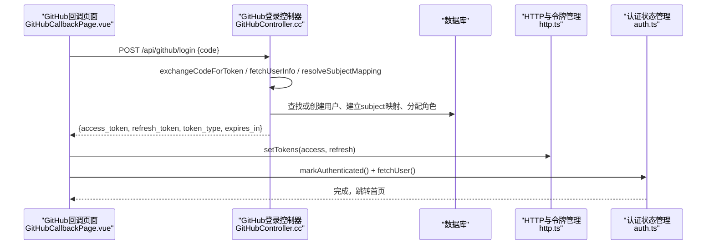
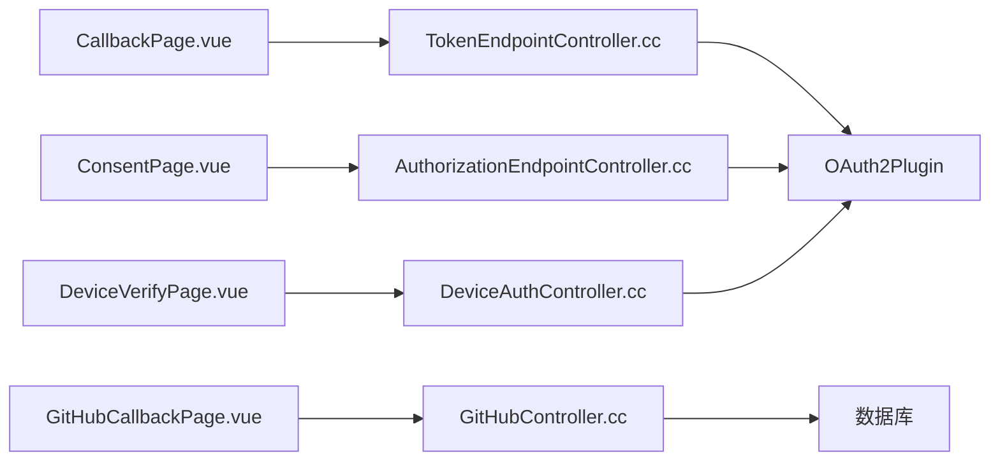

# OAuth集成

<cite>
**本文引用的文件**
- [ConsentPage.vue](file://frontends/user/src/pages/oauth/ConsentPage.vue)
- [CallbackPage.vue](file://frontends/user/src/pages/oauth/CallbackPage.vue)
- [DeviceVerifyPage.vue](file://frontends/user/src/pages/oauth/DeviceVerifyPage.vue)
- [GitHubCallbackPage.vue](file://frontends/user/src/pages/oauth/GitHubCallbackPage.vue)
- [auth.ts](file://frontends/user/src/stores/auth.ts)
- [http.ts](file://frontends/user/src/services/http.ts)
- [errorAdapter.ts](file://frontends/user/src/services/errorAdapter.ts)
- [AuthorizationEndpointController.cc](file://libs/drogon/src/controllers/AuthorizationEndpointController.cc)
- [TokenEndpointController.cc](file://libs/drogon/src/controllers/TokenEndpointController.cc)
- [DeviceAuthController.cc](file://libs/drogon/src/controllers/DeviceAuthController.cc)
- [GitHubController.cc](file://libs/drogon/src/controllers/GitHubController.cc)
</cite>

## 目录
1. [简介](#简介)
2. [项目结构](#项目结构)
3. [核心组件](#核心组件)
4. [架构总览](#架构总览)
5. [详细组件分析](#详细组件分析)
6. [依赖关系分析](#依赖关系分析)
7. [性能考虑](#性能考虑)
8. [故障排查指南](#故障排查指南)
9. [结论](#结论)
10. [附录](#附录)

## 简介
本文件面向AuthForge的OAuth集成功能，聚焦以下前端页面与后端控制器的协作流程：
- 同意页面（ConsentPage）：展示应用请求的权限范围，用户确认后生成授权码并回调。
- 回调页面（CallbackPage）：接收授权码，调用令牌交换接口，完成登录态建立与本地存储。
- 设备验证页面（DeviceVerifyPage）：实现设备授权流程（RFC 8628），包括设备码显示、用户验证、设备绑定与访问授权。
- GitHub回调页面（GitHubCallbackPage）：处理GitHub社交登录，完成OAuth回调、用户信息同步与账户关联。

文档同时覆盖安全考虑（CSRF、PKCE、状态参数校验）、状态管理、错误处理、重定向逻辑与用户体验优化，并提供不同OAuth提供商的集成模式与最佳实践。

## 项目结构
前端位于 frontends/user，包含OAuth相关页面与状态管理；后端位于 libs/drogon/src/controllers，提供授权、令牌、设备授权与第三方登录等能力。前后端通过HTTP交互，使用统一的错误归一化模块与自动刷新机制。

**图表来源**
- [ConsentPage.vue:1-106](file://frontends/user/src/pages/oauth/ConsentPage.vue#L1-L106)
- [CallbackPage.vue:1-50](file://frontends/user/src/pages/oauth/CallbackPage.vue#L1-L50)
- [DeviceVerifyPage.vue:1-64](file://frontends/user/src/pages/oauth/DeviceVerifyPage.vue#L1-L64)
- [GitHubCallbackPage.vue:1-56](file://frontends/user/src/pages/oauth/GitHubCallbackPage.vue#L1-L56)
- [auth.ts:1-101](file://frontends/user/src/stores/auth.ts#L1-L101)
- [http.ts:1-121](file://frontends/user/src/services/http.ts#L1-L121)
- [errorAdapter.ts:1-184](file://frontends/user/src/services/errorAdapter.ts#L1-L184)
- [AuthorizationEndpointController.cc:95-533](file://libs/drogon/src/controllers/AuthorizationEndpointController.cc#L95-L533)
- [TokenEndpointController.cc:561-800](file://libs/drogon/src/controllers/TokenEndpointController.cc#L561-L800)
- [DeviceAuthController.cc:167-425](file://libs/drogon/src/controllers/DeviceAuthController.cc#L167-L425)
- [GitHubController.cc:126-635](file://libs/drogon/src/controllers/GitHubController.cc#L126-L635)

**章节来源**
- [ConsentPage.vue:1-106](file://frontends/user/src/pages/oauth/ConsentPage.vue#L1-L106)
- [CallbackPage.vue:1-50](file://frontends/user/src/pages/oauth/CallbackPage.vue#L1-L50)
- [DeviceVerifyPage.vue:1-64](file://frontends/user/src/pages/oauth/DeviceVerifyPage.vue#L1-L64)
- [GitHubCallbackPage.vue:1-56](file://frontends/user/src/pages/oauth/GitHubCallbackPage.vue#L1-L56)
- [auth.ts:1-101](file://frontends/user/src/stores/auth.ts#L1-L101)
- [http.ts:1-121](file://frontends/user/src/services/http.ts#L1-L121)
- [errorAdapter.ts:1-184](file://frontends/user/src/services/errorAdapter.ts#L1-L184)
- [AuthorizationEndpointController.cc:95-533](file://libs/drogon/src/controllers/AuthorizationEndpointController.cc#L95-L533)
- [TokenEndpointController.cc:561-800](file://libs/drogon/src/controllers/TokenEndpointController.cc#L561-L800)
- [DeviceAuthController.cc:167-425](file://libs/drogon/src/controllers/DeviceAuthController.cc#L167-L425)
- [GitHubController.cc:126-635](file://libs/drogon/src/controllers/GitHubController.cc#L126-L635)

## 核心组件
- 同意页面（ConsentPage.vue）：从路由查询参数读取client_id、scope、redirect_uri、state以及可选的code_challenge/code_challenge_method/nonce；展示权限列表；提交POST /oauth2/consent；根据响应或302重定向到回调地址。
- 回调页面（CallbackPage.vue）：监听挂载事件，解析code或error；若无错误则调用auth.exchangeCode(code)，成功后跳转首页；错误时显示统一消息。
- 设备验证页面（DeviceVerifyPage.vue）：输入user_code并提交POST /oauth2/device/verify；成功后提示可关闭页面；失败显示错误并可重试。
- GitHub回调页面（GitHubCallbackPage.vue）：从路由获取code，调用后端/api/github/login换取access_token/refresh_token；设置本地令牌并标记已认证，拉取用户信息后跳转首页。
- 认证状态管理（auth.ts）：封装exchangeCode、fetchUser、restoreSession等方法；维护tokenPresent与用户信息。
- HTTP与令牌管理（http.ts）：内存保存access_token，持久化refresh_token；拦截器自动刷新401；提供setTokens/clearTokens/getAccessToken/getRefreshToken。
- 错误归一化（errorAdapter.ts）：将axios错误转换为统一结构，支持会话过期、网络错误、未知错误等场景。

**章节来源**
- [ConsentPage.vue:1-106](file://frontends/user/src/pages/oauth/ConsentPage.vue#L1-L106)
- [CallbackPage.vue:1-50](file://frontends/user/src/pages/oauth/CallbackPage.vue#L1-L50)
- [DeviceVerifyPage.vue:1-64](file://frontends/user/src/pages/oauth/DeviceVerifyPage.vue#L1-L64)
- [GitHubCallbackPage.vue:1-56](file://frontends/user/src/pages/oauth/GitHubCallbackPage.vue#L1-L56)
- [auth.ts:1-101](file://frontends/user/src/stores/auth.ts#L1-L101)
- [http.ts:1-121](file://frontends/user/src/services/http.ts#L1-L121)
- [errorAdapter.ts:1-184](file://frontends/user/src/services/errorAdapter.ts#L1-L184)

## 架构总览
下图展示了授权码流程中前端页面与后端控制器的交互路径，包括同意页、回调页、令牌交换与用户信息获取。

**图表来源**
- [ConsentPage.vue:33-63](file://frontends/user/src/pages/oauth/ConsentPage.vue#L33-L63)
- [AuthorizationEndpointController.cc:414-523](file://libs/drogon/src/controllers/AuthorizationEndpointController.cc#L414-L523)
- [CallbackPage.vue:12-32](file://frontends/user/src/pages/oauth/CallbackPage.vue#L12-L32)
- [auth.ts:73-77](file://frontends/user/src/stores/auth.ts#L73-L77)
- [TokenEndpointController.cc:652-693](file://libs/drogon/src/controllers/TokenEndpointController.cc#L652-L693)
- [http.ts:17-22](file://frontends/user/src/services/http.ts#L17-L22)

## 详细组件分析

### 同意页面（ConsentPage）
- 功能要点
  - 从路由参数提取client_id、scope、redirect_uri、state、code_challenge、code_challenge_method、nonce。
  - 展示权限列表，提供“拒绝”和“授权”按钮。
  - 提交POST /oauth2/consent，携带action及必要参数；若服务器返回redirect_uri则直接跳转；若为302则读取location并重定向。
- 安全与体验
  - 透传PKCE参数（code_challenge与方法）至服务端，确保后续令牌交换时进行PKCE校验。
  - 透传nonce以支持OIDC id_token的nonce校验。
  - 加载态禁用按钮，避免重复提交。
- 错误处理
  - 捕获异常，对302重定向进行特殊处理，保证浏览器正常跳转。

**图表来源**
- [ConsentPage.vue:11-22](file://frontends/user/src/pages/oauth/ConsentPage.vue#L11-L22)
- [ConsentPage.vue:33-63](file://frontends/user/src/pages/oauth/ConsentPage.vue#L33-L63)
- [AuthorizationEndpointController.cc:414-523](file://libs/drogon/src/controllers/AuthorizationEndpointController.cc#L414-L523)

**章节来源**
- [ConsentPage.vue:1-106](file://frontends/user/src/pages/oauth/ConsentPage.vue#L1-L106)
- [AuthorizationEndpointController.cc:95-533](file://libs/drogon/src/controllers/AuthorizationEndpointController.cc#L95-L533)

### 回调页面（CallbackPage）
- 功能要点
  - 挂载时解析query中的code或error。
  - 存在error时显示错误消息；否则调用auth.exchangeCode(code)。
  - 成功后跳转首页。
- 状态管理与本地存储
  - exchangeCode内部调用authService.exchangeCode，完成后markAuthenticated并fetchUser。
  - http.ts在收到access_token/refresh_token时设置本地存储（refresh_token持久化，access_token内存）。
- 错误处理
  - 使用normalizeError统一错误消息，便于国际化与一致展示。

**图表来源**
- [CallbackPage.vue:12-32](file://frontends/user/src/pages/oauth/CallbackPage.vue#L12-L32)
- [auth.ts:73-77](file://frontends/user/src/stores/auth.ts#L73-L77)
- [http.ts:17-22](file://frontends/user/src/services/http.ts#L17-L22)
- [TokenEndpointController.cc:652-693](file://libs/drogon/src/controllers/TokenEndpointController.cc#L652-L693)

**章节来源**
- [CallbackPage.vue:1-50](file://frontends/user/src/pages/oauth/CallbackPage.vue#L1-L50)
- [auth.ts:1-101](file://frontends/user/src/stores/auth.ts#L1-L101)
- [http.ts:1-121](file://frontends/user/src/services/http.ts#L1-L121)
- [TokenEndpointController.cc:561-800](file://libs/drogon/src/controllers/TokenEndpointController.cc#L561-L800)

### 设备验证页面（DeviceVerifyPage）
- 功能要点
  - 输入user_code并提交POST /oauth2/device/verify。
  - 成功后显示“设备授权成功”，提示可关闭页面。
  - 失败时显示错误并可重试。
- 后端设备授权流程（RFC 8628）
  - 设备端先调用设备授权端点获取device_code与user_code。
  - 用户在浏览器打开验证页面，输入user_code进行确认。
  - 后端校验user_code有效性、过期与状态，标记批准；设备端轮询令牌端点获取令牌。
- 安全与体验
  - user_code仅允许特定字符集，长度固定，降低猜测风险。
  - 界面提供清晰的状态反馈与重试入口。

**图表来源**
- [DeviceVerifyPage.vue:13-26](file://frontends/user/src/pages/oauth/DeviceVerifyPage.vue#L13-L26)
- [DeviceAuthController.cc:167-314](file://libs/drogon/src/controllers/DeviceAuthController.cc#L167-L314)
- [DeviceAuthController.cc:316-425](file://libs/drogon/src/controllers/DeviceAuthController.cc#L316-L425)
- [TokenEndpointController.cc:561-800](file://libs/drogon/src/controllers/TokenEndpointController.cc#L561-L800)

**章节来源**
- [DeviceVerifyPage.vue:1-64](file://frontends/user/src/pages/oauth/DeviceVerifyPage.vue#L1-L64)
- [DeviceAuthController.cc:167-425](file://libs/drogon/src/controllers/DeviceAuthController.cc#L167-L425)
- [TokenEndpointController.cc:561-800](file://libs/drogon/src/controllers/TokenEndpointController.cc#L561-L800)

### GitHub回调页面（GitHubCallbackPage）
- 功能要点
  - 从路由获取code，调用后端/api/github/login。
  - 成功后设置access_token/refresh_token，标记已认证，拉取用户信息并跳转首页。
  - 失败时显示错误消息。
- 后端处理流程
  - 优先使用SocialAuthService（若启用），否则回退到直接HttpClient交换令牌与获取用户信息。
  - 查找或创建本地用户，建立subject映射，分配默认角色，签发令牌对。
- 安全与体验
  - 统一错误响应格式（Error Envelope），便于前端统一处理。
  - 界面提供加载态与错误提示，提升用户体验。

**图表来源**
- [GitHubCallbackPage.vue:14-38](file://frontends/user/src/pages/oauth/GitHubCallbackPage.vue#L14-L38)
- [GitHubController.cc:126-290](file://libs/drogon/src/controllers/GitHubController.cc#L126-L290)
- [GitHubController.cc:296-635](file://libs/drogon/src/controllers/GitHubController.cc#L296-L635)
- [http.ts:17-22](file://frontends/user/src/services/http.ts#L17-L22)
- [auth.ts:73-77](file://frontends/user/src/stores/auth.ts#L73-L77)

**章节来源**
- [GitHubCallbackPage.vue:1-56](file://frontends/user/src/pages/oauth/GitHubCallbackPage.vue#L1-L56)
- [GitHubController.cc:126-635](file://libs/drogon/src/controllers/GitHubController.cc#L126-L635)
- [http.ts:1-121](file://frontends/user/src/services/http.ts#L1-L121)
- [auth.ts:1-101](file://frontends/user/src/stores/auth.ts#L1-L101)

## 依赖关系分析
- 前端依赖
  - ConsentPage.vue依赖路由参数与服务端同意接口；依赖errorAdapter进行错误归一化。
  - CallbackPage.vue依赖auth.store与http服务，间接依赖令牌端点。
  - DeviceVerifyPage.vue依赖设备验证接口与错误归一化。
  - GitHubCallbackPage.vue依赖GitHub登录接口与http服务。
- 后端依赖
  - AuthorizationEndpointController.cc负责授权流程，依赖OAuth2Plugin进行客户端验证、重定向URI校验、范围决策与授权码生成。
  - TokenEndpointController.cc处理令牌交换、刷新、撤销与检查，支持多种grant类型。
  - DeviceAuthController.cc实现设备授权协议，生成user_code/device_code并管理生命周期。
  - GitHubController.cc处理GitHub社交登录，支持SocialAuthService或直接HttpClient回退路径。

**图表来源**
- [ConsentPage.vue:33-63](file://frontends/user/src/pages/oauth/ConsentPage.vue#L33-L63)
- [AuthorizationEndpointController.cc:95-533](file://libs/drogon/src/controllers/AuthorizationEndpointController.cc#L95-L533)
- [CallbackPage.vue:12-32](file://frontends/user/src/pages/oauth/CallbackPage.vue#L12-L32)
- [TokenEndpointController.cc:561-800](file://libs/drogon/src/controllers/TokenEndpointController.cc#L561-L800)
- [DeviceVerifyPage.vue:13-26](file://frontends/user/src/pages/oauth/DeviceVerifyPage.vue#L13-L26)
- [DeviceAuthController.cc:167-425](file://libs/drogon/src/controllers/DeviceAuthController.cc#L167-L425)
- [GitHubCallbackPage.vue:14-38](file://frontends/user/src/pages/oauth/GitHubCallbackPage.vue#L14-L38)
- [GitHubController.cc:126-635](file://libs/drogon/src/controllers/GitHubController.cc#L126-L635)

**章节来源**
- [AuthorizationEndpointController.cc:95-533](file://libs/drogon/src/controllers/AuthorizationEndpointController.cc#L95-L533)
- [TokenEndpointController.cc:561-800](file://libs/drogon/src/controllers/TokenEndpointController.cc#L561-L800)
- [DeviceAuthController.cc:167-425](file://libs/drogon/src/controllers/DeviceAuthController.cc#L167-L425)
- [GitHubController.cc:126-635](file://libs/drogon/src/controllers/GitHubController.cc#L126-L635)

## 性能考虑
- 前端
  - 使用内存存储access_token减少XSS影响；refresh_token持久化用于静默刷新。
  - 拦截器自动刷新401，避免频繁重新登录。
  - 统一错误归一化，减少重复解析与UI抖动。
- 后端
  - 授权端点严格校验state与PKCE，防止CSRF与降级攻击。
  - 令牌端点对refresh_token进行客户端认证，防止泄露后的滥用。
  - 设备授权使用随机user_code与过期时间，限制暴力破解窗口。
  - 第三方登录采用异步HTTP与数据库操作，避免阻塞主线程。

[本节为通用指导，不直接分析具体文件]

## 故障排查指南
- 同意页面
  - 现象：点击授权无响应或报错。
  - 排查：检查路由参数是否完整（client_id、scope、redirect_uri、state）；确认后端配置login_url/consent_url；查看errorAdapter归一化错误。
- 回调页面
  - 现象：登录后未跳转或显示错误。
  - 排查：确认code是否存在；检查/oauth2/token响应；查看http拦截器是否触发401刷新失败；核对refresh_token是否有效。
- 设备验证页面
  - 现象：输入user_code无效或过期。
  - 排查：确认user_code格式与大小写；检查设备授权有效期；查看后端日志与数据库状态。
- GitHub回调页面
  - 现象：登录失败或无法获取用户信息。
  - 排查：检查GitHub配置（client_id/secret）；确认外部API可达；查看Error Envelope中的错误码与描述。

**章节来源**
- [errorAdapter.ts:73-184](file://frontends/user/src/services/errorAdapter.ts#L73-L184)
- [http.ts:82-117](file://frontends/user/src/services/http.ts#L82-L117)
- [AuthorizationEndpointController.cc:134-214](file://libs/drogon/src/controllers/AuthorizationEndpointController.cc#L134-L214)
- [TokenEndpointController.cc:695-793](file://libs/drogon/src/controllers/TokenEndpointController.cc#L695-L793)
- [DeviceAuthController.cc:316-425](file://libs/drogon/src/controllers/DeviceAuthController.cc#L316-L425)
- [GitHubController.cc:126-290](file://libs/drogon/src/controllers/GitHubController.cc#L126-L290)

## 结论
AuthForge的OAuth集成在前端提供了清晰的同意、回调、设备验证与第三方登录页面，在后端实现了严格的授权、令牌、设备授权与社交登录流程。通过PKCE、state参数校验、客户端认证与统一错误处理，系统在安全性与用户体验方面具备良好基础。建议在生产环境中持续监控指标、强化日志审计，并根据业务需求扩展更多OAuth提供商。

[本节为总结性内容，不直接分析具体文件]

## 附录
- 安全最佳实践
  - 强制使用state参数防CSRF。
  - 公共客户端强制PKCE，禁止静默重放绕过。
  - 令牌端点对refresh_token进行客户端认证。
  - 设备授权使用高熵user_code与短有效期。
  - 第三方登录统一Error Envelope，便于前端统一处理。
- 集成模式
  - 授权码流程：/authorize -> /consent -> /callback -> /token。
  - 设备授权流程：/device_authorization -> /device/verify -> /token (device_code)。
  - 社交登录：/social/callback -> /api/{provider}/login -> /token。

[本节为通用指导，不直接分析具体文件]