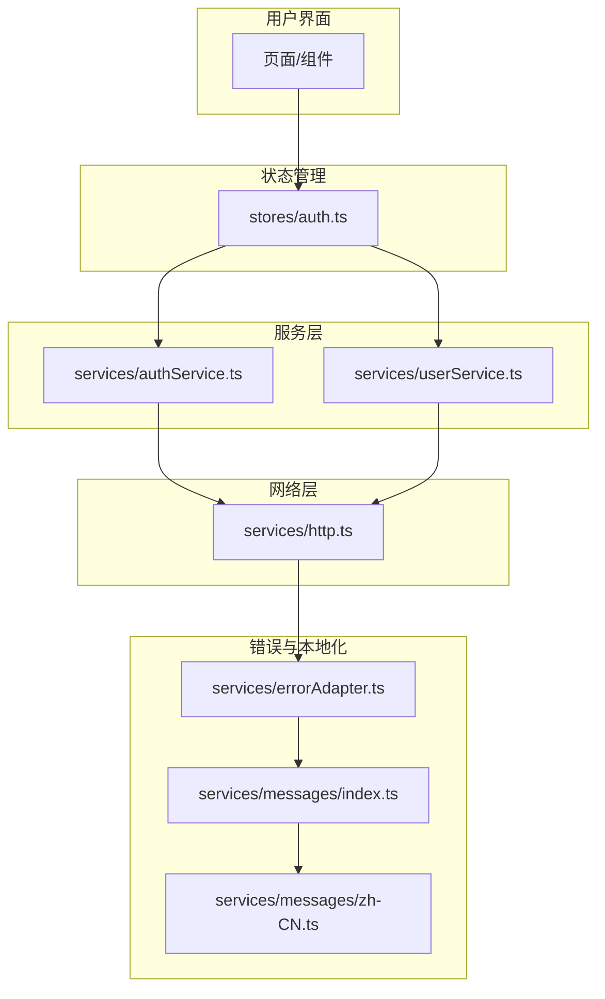
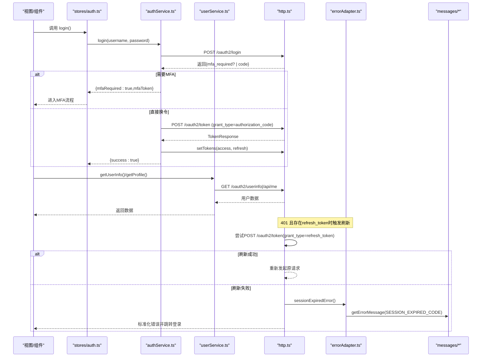
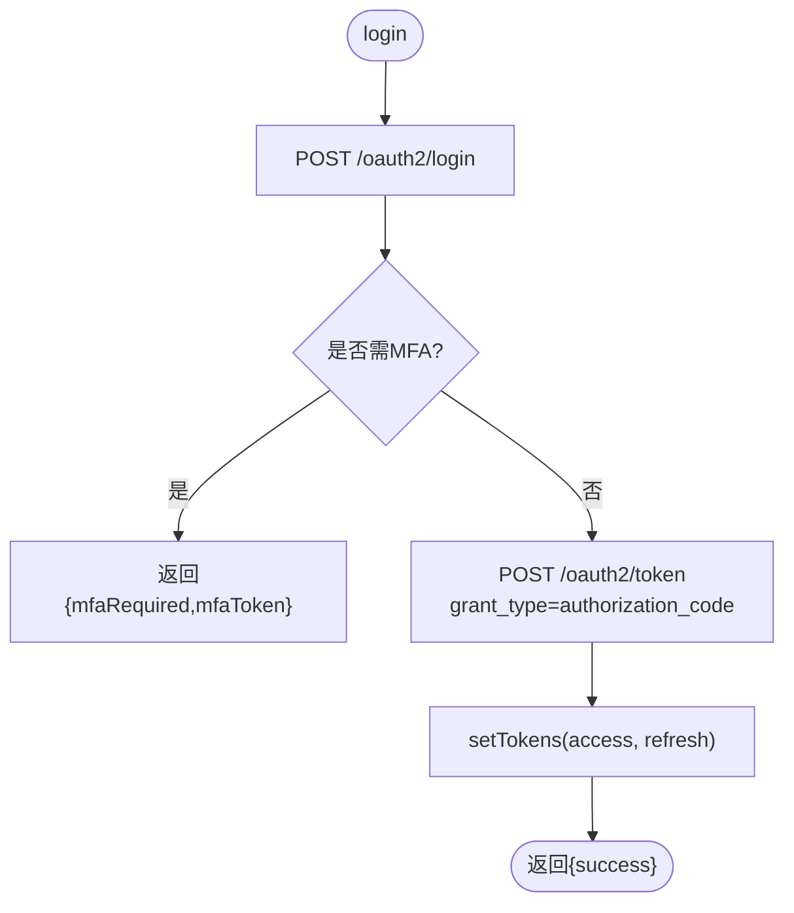
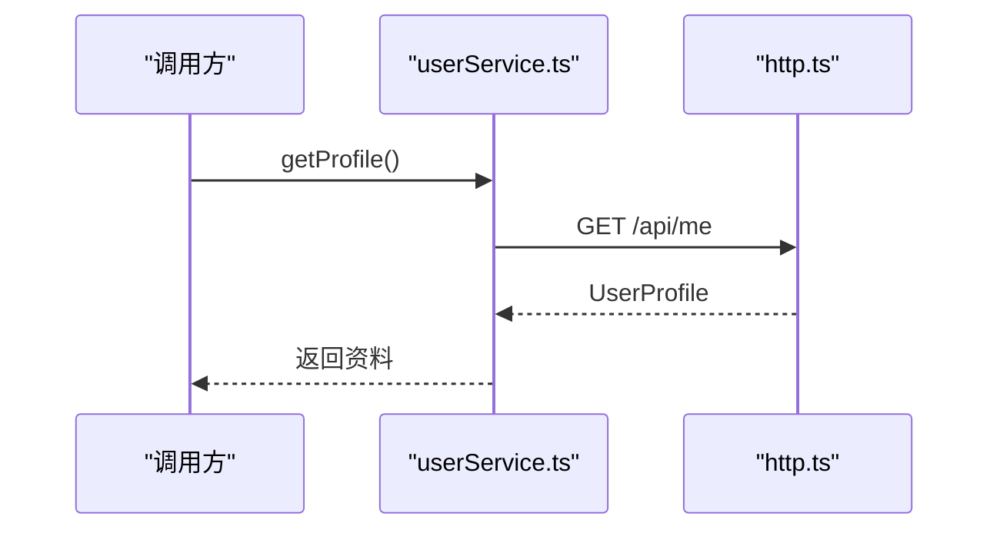
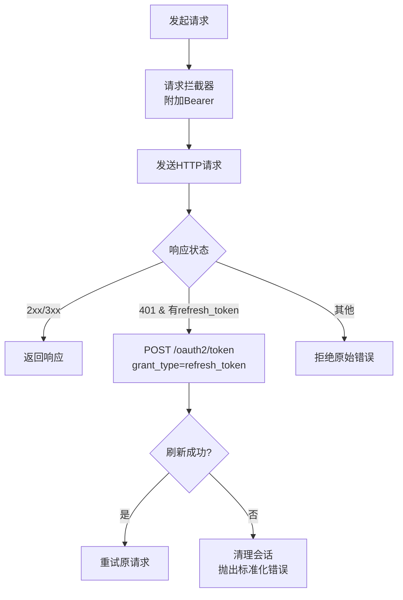
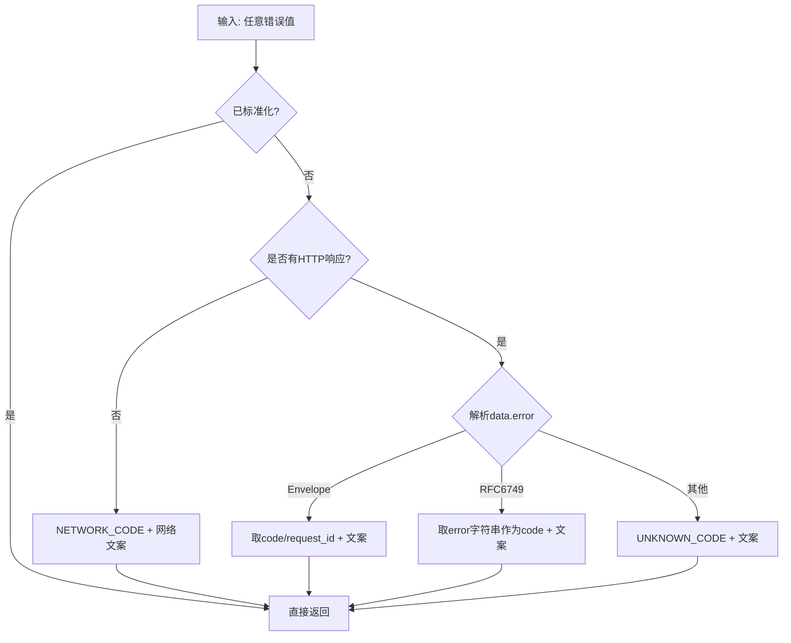
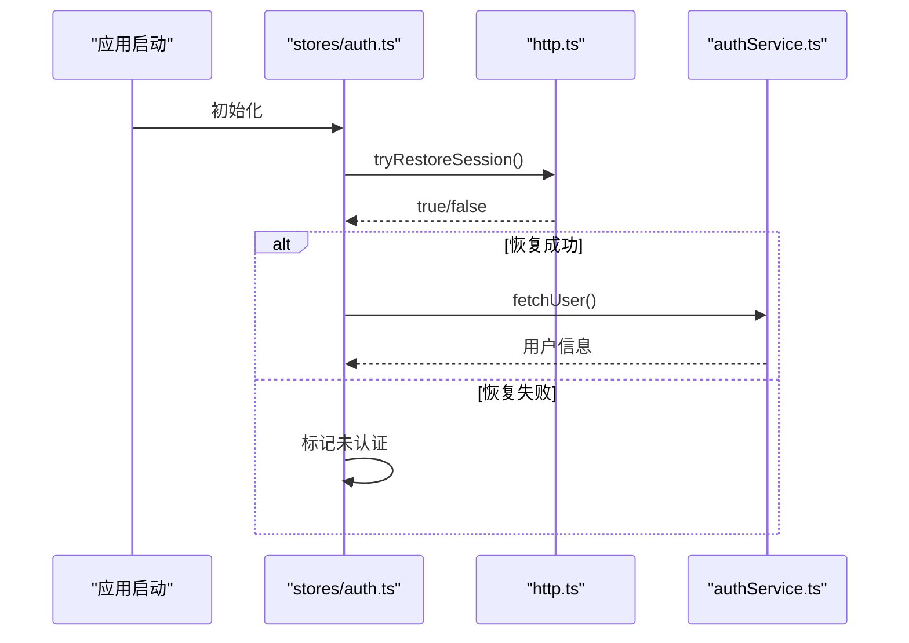
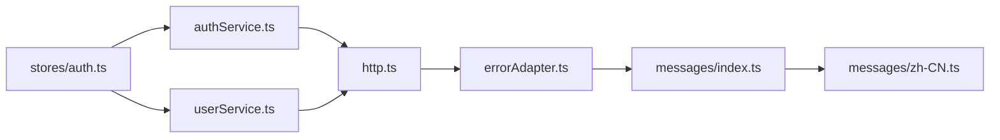

# 服务层封装

<cite>
**本文引用的文件**
- [authService.ts](file://frontends/user/src/services/authService.ts)
- [userService.ts](file://frontends/user/src/services/userService.ts)
- [http.ts](file://frontends/user/src/services/http.ts)
- [errorAdapter.ts](file://frontends/user/src/services/errorAdapter.ts)
- [index.ts（消息目录）](file://frontends/user/src/services/messages/index.ts)
- [zh-CN.ts（中文消息）](file://frontends/user/src/services/messages/zh-CN.ts)
- [types/index.ts（类型定义）](file://frontends/user/src/types/index.ts)
- [stores/auth.ts（认证状态管理）](file://frontends/user/src/stores/auth.ts)
</cite>

## 目录
1. [简介](#简介)
2. [项目结构](#项目结构)
3. [核心组件](#核心组件)
4. [架构总览](#架构总览)
5. [详细组件分析](#详细组件分析)
6. [依赖关系分析](#依赖关系分析)
7. [性能与缓存策略](#性能与缓存策略)
8. [故障排查指南](#故障排查指南)
9. [结论](#结论)
10. [附录：API 参考与最佳实践](#附录api-参考与最佳实践)

## 简介
本文件面向 AuthForge 用户端前端的服务层封装，聚焦以下四个模块：
- 认证服务 authService.ts：登录、注册、登出、MFA、授权码交换、令牌刷新与会话恢复。
- 用户服务 userService.ts：用户信息获取、资料更新、MFA 设置、已授权应用管理等。
- HTTP 客户端 http.ts：基于 axios 的请求封装，包含请求拦截器、响应处理、自动重试、超时配置与跨域相关行为。
- 错误适配器 errorAdapter.ts：统一错误归一化、用户友好提示、错误日志记录与异常恢复。

文档同时覆盖依赖注入方式、接口设计、异步处理、缓存策略、性能优化、API 版本管理与请求监控等最佳实践。

## 项目结构
服务层位于 frontends/user/src/services 下，围绕“网络层—业务服务—状态管理”的分层组织：
- http.ts：网络基础能力（axios 实例、拦截器、令牌管理、会话恢复）。
- authService.ts / userService.ts：按领域划分的业务服务。
- errorAdapter.ts + messages/*：统一的错误归一化与本地化文案。
- stores/auth.ts：Pinia 状态管理，编排认证流程与用户数据加载。
- types/index.ts：共享类型定义。

图表来源
- [authService.ts:1-90](file://frontends/user/src/services/authService.ts#L1-L90)
- [userService.ts:1-52](file://frontends/user/src/services/userService.ts#L1-L52)
- [http.ts:1-121](file://frontends/user/src/services/http.ts#L1-L121)
- [errorAdapter.ts:1-184](file://frontends/user/src/services/errorAdapter.ts#L1-L184)
- [messages/index.ts:1-59](file://frontends/user/src/services/messages/index.ts#L1-L59)
- [messages/zh-CN.ts:1-71](file://frontends/user/src/services/messages/zh-CN.ts#L1-L71)
- [stores/auth.ts:1-101](file://frontends/user/src/stores/auth.ts#L1-L101)

章节来源
- [authService.ts:1-90](file://frontends/user/src/services/authService.ts#L1-L90)
- [userService.ts:1-52](file://frontends/user/src/services/userService.ts#L1-L52)
- [http.ts:1-121](file://frontends/user/src/services/http.ts#L1-L121)
- [errorAdapter.ts:1-184](file://frontends/user/src/services/errorAdapter.ts#L1-L184)
- [messages/index.ts:1-59](file://frontends/user/src/services/messages/index.ts#L1-L59)
- [messages/zh-CN.ts:1-71](file://frontends/user/src/services/messages/zh-CN.ts#L1-L71)
- [stores/auth.ts:1-101](file://frontends/user/src/stores/auth.ts#L1-L101)

## 核心组件
- 认证服务（authService.ts）
  - 登录：调用 OAuth2 登录端点，必要时进入 MFA 流程；成功后通过授权码换取令牌并持久化 refresh_token。
  - MFA 校验：使用 mfa_token 与验证码换取令牌。
  - 授权码交换：回调页将 code 交换为令牌。
  - 注册与密码重置：调用用户账户相关 API。
  - 登出：撤销访问令牌并清理本地令牌。
- 用户服务（userService.ts）
  - 获取用户信息：OAuth2 userinfo 与个人资料接口。
  - 修改密码、MFA 设置/验证/禁用。
  - 已授权应用列表与撤销授权。
  - 邮箱验证重发与验证。
- HTTP 客户端（http.ts）
  - axios 实例：默认 Content-Type 为表单编码，设置超时与 baseURL。
  - 令牌管理：内存中保存 access_token，localStorage 保存 refresh_token。
  - 请求拦截器：自动附加 Bearer token。
  - 响应拦截器：401 时尝试静默刷新令牌；失败则清理会话并抛出标准化错误。
  - 会话恢复：页面加载时尝试用 refresh_token 恢复会话。
- 错误适配器（errorAdapter.ts）
  - normalizeError：将任意错误归一化为稳定结构，支持 Error Envelope、RFC 6749 协议错误、未知错误与网络错误。
  - sessionExpiredError：构造“会话过期”的标准化错误，供 401 刷新失败路径复用。
  - 本地化：通过 messages/index.ts 与 zh-CN.ts 提供多语言文案。

章节来源
- [authService.ts:1-90](file://frontends/user/src/services/authService.ts#L1-L90)
- [userService.ts:1-52](file://frontends/user/src/services/userService.ts#L1-L52)
- [http.ts:1-121](file://frontends/user/src/services/http.ts#L1-L121)
- [errorAdapter.ts:1-184](file://frontends/user/src/services/errorAdapter.ts#L1-L184)
- [messages/index.ts:1-59](file://frontends/user/src/services/messages/index.ts#L1-L59)
- [messages/zh-CN.ts:1-71](file://frontends/user/src/services/messages/zh-CN.ts#L1-L71)

## 架构总览
下图展示从页面到后端的关键调用链路与错误处理路径。

图表来源
- [authService.ts:8-34](file://frontends/user/src/services/authService.ts#L8-L34)
- [authService.ts:36-58](file://frontends/user/src/services/authService.ts#L36-L58)
- [userService.ts:5-13](file://frontends/user/src/services/userService.ts#L5-L13)
- [http.ts:56-118](file://frontends/user/src/services/http.ts#L56-L118)
- [errorAdapter.ts:160-181](file://frontends/user/src/services/errorAdapter.ts#L160-L181)
- [messages/index.ts:37-58](file://frontends/user/src/services/messages/index.ts#L37-L58)
- [messages/zh-CN.ts:15-71](file://frontends/user/src/services/messages/zh-CN.ts#L15-L71)

## 详细组件分析

### 认证服务（authService.ts）
职责边界
- 封装 OAuth2 登录、MFA、授权码交换、注册、密码重置、登出等认证相关 API。
- 通过 http.ts 的 setTokens/clearTokens 管理令牌生命周期。

关键流程
- 登录：先走 /oauth2/login，若返回 mfa_required 则进入 MFA；否则用 code 换取令牌并存储。
- MFA 校验：使用 mfa_token 与验证码换取令牌。
- 授权码交换：在回调页将 code 交换为令牌。
- 登出：调用 /oauth2/revoke 撤销令牌，再清理本地令牌。

错误处理
- 登录/MFA 失败由上层 store 统一通过 normalizeError 处理。
- 登出过程对 revoke 失败进行容错，确保最终清理本地令牌。

图表来源
- [authService.ts:8-34](file://frontends/user/src/services/authService.ts#L8-L34)

章节来源
- [authService.ts:8-34](file://frontends/user/src/services/authService.ts#L8-L34)
- [authService.ts:36-58](file://frontends/user/src/services/authService.ts#L36-L58)
- [authService.ts:76-88](file://frontends/user/src/services/authService.ts#L76-L88)

### 用户服务（userService.ts）
职责边界
- 提供用户信息查询、资料更新、MFA 管理、已授权应用管理、邮箱验证等功能。

关键接口
- 获取用户信息：/oauth2/userinfo 与 /api/me。
- 修改密码：PUT /api/me/password。
- MFA 设置/验证/禁用：/api/me/mfa/*。
- 已授权应用：GET/DELETE /api/me/authorized-apps/*。
- 邮箱验证：POST /api/verify-email/resend，GET /api/verify-email?token=...。

错误处理
- 所有请求的错误由 http.ts 统一处理，业务侧无需重复捕获。

图表来源
- [userService.ts:10-13](file://frontends/user/src/services/userService.ts#L10-L13)

章节来源
- [userService.ts:5-50](file://frontends/user/src/services/userService.ts#L5-L50)

### HTTP 客户端（http.ts）
设计与实现要点
- 实例配置：baseURL 来自环境变量，默认超时 15000ms，默认 Content-Type 为 application/x-www-form-urlencoded。
- 令牌管理：
  - accessToken：仅内存持有，降低 XSS 风险。
  - refreshToken：持久化至 localStorage，用于页面重载后恢复会话。
- 请求拦截器：自动为未显式指定 Authorization 的请求附加 Bearer token。
- 响应拦截器：
  - 401 且存在 refresh_token 且非 OAuth 路由：尝试静默刷新令牌，成功后重试原请求。
  - 刷新失败：清理会话，抛出标准化的“会话过期”错误，并导航到登录页。
- 会话恢复：页面加载时尝试用 refresh_token 换取新令牌。

图表来源
- [http.ts:5-9](file://frontends/user/src/services/http.ts#L5-L9)
- [http.ts:17-31](file://frontends/user/src/services/http.ts#L17-L31)
- [http.ts:37-54](file://frontends/user/src/services/http.ts#L37-L54)
- [http.ts:56-62](file://frontends/user/src/services/http.ts#L56-L62)
- [http.ts:82-118](file://frontends/user/src/services/http.ts#L82-L118)

章节来源
- [http.ts:5-121](file://frontends/user/src/services/http.ts#L5-L121)

### 错误适配器（errorAdapter.ts）
设计目标
- 单一事实来源：前后端共用错误归一化逻辑与本地化文案。
- 永不抛错：normalizeError 始终返回稳定的 NormalizedError 对象。
- 优先级解析：
  1) Error Envelope（error.code）
  2) RFC 6749 协议错误（顶层 error 字符串）
  3) 有 body 但不匹配 → UNKNOWN_CODE
  4) 无 HTTP 响应（网络/超时）→ NETWORK_CODE

本地化与回退
- 通过 messages/index.ts 的 getErrorMessage 获取文案，缺失 key 时告警并回退到 __unknown__。
- 会话过期专用错误：sessionExpiredError 构造带品牌标记的标准化错误，便于幂等处理。

图表来源
- [errorAdapter.ts:73-158](file://frontends/user/src/services/errorAdapter.ts#L73-L158)
- [messages/index.ts:37-58](file://frontends/user/src/services/messages/index.ts#L37-L58)
- [messages/zh-CN.ts:15-71](file://frontends/user/src/services/messages/zh-CN.ts#L15-L71)

章节来源
- [errorAdapter.ts:1-184](file://frontends/user/src/services/errorAdapter.ts#L1-L184)
- [messages/index.ts:1-59](file://frontends/user/src/services/messages/index.ts#L1-L59)
- [messages/zh-CN.ts:1-71](file://frontends/user/src/services/messages/zh-CN.ts#L1-L71)

### 状态管理集成（stores/auth.ts）
- 初始化：检测是否存在 refresh_token，若有则尝试恢复会话并拉取用户信息。
- 登录/验证MFA：调用 authService，成功后标记已认证并拉取用户信息。
- 登出：调用 authService.logout，清空本地令牌与用户状态。
- 错误展示：统一通过 normalizeError 获取用户可读消息。

图表来源
- [stores/auth.ts:21-35](file://frontends/user/src/stores/auth.ts#L21-L35)
- [http.ts:37-54](file://frontends/user/src/services/http.ts#L37-L54)

章节来源
- [stores/auth.ts:1-101](file://frontends/user/src/stores/auth.ts#L1-L101)

## 依赖关系分析
- authService.ts 依赖 http.ts 的 setTokens/clearTokens/getAccessToken 以及类型定义。
- userService.ts 依赖 http.ts 与类型定义。
- http.ts 依赖 errorAdapter.ts 的 sessionExpiredError 与 NormalizedError 类型。
- errorAdapter.ts 依赖 messages/index.ts 与 zh-CN.ts 提供的本地化文案。
- stores/auth.ts 组合上述服务，协调认证流程与用户数据加载。

图表来源
- [authService.ts:1-2](file://frontends/user/src/services/authService.ts#L1-L2)
- [userService.ts:1-2](file://frontends/user/src/services/userService.ts#L1-L2)
- [http.ts:1-3](file://frontends/user/src/services/http.ts#L1-L3)
- [errorAdapter.ts:22-27](file://frontends/user/src/services/errorAdapter.ts#L22-L27)
- [messages/index.ts:19-31](file://frontends/user/src/services/messages/index.ts#L19-L31)
- [stores/auth.ts:1-7](file://frontends/user/src/stores/auth.ts#L1-L7)

章节来源
- [authService.ts:1-2](file://frontends/user/src/services/authService.ts#L1-L2)
- [userService.ts:1-2](file://frontends/user/src/services/userService.ts#L1-L2)
- [http.ts:1-3](file://frontends/user/src/services/http.ts#L1-L3)
- [errorAdapter.ts:22-27](file://frontends/user/src/services/errorAdapter.ts#L22-L27)
- [messages/index.ts:19-31](file://frontends/user/src/services/messages/index.ts#L19-L31)
- [stores/auth.ts:1-7](file://frontends/user/src/stores/auth.ts#L1-L7)

## 性能与缓存策略
- 令牌缓存
  - access_token 仅内存缓存，避免持久化带来的 XSS 风险。
  - refresh_token 持久化至 localStorage，支持页面重载后静默恢复会话。
- 自动重试
  - 401 时自动刷新令牌并重试一次，减少用户感知到的失败。
- 超时与并发
  - 默认超时 15000ms，可根据网络环境调整。
  - 建议结合请求去抖/合并策略，避免短时间内重复刷新令牌。
- 资源预取
  - 登录后立即拉取用户信息，减少后续页面渲染等待。
- 扩展建议
  - 可引入请求级缓存（如 GET 请求短期缓存）以减少重复请求。
  - 可对高频只读数据增加失效策略（时间戳或版本号）。

[本节为通用指导，不直接分析具体文件]

## 故障排查指南
常见问题与定位步骤
- 登录失败
  - 检查 /oauth2/login 返回是否包含 mfa_required 或 code。
  - 查看 normalizeError 输出的 code 与 message，确认是否为网络错误或参数错误。
- 401 频繁出现
  - 确认 refresh_token 是否存在且有效。
  - 检查 /oauth2/token 刷新流程是否被正确触发。
  - 若刷新失败，会跳转到登录页并显示“登录已过期”。
- 用户信息为空
  - 登录后确认已成功 setTokens。
  - 检查 /oauth2/userinfo 与 /api/me 是否返回数据。
- 邮箱验证失败
  - 检查 /api/verify-email/resend 与 /api/verify-email?token=... 的返回。

章节来源
- [http.ts:82-118](file://frontends/user/src/services/http.ts#L82-L118)
- [errorAdapter.ts:73-158](file://frontends/user/src/services/errorAdapter.ts#L73-L158)
- [stores/auth.ts:37-77](file://frontends/user/src/stores/auth.ts#L37-L77)

## 结论
该服务层以清晰的分层与职责划分实现了认证与用户管理的完整闭环：
- http.ts 提供健壮的网络能力与令牌管理。
- authService.ts 与 userService.ts 按领域封装 API 调用。
- errorAdapter.ts 统一错误归一化与本地化，提升用户体验与可维护性。
- stores/auth.ts 编排认证流程与状态同步。
整体设计具备良好的可扩展性与可测试性，适合持续演进与接入更多功能。

[本节为总结，不直接分析具体文件]

## 附录：API 参考与最佳实践

### API 版本管理
- 建议在 baseURL 或请求头中携带 API 版本标识（例如 /api/v1），并在服务端做兼容层。
- 对于破坏性变更，优先采用新增端点+旧端点弃用公告的策略。

### 请求监控
- 可在 http.ts 的请求/响应拦截器中加入埋点：记录 URL、方法、耗时、状态码、错误码。
- 对慢请求与高错误率端点进行告警与采样上报。

### 服务扩展
- 新增领域服务时，遵循“服务层只负责编排与转换，网络细节留在 http.ts”的原则。
- 错误文案统一通过 errorAdapter.ts 与 messages/* 管理，避免硬编码。

### 安全与合规
- 不在前端存储敏感凭据（access_token 仅内存）。
- 对所有写操作进行必要的鉴权与参数校验。
- 对重定向与回调地址进行白名单校验（当前由服务端保障）。

[本节为通用指导，不直接分析具体文件]