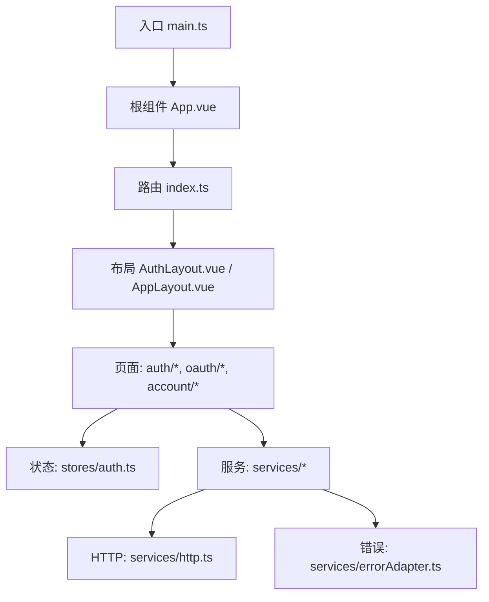
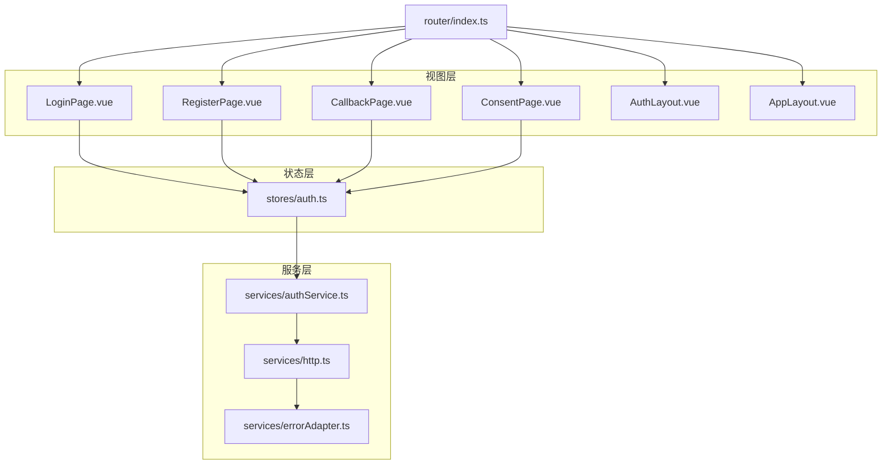
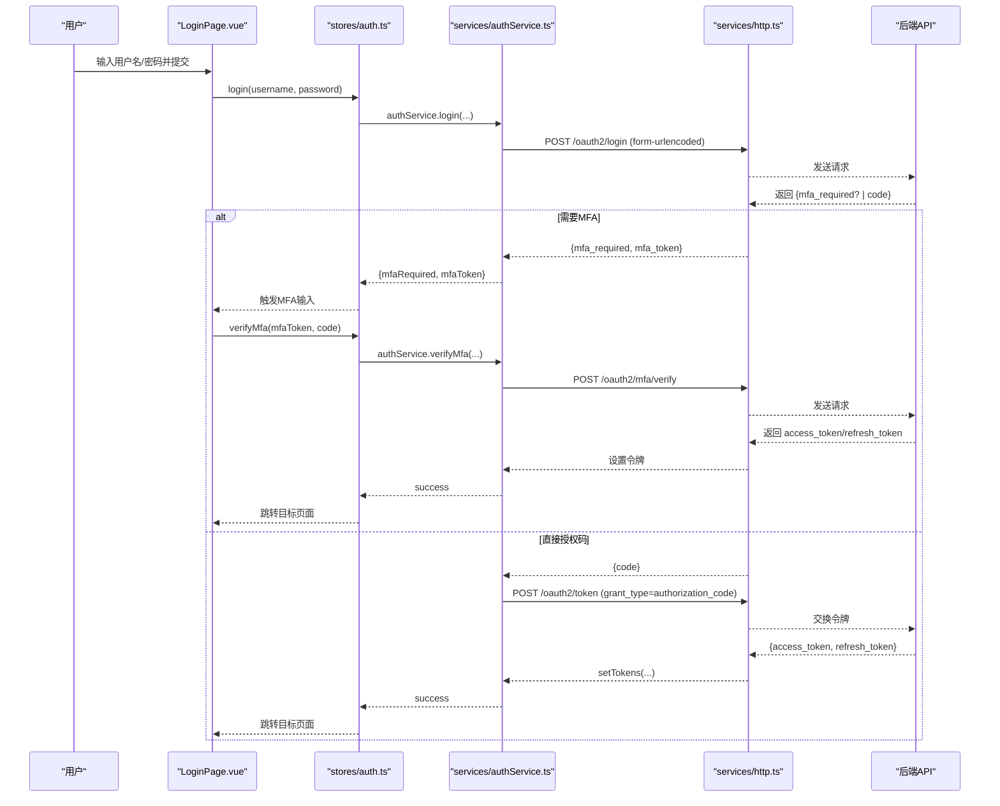
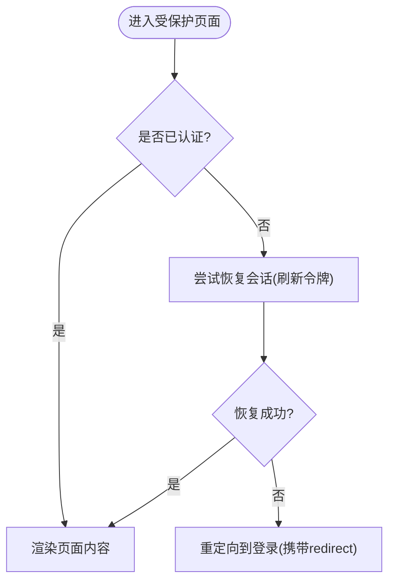
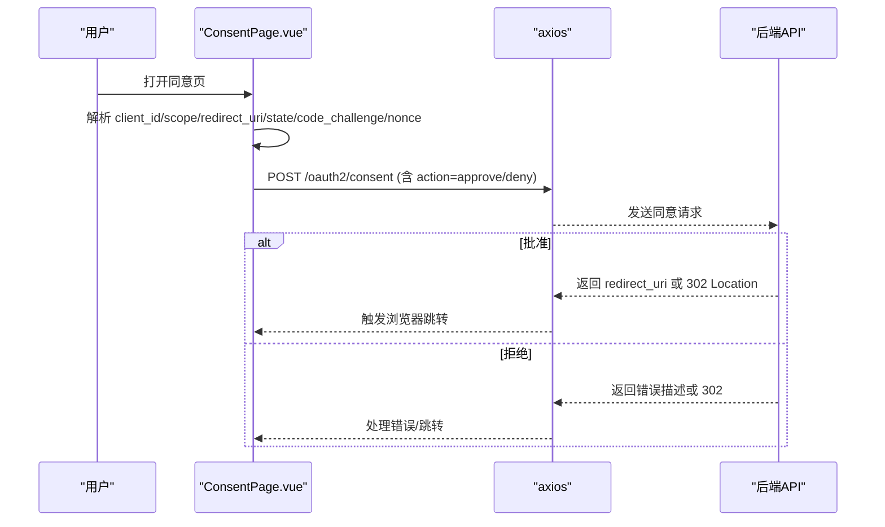
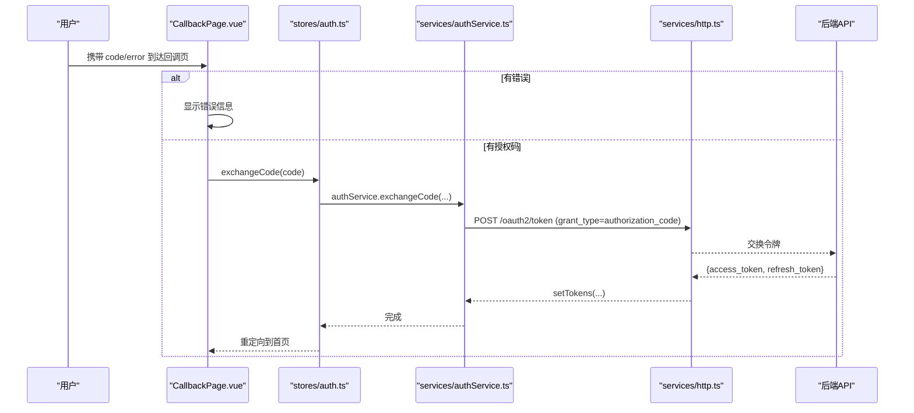
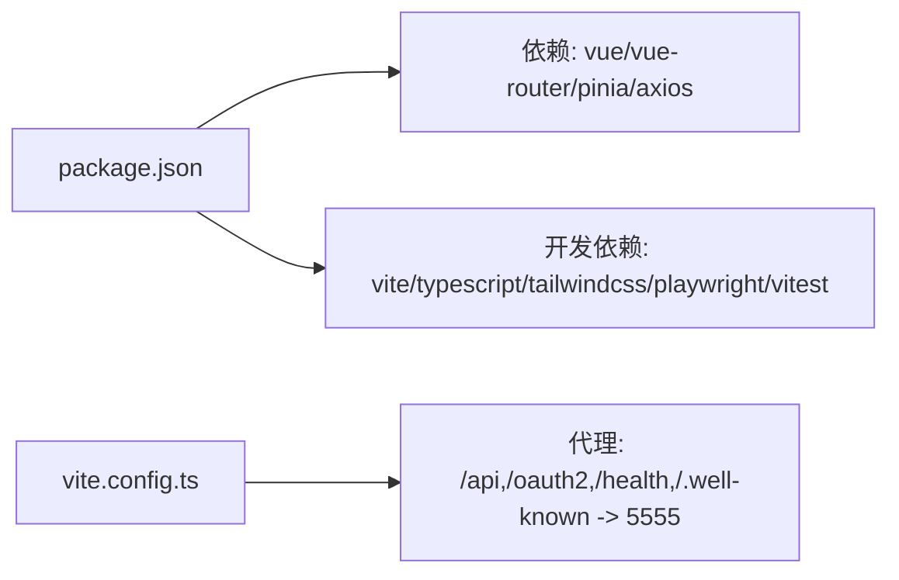

# 用户界面

<cite>
**本文引用的文件**
- [frontends/user/src/main.ts](file://frontends/user/src/main.ts)
- [frontends/user/src/App.vue](file://frontends/user/src/App.vue)
- [frontends/user/src/router/index.ts](file://frontends/user/src/router/index.ts)
- [frontends/user/src/layouts/AuthLayout.vue](file://frontends/user/src/layouts/AuthLayout.vue)
- [frontends/user/src/layouts/AppLayout.vue](file://frontends/user/src/layouts/AppLayout.vue)
- [frontends/user/src/stores/auth.ts](file://frontends/user/src/stores/auth.ts)
- [frontends/user/src/services/authService.ts](file://frontends/user/src/services/authService.ts)
- [frontends/user/src/services/http.ts](file://frontends/user/src/services/http.ts)
- [frontends/user/src/services/errorAdapter.ts](file://frontends/user/src/services/errorAdapter.ts)
- [frontends/user/src/pages/auth/LoginPage.vue](file://frontends/user/src/pages/auth/LoginPage.vue)
- [frontends/user/src/pages/auth/RegisterPage.vue](file://frontends/user/src/pages/auth/RegisterPage.vue)
- [frontends/user/src/pages/oauth/CallbackPage.vue](file://frontends/user/src/pages/oauth/CallbackPage.vue)
- [frontends/user/src/pages/oauth/ConsentPage.vue](file://frontends/user/src/pages/oauth/ConsentPage.vue)
- [frontends/user/package.json](file://frontends/user/package.json)
- [frontends/user/vite.config.ts](file://frontends/user/vite.config.ts)
</cite>

## 目录
1. [简介](#简介)
2. [项目结构](#项目结构)
3. [核心组件](#核心组件)
4. [架构总览](#架构总览)
5. [详细组件分析](#详细组件分析)
6. [依赖关系分析](#依赖关系分析)
7. [性能考虑](#性能考虑)
8. [故障排查指南](#故障排查指南)
9. [结论](#结论)
10. [附录](#附录)

## 简介
本文件面向 AuthForge 用户端前端（Vue 3 + TypeScript + Vite），系统性说明整体架构、技术实现与关键流程，覆盖认证登录注册、账户管理、OAuth 同意页与回调处理。文档重点阐述：
- 设计模式与分层：路由守卫、布局隔离、状态管理（Pinia）、服务层封装（HTTP、错误归一化）
- 安全与会话：JWT 访问令牌与刷新令牌策略、自动刷新与过期处理、注销与撤销
- 交互与体验：表单校验、MFA 流程、第三方登录（GitHub）与 OAuth 授权确认
- 开发指南：组件复用、样式系统（Tailwind CSS）、国际化与可访问性、测试与构建配置

## 项目结构
用户端位于 frontends/user，采用按功能域划分的目录组织：
- pages：页面级视图（auth、oauth、account）
- layouts：应用级布局（AuthLayout 用于认证流程，AppLayout 用于已登录后的账户管理）
- stores：全局状态（Pinia，auth 模块）
- services：服务层（authService、userService、http、errorAdapter、messages）
- components：UI 与共享组件（ui、shared）
- router：路由定义与导航守卫
- styles：设计令牌与全局样式
- vite.config.ts：Vite 构建与开发代理配置
- package.json：依赖与脚本

图表来源
- [frontends/user/src/main.ts:1-11](file://frontends/user/src/main.ts#L1-L11)
- [frontends/user/src/App.vue:1-16](file://frontends/user/src/App.vue#L1-L16)
- [frontends/user/src/router/index.ts:1-97](file://frontends/user/src/router/index.ts#L1-L97)
- [frontends/user/src/layouts/AuthLayout.vue:1-81](file://frontends/user/src/layouts/AuthLayout.vue#L1-L81)
- [frontends/user/src/layouts/AppLayout.vue:1-145](file://frontends/user/src/layouts/AppLayout.vue#L1-L145)
- [frontends/user/src/stores/auth.ts:1-101](file://frontends/user/src/stores/auth.ts#L1-L101)
- [frontends/user/src/services/http.ts:1-121](file://frontends/user/src/services/http.ts#L1-L121)
- [frontends/user/src/services/errorAdapter.ts:1-184](file://frontends/user/src/services/errorAdapter.ts#L1-L184)

章节来源
- [frontends/user/src/main.ts:1-11](file://frontends/user/src/main.ts#L1-L11)
- [frontends/user/src/router/index.ts:1-97](file://frontends/user/src/router/index.ts#L1-L97)
- [frontends/user/package.json:1-33](file://frontends/user/package.json#L1-L33)
- [frontends/user/vite.config.ts:1-29](file://frontends/user/vite.config.ts#L1-L29)

## 核心组件
- 路由与守卫
  - 基于 vue-router 的 SPA 路由，区分 guest、auth 元信息，统一在 beforeEach 中做鉴权与会话恢复
  - 受保护路由在未登录时尝试通过 refresh_token 恢复会话，失败则重定向到登录并携带 redirect
- 状态管理（Pinia）
  - auth store 维护用户信息、加载态、错误信息、认证标志与会话恢复
  - 提供 login、verifyMfa、exchangeCode、fetchUser、logout、restoreSession 等方法
- HTTP 客户端
  - axios 实例，默认请求头为 form-urlencoded；拦截器负责注入 Bearer token、401 自动刷新与失败跳转
  - 令牌策略：access_token 仅内存存储，refresh_token 持久化至 localStorage
- 错误归一化
  - normalizeError 将任意错误对象转换为稳定结构（code、message、request_id、httpStatus），支持 Error Envelope、RFC 6749 协议错误、未知错误与网络异常
  - sessionExpiredError 用于 401 刷新失败时的统一提示与跳转

章节来源
- [frontends/user/src/router/index.ts:1-97](file://frontends/user/src/router/index.ts#L1-L97)
- [frontends/user/src/stores/auth.ts:1-101](file://frontends/user/src/stores/auth.ts#L1-L101)
- [frontends/user/src/services/http.ts:1-121](file://frontends/user/src/services/http.ts#L1-L121)
- [frontends/user/src/services/errorAdapter.ts:1-184](file://frontends/user/src/services/errorAdapter.ts#L1-L184)

## 架构总览
前端采用“视图-状态-服务”的分层架构：
- 视图层：页面组件与布局组件，负责展示与用户交互
- 状态层：Pinia store，集中管理认证状态与用户数据
- 服务层：HTTP 封装、错误归一化、业务 API 调用（登录、注册、密码重置、OAuth 等）
- 路由层：导航与权限控制，结合 meta 字段进行访问控制

图表来源
- [frontends/user/src/pages/auth/LoginPage.vue:1-146](file://frontends/user/src/pages/auth/LoginPage.vue#L1-L146)
- [frontends/user/src/pages/auth/RegisterPage.vue:1-94](file://frontends/user/src/pages/auth/RegisterPage.vue#L1-L94)
- [frontends/user/src/pages/oauth/CallbackPage.vue:1-50](file://frontends/user/src/pages/oauth/CallbackPage.vue#L1-L50)
- [frontends/user/src/pages/oauth/ConsentPage.vue:1-106](file://frontends/user/src/pages/oauth/ConsentPage.vue#L1-L106)
- [frontends/user/src/layouts/AuthLayout.vue:1-81](file://frontends/user/src/layouts/AuthLayout.vue#L1-L81)
- [frontends/user/src/layouts/AppLayout.vue:1-145](file://frontends/user/src/layouts/AppLayout.vue#L1-L145)
- [frontends/user/src/stores/auth.ts:1-101](file://frontends/user/src/stores/auth.ts#L1-L101)
- [frontends/user/src/services/authService.ts:1-90](file://frontends/user/src/services/authService.ts#L1-L90)
- [frontends/user/src/services/http.ts:1-121](file://frontends/user/src/services/http.ts#L1-L121)
- [frontends/user/src/services/errorAdapter.ts:1-184](file://frontends/user/src/services/errorAdapter.ts#L1-L184)
- [frontends/user/src/router/index.ts:1-97](file://frontends/user/src/router/index.ts#L1-L97)

## 详细组件分析

### 认证流程页面（Login、Register、ForgotPassword、ResetPassword、VerifyEmail）
- 登录（LoginPage）
  - 支持用户名/密码登录与 GitHub 第三方登录
  - 若后端返回 mfa_required，进入 MFA 二次验证流程
  - 成功后根据 query.redirect 或默认首页跳转
- 注册（RegisterPage）
  - 本地表单校验（密码长度、确认密码一致）
  - 调用注册接口后显示成功提示并跳转登录
- 忘记密码/重置密码/邮箱验证
  - 路由定义包含 forgot-password、reset-password、verify-email，遵循与登录相同的布局与错误处理机制

图表来源
- [frontends/user/src/pages/auth/LoginPage.vue:1-146](file://frontends/user/src/pages/auth/LoginPage.vue#L1-L146)
- [frontends/user/src/stores/auth.ts:1-101](file://frontends/user/src/stores/auth.ts#L1-L101)
- [frontends/user/src/services/authService.ts:1-90](file://frontends/user/src/services/authService.ts#L1-L90)
- [frontends/user/src/services/http.ts:1-121](file://frontends/user/src/services/http.ts#L1-L121)

章节来源
- [frontends/user/src/pages/auth/LoginPage.vue:1-146](file://frontends/user/src/pages/auth/LoginPage.vue#L1-L146)
- [frontends/user/src/pages/auth/RegisterPage.vue:1-94](file://frontends/user/src/pages/auth/RegisterPage.vue#L1-L94)
- [frontends/user/src/router/index.ts:1-97](file://frontends/user/src/router/index.ts#L1-L97)

### 账户管理（Account Management）
- 布局与导航
  - 使用 AppLayout 作为已登录后的主布局，顶部导航包含概览、个人资料、安全、已授权应用
  - 用户菜单支持快速跳转到资料与安全页，并提供登出操作
- 受保护路由
  - 路由 meta.auth=true 的页面由 beforeEach 守卫保护，未登录且无法恢复会话时重定向到登录并携带 redirect
- 功能要点
  - 个人资料与安全设置页面通过 userService 获取用户信息，结合 Pinia 状态更新 UI
  - 登出调用 authService.logout，清理本地令牌并跳转登录

图表来源
- [frontends/user/src/router/index.ts:78-94](file://frontends/user/src/router/index.ts#L78-L94)
- [frontends/user/src/stores/auth.ts:21-35](file://frontends/user/src/stores/auth.ts#L21-L35)
- [frontends/user/src/services/http.ts:37-54](file://frontends/user/src/services/http.ts#L37-L54)

章节来源
- [frontends/user/src/layouts/AppLayout.vue:1-145](file://frontends/user/src/layouts/AppLayout.vue#L1-L145)
- [frontends/user/src/router/index.ts:63-74](file://frontends/user/src/router/index.ts#L63-L74)
- [frontends/user/src/stores/auth.ts:87-92](file://frontends/user/src/stores/auth.ts#L87-L92)

### OAuth 同意页面（ConsentPage）
- 作用
  - 展示第三方应用请求的权限范围（scope），用户可选择批准或拒绝
  - 透传 PKCE/nonce 参数以确保授权码与后续令牌交换的安全链完整
- 交互流程
  - 读取路由查询参数（client_id、scope、redirect_uri、state、code_challenge、nonce）
  - 提交 /oauth2/consent，服务器返回 redirect_uri（带授权码）或直接 302 跳转
  - 浏览器最终回到应用的回调地址

图表来源
- [frontends/user/src/pages/oauth/ConsentPage.vue:1-106](file://frontends/user/src/pages/oauth/ConsentPage.vue#L1-L106)

章节来源
- [frontends/user/src/pages/oauth/ConsentPage.vue:1-106](file://frontends/user/src/pages/oauth/ConsentPage.vue#L1-L106)

### 回调页面（CallbackPage）
- 作用
  - 接收 OAuth 授权码或错误参数，调用 store 的 exchangeCode 完成令牌交换
  - 成功后重定向到首页或原始 redirect
- 错误处理
  - 若存在 error 参数，显示错误信息并允许返回登录

图表来源
- [frontends/user/src/pages/oauth/CallbackPage.vue:1-50](file://frontends/user/src/pages/oauth/CallbackPage.vue#L1-L50)
- [frontends/user/src/stores/auth.ts:73-77](file://frontends/user/src/stores/auth.ts#L73-L77)
- [frontends/user/src/services/authService.ts:50-58](file://frontends/user/src/services/authService.ts#L50-L58)
- [frontends/user/src/services/http.ts:1-121](file://frontends/user/src/services/http.ts#L1-L121)

章节来源
- [frontends/user/src/pages/oauth/CallbackPage.vue:1-50](file://frontends/user/src/pages/oauth/CallbackPage.vue#L1-L50)

## 依赖关系分析
- 运行时依赖
  - Vue 3、Vue Router、Pinia、Axios
- 构建与工具
  - Vite、TypeScript、Tailwind CSS、Playwright（E2E）、Vitest（单元测试）
- 开发代理
  - 开发服务器将 /api、/oauth2、/health、/.well-known 代理到后端 5555 端口

图表来源
- [frontends/user/package.json:1-33](file://frontends/user/package.json#L1-L33)
- [frontends/user/vite.config.ts:1-29](file://frontends/user/vite.config.ts#L1-L29)

章节来源
- [frontends/user/package.json:1-33](file://frontends/user/package.json#L1-L33)
- [frontends/user/vite.config.ts:1-29](file://frontends/user/vite.config.ts#L1-L29)

## 性能考虑
- 令牌最小暴露面
  - access_token 仅内存保存，降低 XSS 风险；refresh_token 持久化用于会话恢复
- 自动刷新与重试
  - 401 响应时自动使用 refresh_token 刷新并重试原请求，减少用户中断
- 路由懒加载
  - 页面组件通过动态 import 按需加载，减小首屏体积
- 构建优化
  - Vite + Vue 插件与 Tailwind CSS 按需生成样式，提升打包效率
- 网络超时与错误归一化
  - 统一超时与错误处理，避免重复解析与不一致的用户提示

[本节为通用指导，不直接分析具体文件]

## 故障排查指南
- 常见错误类型与处理
  - 网络错误/超时：normalizeError 返回网络错误码与本地化消息
  - 协议错误：识别 RFC 6749 错误码并映射为用户可读消息
  - 会话过期：401 刷新失败时，清除令牌、显示“登录已过期”并跳转登录
- 定位步骤
  - 检查浏览器控制台与网络面板，确认请求路径与响应体
  - 查看路由守卫是否正确处理 guest/auth 元信息
  - 核对环境变量（VITE_API_BASE_URL、VITE_CLIENT_ID、VITE_REDIRECT_URI、VITE_GITHUB_CLIENT_ID）
- 常见问题
  - 回调页无 code：检查授权流程是否被拦截或重定向丢失
  - 同意页未透传 code_challenge/nonce：确保从路由查询参数正确传递
  - 登录后未跳转：检查 store 的 markAuthenticated 与 fetchUser 执行顺序

章节来源
- [frontends/user/src/services/errorAdapter.ts:1-184](file://frontends/user/src/services/errorAdapter.ts#L1-L184)
- [frontends/user/src/services/http.ts:82-117](file://frontends/user/src/services/http.ts#L82-L117)
- [frontends/user/src/router/index.ts:78-94](file://frontends/user/src/router/index.ts#L78-L94)

## 结论
AuthForge 用户端以清晰的层次结构与稳健的错误处理为基础，实现了完整的认证、授权与账户管理能力。通过 Pinia 集中状态、Axios 拦截器统一令牌与刷新、以及规范化的错误归一化，保证了用户体验的一致性与安全性。配合路由守卫与布局隔离，既满足了不同场景下的界面需求，也为后续扩展（更多第三方登录、多租户、MFA 增强）提供了良好基础。

[本节为总结性内容，不直接分析具体文件]

## 附录
- 开发指南
  - 组件复用：将表单元素、按钮、提示框等抽取为 ui/shared 组件，保持风格一致
  - 样式系统：使用 Tailwind CSS 原子类，结合 design-tokens.css 统一管理设计变量
  - 国际化：通过 messages 模块提供错误消息与文案，normalizeError 支持 locale 参数
  - 可访问性：为交互元素添加 aria 属性与键盘焦点管理，确保屏幕阅读器友好
- 安全最佳实践
  - 不在 localStorage 中保存 access_token；仅在必要时持久化 refresh_token
  - 使用 state 与 PKCE（code_challenge/code_challenge_method）防止 CSRF 与授权码劫持
  - 对敏感操作（如注销）调用后端撤销接口，清理服务端会话
- 测试与构建
  - 使用 Playwright 进行端到端测试，覆盖登录、注册、OAuth 流程与账户管理
  - 使用 Vitest 进行单元与属性测试，保证服务层逻辑正确性
  - 构建命令：dev/build/preview；E2E 命令：test:e2e/test:e2e:ui/test:e2e:headed

[本节为通用指导，不直接分析具体文件]