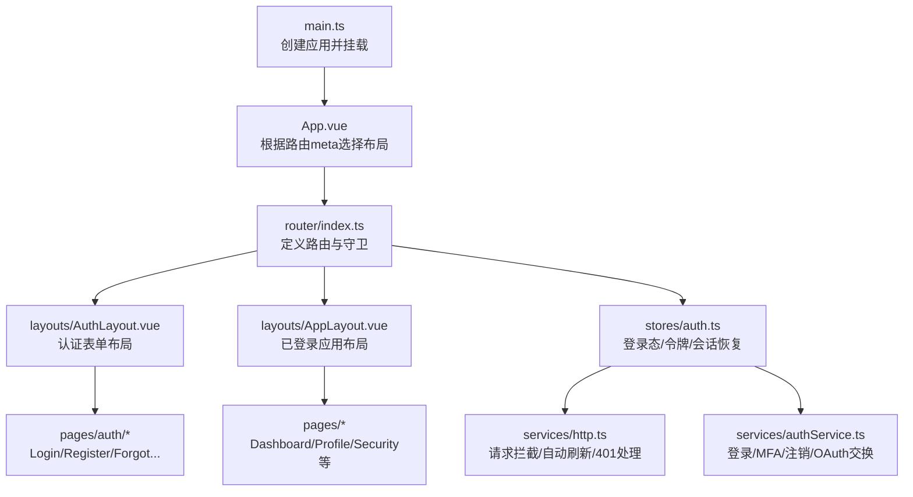
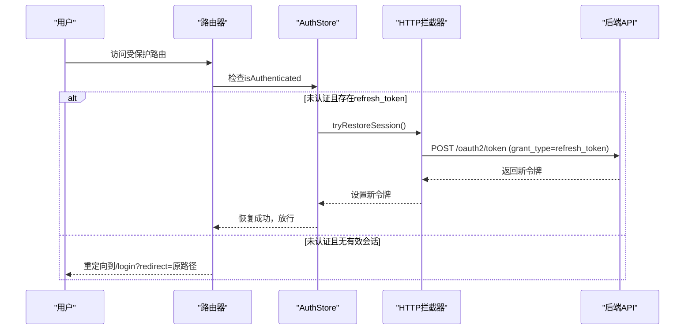
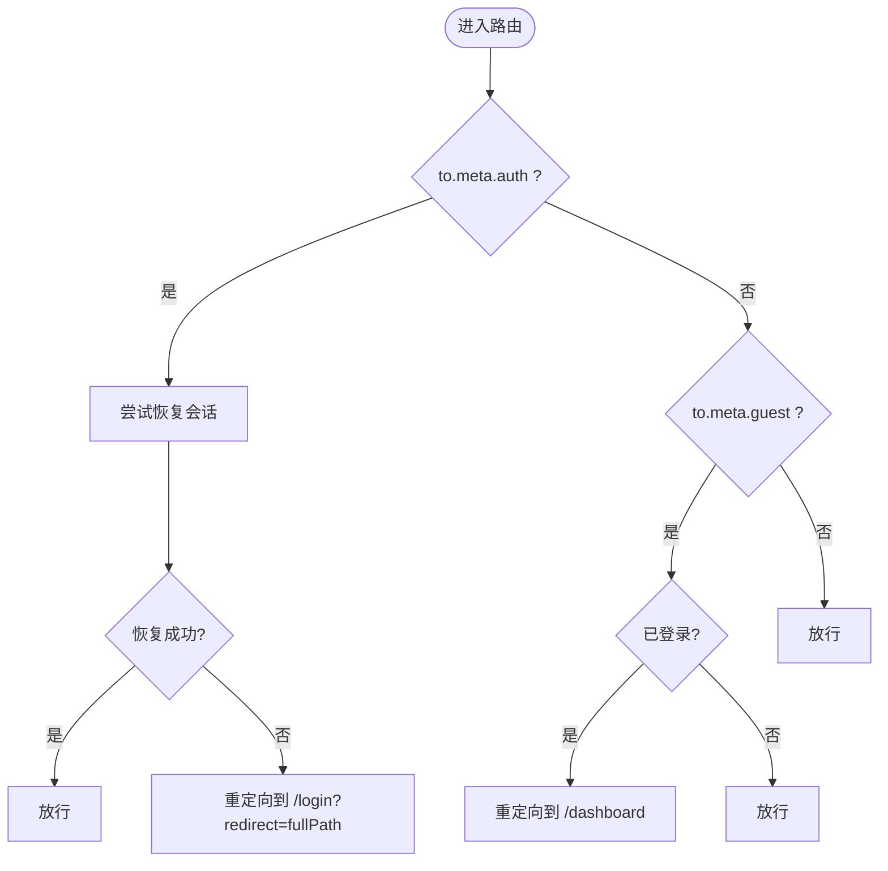
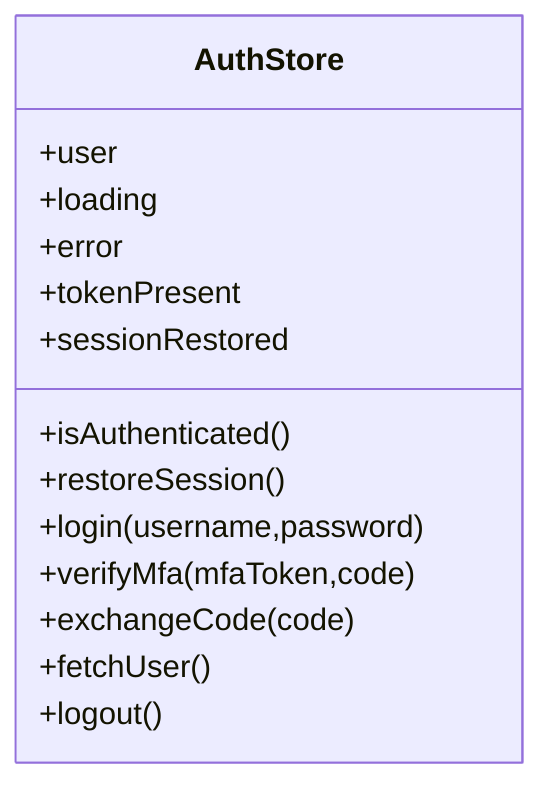
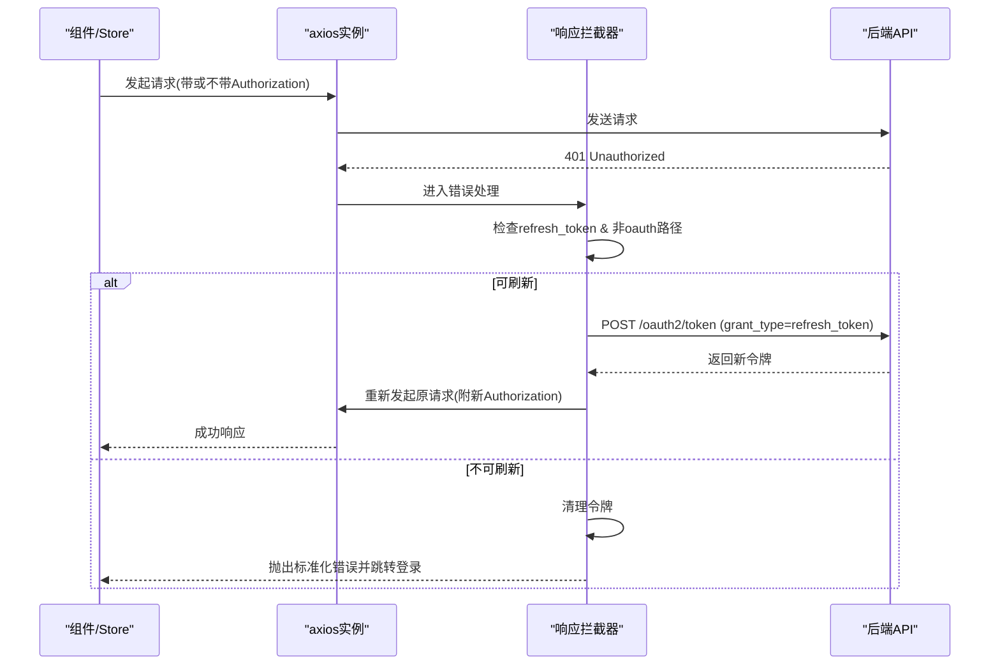
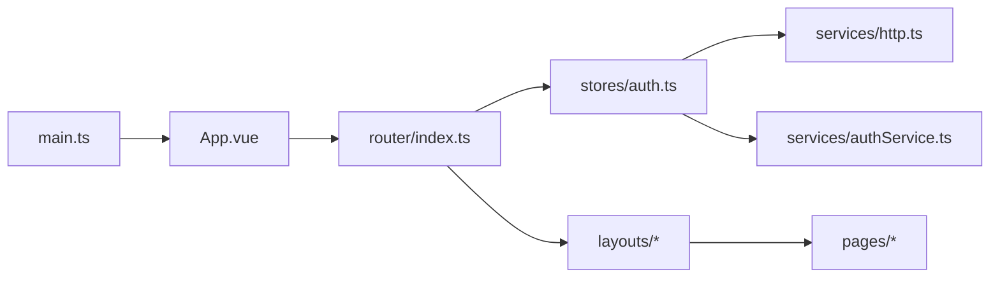

# 界面架构

<cite>
**本文引用的文件**
- [frontends/user/src/App.vue](file://frontends/user/src/App.vue)
- [frontends/user/src/layouts/AuthLayout.vue](file://frontends/user/src/layouts/AuthLayout.vue)
- [frontends/user/src/layouts/AppLayout.vue](file://frontends/user/src/layouts/AppLayout.vue)
- [frontends/user/src/router/index.ts](file://frontends/user/src/router/index.ts)
- [frontends/user/src/stores/auth.ts](file://frontends/user/src/stores/auth.ts)
- [frontends/user/src/services/http.ts](file://frontends/user/src/services/http.ts)
- [frontends/user/src/services/authService.ts](file://frontends/user/src/services/authService.ts)
- [frontends/user/src/types/index.ts](file://frontends/user/src/types/index.ts)
- [frontends/user/src/pages/auth/LoginPage.vue](file://frontends/user/src/pages/auth/LoginPage.vue)
- [frontends/user/src/pages/account/DashboardPage.vue](file://frontends/user/src/pages/account/DashboardPage.vue)
- [frontends/user/src/components/shared/AppLogo.vue](file://frontends/user/src/components/shared/AppLogo.vue)
- [frontends/user/src/main.ts](file://frontends/user/src/main.ts)
</cite>

## 目录
1. [简介](#简介)
2. [项目结构](#项目结构)
3. [核心组件](#核心组件)
4. [架构总览](#架构总览)
5. [详细组件分析](#详细组件分析)
6. [依赖关系分析](#依赖关系分析)
7. [性能考虑](#性能考虑)
8. [故障排查指南](#故障排查指南)
9. [结论](#结论)
10. [附录](#附录)

## 简介
本文件面向AuthForge用户端前端（Vue 3 + Vue Router + Pinia）的界面架构，聚焦以下目标：
- 应用主组件 App.vue 的初始化与全局布局切换策略
- 认证布局 AuthLayout.vue 与应用布局 AppLayout.vue 的设计模式、路由守卫、权限控制与用户状态检测
- 路由配置 router/index.ts 的路由结构、动态/懒加载、嵌套路由与守卫实现
- 认证状态管理 stores/auth.ts 的状态设计：登录态、令牌管理、会话保持与持久化
- 组件层次、依赖注入、事件总线、全局状态管理与跨组件通信机制
- 界面性能优化策略、懒加载与代码分割方案

## 项目结构
用户端前端采用“按功能域组织”的结构：
- layouts：页面级布局（认证布局、应用布局）
- pages：页面组件（认证流程页、账户页、OAuth回调页）
- components：可复用UI与共享组件
- services：HTTP封装、认证服务、错误适配等
- stores：Pinia状态管理（当前为auth store）
- router：路由定义与前置守卫
- types：类型定义

图表来源
- [frontends/user/src/main.ts:1-11](file://frontends/user/src/main.ts#L1-L11)
- [frontends/user/src/App.vue:1-16](file://frontends/user/src/App.vue#L1-L16)
- [frontends/user/src/router/index.ts:1-97](file://frontends/user/src/router/index.ts#L1-L97)
- [frontends/user/src/layouts/AuthLayout.vue:1-81](file://frontends/user/src/layouts/AuthLayout.vue#L1-L81)
- [frontends/user/src/layouts/AppLayout.vue:1-145](file://frontends/user/src/layouts/AppLayout.vue#L1-L145)
- [frontends/user/src/stores/auth.ts:1-101](file://frontends/user/src/stores/auth.ts#L1-L101)
- [frontends/user/src/services/http.ts:1-121](file://frontends/user/src/services/http.ts#L1-L121)
- [frontends/user/src/services/authService.ts:1-90](file://frontends/user/src/services/authService.ts#L1-L90)

章节来源
- [frontends/user/src/main.ts:1-11](file://frontends/user/src/main.ts#L1-L11)
- [frontends/user/src/App.vue:1-16](file://frontends/user/src/App.vue#L1-L16)
- [frontends/user/src/router/index.ts:1-97](file://frontends/user/src/router/index.ts#L1-L97)

## 核心组件
- App.vue：根组件，依据路由 meta.layout 决定渲染认证布局或默认布局；未指定时直接渲染 router-view。
- AuthLayout.vue：左侧品牌展示区+右侧表单内容区的两栏布局，用于登录、注册、忘记密码、邮箱验证等认证流程页面。
- AppLayout.vue：顶部导航+用户菜单+主内容区+底部，用于已登录后的账户相关页面。

职责边界清晰：布局组件不承载业务逻辑，仅负责容器与基础交互（如用户菜单展开/收起、登出跳转）。

章节来源
- [frontends/user/src/App.vue:1-16](file://frontends/user/src/App.vue#L1-L16)
- [frontends/user/src/layouts/AuthLayout.vue:1-81](file://frontends/user/src/layouts/AuthLayout.vue#L1-L81)
- [frontends/user/src/layouts/AppLayout.vue:1-145](file://frontends/user/src/layouts/AppLayout.vue#L1-L145)

## 架构总览
整体数据流与控制流如下：
- 启动阶段：main.ts 创建Vue应用，注册Pinia与Router，挂载到DOM。
- 路由阶段：router/index.ts 定义路由与前置守卫；访问受保护路由时尝试恢复会话；未登录则重定向至登录页并携带redirect参数。
- 状态阶段：stores/auth.ts 维护用户信息、加载状态、错误信息、是否已认证；在模块初始化时若有refresh_token则尝试恢复会话。
- HTTP阶段：services/http.ts 提供axios实例，自动附加Bearer Token，并在401时尝试刷新令牌；失败则清理会话并提示“会话过期”。
- 认证流程：services/authService.ts 封装登录、MFA校验、授权码交换、注册、密码重置、注销等接口调用。

图表来源
- [frontends/user/src/router/index.ts:78-94](file://frontends/user/src/router/index.ts#L78-L94)
- [frontends/user/src/stores/auth.ts:21-35](file://frontends/user/src/stores/auth.ts#L21-L35)
- [frontends/user/src/services/http.ts:37-54](file://frontends/user/src/services/http.ts#L37-L54)

## 详细组件分析

### 应用主组件 App.vue：初始化与布局切换
- 通过 useRoute().meta.layout 判断是否使用认证布局。
- 当 meta.layout === 'auth' 时，使用 AuthLayout 包裹 router-view；否则直接渲染 router-view。
- 该策略使不同路由可自由声明所需布局，无需在组件内重复判断。

章节来源
- [frontends/user/src/App.vue:1-16](file://frontends/user/src/App.vue#L1-L16)

### 认证布局 AuthLayout.vue：设计与用途
- 双栏布局：左侧品牌与特性说明，右侧表单区域。
- 移动端显示顶部Logo，保证小屏可用性。
- 适合登录、注册、忘记密码、邮箱验证、同意授权、设备验证等需要集中式表单的场景。

章节来源
- [frontends/user/src/layouts/AuthLayout.vue:1-81](file://frontends/user/src/layouts/AuthLayout.vue#L1-L81)

### 应用布局 AppLayout.vue：导航、用户菜单与登出
- 顶部导航包含Logo与常用入口（仪表盘、个人资料、安全设置、已授权应用）。
- 用户菜单下拉展示用户名、邮箱，并提供跳转到个人与安全设置页面的快捷方式。
- 登出逻辑：调用 auth.logout() 清理服务端会话与本地令牌，随后跳转至登录页。
- 监听路由变化以关闭用户菜单，避免状态残留。

章节来源
- [frontends/user/src/layouts/AppLayout.vue:1-145](file://frontends/user/src/layouts/AppLayout.vue#L1-L145)

### 路由配置 router/index.ts：结构、动态路由、嵌套路由与守卫
- 路由分组：
  - 认证页：login、register、forgot-password、reset-password、verify-email，均标记 guest 与 layout='auth'。
  - OAuth协议页：callback、github-callback、consent、device/verify，部分使用 layout='auth'。
  - 受保护页：根路径下嵌套 dashboard、profile、security、authorized-apps，标记 auth: true。
- 懒加载：所有页面组件使用动态 import，减少首屏体积。
- 前置守卫 beforeEach：
  - 访问受保护路由时若未认证，尝试 restoreSession()；成功则放行，否则重定向到 /login 并附带 redirect。
  - 访问 guest 路由但已认证时，重定向到 dashboard。

图表来源
- [frontends/user/src/router/index.ts:78-94](file://frontends/user/src/router/index.ts#L78-L94)

章节来源
- [frontends/user/src/router/index.ts:1-97](file://frontends/user/src/router/index.ts#L1-L97)

### 认证状态管理 stores/auth.ts：状态设计、令牌与会话
- 状态字段：
  - user：当前用户信息（来自 /userinfo）
  - loading/error：操作状态与错误消息
  - tokenPresent：是否存在有效访问令牌（内存）
  - sessionRestored：是否已尝试过会话恢复（避免重复请求）
- 关键方法：
  - restoreSession：首次进入受保护路由或模块初始化时，若存在 refresh_token 则尝试换取新 access_token，成功后拉取用户信息。
  - login/verifyMfa/exchangeCode：完成认证流程后标记已认证并获取用户信息。
  - fetchUser：调用用户信息服务更新 user。
  - logout：调用服务端撤销令牌，清理本地令牌并重置状态。
- 持久化策略：
  - access_token：仅内存存储，降低XSS风险。
  - refresh_token：localStorage 持久化，用于页面重载后静默恢复会话。

图表来源
- [frontends/user/src/stores/auth.ts:1-101](file://frontends/user/src/stores/auth.ts#L1-L101)

章节来源
- [frontends/user/src/stores/auth.ts:1-101](file://frontends/user/src/stores/auth.ts#L1-L101)

### HTTP层 services/http.ts：请求拦截、自动刷新与错误处理
- 令牌管理：
  - setTokens/clearTokens/getAccessToken/getRefreshToken：统一管理内存中的access_token与localStorage中的refresh_token。
  - tryRestoreSession：页面加载时基于refresh_token换取新access_token。
- 请求拦截：自动附加 Authorization: Bearer <access_token>。
- 响应拦截：
  - 遇到401且存在refresh_token时，自动刷新令牌并重试原请求。
  - 刷新失败则清理会话，抛出标准化的“会话过期”错误，并导航到登录页。
- 安全考量：避免对/oauth2/*路径进行自动刷新重试，防止循环。

图表来源
- [frontends/user/src/services/http.ts:56-118](file://frontends/user/src/services/http.ts#L56-L118)

章节来源
- [frontends/user/src/services/http.ts:1-121](file://frontends/user/src/services/http.ts#L1-L121)

### 认证服务 services/authService.ts：登录、MFA、授权码交换与注销
- 登录：
  - 调用 /oauth2/login，可能返回 mfa_required；否则继续换取令牌。
  - 将 access_token 与 refresh_token 写入存储。
- MFA校验：调用 /oauth2/mfa/verify，成功后写入令牌。
- 授权码交换：回调页使用 /oauth2/token 换取令牌。
- 注销：调用 /oauth2/revoke 撤销令牌，然后清理本地存储。

章节来源
- [frontends/user/src/services/authService.ts:1-90](file://frontends/user/src/services/authService.ts#L1-L90)

### 页面示例：LoginPage.vue 与 DashboardPage.vue
- LoginPage.vue：
  - 支持账号密码登录与GitHub第三方登录。
  - 若服务端要求MFA，切换到MFA输入界面，完成后跳转回原始页面。
- DashboardPage.vue：
  - 展示欢迎信息与用户基本信息（ID、邮箱、角色），并提供快速链接到个人资料、安全设置与已授权应用。

章节来源
- [frontends/user/src/pages/auth/LoginPage.vue:1-146](file://frontends/user/src/pages/auth/LoginPage.vue#L1-L146)
- [frontends/user/src/pages/account/DashboardPage.vue:1-104](file://frontends/user/src/pages/account/DashboardPage.vue#L1-L104)

### 共享组件：AppLogo.vue
- 提供统一的品牌标识组件，支持不同尺寸，便于在布局与导航中复用。

章节来源
- [frontends/user/src/components/shared/AppLogo.vue:1-31](file://frontends/user/src/components/shared/AppLogo.vue#L1-L31)

## 依赖关系分析
- main.ts 作为入口，装配 Pinia 与 Router。
- App.vue 根据路由元信息选择布局，解耦了页面与布局的耦合。
- 路由守卫依赖 stores/auth.ts 的 isAuthenticated 与 restoreSession。
- stores/auth.ts 依赖 services/authService.ts 与 services/http.ts。
- services/http.ts 提供统一的HTTP能力与令牌生命周期管理。
- 页面组件通过 Pinia 注入 auth store，实现跨组件状态共享。

图表来源
- [frontends/user/src/main.ts:1-11](file://frontends/user/src/main.ts#L1-L11)
- [frontends/user/src/App.vue:1-16](file://frontends/user/src/App.vue#L1-L16)
- [frontends/user/src/router/index.ts:1-97](file://frontends/user/src/router/index.ts#L1-L97)
- [frontends/user/src/stores/auth.ts:1-101](file://frontends/user/src/stores/auth.ts#L1-L101)
- [frontends/user/src/services/http.ts:1-121](file://frontends/user/src/services/http.ts#L1-L121)
- [frontends/user/src/services/authService.ts:1-90](file://frontends/user/src/services/authService.ts#L1-L90)

章节来源
- [frontends/user/src/main.ts:1-11](file://frontends/user/src/main.ts#L1-L11)
- [frontends/user/src/App.vue:1-16](file://frontends/user/src/App.vue#L1-L16)
- [frontends/user/src/router/index.ts:1-97](file://frontends/user/src/router/index.ts#L1-L97)
- [frontends/user/src/stores/auth.ts:1-101](file://frontends/user/src/stores/auth.ts#L1-L101)
- [frontends/user/src/services/http.ts:1-121](file://frontends/user/src/services/http.ts#L1-L121)
- [frontends/user/src/services/authService.ts:1-90](file://frontends/user/src/services/authService.ts#L1-L90)

## 性能考虑
- 路由级懒加载：所有页面组件使用动态 import，减少首屏包体，提升加载速度。
- 布局按需渲染：App.vue 根据路由 meta 选择布局，避免不必要的组件树构建。
- 令牌最小化持久化：access_token 仅内存保存，降低XSS暴露面；refresh_token 持久化用于会话恢复。
- 自动刷新与重试：HTTP层在401时自动刷新令牌并重试请求，减少用户感知中断。
- 建议进一步优化：
  - 对大型页面或图表组件进一步拆分与按需加载。
  - 对静态资源启用CDN与缓存策略。
  - 对长列表或复杂表格引入虚拟滚动与分页。
  - 对网络请求增加去抖/节流与并发限制。

[本节为通用性能指导，不直接分析具体文件]

## 故障排查指南
- 无法进入受保护页面：
  - 检查路由 meta.auth 是否正确设置。
  - 确认 stores/auth.ts 的 restoreSession 是否能成功刷新令牌。
  - 查看 http.ts 的401处理分支是否触发并正确跳转登录。
- 登录后仍被重定向到登录页：
  - 检查 authService.login 是否成功写入令牌。
  - 确认路由守卫是否在登录成功后放行到 redirect 目标。
- 会话意外过期：
  - 检查 refresh_token 是否被清除或失效。
  - 查看 http.ts 的响应拦截器是否正确捕获401并执行刷新逻辑。
- 第三方登录回调异常：
  - 确认 callback 路由与 redirect_uri 配置一致。
  - 检查 exchangeCode 是否正确调用 /oauth2/token。

章节来源
- [frontends/user/src/router/index.ts:78-94](file://frontends/user/src/router/index.ts#L78-L94)
- [frontends/user/src/stores/auth.ts:21-35](file://frontends/user/src/stores/auth.ts#L21-L35)
- [frontends/user/src/services/http.ts:82-118](file://frontends/user/src/services/http.ts#L82-L118)
- [frontends/user/src/services/authService.ts:50-58](file://frontends/user/src/services/authService.ts#L50-L58)

## 结论
AuthForge用户端前端采用清晰的布局分离、基于路由元信息的布局切换、以及Pinia集中式状态管理，配合HTTP层的令牌自动刷新与错误处理，实现了健壮的认证流程与良好的用户体验。通过路由级懒加载与最小化持久化策略，兼顾了安全性与性能。后续可在页面级进一步细粒度懒加载与资源优化，以提升首屏与交互性能。

[本节为总结性内容，不直接分析具体文件]

## 附录
- 类型定义参考：
  - User、TokenResponse、LoginResult、AuthorizedApp、UserProfile 等类型位于 types/index.ts，供各层共享。
- 环境变量：
  - VITE_CLIENT_ID、VITE_REDIRECT_URI、VITE_API_BASE_URL、VITE_GITHUB_CLIENT_ID 等用于客户端配置。

章节来源
- [frontends/user/src/types/index.ts:1-39](file://frontends/user/src/types/index.ts#L1-L39)
- [frontends/user/src/services/authService.ts:4-6](file://frontends/user/src/services/authService.ts#L4-L6)
- [frontends/user/src/services/http.ts:5-8](file://frontends/user/src/services/http.ts#L5-L8)