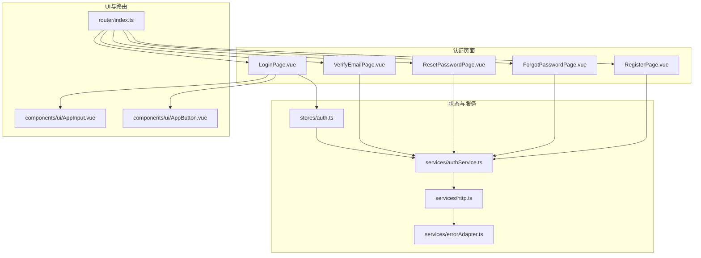
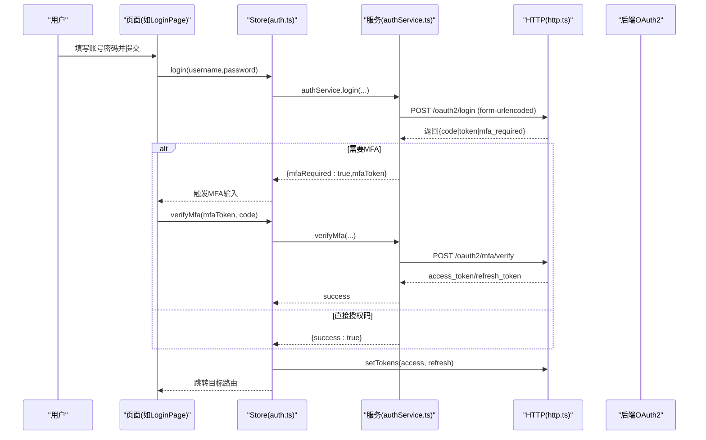
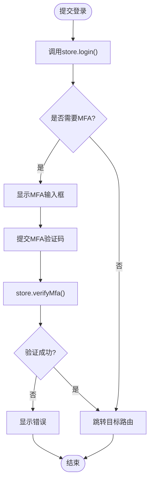
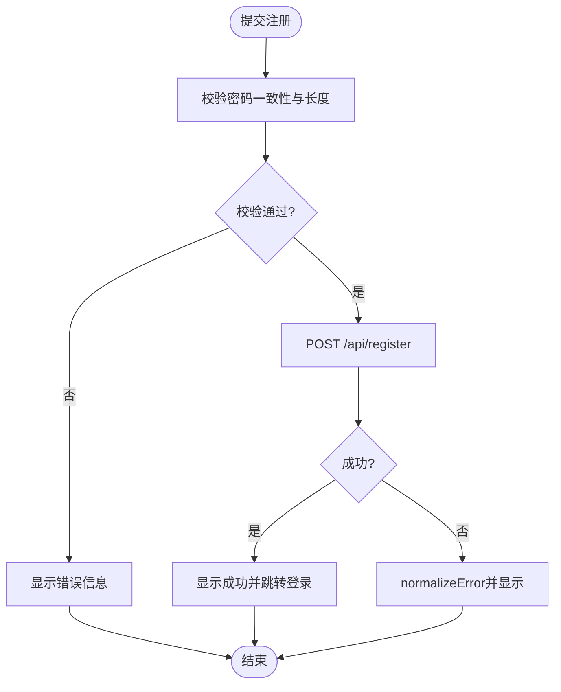
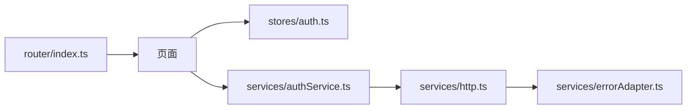

# 认证流程页面

<cite>
**本文引用的文件**
- [LoginPage.vue](file://frontends/user/src/pages/auth/LoginPage.vue)
- [RegisterPage.vue](file://frontends/user/src/pages/auth/RegisterPage.vue)
- [ForgotPasswordPage.vue](file://frontends/user/src/pages/auth/ForgotPasswordPage.vue)
- [ResetPasswordPage.vue](file://frontends/user/src/pages/auth/ResetPasswordPage.vue)
- [VerifyEmailPage.vue](file://frontends/user/src/pages/auth/VerifyEmailPage.vue)
- [auth.ts](file://frontends/user/src/stores/auth.ts)
- [authService.ts](file://frontends/user/src/services/authService.ts)
- [http.ts](file://frontends/user/src/services/http.ts)
- [errorAdapter.ts](file://frontends/user/src/services/errorAdapter.ts)
- [AppInput.vue](file://frontends/user/src/components/ui/AppInput.vue)
- [AppButton.vue](file://frontends/user/src/components/ui/AppButton.vue)
- [index.ts（路由）](file://frontends/user/src/router/index.ts)
- [index.ts（类型）](file://frontends/user/src/types/index.ts)
</cite>

## 目录
1. [简介](#简介)
2. [项目结构](#项目结构)
3. [核心组件](#核心组件)
4. [架构总览](#架构总览)
5. [详细组件分析](#详细组件分析)
6. [依赖关系分析](#依赖关系分析)
7. [性能与可用性考虑](#性能与可用性考虑)
8. [故障排查指南](#故障排查指南)
9. [结论](#结论)
10. [附录：API与交互约定](#附录api与交互约定)

## 简介
本文档聚焦用户端前端应用的认证流程页面，覆盖登录、注册、忘记密码、重置密码、邮箱验证五个关键页面。内容涵盖：
- 用户交互设计：表单布局、状态反馈、可访问性
- 表单验证逻辑：前端校验规则、错误提示
- API调用封装：统一HTTP层、令牌管理、错误归一化
- 错误处理与用户体验优化：加载态、防重复提交、会话恢复
- 组件复用策略与样式统一方案

## 项目结构
认证相关的前端代码位于用户端应用 frontends/user，采用 Vue 3 + TypeScript + Pinia + Axios 的技术栈。认证页面集中在 pages/auth，服务与状态在 services 和 stores，UI 基础组件在 components/ui，路由在 router。

图表来源
- [LoginPage.vue:1-146](file://frontends/user/src/pages/auth/LoginPage.vue#L1-L146)
- [RegisterPage.vue:1-94](file://frontends/user/src/pages/auth/RegisterPage.vue#L1-L94)
- [ForgotPasswordPage.vue:1-62](file://frontends/user/src/pages/auth/ForgotPasswordPage.vue#L1-L62)
- [ResetPasswordPage.vue:1-71](file://frontends/user/src/pages/auth/ResetPasswordPage.vue#L1-L71)
- [VerifyEmailPage.vue:1-51](file://frontends/user/src/pages/auth/VerifyEmailPage.vue#L1-L51)
- [auth.ts:1-101](file://frontends/user/src/stores/auth.ts#L1-L101)
- [authService.ts:1-90](file://frontends/user/src/services/authService.ts#L1-L90)
- [http.ts:1-121](file://frontends/user/src/services/http.ts#L1-L121)
- [errorAdapter.ts:1-184](file://frontends/user/src/services/errorAdapter.ts#L1-L184)
- [AppInput.vue:1-71](file://frontends/user/src/components/ui/AppInput.vue#L1-L71)
- [AppButton.vue:1-56](file://frontends/user/src/components/ui/AppButton.vue#L1-L56)
- [index.ts（路由）:1-97](file://frontends/user/src/router/index.ts#L1-L97)

章节来源
- [LoginPage.vue:1-146](file://frontends/user/src/pages/auth/LoginPage.vue#L1-L146)
- [RegisterPage.vue:1-94](file://frontends/user/src/pages/auth/RegisterPage.vue#L1-L94)
- [ForgotPasswordPage.vue:1-62](file://frontends/user/src/pages/auth/ForgotPasswordPage.vue#L1-L62)
- [ResetPasswordPage.vue:1-71](file://frontends/user/src/pages/auth/ResetPasswordPage.vue#L1-L71)
- [VerifyEmailPage.vue:1-51](file://frontends/user/src/pages/auth/VerifyEmailPage.vue#L1-L51)
- [auth.ts:1-101](file://frontends/user/src/stores/auth.ts#L1-L101)
- [authService.ts:1-90](file://frontends/user/src/services/authService.ts#L1-L90)
- [http.ts:1-121](file://frontends/user/src/services/http.ts#L1-L121)
- [errorAdapter.ts:1-184](file://frontends/user/src/services/errorAdapter.ts#L1-L184)
- [AppInput.vue:1-71](file://frontends/user/src/components/ui/AppInput.vue#L1-L71)
- [AppButton.vue:1-56](file://frontends/user/src/components/ui/AppButton.vue#L1-L56)
- [index.ts（路由）:1-97](file://frontends/user/src/router/index.ts#L1-L97)

## 核心组件
- 登录页 LoginPage：支持邮箱/用户名+密码登录、MFA二次验证、GitHub第三方登录入口；通过 Pinia store 管理 loading/error 并驱动跳转。
- 注册页 RegisterPage：收集用户名、邮箱、密码、确认密码；前端进行最小长度与一致性校验后调用注册接口，成功后自动跳转登录。
- 忘记密码页 ForgotPasswordPage：输入邮箱请求重置链接；为防枚举，无论成功或失败均显示“已发送”的友好提示。
- 重置密码页 ResetPasswordPage：从路由参数获取 token，校验新密码与确认密码一致且满足最小长度，提交后成功则跳转登录。
- 邮箱验证页 VerifyEmailPage：从路由参数读取 token，调用验证接口，根据结果展示成功/失败状态。

章节来源
- [LoginPage.vue:1-146](file://frontends/user/src/pages/auth/LoginPage.vue#L1-L146)
- [RegisterPage.vue:1-94](file://frontends/user/src/pages/auth/RegisterPage.vue#L1-L94)
- [ForgotPasswordPage.vue:1-62](file://frontends/user/src/pages/auth/ForgotPasswordPage.vue#L1-L62)
- [ResetPasswordPage.vue:1-71](file://frontends/user/src/pages/auth/ResetPasswordPage.vue#L1-L71)
- [VerifyEmailPage.vue:1-51](file://frontends/user/src/pages/auth/VerifyEmailPage.vue#L1-L51)

## 架构总览
认证流程遵循“页面 → Store → Service → HTTP → 后端”的分层模式，错误通过统一的 errorAdapter 归一化为本地化消息，HTTP 层负责令牌注入与刷新、401 时引导回登录。

图表来源
- [LoginPage.vue:22-37](file://frontends/user/src/pages/auth/LoginPage.vue#L22-L37)
- [auth.ts:37-71](file://frontends/user/src/stores/auth.ts#L37-L71)
- [authService.ts:8-48](file://frontends/user/src/services/authService.ts#L8-L48)
- [http.ts:56-118](file://frontends/user/src/services/http.ts#L56-L118)

## 详细组件分析

### 登录页面（LoginPage）
- 功能要点
  - 表单字段：邮箱/用户名、密码；可选 MFA 验证码输入框
  - 登录流程：调用 store.login，若返回 mfaRequired 则进入 MFA 流程，否则直接跳转
  - GitHub 登录：基于环境变量拼接授权 URL，跳转到 GitHub OAuth 授权页
- 交互与状态
  - 使用 AppInput 与 AppButton 提供一致的输入与按钮体验
  - 通过 store.loading 控制按钮禁用与加载指示
  - 错误信息通过 AppAlert 展示
- 安全与可用性
  - 使用 autocomplete 属性提升浏览器填充体验
  - MFA 输入限制数字与最大长度，提升易用性

图表来源
- [LoginPage.vue:22-37](file://frontends/user/src/pages/auth/LoginPage.vue#L22-L37)
- [auth.ts:37-71](file://frontends/user/src/stores/auth.ts#L37-L71)

章节来源
- [LoginPage.vue:1-146](file://frontends/user/src/pages/auth/LoginPage.vue#L1-L146)
- [auth.ts:1-101](file://frontends/user/src/stores/auth.ts#L1-L101)
- [AppInput.vue:1-71](file://frontends/user/src/components/ui/AppInput.vue#L1-L71)
- [AppButton.vue:1-56](file://frontends/user/src/components/ui/AppButton.vue#L1-L56)

### 注册页面（RegisterPage）
- 功能要点
  - 字段：邮箱、用户名（可选）、密码、确认密码
  - 前端校验：密码最小长度、两次密码一致性
  - 提交：POST /api/register，成功后显示成功提示并跳转登录
- 错误处理
  - 使用 normalizeError 将网络/服务端错误转换为本地化消息
- 用户体验
  - 提交期间禁用按钮，避免重复提交
  - 成功后短暂延迟跳转，便于用户看到成功提示

图表来源
- [RegisterPage.vue:16-40](file://frontends/user/src/pages/auth/RegisterPage.vue#L16-L40)

章节来源
- [RegisterPage.vue:1-94](file://frontends/user/src/pages/auth/RegisterPage.vue#L1-L94)
- [errorAdapter.ts:73-158](file://frontends/user/src/services/errorAdapter.ts#L73-L158)

### 忘记密码页面（ForgotPasswordPage）
- 功能要点
  - 输入邮箱，POST /api/password-reset/request
  - 为防枚举攻击，无论成功或失败都显示“已发送”的提示
- 用户体验
  - 提交期间禁用按钮，防止重复请求
  - 提供返回登录的快捷链接

章节来源
- [ForgotPasswordPage.vue:1-62](file://frontends/user/src/pages/auth/ForgotPasswordPage.vue#L1-L62)

### 重置密码页面（ResetPasswordPage）
- 功能要点
  - 从路由 query 中读取 token
  - 校验新密码与确认密码一致且满足最小长度
  - 提交 POST /api/password-reset/confirm，成功后跳转登录
- 安全考虑
  - 仅在前端做最小长度与一致性校验，实际强度由后端保障
  - 无 token 时提示无效并重定向到忘记密码

章节来源
- [ResetPasswordPage.vue:1-71](file://frontends/user/src/pages/auth/ResetPasswordPage.vue#L1-L71)

### 邮箱验证页面（VerifyEmailPage）
- 功能要点
  - 从路由 query 中读取 token，GET /api/verify-email?token=...
  - 根据响应设置状态（loading/success/error），并提供回到登录的入口
- 用户体验
  - 加载中显示旋转图标
  - 成功/失败分别给出明确文案与操作指引

章节来源
- [VerifyEmailPage.vue:1-51](file://frontends/user/src/pages/auth/VerifyEmailPage.vue#L1-L51)

## 依赖关系分析
- 页面依赖
  - LoginPage 依赖 store.auth 与 UI 组件
  - Register/Forgot/Reset/Verify 页面直接调用 axios 或 authService
- 服务与HTTP
  - authService 封装 OAuth2 登录、MFA、注册、密码重置等接口
  - http.ts 提供拦截器：请求头注入 Bearer Token、401 自动刷新、失败重定向登录
- 错误归一化
  - errorAdapter.normalizeError 将各类异常统一为包含 code/message/request_id/httpStatus 的结构，并映射本地化消息
- 路由守卫
  - 未登录访问受保护路由时重定向到登录，并携带 redirect 参数

图表来源
- [auth.ts:1-101](file://frontends/user/src/stores/auth.ts#L1-L101)
- [authService.ts:1-90](file://frontends/user/src/services/authService.ts#L1-L90)
- [http.ts:1-121](file://frontends/user/src/services/http.ts#L1-L121)
- [errorAdapter.ts:1-184](file://frontends/user/src/services/errorAdapter.ts#L1-L184)
- [index.ts（路由）:1-97](file://frontends/user/src/router/index.ts#L1-L97)

章节来源
- [auth.ts:1-101](file://frontends/user/src/stores/auth.ts#L1-L101)
- [authService.ts:1-90](file://frontends/user/src/services/authService.ts#L1-L90)
- [http.ts:1-121](file://frontends/user/src/services/http.ts#L1-L121)
- [errorAdapter.ts:1-184](file://frontends/user/src/services/errorAdapter.ts#L1-L184)
- [index.ts（路由）:1-97](file://frontends/user/src/router/index.ts#L1-L97)

## 性能与可用性考虑
- 令牌管理
  - access_token 仅存内存，降低 XSS 风险；refresh_token 持久化以支持页面重载恢复会话
  - 401 时自动刷新一次，失败则清理会话并引导登录
- 表单体验
  - 使用 AppButton 的 loading 与 disabled 避免重复提交
  - 使用 AppInput 的 required、autocomplete、aria 属性提升可访问性与自动填充
- 错误呈现
  - 统一通过 normalizeError 获取本地化消息，减少分散的错误处理逻辑
- 路由守卫
  - 首次进入受保护路由时尝试恢复会话，减少不必要的登录跳转

[本节为通用指导，不直接分析具体文件]

## 故障排查指南
- 登录失败
  - 检查 store.error 是否被赋值，查看 normalizeError 解析后的 message
  - 若需要 MFA，确认 mfaToken 是否正确传递至 verifyMfa
- 注册失败
  - 检查前端校验（密码长度、一致性）是否通过
  - 查看 normalizeError 返回的 code 与 message，定位服务端问题
- 密码重置
  - 忘记密码：确保邮箱格式正确；即使失败也会显示“已发送”，需检查邮件垃圾箱
  - 重置密码：确认路由 token 存在且有效；前后端对密码最小长度要求一致
- 邮箱验证
  - 确认 URL 中的 token 完整；若失败，检查后端是否生成并发送邮件
- 会话过期
  - 401 自动刷新失败会清理令牌并跳转登录；检查 refresh_token 是否存在且有效

章节来源
- [errorAdapter.ts:73-158](file://frontends/user/src/services/errorAdapter.ts#L73-L158)
- [http.ts:82-118](file://frontends/user/src/services/http.ts#L82-L118)
- [auth.ts:37-71](file://frontends/user/src/stores/auth.ts#L37-L71)

## 结论
本项目的认证流程页面采用清晰的分层架构：页面专注交互与状态，Store 协调业务流，Service 封装协议细节，HTTP 层负责令牌与错误处理，错误归一化保证一致的本地化体验。通过组件化与统一样式，实现了良好的可维护性与可扩展性。建议后续继续强化：
- 更细粒度的前端实时校验（如邮箱格式、密码强度提示）
- 多语言切换与错误消息扩展点
- 对敏感操作的二次确认与审计日志

[本节为总结性内容，不直接分析具体文件]

## 附录：API与交互约定
- 登录与MFA
  - POST /oauth2/login：返回授权码或 mfa_required/mfa_token
  - POST /oauth2/token：用授权码换取 access_token/refresh_token
  - POST /oauth2/mfa/verify：提交MFA验证码换取令牌
- 注册
  - POST /api/register：提交 username/email/password
- 密码重置
  - POST /api/password-reset/request：提交 email
  - POST /api/password-reset/confirm：提交 token/new_password
- 邮箱验证
  - GET /api/verify-email?token=...

章节来源
- [authService.ts:8-74](file://frontends/user/src/services/authService.ts#L8-L74)
- [RegisterPage.vue:27-39](file://frontends/user/src/pages/auth/RegisterPage.vue#L27-L39)
- [ForgotPasswordPage.vue:10-22](file://frontends/user/src/pages/auth/ForgotPasswordPage.vue#L10-L22)
- [ResetPasswordPage.vue:16-29](file://frontends/user/src/pages/auth/ResetPasswordPage.vue#L16-L29)
- [VerifyEmailPage.vue:11-25](file://frontends/user/src/pages/auth/VerifyEmailPage.vue#L11-L25)