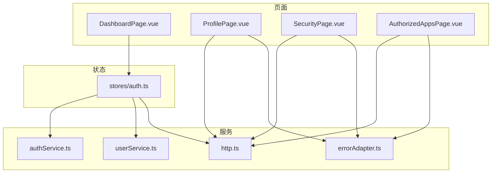
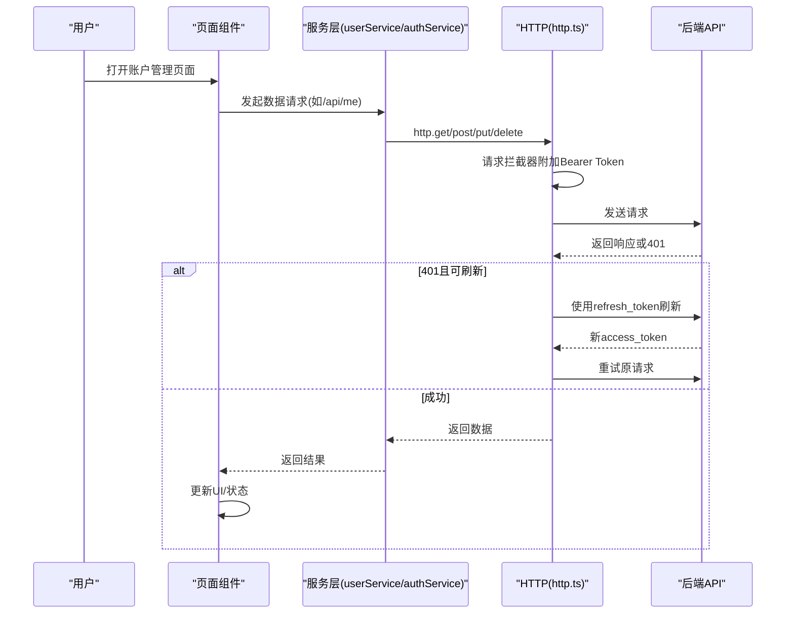
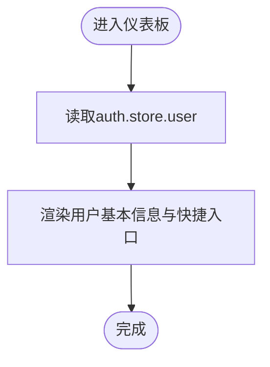
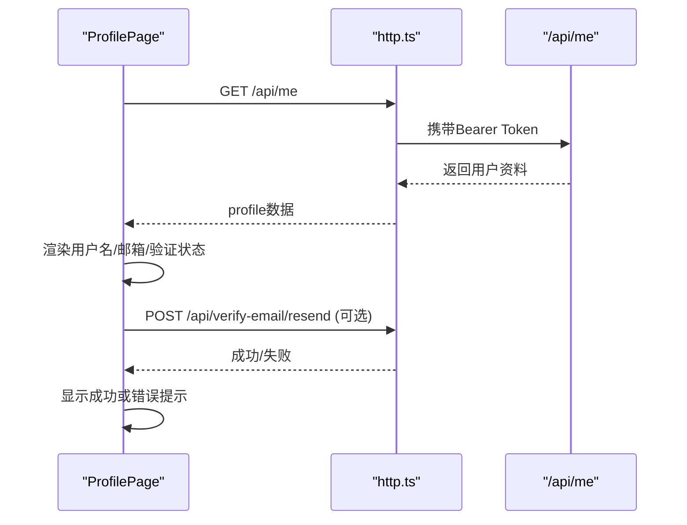
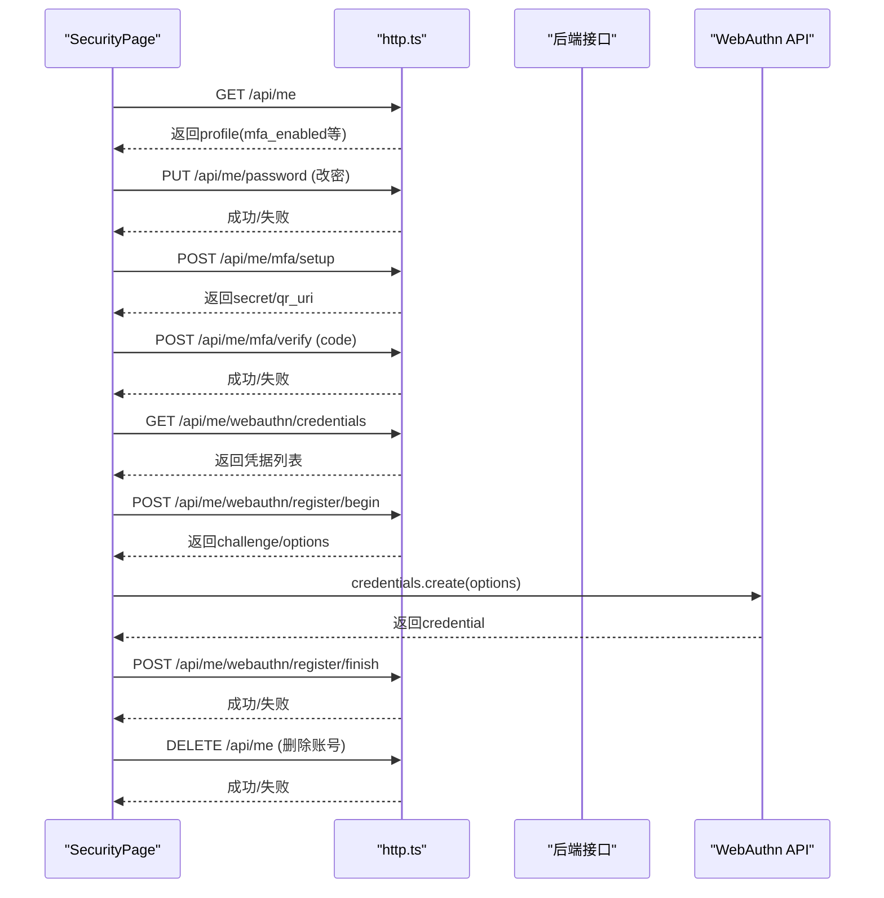
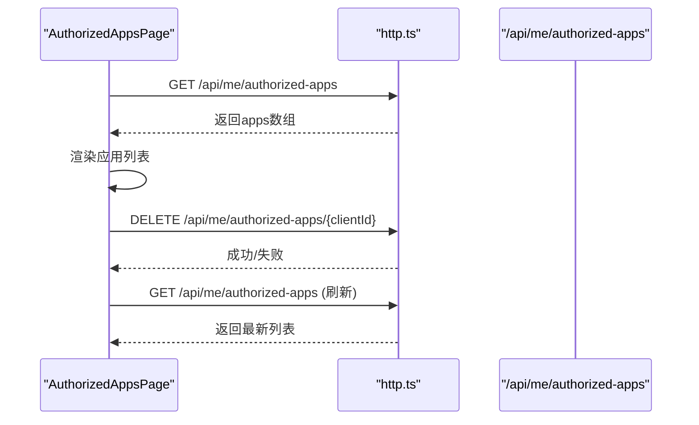
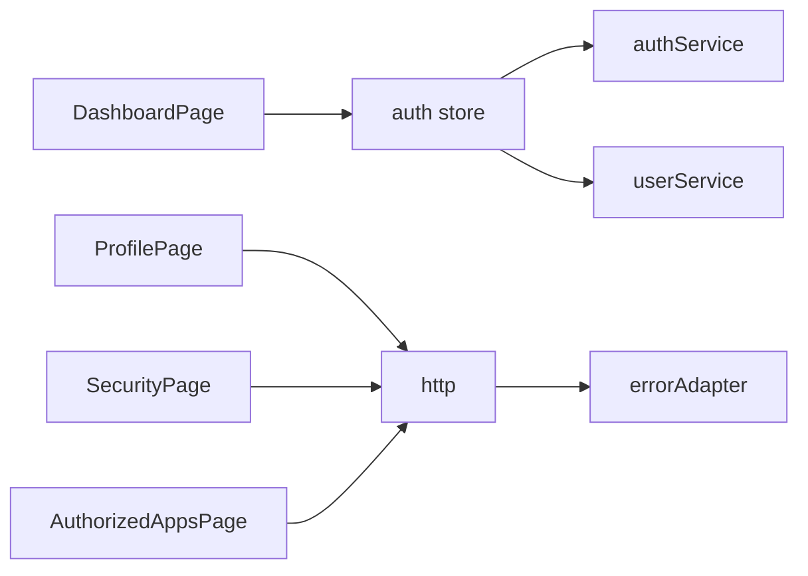

# 账户管理

<cite>
**本文引用的文件**
- [DashboardPage.vue](file://frontends/user/src/pages/account/DashboardPage.vue)
- [ProfilePage.vue](file://frontends/user/src/pages/account/ProfilePage.vue)
- [SecurityPage.vue](file://frontends/user/src/pages/account/SecurityPage.vue)
- [AuthorizedAppsPage.vue](file://frontends/user/src/pages/account/AuthorizedAppsPage.vue)
- [auth.ts](file://frontends/user/src/stores/auth.ts)
- [http.ts](file://frontends/user/src/services/http.ts)
- [userService.ts](file://frontends/user/src/services/userService.ts)
- [authService.ts](file://frontends/user/src/services/authService.ts)
- [errorAdapter.ts](file://frontends/user/src/services/errorAdapter.ts)
- [index.ts（类型定义）](file://frontends/user/src/types/index.ts)
</cite>

## 目录
1. [简介](#简介)
2. [项目结构](#项目结构)
3. [核心组件](#核心组件)
4. [架构总览](#架构总览)
5. [详细组件分析](#详细组件分析)
6. [依赖关系分析](#依赖关系分析)
7. [性能与缓存策略](#性能与缓存策略)
8. [故障排查指南](#故障排查指南)
9. [结论](#结论)

## 简介
本章节面向AuthForge用户端“账户管理”功能，覆盖以下页面与能力：
- 仪表板页面（DashboardPage）：用户概览信息展示（基本信息、角色、快捷入口）。
- 个人资料页面（ProfilePage）：个人信息查看与邮箱验证重发。
- 安全页面（SecurityPage）：密码修改、MFA设置/禁用、Passkeys（WebAuthn）注册与管理、账号删除。
- 授权应用页面（AuthorizedAppsPage）：已授权第三方应用列表、权限查看、撤销授权。

同时说明数据获取方式、表单处理、状态同步、错误处理与用户体验设计，并给出本地缓存策略与实时更新机制建议。

## 项目结构
账户管理相关的前端代码位于用户端前端工程 frontends/user，主要涉及：
- 页面组件：account 目录下的 DashboardPage、ProfilePage、SecurityPage、AuthorizedAppsPage。
- 服务层：http（HTTP客户端与拦截器）、userService（用户资料与账户操作）、authService（认证流程）。
- 状态管理：stores/auth（登录态、会话恢复、用户信息拉取）。
- 错误处理：services/errorAdapter（统一错误归一化与本地化消息）。
- 类型定义：types/index.ts（User、UserProfile、AuthorizedApp等）。

图表来源
- [DashboardPage.vue:1-104](file://frontends/user/src/pages/account/DashboardPage.vue#L1-L104)
- [ProfilePage.vue:1-81](file://frontends/user/src/pages/account/ProfilePage.vue#L1-L81)
- [SecurityPage.vue:1-307](file://frontends/user/src/pages/account/SecurityPage.vue#L1-L307)
- [AuthorizedAppsPage.vue:1-69](file://frontends/user/src/pages/account/AuthorizedAppsPage.vue#L1-L69)
- [http.ts:1-121](file://frontends/user/src/services/http.ts#L1-L121)
- [userService.ts:1-52](file://frontends/user/src/services/userService.ts#L1-L52)
- [authService.ts:1-90](file://frontends/user/src/services/authService.ts#L1-L90)
- [errorAdapter.ts:1-184](file://frontends/user/src/services/errorAdapter.ts#L1-L184)
- [auth.ts:1-101](file://frontends/user/src/stores/auth.ts#L1-L101)

章节来源
- [DashboardPage.vue:1-104](file://frontends/user/src/pages/account/DashboardPage.vue#L1-L104)
- [ProfilePage.vue:1-81](file://frontends/user/src/pages/account/ProfilePage.vue#L1-L81)
- [SecurityPage.vue:1-307](file://frontends/user/src/pages/account/SecurityPage.vue#L1-L307)
- [AuthorizedAppsPage.vue:1-69](file://frontends/user/src/pages/account/AuthorizedAppsPage.vue#L1-L69)
- [http.ts:1-121](file://frontends/user/src/services/http.ts#L1-L121)
- [userService.ts:1-52](file://frontends/user/src/services/userService.ts#L1-L52)
- [authService.ts:1-90](file://frontends/user/src/services/authService.ts#L1-L90)
- [errorAdapter.ts:1-184](file://frontends/user/src/services/errorAdapter.ts#L1-L184)
- [auth.ts:1-101](file://frontends/user/src/stores/auth.ts#L1-L101)

## 核心组件
- 仪表板（DashboardPage）：从 Pinia 的 auth store 读取当前用户信息（name、email、roles、sub），提供快捷入口到个人资料、安全设置、授权应用。
- 个人资料（ProfilePage）：调用 /api/me 获取用户资料，显示用户名、账号ID、邮箱及验证状态；支持重新发送邮箱验证邮件。
- 安全（SecurityPage）：实现密码修改、MFA启用/禁用、Passkeys注册/列出、危险区账号删除。
- 授权应用（AuthorizedAppsPage）：列出已授权应用，支持撤销授权。

章节来源
- [DashboardPage.vue:1-104](file://frontends/user/src/pages/account/DashboardPage.vue#L1-L104)
- [ProfilePage.vue:1-81](file://frontends/user/src/pages/account/ProfilePage.vue#L1-L81)
- [SecurityPage.vue:1-307](file://frontends/user/src/pages/account/SecurityPage.vue#L1-L307)
- [AuthorizedAppsPage.vue:1-69](file://frontends/user/src/pages/account/AuthorizedAppsPage.vue#L1-L69)

## 架构总览
账户管理采用“页面组件 + 服务层 + 状态管理 + 统一错误处理”的分层架构：
- 页面组件负责UI渲染与交互，调用服务层进行数据请求。
- 服务层封装HTTP请求、OAuth流程、用户资料与账户操作。
- 状态管理集中维护登录态、用户信息与会话恢复。
- HTTP层通过拦截器自动附加Token并在401时尝试刷新，失败则引导登录。
- 错误处理模块将各类异常归一化为统一结构，便于界面一致提示。

图表来源
- [http.ts:56-118](file://frontends/user/src/services/http.ts#L56-L118)
- [auth.ts:21-35](file://frontends/user/src/stores/auth.ts#L21-L35)
- [userService.ts:4-13](file://frontends/user/src/services/userService.ts#L4-L13)
- [authService.ts:7-34](file://frontends/user/src/services/authService.ts#L7-L34)

## 详细组件分析

### 仪表板页面（DashboardPage）
- 数据来源：Pinia store（auth.store.user）中的用户信息（name、email、roles、sub）。
- 展示内容：欢迎语、头像首字母、账号ID、邮箱、角色标签；快捷卡片跳转到个人资料、安全设置、授权应用。
- 交互：纯展示与路由跳转，无服务端请求。
- 错误处理：依赖全局登录态，若未登录则不显示敏感信息。

图表来源
- [DashboardPage.vue:1-104](file://frontends/user/src/pages/account/DashboardPage.vue#L1-L104)
- [auth.ts:1-101](file://frontends/user/src/stores/auth.ts#L1-L101)

章节来源
- [DashboardPage.vue:1-104](file://frontends/user/src/pages/account/DashboardPage.vue#L1-L104)
- [auth.ts:1-101](file://frontends/user/src/stores/auth.ts#L1-L101)

### 个人资料页面（ProfilePage）
- 数据获取：onMounted 时调用 /api/me 获取用户资料；加载状态控制Loading UI。
- 功能点：
  - 显示用户名、账号ID（sub）、邮箱及其验证状态。
  - 未验证邮箱时提供“重新发送验证邮件”按钮，调用 /api/verify-email/resend。
- 错误处理：捕获网络或服务端错误，使用 normalizeError 转换为统一消息展示。
- 状态同步：成功后清空success提示，避免残留。

图表来源
- [ProfilePage.vue:13-35](file://frontends/user/src/pages/account/ProfilePage.vue#L13-L35)
- [http.ts:56-62](file://frontends/user/src/services/http.ts#L56-L62)
- [errorAdapter.ts:73-158](file://frontends/user/src/services/errorAdapter.ts#L73-L158)

章节来源
- [ProfilePage.vue:1-81](file://frontends/user/src/pages/account/ProfilePage.vue#L1-L81)
- [errorAdapter.ts:1-184](file://frontends/user/src/services/errorAdapter.ts#L1-L184)

### 安全页面（SecurityPage）
- 数据获取：onMounted 时获取 /api/me，并根据浏览器是否支持 WebAuthn 决定是否加载 Passkey 凭据。
- 功能点：
  - 密码修改：校验新旧密码一致性与长度，提交 PUT /api/me/password。
  - MFA设置：POST /api/me/mfa/setup 获取二维码/密钥，输入验证码后 POST /api/me/mfa/verify 启用；如需禁用，POST /api/me/mfa/disable 并校验密码。
  - Passkeys（WebAuthn）：先 begin 获取挑战参数，调用 navigator.credentials.create 生成凭据，再 finish 提交至服务器；列出已注册凭据。
  - 账号删除：确认用户名匹配后 DELETE /api/me，清理本地存储并重定向到登录页。
- 错误处理：所有异步操作均捕获异常并通过 normalizeError 展示统一消息。
- 状态同步：每次关键操作成功后刷新相关数据（如MFA开关、Passkey列表）。

图表来源
- [SecurityPage.vue:24-166](file://frontends/user/src/pages/account/SecurityPage.vue#L24-L166)
- [http.ts:56-118](file://frontends/user/src/services/http.ts#L56-L118)
- [errorAdapter.ts:73-158](file://frontends/user/src/services/errorAdapter.ts#L73-L158)

章节来源
- [SecurityPage.vue:1-307](file://frontends/user/src/pages/account/SecurityPage.vue#L1-L307)
- [errorAdapter.ts:1-184](file://frontends/user/src/services/errorAdapter.ts#L1-L184)

### 授权应用页面（AuthorizedAppsPage）
- 数据获取：onMounted 时调用 /api/me/authorized-apps 获取已授权应用列表。
- 功能点：
  - 展示应用名称、Client ID、授予范围（scope）。
  - 撤销授权：点击 Revoke 后调用 DELETE /api/me/authorized-apps/{clientId}，成功后刷新列表并提示。
- 错误处理：统一通过 normalizeError 展示错误信息。

图表来源
- [AuthorizedAppsPage.vue:11-35](file://frontends/user/src/pages/account/AuthorizedAppsPage.vue#L11-L35)
- [http.ts:56-62](file://frontends/user/src/services/http.ts#L56-L62)
- [errorAdapter.ts:73-158](file://frontends/user/src/services/errorAdapter.ts#L73-L158)

章节来源
- [AuthorizedAppsPage.vue:1-69](file://frontends/user/src/pages/account/AuthorizedAppsPage.vue#L1-L69)
- [errorAdapter.ts:1-184](file://frontends/user/src/services/errorAdapter.ts#L1-L184)

## 依赖关系分析
- 页面组件依赖：
  - DashboardPage 依赖 stores/auth 的用户信息。
  - ProfilePage、SecurityPage、AuthorizedAppsPage 依赖 services/http 与 services/errorAdapter。
  - SecurityPage 还依赖浏览器 WebAuthn API。
- 服务层依赖：
  - userService 封装 /api/me、/api/me/password、MFA、授权应用等接口。
  - authService 封装 OAuth 登录、MFA校验、令牌交换、注销等流程。
  - http 提供 Axios 实例、拦截器、Token管理与会话恢复。
- 状态管理：
  - stores/auth 负责登录态、会话恢复、用户信息拉取与登出。

图表来源
- [DashboardPage.vue:1-104](file://frontends/user/src/pages/account/DashboardPage.vue#L1-L104)
- [ProfilePage.vue:1-81](file://frontends/user/src/pages/account/ProfilePage.vue#L1-L81)
- [SecurityPage.vue:1-307](file://frontends/user/src/pages/account/SecurityPage.vue#L1-L307)
- [AuthorizedAppsPage.vue:1-69](file://frontends/user/src/pages/account/AuthorizedAppsPage.vue#L1-L69)
- [auth.ts:1-101](file://frontends/user/src/stores/auth.ts#L1-L101)
- [http.ts:1-121](file://frontends/user/src/services/http.ts#L1-L121)
- [userService.ts:1-52](file://frontends/user/src/services/userService.ts#L1-L52)
- [authService.ts:1-90](file://frontends/user/src/services/authService.ts#L1-L90)
- [errorAdapter.ts:1-184](file://frontends/user/src/services/errorAdapter.ts#L1-L184)

章节来源
- [auth.ts:1-101](file://frontends/user/src/stores/auth.ts#L1-L101)
- [http.ts:1-121](file://frontends/user/src/services/http.ts#L1-L121)
- [userService.ts:1-52](file://frontends/user/src/services/userService.ts#L1-L52)
- [authService.ts:1-90](file://frontends/user/src/services/authService.ts#L1-L90)
- [errorAdapter.ts:1-184](file://frontends/user/src/services/errorAdapter.ts#L1-L184)

## 性能与缓存策略
- 访问令牌（access_token）：仅保存在内存中，降低XSS风险，减少持久化开销。
- 刷新令牌（refresh_token）：保存在 localStorage，用于页面重载时静默恢复会话。
- 会话恢复：页面启动时尝试用 refresh_token 换取新的 access_token，成功后继续业务请求。
- 401自动刷新：当请求返回401且存在 refresh_token 时，自动刷新令牌并重试原请求；刷新失败则清除会话并引导登录。
- 建议的本地缓存策略（可在现有基础上扩展）：
  - 对只读数据（如用户资料）增加短期内存缓存（例如在组件生命周期内缓存几秒），减少重复请求。
  - 对授权应用列表在撤销后主动刷新，避免脏数据。
  - 对MFA/Passkey等敏感配置变更后的列表，采用失效+拉取模式保证一致性。
- 实时更新机制（建议）：
  - 基于事件总线或WebSocket推送（如后端支持）触发局部刷新（如MFA状态变化、新增Passkey）。
  - 在关键操作成功后显式调用 fetchProfile/fetchApps 等方法确保UI与后端一致。

章节来源
- [http.ts:11-54](file://frontends/user/src/services/http.ts#L11-L54)
- [http.ts:82-118](file://frontends/user/src/services/http.ts#L82-L118)
- [auth.ts:21-35](file://frontends/user/src/stores/auth.ts#L21-L35)

## 故障排查指南
- 常见错误场景：
  - 网络超时或不可达：normalizeError 会返回网络错误码与本地化消息。
  - 服务端错误：根据响应体解析 Error Envelope 或 RFC 6749 错误码，统一映射为可读消息。
  - 会话过期：401且刷新失败时，清除会话并跳转登录页，提示“登录已过期”。
- 排查步骤：
  - 检查浏览器控制台是否有401或网络错误。
  - 确认 refresh_token 是否存在且有效。
  - 核对请求头 Authorization 是否正确附加。
  - 查看 normalizeError 输出的 code 与 message，定位具体错误源。
- 安全相关：
  - Passkey注册失败可能由浏览器不支持或用户取消导致，需区分 NotAllowedError 与其他错误。
  - 删除账号前要求输入用户名二次确认，防止误删。

章节来源
- [errorAdapter.ts:73-158](file://frontends/user/src/services/errorAdapter.ts#L73-L158)
- [errorAdapter.ts:160-181](file://frontends/user/src/services/errorAdapter.ts#L160-L181)
- [http.ts:82-118](file://frontends/user/src/services/http.ts#L82-L118)
- [SecurityPage.vue:100-166](file://frontends/user/src/pages/account/SecurityPage.vue#L100-L166)

## 结论
账户管理模块以清晰的页面分层与统一的服务/错误处理机制，实现了用户概览、个人资料、安全设置与授权应用管理的完整闭环。通过内存级access_token与localStorage级refresh_token的组合，结合401自动刷新与会话恢复，保障了良好的用户体验与安全性。建议在后续迭代中引入更细粒度的本地缓存与实时推送机制，进一步提升响应速度与一致性。