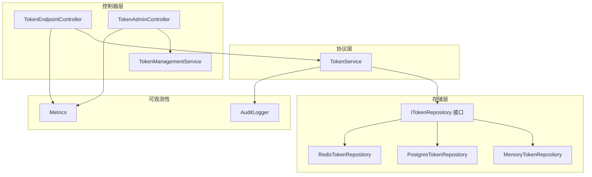
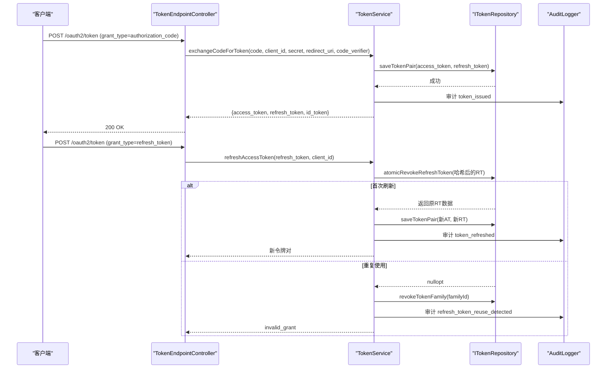
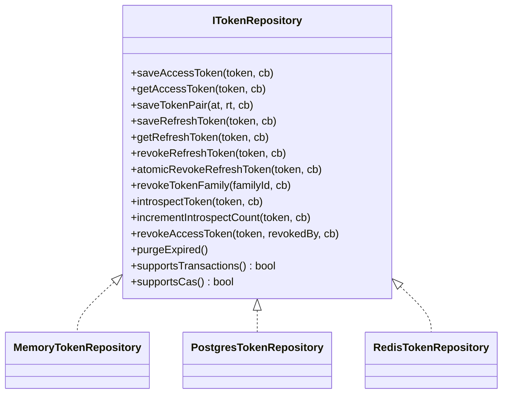
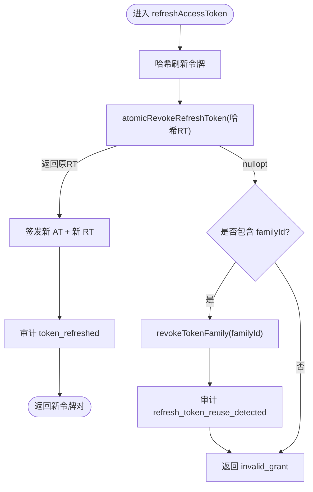
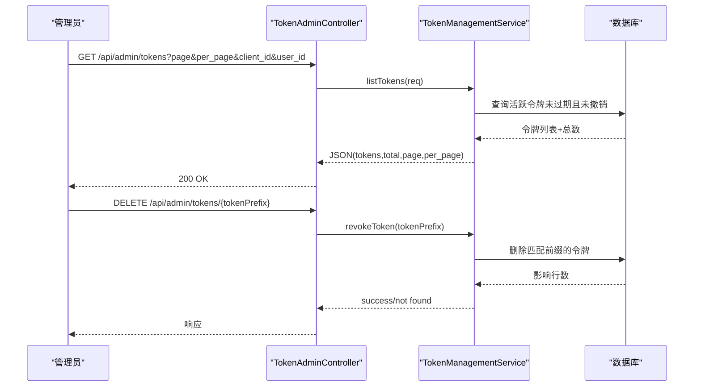
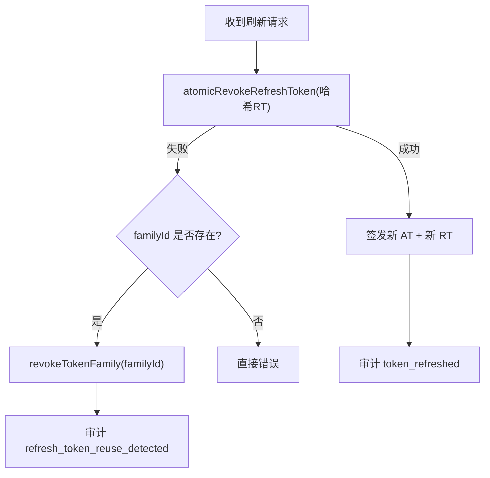
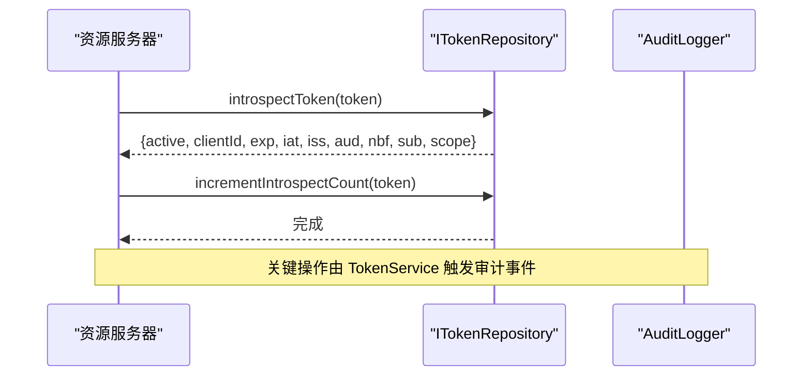
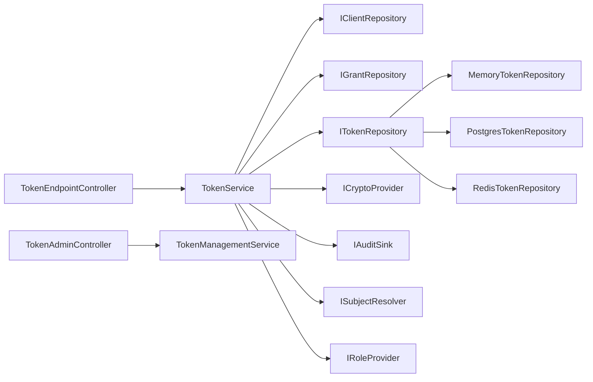

# 令牌管理

<cite>
**本文引用的文件**
- [ITokenRepository.h](file://libs/oauth2/include/authforge/oauth2/repository/ITokenRepository.h)
- [TokenService.h](file://libs/oauth2/include/authforge/oauth2/protocol/TokenService.h)
- [TokenService.cc](file://libs/oauth2/src/protocol/TokenService.cc)
- [MemoryTokenRepository.h](file://libs/storage-memory/include/authforge/storage/memory/MemoryTokenRepository.h)
- [MemoryTokenRepository.cc](file://libs/storage-memory/src/MemoryTokenRepository.cc)
- [PostgresTokenRepository.cc](file://libs/storage-postgres/src/PostgresTokenRepository.cc)
- [RedisTokenRepository.cc](file://libs/storage-redis/src/RedisTokenRepository.cc)
- [TokenEndpointController.cc](file://libs/drogon/src/controllers/TokenEndpointController.cc)
- [TokenAdminController.cc](file://libs/drogon/src/controllers/TokenAdminController.cc)
- [TokenManagementService.cc](file://libs/drogon/src/admin/TokenManagementService.cc)
- [AuditLogger.cc](file://libs/drogon/src/observability/AuditLogger.cc)
- [V008__refresh_token_family.sql](file://apps/server/migrations/V008__refresh_token_family.sql)
- [V012__audit_logs.sql](file://apps/server/migrations/V012__audit_logs.sql)
- [openapi.yaml](file://apps/server/openapi.yaml)
- [Metrics.h](file://libs/drogon/include/authforge/drogon/observability/Metrics.h)
</cite>

## 目录
1. [简介](#简介)
2. [项目结构](#项目结构)
3. [核心组件](#核心组件)
4. [架构总览](#架构总览)
5. [详细组件分析](#详细组件分析)
6. [依赖关系分析](#依赖关系分析)
7. [性能与并发特性](#性能与并发特性)
8. [故障排查指南](#故障排查指南)
9. [结论](#结论)
10. [附录](#附录)

## 简介
本文件面向令牌管理模块，覆盖访问令牌（Access Token）与刷新令牌（Refresh Token）的创建、分发、验证、撤销、过期清理、状态监控、使用统计与安全审计。文档同时说明刷新机制、令牌家族级联撤销、并发安全策略以及最佳实践与安全建议，帮助读者快速理解并正确使用该模块。

## 项目结构
令牌管理涉及协议层、存储层、控制器层与可观测性层：
- 协议层：TokenService 负责令牌的签发、交换、刷新、校验、审查与撤销等核心流程。
- 存储层：ITokenRepository 接口定义统一的令牌存取能力；Memory/Postgres/Redis 三种实现分别提供内存、数据库与缓存后端支持。
- 控制器层：TokenEndpointController 暴露 OAuth2 标准端点；TokenAdminController + TokenManagementService 提供管理端令牌查询与批量撤销能力。
- 可观测性层：AuditLogger 记录审计日志；Metrics 提供指标计数。

图表来源
- [TokenService.h:78-196](file://libs/oauth2/include/authforge/oauth2/protocol/TokenService.h#L78-L196)
- [ITokenRepository.h:36-173](file://libs/oauth2/include/authforge/oauth2/repository/ITokenRepository.h#L36-L173)
- [TokenEndpointController.cc:215-230](file://libs/drogon/src/controllers/TokenEndpointController.cc#L215-L230)
- [TokenAdminController.cc:32-70](file://libs/drogon/src/controllers/TokenAdminController.cc#L32-L70)
- [TokenManagementService.cc:67-162](file://libs/drogon/src/admin/TokenManagementService.cc#L67-L162)
- [AuditLogger.cc:70-93](file://libs/drogon/src/observability/AuditLogger.cc#L70-L93)
- [Metrics.h:8-24](file://libs/drogon/include/authforge/drogon/observability/Metrics.h#L8-L24)

章节来源
- [TokenService.h:78-196](file://libs/oauth2/include/authforge/oauth2/protocol/TokenService.h#L78-L196)
- [ITokenRepository.h:36-173](file://libs/oauth2/include/authforge/oauth2/repository/ITokenRepository.h#L36-L173)
- [TokenEndpointController.cc:215-230](file://libs/drogon/src/controllers/TokenEndpointController.cc#L215-L230)
- [TokenAdminController.cc:32-70](file://libs/drogon/src/controllers/TokenAdminController.cc#L32-L70)
- [TokenManagementService.cc:67-162](file://libs/drogon/src/admin/TokenManagementService.cc#L67-L162)
- [AuditLogger.cc:70-93](file://libs/drogon/src/observability/AuditLogger.cc#L70-L93)
- [Metrics.h:8-24](file://libs/drogon/include/authforge/drogon/observability/Metrics.h#L8-L24)

## 核心组件
- 令牌仓库接口 ITokenRepository：统一抽象访问令牌与刷新令牌的保存、获取、撤销、家族级联撤销、令牌审查（RFC 7662）、过期清理及事务/CAS 能力声明。
- 令牌服务 TokenService：封装授权码换取令牌、刷新令牌、访问令牌校验、令牌审查与撤销，并集成 PKCE 校验、角色解析与审计事件。
- 存储实现：
  - MemoryTokenRepository：进程内内存存储，线程安全，支持 CAS 原子撤销与家族级联撤销。
  - PostgresTokenRepository：持久化存储，支持家族级联撤销 SQL 批量更新与审查计数。
  - RedisTokenRepository：缓存后端，CAS 以非原子方式模拟，家族撤销有限支持。
- 控制器与服务：
  - TokenEndpointController：OAuth2 token 端点与撤销端点（RFC 7009）。
  - TokenAdminController + TokenManagementService：管理端令牌列表、按客户端/用户批量撤销、按前缀撤销。
- 可观测性：
  - AuditLogger：将审计事件写入 audit_logs 表。
  - Metrics：请求计数与失败计数等指标。

章节来源
- [ITokenRepository.h:36-173](file://libs/oauth2/include/authforge/oauth2/repository/ITokenRepository.h#L36-L173)
- [TokenService.h:78-196](file://libs/oauth2/include/authforge/oauth2/protocol/TokenService.h#L78-L196)
- [MemoryTokenRepository.cc:26-137](file://libs/storage-memory/src/MemoryTokenRepository.cc#L26-L137)
- [PostgresTokenRepository.cc:437-496](file://libs/storage-postgres/src/PostgresTokenRepository.cc#L437-L496)
- [RedisTokenRepository.cc:193-224](file://libs/storage-redis/src/RedisTokenRepository.cc#L193-L224)
- [TokenEndpointController.cc:215-230](file://libs/drogon/src/controllers/TokenEndpointController.cc#L215-L230)
- [TokenManagementService.cc:67-321](file://libs/drogon/src/admin/TokenManagementService.cc#L67-L321)
- [AuditLogger.cc:70-93](file://libs/drogon/src/observability/AuditLogger.cc#L70-L93)
- [Metrics.h:8-24](file://libs/drogon/include/authforge/drogon/observability/Metrics.h#L8-L24)

## 架构总览
令牌生命周期从“授权码换取令牌”开始，到“刷新令牌”、“访问令牌校验”、“令牌撤销/过期清理”，贯穿协议层与存储层，并通过审计与指标进行可观测。

图表来源
- [TokenEndpointController.cc:215-230](file://libs/drogon/src/controllers/TokenEndpointController.cc#L215-L230)
- [TokenService.cc:342-365](file://libs/oauth2/src/protocol/TokenService.cc#L342-L365)
- [ITokenRepository.h:86-126](file://libs/oauth2/include/authforge/oauth2/repository/ITokenRepository.h#L86-L126)
- [AuditLogger.cc:70-93](file://libs/drogon/src/observability/AuditLogger.cc#L70-L93)

## 详细组件分析

### 令牌仓库接口与实现
- ITokenRepository 定义了令牌全生命周期操作：保存/获取访问令牌与刷新令牌、原子撤销刷新令牌、家族级联撤销、令牌审查、撤销访问令牌、过期清理，以及 supportsTransactions()/supportsCas() 能力标志。
- MemoryTokenRepository：
  - 线程安全：通过递归互斥保护所有读写。
  - 原子撤销：atomicRevokeRefreshToken 在同一锁内完成“查找-检查已撤销-标记撤销-返回数据”的 CAS 语义。
  - 家族级联撤销：revokeTokenFamily 会撤销同 familyId 的所有刷新令牌及其关联的访问令牌。
  - 令牌审查：introspectToken 支持访问令牌与刷新令牌的活性判断与元数据返回。
- PostgresTokenRepository：
  - 家族级联撤销：两条 SQL 批量更新刷新令牌与关联访问令牌，确保高效且幂等。
  - 审查计数：incrementIntrospectCount 用于统计令牌被审查次数。
- RedisTokenRepository：
  - CAS 近似：get 后 set 的非原子模式，适合单线程模型但存在竞态风险。
  - 家族撤销：当前仅记录警告，未实现高效级联。

图表来源
- [ITokenRepository.h:36-173](file://libs/oauth2/include/authforge/oauth2/repository/ITokenRepository.h#L36-L173)
- [MemoryTokenRepository.h:78-122](file://libs/storage-memory/include/authforge/storage/memory/MemoryTokenRepository.h#L78-L122)
- [PostgresTokenRepository.cc:437-496](file://libs/storage-postgres/src/PostgresTokenRepository.cc#L437-L496)
- [RedisTokenRepository.cc:193-224](file://libs/storage-redis/src/RedisTokenRepository.cc#L193-L224)

章节来源
- [ITokenRepository.h:36-173](file://libs/oauth2/include/authforge/oauth2/repository/ITokenRepository.h#L36-L173)
- [MemoryTokenRepository.cc:26-137](file://libs/storage-memory/src/MemoryTokenRepository.cc#L26-L137)
- [PostgresTokenRepository.cc:437-496](file://libs/storage-postgres/src/PostgresTokenRepository.cc#L437-L496)
- [RedisTokenRepository.cc:193-224](file://libs/storage-redis/src/RedisTokenRepository.cc#L193-L224)

### 令牌服务（TokenService）
- 授权码换令牌：exchangeCodeForToken 完成授权码校验、PKCE 校验、角色解析、签发访问令牌与刷新令牌，并记录审计事件。
- 刷新令牌：refreshAccessToken 使用 atomicRevokeRefreshToken 检测复用；若检测到复用则触发家族级联撤销并记录审计事件；否则签发新令牌对。
- 访问令牌校验：validateAccessToken 调用底层仓库获取并校验有效期与撤销状态。
- 令牌审查：introspectToken 返回令牌活性与元数据（RFC 7662）。
- 令牌撤销：revokeAccessToken 调用仓库撤销访问令牌并记录审计。

图表来源
- [TokenService.cc:342-365](file://libs/oauth2/src/protocol/TokenService.cc#L342-L365)
- [ITokenRepository.h:112-126](file://libs/oauth2/include/authforge/oauth2/repository/ITokenRepository.h#L112-L126)

章节来源
- [TokenService.h:78-196](file://libs/oauth2/include/authforge/oauth2/protocol/TokenService.h#L78-L196)
- [TokenService.cc:342-365](file://libs/oauth2/src/protocol/TokenService.cc#L342-L365)

### 令牌端点与管理端点
- OAuth2 令牌端点（/oauth2/token）：
  - 支持 grant_type=authorization_code、refresh_token、client_credentials。
  - 参数包括 code、refresh_token、client_id、client_secret、redirect_uri 等。
- 令牌撤销端点（RFC 7009）：
  - 路径与参数由控制器注册，要求客户端认证。
- 管理端点：
  - 列出活跃令牌（支持分页、按 client_id/user_id 过滤）。
  - 按令牌前缀撤销、按客户端撤销、按用户撤销。
  - 获取 OIDC 密钥信息（当前为占位响应）。

图表来源
- [openapi.yaml:1564-1605](file://apps/server/openapi.yaml#L1564-L1605)
- [TokenEndpointController.cc:215-230](file://libs/drogon/src/controllers/TokenEndpointController.cc#L215-L230)
- [TokenAdminController.cc:32-70](file://libs/drogon/src/controllers/TokenAdminController.cc#L32-L70)
- [TokenManagementService.cc:67-201](file://libs/drogon/src/admin/TokenManagementService.cc#L67-L201)

章节来源
- [openapi.yaml:1564-1605](file://apps/server/openapi.yaml#L1564-L1605)
- [TokenEndpointController.cc:215-230](file://libs/drogon/src/controllers/TokenEndpointController.cc#L215-L230)
- [TokenAdminController.cc:32-70](file://libs/drogon/src/controllers/TokenAdminController.cc#L32-L70)
- [TokenManagementService.cc:67-201](file://libs/drogon/src/admin/TokenManagementService.cc#L67-L201)

### 令牌家族与刷新复用防护
- 家族字段：oauth2_refresh_tokens.family_id 用于标识同一授权码派生的刷新令牌族。
- 刷新复用检测：
  - 首次刷新：atomicRevokeRefreshToken 成功，返回原刷新令牌数据，随后签发新令牌对。
  - 二次刷新：atomicRevokeRefreshToken 返回空，进入家族级联撤销分支，撤销整个家族并记录审计事件。
- 数据库迁移：添加 family_id 列与索引，提升家族查询效率。

图表来源
- [V008__refresh_token_family.sql:1-7](file://apps/server/migrations/V008__refresh_token_family.sql#L1-L7)
- [PostgresTokenRepository.cc:452-496](file://libs/storage-postgres/src/PostgresTokenRepository.cc#L452-L496)
- [MemoryTokenRepository.cc:95-137](file://libs/storage-memory/src/MemoryTokenRepository.cc#L95-L137)

章节来源
- [V008__refresh_token_family.sql:1-7](file://apps/server/migrations/V008__refresh_token_family.sql#L1-L7)
- [PostgresTokenRepository.cc:452-496](file://libs/storage-postgres/src/PostgresTokenRepository.cc#L452-L496)
- [MemoryTokenRepository.cc:95-137](file://libs/storage-memory/src/MemoryTokenRepository.cc#L95-L137)

### 令牌审查与使用统计
- 令牌审查（RFC 7662）：
  - 通过 introspectToken 返回令牌活性、客户端、过期时间、主体、范围等元数据。
  - 支持访问令牌与刷新令牌的审查。
- 使用统计：
  - incrementIntrospectCount 增加令牌被审查的次数，便于监控与告警。
- 审计日志：
  - AuditLogger 将 token_issued、token_refreshed、refresh_token_reuse_detected 等事件持久化至 audit_logs。

图表来源
- [ITokenRepository.h:128-136](file://libs/oauth2/include/authforge/oauth2/repository/ITokenRepository.h#L128-L136)
- [MemoryTokenRepository.cc:141-216](file://libs/storage-memory/src/MemoryTokenRepository.cc#L141-L216)
- [PostgresTokenRepository.cc:500-587](file://libs/storage-postgres/src/PostgresTokenRepository.cc#L500-L587)
- [AuditLogger.cc:70-93](file://libs/drogon/src/observability/AuditLogger.cc#L70-L93)

章节来源
- [ITokenRepository.h:128-136](file://libs/oauth2/include/authforge/oauth2/repository/ITokenRepository.h#L128-L136)
- [MemoryTokenRepository.cc:141-216](file://libs/storage-memory/src/MemoryTokenRepository.cc#L141-L216)
- [PostgresTokenRepository.cc:500-587](file://libs/storage-postgres/src/PostgresTokenRepository.cc#L500-L587)
- [AuditLogger.cc:70-93](file://libs/drogon/src/observability/AuditLogger.cc#L70-L93)

### 过期时间与清理
- 过期判定：
  - 读取时检查 expiresAt 与 revoked 标志，过期或已撤销的令牌视为无效。
- 清理任务：
  - purgeExpired 用于定期清理过期令牌（具体调度由上层服务负责）。
- 管理端过滤：
  - 列表接口默认仅返回活跃令牌（未过期且未撤销），便于运维查看。

章节来源
- [MemoryTokenRepository.cc:45-58](file://libs/storage-memory/src/MemoryTokenRepository.cc#L45-L58)
- [MemoryTokenRepository.cc:68-81](file://libs/storage-memory/src/MemoryTokenRepository.cc#L68-L81)
- [TokenManagementService.cc:67-162](file://libs/drogon/src/admin/TokenManagementService.cc#L67-L162)
- [ITokenRepository.h:149-154](file://libs/oauth2/include/authforge/oauth2/repository/ITokenRepository.h#L149-L154)

### 安全审计与指标
- 审计事件：
  - token_issued：令牌签发成功。
  - token_refreshed：刷新成功。
  - refresh_token_reuse_detected：刷新令牌复用检测并触发家族级联撤销。
- 审计存储：
  - audit_logs 表记录时间戳、行为者、动作、目标、结果、IP、User-Agent、请求ID与详情。
- 指标：
  - Metrics 提供请求计数与登录失败计数等，保证线程安全。

章节来源
- [AuditLogger.cc:70-93](file://libs/drogon/src/observability/AuditLogger.cc#L70-L93)
- [V012__audit_logs.sql:1-22](file://apps/server/migrations/V012__audit_logs.sql#L1-L22)
- [Metrics.h:8-24](file://libs/drogon/include/authforge/drogon/observability/Metrics.h#L8-L24)

## 依赖关系分析
- TokenService 依赖：
  - IClientRepository、IGrantRepository、ITokenRepository：用于客户端、授权与令牌操作。
  - ICryptoProvider：用于令牌哈希与签名。
  - IAuditSink：用于审计事件输出。
  - ISubjectResolver 与 IRoleProvider：可选的角色解析与角色提供。
- 存储实现依赖：
  - Memory：进程内容器与互斥锁。
  - Postgres：数据库连接与 SQL 执行。
  - Redis：键值存储与命令执行。
- 控制器依赖：
  - TokenEndpointController：HTTP 路由与参数解析。
  - TokenAdminController + TokenManagementService：管理端业务逻辑与 ORM 查询。

图表来源
- [TokenService.h:78-196](file://libs/oauth2/include/authforge/oauth2/protocol/TokenService.h#L78-L196)
- [ITokenRepository.h:36-173](file://libs/oauth2/include/authforge/oauth2/repository/ITokenRepository.h#L36-L173)
- [TokenEndpointController.cc:215-230](file://libs/drogon/src/controllers/TokenEndpointController.cc#L215-L230)
- [TokenAdminController.cc:32-70](file://libs/drogon/src/controllers/TokenAdminController.cc#L32-L70)
- [TokenManagementService.cc:67-321](file://libs/drogon/src/admin/TokenManagementService.cc#L67-L321)

章节来源
- [TokenService.h:78-196](file://libs/oauth2/include/authforge/oauth2/protocol/TokenService.h#L78-L196)
- [ITokenRepository.h:36-173](file://libs/oauth2/include/authforge/oauth2/repository/ITokenRepository.h#L36-L173)
- [TokenEndpointController.cc:215-230](file://libs/drogon/src/controllers/TokenEndpointController.cc#L215-L230)
- [TokenAdminController.cc:32-70](file://libs/drogon/src/controllers/TokenAdminController.cc#L32-L70)
- [TokenManagementService.cc:67-321](file://libs/drogon/src/admin/TokenManagementService.cc#L67-L321)

## 性能与并发特性
- 并发安全：
  - MemoryTokenRepository 使用递归互斥保护所有令牌操作，确保线程安全。
  - atomicRevokeRefreshToken 在同一锁内完成 CAS 语义，避免竞态条件。
- 事务与 CAS：
  - ITokenRepository 通过 supportsTransactions()/supportsCas() 声明能力，测试套件据此选择相应用例。
  - Postgres 实现可通过事务保证多写原子性；Redis 实现 CAS 为非原子近似。
- 批量操作：
  - 家族级联撤销采用 SQL 批量更新，减少往返开销。
- 指标与审计：
  - Metrics 与 AuditLogger 提供轻量级可观测性，避免引入额外共享可变状态。

章节来源
- [MemoryTokenRepository.h:78-122](file://libs/storage-memory/include/authforge/storage/memory/MemoryTokenRepository.h#L78-L122)
- [MemoryTokenRepository.cc:95-137](file://libs/storage-memory/src/MemoryTokenRepository.cc#L95-L137)
- [ITokenRepository.h:156-173](file://libs/oauth2/include/authforge/oauth2/repository/ITokenRepository.h#L156-L173)
- [PostgresTokenRepository.cc:452-496](file://libs/storage-postgres/src/PostgresTokenRepository.cc#L452-L496)
- [RedisTokenRepository.cc:193-224](file://libs/storage-redis/src/RedisTokenRepository.cc#L193-L224)
- [Metrics.h:8-24](file://libs/drogon/include/authforge/drogon/observability/Metrics.h#L8-L24)

## 故障排查指南
- 刷新令牌重复使用：
  - 现象：第二次刷新返回 invalid_grant。
  - 原因：atomicRevokeRefreshToken 检测到令牌已撤销，触发家族级联撤销。
  - 处理：检查审计日志中的 refresh_token_reuse_detected 事件，确认是否存在并发刷新或泄露。
- 令牌无法撤销：
  - 现象：管理端撤销返回 not found。
  - 原因：令牌不存在或前缀不匹配。
  - 处理：核对令牌前缀与数据库记录，必要时扩大搜索范围。
- 数据库异常：
  - 现象：DB_QUERY_ERROR。
  - 原因：数据库不可用或查询失败。
  - 处理：检查数据库连接与权限，重试或回滚。
- 审计日志缺失：
  - 现象：关键事件未记录。
  - 原因：AuditLogger 写入失败或配置问题。
  - 处理：检查 audit_logs 表与日志级别，确认插入回调未被忽略。

章节来源
- [TokenManagementService.cc:164-201](file://libs/drogon/src/admin/TokenManagementService.cc#L164-L201)
- [AuditLogger.cc:70-93](file://libs/drogon/src/observability/AuditLogger.cc#L70-L93)
- [PostgresTokenRepository.cc:452-496](file://libs/storage-postgres/src/PostgresTokenRepository.cc#L452-L496)

## 结论
令牌管理模块通过清晰的层次划分与严格的并发控制，实现了安全的令牌签发、刷新、校验与撤销。家族级联撤销与审计日志为安全合规提供了保障。结合管理端能力与可观测性设施，系统具备完善的令牌生命周期管理能力。建议在生产环境中启用强密码策略、最小权限原则、定期清理过期令牌与持续监控审计日志。

## 附录
- 最佳实践与安全建议：
  - 使用短寿命访问令牌与长寿命刷新令牌，配合刷新轮换。
  - 严格校验 PKCE，防止授权码泄露攻击。
  - 启用审计日志与指标监控，及时发现异常行为。
  - 定期清理过期令牌，降低存储压力与安全风险。
  - 限制管理端权限，仅允许受信任角色执行批量撤销。
  - 在分布式环境中优先使用支持事务与 CAS 的后端（如 Postgres）。
  - 对敏感操作进行多因素认证与审批流程。