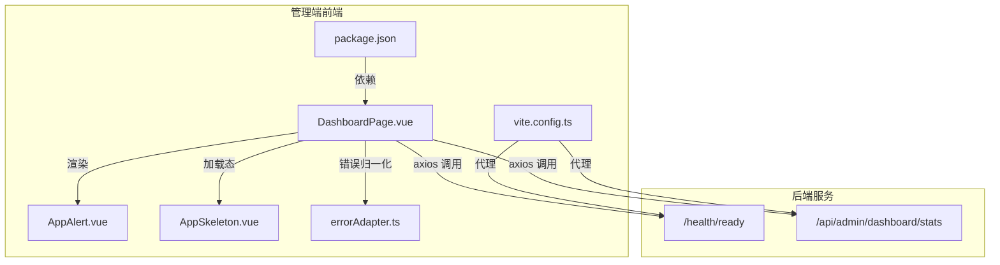
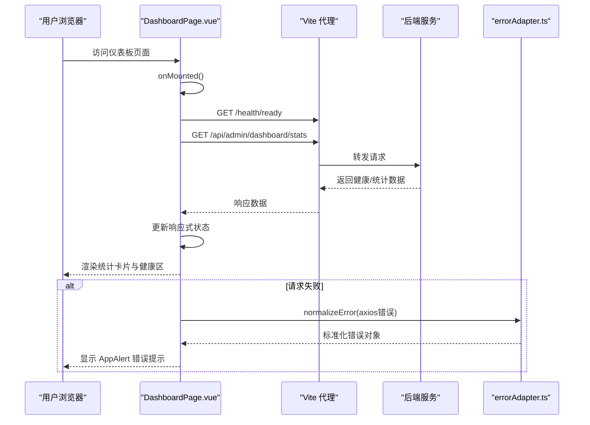
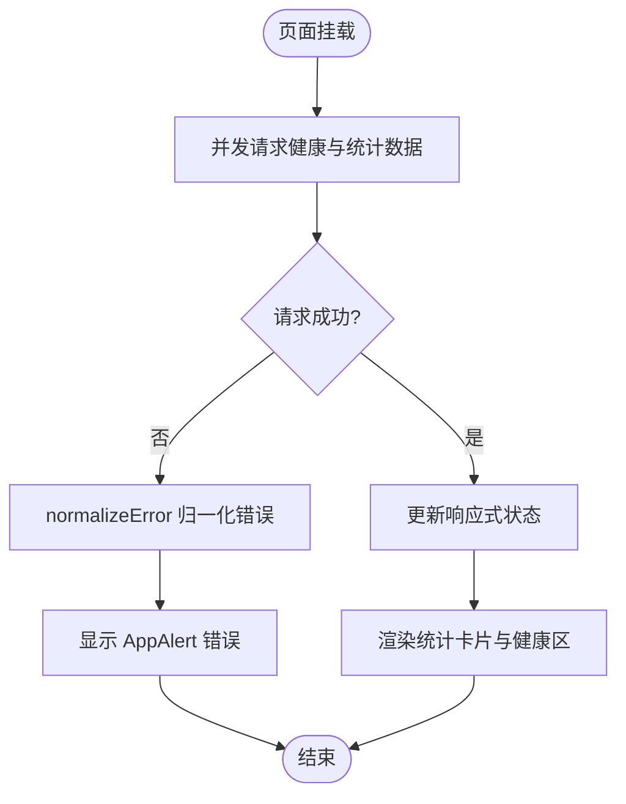
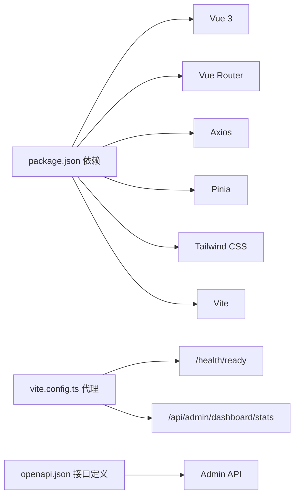

# 仪表板

<cite>
**本文引用的文件**
- [DashboardPage.vue](file://frontends/admin/src/pages/dashboard/DashboardPage.vue)
- [errorAdapter.ts](file://frontends/admin/src/services/errorAdapter.ts)
- [AppAlert.vue](file://frontends/admin/src/components/ui/AppAlert.vue)
- [AppSkeleton.vue](file://frontends/admin/src/components/ui/AppSkeleton.vue)
- [vite.config.ts](file://frontends/admin/vite.config.ts)
- [package.json](file://frontends/admin/package.json)
- [openapi.json](file://apps/server/docs/api/openapi.json)
</cite>

## 目录
1. [简介](#简介)
2. [项目结构](#项目结构)
3. [核心组件](#核心组件)
4. [架构总览](#架构总览)
5. [详细组件分析](#详细组件分析)
6. [依赖分析](#依赖分析)
7. [性能考虑](#性能考虑)
8. [故障排查指南](#故障排查指南)
9. [结论](#结论)
10. [附录：开发指南](#附录开发指南)

## 简介
本模块为管理端仪表板页面，用于展示系统概览与关键指标，包括用户总量、应用数量、活跃令牌数以及当日失败次数等。页面在挂载时并行请求健康检查与统计数据接口，使用响应式布局呈现卡片式统计信息，并提供“系统健康”与“快捷操作”区域。错误处理通过统一适配器进行规范化，UI 提供骨架屏与可关闭告警以提升用户体验。

## 项目结构
仪表板位于管理端前端工程内，采用 Vue 3 + TypeScript + Vite + Tailwind CSS 技术栈。页面组件负责数据获取与渲染，通用 UI 组件提供骨架屏与告警提示，Vite 配置完成本地代理转发到后端服务。

图表来源
- [DashboardPage.vue:1-28](file://frontends/admin/src/pages/dashboard/DashboardPage.vue#L1-L28)
- [vite.config.ts:18-37](file://frontends/admin/vite.config.ts#L18-L37)
- [package.json:26-33](file://frontends/admin/package.json#L26-L33)

章节来源
- [DashboardPage.vue:1-199](file://frontends/admin/src/pages/dashboard/DashboardPage.vue#L1-L199)
- [vite.config.ts:1-40](file://frontends/admin/vite.config.ts#L1-L40)
- [package.json:1-35](file://frontends/admin/package.json#L1-L35)

## 核心组件
- 仪表板页面（DashboardPage.vue）
  - 职责：页面初始化时并发请求健康检查与统计数据；渲染统计卡片、系统健康状态与快捷操作；处理错误并显示告警；使用骨架屏优化加载体验。
  - 关键点：使用 Promise.all 并发拉取数据；基于响应式变量驱动视图更新；Tailwind 实现响应式网格布局。
- 错误适配器（errorAdapter.ts）
  - 职责：将 axios 错误对象标准化为统一结构，包含错误码、可读消息、请求 ID 与 HTTP 状态码；支持网络异常、协议错误、未知错误等多种场景。
- 通用 UI 组件
  - AppAlert.vue：可配置的告警条，支持类型、标题、可关闭等属性。
  - AppSkeleton.vue：骨架屏占位，支持卡片、表格行、文本三种形态。

章节来源
- [DashboardPage.vue:1-199](file://frontends/admin/src/pages/dashboard/DashboardPage.vue#L1-L199)
- [errorAdapter.ts:1-200](file://frontends/admin/src/services/errorAdapter.ts#L1-L200)
- [AppAlert.vue:1-73](file://frontends/admin/src/components/ui/AppAlert.vue#L1-L73)
- [AppSkeleton.vue:1-44](file://frontends/admin/src/components/ui/AppSkeleton.vue#L1-L44)

## 架构总览
仪表板的数据流从页面发起请求开始，经 Vite 代理转发至后端健康与统计接口，返回数据后由页面渲染为统计卡片与健康状态。错误路径通过 errorAdapter 统一归一化并在 UI 中展示。

图表来源
- [DashboardPage.vue:13-28](file://frontends/admin/src/pages/dashboard/DashboardPage.vue#L13-L28)
- [vite.config.ts:18-37](file://frontends/admin/vite.config.ts#L18-L37)
- [errorAdapter.ts:89-174](file://frontends/admin/src/services/errorAdapter.ts#L89-L174)

## 详细组件分析

### 仪表板页面（DashboardPage.vue）
- 生命周期与数据获取
  - 在组件挂载时，使用 Promise.all 并发请求健康检查与统计数据，提升首屏加载效率。
  - 成功时将健康状态与统计数据写入响应式变量，随后隐藏加载骨架屏。
  - 失败时通过 errorAdapter 归一化错误并设置错误消息，同时标记健康状态为异常。
- 视图与交互
  - 统计卡片：展示“用户总数”“应用数量”“活跃令牌”“当日失败次数”，使用 Tailwind 的 grid 实现响应式布局（移动端两列，桌面端四列）。
  - 系统健康：根据健康状态动态显示颜色与文案，展示数据库与 Redis 连接情况。
  - 快捷操作：提供跳转到应用、用户、角色、权限、日志等页面的链接。
- 错误与加载
  - 使用 AppAlert 展示错误信息，支持可关闭。
  - 使用 AppSkeleton 在加载期间显示占位内容，改善感知性能。

图表来源
- [DashboardPage.vue:13-28](file://frontends/admin/src/pages/dashboard/DashboardPage.vue#L13-L28)
- [DashboardPage.vue:44-110](file://frontends/admin/src/pages/dashboard/DashboardPage.vue#L44-L110)
- [DashboardPage.vue:112-151](file://frontends/admin/src/pages/dashboard/DashboardPage.vue#L112-L151)
- [errorAdapter.ts:89-174](file://frontends/admin/src/services/errorAdapter.ts#L89-L174)

章节来源
- [DashboardPage.vue:1-199](file://frontends/admin/src/pages/dashboard/DashboardPage.vue#L1-L199)

### 错误适配器（errorAdapter.ts）
- 设计要点
  - 幂等性：已标准化的错误对象直接返回，避免重复处理。
  - 优先级解析：优先识别 Error Envelope（含 code 与 request_id），其次 RFC 6749 协议错误，再次未知错误，最后网络异常。
  - 国际化：默认语言 zh-CN，通过消息目录映射为可读消息。
- 输出结构
  - 包含 code、message、request_id、httpStatus 四个字段，便于上层统一展示与追踪。

章节来源
- [errorAdapter.ts:1-200](file://frontends/admin/src/services/errorAdapter.ts#L1-L200)

### 通用 UI 组件
- AppAlert.vue
  - 支持 info/success/warning/error 四种类型，可选标题与可关闭功能，内部维护可见性状态并通过事件通知父组件。
- AppSkeleton.vue
  - 提供 card/table-row/text 三种骨架形态，使用动画与占位元素模拟真实内容布局，提升加载体验。

章节来源
- [AppAlert.vue:1-73](file://frontends/admin/src/components/ui/AppAlert.vue#L1-L73)
- [AppSkeleton.vue:1-44](file://frontends/admin/src/components/ui/AppSkeleton.vue#L1-L44)

## 依赖分析
- 前端依赖
  - Vue 3、Vue Router、Axios、Pinia、Headless UI、Heroicons、Tailwind CSS、Vite。
  - 仪表板页面主要依赖 Axios 进行 HTTP 请求，Vue 进行响应式渲染，Tailwind 进行样式布局。
- 构建与代理
  - Vite 配置将 /api、/oauth2、/health、/.well-known 等路径代理到本地后端服务端口，便于开发与调试。
- 后端 API
  - 仪表板页面调用 /health/ready 与 /api/admin/dashboard/stats。OpenAPI 文档定义了服务端接口规范与安全方案（如 Bearer Token）。

图表来源
- [package.json:26-33](file://frontends/admin/package.json#L26-L33)
- [vite.config.ts:18-37](file://frontends/admin/vite.config.ts#L18-L37)
- [openapi.json:57-78](file://apps/server/docs/api/openapi.json#L57-L78)

章节来源
- [package.json:1-35](file://frontends/admin/package.json#L1-L35)
- [vite.config.ts:1-40](file://frontends/admin/vite.config.ts#L1-L40)
- [openapi.json:1-200](file://apps/server/docs/api/openapi.json#L1-L200)

## 性能考虑
- 并发请求
  - 使用 Promise.all 并发请求健康与统计数据，减少首屏等待时间。
- 骨架屏
  - 在数据未就绪时展示骨架屏，降低视觉抖动，提升感知性能。
- 错误快速降级
  - 错误归一化确保即使后端返回非标准格式也能安全展示，避免白屏。
- 建议优化（可在后续迭代引入）
  - 数据缓存：对统计数据增加短期内存缓存或 localStorage 缓存，减少频繁刷新带来的压力。
  - 增量更新：对实时性要求高的指标（如活跃令牌）可采用轮询或 WebSocket 推送。
  - 懒加载：将非首屏图表或详情面板延迟加载，降低初始包体积与渲染开销。
  - 防抖/节流：对高频交互（如搜索、筛选）进行节流，减少不必要的请求。

[本节为通用性能建议，不直接分析具体文件]

## 故障排查指南
- 常见问题定位
  - 网络异常：当无 HTTP 响应时，errorAdapter 会返回网络错误码与消息，页面显示 AppAlert 提示。
  - 协议错误：若后端返回 RFC 6749 错误，会被识别并转换为可读消息。
  - 未知错误：当响应体不符合预期结构时，按未知错误处理，保证界面稳定。
- 调试步骤
  - 检查 Vite 代理是否正确转发到后端端口。
  - 打开浏览器开发者工具查看 Network 面板，确认请求路径与响应体。
  - 核对 errorAdapter 输出的 code 与 message，结合后端日志中的 request_id 进行问题定位。
- 恢复策略
  - 对于临时网络波动，可在页面增加重试机制或提示用户稍后重试。
  - 对于认证过期（401），可通过统一的会话过期错误处理流程引导重新登录。

章节来源
- [errorAdapter.ts:89-174](file://frontends/admin/src/services/errorAdapter.ts#L89-L174)
- [DashboardPage.vue:13-28](file://frontends/admin/src/pages/dashboard/DashboardPage.vue#L13-L28)

## 结论
仪表板模块以简洁清晰的卡片布局展示系统关键指标，并通过并发请求与骨架屏优化首屏体验。错误处理采用统一适配器，确保异常场景下的稳定展示。当前实现聚焦于基础统计与健康状态，后续可引入缓存、增量更新与更多可视化图表以满足更丰富的监控需求。

[本节为总结性内容，不直接分析具体文件]

## 附录：开发指南

### 如何添加新的统计指标
- 后端扩展
  - 在 /api/admin/dashboard/stats 响应中新增字段，并确保符合 OpenAPI 定义。
- 前端适配
  - 在 DashboardPage.vue 中读取新字段并添加到对应卡片或区域。
  - 如需新增图表，可复用现有卡片布局模式，保持响应式网格一致。
- 测试验证
  - 使用浏览器开发者工具验证接口返回与页面渲染。
  - 编写或补充端到端用例，覆盖新增指标的展示与交互。

章节来源
- [DashboardPage.vue:44-110](file://frontends/admin/src/pages/dashboard/DashboardPage.vue#L44-L110)
- [openapi.json:142-182](file://apps/server/docs/api/openapi.json#L142-L182)

### 如何自定义图表组件
- 选择图表库
  - 当前仪表板未集成第三方图表库，可直接使用 HTML/CSS/SVG 绘制简单图表，或按需引入轻量级库（如 ECharts、Chart.js）。
- 组件封装
  - 新建可复用的图表组件，接收数据与配置作为 props，内部负责渲染与更新。
  - 遵循现有 UI 风格，使用 Tailwind 进行样式控制。
- 集成到仪表板
  - 在 DashboardPage.vue 中引入并使用新图表组件，绑定数据源。
  - 若需实时更新，可增加轮询或事件监听机制。

[本节为概念性指导，不直接分析具体文件]

### 实时数据更新机制（建议）
- 轮询方案
  - 使用定时器定期请求统计数据，注意设置合理间隔与去重逻辑。
- WebSocket 方案
  - 建立长连接，后端主动推送指标变更，前端订阅并更新视图。
- 注意事项
  - 控制频率以避免对后端造成压力。
  - 在网络断开时具备重连与降级能力。

[本节为概念性指导，不直接分析具体文件]