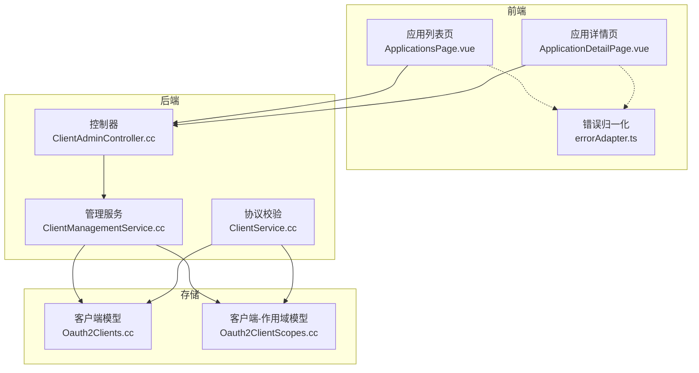
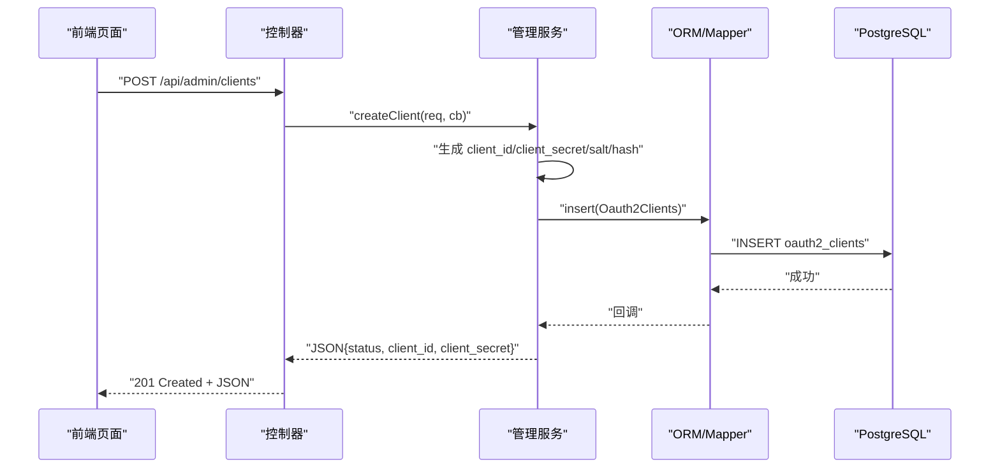
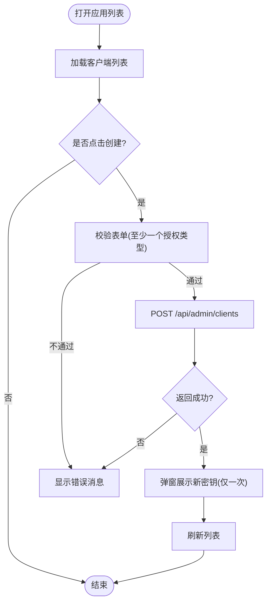
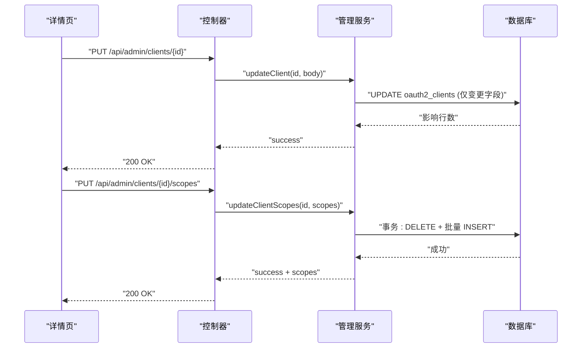
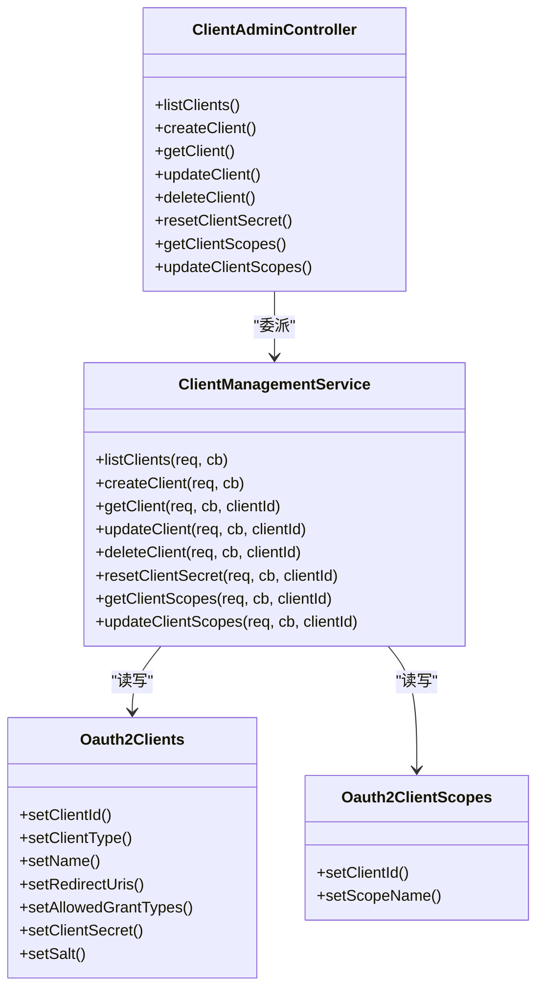
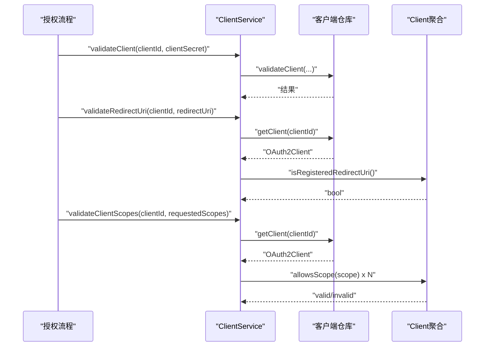
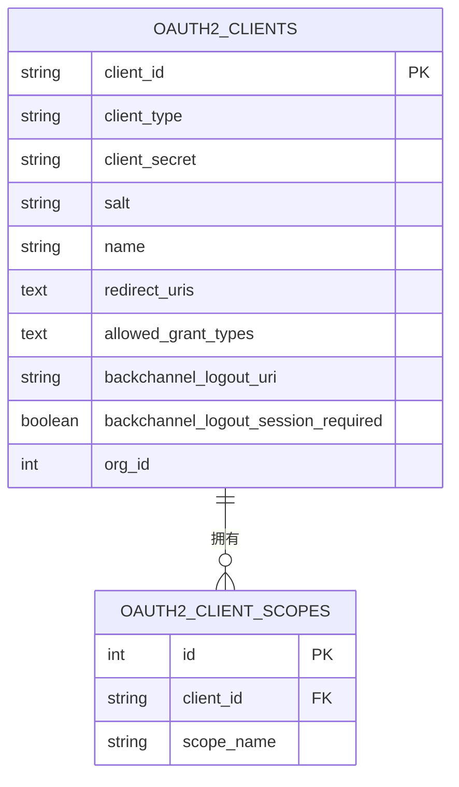
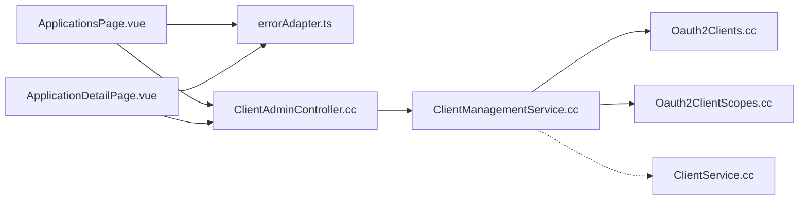

# 应用程序管理

<cite>
**本文引用的文件**
- [ClientAdminController.cc](file://libs/drogon/src/controllers/ClientAdminController.cc)
- [ClientManagementService.cc](file://libs/drogon/src/admin/ClientManagementService.cc)
- [ClientService.cc](file://libs/oauth2/src/protocol/ClientService.cc)
- [Oauth2Clients.cc](file://libs/storage-postgres/src/models/Oauth2Clients.cc)
- [Oauth2ClientScopes.cc](file://libs/storage-postgres/src/models/Oauth2ClientScopes.cc)
- [ApplicationsPage.vue](file://frontends/admin/src/pages/applications/ApplicationsPage.vue)
- [ApplicationDetailPage.vue](file://frontends/admin/src/pages/applications/ApplicationDetailPage.vue)
- [errorAdapter.ts](file://frontends/admin/src/services/errorAdapter.ts)
</cite>

## 目录
1. [简介](#简介)
2. [项目结构](#项目结构)
3. [核心组件](#核心组件)
4. [架构总览](#架构总览)
5. [详细组件分析](#详细组件分析)
6. [依赖关系分析](#依赖关系分析)
7. [性能考虑](#性能考虑)
8. [故障排查指南](#故障排查指南)
9. [结论](#结论)
10. [附录：API 集成与最佳实践](#附录api-集成与最佳实践)

## 简介
本模块提供“应用程序（OAuth2/OIDC Client）”的完整管理能力，覆盖应用注册、配置管理、客户端 ID 与密钥生成、重定向 URI 与授权类型设置、权限范围（Scope）分配，以及前端详情页面的编辑与展示。后端通过控制器与服务层解耦设计，统一错误响应与数据库访问；前端提供列表与详情双页面，支持表单校验、错误归一化与数据同步。

## 项目结构
- 前端（Admin 控制台）
  - 应用列表页：创建、删除、重置密钥、跳转详情
  - 应用详情页：基本信息、认证配置（重定向 URI、授权类型）、权限范围、凭据管理
  - 错误处理：统一的错误归一化模块，避免原生 alert
- 后端（Drogon 服务）
  - 控制器：薄适配层，仅负责解析请求并委派到服务层
  - 管理服务：实现 CRUD、密钥轮换、Scope 批量更新（事务）
  - OAuth2 协议校验：客户端验证、重定向 URI 校验、Scope 校验
- 存储模型
  - 客户端主表：client_id、client_type、name、redirect_uris、allowed_grant_types、salt、client_secret 等
  - 客户端-作用域关联表：client_id、scope_name

**图表来源**
- [ClientAdminController.cc:21-96](file://libs/drogon/src/controllers/ClientAdminController.cc#L21-L96)
- [ClientManagementService.cc:68-574](file://libs/drogon/src/admin/ClientManagementService.cc#L68-L574)
- [ClientService.cc:6-93](file://libs/oauth2/src/protocol/ClientService.cc#L6-L93)
- [Oauth2Clients.cc:23-47](file://libs/storage-postgres/src/models/Oauth2Clients.cc#L23-L47)
- [Oauth2ClientScopes.cc:18-29](file://libs/storage-postgres/src/models/Oauth2ClientScopes.cc#L18-L29)
- [ApplicationsPage.vue:35-95](file://frontends/admin/src/pages/applications/ApplicationsPage.vue#L35-L95)
- [ApplicationDetailPage.vue:51-148](file://frontends/admin/src/pages/applications/ApplicationDetailPage.vue#L51-L148)
- [errorAdapter.ts:89-174](file://frontends/admin/src/services/errorAdapter.ts#L89-L174)

**章节来源**
- [ClientAdminController.cc:21-96](file://libs/drogon/src/controllers/ClientAdminController.cc#L21-L96)
- [ClientManagementService.cc:68-574](file://libs/drogon/src/admin/ClientManagementService.cc#L68-L574)
- [ApplicationsPage.vue:35-95](file://frontends/admin/src/pages/applications/ApplicationsPage.vue#L35-L95)
- [ApplicationDetailPage.vue:51-148](file://frontends/admin/src/pages/applications/ApplicationDetailPage.vue#L51-L148)
- [errorAdapter.ts:89-174](file://frontends/admin/src/services/errorAdapter.ts#L89-L174)

## 核心组件
- 控制器层（薄适配）
  - 暴露 REST 端点：列表、创建、获取、更新、删除、重置密钥、查询/更新 Scope
  - 所有操作均委托至管理服务，保持 HTTP 适配职责单一
- 管理服务（业务逻辑）
  - 创建应用：生成 client_id、client_secret，计算 salt 与哈希后落库
  - 读取/更新/删除：参数校验、存在性检查、字段级更新
  - 重置密钥：生成新密钥、新 salt、新哈希，原子更新
  - Scope 管理：先删后插，使用事务保证一致性
- 协议校验服务
  - 客户端凭证校验、重定向 URI 白名单校验、Scope 允许范围校验
- 存储模型
  - 客户端主表与关联表映射，提供 ORM 插入/查询/更新能力

**章节来源**
- [ClientAdminController.cc:102-186](file://libs/drogon/src/controllers/ClientAdminController.cc#L102-L186)
- [ClientManagementService.cc:110-416](file://libs/drogon/src/admin/ClientManagementService.cc#L110-L416)
- [ClientService.cc:6-93](file://libs/oauth2/src/protocol/ClientService.cc#L6-L93)
- [Oauth2Clients.cc:23-47](file://libs/storage-postgres/src/models/Oauth2Clients.cc#L23-L47)
- [Oauth2ClientScopes.cc:18-29](file://libs/storage-postgres/src/models/Oauth2ClientScopes.cc#L18-L29)

## 架构总览
从前端到后端的调用链如下：
- 列表/详情/创建/更新/删除/重置密钥/Scope 管理：前端通过 axios 调用 /api/admin/clients 系列接口
- 控制器将请求转发给管理服务
- 管理服务通过 Drogon ORM Mapper 访问 Postgres 模型
- 协议校验在服务间复用，确保授权流程中的客户端、URI、Scope 一致

**图表来源**
- [ClientAdminController.cc:112-120](file://libs/drogon/src/controllers/ClientAdminController.cc#L112-L120)
- [ClientManagementService.cc:110-169](file://libs/drogon/src/admin/ClientManagementService.cc#L110-L169)
- [Oauth2Clients.cc:756-770](file://libs/storage-postgres/src/models/Oauth2Clients.cc#L756-L770)

**章节来源**
- [ClientAdminController.cc:112-120](file://libs/drogon/src/controllers/ClientAdminController.cc#L112-L120)
- [ClientManagementService.cc:110-169](file://libs/drogon/src/admin/ClientManagementService.cc#L110-L169)

## 详细组件分析

### 应用列表与创建（ApplicationsPage.vue）
- 功能要点
  - 列表加载：GET /api/admin/clients
  - 创建应用：POST /api/admin/clients，提交 name、client_type、redirect_uris、allowed_grant_types
  - 删除应用：DELETE /api/admin/clients/{clientId}
  - 重置密钥：POST /api/admin/clients/{clientId}/reset-secret
  - 表单校验：至少选择一个授权类型；错误提示通过统一错误适配器显示
- 安全注意
  - 创建成功后弹窗展示 client_secret，并提示仅一次可见
  - 重置密钥会立即失效旧密钥

**图表来源**
- [ApplicationsPage.vue:35-95](file://frontends/admin/src/pages/applications/ApplicationsPage.vue#L35-L95)

**章节来源**
- [ApplicationsPage.vue:35-95](file://frontends/admin/src/pages/applications/ApplicationsPage.vue#L35-L95)

### 应用详情（ApplicationDetailPage.vue）
- 功能要点
  - 基本信息：查看/复制 client_id，编辑名称
  - 认证配置：编辑重定向 URI（每行一个），勾选允许的授权类型
  - 权限范围：选择系统可用 scope，保存后调用 PUT /api/admin/clients/{clientId}/scopes
  - 凭据管理：仅机密客户端可重置密钥；公共客户端无密钥
- 数据同步
  - 保存变更时仅提交发生变化的字段，减少冗余写入
  - 保存 Scope 后回写 scopes 列表，保持前后端一致

**图表来源**
- [ApplicationDetailPage.vue:78-127](file://frontends/admin/src/pages/applications/ApplicationDetailPage.vue#L78-L127)
- [ClientManagementService.cc:234-315](file://libs/drogon/src/admin/ClientManagementService.cc#L234-L315)
- [ClientManagementService.cc:461-574](file://libs/drogon/src/admin/ClientManagementService.cc#L461-L574)

**章节来源**
- [ApplicationDetailPage.vue:78-127](file://frontends/admin/src/pages/applications/ApplicationDetailPage.vue#L78-L127)
- [ClientManagementService.cc:234-315](file://libs/drogon/src/admin/ClientManagementService.cc#L234-L315)
- [ClientManagementService.cc:461-574](file://libs/drogon/src/admin/ClientManagementService.cc#L461-L574)

### 后端控制器与服务（ClientAdminController.cc / ClientManagementService.cc）
- 控制器职责
  - 声明 OpenAPI 端点信息（路径、方法、标签、鉴权要求）
  - 将请求与回调传递给管理服务
- 管理服务职责
  - listClients：分页/排序由上层控制，当前返回全部并按 client_id 稳定展示
  - createClient：生成 UUID 作为 client_id，随机 token 作为 client_secret，计算 salt 与哈希后入库
  - getClient/updateClient/deleteClient：参数校验、存在性检查、字段级更新
  - resetClientSecret：生成新密钥、新 salt、新哈希，原子更新
  - getClientScopes/updateClientScopes：读取/更新 Scope，更新时使用事务保证先删后插的一致性

**图表来源**
- [ClientAdminController.cc:102-186](file://libs/drogon/src/controllers/ClientAdminController.cc#L102-L186)
- [ClientManagementService.cc:68-574](file://libs/drogon/src/admin/ClientManagementService.cc#L68-L574)
- [Oauth2Clients.cc:507-674](file://libs/storage-postgres/src/models/Oauth2Clients.cc#L507-L674)
- [Oauth2ClientScopes.cc:223-270](file://libs/storage-postgres/src/models/Oauth2ClientScopes.cc#L223-L270)

**章节来源**
- [ClientAdminController.cc:102-186](file://libs/drogon/src/controllers/ClientAdminController.cc#L102-L186)
- [ClientManagementService.cc:68-574](file://libs/drogon/src/admin/ClientManagementService.cc#L68-L574)

### 协议校验（ClientService.cc）
- validateClient：校验客户端 ID 与密钥
- validateRedirectUri：校验重定向 URI 是否在客户端白名单中
- validateClientScopes：校验请求的 Scope 是否被该客户端允许

**图表来源**
- [ClientService.cc:6-93](file://libs/oauth2/src/protocol/ClientService.cc#L6-L93)

**章节来源**
- [ClientService.cc:6-93](file://libs/oauth2/src/protocol/ClientService.cc#L6-L93)

### 数据存储模型（Oauth2Clients / Oauth2ClientScopes）
- 客户端主表字段
  - client_id（主键）、client_type、client_secret、salt、name、redirect_uris、allowed_grant_types、backchannel_logout_uri、backchannel_logout_session_required、org_id
- 客户端-作用域关联表字段
  - id（自增主键）、client_id、scope_name

**图表来源**
- [Oauth2Clients.cc:23-47](file://libs/storage-postgres/src/models/Oauth2Clients.cc#L23-L47)
- [Oauth2ClientScopes.cc:18-29](file://libs/storage-postgres/src/models/Oauth2ClientScopes.cc#L18-L29)

**章节来源**
- [Oauth2Clients.cc:23-47](file://libs/storage-postgres/src/models/Oauth2Clients.cc#L23-L47)
- [Oauth2ClientScopes.cc:18-29](file://libs/storage-postgres/src/models/Oauth2ClientScopes.cc#L18-L29)

## 依赖关系分析
- 前端依赖
  - ApplicationsPage.vue 与 ApplicationDetailPage.vue 依赖 errorAdapter.ts 进行错误归一化，确保一致的本地化提示
- 后端依赖
  - 控制器依赖管理服务；管理服务依赖 ORM 模型；协议校验服务依赖客户端仓库与聚合模型
- 存储依赖
  - 客户端主表与作用域关联表通过 client_id 建立一对多关系

**图表来源**
- [ApplicationsPage.vue:35-95](file://frontends/admin/src/pages/applications/ApplicationsPage.vue#L35-L95)
- [ApplicationDetailPage.vue:51-148](file://frontends/admin/src/pages/applications/ApplicationDetailPage.vue#L51-L148)
- [ClientAdminController.cc:102-186](file://libs/drogon/src/controllers/ClientAdminController.cc#L102-L186)
- [ClientManagementService.cc:68-574](file://libs/drogon/src/admin/ClientManagementService.cc#L68-L574)
- [ClientService.cc:6-93](file://libs/oauth2/src/protocol/ClientService.cc#L6-L93)

**章节来源**
- [ApplicationsPage.vue:35-95](file://frontends/admin/src/pages/applications/ApplicationsPage.vue#L35-L95)
- [ApplicationDetailPage.vue:51-148](file://frontends/admin/src/pages/applications/ApplicationDetailPage.vue#L51-L148)
- [ClientAdminController.cc:102-186](file://libs/drogon/src/controllers/ClientAdminController.cc#L102-L186)
- [ClientManagementService.cc:68-574](file://libs/drogon/src/admin/ClientManagementService.cc#L68-L574)
- [ClientService.cc:6-93](file://libs/oauth2/src/protocol/ClientService.cc#L6-L93)

## 性能考虑
- 列表查询：当前返回全量，适合中小规模；若数据量大，建议在上层增加分页与过滤
- 更新策略：服务端按字段是否存在决定是否更新，避免覆盖未变更字段
- Scope 更新：采用事务先删后插，保证一致性；在高并发场景下注意锁竞争
- 密钥生成：使用安全随机数与盐值哈希，避免碰撞与彩虹表攻击

[本节为通用性能建议，无需特定文件引用]

## 故障排查指南
- 常见错误分类
  - 数据库不可用：返回统一错误信封，包含错误码与请求 ID
  - 资源不存在：如客户端不存在或受影响行数为 0
  - 输入无效：缺少必填字段、JSON 格式错误、未指定可更新字段
- 前端错误处理
  - 使用 errorAdapter.ts 将网络异常、协议错误、未知错误统一归一化为可读消息
  - 避免使用原生 alert，统一以 UI 内提示呈现
- 定位步骤
  - 查看浏览器网络面板中的 request_id，结合服务端日志定位
  - 检查请求体是否符合预期（字段名、类型、数组结构）
  - 对 Scope 更新失败，确认事务是否执行成功（先删后插）

**章节来源**
- [ClientManagementService.cc:24-55](file://libs/drogon/src/admin/ClientManagementService.cc#L24-L55)
- [errorAdapter.ts:89-174](file://frontends/admin/src/services/errorAdapter.ts#L89-L174)

## 结论
本模块实现了完整的“应用程序管理”闭环：前端提供直观的列表与详情编辑能力，后端通过控制器与服务层解耦，保障 CRUD、密钥管理与 Scope 分配的准确性与一致性；协议校验服务确保授权流程中的客户端、重定向 URI 与 Scope 符合规范。整体设计遵循最小权限与安全优先原则，便于扩展与维护。

[本节为总结性内容，无需特定文件引用]

## 附录：API 集成与最佳实践
- 端点清单（示例）
  - GET /api/admin/clients：列出客户端
  - POST /api/admin/clients：创建客户端（返回一次性 client_secret）
  - GET /api/admin/clients/{clientId}：获取客户端详情（含 scopes）
  - PUT /api/admin/clients/{clientId}：更新客户端（name、redirect_uris、allowed_grant_types）
  - DELETE /api/admin/clients/{clientId}：删除客户端
  - POST /api/admin/clients/{clientId}/reset-secret：重置密钥（返回一次性新密钥）
  - GET /api/admin/clients/{clientId}/scopes：获取客户端 Scope
  - PUT /api/admin/clients/{clientId}/scopes：更新客户端 Scope（数组）
- 请求/响应约定
  - 统一错误信封：包含 error.code、error.request_id
  - 成功响应：status=success，附带业务数据
- 安全最佳实践
  - 密钥仅在创建或重置时返回一次，务必安全存储
  - 使用 HTTPS 传输，避免明文泄露
  - 严格配置重定向 URI 白名单，防止开放重定向
  - 最小化授权范围，按需授予 Scope
- 前端集成要点
  - 使用 errorAdapter.ts 统一处理错误，避免裸抛异常
  - 表单校验在前端完成，减少无效请求
  - 敏感信息（密钥）弹窗展示并引导用户立即复制保存

**章节来源**
- [ClientAdminController.cc:21-96](file://libs/drogon/src/controllers/ClientAdminController.cc#L21-L96)
- [ClientManagementService.cc:110-416](file://libs/drogon/src/admin/ClientManagementService.cc#L110-L416)
- [ApplicationsPage.vue:47-95](file://frontends/admin/src/pages/applications/ApplicationsPage.vue#L47-L95)
- [ApplicationDetailPage.vue:78-148](file://frontends/admin/src/pages/applications/ApplicationDetailPage.vue#L78-L148)
- [errorAdapter.ts:89-174](file://frontends/admin/src/services/errorAdapter.ts#L89-L174)