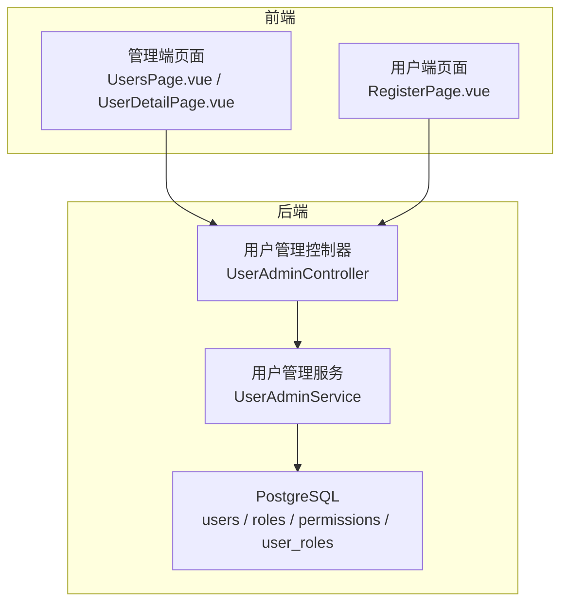
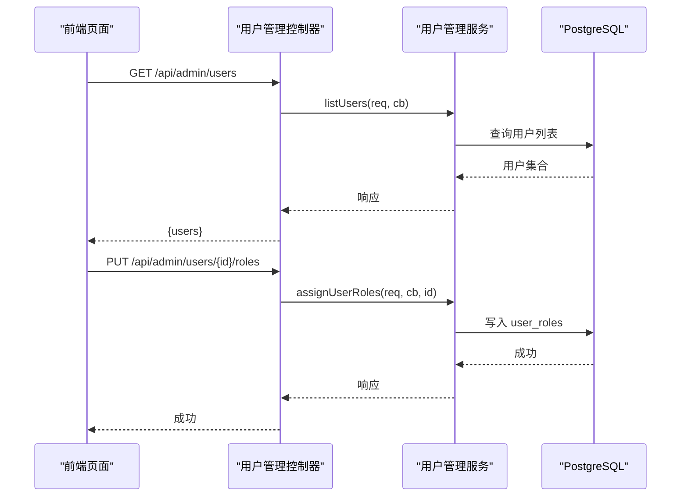
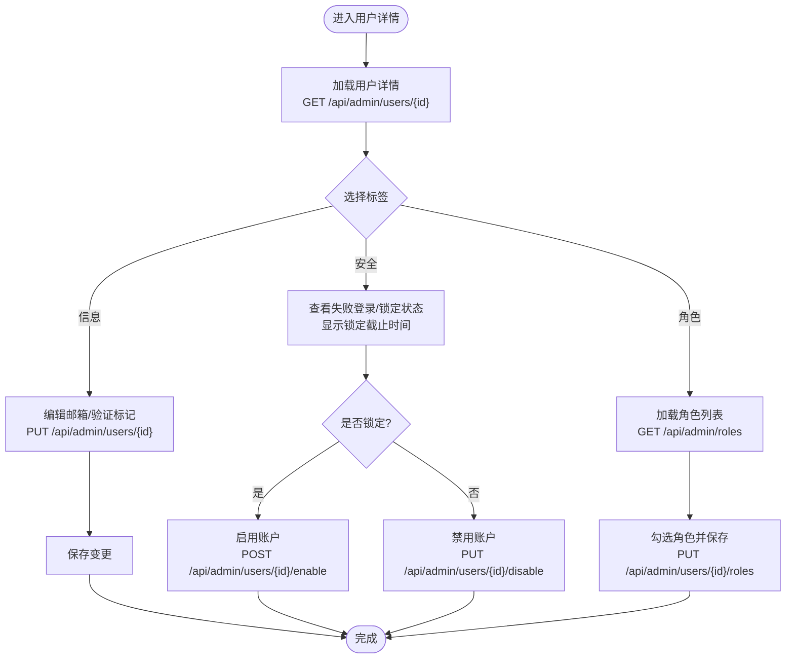
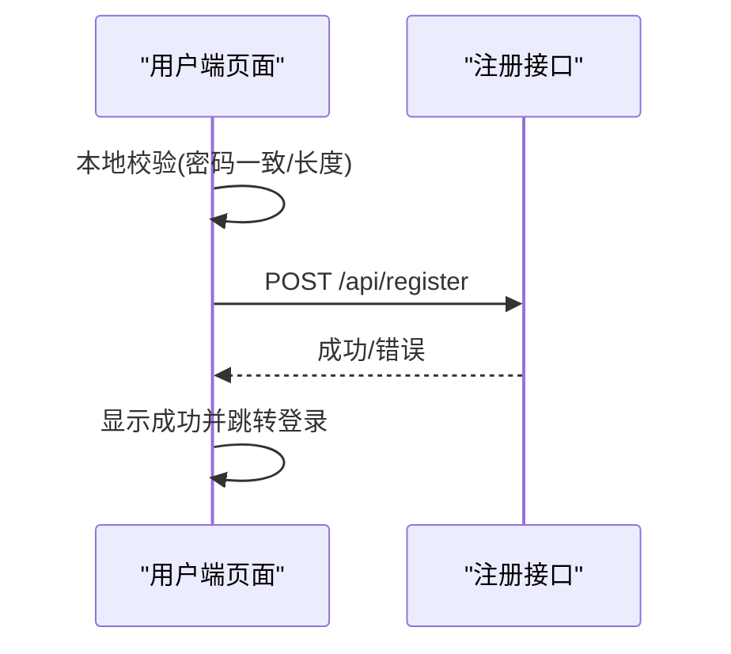
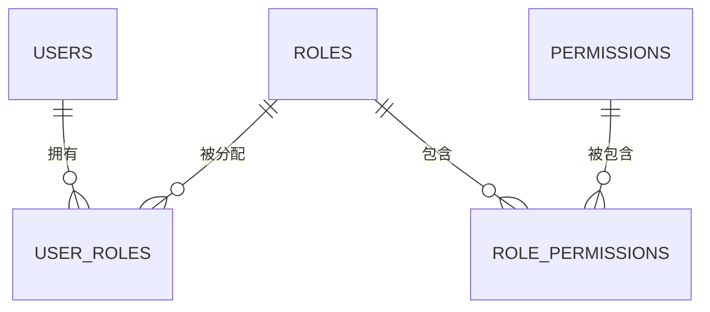
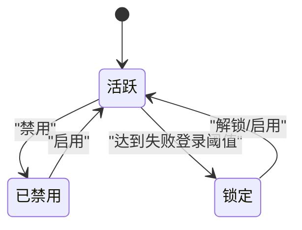
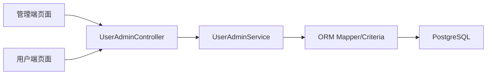

# 用户管理

<cite>
**本文引用的文件**
- [UserAdminController.h](file://libs/drogon/include/authforge/drogon/controllers/UserAdminController.h)
- [UserAdminController.cc](file://libs/drogon/src/controllers/UserAdminController.cc)
- [UserAdminService.h](file://libs/drogon/include/authforge/drogon/admin/UserAdminService.h)
- [V004__users_table.sql](file://apps/server/migrations/V004__users_table.sql)
- [V005__rbac_schema.sql](file://apps/server/migrations/V005__rbac_schema.sql)
- [UsersPage.vue](file://frontends/admin/src/pages/users/UsersPage.vue)
- [UserDetailPage.vue](file://frontends/admin/src/pages/users/UserDetailPage.vue)
- [RegisterPage.vue](file://frontends/user/src/pages/auth/RegisterPage.vue)
- [errorAdapter.ts](file://frontends/admin/src/services/errorAdapter.ts)
- [openapi.json](file://apps/server/docs/api/openapi.json)
- [AdminUserApiHttpTest.cc](file://tests/integration/admin/AdminUserApiHttpTest.cc)
</cite>

## 目录
1. [简介](#简介)
2. [项目结构](#项目结构)
3. [核心组件](#核心组件)
4. [架构总览](#架构总览)
5. [详细组件分析](#详细组件分析)
6. [依赖关系分析](#依赖关系分析)
7. [性能考虑](#性能考虑)
8. [故障排查指南](#故障排查指南)
9. [结论](#结论)
10. [附录](#附录)

## 简介
本文件面向“用户管理模块”，覆盖用户生命周期（注册、编辑、删除/禁用启用、状态管理）、用户详情页面（信息查看、角色分配与权限设置）、搜索筛选与分页、数据验证、批量操作与导入导出，以及最佳实践与安全注意事项。内容基于仓库中后端控制器与服务、数据库迁移、前端管理端与用户端页面、错误处理模块及集成测试等实现进行梳理。

## 项目结构
用户管理在前后端分离的架构下由以下部分组成：
- 后端 API：Drogon 控制器与业务服务暴露 /api/admin/users* 系列接口，负责用户列表、详情、更新、禁用/启用、角色查询与分配。
- 数据模型：PostgreSQL 迁移脚本定义 users、roles、permissions、user_roles、role_permissions 等表，支撑 RBAC。
- 前端管理端：Vue 页面提供用户列表、详情、角色分配、账号启用/禁用等操作。
- 前端用户端：注册页面调用 /api/register 完成新用户创建。
- 错误处理：统一的前端错误归一化模块，将后端错误转换为可读消息。
- 文档与测试：OpenAPI 描述与管理端 HTTP 集成测试用例。

图表来源
- [UserAdminController.h:17-60](file://libs/drogon/include/authforge/drogon/controllers/UserAdminController.h#L17-L60)
- [UserAdminController.cc:91-165](file://libs/drogon/src/controllers/UserAdminController.cc#L91-L165)
- [UserAdminService.h:25-62](file://libs/drogon/include/authforge/drogon/admin/UserAdminService.h#L25-L62)
- [V004__users_table.sql:3-10](file://apps/server/migrations/V004__users_table.sql#L3-L10)
- [V005__rbac_schema.sql:3-33](file://apps/server/migrations/V005__rbac_schema.sql#L3-L33)

章节来源
- [UserAdminController.h:17-60](file://libs/drogon/include/authforge/drogon/controllers/UserAdminController.h#L17-L60)
- [UserAdminController.cc:18-86](file://libs/drogon/src/controllers/UserAdminController.cc#L18-L86)
- [V004__users_table.sql:1-11](file://apps/server/migrations/V004__users_table.sql#L1-L11)
- [V005__rbac_schema.sql:1-59](file://apps/server/migrations/V005__rbac_schema.sql#L1-L59)

## 核心组件
- 用户管理控制器（HTTP 适配层）
  - 路由：/api/admin/users（GET 列表）、/api/admin/users/{id}（GET/PUT）、/api/admin/users/{id}/disable（PUT）、/api/admin/users/{id}/enable（POST）、/api/admin/users/{id}/roles（GET/PUT）。
  - 职责：解析请求、鉴权过滤后委派到服务层；注册 OpenAPI 元信息。
- 用户管理服务（应用服务层）
  - 方法：listUsers/getUser/updateUser/disableUser/enableUser/getUserRoles/assignUserRoles。
  - 职责：通过 ORM Mapper/Criteria 访问数据库，组装结果并回调响应。
- 数据模型与存储
  - users：用户主表（id、username、password_hash、salt、email、created_at）。
  - roles/permissions/user_roles/role_permissions：RBAC 模型，支持角色与权限绑定、用户角色分配。
- 前端管理端
  - UsersPage：列出用户、展示邮箱验证/MFA 状态、打开角色分配弹窗、调用 PUT /roles 更新。
  - UserDetailPage：查看用户详情、修改邮箱与邮箱验证标记、启用/禁用账户、按角色列表勾选并保存。
- 前端用户端
  - RegisterPage：提交用户名、密码、邮箱至 /api/register，本地校验密码长度与一致性。
- 错误处理
  - errorAdapter：统一归一化后端错误为结构化对象，支持网络失败、协议错误、未知错误等场景。

章节来源
- [UserAdminController.h:17-60](file://libs/drogon/include/authforge/drogon/controllers/UserAdminController.h#L17-L60)
- [UserAdminController.cc:91-165](file://libs/drogon/src/controllers/UserAdminController.cc#L91-L165)
- [UserAdminService.h:25-62](file://libs/drogon/include/authforge/drogon/admin/UserAdminService.h#L25-L62)
- [V004__users_table.sql:3-10](file://apps/server/migrations/V004__users_table.sql#L3-L10)
- [V005__rbac_schema.sql:3-33](file://apps/server/migrations/V005__rbac_schema.sql#L3-L33)
- [UsersPage.vue:20-57](file://frontends/admin/src/pages/users/UsersPage.vue#L20-L57)
- [UserDetailPage.vue:34-116](file://frontends/admin/src/pages/users/UserDetailPage.vue#L34-L116)
- [RegisterPage.vue:16-40](file://frontends/user/src/pages/auth/RegisterPage.vue#L16-L40)
- [errorAdapter.ts:89-174](file://frontends/admin/src/services/errorAdapter.ts#L89-L174)

## 架构总览
用户管理的请求从前端发起，经过鉴权过滤器进入控制器，再由服务层通过 ORM 访问数据库，最终返回 JSON。管理端页面负责交互与状态展示，用户端页面负责注册流程。

图表来源
- [UserAdminController.cc:91-165](file://libs/drogon/src/controllers/UserAdminController.cc#L91-L165)
- [UserAdminService.h:25-62](file://libs/drogon/include/authforge/drogon/admin/UserAdminService.h#L25-L62)
- [V005__rbac_schema.sql:18-33](file://apps/server/migrations/V005__rbac_schema.sql#L18-L33)

## 详细组件分析

### 用户列表与详情（管理端）
- 列表页
  - 获取用户列表：GET /api/admin/users，渲染用户名、邮箱、邮箱验证、MFA 状态。
  - 角色分配弹窗：输入角色名（逗号分隔），调用 PUT /api/admin/users/{id}/roles 更新。
- 详情页
  - 获取详情：GET /api/admin/users/{id}，展示基本信息、安全状态（锁定时间、失败登录次数、MFA）。
  - 信息编辑：PUT /api/admin/users/{id}，可更新 email 与 email_verified。
  - 账号状态：PUT /api/admin/users/{id}/disable 与 POST /api/admin/users/{id}/enable。
  - 角色管理：GET /api/admin/roles 获取可用角色，勾选后 PUT /api/admin/users/{id}/roles 保存。

图表来源
- [UserDetailPage.vue:34-116](file://frontends/admin/src/pages/users/UserDetailPage.vue#L34-L116)
- [UserDetailPage.vue:119-247](file://frontends/admin/src/pages/users/UserDetailPage.vue#L119-L247)
- [UserAdminController.h:17-60](file://libs/drogon/include/authforge/drogon/controllers/UserAdminController.h#L17-L60)

章节来源
- [UsersPage.vue:20-57](file://frontends/admin/src/pages/users/UsersPage.vue#L20-L57)
- [UserDetailPage.vue:34-116](file://frontends/admin/src/pages/users/UserDetailPage.vue#L34-L116)
- [UserDetailPage.vue:119-247](file://frontends/admin/src/pages/users/UserDetailPage.vue#L119-L247)
- [UserAdminController.h:17-60](file://libs/drogon/include/authforge/drogon/controllers/UserAdminController.h#L17-L60)

### 用户注册（用户端）
- 前端校验：确认密码一致、密码长度不少于 6 位。
- 提交注册：POST /api/register，携带 username、password、email。
- 成功后提示并跳转登录页。

图表来源
- [RegisterPage.vue:16-40](file://frontends/user/src/pages/auth/RegisterPage.vue#L16-L40)
- [RegisterPage.vue:43-94](file://frontends/user/src/pages/auth/RegisterPage.vue#L43-L94)
- [openapi.json:1142-1186](file://apps/server/docs/api/openapi.json#L1142-L1186)

章节来源
- [RegisterPage.vue:16-40](file://frontends/user/src/pages/auth/RegisterPage.vue#L16-L40)
- [RegisterPage.vue:43-94](file://frontends/user/src/pages/auth/RegisterPage.vue#L43-L94)
- [openapi.json:1142-1186](file://apps/server/docs/api/openapi.json#L1142-L1186)

### 用户角色与权限（RBAC）
- 数据模型
  - roles：角色定义。
  - permissions：权限定义。
  - user_roles：用户与角色的多对多关系。
  - role_permissions：角色与权限的多对多关系。
- 管理端能力
  - 为用户分配/更新角色：PUT /api/admin/users/{id}/roles。
  - 查询用户当前角色：GET /api/admin/users/{id}/roles。
  - 查询可用角色列表：GET /api/admin/roles。

图表来源
- [V005__rbac_schema.sql:3-33](file://apps/server/migrations/V005__rbac_schema.sql#L3-L33)

章节来源
- [V005__rbac_schema.sql:3-33](file://apps/server/migrations/V005__rbac_schema.sql#L3-L33)
- [UserDetailPage.vue:228-247](file://frontends/admin/src/pages/users/UserDetailPage.vue#L228-L247)

### 用户状态管理（启用/禁用/锁定）
- 禁用账户：PUT /api/admin/users/{id}/disable。
- 启用账户：POST /api/admin/users/{id}/enable。
- 锁定状态：详情页根据 locked_until 计算是否锁定，并提供解锁按钮。

图表来源
- [UserDetailPage.vue:87-116](file://frontends/admin/src/pages/users/UserDetailPage.vue#L87-L116)
- [UserAdminController.h:36-47](file://libs/drogon/include/authforge/drogon/controllers/UserAdminController.h#L36-L47)

章节来源
- [UserDetailPage.vue:87-116](file://frontends/admin/src/pages/users/UserDetailPage.vue#L87-L116)
- [UserAdminController.h:36-47](file://libs/drogon/include/authforge/drogon/controllers/UserAdminController.h#L36-L47)

### 搜索、筛选与分页
- 列表接口：GET /api/admin/users 用于获取用户列表，OpenAPI 描述为“分页列表”。
- 前端现状：当前管理端页面未实现搜索框、筛选器与分页控件，仅拉取全部用户并展示。
- 建议扩展：在控制器与服务层增加查询参数（如 keyword、verified、mfa_enabled、page/page_size），并在前端添加对应 UI。

章节来源
- [UserAdminController.cc:22-29](file://libs/drogon/src/controllers/UserAdminController.cc#L22-L29)
- [UsersPage.vue:20-31](file://frontends/admin/src/pages/users/UsersPage.vue#L20-L31)

### 数据验证
- 前端注册校验：密码一致性、最小长度限制。
- 后端字段约束：users.username 非空且唯一；email 可选；密码哈希与盐字段存在。
- 错误归一化：前端通过 errorAdapter 将后端错误映射为可读消息，涵盖网络失败、协议错误、未知错误等。

章节来源
- [RegisterPage.vue:16-40](file://frontends/user/src/pages/auth/RegisterPage.vue#L16-L40)
- [V004__users_table.sql:3-10](file://apps/server/migrations/V004__users_table.sql#L3-L10)
- [errorAdapter.ts:89-174](file://frontends/admin/src/services/errorAdapter.ts#L89-L174)

### 批量操作与导入导出
- 当前实现：未发现批量禁用/启用、批量分配角色、批量导入/导出的接口或前端入口。
- 建议方案：
  - 批量操作：新增 PUT /api/admin/users/batch（支持 ids[]、action=disable/enable/assign_roles）。
  - 导入导出：新增 CSV/Excel 导入接口与导出下载接口，结合服务端校验与事务保证一致性。
  - 前端：在列表页增加多选与批量操作工具栏，详情页保留单条操作。

[本节为规划性建议，不直接引用具体代码文件]

## 依赖关系分析
- 控制器依赖服务：UserAdminController 仅做 HTTP 适配，所有业务逻辑委托给 UserAdminService。
- 服务依赖 ORM：通过 Mapper/Criteria 访问 users、roles、user_roles 等表，避免在控制器中内联 SQL。
- 前端依赖 API：管理端与用户端分别调用不同的 API 路径，统一使用错误归一化模块。

图表来源
- [UserAdminController.cc:91-165](file://libs/drogon/src/controllers/UserAdminController.cc#L91-L165)
- [UserAdminService.h:25-62](file://libs/drogon/include/authforge/drogon/admin/UserAdminService.h#L25-L62)

章节来源
- [UserAdminController.cc:91-165](file://libs/drogon/src/controllers/UserAdminController.cc#L91-L165)
- [UserAdminService.h:25-62](file://libs/drogon/include/authforge/drogon/admin/UserAdminService.h#L25-L62)

## 性能考虑
- 列表与详情查询：建议使用分页与必要字段投影，减少不必要 JOIN；当前服务层已将复杂查询拆分为多次 Mapper 调用，符合规范。
- 角色分配：批量更新时注意事务边界，避免部分成功导致不一致。
- 前端渲染：列表过长时应引入虚拟滚动或分页加载。
- 缓存策略：对只读的用户角色列表可考虑短期缓存（需考虑一致性）。

[本节为通用优化建议，不直接引用具体代码文件]

## 故障排查指南
- 前端错误展示
  - 使用 errorAdapter.normalizeError 统一捕获并显示错误消息，避免原生 alert。
  - 关注 httpStatus、code、request_id 字段以定位问题。
- 常见错误场景
  - 网络失败：httpStatus=0，code 为网络错误码。
  - 协议错误：RFC 6749 错误字符串。
  - 未知错误：无法识别的响应体。
- 集成测试参考
  - 管理端用户 API 的 HTTP 集成测试覆盖了列表、详情、更新、禁用/启用、角色管理等分支，可作为回归依据。

章节来源
- [errorAdapter.ts:89-174](file://frontends/admin/src/services/errorAdapter.ts#L89-L174)
- [AdminUserApiHttpTest.cc:1-33](file://tests/integration/admin/AdminUserApiHttpTest.cc#L1-L33)

## 结论
该用户管理模块在后端提供了完整的 RESTful API，覆盖用户列表、详情、更新、启用/禁用与角色管理；在前端实现了管理端与用户端的常用操作。数据模型采用标准 RBAC 设计，便于扩展权限体系。当前缺失的功能包括搜索筛选与分页 UI、批量操作与导入导出。建议在现有基础上完善这些能力，并持续强化错误处理与安全性。

## 附录
- 关键 API 清单（管理端）
  - GET /api/admin/users：列出用户（OpenAPI 描述为分页）。
  - GET /api/admin/users/{id}：获取用户详情（含角色与状态）。
  - PUT /api/admin/users/{id}：更新用户信息（email、email_verified）。
  - PUT /api/admin/users/{id}/disable：禁用用户。
  - POST /api/admin/users/{id}/enable：启用用户。
  - GET /api/admin/users/{id}/roles：查询用户角色。
  - PUT /api/admin/users/{id}/roles：分配/更新用户角色。
- 关键 API 清单（用户端）
  - POST /api/register：注册用户（username、password、email）。

章节来源
- [UserAdminController.h:17-60](file://libs/drogon/include/authforge/drogon/controllers/UserAdminController.h#L17-L60)
- [UserAdminController.cc:22-86](file://libs/drogon/src/controllers/UserAdminController.cc#L22-L86)
- [openapi.json:1142-1186](file://apps/server/docs/api/openapi.json#L1142-L1186)