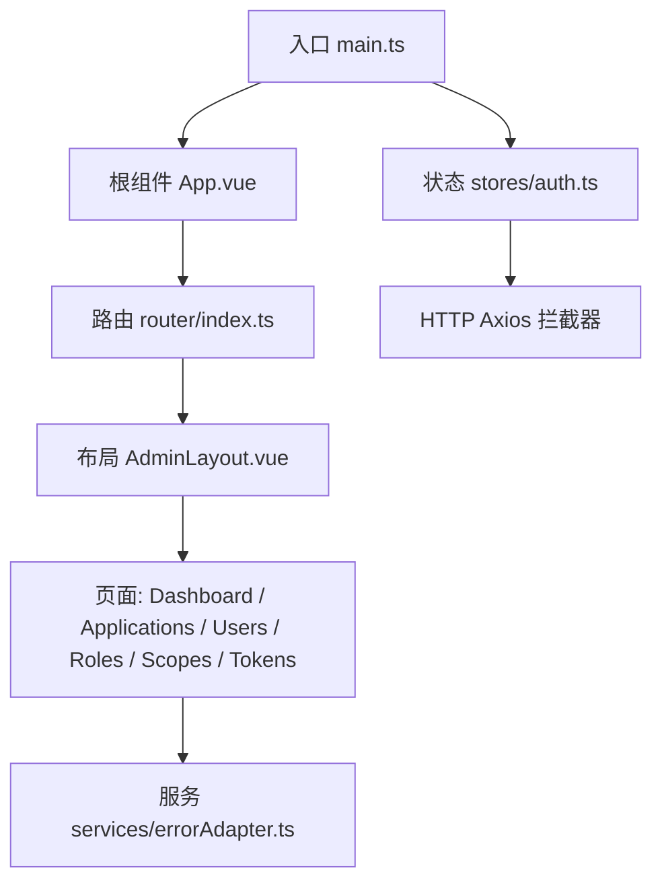
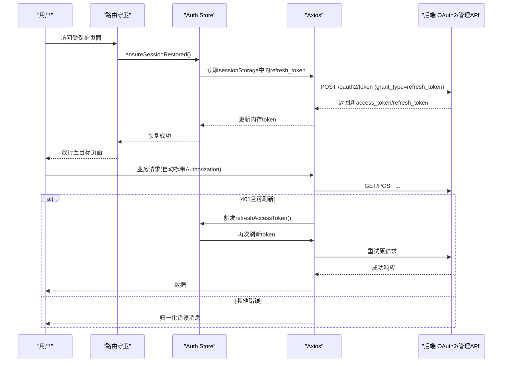
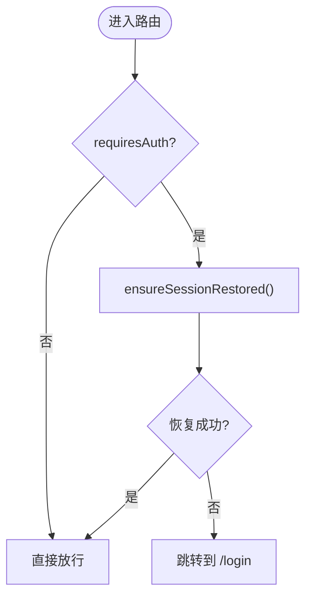
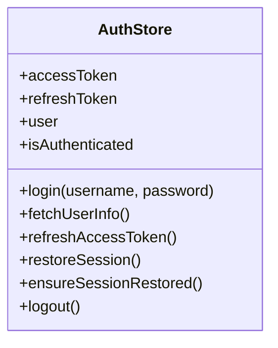
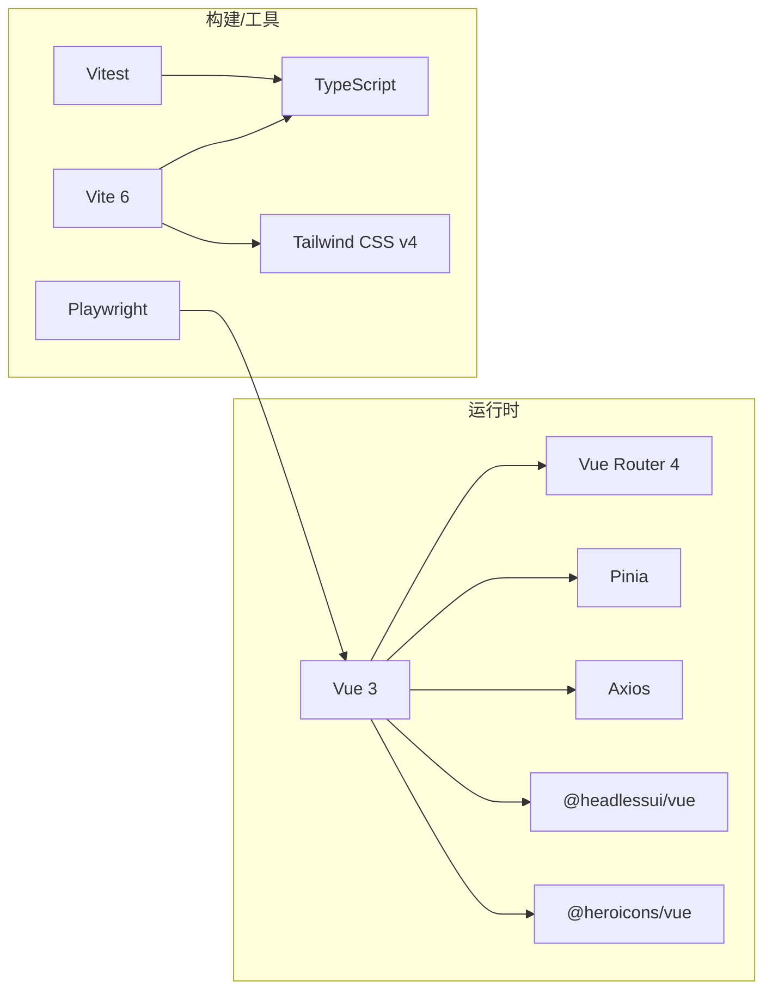

# 管理控制台

<cite>
**本文引用的文件**
- [frontends/admin/package.json](file://frontends/admin/package.json)
- [frontends/admin/vite.config.ts](file://frontends/admin/vite.config.ts)
- [frontends/admin/src/main.ts](file://frontends/admin/src/main.ts)
- [frontends/admin/src/App.vue](file://frontends/admin/src/App.vue)
- [frontends/admin/src/router/index.ts](file://frontends/admin/src/router/index.ts)
- [frontends/admin/src/stores/auth.ts](file://frontends/admin/src/stores/auth.ts)
- [frontends/admin/src/services/errorAdapter.ts](file://frontends/admin/src/services/errorAdapter.ts)
- [frontends/admin/src/components/layout/AdminLayout.vue](file://frontends/admin/src/components/layout/AdminLayout.vue)
- [frontends/admin/src/pages/dashboard/DashboardPage.vue](file://frontends/admin/src/pages/dashboard/DashboardPage.vue)
- [frontends/admin/src/pages/applications/ApplicationsPage.vue](file://frontends/admin/src/pages/applications/ApplicationsPage.vue)
- [frontends/admin/src/pages/users/UsersPage.vue](file://frontends/admin/src/pages/users/UsersPage.vue)
- [frontends/admin/src/pages/roles/RolesPage.vue](file://frontends/admin/src/pages/roles/RolesPage.vue)
- [frontends/admin/src/pages/scopes/ScopesPage.vue](file://frontends/admin/src/pages/scopes/ScopesPage.vue)
- [frontends/admin/src/pages/tokens/TokensPage.vue](file://frontends/admin/src/pages/tokens/TokensPage.vue)
- [frontends/admin/src/components/ui/AppAlert.vue](file://frontends/admin/src/components/ui/AppAlert.vue)
</cite>

## 目录
1. [简介](#简介)
2. [项目结构](#项目结构)
3. [核心组件](#核心组件)
4. [架构总览](#架构总览)
5. [详细组件分析](#详细组件分析)
6. [依赖关系分析](#依赖关系分析)
7. [性能考虑](#性能考虑)
8. [故障排查指南](#故障排查指南)
9. [结论](#结论)
10. [附录](#附录)

## 简介
本文件为 AuthForge 管理控制台的完整技术文档，聚焦于基于 Vue 3 + TypeScript + Vite 的前端实现。内容涵盖整体架构、路由与导航、状态管理（Pinia）、UI 组件库与样式体系、国际化支持、页面模块（仪表板、应用管理、用户管理、角色与权限、令牌管理）以及开发规范、测试策略、错误处理、安全与性能优化实践。

## 项目结构
管理控制台位于 frontends/admin 目录，采用功能域组织页面与组件：
- 入口与构建：main.ts、App.vue、vite.config.ts、package.json
- 路由：router/index.ts（含守卫与会话恢复）
- 状态：stores/auth.ts（认证、会话、Axios 拦截器）
- 服务：services/errorAdapter.ts（统一错误归一化与消息映射）
- 布局与通用 UI：components/layout/AdminLayout.vue、components/ui/*
- 页面：pages/*（dashboard、applications、users、roles、scopes、tokens 等）

图表来源
- [frontends/admin/src/main.ts:1-23](file://frontends/admin/src/main.ts#L1-L23)
- [frontends/admin/src/App.vue:1-4](file://frontends/admin/src/App.vue#L1-L4)
- [frontends/admin/src/router/index.ts:1-97](file://frontends/admin/src/router/index.ts#L1-L97)
- [frontends/admin/src/components/layout/AdminLayout.vue:1-332](file://frontends/admin/src/components/layout/AdminLayout.vue#L1-L332)
- [frontends/admin/src/stores/auth.ts:1-270](file://frontends/admin/src/stores/auth.ts#L1-L270)
- [frontends/admin/src/services/errorAdapter.ts:1-200](file://frontends/admin/src/services/errorAdapter.ts#L1-L200)

章节来源
- [frontends/admin/package.json:1-35](file://frontends/admin/package.json#L1-L35)
- [frontends/admin/vite.config.ts:1-40](file://frontends/admin/vite.config.ts#L1-L40)
- [frontends/admin/src/main.ts:1-23](file://frontends/admin/src/main.ts#L1-L23)
- [frontends/admin/src/App.vue:1-4](file://frontends/admin/src/App.vue#L1-L4)

## 核心组件
- 路由与守卫：集中定义受保护路由与登录回调，提供基于会话的访问控制。
- 状态管理：使用 Pinia 维护认证态、用户信息、错误提示；内置 Axios 拦截器自动附加 token、处理 401 刷新与失败跳转。
- 错误处理：统一的 errorAdapter 将后端错误、网络异常、协议错误归一化为可读消息，并支持多语言。
- 布局与导航：AdminLayout 提供侧边栏、面包屑、移动端菜单、用户菜单与登出。
- 页面模块：Dashboard 展示系统健康与统计；Applications/Users/Roles/Scopes/Tokens 提供 CRUD 与批量操作。

章节来源
- [frontends/admin/src/router/index.ts:1-97](file://frontends/admin/src/router/index.ts#L1-L97)
- [frontends/admin/src/stores/auth.ts:1-270](file://frontends/admin/src/stores/auth.ts#L1-L270)
- [frontends/admin/src/services/errorAdapter.ts:1-200](file://frontends/admin/src/services/errorAdapter.ts#L1-L200)
- [frontends/admin/src/components/layout/AdminLayout.vue:1-332](file://frontends/admin/src/components/layout/AdminLayout.vue#L1-L332)

## 架构总览
前端以 SPA 形式运行，通过 Vite 代理到本地后端端口进行开发与联调。认证流程采用授权码模式，登录后获取 access_token 与 refresh_token，refresh_token 持久化在 sessionStorage 中用于会话恢复。所有 API 调用通过 Axios 发起，请求头自动注入 Authorization，响应 401 时尝试刷新，失败则清理会话并跳转登录页。

图表来源
- [frontends/admin/src/router/index.ts:79-94](file://frontends/admin/src/router/index.ts#L79-L94)
- [frontends/admin/src/stores/auth.ts:144-255](file://frontends/admin/src/stores/auth.ts#L144-L255)

章节来源
- [frontends/admin/vite.config.ts:18-38](file://frontends/admin/vite.config.ts#L18-L38)
- [frontends/admin/src/stores/auth.ts:60-270](file://frontends/admin/src/stores/auth.ts#L60-L270)

## 详细组件分析

### 路由与导航
- 路由基础：history 模式 base 为 /admin/，懒加载各页面组件。
- 受保护路由：requiresAuth 标记的路由在进入前检查 isAuthenticated，若未登录则等待会话恢复后再决定放行或跳转登录。
- 导航项：AdminLayout 内维护导航分组与高亮逻辑，支持折叠侧边栏与移动端遮罩。

图表来源
- [frontends/admin/src/router/index.ts:4-97](file://frontends/admin/src/router/index.ts#L4-L97)

章节来源
- [frontends/admin/src/router/index.ts:1-97](file://frontends/admin/src/router/index.ts#L1-L97)
- [frontends/admin/src/components/layout/AdminLayout.vue:21-56](file://frontends/admin/src/components/layout/AdminLayout.vue#L21-L56)

### 状态管理与认证（Pinia）
- 存储键：refresh_token 保存在 sessionStorage，access_token 仅内存持有，降低 XSS 风险。
- 登录流程：POST /oauth2/login 获取授权码，再 POST /oauth2/token 换取令牌，随后拉取 /oauth2/userinfo 校验 admin 角色。
- 会话恢复：启动时从 sessionStorage 恢复 refresh_token 并刷新 access_token，成功后拉取用户信息并校验角色。
- 并发刷新：使用 in-flight 锁避免多次并发刷新导致后端旋转 refresh_token 失败。
- Axios 拦截器：请求自动注入 Authorization；响应 401 时尝试刷新，失败则清理会话、设置“会话已过期”错误并跳转登录。

图表来源
- [frontends/admin/src/stores/auth.ts:60-270](file://frontends/admin/src/stores/auth.ts#L60-L270)

章节来源
- [frontends/admin/src/stores/auth.ts:1-270](file://frontends/admin/src/stores/auth.ts#L1-L270)

### 错误处理与国际化
- 统一归一化：normalizeError 将 axios 错误转换为稳定结构（code、message、request_id、httpStatus），永不抛出。
- 解析优先级：错误信封 > RFC 6749 字符串错误 > 未知错误 > 网络失败。
- 会话过期：sessionExpiredError 生成标准化错误，配合拦截器完成统一提示与跳转。
- 多语言：默认 zh-CN，通过消息目录映射 code 到可读文案。

章节来源
- [frontends/admin/src/services/errorAdapter.ts:1-200](file://frontends/admin/src/services/errorAdapter.ts#L1-L200)

### 布局与交互（AdminLayout）
- 响应式：移动端侧边栏抽屉+遮罩，桌面端固定侧边栏，支持折叠。
- 面包屑：根据当前路径动态生成，便于定位。
- 用户菜单：显示头像/用户名，下拉包含设置与退出。
- 导航高亮：根据 route.path 判断激活项。

章节来源
- [frontends/admin/src/components/layout/AdminLayout.vue:1-332](file://frontends/admin/src/components/layout/AdminLayout.vue#L1-L332)

### 仪表板（Dashboard）
- 数据源：并行请求 /health/ready 与 /api/admin/dashboard/stats，渲染系统健康与关键指标。
- 骨架屏：加载期间使用 AppSkeleton 提升感知性能。
- 错误处理：捕获异常并通过 errorAdapter 归一化后展示。

章节来源
- [frontends/admin/src/pages/dashboard/DashboardPage.vue:1-199](file://frontends/admin/src/pages/dashboard/DashboardPage.vue#L1-L199)

### 应用程序管理（Applications）
- 列表：GET /api/admin/clients，展示名称、client_id、类型。
- 创建：POST /api/admin/clients，选择授权类型、重定向 URI，成功后弹窗显示 client_secret。
- 删除/重置密钥：DELETE /api/admin/clients/:id，POST /api/admin/clients/:id/reset-secret。
- 错误提示：统一通过 errorAdapter 显示中文提示。

章节来源
- [frontends/admin/src/pages/applications/ApplicationsPage.vue:1-210](file://frontends/admin/src/pages/applications/ApplicationsPage.vue#L1-L210)

### 用户管理（Users）
- 列表：GET /api/admin/users，展示用户名、邮箱、验证状态、MFA 开关。
- 分配角色：PUT /api/admin/users/:id/roles，支持逗号分隔的多角色。
- 详情：路由跳转至 user-detail 页面。

章节来源
- [frontends/admin/src/pages/users/UsersPage.vue:1-122](file://frontends/admin/src/pages/users/UsersPage.vue#L1-L122)

### 角色与权限（Roles & Scopes）
- 角色：CRUD 角色，区分内置角色不可删除；展示用户数。
- 作用域：CRUD 作用域，支持默认作用域、是否要求管理员角色、映射角色等属性。
- 错误处理：统一归一化并提示。

章节来源
- [frontends/admin/src/pages/roles/RolesPage.vue:1-188](file://frontends/admin/src/pages/roles/RolesPage.vue#L1-L188)
- [frontends/admin/src/pages/scopes/ScopesPage.vue:1-223](file://frontends/admin/src/pages/scopes/ScopesPage.vue#L1-L223)

### 令牌管理（Tokens）
- 列表：GET /api/admin/tokens?page&per_page&client_id&user_id，分页展示。
- 过滤与批量撤销：按客户端/用户过滤，支持按客户端批量撤销、按用户撤销。
- 时间格式化：兼容后端返回的 Unix 秒级时间戳与 ISO 字符串。

章节来源
- [frontends/admin/src/pages/tokens/TokensPage.vue:1-320](file://frontends/admin/src/pages/tokens/TokensPage.vue#L1-L320)

### UI 组件与样式
- 通用组件：AppAlert 提供信息/成功/警告/错误提示，支持可关闭。
- 样式体系：Tailwind CSS v4，通过 @tailwindcss/vite 插件集成；设计令牌与主题色通过全局样式与类名组合实现。

章节来源
- [frontends/admin/src/components/ui/AppAlert.vue:1-73](file://frontends/admin/src/components/ui/AppAlert.vue#L1-L73)
- [frontends/admin/vite.config.ts:9-17](file://frontends/admin/vite.config.ts#L9-L17)
- [frontends/admin/package.json:15-33](file://frontends/admin/package.json#L15-L33)

## 依赖关系分析
- 运行时依赖：Vue 3、Vue Router 4、Pinia、Axios、Headless UI、Heroicons。
- 构建依赖：Vite 6、TypeScript、@vitejs/plugin-vue、Tailwind CSS v4、Playwright、Vitest。
- 开发服务器：Vite 配置了 /api、/oauth2、/health、/.well-known 代理到本地后端 5555 端口。

图表来源
- [frontends/admin/package.json:15-33](file://frontends/admin/package.json#L15-L33)
- [frontends/admin/vite.config.ts:1-17](file://frontends/admin/vite.config.ts#L1-L17)

章节来源
- [frontends/admin/package.json:1-35](file://frontends/admin/package.json#L1-L35)
- [frontends/admin/vite.config.ts:1-40](file://frontends/admin/vite.config.ts#L1-L40)

## 性能考虑
- 路由懒加载：页面组件按需 import，减少首屏体积。
- 骨架屏与并发请求：Dashboard 使用骨架屏提升感知；并行请求 health 与 stats 缩短等待。
- Token 刷新去重：in-flight 锁避免并发刷新导致的竞态。
- 代理与缓存：开发环境通过 Vite 代理减少跨域开销；生产部署建议启用浏览器缓存与 CDN。
- 样式与图标：Tailwind 原子类与 SVG 图标减少额外资源加载。

[本节为通用指导，不直接分析具体文件]

## 故障排查指南
- 无法进入受保护页面：检查路由守卫与会话恢复逻辑，确认 sessionStorage 中存在有效 refresh_token。
- 401 频繁出现：确认后端 refresh_token 轮换策略；检查前端并发刷新锁是否正确工作。
- 错误消息不友好：确保通过 normalizeError 处理异常，避免直接读取原始响应字段。
- 开发联调失败：核对 vite.config.ts 代理路径与后端端口一致。
- 国际化缺失：检查 messages 目录与 errorAdapter 的 locale 参数传递。

章节来源
- [frontends/admin/src/router/index.ts:79-94](file://frontends/admin/src/router/index.ts#L79-L94)
- [frontends/admin/src/stores/auth.ts:144-255](file://frontends/admin/src/stores/auth.ts#L144-L255)
- [frontends/admin/src/services/errorAdapter.ts:89-174](file://frontends/admin/src/services/errorAdapter.ts#L89-L174)
- [frontends/admin/vite.config.ts:18-38](file://frontends/admin/vite.config.ts#L18-L38)

## 结论
管理控制台以清晰的模块化与职责分离实现了安全的认证与会话管理、统一的错误处理与国际化、丰富的管理功能与良好的用户体验。通过 Pinia 与 Axios 拦截器保障状态一致性，结合 Tailwind 与 Headless UI 提供一致的界面风格。建议在后续迭代中持续完善单元测试与 E2E 用例，强化边界条件与异常场景覆盖，并关注生产环境的性能与安全加固。

[本节为总结性内容，不直接分析具体文件]

## 附录

### 开发指南
- 组件开发规范
  - 使用 Vue 3 Composition API 与 TypeScript，保持单文件组件职责单一。
  - 复用通用 UI 组件（AppAlert、AppButton、AppInput 等），避免重复样式。
  - 表单与交互遵循无障碍最佳实践（aria-label、focus-visible）。
- API 集成方法
  - 所有 HTTP 请求通过 Axios 发起，依赖 auth store 的拦截器自动处理 token。
  - 错误一律通过 normalizeError 归一化，禁止直接读取 e.response.data.*。
- 测试策略
  - 单元测试：使用 Vitest 对纯函数与服务层进行测试（如 errorAdapter）。
  - E2E 测试：使用 Playwright 覆盖登录、导航、CRUD、错误处理与安全性用例。
  - 测试执行脚本见 package.json scripts。

章节来源
- [frontends/admin/package.json:6-13](file://frontends/admin/package.json#L6-L13)
- [frontends/admin/src/services/errorAdapter.ts:89-174](file://frontends/admin/src/services/errorAdapter.ts#L89-L174)

### 安全考虑
- 令牌安全：access_token 仅内存持有，refresh_token 存储在 sessionStorage，降低泄露面。
- 会话恢复：首次导航前完成会话恢复，避免误判未登录。
- 角色校验：登录后校验 admin 角色，无权限则强制登出并提示。
- 错误输出：统一归一化错误，避免敏感信息泄露。

章节来源
- [frontends/admin/src/stores/auth.ts:7-12](file://frontends/admin/src/stores/auth.ts#L7-L12)
- [frontends/admin/src/stores/auth.ts:116-123](file://frontends/admin/src/stores/auth.ts#L116-L123)
- [frontends/admin/src/stores/auth.ts:191-210](file://frontends/admin/src/stores/auth.ts#L191-L210)
- [frontends/admin/src/services/errorAdapter.ts:89-174](file://frontends/admin/src/services/errorAdapter.ts#L89-L174)

### 性能优化最佳实践
- 首屏优化：路由懒加载、骨架屏、并行请求。
- 网络优化：合理分页与过滤、避免大对象传输。
- 渲染优化：最小化重绘重排，合理使用 computed 与 watch。
- 构建优化：Tree-shaking、代码分割、静态资源压缩。

[本节为通用指导，不直接分析具体文件]