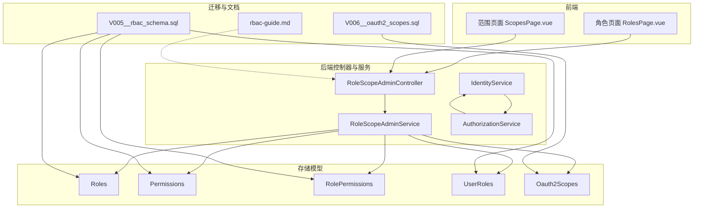
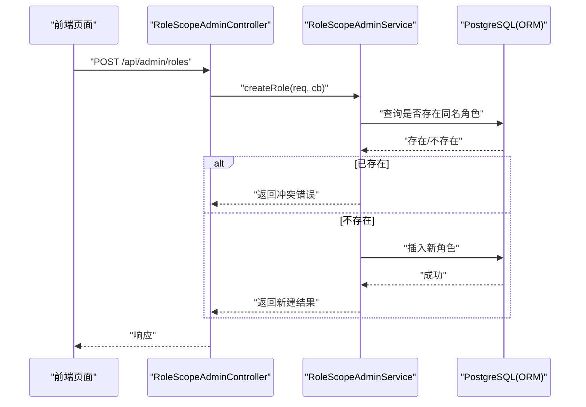
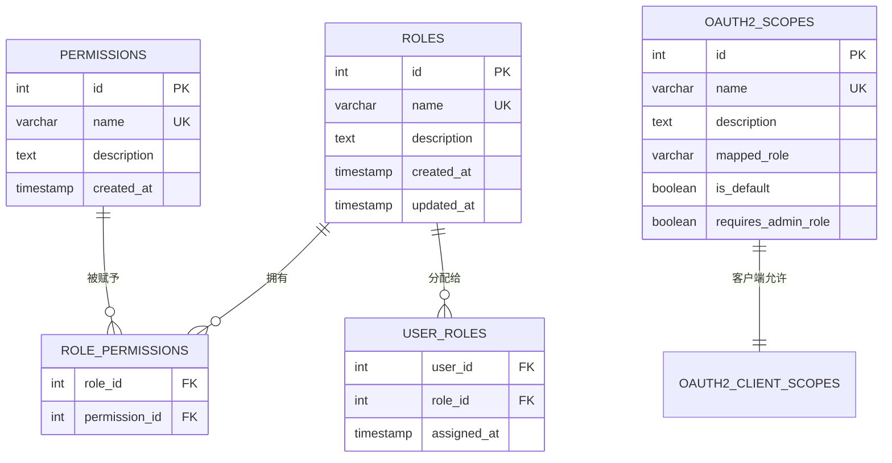
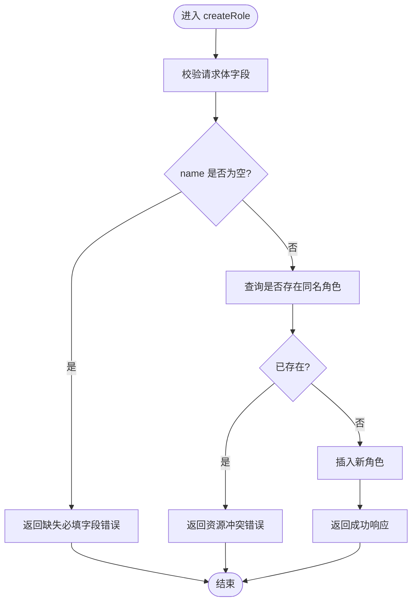
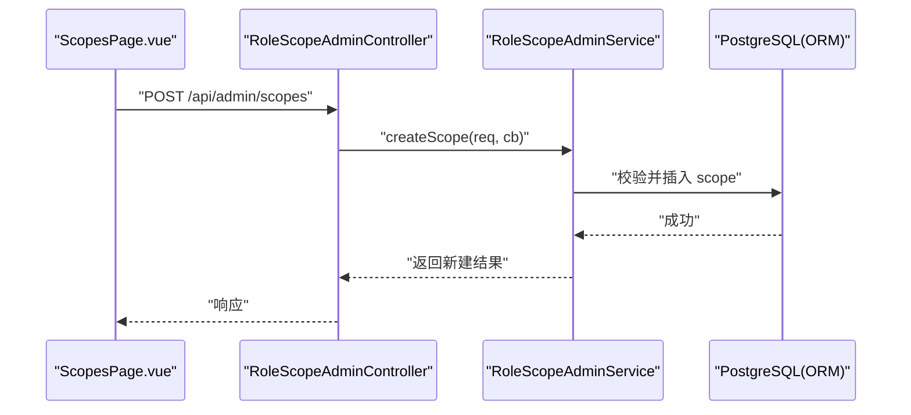
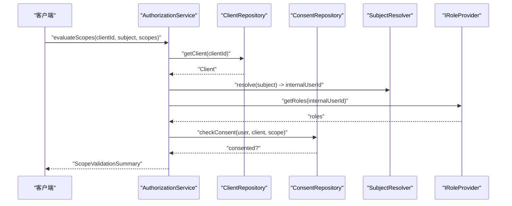
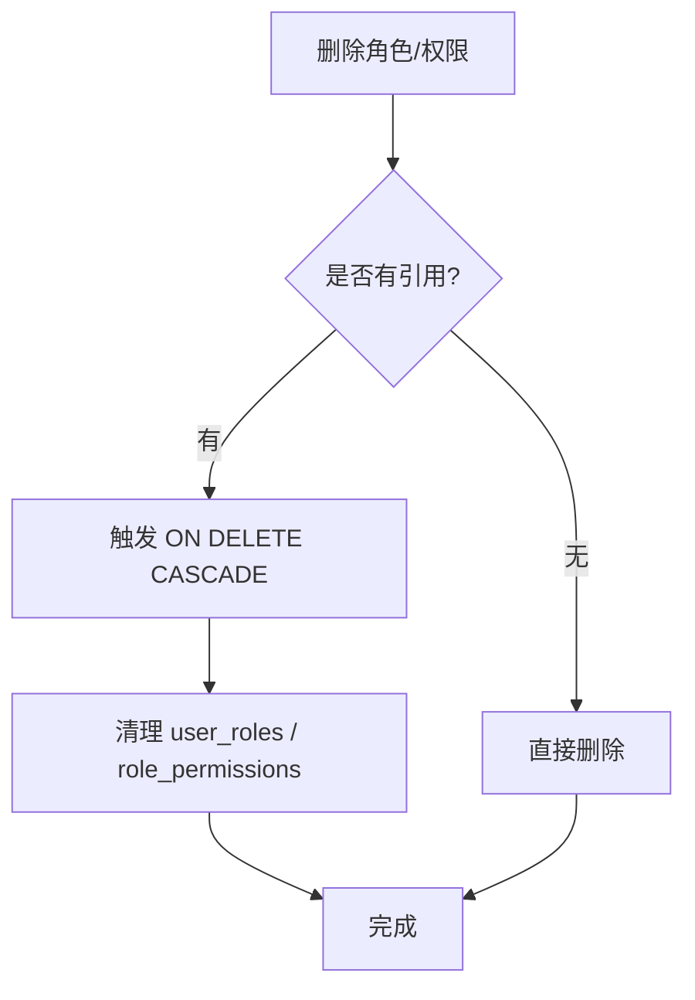
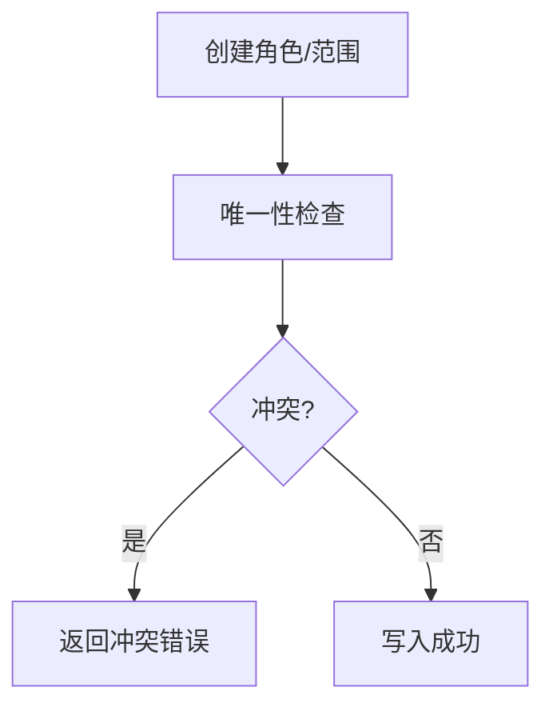
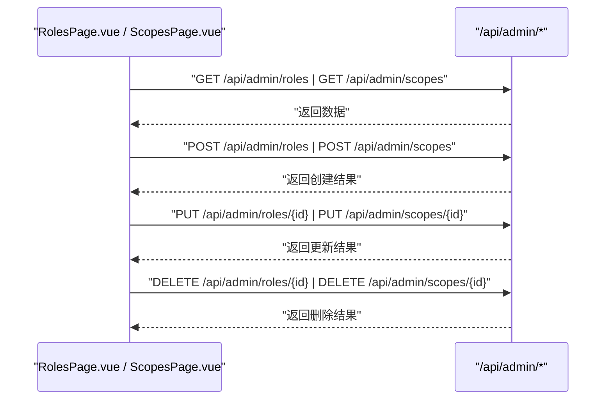
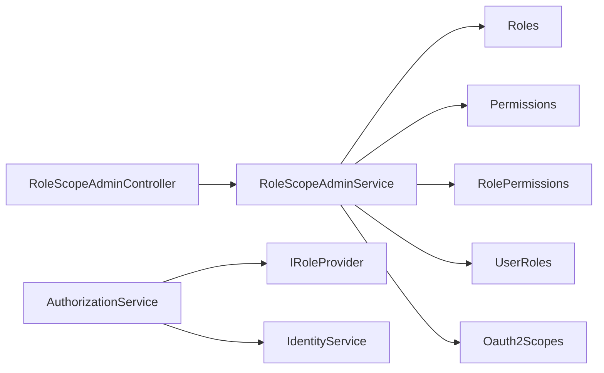

# 角色权限管理

<cite>
**本文引用的文件**
- [V005__rbac_schema.sql](file://apps/server/migrations/V005__rbac_schema.sql)
- [V006__oauth2_scopes.sql](file://apps/server/migrations/V006__oauth2_scopes.sql)
- [IRoleProvider.h](file://libs/common/include/authforge/common/ports/IRoleProvider.h)
- [RoleScopeAdminService.h](file://libs/drogon/include/authforge/drogon/admin/RoleScopeAdminService.h)
- [RoleScopeAdminController.h](file://libs/drogon/include/authforge/drogon/controllers/RoleScopeAdminController.h)
- [RoleScopeAdminController.cc](file://libs/drogon/src/controllers/RoleScopeAdminController.cc)
- [RoleScopeAdminService.cc](file://libs/drogon/src/admin/RoleScopeAdminService.cc)
- [IdentityService.cc](file://libs/drogon/src/services/IdentityService.cc)
- [AuthorizationService.cc](file://libs/oauth2/src/protocol/AuthorizationService.cc)
- [ScopeDecisionEngine.h](file://libs/oauth2/include/authforge/oauth2/access/ScopeDecisionEngine.h)
- [Roles.h](file://libs/storage-postgres/include/authforge/storage/postgres/models/Roles.h)
- [Permissions.h](file://libs/storage-postgres/include/authforge/storage/postgres/models/Permissions.h)
- [RolePermissions.h](file://libs/storage-postgres/include/authforge/storage/postgres/models/RolePermissions.h)
- [UserRoles.h](file://libs/storage-postgres/include/authforge/storage/postgres/models/UserRoles.h)
- [Oauth2Scopes.h](file://libs/storage-postgres/include/authforge/storage/postgres/models/Oauth2Scopes.h)
- [Scope.h](file://libs/common/include/authforge/common/model/Scope.h)
- [RolesPage.vue](file://frontends/admin/src/pages/roles/RolesPage.vue)
- [ScopesPage.vue](file://frontends/admin/src/pages/scopes/ScopesPage.vue)
- [rbac-guide.md](file://docs/backend/rbac-guide.md)
</cite>

## 目录
1. [简介](#简介)
2. [项目结构](#项目结构)
3. [核心组件](#核心组件)
4. [架构总览](#架构总览)
5. [详细组件分析](#详细组件分析)
6. [依赖关系分析](#依赖关系分析)
7. [性能考虑](#性能考虑)
8. [故障排查指南](#故障排查指南)
9. [结论](#结论)
10. [附录](#附录)

## 简介
本模块实现基于角色的访问控制（RBAC）与 OAuth2 Scope 分层策略，覆盖角色定义、权限范围（Scope）管理、角色与权限的关联、前端角色与范围管理页面、授权时的权限验证、级联删除处理以及权限冲突检测等。系统同时支持“基于角色的 URL 拦截”和“OAuth2 Scope 授权”两条路径：前者通过配置规则对请求进行鉴权；后者在授权流程中结合客户端允许列表、管理员角色要求与用户同意进行细粒度校验。

## 项目结构
- 数据库迁移层：定义 RBAC 与 OAuth2 Scope 相关表结构与默认数据。
- 领域接口与模型：提供角色提供者接口、Scope 值对象、ORM 模型映射。
- 服务与控制层：暴露管理 API，封装业务逻辑，执行 CRUD 与校验。
- 前端管理界面：提供角色与范围的创建、编辑、删除与展示。
- 文档与测试：说明设计思路并保障行为一致性。

**图表来源**
- [RolesPage.vue:1-188](file://frontends/admin/src/pages/roles/RolesPage.vue#L1-L188)
- [ScopesPage.vue:1-223](file://frontends/admin/src/pages/scopes/ScopesPage.vue#L1-L223)
- [RoleScopeAdminController.h:1-116](file://libs/drogon/include/authforge/drogon/controllers/RoleScopeAdminController.h#L1-L116)
- [RoleScopeAdminService.h:1-61](file://libs/drogon/include/authforge/drogon/admin/RoleScopeAdminService.h#L1-L61)
- [Roles.h:1-300](file://libs/storage-postgres/include/authforge/storage/postgres/models/Roles.h#L1-L300)
- [Permissions.h:1-268](file://libs/storage-postgres/include/authforge/storage/postgres/models/Permissions.h#L1-L268)
- [RolePermissions.h:1-229](file://libs/storage-postgres/include/authforge/storage/postgres/models/RolePermissions.h#L1-L229)
- [UserRoles.h:1-255](file://libs/storage-postgres/include/authforge/storage/postgres/models/UserRoles.h#L1-L255)
- [Oauth2Scopes.h:1-316](file://libs/storage-postgres/include/authforge/storage/postgres/models/Oauth2Scopes.h#L1-L316)
- [V005__rbac_schema.sql:1-59](file://apps/server/migrations/V005__rbac_schema.sql#L1-L59)
- [V006__oauth2_scopes.sql:1-55](file://apps/server/migrations/V006__oauth2_scopes.sql#L1-L55)
- [rbac-guide.md:1-83](file://docs/backend/rbac-guide.md#L1-L83)

**章节来源**
- [V005__rbac_schema.sql:1-59](file://apps/server/migrations/V005__rbac_schema.sql#L1-L59)
- [V006__oauth2_scopes.sql:1-55](file://apps/server/migrations/V006__oauth2_scopes.sql#L1-L55)
- [RoleScopeAdminController.h:1-116](file://libs/drogon/include/authforge/drogon/controllers/RoleScopeAdminController.h#L1-L116)
- [RoleScopeAdminService.h:1-61](file://libs/drogon/include/authforge/drogon/admin/RoleScopeAdminService.h#L1-L61)
- [RolesPage.vue:1-188](file://frontends/admin/src/pages/roles/RolesPage.vue#L1-L188)
- [ScopesPage.vue:1-223](file://frontends/admin/src/pages/scopes/ScopesPage.vue#L1-L223)
- [rbac-guide.md:1-83](file://docs/backend/rbac-guide.md#L1-L83)

## 核心组件
- 角色与权限数据模型：Roles、Permissions、RolePermissions、UserRoles、Oauth2Scopes，由 ORM 模型类承载，并通过迁移脚本初始化默认数据与索引。
- 角色提供者接口：IRoleProvider 抽象出“按内部用户ID或subject获取角色列表”的能力，供 OAuth2 授权流程使用。
- 管理服务：RoleScopeAdminService 提供角色与范围的 CRUD 能力；RoleScopeAdminController 将 HTTP 路由映射到服务方法。
- 身份与授权服务：IdentityService 提供角色查询与管理员角色判定；AuthorizationService 在授权时评估 Scope 是否合法、是否需要同意、是否需要管理员角色。
- 前端页面：RolesPage.vue 与 ScopesPage.vue 提供可视化的角色与范围管理能力。

**章节来源**
- [IRoleProvider.h:1-77](file://libs/common/include/authforge/common/ports/IRoleProvider.h#L1-L77)
- [RoleScopeAdminService.h:1-61](file://libs/drogon/include/authforge/drogon/admin/RoleScopeAdminService.h#L1-L61)
- [RoleScopeAdminController.h:1-116](file://libs/drogon/include/authforge/drogon/controllers/RoleScopeAdminController.h#L1-L116)
- [IdentityService.cc:170-242](file://libs/drogon/src/services/IdentityService.cc#L170-L242)
- [AuthorizationService.cc:1-83](file://libs/oauth2/src/protocol/AuthorizationService.cc#L1-L83)
- [Roles.h:1-300](file://libs/storage-postgres/include/authforge/storage/postgres/models/Roles.h#L1-L300)
- [Permissions.h:1-268](file://libs/storage-postgres/include/authforge/storage/postgres/models/Permissions.h#L1-L268)
- [RolePermissions.h:1-229](file://libs/storage-postgres/include/authforge/storage/postgres/models/RolePermissions.h#L1-L229)
- [UserRoles.h:1-255](file://libs/storage-postgres/include/authforge/storage/postgres/models/UserRoles.h#L1-L255)
- [Oauth2Scopes.h:1-316](file://libs/storage-postgres/include/authforge/storage/postgres/models/Oauth2Scopes.h#L1-L316)
- [RolesPage.vue:1-188](file://frontends/admin/src/pages/roles/RolesPage.vue#L1-L188)
- [ScopesPage.vue:1-223](file://frontends/admin/src/pages/scopes/ScopesPage.vue#L1-L223)

## 架构总览
系统采用分层架构：
- 表现层：前端管理页面调用管理 API。
- 控制器层：Drogon 控制器接收请求，委派给应用服务。
- 服务层：封装业务规则（如名称唯一性、内置资源保护、管理员角色检查）。
- 存储层：通过 ORM 模型访问 PostgreSQL，利用外键约束与索引保证一致性与性能。
- 授权层：OAuth2 授权流程中结合 Scope 策略、管理员角色与用户同意进行决策。

**图表来源**
- [RoleScopeAdminController.cc:1-184](file://libs/drogon/src/controllers/RoleScopeAdminController.cc#L1-L184)
- [RoleScopeAdminService.cc:155-195](file://libs/drogon/src/admin/RoleScopeAdminService.cc#L155-L195)
- [Roles.h:1-300](file://libs/storage-postgres/include/authforge/storage/postgres/models/Roles.h#L1-L300)

**章节来源**
- [RoleScopeAdminController.cc:1-184](file://libs/drogon/src/controllers/RoleScopeAdminController.cc#L1-L184)
- [RoleScopeAdminService.cc:155-195](file://libs/drogon/src/admin/RoleScopeAdminService.cc#L155-L195)

## 详细组件分析

### 角色与权限数据模型
- roles：角色主表，包含名称、描述、时间戳。
- permissions：权限主表，包含名称、描述、时间戳。
- role_permissions：角色-权限多对多关联表。
- user_roles：用户-角色多对多关联表，含分配时间。
- oauth2_scopes：OAuth2 范围定义，支持映射角色、默认标记、管理员角色要求。

**图表来源**
- [V005__rbac_schema.sql:1-59](file://apps/server/migrations/V005__rbac_schema.sql#L1-L59)
- [V006__oauth2_scopes.sql:1-55](file://apps/server/migrations/V006__oauth2_scopes.sql#L1-L55)
- [Roles.h:1-300](file://libs/storage-postgres/include/authforge/storage/postgres/models/Roles.h#L1-L300)
- [Permissions.h:1-268](file://libs/storage-postgres/include/authforge/storage/postgres/models/Permissions.h#L1-L268)
- [RolePermissions.h:1-229](file://libs/storage-postgres/include/authforge/storage/postgres/models/RolePermissions.h#L1-L229)
- [UserRoles.h:1-255](file://libs/storage-postgres/include/authforge/storage/postgres/models/UserRoles.h#L1-L255)
- [Oauth2Scopes.h:1-316](file://libs/storage-postgres/include/authforge/storage/postgres/models/Oauth2Scopes.h#L1-L316)

**章节来源**
- [V005__rbac_schema.sql:1-59](file://apps/server/migrations/V005__rbac_schema.sql#L1-L59)
- [V006__oauth2_scopes.sql:1-55](file://apps/server/migrations/V006__oauth2_scopes.sql#L1-L55)
- [Roles.h:1-300](file://libs/storage-postgres/include/authforge/storage/postgres/models/Roles.h#L1-L300)
- [Permissions.h:1-268](file://libs/storage-postgres/include/authforge/storage/postgres/models/Permissions.h#L1-L268)
- [RolePermissions.h:1-229](file://libs/storage-postgres/include/authforge/storage/postgres/models/RolePermissions.h#L1-L229)
- [UserRoles.h:1-255](file://libs/storage-postgres/include/authforge/storage/postgres/models/UserRoles.h#L1-L255)
- [Oauth2Scopes.h:1-316](file://libs/storage-postgres/include/authforge/storage/postgres/models/Oauth2Scopes.h#L1-L316)

### 角色管理 API（创建、更新、删除）
- 路由：/api/admin/roles（GET/POST/PUT/DELETE），受 AuthorizationFilter 保护。
- 控制器：RoleScopeAdminController 将请求转发至 RoleScopeAdminService。
- 服务：RoleScopeAdminService 负责参数校验、重复名检查、插入/更新/删除操作，并返回统一错误格式。

**图表来源**
- [RoleScopeAdminController.h:1-116](file://libs/drogon/include/authforge/drogon/controllers/RoleScopeAdminController.h#L1-L116)
- [RoleScopeAdminController.cc:1-184](file://libs/drogon/src/controllers/RoleScopeAdminController.cc#L1-L184)
- [RoleScopeAdminService.cc:155-195](file://libs/drogon/src/admin/RoleScopeAdminService.cc#L155-L195)

**章节来源**
- [RoleScopeAdminController.h:1-116](file://libs/drogon/include/authforge/drogon/controllers/RoleScopeAdminController.h#L1-L116)
- [RoleScopeAdminController.cc:1-184](file://libs/drogon/src/controllers/RoleScopeAdminController.cc#L1-L184)
- [RoleScopeAdminService.cc:155-195](file://libs/drogon/src/admin/RoleScopeAdminService.cc#L155-L195)

### 范围（Scope）管理 API（创建、更新、删除）
- 路由：/api/admin/scopes（GET/POST/PUT/DELETE），受 AuthorizationFilter 保护。
- 控制器：RoleScopeAdminController 将请求转发至 RoleScopeAdminService。
- 服务：RoleScopeAdminService 负责范围定义的 CRUD，支持 mapped_role、is_default、requires_admin_role 等属性管理。

**图表来源**
- [ScopesPage.vue:1-223](file://frontends/admin/src/pages/scopes/ScopesPage.vue#L1-L223)
- [RoleScopeAdminController.cc:1-184](file://libs/drogon/src/controllers/RoleScopeAdminController.cc#L1-L184)
- [Oauth2Scopes.h:1-316](file://libs/storage-postgres/include/authforge/storage/postgres/models/Oauth2Scopes.h#L1-L316)

**章节来源**
- [ScopesPage.vue:1-223](file://frontends/admin/src/pages/scopes/ScopesPage.vue#L1-L223)
- [RoleScopeAdminController.cc:1-184](file://libs/drogon/src/controllers/RoleScopeAdminController.cc#L1-L184)
- [Oauth2Scopes.h:1-316](file://libs/storage-postgres/include/authforge/storage/postgres/models/Oauth2Scopes.h#L1-L316)

### 权限验证机制（OAuth2 授权流程）
- 客户端允许列表：Scope 必须在客户端允许范围内。
- 管理员角色要求：若 Scope 属于管理员域（如 admin、admin:*），需具备 admin 角色。
- 用户同意：未同意的 Scope 返回需要同意。
- 角色提供者：通过 IRoleProvider 获取用户角色，结合 SubjectResolver 解析内部用户ID。

**图表来源**
- [AuthorizationService.cc:1-83](file://libs/oauth2/src/protocol/AuthorizationService.cc#L1-L83)
- [IRoleProvider.h:1-77](file://libs/common/include/authforge/common/ports/IRoleProvider.h#L1-L77)
- [IdentityService.cc:170-242](file://libs/drogon/src/services/IdentityService.cc#L170-L242)
- [ScopeDecisionEngine.h:24-58](file://libs/oauth2/include/authforge/oauth2/access/ScopeDecisionEngine.h#L24-L58)

**章节来源**
- [AuthorizationService.cc:1-83](file://libs/oauth2/src/protocol/AuthorizationService.cc#L1-L83)
- [IRoleProvider.h:1-77](file://libs/common/include/authforge/common/ports/IRoleProvider.h#L1-L77)
- [IdentityService.cc:170-242](file://libs/drogon/src/services/IdentityService.cc#L170-L242)
- [ScopeDecisionEngine.h:24-58](file://libs/oauth2/include/authforge/oauth2/access/ScopeDecisionEngine.h#L24-L58)

### 级联删除处理
- 外键约束：user_roles、role_permissions 对 roles、permissions 设置 ON DELETE CASCADE，确保删除角色/权限时自动清理关联。
- 前端保护：内置角色与内置范围在前端隐藏删除按钮，避免误删。

**图表来源**
- [V005__rbac_schema.sql:18-29](file://apps/server/migrations/V005__rbac_schema.sql#L18-L29)
- [RolesPage.vue:96-138](file://frontends/admin/src/pages/roles/RolesPage.vue#L96-L138)
- [ScopesPage.vue:94-143](file://frontends/admin/src/pages/scopes/ScopesPage.vue#L94-L143)

**章节来源**
- [V005__rbac_schema.sql:18-29](file://apps/server/migrations/V005__rbac_schema.sql#L18-L29)
- [RolesPage.vue:96-138](file://frontends/admin/src/pages/roles/RolesPage.vue#L96-L138)
- [ScopesPage.vue:94-143](file://frontends/admin/src/pages/scopes/ScopesPage.vue#L94-L143)

### 权限冲突检测
- 角色名称唯一性：创建角色前查询是否存在同名，返回资源冲突错误。
- 范围名称唯一性：通过数据库唯一约束与 ORM 模型保证。
- 管理员角色要求：Scope 若为管理员域，需具备 admin 角色，否则拒绝。

**图表来源**
- [RoleScopeAdminService.cc:155-195](file://libs/drogon/src/admin/RoleScopeAdminService.cc#L155-L195)
- [Oauth2Scopes.h:1-316](file://libs/storage-postgres/include/authforge/storage/postgres/models/Oauth2Scopes.h#L1-L316)
- [IdentityService.cc:170-242](file://libs/drogon/src/services/IdentityService.cc#L170-L242)

**章节来源**
- [RoleScopeAdminService.cc:155-195](file://libs/drogon/src/admin/RoleScopeAdminService.cc#L155-L195)
- [Oauth2Scopes.h:1-316](file://libs/storage-postgres/include/authforge/storage/postgres/models/Oauth2Scopes.h#L1-L316)
- [IdentityService.cc:170-242](file://libs/drogon/src/services/IdentityService.cc#L170-L242)

### 前端角色与范围管理页面
- 角色页面：支持列出、创建、编辑描述、删除（非内置角色），显示用户数量。
- 范围页面：支持列出、创建、编辑描述/映射角色/默认标记/管理员角色要求、删除（非内置范围）。

**图表来源**
- [RolesPage.vue:1-188](file://frontends/admin/src/pages/roles/RolesPage.vue#L1-L188)
- [ScopesPage.vue:1-223](file://frontends/admin/src/pages/scopes/ScopesPage.vue#L1-L223)
- [RoleScopeAdminController.h:1-116](file://libs/drogon/include/authforge/drogon/controllers/RoleScopeAdminController.h#L1-L116)

**章节来源**
- [RolesPage.vue:1-188](file://frontends/admin/src/pages/roles/RolesPage.vue#L1-L188)
- [ScopesPage.vue:1-223](file://frontends/admin/src/pages/scopes/ScopesPage.vue#L1-L223)
- [RoleScopeAdminController.h:1-116](file://libs/drogon/include/authforge/drogon/controllers/RoleScopeAdminController.h#L1-L116)

## 依赖关系分析
- 控制器依赖服务：RoleScopeAdminController 仅做路由适配，业务逻辑集中在 RoleScopeAdminService。
- 服务依赖 ORM 模型：通过 Mapper/Criteria 访问 Roles、Permissions、RolePermissions、UserRoles、Oauth2Scopes。
- 授权流程依赖角色提供者：AuthorizationService 通过 IRoleProvider 获取用户角色，结合 IdentityService 的管理员角色判定。
- 迁移脚本驱动数据模型：V005、V006 建立 RBAC 与 OAuth2 Scope 的基础结构与默认数据。

**图表来源**
- [RoleScopeAdminController.cc:1-184](file://libs/drogon/src/controllers/RoleScopeAdminController.cc#L1-L184)
- [RoleScopeAdminService.h:1-61](file://libs/drogon/include/authforge/drogon/admin/RoleScopeAdminService.h#L1-L61)
- [AuthorizationService.cc:1-83](file://libs/oauth2/src/protocol/AuthorizationService.cc#L1-L83)
- [IRoleProvider.h:1-77](file://libs/common/include/authforge/common/ports/IRoleProvider.h#L1-L77)
- [IdentityService.cc:170-242](file://libs/drogon/src/services/IdentityService.cc#L170-L242)

**章节来源**
- [RoleScopeAdminController.cc:1-184](file://libs/drogon/src/controllers/RoleScopeAdminController.cc#L1-L184)
- [RoleScopeAdminService.h:1-61](file://libs/drogon/include/authforge/drogon/admin/RoleScopeAdminService.h#L1-L61)
- [AuthorizationService.cc:1-83](file://libs/oauth2/src/protocol/AuthorizationService.cc#L1-L83)
- [IRoleProvider.h:1-77](file://libs/common/include/authforge/common/ports/IRoleProvider.h#L1-L77)
- [IdentityService.cc:170-242](file://libs/drogon/src/services/IdentityService.cc#L170-L242)

## 性能考虑
- 索引优化：user_roles、role_permissions、oauth2_user_consents、oauth2_subject_mappings 等表均建立索引以提升查询效率。
- ORM 查询拆分：避免单条复杂 JOIN 查询，拆分为多次 Mapper 查询以降低复杂度与锁竞争。
- 默认数据幂等：迁移脚本使用 ON CONFLICT DO NOTHING 确保重复执行安全。
- 前端交互：加载状态与错误提示提升用户体验，减少无效请求。

**章节来源**
- [V005__rbac_schema.sql:31-34](file://apps/server/migrations/V005__rbac_schema.sql#L31-L34)
- [V006__oauth2_scopes.sql:38-44](file://apps/server/migrations/V006__oauth2_scopes.sql#L38-L44)
- [RoleScopeAdminService.h:1-61](file://libs/drogon/include/authforge/drogon/admin/RoleScopeAdminService.h#L1-L61)
- [RolesPage.vue:1-188](file://frontends/admin/src/pages/roles/RolesPage.vue#L1-L188)
- [ScopesPage.vue:1-223](file://frontends/admin/src/pages/scopes/ScopesPage.vue#L1-L223)

## 故障排查指南
- 角色名称冲突：创建角色时报资源冲突，检查是否已存在同名角色。
- 管理员角色缺失：请求管理员域 Scope 时失败，确认用户是否具备 admin 角色。
- 未同意 Scope：授权流程返回需要同意，引导用户完成同意流程。
- 内置资源保护：内置角色/范围不可删除，如需调整请修改默认数据或扩展管理功能。
- 数据库连接异常：检查数据库初始化与迁移是否成功，确认连接配置。

**章节来源**
- [RoleScopeAdminService.cc:155-195](file://libs/drogon/src/admin/RoleScopeAdminService.cc#L155-L195)
- [IdentityService.cc:170-242](file://libs/drogon/src/services/IdentityService.cc#L170-L242)
- [AuthorizationService.cc:1-83](file://libs/oauth2/src/protocol/AuthorizationService.cc#L1-L83)
- [RolesPage.vue:96-138](file://frontends/admin/src/pages/roles/RolesPage.vue#L96-L138)
- [ScopesPage.vue:94-143](file://frontends/admin/src/pages/scopes/ScopesPage.vue#L94-L143)

## 结论
本模块实现了完整的 RBAC 与 OAuth2 Scope 分层策略，涵盖角色与权限的数据建模、管理 API、前端界面、授权验证与级联删除等关键能力。通过清晰的职责分离与严格的约束校验，系统在可扩展性与安全性之间取得平衡。建议在生产环境中结合审计日志与监控指标持续优化性能与可观测性。

## 附录
- 最佳实践
  - 使用最小权限原则：为每个角色仅授予必要的权限。
  - 明确 Scope 语义：命名遵循“资源:动作”模式，便于管理与理解。
  - 保护内置资源：避免删除或修改内置角色与范围。
  - 强化管理员域：对管理员域 Scope 严格校验角色与同意。
  - 保持幂等迁移：迁移脚本应支持重复执行且不影响现有数据。
  - 关注性能：合理使用索引与查询拆分，避免复杂 JOIN。

**章节来源**
- [rbac-guide.md:1-83](file://docs/backend/rbac-guide.md#L1-L83)
- [Scope.h:1-79](file://libs/common/include/authforge/common/model/Scope.h#L1-L79)
- [V005__rbac_schema.sql:1-59](file://apps/server/migrations/V005__rbac_schema.sql#L1-L59)
- [V006__oauth2_scopes.sql:1-55](file://apps/server/migrations/V006__oauth2_scopes.sql#L1-L55)