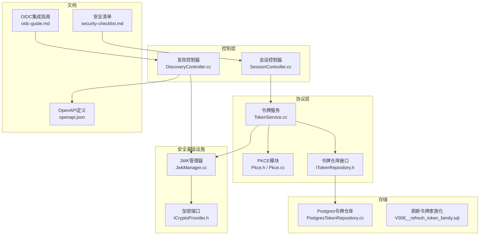
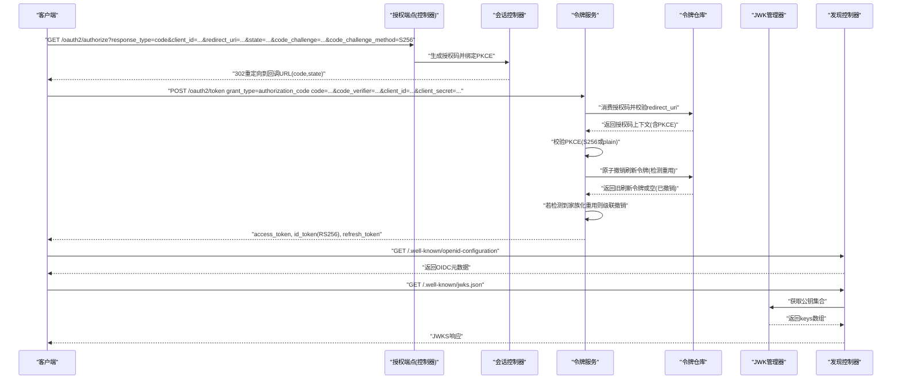
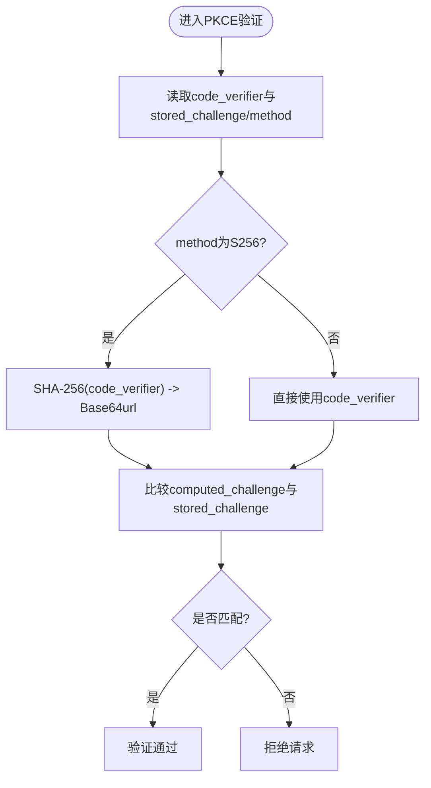
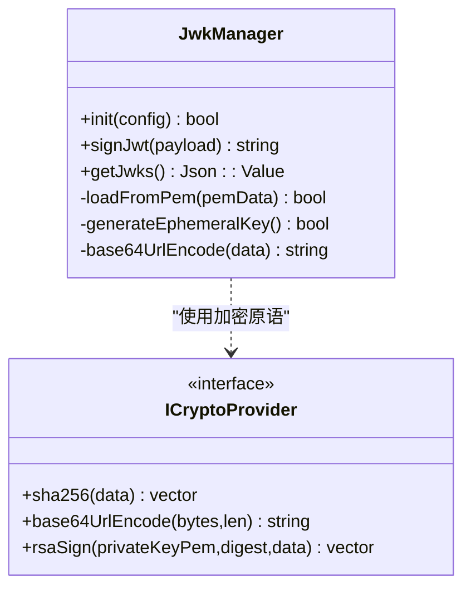
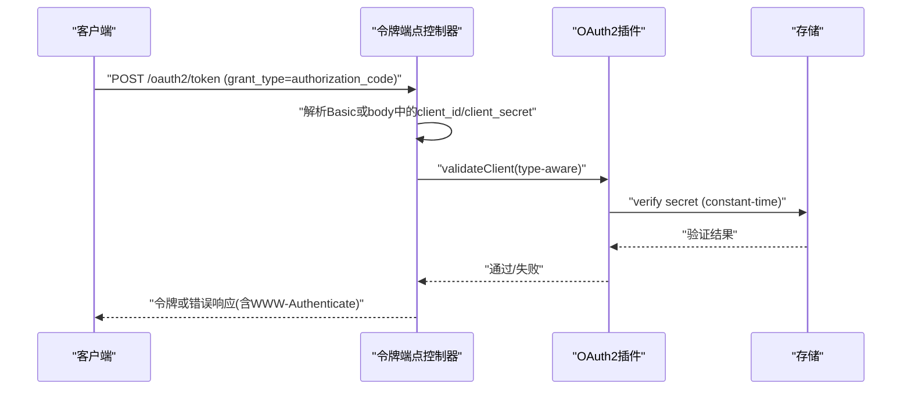
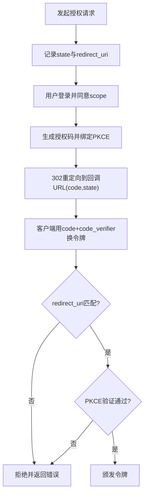
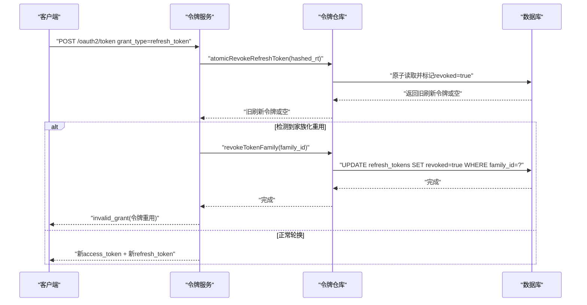
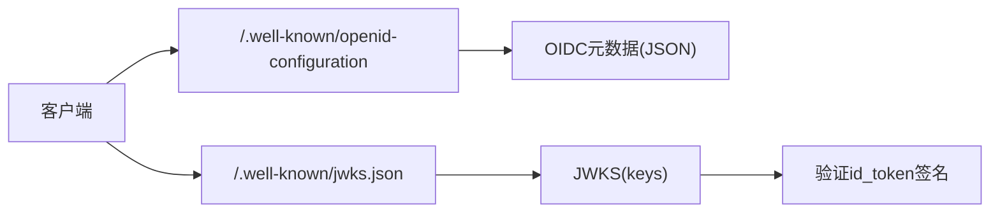
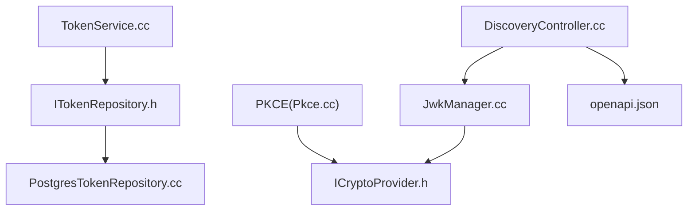

# OAuth2/OIDC协议安全

<cite>
**本文引用的文件**
- [JwkManager.cc](file://libs/oauth2/src/jwk/JwkManager.cc)
- [ICryptoProvider.h](file://libs/common/include/authforge/common/ports/ICryptoProvider.h)
- [Pkce.h](file://libs/oauth2/include/authforge/oauth2/pkce/Pkce.h)
- [Pkce.cc](file://libs/oauth2/src/pkce/Pkce.cc)
- [PkceChallenge.h](file://libs/common/include/authforge/common/model/PkceChallenge.h)
- [TokenService.cc](file://libs/oauth2/src/protocol/TokenService.cc)
- [ITokenRepository.h](file://libs/oauth2/include/authforge/oauth2/repository/ITokenRepository.h)
- [PostgresTokenRepository.cc](file://libs/storage-postgres/src/PostgresTokenRepository.cc)
- [V008__refresh_token_family.sql](file://apps/server/migrations/V008__refresh_token_family.sql)
- [DiscoveryController.cc](file://libs/drogon/src/controllers/DiscoveryController.cc)
- [openapi.json](file://apps/server/docs/api/openapi.json)
- [oidc-guide.md](file://docs/backend/oidc-guide.md)
- [security-checklist.md](file://docs/ops/security-checklist.md)
- [SessionController.cc](file://libs/drogon/src/controllers/SessionController.cc)
- [OAuth2Plugin.h](file://libs/drogon/include/authforge/drogon/plugin/OAuth2Plugin.h)
- [CryptoUtils.h](file://libs/drogon/include/authforge/drogon/utils/CryptoUtils.h)
- [test-oauth2-endpoints.sh](file://scripts/backend/test-oauth2-endpoints.sh)
</cite>

## 目录
1. [简介](#简介)
2. [项目结构](#项目结构)
3. [核心组件](#核心组件)
4. [架构总览](#架构总览)
5. [详细组件分析](#详细组件分析)
6. [依赖关系分析](#依赖关系分析)
7. [性能考虑](#性能考虑)
8. [故障排查指南](#故障排查指南)
9. [结论](#结论)
10. [附录](#附录)

## 简介
本文件面向AuthForge的OAuth2/OIDC协议安全实现，聚焦以下主题：
- PKCE（RFC 7636）的实现原理与安全优势
- JWT令牌的签名机制与算法（RS256等）
- 客户端认证方式（客户端密钥、私钥JWT、公钥认证）
- 授权码流程的安全增强（state参数、重定向URI白名单、防重放）
- 刷新令牌的安全管理（轮换、家族化、撤销）
- OIDC Discovery与JWKS端点的安全实现
- 安全配置指南与合规性检查清单

## 项目结构
本项目将OAuth2/OIDC能力以插件与库的形式组织：
- libs/oauth2：协议核心（PKCE、令牌服务、仓库接口）
- libs/drogon：控制器与OpenAPI注册（授权、同意、发现、JWKS）
- libs/common：通用端口与模型（加密抽象、PKCE值对象）
- libs/storage-*：存储实现（Postgres、Redis、内存）
- apps/server：服务端应用（迁移、种子数据、OpenAPI文档）
- docs：后端集成指南、运维安全清单等

图表来源
- [SessionController.cc:267-874](file://libs/drogon/src/controllers/SessionController.cc#L267-L874)
- [TokenService.cc:361-397](file://libs/oauth2/src/protocol/TokenService.cc#L361-L397)
- [ITokenRepository.h:115-149](file://libs/oauth2/include/authforge/oauth2/repository/ITokenRepository.h#L115-L149)
- [PostgresTokenRepository.cc:437-470](file://libs/storage-postgres/src/PostgresTokenRepository.cc#L437-L470)
- [JwkManager.cc:231-293](file://libs/oauth2/src/jwk/JwkManager.cc#L231-L293)
- [ICryptoProvider.h:53-101](file://libs/common/include/authforge/common/ports/ICryptoProvider.h#L53-L101)
- [DiscoveryController.cc:38-71](file://libs/drogon/src/controllers/DiscoveryController.cc#L38-L71)
- [openapi.json:60-115](file://apps/server/docs/api/openapi.json#L60-L115)
- [oidc-guide.md:1-97](file://docs/backend/oidc-guide.md#L1-L97)
- [security-checklist.md:1-202](file://docs/ops/security-checklist.md#L1-L202)

章节来源
- [SessionController.cc:267-874](file://libs/drogon/src/controllers/SessionController.cc#L267-L874)
- [openapi.json:60-115](file://apps/server/docs/api/openapi.json#L60-L115)

## 核心组件
- PKCE模块：提供code_verifier校验、S256/plain方法处理与格式校验。
- 令牌服务：处理授权码换取令牌、刷新令牌轮换与家族化撤销。
- JWK管理器：加载RSA私钥、签发RS256 JWT、输出JWKS。
- 发现控制器：暴露/.well-known/openid-configuration与/.well-known/jwks.json。
- 存储仓库：持久化访问/刷新令牌、支持按family_id级联撤销。
- 加密端口：统一SHA-256、HMAC、PBKDF2、RSA签名等原语。

章节来源
- [Pkce.h:51-85](file://libs/oauth2/include/authforge/oauth2/pkce/Pkce.h#L51-L85)
- [Pkce.cc:1-70](file://libs/oauth2/src/pkce/Pkce.cc#L1-L70)
- [TokenService.cc:361-397](file://libs/oauth2/src/protocol/TokenService.cc#L361-L397)
- [JwkManager.cc:231-293](file://libs/oauth2/src/jwk/JwkManager.cc#L231-L293)
- [DiscoveryController.cc:38-71](file://libs/drogon/src/controllers/DiscoveryController.cc#L38-L71)
- [ITokenRepository.h:115-149](file://libs/oauth2/include/authforge/oauth2/repository/ITokenRepository.h#L115-L149)
- [PostgresTokenRepository.cc:437-470](file://libs/storage-postgres/src/PostgresTokenRepository.cc#L437-L470)
- [ICryptoProvider.h:53-101](file://libs/common/include/authforge/common/ports/ICryptoProvider.h#L53-L101)

## 架构总览
下图展示从授权到令牌交换的关键调用链，以及PKCE验证、刷新令牌家族化撤销、JWKS输出的交互。

图表来源
- [SessionController.cc:267-874](file://libs/drogon/src/controllers/SessionController.cc#L267-L874)
- [TokenService.cc:361-397](file://libs/oauth2/src/protocol/TokenService.cc#L361-L397)
- [PostgresTokenRepository.cc:437-470](file://libs/storage-postgres/src/PostgresTokenRepository.cc#L437-L470)
- [JwkManager.cc:231-293](file://libs/oauth2/src/jwk/JwkManager.cc#L231-L293)
- [DiscoveryController.cc:38-71](file://libs/drogon/src/controllers/DiscoveryController.cc#L38-L71)

## 详细组件分析

### PKCE（RFC 7636）实现与安全优势
- 实现要点
  - 支持S256与plain两种挑战方法；S256使用SHA-256后Base64url编码。
  - 提供code_verifier格式校验（长度43-128，字符集符合RFC）。
  - 通过ICryptoProvider抽象进行哈希与编码，便于替换底层实现。
- 安全优势
  - 防止授权码在公共客户端被中间人截获后滥用。
  - 强制public client使用S256可避免明文传输code_verifier的风险。
- 关键路径
  - 计算challenge：computeCodeChallenge
  - 验证verifier：verifyCodeVerifier
  - 值对象封装：PkceChallenge（仅允许S256/plain）

图表来源
- [Pkce.cc:1-70](file://libs/oauth2/src/pkce/Pkce.cc#L1-L70)
- [Pkce.h:51-85](file://libs/oauth2/include/authforge/oauth2/pkce/Pkce.h#L51-L85)
- [PkceChallenge.h:30-82](file://libs/common/include/authforge/common/model/PkceChallenge.h#L30-L82)
- [CryptoUtils.h:67-114](file://libs/drogon/include/authforge/drogon/utils/CryptoUtils.h#L67-L114)

章节来源
- [Pkce.cc:1-70](file://libs/oauth2/src/pkce/Pkce.cc#L1-L70)
- [Pkce.h:51-85](file://libs/oauth2/include/authforge/oauth2/pkce/Pkce.h#L51-L85)
- [PkceChallenge.h:30-82](file://libs/common/include/authforge/common/model/PkceChallenge.h#L30-L82)
- [CryptoUtils.h:67-114](file://libs/drogon/include/authforge/drogon/utils/CryptoUtils.h#L67-L114)

### JWT令牌的签名机制（RS256）
- 实现要点
  - 使用RSA私钥对JWT进行RS256签名（EVP_sha256 + RSA）。
  - Header包含alg=RS256、typ=JWT、kid标识密钥。
  - JWKS端点输出对应公钥（n,e），供客户端验证签名。
- 密钥加载
  - 优先从环境变量OAUTH2_SIGNING_KEY或OAUTH2_JWT_KEY_PATH加载PEM私钥。
  - 未配置时生成临时密钥（仅开发环境）。
- 安全建议
  - 生产环境必须配置持久化私钥并定期轮换。
  - 客户端应缓存JWKS但设置合理刷新策略，并校验kid与alg。

图表来源
- [JwkManager.cc:231-293](file://libs/oauth2/src/jwk/JwkManager.cc#L231-L293)
- [ICryptoProvider.h:53-101](file://libs/common/include/authforge/common/ports/ICryptoProvider.h#L53-L101)

章节来源
- [JwkManager.cc:231-293](file://libs/oauth2/src/jwk/JwkManager.cc#L231-L293)
- [ICryptoProvider.h:53-101](file://libs/common/include/authforge/common/ports/ICryptoProvider.h#L53-L101)

### 客户端认证方式
- 支持的认证方式
  - HTTP Basic Authorization（Authorization: Basic base64(client_id:client_secret)）
  - POST body参数（client_id、client_secret）
  - 设计文档中提及私钥JWT与公钥认证方案（作为扩展方向）
- 安全要点
  - 对confidential client强制校验client_secret（常量时间比较）。
  - 错误响应遵循RFC 6749 §5.2，并在WWW-Authenticate头提示Basic。
  - 通过OpenAPI声明clientCredentialsAuth方案。

图表来源
- [openapi.json:60-115](file://apps/server/docs/api/openapi.json#L60-L115)
- [OAuth2Plugin.h:275-314](file://libs/drogon/include/authforge/drogon/plugin/OAuth2Plugin.h#L275-L314)

章节来源
- [openapi.json:60-115](file://apps/server/docs/api/openapi.json#L60-L115)
- [OAuth2Plugin.h:275-314](file://libs/drogon/include/authforge/drogon/plugin/OAuth2Plugin.h#L275-L314)

### 授权码流程的安全增强
- state参数
  - 用于跨请求状态保持与CSRF防护；应在回调中严格比对。
- 重定向URI白名单
  - 消费授权码时必须校验redirect_uri与授权请求一致，防止重定向劫持。
- 防重放攻击
  - 授权码一次性使用；结合PKCE确保即使授权码泄露也无法被第三方复用。
- 实现位置
  - 会话控制器在同意/授权完成后生成授权码并重定向。
  - 令牌服务在消费授权码时校验redirect_uri与PKCE。

图表来源
- [SessionController.cc:267-874](file://libs/drogon/src/controllers/SessionController.cc#L267-L874)
- [ITokenRepository.h:64-101](file://libs/oauth2/include/authforge/oauth2/repository/IGrantRepository.h#L64-L101)

章节来源
- [SessionController.cc:267-874](file://libs/drogon/src/controllers/SessionController.cc#L267-L874)
- [ITokenRepository.h:64-101](file://libs/oauth2/include/authforge/oauth2/repository/IGrantRepository.h#L64-L101)

### 刷新令牌的安全管理（轮换、家族化、撤销）
- 家族化管理
  - 同一授权码派生的所有刷新令牌共享family_id，便于批量撤销。
  - 数据库表增加family_id字段并建立索引。
- 轮换与重用检测
  - 使用atomicRevokeRefreshToken实现“先取后标记”的原子操作，检测重用。
  - 若检测到家族化重用，触发级联撤销整个token family。
- 撤销机制
  - revokeTokenFamily更新所有family_id匹配的刷新令牌为revoked=true。
  - 同时可通过子查询撤销关联的access token。

图表来源
- [TokenService.cc:361-397](file://libs/oauth2/src/protocol/TokenService.cc#L361-L397)
- [ITokenRepository.h:115-149](file://libs/oauth2/include/authforge/oauth2/repository/ITokenRepository.h#L115-L149)
- [PostgresTokenRepository.cc:437-470](file://libs/storage-postgres/src/PostgresTokenRepository.cc#L437-L470)
- [V008__refresh_token_family.sql:1-7](file://apps/server/migrations/V008__refresh_token_family.sql#L1-L7)

章节来源
- [TokenService.cc:361-397](file://libs/oauth2/src/protocol/TokenService.cc#L361-L397)
- [ITokenRepository.h:115-149](file://libs/oauth2/include/authforge/oauth2/repository/ITokenRepository.h#L115-L149)
- [PostgresTokenRepository.cc:437-470](file://libs/storage-postgres/src/PostgresTokenRepository.cc#L437-L470)
- [V008__refresh_token_family.sql:1-7](file://apps/server/migrations/V008__refresh_token_family.sql#L1-L7)

### OIDC Discovery与JWKS端点的安全实现
- Discovery端点
  - 提供issuer、各端点地址、支持的scopes/response_types/grant_types、id_token_signing_alg_values_supported等元数据。
  - 由DiscoveryController注册路由并描述OpenAPI。
- JWKS端点
  - 返回当前用于签发JWT的RSA公钥集合（kty=RSA, use=sig, alg=RS256, kid）。
  - 由JwkManager提供keys数组。
- 客户端验证步骤
  - 从JWKS获取对应kid的公钥，校验id_token签名，验证iss/aud/exp/nonce等claims。

图表来源
- [DiscoveryController.cc:38-71](file://libs/drogon/src/controllers/DiscoveryController.cc#L38-L71)
- [JwkManager.cc:331-353](file://libs/oauth2/src/jwk/JwkManager.cc#L331-L353)
- [openapi.json:81-115](file://apps/server/docs/api/openapi.json#L81-L115)
- [oidc-guide.md:1-97](file://docs/backend/oidc-guide.md#L1-L97)

章节来源
- [DiscoveryController.cc:38-71](file://libs/drogon/src/controllers/DiscoveryController.cc#L38-L71)
- [JwkManager.cc:331-353](file://libs/oauth2/src/jwk/JwkManager.cc#L331-L353)
- [openapi.json:81-115](file://apps/server/docs/api/openapi.json#L81-L115)
- [oidc-guide.md:1-97](file://docs/backend/oidc-guide.md#L1-L97)

## 依赖关系分析
- PKCE模块依赖ICryptoProvider进行哈希与编码，保证算法可替换。
- 令牌服务依赖令牌仓库接口，屏蔽存储实现差异。
- PostgresTokenRepository实现家族化撤销，依赖SQL事务与索引优化。
- JwkManager依赖OpenSSL进行RSA签名与JWKS构建。
- 发现控制器与OpenAPI共同暴露标准端点，便于客户端自动发现。

图表来源
- [Pkce.cc:1-70](file://libs/oauth2/src/pkce/Pkce.cc#L1-L70)
- [ICryptoProvider.h:53-101](file://libs/common/include/authforge/common/ports/ICryptoProvider.h#L53-L101)
- [TokenService.cc:361-397](file://libs/oauth2/src/protocol/TokenService.cc#L361-L397)
- [ITokenRepository.h:115-149](file://libs/oauth2/include/authforge/oauth2/repository/ITokenRepository.h#L115-L149)
- [PostgresTokenRepository.cc:437-470](file://libs/storage-postgres/src/PostgresTokenRepository.cc#L437-L470)
- [JwkManager.cc:231-293](file://libs/oauth2/src/jwk/JwkManager.cc#L231-L293)
- [DiscoveryController.cc:38-71](file://libs/drogon/src/controllers/DiscoveryController.cc#L38-L71)
- [openapi.json:60-115](file://apps/server/docs/api/openapi.json#L60-L115)

章节来源
- [Pkce.cc:1-70](file://libs/oauth2/src/pkce/Pkce.cc#L1-L70)
- [TokenService.cc:361-397](file://libs/oauth2/src/protocol/TokenService.cc#L361-L397)
- [PostgresTokenRepository.cc:437-470](file://libs/storage-postgres/src/PostgresTokenRepository.cc#L437-L470)
- [JwkManager.cc:231-293](file://libs/oauth2/src/jwk/JwkManager.cc#L231-L293)
- [DiscoveryController.cc:38-71](file://libs/drogon/src/controllers/DiscoveryController.cc#L38-L71)
- [openapi.json:60-115](file://apps/server/docs/api/openapi.json#L60-L115)

## 性能考虑
- PKCE验证
  - S256方法涉及一次SHA-256与Base64url编码，开销低；建议在令牌交换路径中尽早校验以减少后续处理。
- 刷新令牌家族化撤销
  - 使用原子操作减少竞争条件；批量撤销通过两条SQL完成，避免N+1问题。
- JWKS缓存
  - 客户端应缓存JWKS并按Cache-Control或固定周期刷新，降低网络与CPU消耗。
- 连接池与索引
  - 刷新令牌家族化查询依赖family_id索引，确保高并发下性能稳定。

[本节为通用指导，不直接分析具体文件]

## 故障排查指南
- 常见问题
  - PKCE验证失败：检查code_verifier格式与method是否匹配；确认S256哈希与Base64url编码一致性。
  - 刷新令牌重用：查看审计日志中的“refresh_token_reuse_detected”，确认家族化撤销是否生效。
  - JWKS缺失或kid不匹配：确认JwkManager初始化成功且kid与JWT header一致。
- 定位步骤
  - 启用调试日志，关注令牌交换与撤销路径的错误码。
  - 使用脚本测试端到端流程（如test-oauth2-endpoints.sh）验证Discovery与JWKS可用性。
- 参考命令
  - 运行后端OAuth2端点测试脚本，检查OIDC Discovery与JWKS返回内容是否符合预期。

章节来源
- [TokenService.cc:361-397](file://libs/oauth2/src/protocol/TokenService.cc#L361-L397)
- [test-oauth2-endpoints.sh:52-89](file://scripts/backend/test-oauth2-endpoints.sh#L52-L89)

## 结论
AuthForge在OAuth2/OIDC安全方面实现了：
- 完整的PKCE支持（S256/plain），有效防御授权码泄露风险。
- RS256签名的JWT与标准的JWKS端点，便于客户端验证身份令牌。
- 多方式客户端认证（Basic/Body参数），并为私钥JWT与公钥认证预留扩展空间。
- 授权码流程强化（state、redirect_uri白名单、防重放）。
- 刷新令牌家族化与原子撤销，保障令牌生命周期安全。
- 标准化的OIDC Discovery与JWKS端点，提升互操作性。

建议在生产环境中：
- 配置持久化RSA私钥并定期轮换。
- 严格校验state与redirect_uri，启用速率限制与审计日志。
- 客户端缓存JWKS并校验kid/alg，拒绝none算法。
- 遵循安全清单进行部署前检查与密钥轮换。

[本节为总结，不直接分析具体文件]

## 附录
- 安全配置与合规性检查清单
  - 使用环境变量管理敏感信息，禁止提交到版本控制。
  - 定期轮换客户端密钥、管理员密码与API密钥。
  - 部署前执行安全检查命令，确保无硬编码凭证。
  - 启用Pre-commit Hook防止意外提交敏感文件。

章节来源
- [security-checklist.md:1-202](file://docs/ops/security-checklist.md#L1-L202)