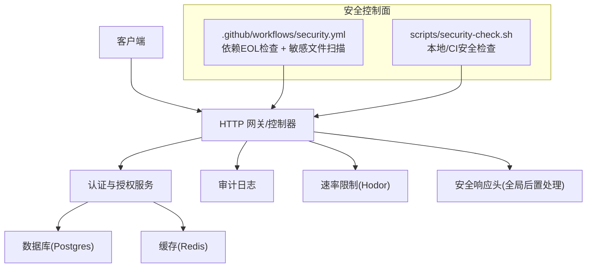
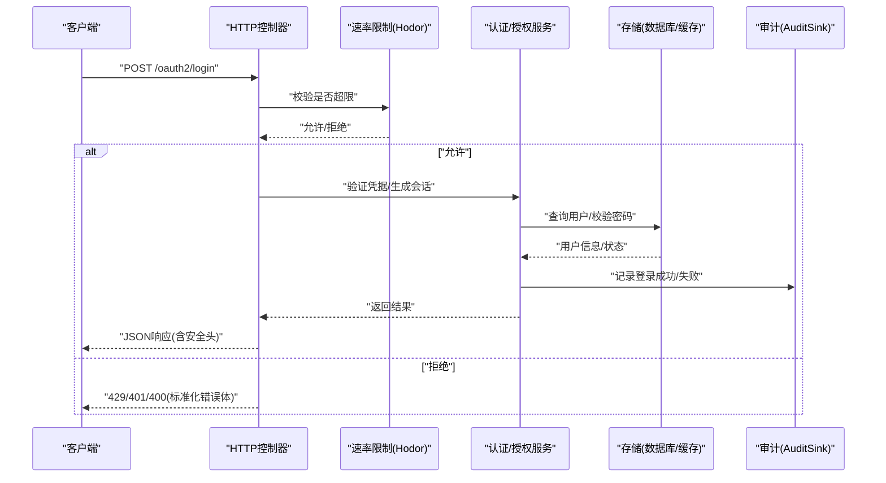
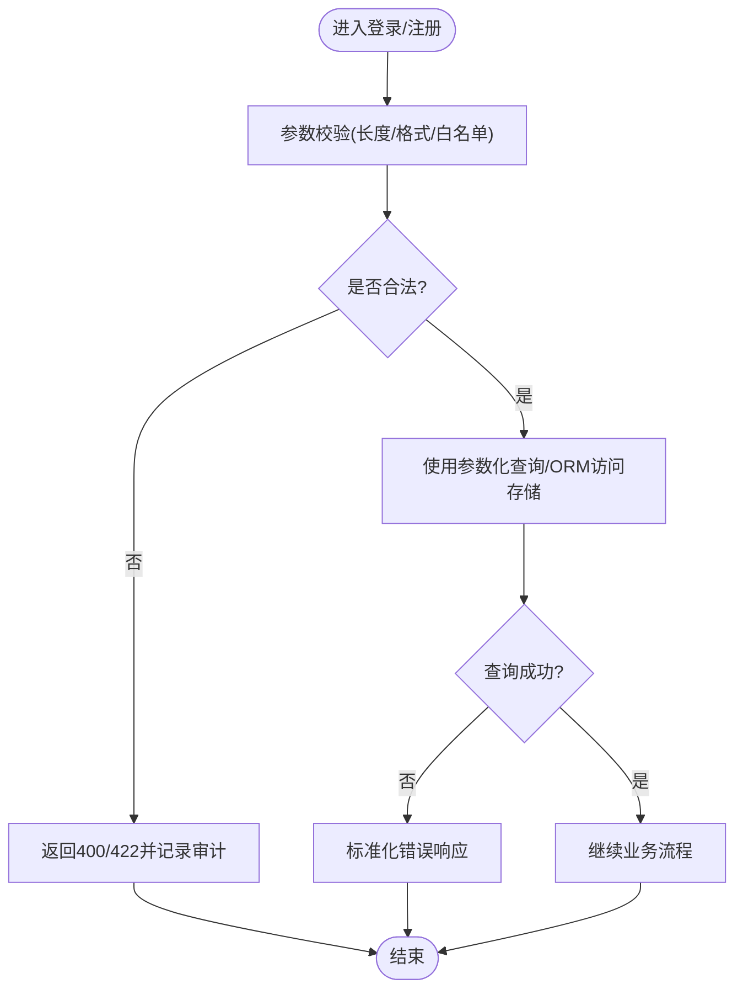
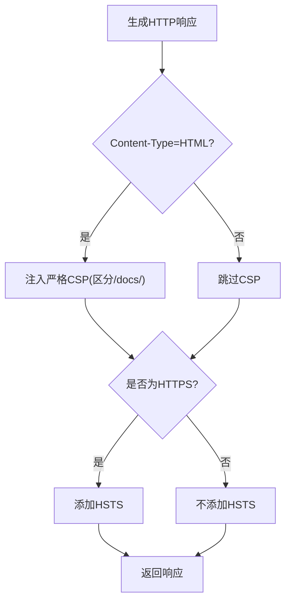
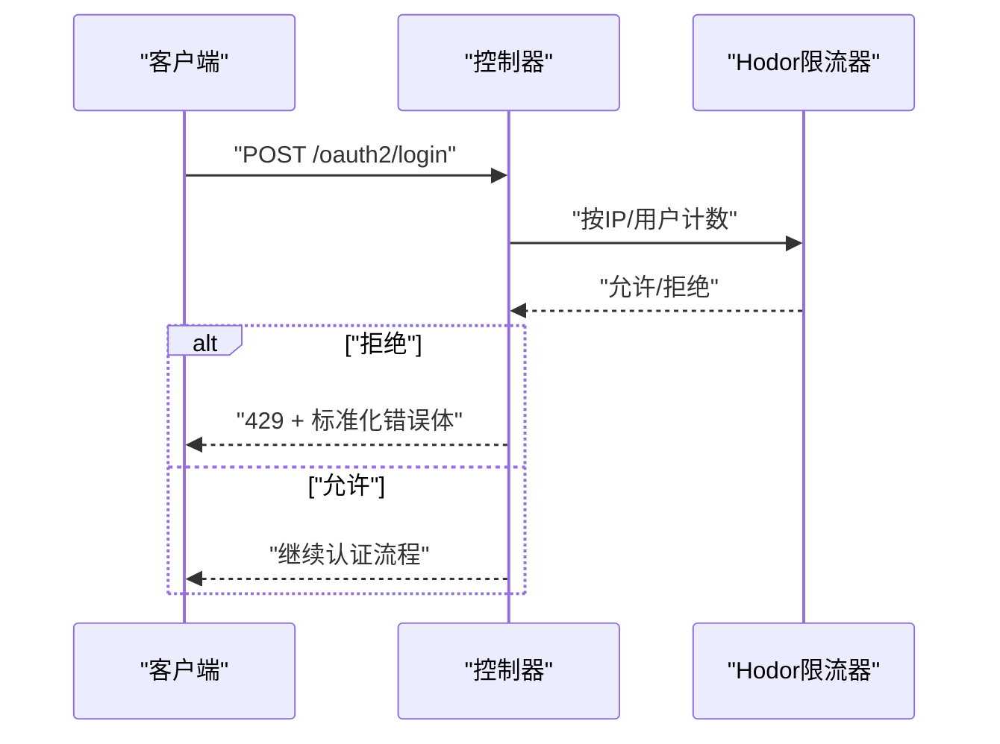
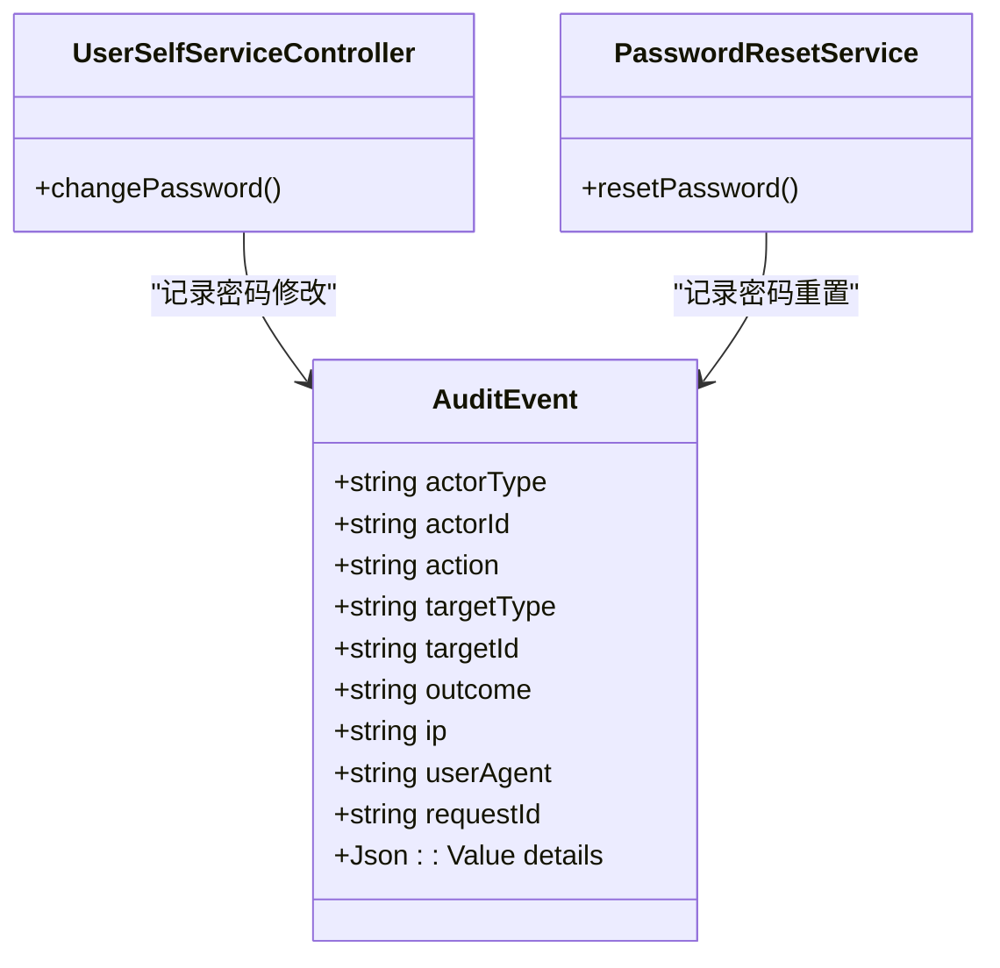
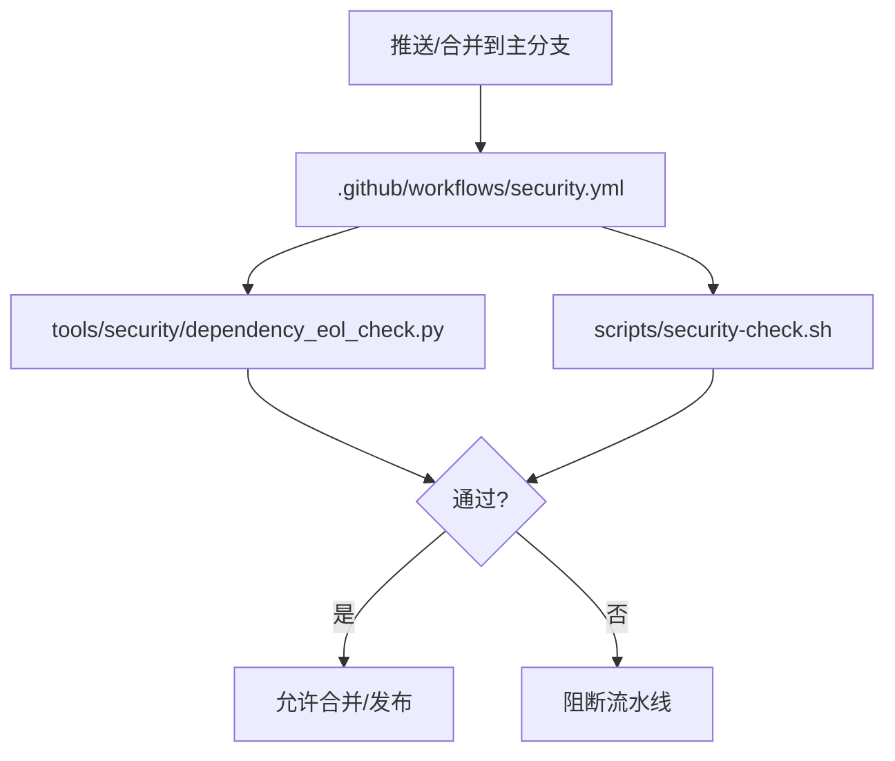
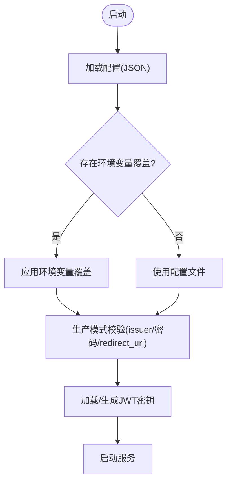
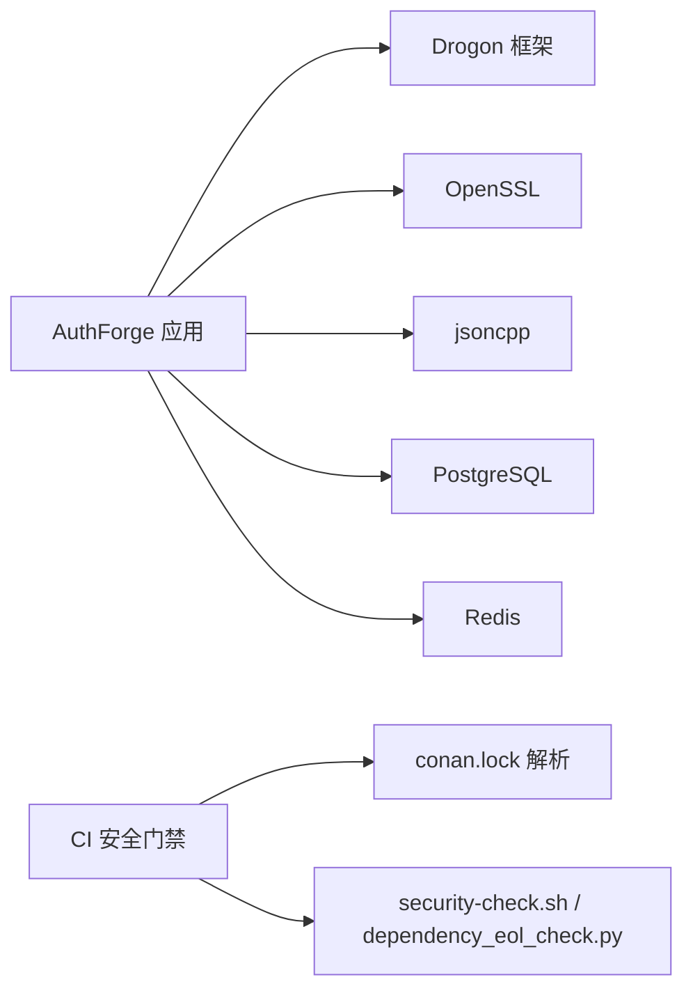

# 安全加固

<cite>
**本文引用的文件**
- [security-hardening.md](file://docs/backend/security-hardening.md)
- [SecurityTest.cc](file://tests/security/injection/SecurityTest.cc)
- [security.spec.ts](file://frontends/user/tests/e2e/security.spec.ts)
- [security.yml](file://.github/workflows/security.yml)
- [dependency_eol_check.py](file://tools/security/dependency_eol_check.py)
- [security-check.sh](file://scripts/security-check.sh)
- [SecurityHeaders.cc](file://apps/server/src/bootstrap/SecurityHeaders.cc)
- [AuditEvent.h](file://libs/common/include/authforge/common/observability/AuditEvent.h)
- [UserSelfServiceController.cc](file://libs/drogon/src/controllers/UserSelfServiceController.cc)
- [PasswordResetService.cc](file://libs/drogon/src/services/PasswordResetService.cc)
- [configuration-guide.md](file://docs/backend/configuration-guide.md)
- [production_hardening_p0_tasks.md](file://docs/history/PRD/production_hardening_p0_tasks.md)
- [client-secret-validation-design.md](file://docs/history/design/superpowers/specs/2026-05-02-client-secret-validation-design.md)
- [JwkManager.h](file://libs/oauth2/include/authforge/oauth2/jwk/JwkManager.h)
- [SECURITY.md](file://SECURITY.md)
</cite>

## 目录
1. [简介](#简介)
2. [项目结构](#项目结构)
3. [核心组件](#核心组件)
4. [架构总览](#架构总览)
5. [详细组件分析](#详细组件分析)
6. [依赖分析](#依赖分析)
7. [性能考虑](#性能考虑)
8. [故障排查指南](#故障排查指南)
9. [结论](#结论)
10. [附录](#附录)

## 简介
本文件面向AuthForge的安全加固，覆盖输入验证与清理（SQL注入、XSS、命令注入）、依赖包安全更新与漏洞扫描、敏感信息保护（配置加密、密钥管理、日志脱敏）、安全审计与监控（登录尝试记录、权限变更追踪、异常行为检测）、安全配置基线（生产模板与自动化检查）、渗透测试与安全评估流程，以及安全事件响应与漏洞修复指南。内容基于仓库现有实现与文档进行系统化梳理，便于研发、运维与安全团队协同落地。

## 项目结构
本项目将安全能力分布于多个层次：
- 应用层：全局安全头注入、速率限制、CORS策略、错误标准化与统一响应体。
- 业务层：认证授权、客户端鉴权、密码重置/修改、RBAC与Scope校验、审计事件写入。
- 数据层：迁移脚本、存储后端（Postgres/Redis/Memory）的敏感数据存储策略。
- 基础设施层：CI/CD安全门禁（依赖EOL检查、敏感文件扫描）、容器化部署与密钥挂载。
- 前端层：安全测试用例（XSS、注入）、构建时环境变量内联、运行时安全头配合。

图示来源
- [security.yml:1-46](file://.github/workflows/security.yml#L1-L46)
- [security-check.sh:1-167](file://scripts/security-check.sh#L1-L167)
- [SecurityHeaders.cc:1-64](file://apps/server/src/bootstrap/SecurityHeaders.cc#L1-L64)
- [security-hardening.md:1-120](file://docs/backend/security-hardening.md#L1-L120)

章节来源
- [security-hardening.md:1-120](file://docs/backend/security-hardening.md#L1-L120)
- [security.yml:1-46](file://.github/workflows/security.yml#L1-L46)
- [security-check.sh:1-167](file://scripts/security-check.sh#L1-L167)

## 核心组件
- 输入验证与清理
  - 后端集成测试覆盖SQL注入、XSS、命令注入与长度限制等场景，确保非法输入被拒绝或清洗。
  - 前端E2E用例对登录用户名注入与XSS渲染进行断言，保证前端侧不执行恶意脚本。
- 安全响应头
  - 通过全局后置处理在所有响应中注入安全头；HTML页面启用严格CSP，HTTPS连接下发HSTS。
- 速率限制
  - 针对登录、令牌颁发、注册等高价值接口实施细粒度限流，防止暴力破解与DoS。
- 审计与可观测性
  - 关键操作（如密码修改、密码重置）均记录结构化审计事件，包含主体、目标、结果、IP、UA、请求ID等。
- 依赖与供应链安全
  - CI定时与触发式运行依赖EOL检查，阻断已知不安全版本；仓库级敏感文件扫描避免凭证泄露。
- 密钥与配置安全
  - JWT签名密钥支持从文件系统加载并持久化，环境变量覆盖敏感配置；生产模式强制校验。

章节来源
- [SecurityTest.cc:72-110](file://tests/security/injection/SecurityTest.cc#L72-L110)
- [security.spec.ts:1-32](file://frontends/user/tests/e2e/security.spec.ts#L1-L32)
- [SecurityHeaders.cc:1-64](file://apps/server/src/bootstrap/SecurityHeaders.cc#L1-L64)
- [security-hardening.md:1-120](file://docs/backend/security-hardening.md#L1-L120)
- [AuditEvent.h:1-47](file://libs/common/include/authforge/common/observability/AuditEvent.h#L1-L47)
- [UserSelfServiceController.cc:255-277](file://libs/drogon/src/controllers/UserSelfServiceController.cc#L255-L277)
- [PasswordResetService.cc:267-287](file://libs/drogon/src/services/PasswordResetService.cc#L267-L287)
- [security.yml:1-46](file://.github/workflows/security.yml#L1-L46)
- [dependency_eol_check.py:1-36](file://tools/security/dependency_eol_check.py#L1-L36)
- [JwkManager.h:51-86](file://libs/oauth2/include/authforge/oauth2/jwk/JwkManager.h#L51-L86)
- [configuration-guide.md:1-31](file://docs/backend/configuration-guide.md#L1-L31)
- [production_hardening_p0_tasks.md:447-497](file://docs/history/PRD/production_hardening_p0_tasks.md#L447-L497)

## 架构总览
下图展示请求在网关/控制器层的处理路径，包括安全头注入、速率限制、认证授权、审计落库与错误标准化。

图示来源
- [security-hardening.md:1-120](file://docs/backend/security-hardening.md#L1-L120)
- [SecurityHeaders.cc:1-64](file://apps/server/src/bootstrap/SecurityHeaders.cc#L1-L64)
- [AuditEvent.h:1-47](file://libs/common/include/authforge/common/observability/AuditEvent.h#L1-L47)

## 详细组件分析

### 输入验证与清理（SQL注入/XSS/命令注入）
- 后端测试覆盖典型注入向量，确保登录、注册等入口拒绝恶意输入。
- 前端E2E用例断言注入攻击不会导致重定向或脚本执行。
- 建议结合ORM参数化查询、白名单校验、长度/格式约束与输出编码，形成纵深防御。

图示来源
- [SecurityTest.cc:72-110](file://tests/security/injection/SecurityTest.cc#L72-L110)
- [security.spec.ts:1-32](file://frontends/user/tests/e2e/security.spec.ts#L1-L32)

章节来源
- [SecurityTest.cc:72-110](file://tests/security/injection/SecurityTest.cc#L72-L110)
- [security.spec.ts:1-32](file://frontends/user/tests/e2e/security.spec.ts#L1-L32)

### 安全响应头与CSP/HSTS
- 全局后置处理为所有响应添加安全头；HTML页面启用严格CSP，API端点不受影响。
- 仅在HTTPS（含反向代理X-Forwarded-Proto）下设置HSTS，避免降级风险。

图示来源
- [SecurityHeaders.cc:1-64](file://apps/server/src/bootstrap/SecurityHeaders.cc#L1-L64)

章节来源
- [SecurityHeaders.cc:1-64](file://apps/server/src/bootstrap/SecurityHeaders.cc#L1-L64)
- [security-hardening.md:36-64](file://docs/backend/security-hardening.md#L36-L64)

### 速率限制与暴力破解防护
- 对登录、令牌、注册等敏感接口实施每IP/每用户/全局多维限流，返回429并走统一错误体。
- 识别策略优先X-Forwarded-For，其次X-Real-IP，最后Peer IP；白名单跳过限制。

图示来源
- [security-hardening.md:1-34](file://docs/backend/security-hardening.md#L1-L34)

章节来源
- [security-hardening.md:1-34](file://docs/backend/security-hardening.md#L1-L34)

### 审计与监控（登录尝试、权限变更、异常行为）
- 关键操作（如密码修改、密码重置）调用审计接口记录结构化事件，包含主体类型/ID、动作、目标、结果、IP、UA、请求ID与详情。
- 管理员界面提供审计日志查看、过滤与分页能力，便于安全运营。

图示来源
- [AuditEvent.h:1-47](file://libs/common/include/authforge/common/observability/AuditEvent.h#L1-L47)
- [UserSelfServiceController.cc:255-277](file://libs/drogon/src/controllers/UserSelfServiceController.cc#L255-L277)
- [PasswordResetService.cc:267-287](file://libs/drogon/src/services/PasswordResetService.cc#L267-L287)

章节来源
- [AuditEvent.h:1-47](file://libs/common/include/authforge/common/observability/AuditEvent.h#L1-L47)
- [UserSelfServiceController.cc:255-277](file://libs/drogon/src/controllers/UserSelfServiceController.cc#L255-L277)
- [PasswordResetService.cc:267-287](file://libs/drogon/src/services/PasswordResetService.cc#L267-L287)
- [admin/test-cases.md:199-221](file://docs/admin/test-cases.md#L199-L221)

### 依赖包安全更新与漏洞扫描
- CI工作流定期与触发式执行依赖EOL检查，阻断低于安全底线的依赖版本（如OpenSSL、zlib、libcurl）。
- 仓库级安全脚本扫描.git跟踪的敏感文件、硬编码密钥模式、示例文件与.gitignore覆盖度。

图示来源
- [security.yml:1-46](file://.github/workflows/security.yml#L1-L46)
- [dependency_eol_check.py:1-36](file://tools/security/dependency_eol_check.py#L1-L36)
- [security-check.sh:1-167](file://scripts/security-check.sh#L1-L167)

章节来源
- [security.yml:1-46](file://.github/workflows/security.yml#L1-L46)
- [dependency_eol_check.py:1-36](file://tools/security/dependency_eol_check.py#L1-L36)
- [security-check.sh:1-167](file://scripts/security-check.sh#L1-L167)

### 敏感信息保护（配置加密、密钥管理、日志脱敏）
- 密钥管理：JWT签名密钥支持从文件系统加载并持久化，开发模式回退临时密钥；密钥路径通过环境变量配置。
- 配置安全：支持环境变量覆盖敏感项（数据库、Redis、Issuer、监听端口等），生产模式强制校验（如HTTPS Issuer、非默认DB密码）。
- 日志脱敏：设计层面要求不在日志中输出敏感值（如client_secret），并通过审计事件仅记录必要上下文。

图示来源
- [configuration-guide.md:1-31](file://docs/backend/configuration-guide.md#L1-L31)
- [production_hardening_p0_tasks.md:447-497](file://docs/history/PRD/production_hardening_p0_tasks.md#L447-L497)
- [JwkManager.h:51-86](file://libs/oauth2/include/authforge/oauth2/jwk/JwkManager.h#L51-L86)
- [client-secret-validation-design.md:251-326](file://docs/history/design/superpowers/specs/2026-05-02-client-secret-validation-design.md#L251-L326)

章节来源
- [configuration-guide.md:1-31](file://docs/backend/configuration-guide.md#L1-L31)
- [production_hardening_p0_tasks.md:447-497](file://docs/history/PRD/production_hardening_p0_tasks.md#L447-L497)
- [JwkManager.h:51-86](file://libs/oauth2/include/authforge/oauth2/jwk/JwkManager.h#L51-L86)
- [client-secret-validation-design.md:251-326](file://docs/history/design/superpowers/specs/2026-05-02-client-secret-validation-design.md#L251-L326)

### 安全配置基线（生产环境模板与自动化检查）
- 生产模式校验：强制HTTPS Issuer、非默认数据库密码、禁止localhost回调等。
- 环境变量覆盖：集中管理敏感配置，避免硬编码。
- 自动化检查：CI流水线与本地脚本双重保障，确保提交前无敏感泄露。

章节来源
- [production_hardening_p0_tasks.md:447-497](file://docs/history/PRD/production_hardening_p0_tasks.md#L447-L497)
- [security.yml:1-46](file://.github/workflows/security.yml#L1-L46)
- [security-check.sh:1-167](file://scripts/security-check.sh#L1-L167)

### 渗透测试与安全评估流程
- 建议流程
  - 代码阶段：静态扫描、依赖EOL检查、单元测试与属性测试。
  - 集成阶段：端到端安全测试（注入、XSS、越权、速率限制）。
  - 预发布：外部扫描（依赖漏洞、容器镜像SBOM）、合规检查（OpenAPI差异、规范校验）。
  - 上线后：持续监控（审计日志、异常告警）、周期性复测。
- 工具与工件
  - CI：security.yml、dependency_eol_check.py、security-check.sh。
  - 文档：安全加固指南、生产检查清单、账户锁定策略。

章节来源
- [security.yml:1-46](file://.github/workflows/security.yml#L1-L46)
- [security-hardening.md:67-120](file://docs/backend/security-hardening.md#L67-L120)
- [SECURITY.md:1-42](file://SECURITY.md#L1-L42)

### 安全事件响应与漏洞修复指南
- 报告渠道：通过GitHub私有漏洞报告通道提交，避免公开披露。
- 响应SLA：7天内确认，30天内状态更新；给予合理修复窗口后再公开。
- 修复流程：定位根因→最小改动修复→回归测试→发布说明与SBOM更新→通知受影响方。

章节来源
- [SECURITY.md:10-42](file://SECURITY.md#L10-L42)

## 依赖分析
- 直接依赖
  - Drogon框架（HTTP服务器、插件机制）
  - OpenSSL（加密、常量时间比较）
  - JSON库（jsoncpp）用于审计详情与配置
  - 存储后端（Postgres、Redis、Memory）
- 间接依赖
  - CI工具链（Python脚本、Conan锁文件解析）
  - 容器与编排（Docker Compose、Kubernetes Helm）

图示来源
- [security.yml:1-46](file://.github/workflows/security.yml#L1-L46)
- [dependency_eol_check.py:1-36](file://tools/security/dependency_eol_check.py#L1-L36)

章节来源
- [security.yml:1-46](file://.github/workflows/security.yml#L1-L46)
- [dependency_eol_check.py:1-36](file://tools/security/dependency_eol_check.py#L1-L36)

## 性能考虑
- 速率限制在高并发下需关注内存占用与键空间膨胀，建议合理设置过期时间与采样策略。
- 审计日志异步写入，避免阻塞主请求路径；注意磁盘I/O与索引优化。
- 安全头注入为轻量操作，但CSP规则过严可能影响第三方资源加载，需按需放宽。

[本节为通用指导，无需特定文件引用]

## 故障排查指南
- 常见现象
  - 登录/注册频繁429：检查Hodor限流配置与白名单。
  - 浏览器拦截资源：检查CSP策略与外部资源域名。
  - HSTS未生效：确认HTTPS与X-Forwarded-Proto正确传递。
  - 审计缺失：确认审计Sink已注入且写入成功。
- 诊断步骤
  - 使用curl检查响应头与错误体。
  - 查看审计日志与管理后台。
  - 检查CI安全门禁失败原因（依赖EOL、敏感文件）。
  - 核对环境变量覆盖与生产模式校验结果。

章节来源
- [security-hardening.md:1-120](file://docs/backend/security-hardening.md#L1-L120)
- [security.yml:1-46](file://.github/workflows/security.yml#L1-L46)
- [security-check.sh:1-167](file://scripts/security-check.sh#L1-L167)

## 结论
AuthForge在输入验证、安全头、速率限制、审计、依赖治理与密钥管理方面已形成较为完善的安全体系。建议在后续迭代中持续强化：
- 扩大注入与XSS的自动化测试覆盖与模糊测试。
- 完善审计事件的聚合分析与告警规则。
- 建立常态化渗透测试与红蓝对抗演练。
- 持续跟进依赖漏洞与供应链安全。

[本节为总结性内容，无需特定文件引用]

## 附录
- 参考文档
  - 安全加固指南、生产检查清单、账户锁定策略、OIDC/OAuth2合规改进计划。
- 常用命令
  - 检查安全头：curl -I http://localhost:5555/
  - 运行安全门禁：./scripts/security-check.sh
  - 依赖EOL检查：python3 tools/security/dependency_eol_check.py

[本节为补充信息，无需特定文件引用]