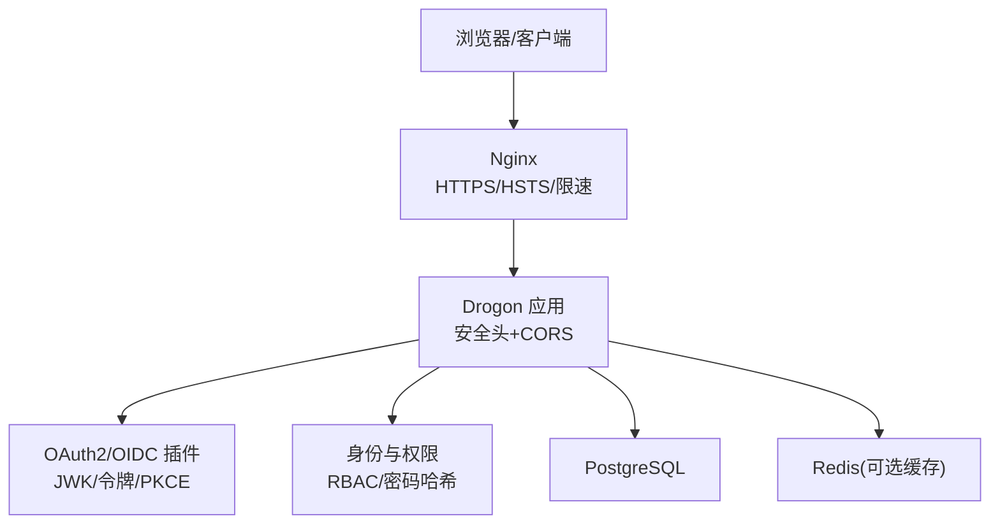
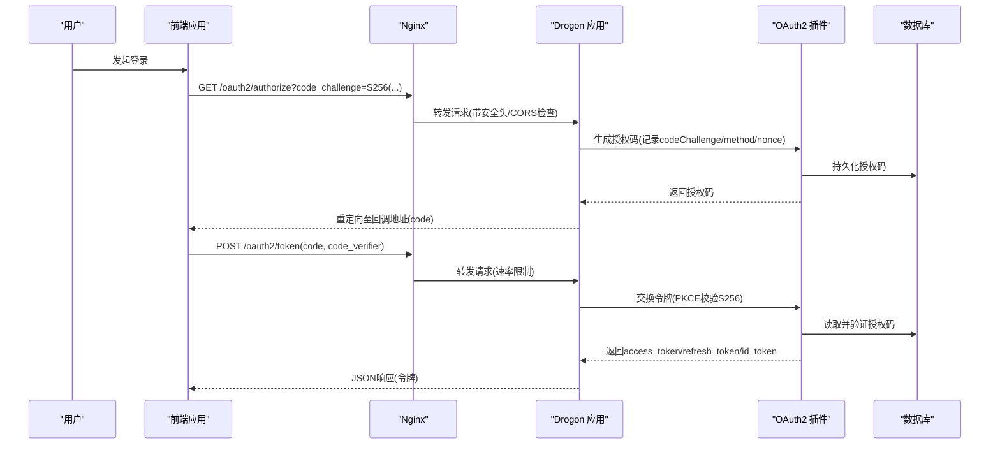
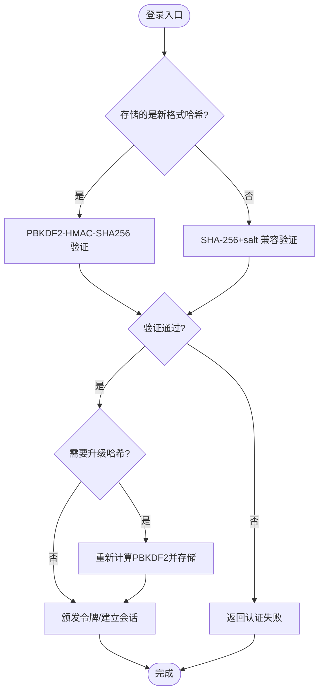
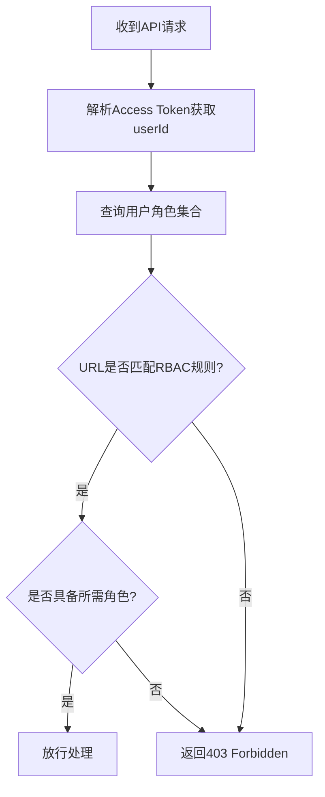
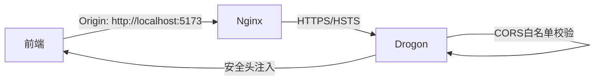
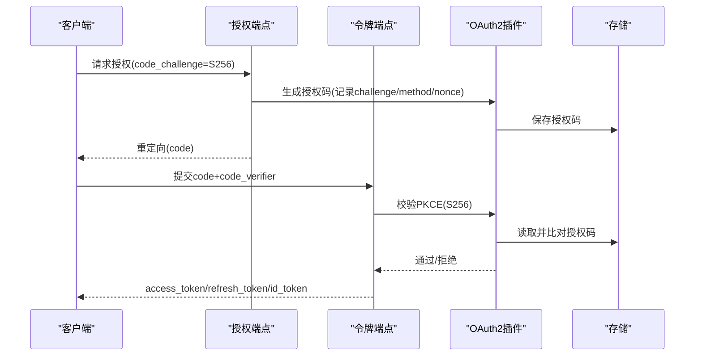
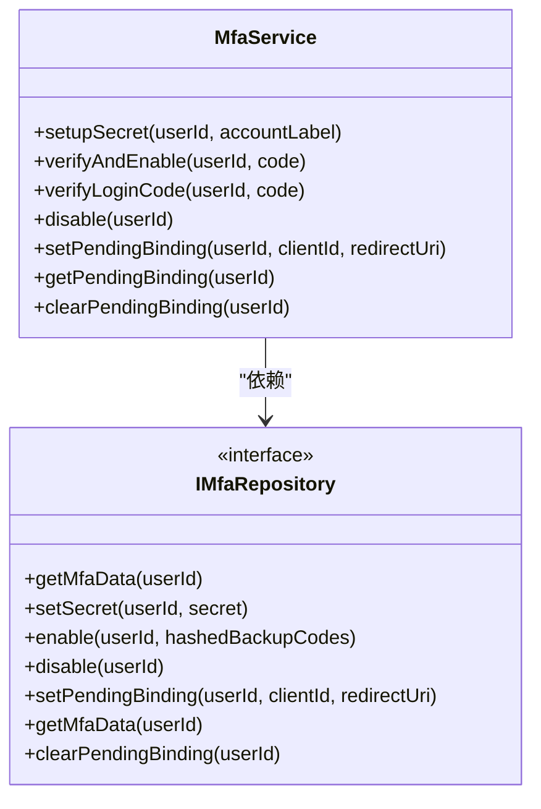
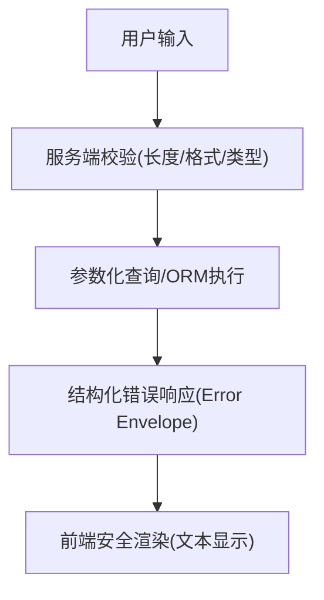
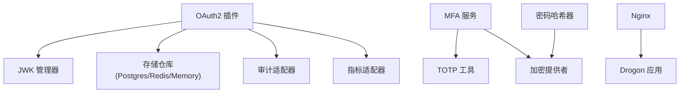

# 安全设计

<cite>
**本文引用的文件**
- [config.json](file://apps/server/config/config.json)
- [SecurityHeaders.cc](file://apps/server/src/bootstrap/SecurityHeaders.cc)
- [CorsSetup.cc](file://apps/server/src/bootstrap/CorsSetup.cc)
- [nginx.conf](file://deploy/nginx/nginx.conf)
- [OAuth2Plugin.cc](file://libs/drogon/src/plugin/OAuth2Plugin.cc)
- [MfaService.cc](file://libs/identity/src/mfa/MfaService.cc)
- [PasswordHasher.cc](file://libs/drogon/src/utils/PasswordHasher.cc)
- [ICryptoProvider.h](file://libs/common/include/authforge/common/ports/ICryptoProvider.h)
- [security-hardening.md](file://docs/backend/security-hardening.md)
- [rbac-guide.md](file://docs/backend/rbac-guide.md)
- [V011__mfa_support.sql](file://apps/server/migrations/V011__mfa_support.sql)
- [V013__account_lockout.sql](file://apps/server/migrations/V013__account_lockout.sql)
- [SecurityTest.cc](file://tests/security/injection/SafetyTest.cc)
- [FunctionalTest.cc](file://tests/e2e-backend/oauth2_flows/FunctionalTest.cc)
- [RateLimiterTest.cc](file://tests/unit/utils/RateLimiterTest.cc)
- [LoginPage.vue](file://frontends/user/src/pages/auth/LoginPage.vue)
- [SecurityPage.vue](file://frontends/user/src/pages/account/SecurityPage.vue)
</cite>

## 目录
1. [简介](#简介)
2. [项目结构](#项目结构)
3. [核心组件](#核心组件)
4. [架构总览](#架构总览)
5. [详细组件分析](#详细组件分析)
6. [依赖关系分析](#依赖关系分析)
7. [性能与安全权衡](#性能与安全权衡)
8. [故障排查指南](#故障排查指南)
9. [结论](#结论)
10. [附录](#附录)

## 简介
本文件面向 AuthForge 的安全设计与实现，系统性说明认证、授权、网络安全、OAuth2/OIDC、多因素认证（MFA）与 WebAuthn（FIDO2）、以及输入校验与注入防护等关键安全能力。文档同时给出配置最佳实践与常见漏洞修复建议，帮助开发与运维团队在生产环境中正确部署与维护系统。

## 项目结构
从安全视角看，本项目将安全能力分层组织：
- 网关与传输层：Nginx 负责 HTTPS、HSTS、基础速率限制与反向代理。
- 应用层：Drogon 服务通过 Bootstrap 模块统一注入安全响应头与 CORS 策略。
- 协议与令牌：OAuth2/OIDC 插件集中管理 JWK、令牌生命周期、PKCE、审计与指标。
- 身份与权限：RBAC 规则通过配置映射 URL 到角色；用户密码采用 PBKDF2-SHA256 存储。
- 多因素与无密码：TOTP MFA 与 WebAuthn 凭据注册/登录流程。
- 数据与迁移：数据库迁移脚本提供 MFA、账户锁定等安全相关表结构。

图示来源
- [nginx.conf:33-89](file://deploy/nginx/nginx.conf#L33-L89)
- [SecurityHeaders.cc:8-60](file://apps/server/src/bootstrap/SecurityHeaders.cc#L8-L60)
- [CorsSetup.cc:8-79](file://apps/server/src/bootstrap/CorsSetup.cc#L8-L79)
- [OAuth2Plugin.cc:30-199](file://libs/drogon/src/plugin/OAuth2Plugin.cc#L30-L199)

章节来源
- [nginx.conf:33-89](file://deploy/nginx/nginx.conf#L33-L89)
- [SecurityHeaders.cc:8-60](file://apps/server/src/bootstrap/SecurityHeaders.cc#L8-L60)
- [CorsSetup.cc:8-79](file://apps/server/src/bootstrap/CorsSetup.cc#L8-L79)
- [OAuth2Plugin.cc:30-199](file://libs/drogon/src/plugin/OAuth2Plugin.cc#L30-L199)

## 核心组件
- 密码哈希与验证：PBKDF2-SHA256，支持旧格式兼容与渐进升级。
- 会话与令牌：Access/Refresh Token 生命周期、撤销、刷新；OIDC id_token 签名由 JWK 管理。
- PKCE：强制或按需校验 code_challenge/code_verifier，S256 算法严格实现。
- RBAC：基于角色的访问控制，URL 路径正则匹配角色白名单。
- CORS：精确源白名单，禁止通配符，预检请求拒绝未授权来源。
- 安全头：X-Content-Type-Options、X-Frame-Options、CSP、HSTS。
- 速率限制：应用层 Hodor 令牌桶 + Nginx 层限流，防暴力破解与 DoS。
- MFA：TOTP 密钥生成、备份码哈希存储、登录校验。
- WebAuthn：Passkeys 注册与登录流程前端集成。
- 账户锁定：失败次数与锁定时间字段，防止枚举与暴力破解。

章节来源
- [PasswordHasher.cc:51-84](file://libs/drogon/src/utils/PasswordHasher.cc#L51-L84)
- [OAuth2Plugin.cc:58-183](file://libs/drogon/src/plugin/OAuth2Plugin.cc#L58-L183)
- [rbac-guide.md:41-69](file://docs/backend/rbac-guide.md#L41-L69)
- [CorsSetup.cc:10-79](file://apps/server/src/bootstrap/CorsSetup.cc#L10-L79)
- [SecurityHeaders.cc:10-58](file://apps/server/src/bootstrap/SecurityHeaders.cc#L10-L58)
- [security-hardening.md:5-32](file://docs/backend/security-hardening.md#L5-L32)
- [V011__mfa_support.sql:1-6](file://apps/server/migrations/V011__mfa_support.sql#L1-L6)
- [V013__account_lockout.sql:1-6](file://apps/server/migrations/V013__account_lockout.sql#L1-L6)

## 架构总览
下图展示一次受保护的 OAuth2 授权码+PKCE 流程，涵盖前端、网关、应用、插件与存储的交互。

图示来源
- [OAuth2Plugin.cc:383-417](file://libs/drogon/src/plugin/OAuth2Plugin.cc#L383-L417)
- [SecurityHeaders.cc:10-58](file://apps/server/src/bootstrap/SecurityHeaders.cc#L10-L58)
- [CorsSetup.cc:32-79](file://apps/server/src/bootstrap/CorsSetup.cc#L32-L79)
- [nginx.conf:57-83](file://deploy/nginx/nginx.conf#L57-L83)

## 详细组件分析

### 认证安全：密码哈希与会话管理
- 密码哈希：使用 PBKDF2-SHA256，迭代次数遵循 OWASP 建议，随机盐，兼容旧 SHA-256+salt 格式并在首次成功登录后渐进升级。
- 会话与令牌：Access Token 短期有效，Refresh Token 长期有效并可轮换；支持令牌撤销；id_token 通过 JWK 签名与验签。
- 会话安全：Cookie 仅用于必要场景，默认 SameSite=Lax；生产环境通过 HSTS 强制 HTTPS。

图示来源
- [PasswordHasher.cc:51-84](file://libs/drogon/src/utils/PasswordHasher.cc#L51-L84)
- [PasswordHasher.cc:162-200](file://libs/drogon/src/utils/PasswordHasher.cc#L162-L200)
- [ICryptoProvider.h:77-104](file://libs/common/include/authforge/common/ports/ICryptoProvider.h#L77-L104)

章节来源
- [PasswordHasher.cc:51-84](file://libs/drogon/src/utils/PasswordHasher.cc#L51-L84)
- [PasswordHasher.cc:162-200](file://libs/drogon/src/utils/PasswordHasher.cc#L162-L200)
- [ICryptoProvider.h:77-104](file://libs/common/include/authforge/common/ports/ICryptoProvider.h#L77-L104)

### 授权安全：RBAC 与资源访问控制
- 模型：用户-角色-权限（简化为 URL 路径与角色映射）。
- 规则：通过配置文件定义 URL 正则与所需角色列表，逻辑为 OR（任一角色即可）。
- 拦截：在请求处理链中解析 Access Token 获取 userId，查询角色并匹配规则，未命中返回 403。

图示来源
- [rbac-guide.md:41-69](file://docs/backend/rbac-guide.md#L41-L69)
- [config.json:172-180](file://apps/server/config/config.json#L172-L180)

章节来源
- [rbac-guide.md:41-69](file://docs/backend/rbac-guide.md#L41-L69)
- [config.json:172-180](file://apps/server/config/config.json#L172-L180)

### 网络安全：HTTPS、CORS 与安全头
- HTTPS：Nginx 强制 HTTP→HTTPS 重定向，启用 TLSv1.2/TLSv1.3，设置强加密套件与 HSTS。
- CORS：精确源白名单，禁止通配符；OPTIONS 预检请求未授权直接 403；响应头携带允许的方法与头部。
- 安全头：全局注入 X-Content-Type-Options、X-Frame-Options、CSP（区分 Swagger UI 与主应用），HSTS 仅在 HTTPS 下设置。

图示来源
- [nginx.conf:33-55](file://deploy/nginx/nginx.conf#L33-L55)
- [CorsSetup.cc:10-79](file://apps/server/src/bootstrap/CorsSetup.cc#L10-L79)
- [SecurityHeaders.cc:10-58](file://apps/server/src/bootstrap/SecurityHeaders.cc#L10-L58)

章节来源
- [nginx.conf:33-55](file://deploy/nginx/nginx.conf#L33-L55)
- [CorsSetup.cc:10-79](file://apps/server/src/bootstrap/CorsSetup.cc#L10-L79)
- [SecurityHeaders.cc:10-58](file://apps/server/src/bootstrap/SecurityHeaders.cc#L10-L58)

### OAuth2/OIDC 安全：PKCE、令牌加密与签名验证
- PKCE：对 public client 强制要求 code_challenge 与 method=S256；exchange 阶段严格校验 code_verifier；S256 使用 base64url(SHA256)。
- 令牌：Access/Refresh Token 签发与校验；id_token 通过 JWK 进行 RS256 签名与验签；支持令牌撤销与内省。
- 审计与指标：插件初始化时注入审计与指标端口，便于追踪令牌操作。

图示来源
- [OAuth2Plugin.cc:383-417](file://libs/drogon/src/plugin/OAuth2Plugin.cc#L383-L417)
- [OAuth2Plugin.cc:649-676](file://libs/drogon/src/plugin/OAuth2Plugin.cc#L649-L676)

章节来源
- [OAuth2Plugin.cc:383-417](file://libs/drogon/src/plugin/OAuth2Plugin.cc#L383-L417)
- [OAuth2Plugin.cc:649-676](file://libs/drogon/src/plugin/OAuth2Plugin.cc#L649-L676)

### 多因素认证（MFA）与 WebAuthn（FIDO2）
- MFA（TOTP）：生成密钥与 OTP URI，存储密钥与哈希备份码；登录时校验 TOTP；支持禁用与待绑定状态管理。
- WebAuthn：前端调用 Passkeys API 注册凭据，后端接收 attestation response 完成注册；支持指纹/面容/安全密钥登录。

图示来源
- [MfaService.cc:21-183](file://libs/identity/src/mfa/MfaService.cc#L21-L183)
- [V011__mfa_support.sql:1-6](file://apps/server/migrations/V011__mfa_support.sql#L1-L6)

章节来源
- [MfaService.cc:21-183](file://libs/identity/src/mfa/MfaService.cc#L21-L183)
- [V011__mfa_support.sql:1-6](file://apps/server/migrations/V011__mfa_support.sql#L1-L6)
- [SecurityPage.vue:111-136](file://frontends/user/src/pages/account/SecurityPage.vue#L111-L136)

### 安全加固：输入验证、SQL注入防护、XSS防护
- 输入验证：对用户名、密码、邮箱等进行长度与格式校验；错误响应统一为结构化 Error Envelope。
- SQL注入防护：参数化查询与 ORM 层保护；测试覆盖注入尝试均被拒绝。
- XSS防护：CSP 限制脚本来源；前端渲染错误信息为文本而非 HTML；Nginx/Drogon 注入安全头。

图示来源
- [security-hardening.md:67-82](file://docs/backend/security-hardening.md#L67-L82)
- [SecurityTest.cc:75-110](file://tests/security/injection/SafetyTest.cc#L75-L110)

章节来源
- [security-hardening.md:67-82](file://docs/backend/security-hardening.md#L67-L82)
- [SecurityTest.cc:75-110](file://tests/security/injection/SafetyTest.cc#L75-L110)

## 依赖关系分析
- 插件依赖：OAuth2 插件依赖 JWK 管理器、存储仓库（Postgres/Redis/Memory）、审计与指标适配器。
- 身份依赖：MFA 服务依赖 TOTP 工具与加密提供者；密码哈希依赖 OpenSSL 提供的 PBKDF2/HMAC。
- 网关依赖：Nginx 将流量转发至后端，并施加速率限制与安全头。

图示来源
- [OAuth2Plugin.cc:58-199](file://libs/drogon/src/plugin/OAuth2Plugin.cc#L58-L199)
- [MfaService.cc:8-18](file://libs/identity/src/mfa/MfaService.cc#L8-L18)
- [PasswordHasher.cc:51-84](file://libs/drogon/src/utils/PasswordHasher.cc#L51-L84)
- [nginx.conf:28-83](file://deploy/nginx/nginx.conf#L28-L83)

章节来源
- [OAuth2Plugin.cc:58-199](file://libs/drogon/src/plugin/OAuth2Plugin.cc#L58-L199)
- [MfaService.cc:8-18](file://libs/identity/src/mfa/MfaService.cc#L8-L18)
- [PasswordHasher.cc:51-84](file://libs/drogon/src/utils/PasswordHasher.cc#L51-L84)
- [nginx.conf:28-83](file://deploy/nginx/nginx.conf#L28-L83)

## 性能与安全权衡
- 速率限制：应用层 Hodor 令牌桶与 Nginx 层限流结合，既保护后端又减轻数据库压力。
- 密码哈希：PBKDF2 迭代次数较高，兼顾安全性与性能；可随硬件演进调整。
- CSP 与静态资源：Swagger UI 放宽 CSP 以支持在线文档，主应用保持严格策略。
- 令牌生命周期：短 TTL 的 access token 降低泄露风险，refresh token 轮换增强安全性。

[本节为通用指导，不直接分析具体文件]

## 故障排查指南
- 登录失败与账户锁定：检查失败计数与锁定时间字段；确认速率限制是否触发；核对错误码与响应体结构。
- PKCE 校验失败：确认 code_challenge 方法为 plain/S256；public client 必须使用 S256；检查 code_verifier 与 challenge 一致性。
- CORS 预检失败：确认 Origin 在白名单中且无通配符；检查允许的 Methods 与 Headers。
- 安全头缺失：确认 HTTPS 连接与 X-Forwarded-Proto 设置；检查 Drogon 后置处理是否生效。
- MFA 配置问题：确认 TOTP 密钥已存储、备份码已哈希；校验登录时代码与时钟同步。

章节来源
- [V013__account_lockout.sql:1-6](file://apps/server/migrations/V013__account_lockout.sql#L1-L6)
- [FunctionalTest.cc:369-407](file://tests/e2e-backend/oauth2_flows/FunctionalTest.cc#L369-L407)
- [RateLimiterTest.cc:222-267](file://tests/unit/utils/RateLimiterTest.cc#L222-L267)
- [SecurityHeaders.cc:52-58](file://apps/server/src/bootstrap/SecurityHeaders.cc#L52-L58)
- [MfaService.cc:115-138](file://libs/identity/src/mfa/MfaService.cc#L115-L138)

## 结论
AuthForge 在认证、授权、网络安全、OAuth2/OIDC、MFA 与 WebAuthn 等方面提供了完整的安全能力，并通过严格的配置与测试保障生产就绪。建议持续监控速率限制、令牌生命周期与 CSP 策略，定期评估密码哈希强度与密钥管理流程，确保系统在面对新型威胁时仍具备弹性与可维护性。

[本节为总结性内容，不直接分析具体文件]

## 附录
- 配置最佳实践
  - 生产环境启用 HTTPS 与 HSTS，关闭明文监听。
  - CORS 白名单精确匹配，避免通配符。
  - 安全头全局注入，区分文档与主应用策略。
  - 令牌 TTL 合理设置，启用 refresh token 轮换与撤销。
  - 启用审计与指标，便于安全事件追踪。
- 漏洞修复指南
  - 发现注入攻击：强化输入校验与参数化查询，完善测试覆盖。
  - 发现 XSS 风险：收紧 CSP，前端渲染错误信息为纯文本。
  - 发现 CSRF 风险：采用 Bearer Token 架构，严格 CORS 与同源策略。
  - 发现弱口令：推动 PBKDF2 升级与渐进迁移，提示用户更新。

[本节为通用指导，不直接分析具体文件]