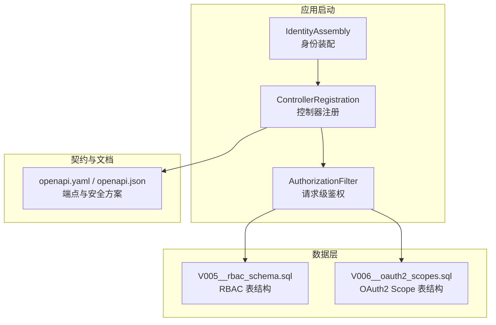
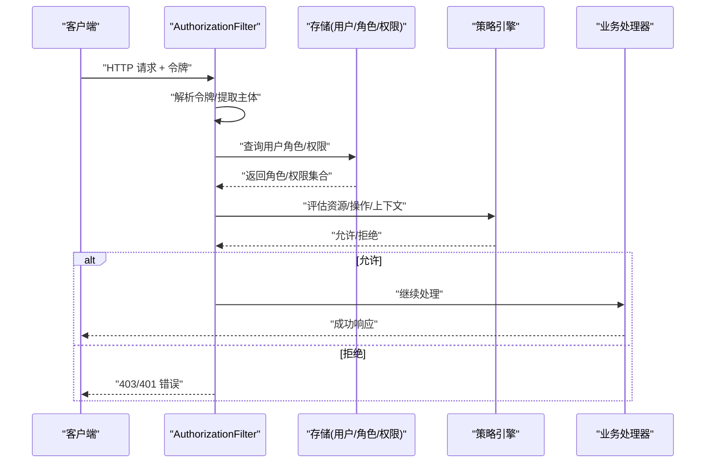
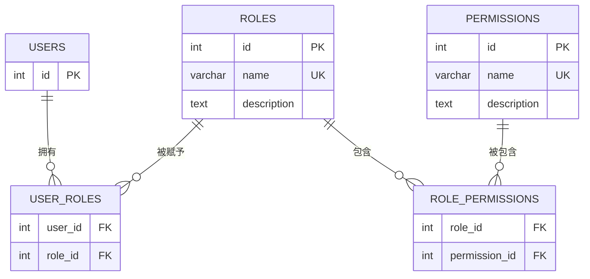
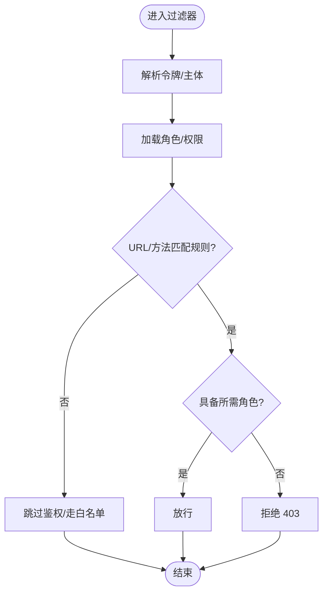
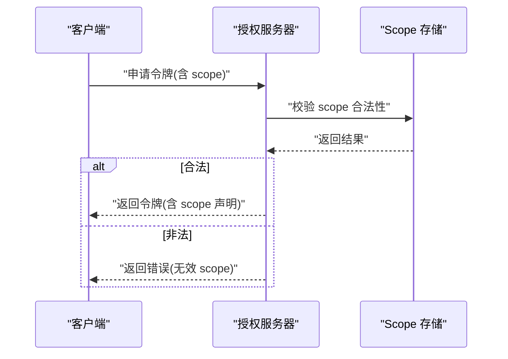
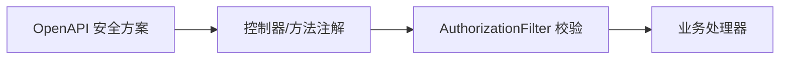
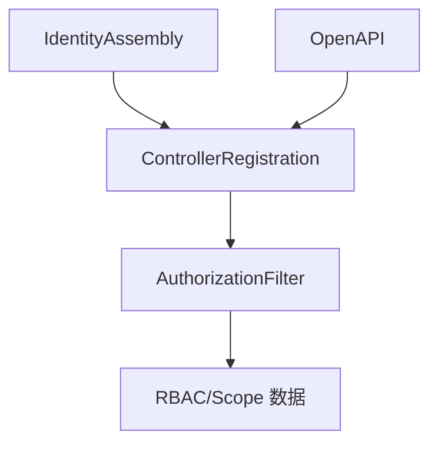

# 授权安全

<cite>
**本文引用的文件**
- [V005__rbac_schema.sql](file://apps/server/migrations/V005__rbac_schema.sql)
- [AuthorizationFilter.h](file://libs/drogon/include/authforge/drogon/filters/AuthorizationFilter.h)
- [AuthorizationFilter.cc](file://libs/drogon/src/filters/AuthorizationFilter.cc)
- [rbac-guide.md](file://docs/backend/rbac-guide.md)
- [openapi.yaml](file://apps/server/openapi.yaml)
- [openapi.json](file://apps/server/docs/api/openapi.json)
- [IdentityAssembly.cc](file://apps/server/src/bootstrap/IdentityAssembly.cc)
- [ControllerRegistration.cc](file://apps/server/src/bootstrap/ControllerRegistration.cc)
- [SecurityHeaders.cc](file://apps/server/src/bootstrap/SecurityHeaders.cc)
- [V006__oauth2_scopes.sql](file://apps/server/migrations/V006__oauth2_scopes.sql)
- [ClientCredentialsScopeValidationTest.cc](file://tests/integration/token/ClientCredentialsScopeValidationTest.cc)
</cite>

## 目录
1. [简介](#简介)
2. [项目结构](#项目结构)
3. [核心组件](#核心组件)
4. [架构总览](#架构总览)
5. [详细组件分析](#详细组件分析)
6. [依赖关系分析](#依赖关系分析)
7. [性能考虑](#性能考虑)
8. [故障排查指南](#故障排查指南)
9. [结论](#结论)
10. [附录](#附录)

## 简介
本文件系统性说明 AuthForge 的授权安全能力，重点覆盖：
- RBAC（基于角色的访问控制）模型、角色与权限定义、继承与分配机制
- 权限验证机制：资源级、操作级与上下文感知授权
- OAuth2/OIDC Scope 细粒度权限控制与 JWT 声明校验
- API 端点保护：中间件过滤与注解驱动的安全控制
- 权限模型设计指南与最佳实践（最小权限原则、职责分离）

## 项目结构
AuthForge 将授权相关能力分布在以下层次：
- 数据层：RBAC 与 Scope 的持久化迁移脚本
- 框架层：Drogon 过滤器（AuthorizationFilter）实现请求级鉴权拦截
- 服务装配：身份装配与控制器注册，统一挂载安全策略
- 文档与契约：OpenAPI 描述端点与安全方案
- 集成测试：针对 Scope 校验等关键路径的行为验证

图表来源
- [IdentityAssembly.cc](file://apps/server/src/bootstrap/IdentityAssembly.cc)
- [ControllerRegistration.cc](file://apps/server/src/bootstrap/ControllerRegistration.cc)
- [AuthorizationFilter.cc](file://libs/drogon/src/filters/AuthorizationFilter.cc)
- [V005__rbac_schema.sql](file://apps/server/migrations/V005__rbac_schema.sql)
- [V006__oauth2_scopes.sql](file://apps/server/migrations/V006__oauth2_scopes.sql)
- [openapi.yaml](file://apps/server/openapi.yaml)

章节来源
- [IdentityAssembly.cc](file://apps/server/src/bootstrap/IdentityAssembly.cc)
- [ControllerRegistration.cc](file://apps/server/src/bootstrap/ControllerRegistration.cc)
- [AuthorizationFilter.cc](file://libs/drogon/src/filters/AuthorizationFilter.cc)
- [V005__rbac_schema.sql](file://apps/server/migrations/V005__rbac_schema.sql)
- [V006__oauth2_scopes.sql](file://apps/server/migrations/V006__oauth2_scopes.sql)
- [openapi.yaml](file://apps/server/openapi.yaml)

## 核心组件
- RBAC 数据模型与默认初始化：通过迁移脚本创建角色、权限及关联表，并注入默认角色与权限
- 请求级鉴权过滤器：在 Drogon 管道中拦截请求，解析令牌、加载主体与角色/权限，执行匹配与放行/拒绝决策
- OAuth2/OIDC Scope 支持：通过数据库存储 Scope 集合，并在客户端凭证流程中进行范围校验
- OpenAPI 安全方案：以标准方式声明端点所需的认证与范围

章节来源
- [V005__rbac_schema.sql](file://apps/server/migrations/V005__rbac_schema.sql)
- [AuthorizationFilter.cc](file://libs/drogon/src/filters/AuthorizationFilter.cc)
- [V006__oauth2_scopes.sql](file://apps/server/migrations/V006__oauth2_scopes.sql)
- [openapi.yaml](file://apps/server/openapi.yaml)

## 架构总览
下图展示从请求进入至鉴权决策的关键路径，涵盖令牌解析、主体与角色/权限加载、规则匹配与响应。

图表来源
- [AuthorizationFilter.cc](file://libs/drogon/src/filters/AuthorizationFilter.cc)
- [V005__rbac_schema.sql](file://apps/server/migrations/V005__rbac_schema.sql)

## 详细组件分析

### RBAC 数据模型与默认初始化
- 角色与权限：roles、permissions 表提供基础实体
- 关联关系：user_roles（用户-角色）、role_permissions（角色-权限）建立多对多映射
- 索引优化：对用户与角色维度建立索引，提升查询效率
- 默认数据：内置 admin/user 角色与若干权限，并将全部权限授予 admin，user 仅授予基础读取权限

图表来源
- [V005__rbac_schema.sql](file://apps/server/migrations/V005__rbac_schema.sql)

章节来源
- [V005__rbac_schema.sql](file://apps/server/migrations/V005__rbac_schema.sql)

### 请求级鉴权过滤器（AuthorizationFilter）
- 拦截位置：Drogon 过滤器链，优先于控制器执行
- 主要职责：
  - 解析 Access Token 或会话标识，提取主体信息
  - 根据主体加载角色与权限集合（可结合缓存）
  - 依据 URL/方法/上下文进行规则匹配（如 rbac_rules）
  - 决策放行或返回 401/403
- 与配置的关系：可通过配置文件定义 URL 模式到所需角色的映射，采用 OR 逻辑匹配

图表来源
- [AuthorizationFilter.cc](file://libs/drogon/src/filters/AuthorizationFilter.cc)
- [rbac-guide.md](file://docs/backend/rbac-guide.md)

章节来源
- [AuthorizationFilter.cc](file://libs/drogon/src/filters/AuthorizationFilter.cc)
- [rbac-guide.md](file://docs/backend/rbac-guide.md)

### OAuth2/OIDC Scope 细粒度权限控制
- Scope 存储：通过迁移脚本维护 Scope 集合，供客户端申请与服务器校验
- 客户端凭证流程：在服务端颁发令牌时，校验请求 Scope 是否合法，并在令牌中携带必要声明
- 集成测试：针对客户端凭证流程的 Scope 校验行为进行回归验证

图表来源
- [V006__oauth2_scopes.sql](file://apps/server/migrations/V006__oauth2_scopes.sql)
- [ClientCredentialsScopeValidationTest.cc](file://tests/integration/token/ClientCredentialsScopeValidationTest.cc)

章节来源
- [V006__oauth2_scopes.sql](file://apps/server/migrations/V006__oauth2_scopes.sql)
- [ClientCredentialsScopeValidationTest.cc](file://tests/integration/token/ClientCredentialsScopeValidationTest.cc)

### JWT 令牌的权限声明与验证
- 声明内容：令牌应包含主体标识、角色与权限集合（或可推导的最小集），以及作用域（scope）
- 验证过程：过滤器或服务层解析令牌，校验签名、过期时间，并提取声明用于后续授权决策
- 建议：避免在令牌中嵌入过多敏感信息；必要时使用短生命周期令牌配合刷新机制

章节来源
- [AuthorizationFilter.cc](file://libs/drogon/src/filters/AuthorizationFilter.cc)
- [openapi.yaml](file://apps/server/openapi.yaml)

### API 端点的权限保护机制
- 中间件过滤：通过 AuthorizationFilter 统一拦截，实现“先鉴权后路由”
- 注解驱动：可在控制器或方法级别标注所需角色/权限，由框架自动校验
- 开放接口：公开端点（如健康检查、发现文档）可配置为免鉴权或通过轻量校验
- 契约声明：OpenAPI 中声明各端点的安全方案（Bearer/JWT/Scope），便于生成客户端与网关策略

图表来源
- [openapi.yaml](file://apps/server/openapi.yaml)
- [openapi.json](file://apps/server/docs/api/openapi.json)
- [AuthorizationFilter.cc](file://libs/drogon/src/filters/AuthorizationFilter.cc)

章节来源
- [openapi.yaml](file://apps/server/openapi.yaml)
- [openapi.json](file://apps/server/docs/api/openapi.json)
- [AuthorizationFilter.cc](file://libs/drogon/src/filters/AuthorizationFilter.cc)

### 上下文感知授权
- 上下文要素：租户/组织、设备指纹、IP/地理位置、时间窗口、风险评分等
- 决策方式：在过滤器或策略层结合上下文动态调整授权结果（例如高风险时段收紧权限）
- 审计记录：对关键决策与拒绝事件进行审计日志记录，便于追踪与合规

章节来源
- [AuthorizationFilter.cc](file://libs/drogon/src/filters/AuthorizationFilter.cc)
- [SecurityHeaders.cc](file://apps/server/src/bootstrap/SecurityHeaders.cc)

## 依赖关系分析
- 启动装配：IdentityAssembly 负责组装身份相关能力；ControllerRegistration 负责注册控制器与路由
- 过滤器链：AuthorizationFilter 作为前置过滤器，依赖 RBAC 数据与配置
- 数据迁移：RBAC 与 Scope 的表结构与默认数据由迁移脚本管理
- 契约与网关：OpenAPI 描述端点安全需求，指导网关与客户端集成

图表来源
- [IdentityAssembly.cc](file://apps/server/src/bootstrap/IdentityAssembly.cc)
- [ControllerRegistration.cc](file://apps/server/src/bootstrap/ControllerRegistration.cc)
- [AuthorizationFilter.cc](file://libs/drogon/src/filters/AuthorizationFilter.cc)
- [openapi.yaml](file://apps/server/openapi.yaml)

章节来源
- [IdentityAssembly.cc](file://apps/server/src/bootstrap/IdentityAssembly.cc)
- [ControllerRegistration.cc](file://apps/server/src/bootstrap/ControllerRegistration.cc)
- [AuthorizationFilter.cc](file://libs/drogon/src/filters/AuthorizationFilter.cc)
- [openapi.yaml](file://apps/server/openapi.yaml)

## 性能考虑
- 角色/权限缓存：在过滤器中引入短期缓存，减少重复查询
- 索引优化：确保 user_roles、role_permissions 等高频查询字段有合适索引
- 令牌体积控制：仅在令牌中包含必要声明，降低解析与传输开销
- 批量加载：按主体一次性加载角色与权限，避免 N+1 查询

## 故障排查指南
- 401/403 频繁出现：
  - 检查令牌是否有效、是否包含必要声明
  - 核对 rbac_rules 与控制器注解是否一致
  - 确认用户是否已正确分配角色/权限
- Scope 校验失败：
  - 检查客户端申请的 scope 是否在数据库中登记
  - 核对服务端颁发令牌时对 scope 的校验逻辑
- 性能问题：
  - 观察过滤器耗时，定位是否为数据库查询瓶颈
  - 增加缓存或优化 SQL

章节来源
- [AuthorizationFilter.cc](file://libs/drogon/src/filters/AuthorizationFilter.cc)
- [ClientCredentialsScopeValidationTest.cc](file://tests/integration/token/ClientCredentialsScopeValidationTest.cc)

## 结论
AuthForge 通过 RBAC 数据模型、请求级过滤器与 OAuth2/OIDc Scope 机制，构建了端到端的授权体系。借助 OpenAPI 契约与启动装配，系统实现了“声明式安全 + 运行时校验”的统一治理。遵循最小权限与职责分离原则，可有效降低越权风险并提升可维护性。

## 附录

### 权限模型设计指南与最佳实践
- 最小权限原则：仅授予完成工作所需的最小权限集合，定期回收冗余权限
- 职责分离：将管理员、普通用户、只读角色等职责清晰划分，避免权限叠加
- 角色继承：通过角色组合与权限聚合实现继承，避免硬编码分支
- 资源/操作/上下文三维控制：以资源维度限定对象，以操作维度限定动作，以上下文维度限制场景
- 审计与可观测性：记录授权决策与拒绝原因，支撑事后追溯与合规审计
- 令牌治理：短生命周期令牌 + 刷新机制；谨慎声明敏感信息
- 配置即策略：将 URL 到角色的映射集中管理，便于变更与审查

章节来源
- [rbac-guide.md](file://docs/backend/rbac-guide.md)
- [V005__rbac_schema.sql](file://apps/server/migrations/V005__rbac_schema.sql)
- [AuthorizationFilter.cc](file://libs/drogon/src/filters/AuthorizationFilter.cc)