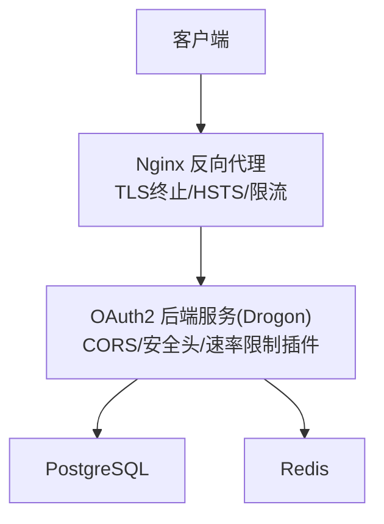
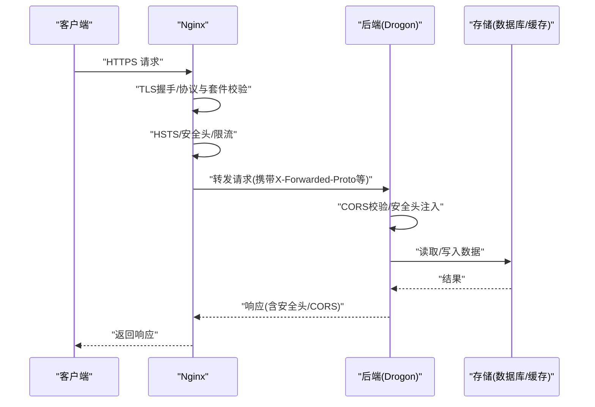
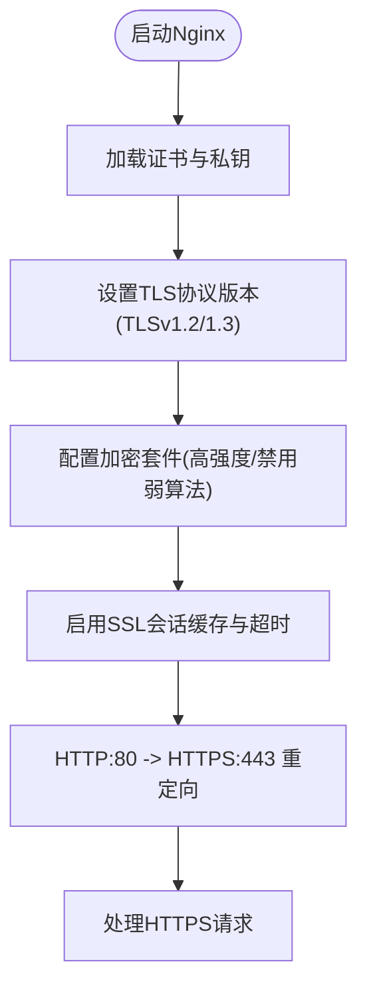
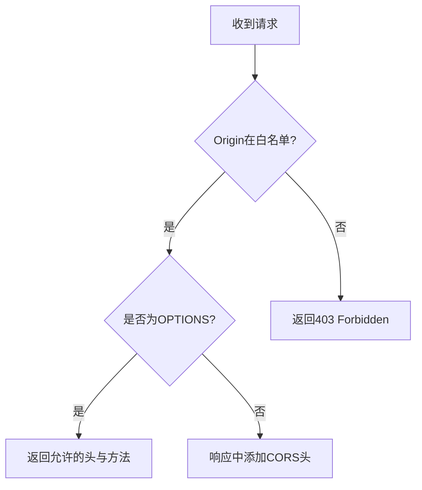
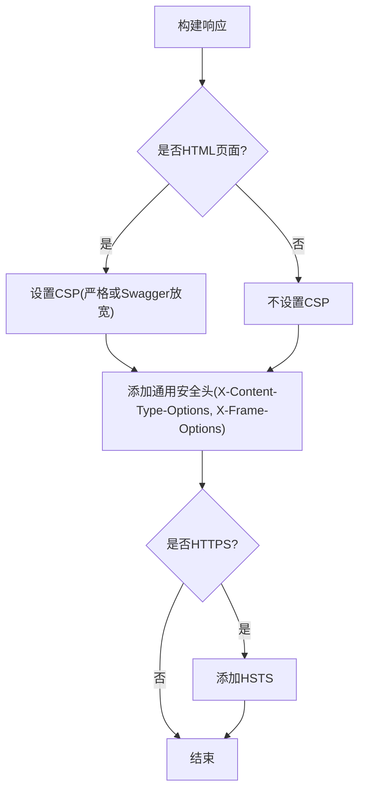
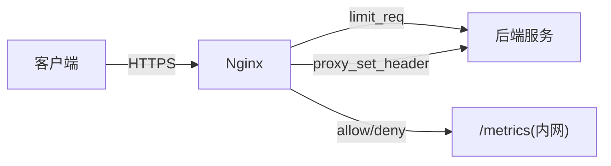
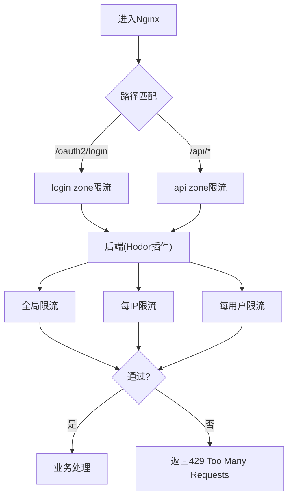
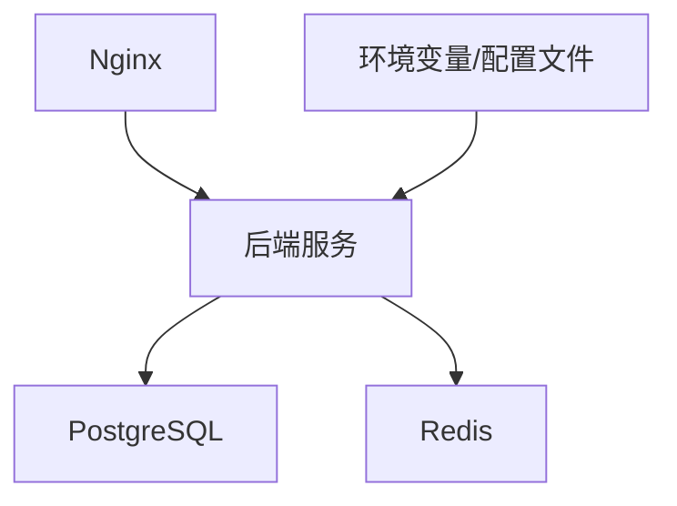

# 网络安全

<cite>
**本文引用的文件**
- [SecurityHeaders.cc](file://apps/server/src/bootstrap/SecurityHeaders.cc)
- [CorsSetup.cc](file://apps/server/src/bootstrap/CorsSetup.cc)
- [nginx.conf](file://deploy/nginx/nginx.conf)
- [config.json](file://apps/server/config/config.json)
- [config.prod.json](file://apps/server/config/config.prod.json)
- [docker-compose.prod.yml](file://deploy/docker/docker-compose.prod.yml)
- [generate-certs.sh](file://scripts/generate-certs.sh)
- [security-hardening.md](file://docs/backend/security-hardening.md)
- [security-check.sh](file://scripts/security-check.sh)
- [SecurityTest.cc](file://tests/security/injection/SecurityTest.cc)
</cite>

## 目录
1. [简介](#简介)
2. [项目结构](#项目结构)
3. [核心组件](#核心组件)
4. [架构总览](#架构总览)
5. [详细组件分析](#详细组件分析)
6. [依赖关系分析](#依赖关系分析)
7. [性能与安全考量](#性能与安全考量)
8. [故障排查指南](#故障排查指南)
9. [结论](#结论)
10. [附录](#附录)

## 简介
本章节面向AuthForge的网络安全配置与加固，覆盖HTTPS/TLS、CORS跨域、安全响应头、HSTS、反向代理（Nginx）以及DDoS防护与请求限流。文档基于仓库中的实际实现与配置，提供可操作的部署建议与验证方法。

## 项目结构
本项目在应用层通过Drogon中间件注入安全响应头与CORS策略；在网关层使用Nginx统一处理TLS终止、HSTS、访问控制与请求限流；在生产编排中通过Docker Compose将Nginx作为入口，后端服务仅暴露内部端口。

图表来源
- [nginx.conf:40-114](file://deploy/nginx/nginx.conf#L40-L114)
- [SecurityHeaders.cc:8-61](file://apps/server/src/bootstrap/SecurityHeaders.cc#L8-L61)
- [CorsSetup.cc:8-79](file://apps/server/src/bootstrap/CorsSetup.cc#L8-L79)
- [docker-compose.prod.yml:13-31](file://deploy/docker/docker-compose.prod.yml#L13-L31)

章节来源
- [nginx.conf:40-114](file://deploy/nginx/nginx.conf#L40-L114)
- [docker-compose.prod.yml:13-31](file://deploy/docker/docker-compose.prod.yml#L13-L31)

## 核心组件
- HTTPS/TLS：由Nginx负责证书加载、协议版本与加密套件控制，并强制HTTP到HTTPS重定向。
- CORS：后端按白名单精确匹配Origin，拒绝未授权预检请求，并在响应中附加必要的CORS头。
- 安全响应头：全局后置处理器为所有响应添加X-Content-Type-Options、X-Frame-Options，并按页面类型设置CSP；对HTTPS连接附加HSTS。
- HSTS：Nginx与应用层均设置Strict-Transport-Security，确保浏览器强制HTTPS。
- 反向代理：Nginx集中转发API/OAuth2/健康检查等路径，并传递真实IP与协议信息给后端。
- DDoS防护与限流：Nginx层按IP进行请求速率限制；应用层通过Hodor插件实现令牌桶算法的多级限流（全局/IP/用户）。

章节来源
- [nginx.conf:24-83](file://deploy/nginx/nginx.conf#L24-L83)
- [SecurityHeaders.cc:8-61](file://apps/server/src/bootstrap/SecurityHeaders.cc#L8-L61)
- [CorsSetup.cc:8-79](file://apps/server/src/bootstrap/CorsSetup.cc#L8-L79)
- [config.prod.json:142-188](file://apps/server/config/config.prod.json#L142-L188)

## 架构总览
下图展示了从客户端到后端的完整安全链路：Nginx终止TLS、设置HSTS与基础安全头、执行请求限流；随后将请求转发至后端，后端再根据CORS与安全头策略处理响应。

图表来源
- [nginx.conf:40-114](file://deploy/nginx/nginx.conf#L40-L114)
- [SecurityHeaders.cc:8-61](file://apps/server/src/bootstrap/SecurityHeaders.cc#L8-L61)
- [CorsSetup.cc:8-79](file://apps/server/src/bootstrap/CorsSetup.cc#L8-L79)

## 详细组件分析

### HTTPS/TLS配置与证书管理
- 证书位置与挂载：Nginx容器以只读方式挂载SSL目录，包含fullchain.pem与privkey.pem。
- 协议与套件：仅启用TLSv1.2与TLSv1.3，选择高强度加密套件并禁用弱算法，服务器优先选择套件。
- 会话优化：启用共享SSL会话缓存与超时控制，提升握手性能。
- HTTP到HTTPS：监听80端口并301重定向到HTTPS。
- 开发证书生成：提供脚本生成自签名证书用于本地测试，生产环境建议使用权威CA（如Let's Encrypt）。

图表来源
- [nginx.conf:33-55](file://deploy/nginx/nginx.conf#L33-L55)
- [generate-certs.sh:1-24](file://scripts/generate-certs.sh#L1-L24)
- [docker-compose.prod.yml:13-23](file://deploy/docker/docker-compose.prod.yml#L13-L23)

章节来源
- [nginx.conf:33-55](file://deploy/nginx/nginx.conf#L33-L55)
- [generate-certs.sh:1-24](file://scripts/generate-certs.sh#L1-L24)
- [docker-compose.prod.yml:13-23](file://deploy/docker/docker-compose.prod.yml#L13-L23)

### CORS跨域资源共享安全配置
- 白名单机制：严格模式，仅允许配置的精确Origin，禁止通配符，防止CSRF。
- 预检请求处理：OPTIONS请求若Origin不在白名单则直接返回403。
- 响应头设置：对允许的Origin返回Access-Control-Allow-Origin、Methods、Headers与Credentials。
- 配置来源：通过自定义配置项cors.allow_origins指定，支持环境变量覆盖。

图表来源
- [CorsSetup.cc:10-79](file://apps/server/src/bootstrap/CorsSetup.cc#L10-L79)
- [config.json:172-190](file://apps/server/config/config.json#L172-L190)
- [config.prod.json:220-242](file://apps/server/config/config.prod.json#L220-L242)

章节来源
- [CorsSetup.cc:10-79](file://apps/server/src/bootstrap/CorsSetup.cc#L10-L79)
- [config.json:172-190](file://apps/server/config/config.json#L172-L190)
- [config.prod.json:220-242](file://apps/server/config/config.prod.json#L220-L242)
- [SecurityTest.cc:173-197](file://tests/security/injection/SecurityTest.cc#L173-L197)

### 安全响应头配置
- X-Content-Type-Options：设置为nosniff，阻止MIME嗅探。
- X-Frame-Options：设置为SAMEORIGIN，防止点击劫持。
- Content-Security-Policy：对HTML页面设置严格CSP；对Swagger UI路径放宽以支持第三方资源。
- HSTS：仅在HTTPS连接时添加Strict-Transport-Security，并包含includeSubDomains。

图表来源
- [SecurityHeaders.cc:8-61](file://apps/server/src/bootstrap/SecurityHeaders.cc#L8-L61)

章节来源
- [SecurityHeaders.cc:8-61](file://apps/server/src/bootstrap/SecurityHeaders.cc#L8-L61)
- [security-hardening.md:36-63](file://docs/backend/security-hardening.md#L36-L63)

### HSTS(HTTP严格传输安全)
- Nginx层：对所有HTTPS响应添加HSTS，max-age=31536000并包含子域名。
- 应用层：当检测到X-Forwarded-Proto为https时，同样添加HSTS，保证在反向代理场景下也能生效。
- 部署建议：生产环境先以较短max-age验证，逐步增加；确认所有子域名均已启用HTTPS后再开启includeSubDomains。

章节来源
- [nginx.conf:54-55](file://deploy/nginx/nginx.conf#L54-L55)
- [SecurityHeaders.cc:52-58](file://apps/server/src/bootstrap/SecurityHeaders.cc#L52-L58)

### 反向代理的安全配置（Nginx）
- TLS终止与重定向：统一在Nginx处理HTTPS，并将HTTP重定向到HTTPS。
- 安全头：在http块中全局添加X-Content-Type-Options、X-Frame-Options、Referrer-Policy。
- 请求限流：定义不同zone（login/api），按IP限制请求速率，并对敏感路径（登录）更严格的限制。
- 代理头：正确传递Host、X-Real-IP、X-Forwarded-For、X-Forwarded-Proto，使后端能识别真实客户端与协议。
- 访问控制：metrics端点仅允许内网地址访问，避免监控接口泄露。

图表来源
- [nginx.conf:8-12](file://deploy/nginx/nginx.conf#L8-L12)
- [nginx.conf:24-83](file://deploy/nginx/nginx.conf#L24-L83)
- [nginx.conf:91-101](file://deploy/nginx/nginx.conf#L91-L101)

章节来源
- [nginx.conf:8-12](file://deploy/nginx/nginx.conf#L8-L12)
- [nginx.conf:24-83](file://deploy/nginx/nginx.conf#L24-L83)
- [nginx.conf:91-101](file://deploy/nginx/nginx.conf#L91-L101)

### DDoS防护与请求限流机制
- Nginx层限流：
  - login zone：针对登录路径严格限速，burst较小，防止暴力破解。
  - api zone：对API与OAuth2路径设定较高吞吐，burst适度，平衡性能与安全。
- 应用层限流（Hodor插件）：
  - 算法：令牌桶，平滑限流。
  - 层级：全局、每IP、每用户三级限制，敏感接口（登录、令牌、注册）有更严格的IP/用户限制。
  - 白名单：信任IP段跳过限制，便于内部调用与测试。
  - 配置：通过config.json动态调整，无需重新编译。

图表来源
- [nginx.conf:24-83](file://deploy/nginx/nginx.conf#L24-L83)
- [config.prod.json:142-188](file://apps/server/config/config.prod.json#L142-L188)
- [security-hardening.md:5-33](file://docs/backend/security-hardening.md#L5-L33)

章节来源
- [nginx.conf:24-83](file://deploy/nginx/nginx.conf#L24-L83)
- [config.prod.json:142-188](file://apps/server/config/config.prod.json#L142-L188)
- [security-hardening.md:5-33](file://docs/backend/security-hardening.md#L5-L33)

## 依赖关系分析
- Nginx与后端：Nginx作为入口，负责TLS、限流与安全头；后端专注业务逻辑与CORS、安全头注入。
- 后端与存储：后端依赖PostgreSQL与Redis，生产环境中通过环境变量注入敏感配置。
- 配置与环境：生产配置通过config.prod.json与docker-compose.prod.yml的环境变量组合，实现敏感信息与运行参数解耦。

图表来源
- [docker-compose.prod.yml:74-139](file://deploy/docker/docker-compose.prod.yml#L74-L139)
- [config.prod.json:9-39](file://apps/server/config/config.prod.json#L9-L39)

章节来源
- [docker-compose.prod.yml:74-139](file://deploy/docker/docker-compose.prod.yml#L74-L139)
- [config.prod.json:9-39](file://apps/server/config/config.prod.json#L9-L39)

## 性能与安全考量
- TLS性能：启用会话缓存与超时控制，减少握手开销；在高并发场景下评估CPU与内存占用。
- 压缩与静态资源：Nginx启用gzip，后端可选brotli，注意对敏感内容谨慎压缩。
- 限流调优：根据业务峰值与恶意流量特征调整burst与rate，避免误伤正常用户。
- CSP策略：对主应用采用严格CSP，对Swagger等第三方UI按需放宽，避免功能受限。
- HSTS部署：分阶段启用，确保所有子域名与资源已迁移至HTTPS。

[本节为通用指导，不直接分析具体文件]

## 故障排查指南
- 安全头缺失：检查Nginx全局头与后端后置处理器是否正确注册；确认响应类型判断逻辑。
- CORS被拒：核对custom_config.cors.allow_origins列表，确保Origin完全匹配；检查预检请求是否返回403。
- HSTS未生效：确认Nginx与后端均在HTTPS场景下添加HSTS；检查X-Forwarded-Proto是否正确传递。
- 限流过严：查看Nginx limit_req日志与后端Hodor统计，适当调整rate与burst；确认信任IP段配置。
- 证书问题：验证fullchain.pem与privkey.pem路径与权限；生产环境确认证书链完整性与有效期。

章节来源
- [SecurityHeaders.cc:8-61](file://apps/server/src/bootstrap/SecurityHeaders.cc#L8-L61)
- [CorsSetup.cc:10-79](file://apps/server/src/bootstrap/CorsSetup.cc#L10-L79)
- [nginx.conf:8-12](file://deploy/nginx/nginx.conf#L8-L12)
- [nginx.conf:24-83](file://deploy/nginx/nginx.conf#L24-L83)
- [security-check.sh:26-148](file://scripts/security-check.sh#L26-L148)

## 结论
AuthForge在反向代理与应用层协同实现了全面的网络安全能力：Nginx负责TLS终止、HSTS与请求限流；后端通过CORS白名单、安全响应头与Hodor插件完成细粒度的跨域控制与防暴力破解。生产部署通过Docker Compose与环境变量实现敏感信息隔离与可运维性。建议在上线前结合漏洞扫描与渗透测试，持续验证安全配置的有效性。

[本节为总结，不直接分析具体文件]

## 附录
- 安全加固文档参考：[security-hardening.md](file://docs/backend/security-hardening.md)
- 安全扫描脚本：[security-check.sh](file://scripts/security-check.sh)
- 证书生成脚本：[generate-certs.sh](file://scripts/generate-certs.sh)
- 生产编排：[docker-compose.prod.yml](file://deploy/docker/docker-compose.prod.yml)
- 后端配置（生产）：[config.prod.json](file://apps/server/config/config.prod.json)
- 后端配置（开发）：[config.json](file://apps/server/config/config.json)
- Nginx配置：[nginx.conf](file://deploy/nginx/nginx.conf)
- 安全头实现：[SecurityHeaders.cc](file://apps/server/src/bootstrap/SecurityHeaders.cc)
- CORS实现：[CorsSetup.cc](file://apps/server/src/bootstrap/CorsSetup.cc)
- CORS测试用例：[SecurityTest.cc](file://tests/security/injection/SecurityTest.cc)