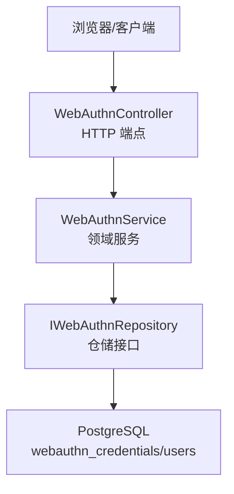
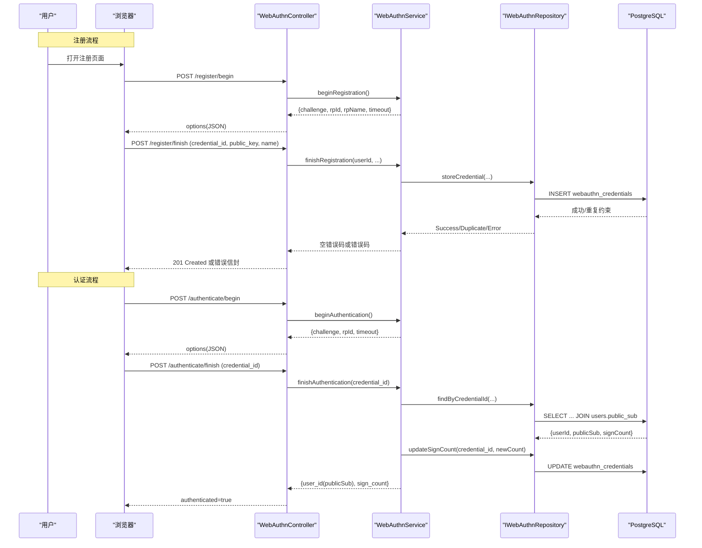
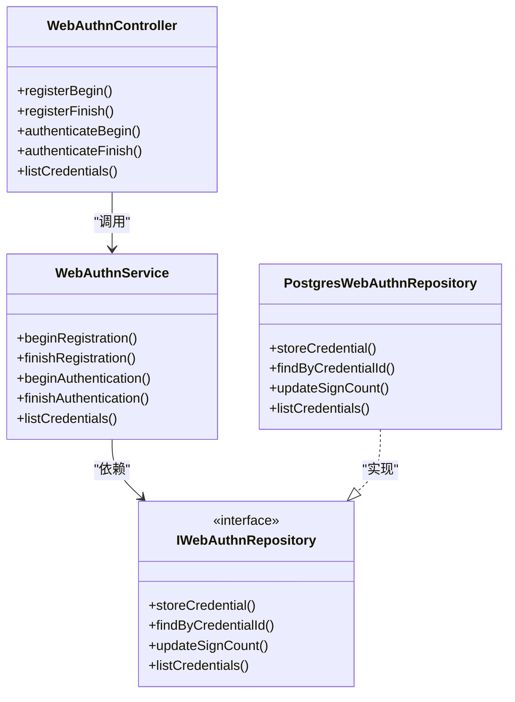

# WebAuthn生物识别认证

<cite>
**本文引用的文件**
- [WebAuthnController.h](file://libs/drogon/include/authforge/drogon/controllers/WebAuthnController.h)
- [WebAuthnController.cc](file://libs/drogon/src/controllers/WebAuthnController.cc)
- [WebAuthnService.h](file://libs/identity/include/authforge/identity/WebAuthnService.h)
- [WebAuthnService.cc](file://libs/identity/src/webauthn/WebAuthnService.cc)
- [IWebAuthnRepository.h](file://libs/identity/include/authforge/identity/IWebAuthnRepository.h)
- [PostgresWebAuthnRepository.h](file://libs/storage-postgres/include/authforge/storage/postgres/PostgresWebAuthnRepository.h)
- [PostgresWebAuthnRepository.cc](file://libs/storage-postgres/src/PostgresWebAuthnRepository.cc)
- [V018__webauthn.sql](file://apps/server/migrations/V018__webauthn.sql)
- [IdentityAssembly.cc](file://apps/server/src/bootstrap/IdentityAssembly.cc)
- [ControllerRegistration.cc](file://apps/server/src/bootstrap/ControllerRegistration.cc)
- [openapi.json](file://apps/server/docs/api/openapi.json)
</cite>

## 目录
1. [简介](#简介)
2. [项目结构](#项目结构)
3. [核心组件](#核心组件)
4. [架构总览](#架构总览)
5. [详细组件分析](#详细组件分析)
6. [依赖关系分析](#依赖关系分析)
7. [性能与可扩展性](#性能与可扩展性)
8. [配置指南](#配置指南)
9. [跨平台与兼容性](#跨平台与兼容性)
10. [故障排除指南](#故障排除指南)
11. [结论](#结论)

## 简介
本文件系统性说明 AuthForge 中基于 WebAuthn（FIDO2）的生物识别认证实现，覆盖客户端注册、认证流程、密钥管理、凭据存储与查询、RP（Relying Party）配置、错误处理、性能考量以及跨平台兼容性与降级策略。当前实现聚焦于“挑战-响应”的会话式流程与凭据生命周期管理；生产级密码学验证（attestation/assertion签名校验）作为后续任务规划，不在本版本范围内。

## 项目结构
WebAuthn 能力由四层构成：
- 控制器层（Drogon HTTP 接口）：暴露注册与认证的 begin/finish 及凭据列表接口
- 领域服务层（WebAuthnService）：生成挑战、凭据注册/认证业务编排、计数更新
- 仓储接口与实现（IWebAuthnRepository + PostgresWebAuthnRepository）：凭据持久化、查找、计数更新、列表
- 数据模型与迁移（V018__webauthn.sql）：webauthn_credentials 表结构与索引

图表来源
- [WebAuthnController.cc:114-226](file://libs/drogon/src/controllers/WebAuthnController.cc#L114-L226)
- [WebAuthnService.cc:41-177](file://libs/identity/src/webauthn/WebAuthnService.cc#L41-L177)
- [PostgresWebAuthnRepository.cc:18-158](file://libs/storage-postgres/src/PostgresWebAuthnRepository.cc#L18-L158)
- [V018__webauthn.sql:1-16](file://apps/server/migrations/V018__webauthn.sql#L1-L16)

章节来源
- [WebAuthnController.h:28-82](file://libs/drogon/include/authforge/drogon/controllers/WebAuthnController.h#L28-L82)
- [WebAuthnController.cc:96-111](file://libs/drogon/src/controllers/WebAuthnController.cc#L96-L111)
- [WebAuthnService.h:79-126](file://libs/identity/include/authforge/identity/WebAuthnService.h#L79-L126)
- [IWebAuthnRepository.h:40-133](file://libs/identity/include/authforge/identity/IWebAuthnRepository.h#L40-L133)
- [PostgresWebAuthnRepository.h:19-51](file://libs/storage-postgres/include/authforge/storage/postgres/PostgresWebAuthnRepository.h#L19-L51)
- [V018__webauthn.sql:1-16](file://apps/server/migrations/V018__webauthn.sql#L1-L16)

## 核心组件
- WebAuthnController：定义并实现以下端点
  - POST /api/me/webauthn/register/begin（需登录）
  - POST /api/me/webauthn/register/finish（需登录）
  - POST /oauth2/webauthn/authenticate/begin（无需登录）
  - POST /oauth2/webauthn/authenticate/finish（无需登录）
  - GET /api/me/webauthn/credentials（需登录）
- WebAuthnService：封装挑战生成、凭据注册完成、认证完成、凭据列表等业务逻辑
- IWebAuthnRepository/PostgresWebAuthnRepository：凭据存储、查找、sign_count 更新、列表
- 数据库表 webauthn_credentials：存储 credential_id、public_key、sign_count、name、时间戳等

章节来源
- [WebAuthnController.h:50-82](file://libs/drogon/include/authforge/drogon/controllers/WebAuthnController.h#L50-L82)
- [WebAuthnService.h:127-223](file://libs/identity/include/authforge/identity/WebAuthnService.h#L127-L223)
- [IWebAuthnRepository.h:92-133](file://libs/identity/include/authforge/identity/IWebAuthnRepository.h#L92-L133)
- [PostgresWebAuthnRepository.h:28-51](file://libs/storage-postgres/include/authforge/storage/postgres/PostgresWebAuthnRepository.h#L28-L51)
- [V018__webauthn.sql:1-16](file://apps/server/migrations/V018__webauthn.sql#L1-L16)

## 架构总览
WebAuthn 在 AuthForge 中的调用链如下：
- 注册流程：客户端先调用 registerBegin 获取 challenge/rp/user 等选项，再调用 registerFinish 提交 credential_id/public_key/name 完成注册
- 认证流程：客户端先调用 authenticateBegin 获取 challenge/rpId/timeout，再调用 authenticateFinish 提交 credential_id 完成认证
- 凭据管理：已登录用户可调用 listCredentials 查看其所有凭据

图表来源
- [WebAuthnController.cc:114-226](file://libs/drogon/src/controllers/WebAuthnController.cc#L114-L226)
- [WebAuthnController.cc:389-453](file://libs/drogon/src/controllers/WebAuthnController.cc#L389-L453)
- [WebAuthnController.cc:455-604](file://libs/drogon/src/controllers/WebAuthnController.cc#L455-L604)
- [WebAuthnService.cc:41-177](file://libs/identity/src/webauthn/WebAuthnService.cc#L41-L177)
- [PostgresWebAuthnRepository.cc:18-158](file://libs/storage-postgres/src/PostgresWebAuthnRepository.cc#L18-L158)

## 详细组件分析

### 控制器层：WebAuthnController
职责
- 暴露 WebAuthn 相关 HTTP 端点，负责请求解析、会话挑战存储、构建 WebAuthn options、统一错误响应与审计日志
- 支持两种路径：优先使用注入的 WebAuthnService（推荐），否则回退到直接 ORM 操作（兼容旧路径）

关键端点
- POST /api/me/webauthn/register/begin：生成注册挑战，返回 options（rp、user、pubKeyCredParams、timeout、authenticatorSelection）
- POST /api/me/webauthn/register/finish：接收 credential_id/public_key/name，完成凭据存储
- POST /oauth2/webauthn/authenticate/begin：生成认证挑战，返回 options（rpId、timeout、allowCredentials 为空以启用可发现凭据）
- POST /oauth2/webauthn/authenticate/finish：根据 credential_id 查找凭据，递增 sign_count，返回 user_id(publicSub) 与 sign_count
- GET /api/me/webauthn/credentials：列出当前用户的凭据摘要

安全与合规
- 注册/列表接口受 OAuth2 鉴权过滤器保护
- 认证接口无鉴权（本身即认证入口）
- 通过 ErrorResponder 输出统一错误信封，便于前端一致处理

章节来源
- [WebAuthnController.h:28-108](file://libs/drogon/include/authforge/drogon/controllers/WebAuthnController.h#L28-L108)
- [WebAuthnController.cc:24-41](file://libs/drogon/src/controllers/WebAuthnController.cc#L24-L41)
- [WebAuthnController.cc:96-111](file://libs/drogon/src/controllers/WebAuthnController.cc#L96-L111)
- [WebAuthnController.cc:114-226](file://libs/drogon/src/controllers/WebAuthnController.cc#L114-L226)
- [WebAuthnController.cc:389-453](file://libs/drogon/src/controllers/WebAuthnController.cc#L389-L453)
- [WebAuthnController.cc:455-604](file://libs/drogon/src/controllers/WebAuthnController.cc#L455-L604)
- [WebAuthnController.cc:606-708](file://libs/drogon/src/controllers/WebAuthnController.cc#L606-L708)

### 领域服务层：WebAuthnService
职责
- 生成加密安全的随机挑战（Base64url 编码）
- 完成凭据注册：参数校验、默认名称处理、调用仓储存储
- 完成凭据认证：查找凭据、计算新 sign_count、异步更新（失败不阻塞认证结果）
- 列出用户凭据摘要

设计要点
- 框架无关：不依赖 Drogon/DB 类型，仅通过构造函数注入仓储与加密提供者
- 挑战暂存交由调用方（控制器）通过 session 保存，保持领域边界清晰
- 明确声明当前不包含 FIDO2 密码学校验（attestation/assertion），该能力为后续任务

章节来源
- [WebAuthnService.h:79-126](file://libs/identity/include/authforge/identity/WebAuthnService.h#L79-L126)
- [WebAuthnService.h:127-223](file://libs/identity/include/authforge/identity/WebAuthnService.h#L127-L223)
- [WebAuthnService.cc:11-24](file://libs/identity/src/webauthn/WebAuthnService.cc#L11-L24)
- [WebAuthnService.cc:41-177](file://libs/identity/src/webauthn/WebAuthnService.cc#L41-L177)

### 仓储层：IWebAuthnRepository 与 PostgresWebAuthnRepository
职责
- IWebAuthnRepository：定义凭据存储、查找、sign_count 更新、列表的异步接口
- PostgresWebAuthnRepository：基于 Drogon ORM 对 webauthn_credentials 与 users 表进行读写

关键行为
- storeCredential：INSERT 凭据，区分成功、重复 credential_id、其他错误
- findByCredentialId：按 credential_id 查找并关联 users.public_sub
- updateSignCount：原子更新 sign_count 与 last_used_at
- listCredentials：按 user_id 查询并按 created_at 倒序返回

章节来源
- [IWebAuthnRepository.h:40-133](file://libs/identity/include/authforge/identity/IWebAuthnRepository.h#L40-L133)
- [PostgresWebAuthnRepository.h:19-51](file://libs/storage-postgres/include/authforge/storage/postgres/PostgresWebAuthnRepository.h#L19-L51)
- [PostgresWebAuthnRepository.cc:18-158](file://libs/storage-postgres/src/PostgresWebAuthnRepository.cc#L18-L158)

### 数据模型与迁移
- webauthn_credentials：主键 id、user_id（外键）、credential_id（唯一）、public_key、sign_count、transports、name、created_at、last_used_at
- 索引：user_id、credential_id 提升查询性能

章节来源
- [V018__webauthn.sql:1-16](file://apps/server/migrations/V018__webauthn.sql#L1-L16)

### 装配与路由
- IdentityAssembly：装配 WebAuthnService、PostgresWebAuthnRepository，注入 RP 配置（rp_id/rp_name）
- ControllerRegistration：注册 WebAuthnController 到 Drogon 路由表

章节来源
- [IdentityAssembly.cc:103-140](file://apps/server/src/bootstrap/IdentityAssembly.cc#L103-L140)
- [IdentityAssembly.cc:195-212](file://apps/server/src/bootstrap/IdentityAssembly.cc#L195-L212)
- [ControllerRegistration.cc:27-93](file://apps/server/src/bootstrap/ControllerRegistration.cc#L27-L93)

## 依赖关系分析
- 控制器依赖服务：WebAuthnController -> WebAuthnService
- 服务依赖仓储与加密：WebAuthnService -> IWebAuthnRepository + ICryptoProvider
- 仓储依赖数据库：PostgresWebAuthnRepository -> PostgreSQL（webauthn_credentials/users）
- 启动装配：IdentityAssembly 将仓储与服务注入控制器，并设置 RP 配置

图表来源
- [WebAuthnController.h:28-108](file://libs/drogon/include/authforge/drogon/controllers/WebAuthnController.h#L28-L108)
- [WebAuthnService.h:127-223](file://libs/identity/include/authforge/identity/WebAuthnService.h#L127-L223)
- [IWebAuthnRepository.h:92-133](file://libs/identity/include/authforge/identity/IWebAuthnRepository.h#L92-L133)
- [PostgresWebAuthnRepository.h:19-51](file://libs/storage-postgres/include/authforge/storage/postgres/PostgresWebAuthnRepository.h#L19-L51)

章节来源
- [IdentityAssembly.cc:103-140](file://apps/server/src/bootstrap/IdentityAssembly.cc#L103-L140)
- [ControllerRegistration.cc:27-93](file://apps/server/src/bootstrap/ControllerRegistration.cc#L27-L93)

## 性能与可扩展性
- 异步回调：仓储与服务方法均采用异步回调，避免阻塞事件循环，充分利用 Drogon 非阻塞 I/O
- 数据库索引：对 user_id 与 credential_id 建立索引，优化查找与列表性能
- 最小化写入：认证时 sign_count 更新采用“尽力而为”，即使失败也不影响认证结果返回，提高可用性
- 可扩展性：通过仓储接口抽象，可替换不同后端（如内存/Redis 缓存层）或扩展更多存储实现

[本节为通用指导，不直接分析具体文件]

## 配置指南
- RP（Relying Party）设置
  - rp_id：默认 localhost，可通过自定义配置覆盖
  - rp_name：默认 "OAuth2 Server"，可通过自定义配置覆盖
- 安全策略
  - 用户验证：userVerification 设置为 preferred
  - 可发现凭据：residentKey 设置为 preferred，支持设备内凭据
  - 算法支持：优先 ES256，回退 RS256
- OpenAPI 文档
  - 端点元数据已注册至 OpenAPI 生成器，可在 API 文档中查看

章节来源
- [WebAuthnController.cc:96-111](file://libs/drogon/src/controllers/WebAuthnController.cc#L96-L111)
- [WebAuthnController.cc:145-173](file://libs/drogon/src/controllers/WebAuthnController.cc#L145-L173)
- [WebAuthnController.cc:203-220](file://libs/drogon/src/controllers/WebAuthnController.cc#L203-L220)
- [WebAuthnController.cc:417-425](file://libs/drogon/src/controllers/WebAuthnController.cc#L417-L425)
- [openapi.json:1023-1052](file://apps/server/docs/api/openapi.json#L1023-L1052)

## 跨平台与兼容性
- 浏览器支持
  - 现代桌面与移动浏览器均支持 WebAuthn/FIDO2，服务端通过 allowCredentials 为空启用可发现凭据，适配多设备场景
- 移动端适配
  - 支持指纹识别、面部识别、设备 PIN 码等本地生物识别或设备锁定机制（由操作系统/浏览器提供）
- 降级策略
  - 当浏览器不支持 WebAuthn 时，前端应提供备用登录方式（用户名/密码或第三方登录）
  - 若设备不支持生物识别，可回退到设备 PIN 码或其他本地验证方式
- 用户体验优化建议
  - 明确提示用户选择生物识别或 PIN 码
  - 在失败时给出友好提示与重试引导
  - 记录并展示凭据名称以便用户管理

[本节为通用指导，不直接分析具体文件]

## 故障排除指南
常见问题与处理
- 挑战生成失败
  - 现象：registerBegin/authenticateBegin 返回内部错误
  - 排查：确认加密提供者可用；检查日志中的 INTERNAL_ERROR
- 凭据重复注册
  - 现象：registerFinish 返回 VALIDATION_CREDENTIAL_ALREADY_REGISTERED
  - 原因：credential_id 唯一约束冲突
  - 处理：更换新凭据或清理重复项
- 凭据不存在
  - 现象：authenticateFinish 返回 AUTH_INVALID_CREDENTIALS
  - 处理：确认凭据已正确注册且未删除
- 数据库异常
  - 现象：DB_QUERY_ERROR
  - 处理：检查连接、权限、迁移是否执行、索引是否存在
- 会话挑战丢失
  - 现象：前后端交互中断导致挑战不一致
  - 处理：确保 session 正常、跨域/CORS 配置正确、超时合理

章节来源
- [WebAuthnController.cc:24-41](file://libs/drogon/src/controllers/WebAuthnController.cc#L24-L41)
- [WebAuthnController.cc:135-144](file://libs/drogon/src/controllers/WebAuthnController.cc#L135-L144)
- [WebAuthnController.cc:253-262](file://libs/drogon/src/controllers/WebAuthnController.cc#L253-L262)
- [WebAuthnController.cc:493-501](file://libs/drogon/src/controllers/WebAuthnController.cc#L493-L501)
- [PostgresWebAuthnRepository.cc:43-54](file://libs/storage-postgres/src/PostgresWebAuthnRepository.cc#L43-L54)

## 结论
AuthForge 的 WebAuthn 实现提供了完整的注册、认证与凭据管理能力，采用清晰的层次化设计与异步回调模型，具备良好的可扩展性与可维护性。当前版本专注于挑战生成与凭据生命周期管理，未来可在此基础上增强 FIDO2 密码学校验、更丰富的凭据属性与更强的安全策略。通过合理的 RP 配置、跨平台兼容与完善的故障排除指引，可为用户提供安全、便捷、一致的生物识别认证体验。