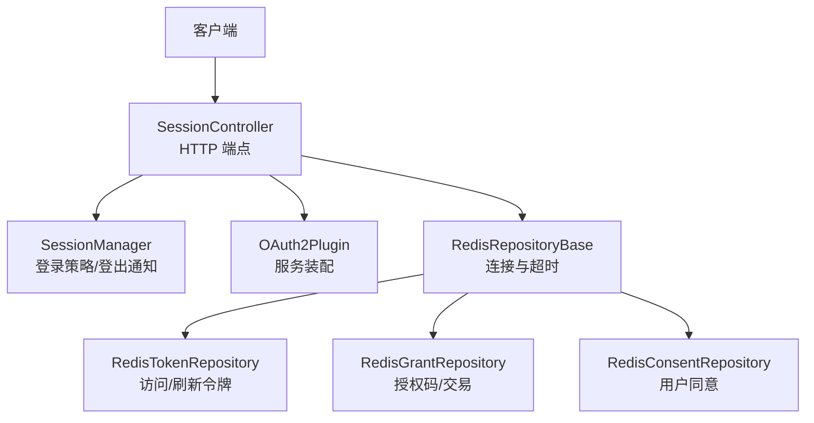
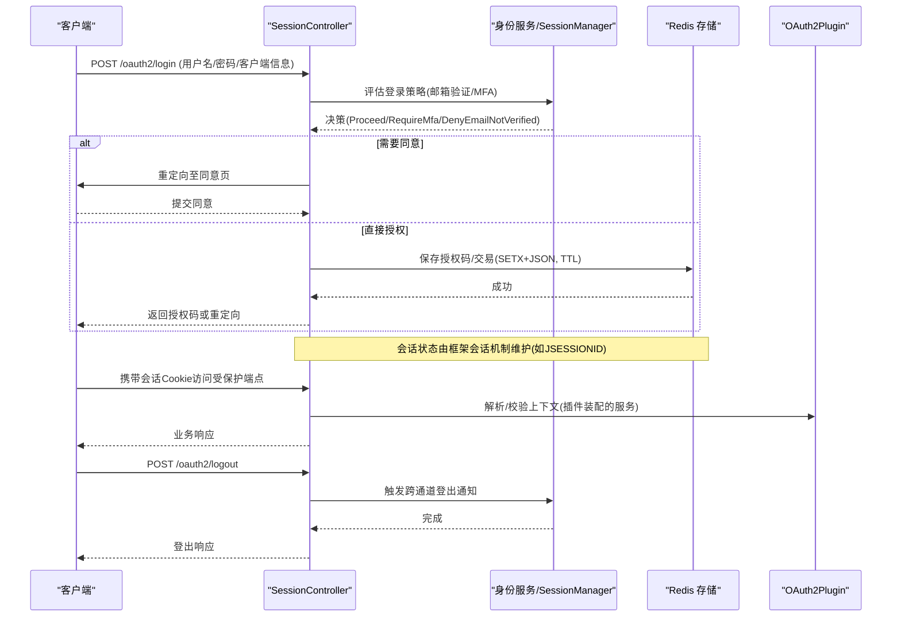
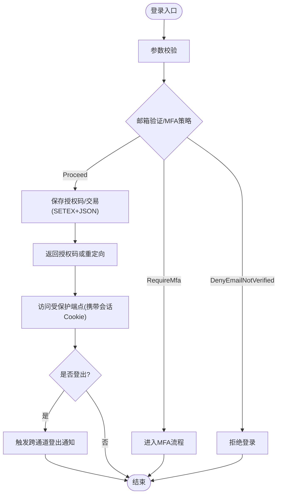
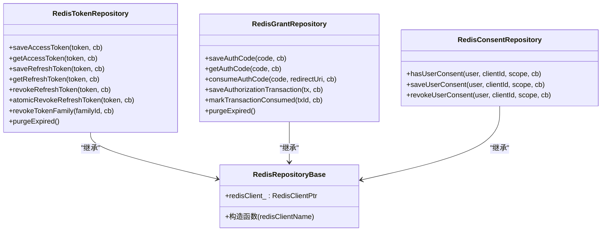
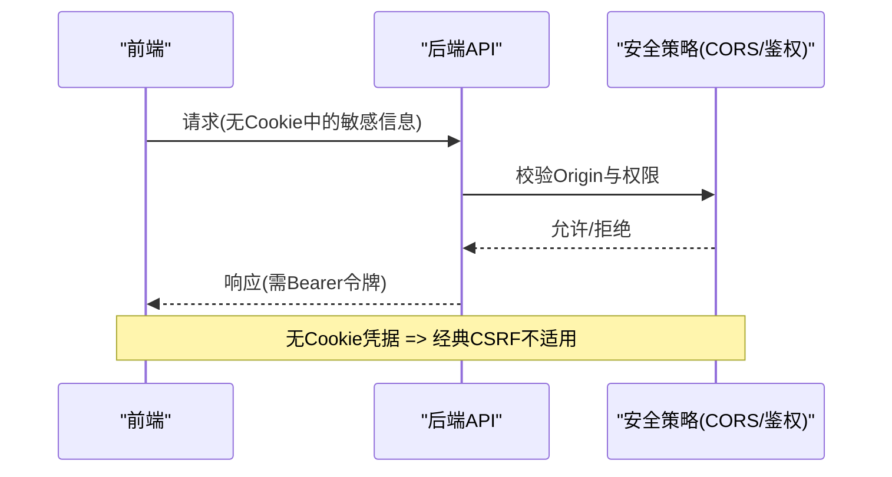
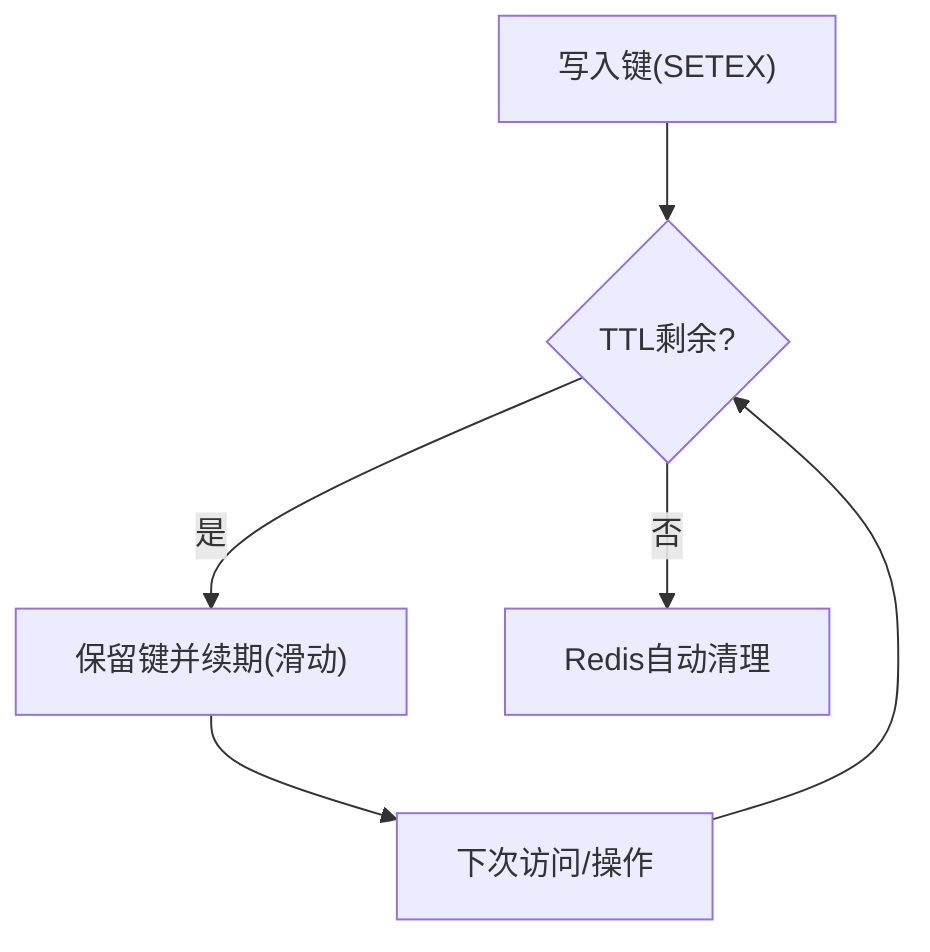
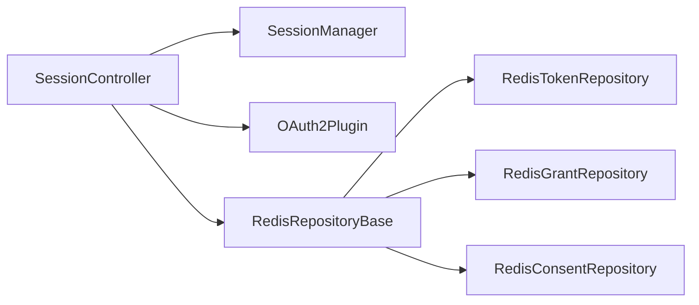

# 会话管理

<cite>
**本文引用的文件**
- [SessionController.h](file://libs/drogon/include/authforge/drogon/controllers/SessionController.h)
- [SessionController.cc](file://libs/drogon/src/controllers/SessionController.cc)
- [SessionManager.h](file://libs/identity/include/authforge/identity/SessionManager.h)
- [SessionManager.cc](file://libs/identity/src/session/SessionManager.cc)
- [RedisRepositoryBase.h](file://libs/storage-redis/include/authforge/storage/redis/RedisRepositoryBase.h)
- [RedisRepositoryBase.cc](file://libs/storage-redis/include/authforge/storage/redis/RedisRepositoryBase.cc)
- [RedisTokenRepository.h](file://libs/storage-redis/include/authforge/storage/redis/RedisTokenRepository.h)
- [RedisTokenRepository.cc](file://libs/storage-redis/src/RedisTokenRepository.cc)
- [RedisGrantRepository.h](file://libs/storage-redis/include/authforge/storage/redis/RedisGrantRepository.h)
- [RedisGrantRepository.cc](file://libs/storage-redis/src/RedisGrantRepository.cc)
- [OAuth2Plugin.cc](file://libs/drogon/src/plugin/OAuth2Plugin.cc)
- [configuration-guide.md](file://docs/backend/configuration-guide.md)
- [security.spec.ts](file://frontends/admin/tests/e2e/security.spec.ts)
- [test-cases.md](file://docs/admin/test-cases.md)
- [AuthorizePkcePassthroughIntegrationTest.cc](file://tests/integration/auth/AuthorizePkcePassthroughIntegrationTest.cc)
- [_build-test.yml](file://.github/workflows/_build-test.yml)
- [TokenExpiryTtlConfigTest.cc](file://tests/integration/token/TokenExpiryTtlConfigTest.cc)
</cite>

## 目录
1. [简介](#简介)
2. [项目结构](#项目结构)
3. [核心组件](#核心组件)
4. [架构总览](#架构总览)
5. [详细组件分析](#详细组件分析)
6. [依赖关系分析](#依赖关系分析)
7. [性能考量](#性能考量)
8. [故障排查指南](#故障排查指南)
9. [结论](#结论)
10. [附录](#附录)

## 简介
本文件面向 AuthForge 的“会话管理”能力，围绕会话生命周期（创建、验证、更新、销毁）、存储机制（Redis 策略与数据结构）、安全特性（会话 ID 生成、防重放、会话固定防护、CSRF 防护）、过期策略（绝对过期、滑动过期、空闲超时）以及配置选项、监控调试与故障排查进行系统化说明。文档以代码为依据，提供可追溯的文件来源与图示，帮助读者从高层到代码层全面理解实现。

## 项目结构
与会话管理直接相关的代码分布在以下层次：
- 控制器层：SessionController 暴露登录、同意、登出等 HTTP 端点，并集成身份服务与会话管理器。
- 身份层：SessionManager 负责登录策略评估与跨通道登出通知。
- 存储层：Redis 仓库基类与各具体仓库（令牌、授权码、同意记录）负责持久化与 TTL 管理。
- 插件层：OAuth2Plugin 统一装配服务与存储后端，并在关闭时释放资源。
- 前端与安全测试：通过 E2E 用例验证 CSRF 防护与 Bearer 方案。

图表来源
- [SessionController.h:32-69](file://libs/drogon/include/authforge/drogon/controllers/SessionController.h#L32-L69)
- [SessionManager.h:115-131](file://libs/identity/include/authforge/identity/SessionManager.h#L115-L131)
- [RedisRepositoryBase.h:28-55](file://libs/storage-redis/include/authforge/storage/redis/RedisRepositoryBase.h#L28-L55)
- [RedisTokenRepository.h:67-98](file://libs/storage-redis/include/authforge/storage/redis/RedisTokenRepository.h#L67-L98)
- [RedisGrantRepository.h:28-58](file://libs/storage-redis/include/authforge/storage/redis/RedisGrantRepository.h#L28-L58)

章节来源
- [SessionController.h:32-69](file://libs/drogon/include/authforge/drogon/controllers/SessionController.h#L32-L69)
- [SessionController.cc:1-200](file://libs/drogon/src/controllers/SessionController.cc#L1-L200)
- [SessionManager.h:115-131](file://libs/identity/include/authforge/identity/SessionManager.h#L115-L131)
- [SessionManager.cc:1-51](file://libs/identity/src/session/SessionManager.cc#L1-L51)
- [RedisRepositoryBase.h:28-55](file://libs/storage-redis/include/authforge/storage/redis/RedisRepositoryBase.h#L28-L55)
- [RedisRepositoryBase.cc:1-21](file://libs/storage-redis/include/authforge/storage/redis/RedisRepositoryBase.cc#L1-L21)

## 核心组件
- SessionController：定义 /login、/oauth2/login、/oauth2/consent、/oauth2/logout、/api/register 等端点；支持注入 identity 服务与会话管理器，并提供回退路径兼容旧实现。
- SessionManager：封装登录策略评估（邮箱验证、MFA）与跨通道登出通知调用。
- Redis 存储基类与各仓库：提供 Redis 连接初始化、超时设置、原子脚本执行、TTL 管理；令牌与授权码采用 SETEX + JSON 序列化，利用 Redis 原生 TTL 自动清理。
- OAuth2Plugin：集中管理服务与存储对象生命周期，在停止时释放引用，保证回调完成后再析构。

章节来源
- [SessionController.h:32-100](file://libs/drogon/include/authforge/drogon/controllers/SessionController.h#L32-L100)
- [SessionManager.cc:12-48](file://libs/identity/src/session/SessionManager.cc#L12-L48)
- [RedisRepositoryBase.cc:7-19](file://libs/storage-redis/include/authforge/storage/redis/RedisRepositoryBase.cc#L7-L19)
- [OAuth2Plugin.cc:337-361](file://libs/drogon/src/plugin/OAuth2Plugin.cc#L337-L361)

## 架构总览
下图展示一次典型登录与会话建立流程：客户端向 /oauth2/login 提交凭证，控制器校验参数后调用身份服务进行认证，成功后进入同意流程或返回授权码；后续请求携带会话标识（如 JSESSIONID）访问受保护端点；登出时触发跨通道注销通知。

图表来源
- [SessionController.h:58-69](file://libs/drogon/include/authforge/drogon/controllers/SessionController.h#L58-L69)
- [SessionManager.cc:12-48](file://libs/identity/src/session/SessionManager.cc#L12-L48)
- [RedisGrantRepository.cc:184-209](file://libs/storage-redis/src/RedisGrantRepository.cc#L184-L209)
- [OAuth2Plugin.cc:337-361](file://libs/drogon/src/plugin/OAuth2Plugin.cc#L337-L361)

## 详细组件分析

### 会话生命周期管理
- 会话创建
  - 入口：/oauth2/login（POST）。控制器接收用户名、密码、client_id、redirect_uri、scope、state 等参数，并进行校验。
  - 策略评估：调用 SessionManager::evaluateLoginPolicy，依据邮箱验证与 MFA 策略决定 Proceed/RequireMfa/DenyEmailNotVerified。
  - 授权码/交易：若需授权，保存授权码或授权交易至 Redis，使用 JSON 序列化与 SETEX 设置 TTL，确保过期自动清理。
  - 会话标识：测试中可见使用 JSESSIONID Cookie 维持会话，后续请求携带该 Cookie 访问受保护端点。
- 会话验证
  - 受保护端点（如 /oauth2/logout）通过过滤器要求认证；未认证将返回 401。
  - 令牌验证由 TokenService 提供 validateAccessToken/introspectToken/revokeAccessToken 等方法，结合存储层检查是否过期或被撤销。
- 会话更新
  - 滑动过期：令牌与授权码使用 SETEX 设置 TTL，每次操作可刷新 TTL（例如消费授权码时保留原 TTL），体现滑动过期语义。
  - 空闲超时：通过 TTL 控制键的生命周期，空闲时间超过 TTL 即失效。
- 会话销毁
  - 登出：/oauth2/logout 触发 SessionManager::logout，调用跨通道登出通知器通知相关方；随后返回响应。
  - 清理：Redis 侧依赖 TTL 自动清理，purgeExpired 为 no-op。

图表来源
- [SessionController.h:58-69](file://libs/drogon/include/authforge/drogon/controllers/SessionController.h#L58-L69)
- [SessionManager.cc:12-48](file://libs/identity/src/session/SessionManager.cc#L12-L48)
- [RedisGrantRepository.cc:184-209](file://libs/storage-redis/src/RedisGrantRepository.cc#L184-L209)
- [AuthorizePkcePassthroughIntegrationTest.cc:132-170](file://tests/integration/auth/AuthorizePkcePassthroughIntegrationTest.cc#L132-L170)

章节来源
- [SessionController.h:58-69](file://libs/drogon/include/authforge/drogon/controllers/SessionController.h#L58-L69)
- [SessionController.cc:1-200](file://libs/drogon/src/controllers/SessionController.cc#L1-L200)
- [SessionManager.cc:12-48](file://libs/identity/src/session/SessionManager.cc#L12-L48)
- [AuthorizePkcePassthroughIntegrationTest.cc:132-170](file://tests/integration/auth/AuthorizePkcePassthroughIntegrationTest.cc#L132-L170)

### 会话存储机制（Redis）
- 存储后端选择
  - 生产推荐 Postgres；Redis 模式已弃用，仅用于向后兼容，且会拒绝 refresh_token 授权类型。
- 数据结构与序列化
  - 授权码/交易：JSON 字符串作为值，键名包含业务标识（如 oauth2:code:...），使用 SETEX 设置 TTL。
  - 令牌：访问/刷新令牌同样以 JSON 形式存储，使用 SETEX 管理 TTL；撤销标记通过字段更新并保留短期 TTL。
  - 同意记录：按用户、客户端、作用域组合键，SETEX 设置 30 天 TTL。
- 原子性与一致性
  - 授权码消费使用 Lua 脚本实现“读取-校验-标记-写回”的原子 CAS 语义，防止重复消费。
  - 令牌撤销采用 GET 后条件更新，避免并发竞态导致的状态不一致。
- 清理策略
  - 依赖 Redis 原生 TTL 自动清理；purgeExpired 为 no-op。

图表来源
- [RedisRepositoryBase.h:28-55](file://libs/storage-redis/include/authforge/storage/redis/RedisRepositoryBase.h#L28-L55)
- [RedisTokenRepository.h:67-98](file://libs/storage-redis/include/authforge/storage/redis/RedisTokenRepository.h#L67-L98)
- [RedisGrantRepository.h:28-58](file://libs/storage-redis/include/authforge/storage/redis/RedisGrantRepository.h#L28-L58)

章节来源
- [configuration-guide.md:59-77](file://docs/backend/configuration-guide.md#L59-L77)
- [RedisRepositoryBase.cc:7-19](file://libs/storage-redis/include/authforge/storage/redis/RedisRepositoryBase.cc#L7-L19)
- [RedisGrantRepository.cc:184-209](file://libs/storage-redis/src/RedisGrantRepository.cc#L184-L209)
- [RedisTokenRepository.cc:386-428](file://libs/storage-redis/src/RedisTokenRepository.cc#L386-L428)

### 会话安全特性
- 会话 ID 生成与传递
  - 测试显示使用 JSESSIONID Cookie 维持会话；后续请求携带该 Cookie 访问受保护端点。
- 防重放攻击
  - 授权码消费使用 Lua 脚本原子标记 consumed，防止同一 code 被多次兑换。
- 会话固定攻击防护
  - 登录成功后应更换会话标识（框架层面行为），避免攻击者预置会话 ID；测试通过携带新会话 Cookie 访问授权端点验证流程。
- CSRF 防护
  - 采用 Bearer 令牌架构，认证凭据不存储在 Cookie 中，天然免疫传统 CSRF；后端通过严格 CORS 白名单限制跨域。
  - 前端 E2E 断言无 auth cookie，API 请求携带 Authorization: Bearer ... 头。

图表来源
- [AuthorizePkcePassthroughIntegrationTest.cc:132-170](file://tests/integration/auth/AuthorizePkcePassthroughIntegrationTest.cc#L132-L170)
- [security.spec.ts:120-144](file://frontends/admin/tests/e2e/security.spec.ts#L120-L144)
- [test-cases.md:247-263](file://docs/admin/test-cases.md#L247-L263)

章节来源
- [AuthorizePkcePassthroughIntegrationTest.cc:132-170](file://tests/integration/auth/AuthorizePkcePassthroughIntegrationTest.cc#L132-L170)
- [security.spec.ts:120-144](file://frontends/admin/tests/e2e/security.spec.ts#L120-L144)
- [test-cases.md:247-263](file://docs/admin/test-cases.md#L247-L263)

### 会话过期策略
- 绝对过期时间
  - 令牌与授权码通过 SETEX 设置绝对过期时间；Redis 到期自动删除。
- 滑动过期时间
  - 消费授权码时保留原 TTL（SETEX key ttl value），体现滑动过期语义。
- 空闲超时处理
  - 基于 TTL 的空闲超时：若在 TTL 内无活动，键将被 Redis 清理。
- 配置影响
  - 令牌 TTL 来自配置；测试断言 expires_in 与实际配置一致，避免硬编码导致的客户端误判。

图表来源
- [RedisGrantRepository.cc:184-209](file://libs/storage-redis/src/RedisGrantRepository.cc#L184-L209)
- [RedisTokenRepository.cc:386-428](file://libs/storage-redis/src/RedisTokenRepository.cc#L386-L428)
- [TokenExpiryTtlConfigTest.cc:1-23](file://tests/integration/token/TokenExpiryTtlConfigTest.cc#L1-L23)

章节来源
- [RedisGrantRepository.cc:184-209](file://libs/storage-redis/src/RedisGrantRepository.cc#L184-L209)
- [RedisTokenRepository.cc:386-428](file://libs/storage-redis/src/RedisTokenRepository.cc#L386-L428)
- [TokenExpiryTtlConfigTest.cc:1-23](file://tests/integration/token/TokenExpiryTtlConfigTest.cc#L1-L23)

### 会话配置选项
- 存储后端选择
  - storage_type：postgres（生产推荐）、redis（已弃用）、memory（仅测试）。
- 过期时间设置
  - tokens.access_token_ttl、tokens.refresh_token_ttl 等配置项驱动令牌 TTL；测试断言响应中的 expires_in 与配置一致。
- 安全参数配置
  - CORS 白名单、Origin 校验（后端严格匹配，禁止通配符）；前端不将凭据存入 Cookie，使用 Bearer 令牌。
- Redis 连接与超时
  - RedisRepositoryBase 初始化时获取 RedisClient 并设置超时（3.0s），失败时记录错误日志。

章节来源
- [configuration-guide.md:59-77](file://docs/backend/configuration-guide.md#L59-L77)
- [RedisRepositoryBase.cc:7-19](file://libs/storage-redis/include/authforge/storage/redis/RedisRepositoryBase.cc#L7-L19)
- [test-cases.md:247-263](file://docs/admin/test-cases.md#L247-L263)
- [TokenExpiryTtlConfigTest.cc:1-23](file://tests/integration/token/TokenExpiryTtlConfigTest.cc#L1-L23)

### 会话监控、调试与故障排查
- 监控与日志
  - Redis 操作失败时记录错误日志（如 revoke/consent/token 操作异常）。
  - 插件停止时释放资源，便于定位生命周期问题。
- CI 环境准备
  - 测试前等待 Redis 就绪（ping PONG），否则输出错误并中止，便于快速发现环境问题。
- 常见问题定位
  - 若授权码无法消费：检查 Lua 脚本执行结果与 TTL 是否有效。
  - 若令牌撤销无效：检查 Redis 键是否存在及撤销逻辑是否命中。
  - 若登出不生效：确认跨通道登出通知器是否可用，以及会话标识是否正确清除。

章节来源
- [RedisTokenRepository.cc:386-428](file://libs/storage-redis/src/RedisTokenRepository.cc#L386-L428)
- [RedisGrantRepository.cc:184-209](file://libs/storage-redis/src/RedisGrantRepository.cc#L184-L209)
- [OAuth2Plugin.cc:337-361](file://libs/drogon/src/plugin/OAuth2Plugin.cc#L337-L361)
- [_build-test.yml:248-282](file://.github/workflows/_build-test.yml#L248-L282)

## 依赖关系分析
- 控制器依赖身份服务与会话管理器，并通过 OAuth2Plugin 获取服务实例；当未注入时使用回退路径。
- 存储层通过 RedisRepositoryBase 统一管理 Redis 客户端与超时；各仓库实现具体业务键与命令。
- 前端通过 Bearer 令牌与 CORS 策略配合后端安全模型，避免 CSRF 风险。

图表来源
- [SessionController.h:32-100](file://libs/drogon/include/authforge/drogon/controllers/SessionController.h#L32-L100)
- [SessionManager.h:115-131](file://libs/identity/include/authforge/identity/SessionManager.h#L115-L131)
- [RedisRepositoryBase.h:28-55](file://libs/storage-redis/include/authforge/storage/redis/RedisRepositoryBase.h#L28-L55)

章节来源
- [SessionController.h:32-100](file://libs/drogon/include/authforge/drogon/controllers/SessionController.h#L32-L100)
- [SessionManager.h:115-131](file://libs/identity/include/authforge/identity/SessionManager.h#L115-L131)
- [RedisRepositoryBase.h:28-55](file://libs/storage-redis/include/authforge/storage/redis/RedisRepositoryBase.h#L28-L55)

## 性能考量
- 使用 Redis 原生 TTL 减少后台清理任务开销。
- 授权码消费使用 Lua 脚本原子操作，降低锁竞争与网络往返。
- 令牌撤销采用条件更新，避免全表扫描与高延迟。
- 合理设置 Redis 超时与连接池，避免阻塞请求。

## 故障排查指南
- 登录失败
  - 检查邮箱验证与 MFA 策略；查看 SessionManager 决策分支。
- 授权码无效
  - 检查 Redis 键是否存在、是否已被消费（Lua 脚本返回值）；确认 redirect_uri 匹配。
- 令牌撤销不生效
  - 检查 Redis 键是否存在；确认撤销逻辑是否命中；关注错误日志。
- 登出不生效
  - 检查跨通道登出通知器是否可用；确认会话标识是否清除。
- 环境就绪
  - 确认 Redis 服务可达（CI 中 ping PONG）；检查连接超时与错误日志。

章节来源
- [SessionManager.cc:12-48](file://libs/identity/src/session/SessionManager.cc#L12-L48)
- [RedisGrantRepository.cc:184-209](file://libs/storage-redis/src/RedisGrantRepository.cc#L184-L209)
- [RedisTokenRepository.cc:386-428](file://libs/storage-redis/src/RedisTokenRepository.cc#L386-L428)
- [_build-test.yml:248-282](file://.github/workflows/_build-test.yml#L248-L282)

## 结论
AuthForge 的会话管理以控制器层为核心，结合身份策略评估与 Redis 存储，实现了完整的会话生命周期与安全的令牌管理。通过 SETEX + JSON 序列化与 Lua 脚本原子操作，系统在并发与过期管理方面具备良好的一致性与性能。安全方面采用 Bearer 令牌与严格 CORS 策略，有效防范 CSRF 等传统威胁。建议在生产环境中优先使用 Postgres 作为主存储，并将 Redis 作为缓存层引入，以获得更稳健的扩展性与可靠性。

## 附录
- 关键端点
  - POST /oauth2/login：登录并生成授权码或重定向。
  - POST /oauth2/logout：登出并触发跨通道注销通知。
  - GET /oauth2/authorize：授权端点（需会话）。
- 关键配置
  - storage_type：选择存储后端。
  - tokens.*_ttl：令牌 TTL 配置。
  - CORS/Origin：严格白名单，禁止通配符。
- 参考测试
  - 会话 Cookie 与授权流程：AuthorizePkcePassthroughIntegrationTest.cc。
  - CSRF 防护与 Bearer 方案：security.spec.ts、test-cases.md。
  - 令牌 TTL 与配置一致性：TokenExpiryTtlConfigTest.cc。