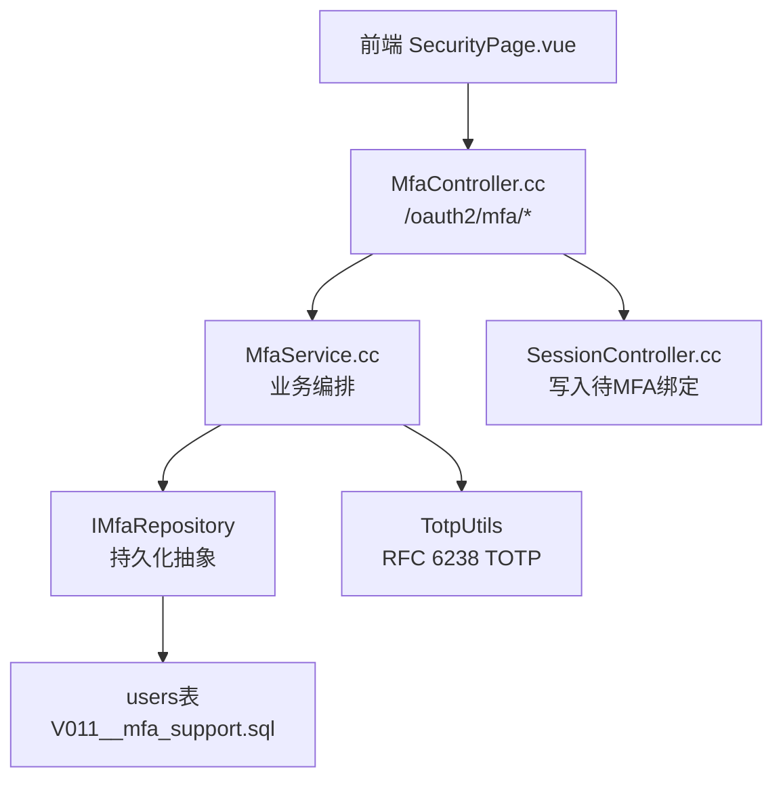
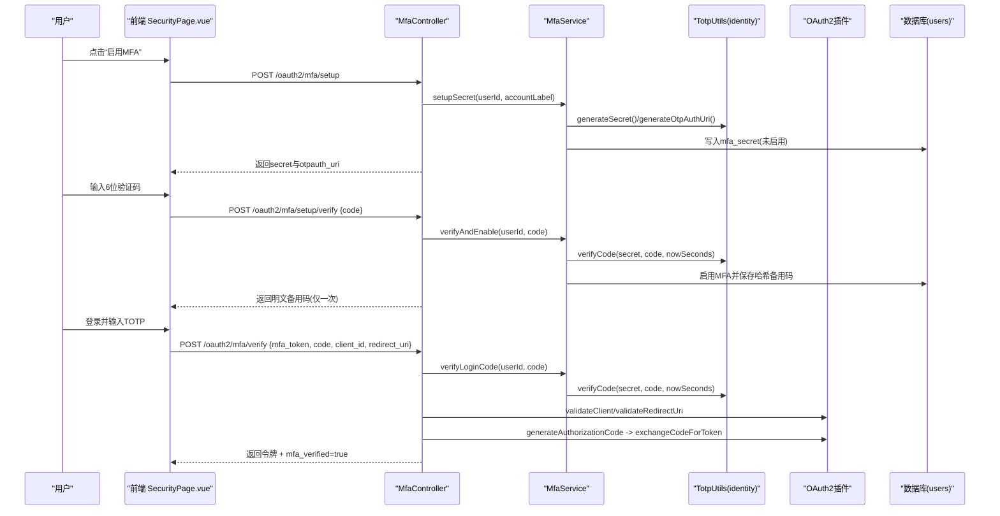
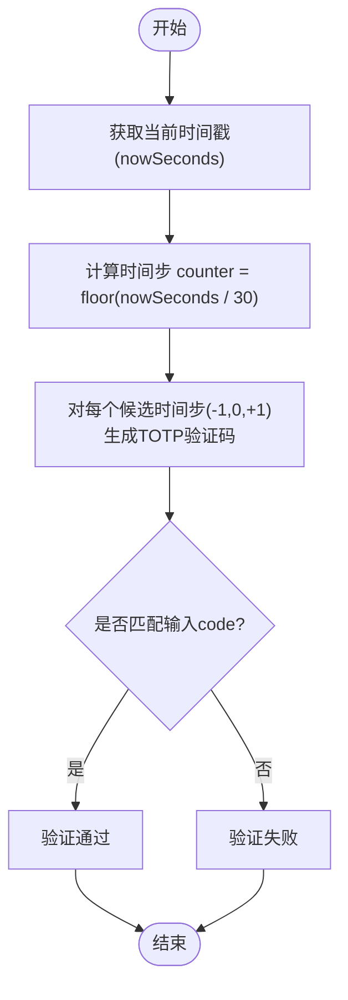
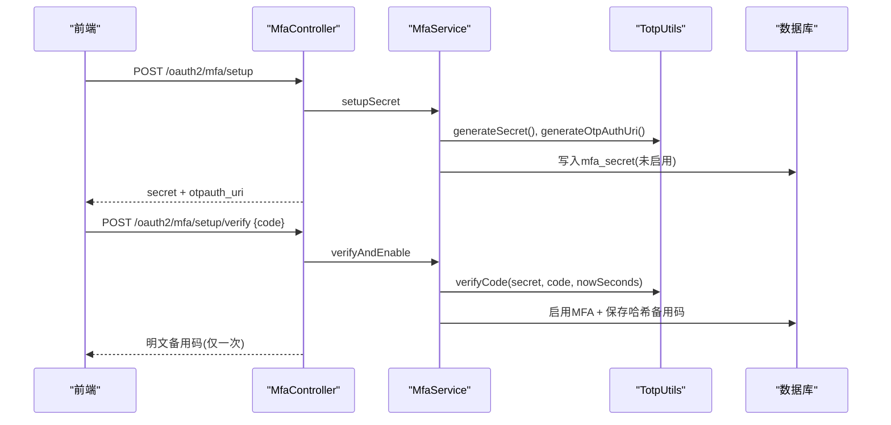
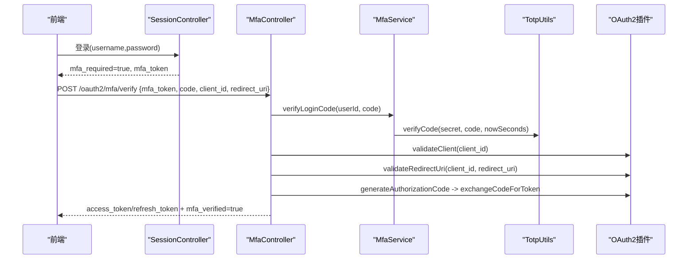
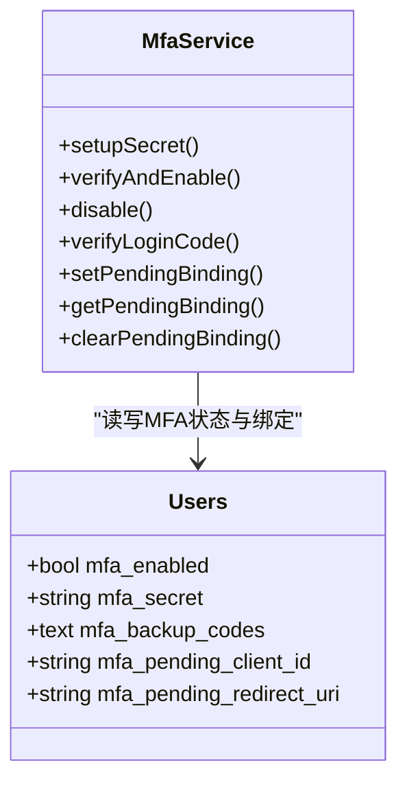
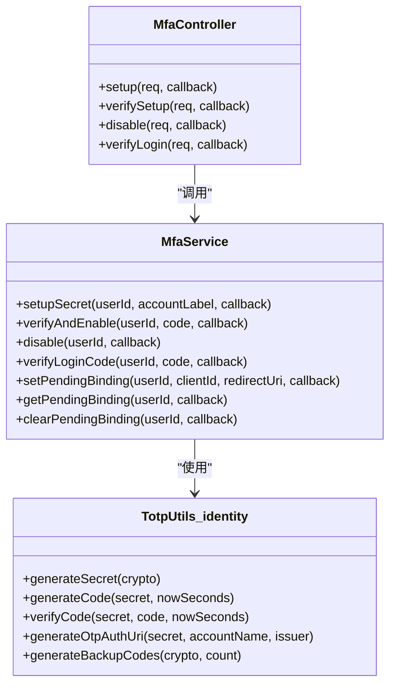
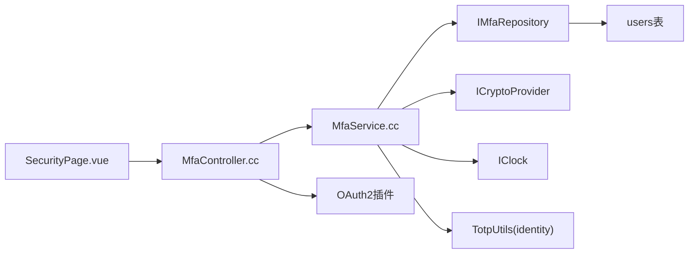

# 多因素认证(MFA)

<cite>
**本文引用的文件**
- [MfaService.h](file://libs/identity/include/authforge/identity/MfaService.h)
- [MfaService.cc](file://libs/identity/src/mfa/MfaService.cc)
- [TotpUtils.h（drogon层）](file://libs/drogon/include/authforge/drogon/utils/TotpUtils.h)
- [TotpUtils.h（identity层）](file://libs/identity/include/authforge/identity/TotpUtils.h)
- [MfaController.cc](file://libs/drogon/src/controllers/MfaController.cc)
- [SessionController.cc](file://libs/drogon/src/controllers/SessionController.cc)
- [V011__mfa_support.sql](file://apps/server/migrations/V011__mfa_support.sql)
- [openapi.json](file://apps/server/docs/api/openapi.json)
- [SecurityPage.vue](file://frontends/user/src/pages/account/SecurityPage.vue)
- [MfaEndpointHttpTest.cc](file://tests/integration/controllers/MfaEndpointHttpTest.cc)
- [Property1_MfaCrossClientAuthFix_ExploratoryTest.cc](file://tests/integration/auth/Property1_MfaCrossClientAuthFix_ExploratoryTest.cc)
- [MfaCrossClientAuthFix_IntegrationTest.cc](file://tests/integration/auth/MfaCrossClientAuthFix_IntegrationTest.cc)
</cite>

## 目录
1. [简介](#简介)
2. [项目结构](#项目结构)
3. [核心组件](#核心组件)
4. [架构总览](#架构总览)
5. [详细组件分析](#详细组件分析)
6. [依赖关系分析](#依赖关系分析)
7. [性能与安全配置](#性能与安全配置)
8. [故障排除指南](#故障排除指南)
9. [结论](#结论)

## 简介
本文件面向AuthForge的多因素认证（MFA），聚焦TOTP双因素认证的完整实现与使用。内容涵盖：
- TOTP算法遵循RFC 6238、时间步长与时间同步机制、验证码生成与校验
- MFA配置流程：初始设置、备用代码生成、用户引导
- MFA验证流程：登录时验证码输入、时间窗口校验、失败处理
- MFA状态管理：用户MFA开关、设备绑定与会话绑定、恢复机制
- 安全配置建议：时间偏移容忍度、验证码长度、重试限制
- 故障排除：时间同步问题、设备丢失、紧急访问方案

## 项目结构
MFA相关能力横跨身份服务、控制器、前端页面与数据库迁移：
- 身份服务层：MfaService封装MFA业务逻辑，解耦持久化、加密与时钟
- 控制器层：MfaController暴露HTTP接口，编排登录时的MFA校验与令牌发放
- 会话控制：SessionController在密码登录后写入“待MFA校验”的绑定信息
- 工具层：TotpUtils提供TOTP密钥、验证码、URI与备用码生成
- 前端：SecurityPage提供启用/禁用MFA、扫码与验证入口
- 数据层：users表扩展字段存储MFA状态、密钥与备用码

图表来源
- [MfaController.cc:92-190](file://libs/drogon/src/controllers/MfaController.cc#L92-L190)
- [MfaService.cc:21-103](file://libs/identity/src/mfa/MfaService.cc#L21-L103)
- [TotpUtils.h（identity层）:31-78](file://libs/identity/include/authforge/identity/TotpUtils.h#L31-L78)
- [SessionController.cc:536-562](file://libs/drogon/src/controllers/SessionController.cc#L536-L562)
- [V011__mfa_support.sql:1-7](file://apps/server/migrations/V011__mfa_support.sql#L1-L7)

章节来源
- [MfaController.cc:92-190](file://libs/drogon/src/controllers/MfaController.cc#L92-L190)
- [MfaService.cc:21-103](file://libs/identity/src/mfa/MfaService.cc#L21-L103)
- [TotpUtils.h（identity层）:31-78](file://libs/identity/include/authforge/identity/TotpUtils.h#L31-L78)
- [SessionController.cc:536-562](file://libs/drogon/src/controllers/SessionController.cc#L536-L562)
- [V011__mfa_support.sql:1-7](file://apps/server/migrations/V011__mfa_support.sql#L1-L7)

## 核心组件
- MfaService：负责MFA生命周期（生成密钥、启用MFA并签发备用码、禁用、登录时校验、客户端绑定记录与清理）。通过注入仓库、加密提供者与时钟，保证可测试性与框架无关性。
- TotpUtils（identity层）：实现RFC 6238 TOTP（HMAC-SHA1、30秒时间步长、6位验证码）、动态截断、otpauth URI生成、备用码生成；支持显式时间参数以便确定性测试。
- TotpUtils（drogon层）：兼容现有API，封装常用方法（生成密钥、验证码、校验、URI、备用码）。
- MfaController：对外暴露MFA相关HTTP端点，编排登录时TOTP校验、客户端/重定向地址校验、授权码生成与令牌交换，并审计日志。
- SessionController：在密码认证成功且用户启用了MFA时，将当前client_id与redirect_uri写入“待MFA绑定”，用于后续二次校验防串用。
- 数据库迁移：users表新增mfa_enabled、mfa_secret、mfa_backup_codes等字段，支撑MFA状态与凭证存储。

章节来源
- [MfaService.h:47-161](file://libs/identity/include/authforge/identity/MfaService.h#L47-L161)
- [MfaService.cc:21-186](file://libs/identity/src/mfa/MfaService.cc#L21-L186)
- [TotpUtils.h（identity层）:31-78](file://libs/identity/include/authforge/identity/TotpUtils.h#L31-L78)
- [TotpUtils.h（drogon层）:9-61](file://libs/drogon/include/authforge/drogon/utils/TotpUtils.h#L9-L61)
- [MfaController.cc:92-190](file://libs/drogon/src/controllers/MfaController.cc#L92-L190)
- [SessionController.cc:536-562](file://libs/drogon/src/controllers/SessionController.cc#L536-L562)
- [V011__mfa_support.sql:1-7](file://apps/server/migrations/V011__mfa_support.sql#L1-L7)

## 架构总览
下图展示从前端到后端的核心调用链：用户在前端启用MFA或登录时提交TOTP，控制器解析请求并调用服务层进行校验，必要时与OAuth2插件交互颁发令牌，最终返回结果。

图表来源
- [MfaController.cc:92-190](file://libs/drogon/src/controllers/MfaController.cc#L92-L190)
- [MfaController.cc:192-376](file://libs/drogon/src/controllers/MfaController.cc#L192-L376)
- [MfaController.cc:460-681](file://libs/drogon/src/controllers/MfaController.cc#L460-L681)
- [MfaService.cc:21-103](file://libs/identity/src/mfa/MfaService.cc#L21-L103)
- [MfaService.cc:115-138](file://libs/identity/src/mfa/MfaService.cc#L115-L138)
- [TotpUtils.h（identity层）:31-78](file://libs/identity/include/authforge/identity/TotpUtils.h#L31-L78)

## 详细组件分析

### TOTP算法与时间同步
- 标准遵循：基于RFC 6238，采用HMAC-SHA1、30秒时间步长、6位验证码，并使用RFC 4226的动态截断。
- 时间同步：校验允许±1个时间步（即前后各一个30秒窗口），以容忍客户端与服务器的时钟偏差。
- 可测试性：identity层TOTP函数接受显式nowSeconds参数，便于单元测试固定时间。

图表来源
- [TotpUtils.h（identity层）:47-54](file://libs/identity/include/authforge/identity/TotpUtils.h#L47-L54)
- [MfaService.cc:115-138](file://libs/identity/src/mfa/MfaService.cc#L115-L138)

章节来源
- [TotpUtils.h（identity层）:31-78](file://libs/identity/include/authforge/identity/TotpUtils.h#L31-L78)
- [MfaService.cc:115-138](file://libs/identity/src/mfa/MfaService.cc#L115-L138)

### MFA配置流程（初始设置、备用码、用户引导）
- 初始设置：调用setup接口生成随机密钥与otpauth:// URI，前端引导用户用认证器App扫描QR码。
- 验证启用：用户输入6位验证码，服务端校验通过后启用MFA，并一次性返回明文备用码（同时保存其哈希值）。
- 用户引导：前端SecurityPage提供“启用MFA”、“验证并启用”、“禁用MFA”等操作入口。

图表来源
- [MfaController.cc:92-190](file://libs/drogon/src/controllers/MfaController.cc#L92-L190)
- [MfaController.cc:192-376](file://libs/drogon/src/controllers/MfaController.cc#L192-L376)
- [MfaService.cc:21-103](file://libs/identity/src/mfa/MfaService.cc#L21-L103)
- [SecurityPage.vue:205-253](file://frontends/user/src/pages/account/SecurityPage.vue#L205-L253)

章节来源
- [MfaController.cc:92-190](file://libs/drogon/src/controllers/MfaController.cc#L92-L190)
- [MfaController.cc:192-376](file://libs/drogon/src/controllers/MfaController.cc#L192-L376)
- [MfaService.cc:21-103](file://libs/identity/src/mfa/MfaService.cc#L21-L103)
- [SecurityPage.vue:205-253](file://frontends/user/src/pages/account/SecurityPage.vue#L205-L253)

### MFA验证流程（登录时TOTP校验、时间窗口、失败处理）
- 触发时机：密码认证成功后，若用户启用MFA，则返回mfa_token并要求二次校验。
- 校验过程：读取用户mfa_secret，按±1时间步校验TOTP；随后校验client_id与redirect_uri是否与登录时绑定的会话一致。
- 失败处理：错误统一返回AUTH_INVALID_CREDENTIALS或VALIDATION_MISSING_REQUIRED_FIELD；审计日志记录失败原因。

图表来源
- [SessionController.cc:536-562](file://libs/drogon/src/controllers/SessionController.cc#L536-L562)
- [MfaController.cc:460-681](file://libs/drogon/src/controllers/MfaController.cc#L460-L681)
- [MfaService.cc:115-138](file://libs/identity/src/mfa/MfaService.cc#L115-L138)

章节来源
- [SessionController.cc:536-562](file://libs/drogon/src/controllers/SessionController.cc#L536-L562)
- [MfaController.cc:460-681](file://libs/drogon/src/controllers/MfaController.cc#L460-L681)
- [MfaService.cc:115-138](file://libs/identity/src/mfa/MfaService.cc#L115-L138)

### MFA状态管理与设备绑定
- 用户状态：users表包含mfa_enabled、mfa_secret、mfa_backup_codes等字段，标识是否启用MFA及密钥与备用码。
- 设备/会话绑定：登录成功后，若需要MFA，会记录当前client_id与redirect_uri为“待MFA绑定”，防止跨客户端混淆。
- 恢复机制：MFA启用后提供一次性备用码；若设备丢失，可通过备用码完成登录（由上层登录流程决定具体策略）。

图表来源
- [V011__mfa_support.sql:1-7](file://apps/server/migrations/V011__mfa_support.sql#L1-L7)
- [MfaService.h:131-154](file://libs/identity/include/authforge/identity/MfaService.h#L131-L154)
- [MfaService.cc:140-183](file://libs/identity/src/mfa/MfaService.cc#L140-L183)

章节来源
- [V011__mfa_support.sql:1-7](file://apps/server/migrations/V011__mfa_support.sql#L1-L7)
- [MfaService.h:131-154](file://libs/identity/include/authforge/identity/MfaService.h#L131-L154)
- [MfaService.cc:140-183](file://libs/identity/src/mfa/MfaService.cc#L140-L183)

### 关键类与方法概览
- MfaService：封装MFA核心业务，包括设置、启用、禁用、登录校验、绑定管理等。
- TotpUtils（identity层）：提供TOTP密钥、验证码、校验、URI与备用码生成，严格遵循RFC 6238。
- MfaController：HTTP端点编排，确保登录时TOTP校验、客户端与重定向地址校验、令牌发放。

图表来源
- [MfaService.h:72-161](file://libs/identity/include/authforge/identity/MfaService.h#L72-L161)
- [TotpUtils.h（identity层）:31-78](file://libs/identity/include/authforge/identity/TotpUtils.h#L31-L78)
- [MfaController.cc:92-190](file://libs/drogon/src/controllers/MfaController.cc#L92-L190)

章节来源
- [MfaService.h:72-161](file://libs/identity/include/authforge/identity/MfaService.h#L72-L161)
- [TotpUtils.h（identity层）:31-78](file://libs/identity/include/authforge/identity/TotpUtils.h#L31-L78)
- [MfaController.cc:92-190](file://libs/drogon/src/controllers/MfaController.cc#L92-L190)

## 依赖关系分析
- 控制器依赖服务：MfaController通过MfaService协调MFA流程，避免直接操作数据库细节。
- 服务依赖抽象：MfaService通过IMfaRepository、ICryptoProvider、IClock注入，降低耦合，提升可测试性。
- 工具层独立：TOTP算法在identity层实现，不依赖框架类型，便于复用与测试。
- 前端与API：SecurityPage通过HTTP调用MFA接口，体验友好，提示明确。

图表来源
- [MfaController.cc:92-190](file://libs/drogon/src/controllers/MfaController.cc#L92-L190)
- [MfaService.cc:21-103](file://libs/identity/src/mfa/MfaService.cc#L21-L103)
- [TotpUtils.h（identity层）:31-78](file://libs/identity/include/authforge/identity/TotpUtils.h#L31-L78)
- [SecurityPage.vue:205-253](file://frontends/user/src/pages/account/SecurityPage.vue#L205-L253)

章节来源
- [MfaController.cc:92-190](file://libs/drogon/src/controllers/MfaController.cc#L92-L190)
- [MfaService.cc:21-103](file://libs/identity/src/mfa/MfaService.cc#L21-L103)
- [TotpUtils.h（identity层）:31-78](file://libs/identity/include/authforge/identity/TotpUtils.h#L31-L78)
- [SecurityPage.vue:205-253](file://frontends/user/src/pages/account/SecurityPage.vue#L205-L253)

## 性能与安全配置
- 时间偏移容忍度：默认±1个时间步（±30秒），兼顾安全性与用户体验。可根据部署环境调整容忍度（需评估安全风险）。
- 验证码长度：6位数字，符合主流认证器应用约定。
- 备用码数量：默认10个一次性备用码，建议妥善保管并在启用MFA后立即下载保存。
- 重试限制：建议在控制器或服务层增加速率限制与账户锁定策略，防止暴力破解（结合现有账户锁定机制）。
- 审计与监控：所有MFA关键事件（启用、验证成功/失败）均记录审计日志，便于追踪与告警。

章节来源
- [TotpUtils.h（identity层）:47-54](file://libs/identity/include/authforge/identity/TotpUtils.h#L47-L54)
- [MfaController.cc:261-279](file://libs/drogon/src/controllers/MfaController.cc#L261-L279)
- [MfaController.cc:654-667](file://libs/drogon/src/controllers/MfaController.cc#L654-L667)

## 故障排除指南
- 时间同步问题
  - 现象：频繁出现“验证码不正确”。
  - 排查：检查客户端设备时间与服务器时间差；确认认证器App已启用时间同步；必要时调整容忍度。
  - 参考：TOTP校验允许±1时间步。
- 设备丢失
  - 方案：使用备用码登录；如备用码也丢失，请联系管理员重置MFA（通过禁用接口或后台操作）。
  - 注意：备用码仅显示一次，务必妥善保存。
- 跨客户端混淆
  - 现象：在不同客户端间切换导致MFA校验失败。
  - 解决：确保MFA校验请求中的client_id与redirect_uri与登录时一致；系统会在登录时写入待MFA绑定并在校验时比对。
- 紧急访问
  - 方案：通过备用码或管理员重置；在生产环境中应限制此类操作并加强审计。

章节来源
- [MfaController.cc:460-681](file://libs/drogon/src/controllers/MfaController.cc#L460-L681)
- [MfaService.cc:115-138](file://libs/identity/src/mfa/MfaService.cc#L115-L138)
- [Property1_MfaCrossClientAuthFix_ExploratoryTest.cc:154-323](file://tests/integration/auth/Property1_MfaCrossClientAuthFix_ExploratoryTest.cc#L154-L323)
- [MfaCrossClientAuthFix_IntegrationTest.cc:67-118](file://tests/integration/auth/MfaCrossClientAuthFix_IntegrationTest.cc#L67-L118)

## 结论
AuthForge的MFA实现以RFC 6238为基础，采用稳健的时间同步与验证码生成机制，并通过清晰的配置与验证流程保障用户体验与安全。MfaService将业务逻辑与框架解耦，MfaController负责编排与合规校验，配合前端界面形成完整的MFA闭环。建议在生产环境中结合速率限制、账户锁定与审计监控，进一步提升安全性与可观测性。