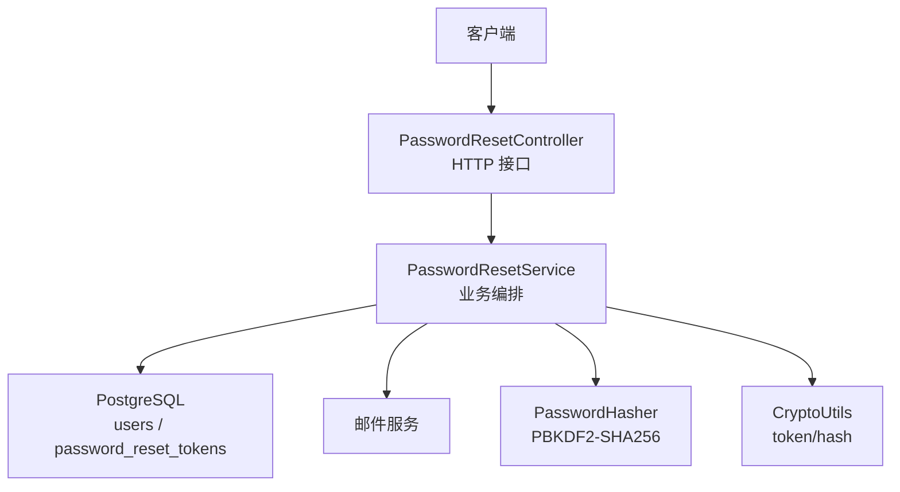
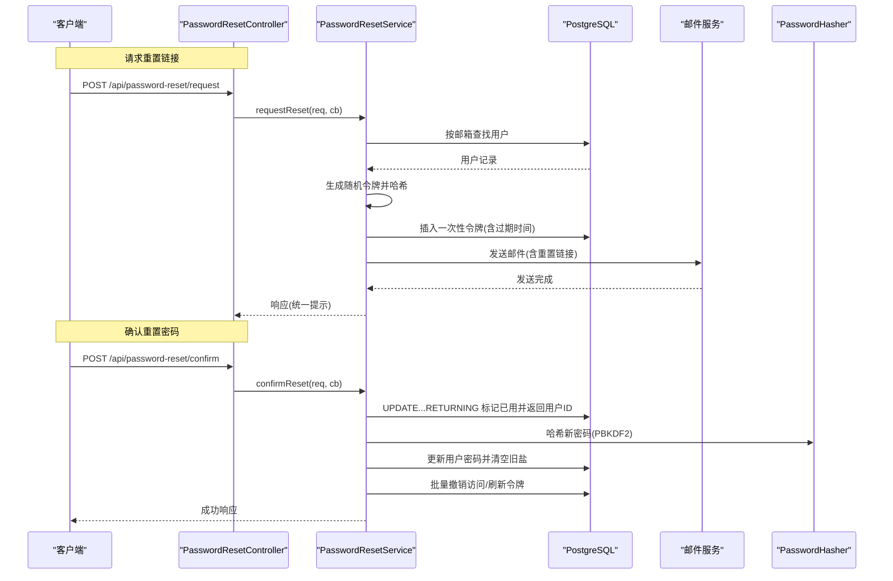
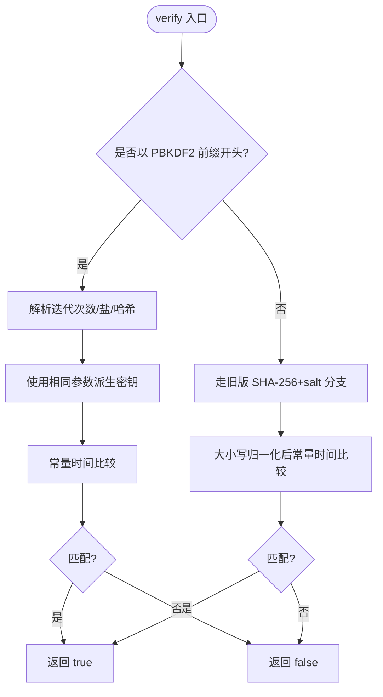
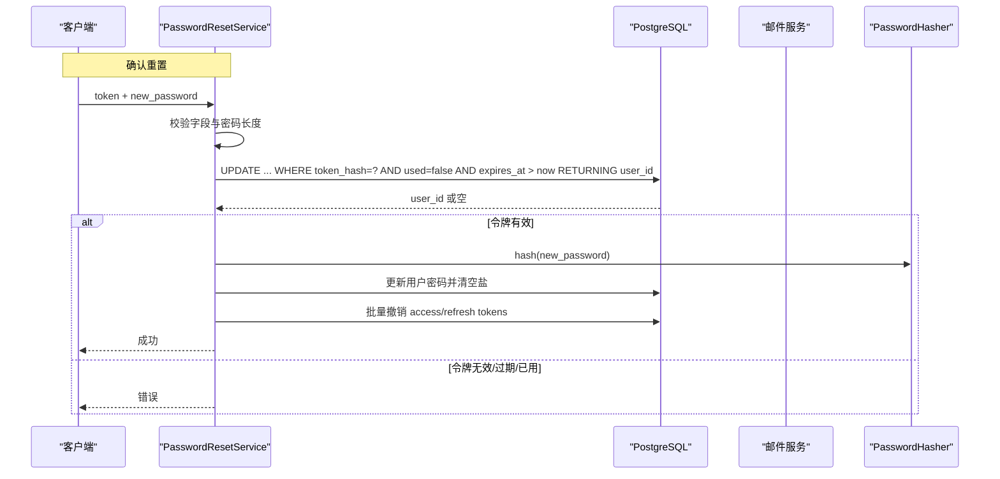
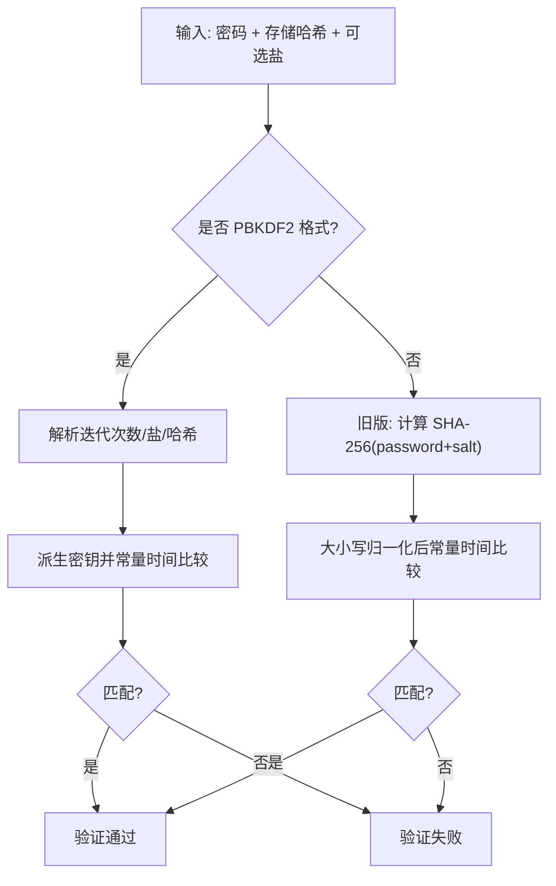
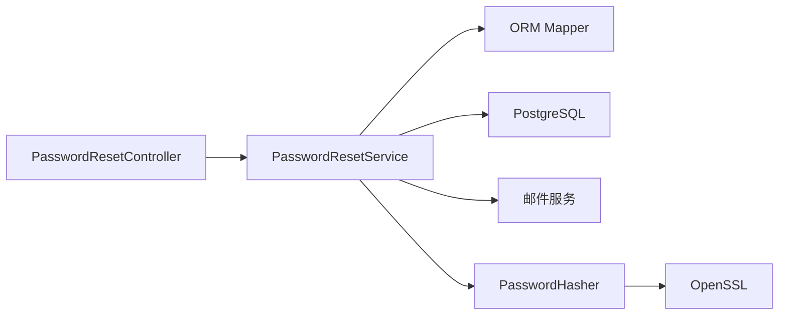

# 密码安全

<cite>
**本文引用的文件**
- [PasswordHasher.h](file://libs/drogon/include/authforge/drogon/utils/PasswordHasher.h)
- [PasswordHasher.cc](file://libs/drogon/src/utils/PasswordHasher.cc)
- [PasswordResetController.h](file://libs/drogon/include/authforge/drogon/controllers/PasswordResetController.h)
- [PasswordResetController.cc](file://libs/drogon/src/controllers/PasswordResetController.cc)
- [PasswordResetService.h](file://libs/drogon/include/authforge/drogon/services/PasswordResetService.h)
- [PasswordResetService.cc](file://libs/drogon/src/services/PasswordResetService.cc)
- [PasswordResetTokens.h](file://libs/storage-postgres/include/authforge/storage/postgres/models/PasswordResetTokens.h)
- [V009__password_reset_tokens.sql](file://apps/server/migrations/V009__password_reset_tokens.sql)
- [config.json](file://apps/server/config/config.json)
- [RuleSet.cc](file://libs/drogon/src/validation/RuleSet.cc)
- [PasswordHasherTest.cc](file://tests/unit/utils/PasswordHasherTest.cc)
- [EmailNormalizerTest.cc](file://tests/unit/utils/EmailNormalizerTest.cc)
- [OpenSslCryptoProviderTest.cc](file://tests/unit/utils/OpenSslCryptoProviderTest.cc)
- [AuthService.cc](file://libs/identity/src/AuthService.cc)
</cite>

## 目录
1. [简介](#简介)
2. [项目结构](#项目结构)
3. [核心组件](#核心组件)
4. [架构总览](#架构总览)
5. [详细组件分析](#详细组件分析)
6. [依赖关系分析](#依赖关系分析)
7. [性能考量](#性能考量)
8. [故障排查指南](#故障排查指南)
9. [结论](#结论)
10. [附录](#附录)

## 简介
本文件聚焦 AuthForge 的密码安全实现，覆盖以下主题：
- 密码哈希算法与参数选择（当前为 PBKDF2-SHA256；设计文档预留 Argon2id 升级路径）
- 密码验证流程（含格式校验、强度检查与安全评估）
- 密码存储机制（盐值生成、哈希计算、数据库存储策略）
- 密码重置功能的安全实现（一次性令牌、过期控制、一次性使用）
- 配置指南与安全最佳实践
- 常见问题与性能优化建议

## 项目结构
与密码安全相关的代码主要分布在以下模块：
- 工具层：密码哈希与通用加密能力
- 服务层：密码重置业务流程编排
- 控制器层：HTTP 接口暴露
- 存储层：密码重置令牌模型与迁移脚本
- 配置与校验：应用配置与输入校验规则

图表来源
- [PasswordResetController.cc:46-64](file://libs/drogon/src/controllers/PasswordResetController.cc#L46-L64)
- [PasswordResetService.cc:64-156](file://libs/drogon/src/services/PasswordResetService.cc#L64-L156)
- [PasswordResetService.cc:158-373](file://libs/drogon/src/services/PasswordResetService.cc#L158-L373)
- [PasswordHasher.cc:51-88](file://libs/drogon/src/utils/PasswordHasher.cc#L51-L88)
- [V009__password_reset_tokens.sql:1-13](file://apps/server/migrations/V009__password_reset_tokens.sql#L1-L13)

章节来源
- [PasswordResetController.h:12-29](file://libs/drogon/include/authforge/drogon/controllers/PasswordResetController.h#L12-L29)
- [PasswordResetController.cc:46-64](file://libs/drogon/src/controllers/PasswordResetController.cc#L46-L64)
- [PasswordResetService.h:22-33](file://libs/drogon/include/authforge/drogon/services/PasswordResetService.h#L22-L33)
- [PasswordResetService.cc:64-156](file://libs/drogon/src/services/PasswordResetService.cc#L64-L156)
- [PasswordResetService.cc:158-373](file://libs/drogon/src/services/PasswordResetService.cc#L158-L373)
- [PasswordHasher.h:7-19](file://libs/drogon/include/authforge/drogon/utils/PasswordHasher.h#L7-L19)
- [PasswordHasher.cc:12-18](file://libs/drogon/src/utils/PasswordHasher.cc#L12-L18)
- [V009__password_reset_tokens.sql:1-13](file://apps/server/migrations/V009__password_reset_tokens.sql#L1-L13)

## 核心组件
- 密码哈希器 PasswordHasher
  - 提供 PBKDF2-SHA256 哈希、兼容旧版 SHA-256+salt 验证、自动检测是否需要重新哈希。
  - 输出格式：$pbkdf2-sha256$迭代次数$十六进制盐$十六进制哈希。
- 密码重置控制器 PasswordResetController
  - 暴露 POST /api/password-reset/request 与 POST /api/password-reset/confirm 两个端点。
- 密码重置服务 PasswordResetService
  - 编排请求重置与确认重置流程：邮箱归一化、令牌生成与哈希、过期时间控制、一次性使用、会话撤销与审计日志。
- 密码重置令牌模型 PasswordResetTokens
  - 持久化一次性重置令牌的哈希、用户ID、过期时间与使用状态。
- 配置与校验
  - 应用配置包含前端地址等；输入校验通过 RuleSet 进行必填、长度、模式等约束。

章节来源
- [PasswordHasher.h:23-53](file://libs/drogon/include/authforge/drogon/utils/PasswordHasher.h#L23-L53)
- [PasswordHasher.cc:51-88](file://libs/drogon/src/utils/PasswordHasher.cc#L51-L88)
- [PasswordResetController.h:12-29](file://libs/drogon/include/authforge/drogon/controllers/PasswordResetController.h#L12-L29)
- [PasswordResetController.cc:46-64](file://libs/drogon/src/controllers/PasswordResetController.cc#L46-L64)
- [PasswordResetService.h:22-33](file://libs/drogon/include/authforge/drogon/services/PasswordResetService.h#L22-L33)
- [PasswordResetService.cc:64-156](file://libs/drogon/src/services/PasswordResetService.cc#L64-L156)
- [PasswordResetService.cc:158-373](file://libs/drogon/src/services/PasswordResetService.cc#L158-L373)
- [PasswordResetTokens.h:43-145](file://libs/storage-postgres/include/authforge/storage/postgres/models/PasswordResetTokens.h#L43-L145)
- [config.json:172-194](file://apps/server/config/config.json#L172-L194)
- [RuleSet.cc:10-58](file://libs/drogon/src/validation/RuleSet.cc#L10-L58)

## 架构总览
下图展示从客户端到后端各层的调用关系与数据流。

图表来源
- [PasswordResetController.cc:46-64](file://libs/drogon/src/controllers/PasswordResetController.cc#L46-L64)
- [PasswordResetService.cc:64-156](file://libs/drogon/src/services/PasswordResetService.cc#L64-L156)
- [PasswordResetService.cc:158-373](file://libs/drogon/src/services/PasswordResetService.cc#L158-L373)
- [PasswordHasher.cc:51-88](file://libs/drogon/src/utils/PasswordHasher.cc#L51-L88)
- [V009__password_reset_tokens.sql:1-13](file://apps/server/migrations/V009__password_reset_tokens.sql#L1-L13)

## 详细组件分析

### 密码哈希器 PasswordHasher
- 算法与参数
  - 使用 PBKDF2-SHA256，迭代次数、密钥长度与盐长度在实现中定义。
  - 输出格式包含前缀、迭代次数、十六进制盐与十六进制哈希，便于解析与迁移。
- 向后兼容
  - verify() 支持旧版 SHA-256+salt 的验证，并在需要时提示上层进行重新哈希。
- 安全性
  - 使用常量时间比较避免时序攻击。
  - 盐由安全随机源生成，失败时回退至系统随机函数。
- 可演进性
  - 头文件注释指出未来可通过引入 libsodium 升级到 Argon2id。

图表来源
- [PasswordHasher.cc:90-189](file://libs/drogon/src/utils/PasswordHasher.cc#L90-L189)
- [PasswordHasher.cc:191-200](file://libs/drogon/src/utils/PasswordHasher.cc#L191-L200)

章节来源
- [PasswordHasher.h:7-19](file://libs/drogon/include/authforge/drogon/utils/PasswordHasher.h#L7-L19)
- [PasswordHasher.h:23-53](file://libs/drogon/include/authforge/drogon/utils/PasswordHasher.h#L23-L53)
- [PasswordHasher.cc:12-18](file://libs/drogon/src/utils/PasswordHasher.cc#L12-L18)
- [PasswordHasher.cc:51-88](file://libs/drogon/src/utils/PasswordHasher.cc#L51-L88)
- [PasswordHasher.cc:90-189](file://libs/drogon/src/utils/PasswordHasher.cc#L90-L189)
- [PasswordHasher.cc:191-200](file://libs/drogon/src/utils/PasswordHasher.cc#L191-L200)
- [PasswordHasherTest.cc:7-41](file://tests/unit/utils/PasswordHasherTest.cc#L7-L41)
- [PasswordHasherTest.cc:50-93](file://tests/unit/utils/PasswordHasherTest.cc#L50-L93)

### 密码重置控制器 PasswordResetController
- 暴露两个端点：
  - POST /api/password-reset/request：请求重置链接
  - POST /api/password-reset/confirm：使用令牌确认重置
- 控制器仅做路由与回调转发，业务逻辑下沉至服务层。

章节来源
- [PasswordResetController.h:12-29](file://libs/drogon/include/authforge/drogon/controllers/PasswordResetController.h#L12-L29)
- [PasswordResetController.cc:46-64](file://libs/drogon/src/controllers/PasswordResetController.cc#L46-L64)

### 密码重置服务 PasswordResetService
- 请求重置流程
  - 接收邮箱并进行归一化处理（处理 Gmail 别名、大小写与空白）。
  - 查询用户，生成高熵临时令牌并哈希存储。
  - 设置过期时间（15 分钟），写入一次性令牌表。
  - 组装前端重置链接并通过邮件服务发送。
  - 无论用户是否存在，均返回统一消息以避免枚举。
- 确认重置流程
  - 校验必要字段与新密码最小长度。
  - 原子性更新一次性令牌：标记 used=true 且未过期，同时返回 user_id。
  - 使用 PasswordHasher 哈希新密码并更新用户记录，清空旧盐。
  - 批量撤销该用户的所有访问令牌与刷新令牌，确保会话失效。
  - 记录审计日志并返回成功响应。

图表来源
- [PasswordResetService.cc:158-373](file://libs/drogon/src/services/PasswordResetService.cc#L158-L373)
- [V009__password_reset_tokens.sql:1-13](file://apps/server/migrations/V009__password_reset_tokens.sql#L1-L13)

章节来源
- [PasswordResetService.h:22-33](file://libs/drogon/include/authforge/drogon/services/PasswordResetService.h#L22-L33)
- [PasswordResetService.cc:64-156](file://libs/drogon/src/services/PasswordResetService.cc#L64-L156)
- [PasswordResetService.cc:158-373](file://libs/drogon/src/services/PasswordResetService.cc#L158-L373)
- [EmailNormalizerTest.cc:68-96](file://tests/unit/utils/EmailNormalizerTest.cc#L68-L96)

### 密码重置令牌模型与存储
- 表结构
  - token_hash：主键，存储一次性令牌的哈希值
  - user_id：关联用户
  - expires_at：过期时间戳
  - used：是否已使用（默认 false）
  - created_at：创建时间
- 索引
  - 针对 user_id 与 expires_at 建立索引，提升查询与清理效率。

章节来源
- [PasswordResetTokens.h:43-145](file://libs/storage-postgres/include/authforge/storage/postgres/models/PasswordResetTokens.h#L43-L145)
- [V009__password_reset_tokens.sql:1-13](file://apps/server/migrations/V009__password_reset_tokens.sql#L1-L13)

### 密码验证流程（登录与历史兼容）
- 当前实现优先识别 PBKDF2 格式，否则进入旧版 SHA-256+salt 分支。
- 对 PBKDF2 分支进行严格的格式校验与常量时间比较。
- 对旧版分支进行长度与大小写归一化后的常量时间比较。
- 在认证成功后，若检测到旧格式，可在后续异步升级为 PBKDF2。

图表来源
- [AuthService.cc:86-132](file://libs/identity/src/AuthService.cc#L86-L132)
- [PasswordHasher.cc:90-189](file://libs/drogon/src/utils/PasswordHasher.cc#L90-L189)

章节来源
- [AuthService.cc:86-132](file://libs/identity/src/AuthService.cc#L86-L132)
- [PasswordHasher.cc:90-189](file://libs/drogon/src/utils/PasswordHasher.cc#L90-L189)

### 输入校验与密码强度
- 规则引擎 RuleSet
  - 支持必填、长度上下界、正则模式与自定义校验。
  - 对非法正则表达式进行容错处理，不阻塞整体验证。
- 密码重置确认时的最小长度校验
  - 在服务层对新密码进行最小长度检查，防止弱密码提交。

章节来源
- [RuleSet.cc:10-58](file://libs/drogon/src/validation/RuleSet.cc#L10-L58)
- [PasswordResetService.cc:179-199](file://libs/drogon/src/services/PasswordResetService.cc#L179-L199)

## 依赖关系分析
- 组件耦合
  - Controller 仅负责路由与回调传递，低耦合。
  - Service 聚合 ORM、加密工具、邮件服务与审计日志，承担业务编排。
  - PasswordHasher 依赖 OpenSSL 提供的 PBKDF2 与安全随机能力。
- 外部依赖
  - PostgreSQL：存储用户与一次性令牌。
  - 邮件服务：发送重置链接。
  - OpenSSL：密码学原语。

图表来源
- [PasswordResetController.cc:46-64](file://libs/drogon/src/controllers/PasswordResetController.cc#L46-L64)
- [PasswordResetService.cc:64-156](file://libs/drogon/src/services/PasswordResetService.cc#L64-L156)
- [PasswordHasher.cc:51-88](file://libs/drogon/src/utils/PasswordHasher.cc#L51-L88)

章节来源
- [PasswordResetController.cc:46-64](file://libs/drogon/src/controllers/PasswordResetController.cc#L46-L64)
- [PasswordResetService.cc:64-156](file://libs/drogon/src/services/PasswordResetService.cc#L64-L156)
- [PasswordHasher.cc:51-88](file://libs/drogon/src/utils/PasswordHasher.cc#L51-L88)

## 性能考量
- 哈希成本
  - PBKDF2 迭代次数影响 CPU 消耗与抗暴力破解能力，需根据硬件与合规要求平衡。
- 数据库操作
  - 使用原子 UPDATE...RETURNING 减少竞争条件与额外查询。
  - 对 user_id 与 expires_at 建立索引，加速令牌查找与过期清理。
- 并发与回退
  - 安全随机源失败时回退至系统随机函数，保证可用性。
  - 异步升级旧哈希，避免阻塞主流程。

[本节为通用指导，不直接分析具体文件]

## 故障排查指南
- 常见错误与定位
  - 数据库不可用：服务层捕获异常并返回统一错误码。
  - 令牌无效/过期/已用：确认重置流程会返回明确错误。
  - 哈希失败：捕获异常并返回内部错误，附带日志信息。
- 调试建议
  - 检查邮件发送是否成功（观察回调与日志）。
  - 核对一次性令牌是否被正确插入与标记 used。
  - 确认用户密码更新与会话撤销是否都执行成功。

章节来源
- [PasswordResetService.cc:22-56](file://libs/drogon/src/services/PasswordResetService.cc#L22-L56)
- [PasswordResetService.cc:211-226](file://libs/drogon/src/services/PasswordResetService.cc#L211-L226)
- [PasswordResetService.cc:230-241](file://libs/drogon/src/services/PasswordResetService.cc#L230-L241)
- [PasswordResetService.cc:342-369](file://libs/drogon/src/services/PasswordResetService.cc#L342-L369)

## 结论
AuthForge 的密码安全实现采用 PBKDF2-SHA256 作为当前哈希算法，具备向后兼容与平滑升级能力；密码重置流程通过一次性令牌、严格过期控制与一次性使用保障安全性；结合输入校验、常量时间比较与审计日志，形成完整的安全闭环。建议在部署时根据硬件与合规要求调整哈希成本，并持续监控性能与安全性指标。

[本节为总结性内容，不直接分析具体文件]

## 附录

### 配置与安全最佳实践
- 算法选择
  - 当前使用 PBKDF2-SHA256；如需更强抗量子与抗 GPU 破解能力，可考虑未来升级到 Argon2id（需在头文件中扩展实现）。
- 工作因子与参数
  - 迭代次数、密钥长度与盐长度已在实现中定义；可根据服务器性能与合规要求调整。
- 安全实践
  - 始终使用安全随机源生成盐与令牌。
  - 对所有敏感比较使用常量时间比较。
  - 对重置令牌实施过期与一次性使用限制。
  - 重置成功后批量撤销所有会话令牌，防止重放。
  - 对邮箱进行归一化处理，避免别名导致的账户混淆。
- 配置项参考
  - 前端地址用于构造重置链接，应设置为生产环境真实域名。
  - 数据库连接池与超时参数需合理设置，避免资源耗尽。

章节来源
- [PasswordHasher.h:7-19](file://libs/drogon/include/authforge/drogon/utils/PasswordHasher.h#L7-L19)
- [PasswordHasher.cc:12-18](file://libs/drogon/src/utils/PasswordHasher.cc#L12-L18)
- [PasswordResetService.cc:109-136](file://libs/drogon/src/services/PasswordResetService.cc#L109-L136)
- [config.json:172-194](file://apps/server/config/config.json#L172-L194)

### 测试与验证要点
- 哈希器单元测试
  - 验证 PBKDF2 格式、正确/错误密码验证、旧版兼容、需要重新哈希判断与畸形哈希拒绝。
- 邮箱归一化测试
  - 验证 Gmail 别名、大小写与空白处理，确保重置查找一致性。
- 加密提供者测试
  - 验证 Base64URL、HMAC、PBKDF2 与随机数生成的正确性与确定性。

章节来源
- [PasswordHasherTest.cc:7-41](file://tests/unit/utils/PasswordHasherTest.cc#L7-L41)
- [PasswordHasherTest.cc:50-93](file://tests/unit/utils/PasswordHasherTest.cc#L50-L93)
- [EmailNormalizerTest.cc:68-96](file://tests/unit/utils/EmailNormalizerTest.cc#L68-L96)
- [OpenSslCryptoProviderTest.cc:181-238](file://tests/unit/utils/OpenSslCryptoProviderTest.cc#L181-L238)