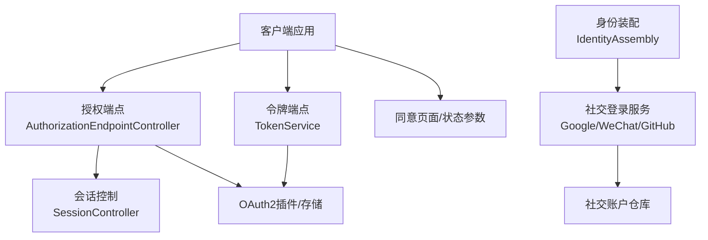
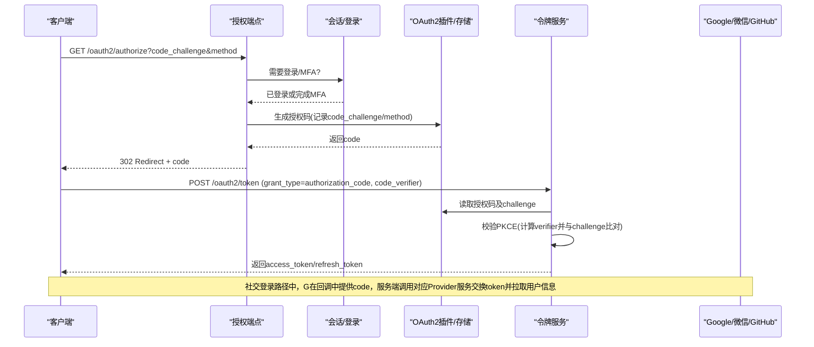
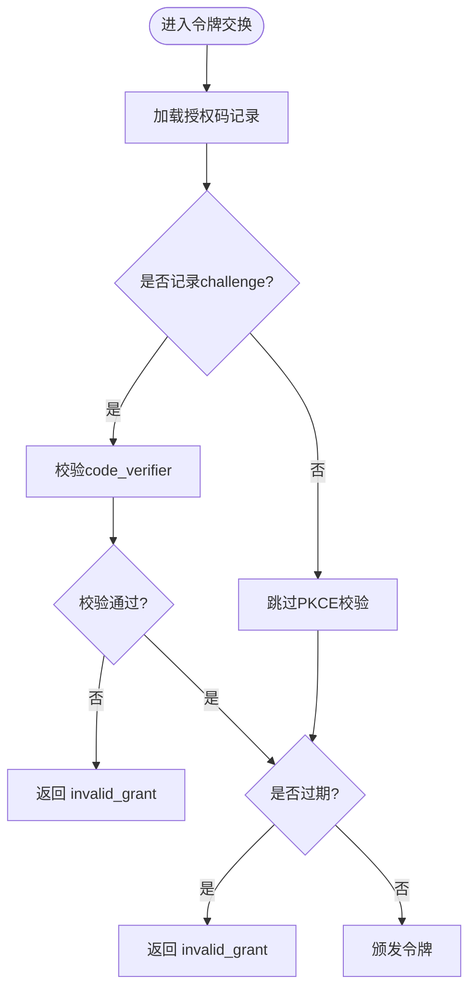
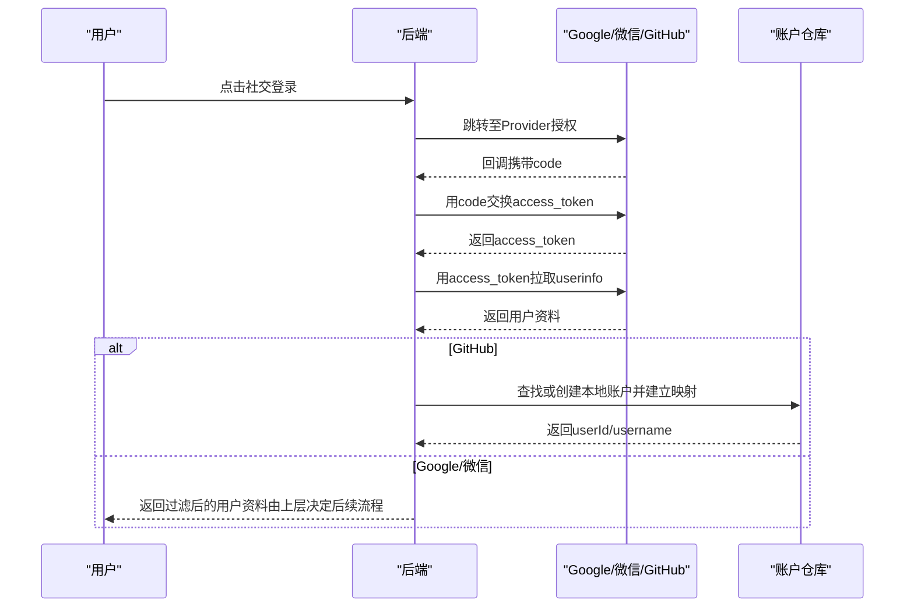
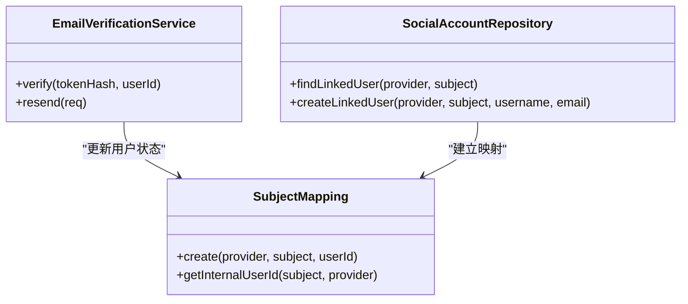
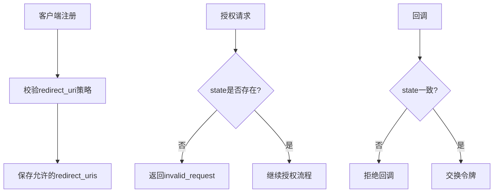
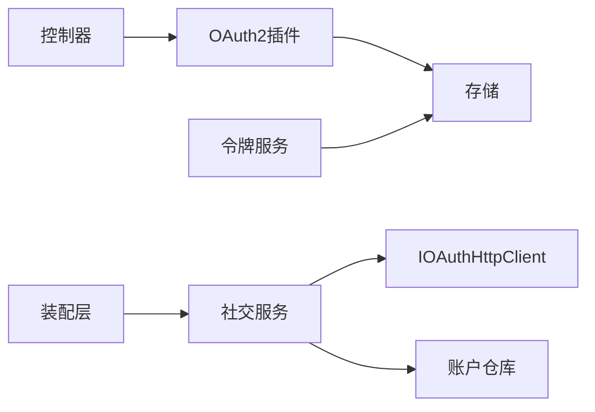

# 社交登录安全

<cite>
**本文引用的文件**
- [AuthorizationEndpointController.cc](file://libs/drogon/src/controllers/AuthorizationEndpointController.cc)
- [SessionController.cc](file://libs/drogon/src/controllers/SessionController.cc)
- [TokenService.cc](file://libs/oauth2/src/protocol/TokenService.cc)
- [SocialAuthService.h](file://libs/identity/include/authforge/identity/SocialAuthService.h)
- [GoogleAuthService.cc](file://libs/identity/src/social/GoogleAuthService.cc)
- [WeChatAuthService.cc](file://libs/identity/src/social/WeChatAuthService.cc)
- [GitHubAuthService.cc](file://libs/identity/src/social/GitHubAuthService.cc)
- [IdentityAssembly.cc](file://apps/server/src/bootstrap/IdentityAssembly.cc)
- [ClientRegistrationService.cc](file://libs/drogon/src/services/ClientRegistrationService.cc)
- [RedirectUri.h](file://libs/common/include/authforge/common/model/RedirectUri.h)
- [EmailVerificationService.cc](file://libs/drogon/src/services/EmailVerificationService.cc)
- [AuthorizePkcePassthroughIntegrationTest.cc](file://tests/integration/auth/AuthorizePkcePassthroughIntegrationTest.cc)
- [TokenServiceTest.cc](file://libs/oauth2/test/TokenServiceTest.cc)
- [mfa_auth_code_pkce_design.md](file://docs/history/PRD/mfa_auth_code_pkce_design.md)
- [oauth-oidc-compliance-audit.md](file://docs/productization-evolution/oauth-oidc-compliance-audit.md)
</cite>

## 目录
1. [简介](#简介)
2. [项目结构](#项目结构)
3. [核心组件](#核心组件)
4. [架构总览](#架构总览)
5. [详细组件分析](#详细组件分析)
6. [依赖关系分析](#依赖关系分析)
7. [性能考虑](#性能考虑)
8. [故障排除指南](#故障排除指南)
9. [结论](#结论)
10. [附录](#附录)

## 简介
本文件面向AuthForge的社交登录安全实现，聚焦OAuth2授权码流程的安全落地与PKCE扩展，覆盖以下主题：
- 授权码生成、交换与验证机制（含PKCE）
- PKCE对授权码拦截攻击的防护与客户端认证增强
- 社交提供商集成（Google、微信、GitHub）的配置与安全要点
- 用户信息映射与验证（邮箱验证、标识符去重、数据同步策略）
- 社交登录安全配置（重定向URI校验、state参数使用、CSRF防护）
- 故障排除（授权失败、用户冲突、日志分析）

## 项目结构
AuthForge将OAuth2协议能力、身份服务与控制器解耦：
- OAuth2协议层：授权端点、令牌交换、PKCE校验等
- 身份服务层：第三方社交登录（Google/微信/GitHub）的用户信息获取与账户关联
- 控制器与服务层：会话控制、客户端注册、重定向URI策略、邮箱验证等
- 装配层：启动时注入各Provider配置与仓库

**图示来源**
- [AuthorizationEndpointController.cc:458-484](file://libs/drogon/src/controllers/AuthorizationEndpointController.cc#L458-L484)
- [TokenService.cc:202-233](file://libs/oauth2/src/protocol/TokenService.cc#L202-L233)
- [IdentityAssembly.cc:136-189](file://apps/server/src/bootstrap/IdentityAssembly.cc#L136-L189)

**章节来源**
- [AuthorizationEndpointController.cc:458-484](file://libs/drogon/src/controllers/AuthorizationEndpointController.cc#L458-L484)
- [IdentityAssembly.cc:136-189](file://apps/server/src/bootstrap/IdentityAssembly.cc#L136-L189)

## 核心组件
- 授权端点控制器：负责解析authorize请求、PKCE强制策略、重定向与错误返回
- 会话控制器：处理本地登录后的授权码签发，支持PKCE透传
- 令牌服务：执行授权码兑换令牌的完整校验，包括PKCE验证、过期检查
- 社交登录服务：封装Google/微信/GitHub的授权码交换与用户信息拉取
- 客户端注册服务：注册阶段重定向URI策略校验
- 邮箱验证服务：完成邮箱验证并更新用户状态

**章节来源**
- [AuthorizationEndpointController.cc:458-484](file://libs/drogon/src/controllers/AuthorizationEndpointController.cc#L458-L484)
- [SessionController.cc:613-654](file://libs/drogon/src/controllers/SessionController.cc#L613-L654)
- [TokenService.cc:202-233](file://libs/oauth2/src/protocol/TokenService.cc#L202-L233)
- [SocialAuthService.h:61-266](file://libs/identity/include/authforge/identity/SocialAuthService.h#L61-L266)
- [ClientRegistrationService.cc:89-130](file://libs/drogon/src/services/ClientRegistrationService.cc#L89-L130)
- [EmailVerificationService.cc:156-233](file://libs/drogon/src/services/EmailVerificationService.cc#L156-L233)

## 架构总览
下图展示从“发起授权”到“换取令牌”的端到端流程，包含PKCE强制与社交登录分支。

**图示来源**
- [AuthorizationEndpointController.cc:458-484](file://libs/drogon/src/controllers/AuthorizationEndpointController.cc#L458-L484)
- [TokenService.cc:202-233](file://libs/oauth2/src/protocol/TokenService.cc#L202-L233)
- [SocialAuthService.h:61-266](file://libs/identity/include/authforge/identity/SocialAuthService.h#L61-L266)

## 详细组件分析

### OAuth2授权码流程与PKCE
- 授权端点在authorize阶段：
  - 根据配置决定是否强制PKCE（默认对所有authorization_code客户端启用）
  - 若未携带code_challenge且强制开启，则返回invalid_request错误并重定向
- 会话登录后通过插件生成授权码，并持久化code_challenge与方法
- 令牌交换阶段：
  - 若存在stored challenge，则必须提供code_verifier并通过校验
  - 校验失败返回invalid_grant；授权码过期返回invalid_grant

**图示来源**
- [TokenService.cc:202-233](file://libs/oauth2/src/protocol/TokenService.cc#L202-L233)

**章节来源**
- [AuthorizationEndpointController.cc:458-484](file://libs/drogon/src/controllers/AuthorizationEndpointController.cc#L458-L484)
- [SessionController.cc:613-654](file://libs/drogon/src/controllers/SessionController.cc#L613-L654)
- [TokenService.cc:202-233](file://libs/oauth2/src/protocol/TokenService.cc#L202-L233)
- [mfa_auth_code_pkce_design.md:60-141](file://docs/history/PRD/mfa_auth_code_pkce_design.md#L60-L141)
- [oauth-oidc-compliance-audit.md:229-249](file://docs/productization-evolution/oauth-oidc-compliance-audit.md#L229-L249)

### 社交登录集成（Google、微信、GitHub）
- Google：
  - 通过postForm向Google token端点交换access_token，再用Bearer获取userinfo
  - 仅保留必要字段（sub/name/email/picture），降低泄露面
- 微信：
  - 使用GET+查询参数进行token交换与userinfo获取
  - 校验errcode==0才视为成功，过滤必要字段
- GitHub：
  - 交换token后拉取用户信息，查找或创建本地账户并建立映射
  - 不直接发放OAuth2令牌，交由上层编排

**图示来源**
- [GoogleAuthService.cc:24-95](file://libs/identity/src/social/GoogleAuthService.cc#L24-L95)
- [WeChatAuthService.cc:20-93](file://libs/identity/src/social/WeChatAuthService.cc#L20-L93)
- [GitHubAuthService.cc:26-149](file://libs/identity/src/social/GitHubAuthService.cc#L26-L149)
- [SocialAuthService.h:61-266](file://libs/identity/include/authforge/identity/SocialAuthService.h#L61-L266)

**章节来源**
- [GoogleAuthService.cc:24-95](file://libs/identity/src/social/GoogleAuthService.cc#L24-L95)
- [WeChatAuthService.cc:20-93](file://libs/identity/src/social/WeChatAuthService.cc#L20-L93)
- [GitHubAuthService.cc:26-149](file://libs/identity/src/social/GitHubAuthService.cc#L26-L149)
- [SocialAuthService.h:61-266](file://libs/identity/include/authforge/identity/SocialAuthService.h#L61-L266)
- [IdentityAssembly.cc:136-189](file://apps/server/src/bootstrap/IdentityAssembly.cc#L136-L189)

### 用户信息映射与验证
- 邮箱验证：
  - 通过邮箱验证服务将用户标记为已验证，并在前端展示状态
- 用户标识符去重：
  - 基于provider与subject建立映射，隔离不同提供商的同名主体
- 数据同步策略：
  - 社交登录成功后仅拉取必要字段，避免冗余数据写入
  - GitHub路径会创建或链接本地账户，Google/微信路径返回过滤后的资料供上层决策

**图示来源**
- [EmailVerificationService.cc:156-233](file://libs/drogon/src/services/EmailVerificationService.cc#L156-L233)
- [GitHubAuthService.cc:95-149](file://libs/identity/src/social/GitHubAuthService.cc#L95-L149)

**章节来源**
- [EmailVerificationService.cc:156-233](file://libs/drogon/src/services/EmailVerificationService.cc#L156-L233)
- [GitHubAuthService.cc:95-149](file://libs/identity/src/social/GitHubAuthService.cc#L95-L149)

### 社交登录安全配置
- 重定向URI校验：
  - 客户端注册时对redirect_uri进行策略校验（HTTPS优先，回环IP豁免，可配置HTTP覆盖）
  - 值对象RedirectUri确保非空，实际匹配在消费授权码时与注册列表精确比对
- state参数与CSRF防护：
  - authorize请求应携带state，回调时校验state一致性，防止跨站请求伪造
  - 同意页面提交action需结合state与redirect_uri共同校验
- PKCE强制：
  - 默认对authorization_code客户端强制PKCE，public client必须使用S256

**图示来源**
- [ClientRegistrationService.cc:89-130](file://libs/drogon/src/services/ClientRegistrationService.cc#L89-L130)
- [RedirectUri.h:1-59](file://libs/common/include/authforge/common/model/RedirectUri.h#L1-L59)
- [AuthorizationEndpointController.cc:458-484](file://libs/drogon/src/controllers/AuthorizationEndpointController.cc#L458-L484)

**章节来源**
- [ClientRegistrationService.cc:89-130](file://libs/drogon/src/services/ClientRegistrationService.cc#L89-L130)
- [RedirectUri.h:1-59](file://libs/common/include/authforge/common/model/RedirectUri.h#L1-L59)
- [AuthorizationEndpointController.cc:458-484](file://libs/drogon/src/controllers/AuthorizationEndpointController.cc#L458-L484)

## 依赖关系分析
- 控制器依赖OAuth2插件与存储以生成/消费授权码
- 令牌服务依赖存储读取授权码并进行PKCE校验
- 社交服务通过IOAuthHttpClient抽象外部HTTP调用，避免框架耦合
- 装配层集中注入Provider配置与仓库实例

**图示来源**
- [IdentityAssembly.cc:136-189](file://apps/server/src/bootstrap/IdentityAssembly.cc#L136-L189)
- [SocialAuthService.h:61-266](file://libs/identity/include/authforge/identity/SocialAuthService.h#L61-L266)
- [TokenService.cc:202-233](file://libs/oauth2/src/protocol/TokenService.cc#L202-L233)

**章节来源**
- [IdentityAssembly.cc:136-189](file://apps/server/src/bootstrap/IdentityAssembly.cc#L136-L189)
- [SocialAuthService.h:61-266](file://libs/identity/include/authforge/identity/SocialAuthService.h#L61-L266)
- [TokenService.cc:202-233](file://libs/oauth2/src/protocol/TokenService.cc#L202-L233)

## 性能考虑
- 授权码与PKCE校验在令牌交换阶段进行，避免重复计算
- 社交登录拉取用户信息采用最小字段集，减少网络与序列化开销
- 异步回调链式处理，避免阻塞主线程

[本节为通用指导，无需特定文件引用]

## 故障排除指南
- 授权失败（PKCE相关）：
  - 现象：exchange返回invalid_grant，描述为“PKCE validation failed”
  - 排查：确认authorize阶段是否记录challenge；exchange是否携带正确verifier
  - 参考：测试用例覆盖空verifier与错误verifier场景
- 用户冲突（社交账户映射）：
  - 现象：同一subject在不同provider下产生不同内部用户
  - 排查：确认provider与subject组合唯一性；检查映射创建逻辑
- 日志分析：
  - 关注authorize阶段的PKCE强制日志与错误重定向
  - 关注令牌交换阶段的PKCE校验与过期判断
  - 关注社交登录的网络错误与无效输入错误码

**章节来源**
- [TokenServiceTest.cc:644-699](file://libs/oauth2/test/TokenServiceTest.cc#L644-L699)
- [AuthorizePkcePassthroughIntegrationTest.cc:1-24](file://tests/integration/auth/AuthorizePkcePassthroughIntegrationTest.cc#L1-L24)
- [SocialAuthService.h:61-266](file://libs/identity/include/authforge/identity/SocialAuthService.h#L61-L266)

## 结论
AuthForge在OAuth2授权码流程中实现了严格的PKCE强制与校验，有效防护授权码拦截攻击；社交登录通过抽象HTTP端口与最小字段策略提升安全性；重定向URI策略与state参数校验进一步加固了CSRF风险。建议在生产环境中保持PKCE强制、严格审核redirect_uri，并结合审计日志持续监控异常。

[本节为总结，无需特定文件引用]

## 附录
- 关键配置项：
  - auth.require_pkce_for_public：控制是否强制PKCE（当前默认行为倾向于对所有authorization_code客户端启用）
  - external_auth.{google,wechat,github}：各Provider的client_id/secret/redirect_uri
- 最佳实践：
  - 所有SPA与public client必须使用S256
  - 回调页必须校验state与redirect_uri
  - 社交登录仅拉取必要字段并做白名单过滤

[本节为补充说明，无需特定文件引用]