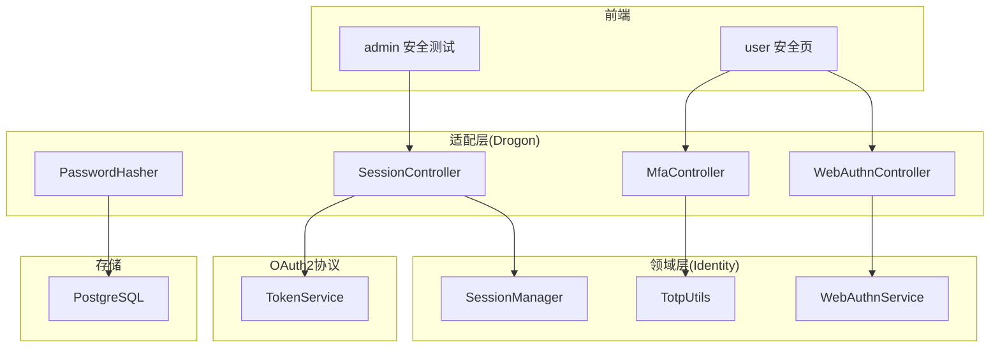
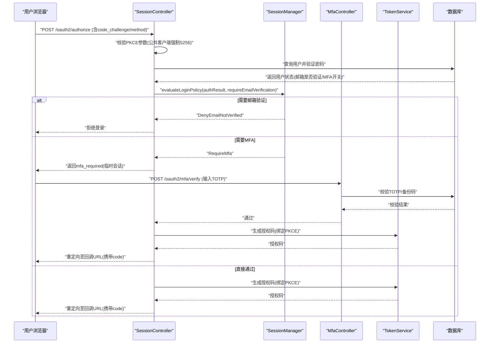
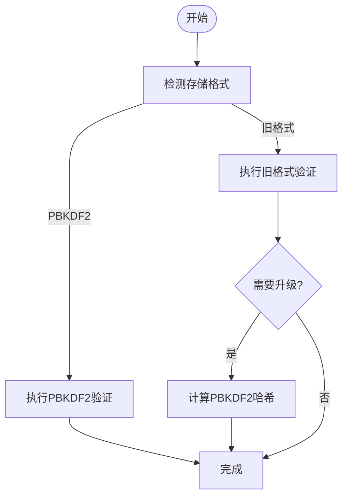
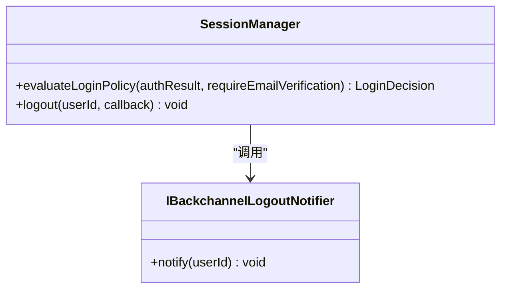
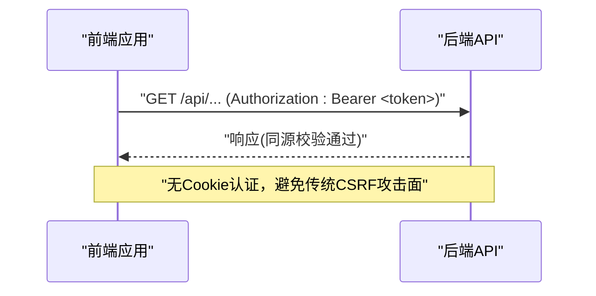
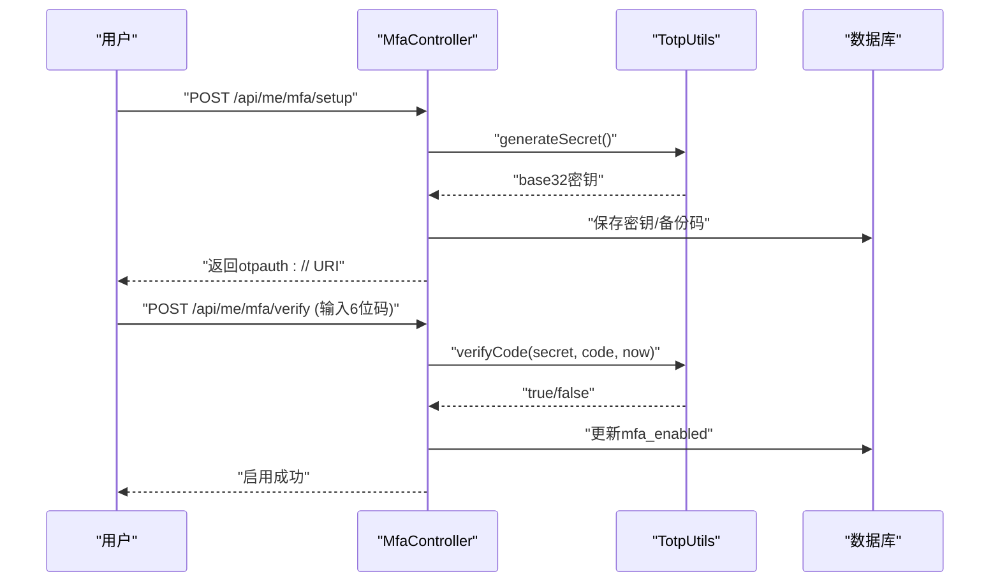
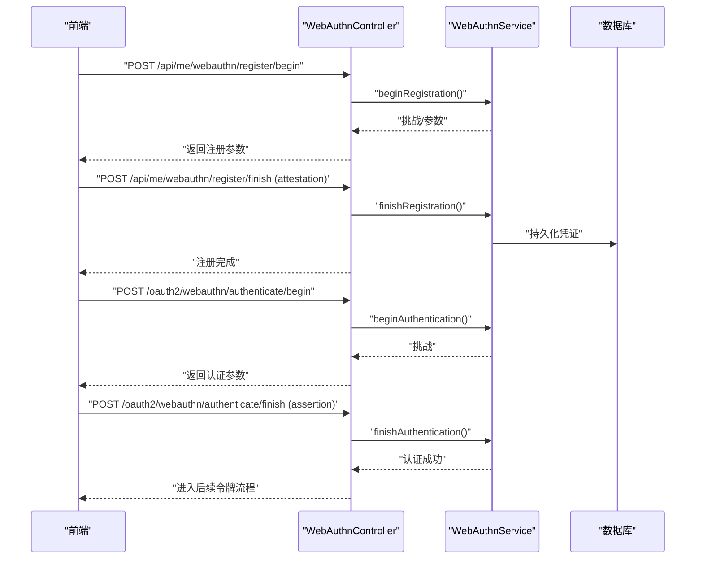
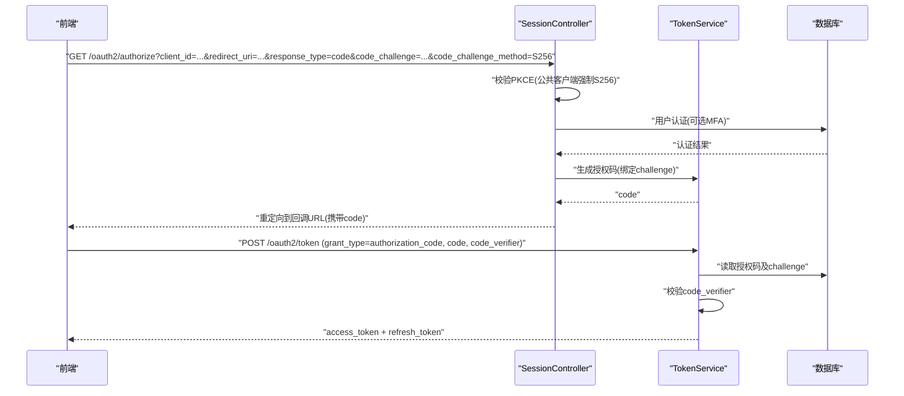
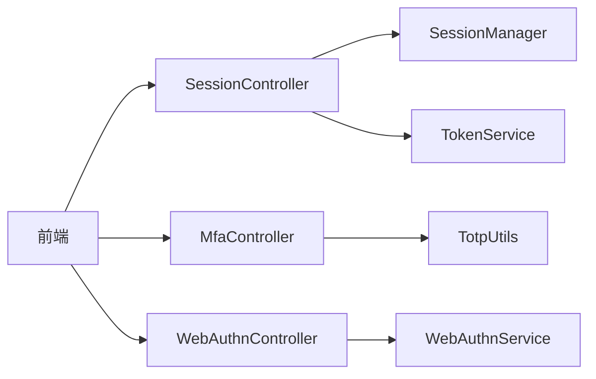

# 认证安全

<cite>
**本文引用的文件**
- [PasswordHasher.h](file://libs/drogon/include/authforge/drogon/utils/PasswordHasher.h)
- [PasswordHasher.cc](file://libs/drogon/src/utils/PasswordHasher.cc)
- [SessionManager.h](file://libs/identity/include/authforge/identity/SessionManager.h)
- [SessionController.cc](file://libs/drogon/src/controllers/SessionController.cc)
- [MfaController.h](file://libs/drogon/include/authforge/drogon/controllers/MfaController.h)
- [TotpUtils.h](file://libs/identity/include/authforge/identity/TotpUtils.h)
- [V011__mfa_support.sql](file://apps/server/migrations/V011__mfa_support.sql)
- [openapi.yaml](file://apps/server/openapi.yaml)
- [WebAuthnController.h](file://libs/drogon/include/authforge/drogon/controllers/WebAuthnController.h)
- [WebAuthnService.h](file://libs/identity/include/authforge/identity/WebAuthnService.h)
- [TokenService.h](file://libs/oauth2/include/authforge/oauth2/protocol/TokenService.h)
- [security.spec.ts](file://frontends/admin/tests/e2e/security.spec.ts)
- [SecurityPage.vue](file://frontends/user/src/pages/account/SecurityPage.vue)
- [dev_admin_console_client.sql](file://apps/server/seed/dev_admin_console_client.sql)
- [mfa_auth_code_pkce_design.md](file://docs/history/PRD/mfa_auth_code_pkce_design.md)
</cite>

## 目录
1. [简介](#简介)
2. [项目结构](#项目结构)
3. [核心组件](#核心组件)
4. [架构总览](#架构总览)
5. [详细组件分析](#详细组件分析)
6. [依赖关系分析](#依赖关系分析)
7. [性能考量](#性能考量)
8. [故障排查指南](#故障排查指南)
9. [结论](#结论)
10. [附录](#附录)

## 简介
本文件面向 AuthForge 的认证安全能力，系统性说明密码哈希、会话管理、CSRF防护、多因素认证（TOTP）、WebAuthn（FIDO2）与社交登录（OAuth2/PKCE）的实现要点与安全配置建议。文档以代码级事实为依据，辅以流程图与时序图帮助理解数据流与控制流。

## 项目结构
围绕认证安全的实现分布在以下层次：
- 适配层（drogon）：控制器与工具类，如 PasswordHasher、MfaController、WebAuthnController、SessionController。
- 领域层（identity）：会话策略、TOTP 工具、WebAuthn 服务接口等。
- OAuth2 协议层：令牌服务、PKCE 校验等。
- 前端：测试用例验证 Bearer 令牌与 CSRF 防护；用户端页面提供 MFA 与 WebAuthn 交互。
- 数据库迁移：MFA 字段、刷新令牌族等。

图表来源
- [SessionController.cc:553-591](file://libs/drogon/src/controllers/SessionController.cc#L553-L591)
- [PasswordHasher.h:1-57](file://libs/drogon/include/authforge/drogon/utils/PasswordHasher.h#L1-L57)
- [MfaController.h:52-72](file://libs/drogon/include/authforge/drogon/controllers/MfaController.h#L52-L72)
- [WebAuthnController.h:50-82](file://libs/drogon/include/authforge/drogon/controllers/WebAuthnController.h#L50-L82)
- [TokenService.h:132-168](file://libs/oauth2/include/authforge/oauth2/protocol/TokenService.h#L132-L168)

章节来源
- [SessionController.cc:553-591](file://libs/drogon/src/controllers/SessionController.cc#L553-L591)
- [PasswordHasher.h:1-57](file://libs/drogon/include/authforge/drogon/utils/PasswordHasher.h#L1-L57)
- [MfaController.h:52-72](file://libs/drogon/include/authforge/drogon/controllers/MfaController.h#L52-L72)
- [WebAuthnController.h:50-82](file://libs/drogon/include/authforge/drogon/controllers/WebAuthnController.h#L50-L82)
- [TokenService.h:132-168](file://libs/oauth2/include/authforge/oauth2/protocol/TokenService.h#L132-L168)

## 核心组件
- 密码哈希：PBKDF2-SHA256，支持向后兼容旧格式并在首次成功登录后升级。
- 会话策略：基于邮箱验证与 MFA 的登录决策，以及登出时的回退通知转发。
- MFA（TOTP）：生成密钥、二维码 URI、一次性备份码、登录时二次校验。
- WebAuthn（Passkey）：注册与认证两阶段流程，当前版本在控制器侧简化了签名验证契约。
- OAuth2/PKCE：公共客户端强制 PKCE，授权码交换时校验 code_verifier。
- CSRF防护：采用无 Cookie 的 Bearer 令牌方案，配合严格 CORS 同源白名单。

章节来源
- [PasswordHasher.h:1-57](file://libs/drogon/include/authforge/drogon/utils/PasswordHasher.h#L1-L57)
- [SessionManager.h:1-132](file://libs/identity/include/authforge/identity/SessionManager.h#L1-L132)
- [MfaController.h:52-72](file://libs/drogon/include/authforge/drogon/controllers/MfaController.h#L52-L72)
- [WebAuthnController.h:50-82](file://libs/drogon/include/authforge/drogon/controllers/WebAuthnController.h#L50-L82)
- [TokenService.h:132-168](file://libs/oauth2/include/authforge/oauth2/protocol/TokenService.h#L132-L168)
- [security.spec.ts:120-144](file://frontends/admin/tests/e2e/security.spec.ts#L120-L144)

## 架构总览
下图展示了从登录到颁发令牌的完整链路，包含 PKCE 强制校验、MFA 决策与 TOTP 校验。

图表来源
- [SessionController.cc:553-591](file://libs/drogon/src/controllers/SessionController.cc#L553-L591)
- [SessionManager.h:54-132](file://libs/identity/include/authforge/identity/SessionManager.h#L54-L132)
- [MfaController.h:52-72](file://libs/drogon/include/authforge/drogon/controllers/MfaController.h#L52-L72)
- [TokenService.h:132-168](file://libs/oauth2/include/authforge/oauth2/protocol/TokenService.h#L132-L168)

## 详细组件分析

### 密码哈希算法（PBKDF2-SHA256 与向后兼容）
- 新密码使用 PBKDF2-SHA256 进行哈希，参数内嵌于输出字符串中，便于未来升级。
- 自动识别旧格式（SHA-256+salt），验证通过后提示或触发重新哈希。
- 提供 needsRehash 判断是否需要升级存储格式。

图表来源
- [PasswordHasher.h:1-57](file://libs/drogon/include/authforge/drogon/utils/PasswordHasher.h#L1-L57)

章节来源
- [PasswordHasher.h:1-57](file://libs/drogon/include/authforge/drogon/utils/PasswordHasher.h#L1-L57)

### 会话安全管理（创建、验证、过期、销毁）
- 登录策略：先检查邮箱验证要求，再检查 MFA 要求，确保优先级正确。
- 登出：通过注入的回退通知器发送登出事件，不在此处撤销令牌。
- 令牌生命周期由 TokenService 负责（验证、撤销、鉴权）。

图表来源
- [SessionManager.h:76-132](file://libs/identity/include/authforge/identity/SessionManager.h#L76-L132)

章节来源
- [SessionManager.h:54-132](file://libs/identity/include/authforge/identity/SessionManager.h#L54-L132)

### CSRF防护（无Cookie Bearer令牌 + 严格CORS）
- 前端不设置认证 Cookie，所有 API 请求通过 Authorization: Bearer 头携带访问令牌。
- 后端通过严格的同源白名单与 CORS 策略阻止跨站伪造请求。
- E2E 测试验证无 Cookie 且请求携带 Bearer 头。

图表来源
- [security.spec.ts:120-144](file://frontends/admin/tests/e2e/security.spec.ts#L120-L144)

章节来源
- [security.spec.ts:120-144](file://frontends/admin/tests/e2e/security.spec.ts#L120-L144)

### 多因素认证（TOTP）
- 数据模型：users 表新增 mfa_enabled、mfa_secret、mfa_backup_codes 字段。
- 功能端点：
  - POST /api/me/mfa/setup：生成 TOTP 密钥与 otpauth:// URI。
  - POST /api/me/mfa/verify：验证 TOTP 启用。
  - POST /api/me/mfa/disable：需密码确认禁用。
  - POST /oauth2/mfa/verify：登录第二步校验 TOTP。
- TOTP 工具：生成随机密钥、按时间步长生成/校验 6 位验证码、生成一次性备份码。

图表来源
- [MfaController.h:52-72](file://libs/drogon/include/authforge/drogon/controllers/MfaController.h#L52-L72)
- [TotpUtils.h:31-83](file://libs/identity/include/authforge/identity/TotpUtils.h#L31-L83)
- [V011__mfa_support.sql:1-6](file://apps/server/migrations/V011__mfa_support.sql#L1-L6)

章节来源
- [V011__mfa_support.sql:1-6](file://apps/server/migrations/V011__mfa_support.sql#L1-L6)
- [MfaController.h:52-72](file://libs/drogon/include/authforge/drogon/controllers/MfaController.h#L52-L72)
- [TotpUtils.h:31-83](file://libs/identity/include/authforge/identity/TotpUtils.h#L31-L83)
- [openapi.yaml:1469-1520](file://apps/server/openapi.yaml#L1469-L1520)

### WebAuthn（FIDO2/Passkey）
- 注册流程（需已登录）：
  - POST /api/me/webauthn/register/begin：发起注册。
  - POST /api/me/webauthn/register/finish：提交凭证并完成注册。
- 认证流程（无需已登录）：
  - POST /oauth2/webauthn/authenticate/begin：发起认证。
  - POST /oauth2/webauthn/authenticate/finish：提交断言完成认证。
- 当前控制器行为说明：简化了签名验证契约，信任客户端提交的凭证信息；生产环境可后续增强 CBOR/签名校验。

图表来源
- [WebAuthnController.h:50-82](file://libs/drogon/include/authforge/drogon/controllers/WebAuthnController.h#L50-L82)
- [WebAuthnService.h:44-68](file://libs/identity/include/authforge/identity/WebAuthnService.h#L44-L68)

章节来源
- [WebAuthnController.h:50-82](file://libs/drogon/include/authforge/drogon/controllers/WebAuthnController.h#L50-L82)
- [WebAuthnService.h:44-68](file://libs/identity/include/authforge/identity/WebAuthnService.h#L44-L68)

### 社交登录（OAuth2 授权码流程 + PKCE）
- 公共客户端强制 PKCE：必须提供 code_challenge 与 method=S256。
- 授权码交换：TokenService 校验 code_verifier 与之前绑定的 challenge。
- 示例客户端：开发用 admin-console 为 PUBLIC 类型，仅用于演示。

图表来源
- [SessionController.cc:553-591](file://libs/drogon/src/controllers/SessionController.cc#L553-L591)
- [TokenService.h:132-168](file://libs/oauth2/include/authforge/oauth2/protocol/TokenService.h#L132-L168)
- [dev_admin_console_client.sql:1-20](file://apps/server/seed/dev_admin_console_client.sql#L1-L20)
- [mfa_auth_code_pkce_design.md:60-120](file://docs/history/PRD/mfa_auth_code_pkce_design.md#L60-L120)

章节来源
- [SessionController.cc:553-591](file://libs/drogon/src/controllers/SessionController.cc#L553-L591)
- [TokenService.h:132-168](file://libs/oauth2/include/authforge/oauth2/protocol/TokenService.h#L132-L168)
- [dev_admin_console_client.sql:1-20](file://apps/server/seed/dev_admin_console_client.sql#L1-L20)
- [mfa_auth_code_pkce_design.md:60-120](file://docs/history/PRD/mfa_auth_code_pkce_design.md#L60-L120)

## 依赖关系分析
- 控制器依赖领域服务：MfaController 依赖 MfaService/TotpUtils；WebAuthnController 依赖 WebAuthnService。
- 会话策略与令牌服务解耦：SessionManager 仅做策略决策，TokenService 负责令牌生命周期。
- 前端与后端通过 Bearer 令牌交互，避免 Cookie 带来的 CSRF 风险。

图表来源
- [SessionController.cc:553-591](file://libs/drogon/src/controllers/SessionController.cc#L553-L591)
- [MfaController.h:52-72](file://libs/drogon/include/authforge/drogon/controllers/MfaController.h#L52-L72)
- [WebAuthnController.h:50-82](file://libs/drogon/include/authforge/drogon/controllers/WebAuthnController.h#L50-L82)
- [TokenService.h:132-168](file://libs/oauth2/include/authforge/oauth2/protocol/TokenService.h#L132-L168)

章节来源
- [SessionController.cc:553-591](file://libs/drogon/src/controllers/SessionController.cc#L553-L591)
- [MfaController.h:52-72](file://libs/drogon/include/authforge/drogon/controllers/MfaController.h#L52-L72)
- [WebAuthnController.h:50-82](file://libs/drogon/include/authforge/drogon/controllers/WebAuthnController.h#L50-L82)
- [TokenService.h:132-168](file://libs/oauth2/include/authforge/oauth2/protocol/TokenService.h#L132-L168)

## 性能考量
- 密码哈希：PBKDF2 迭代次数较高，建议在登录成功后异步升级旧哈希，避免阻塞主流程。
- TOTP 校验：时间步长为 30 秒，允许 ±1 步容差，减少时钟偏差导致的失败重试。
- PKCE 校验：仅在授权码交换时进行一次 SHA-256 计算，开销可控。
- 并发控制：授权码消费与令牌颁发应保证原子性，避免重复兑换。

[本节为通用指导，不直接分析具体文件]

## 故障排查指南
- 登录被拒（邮箱未验证）：检查 SessionManager 策略返回值 DenyEmailNotVerified，并确保 require_email_verification 配置正确。
- MFA 校验失败：核对 TOTP 密钥是否正确、备份码是否已用、时间同步是否正常。
- PKCE 错误：公共客户端必须使用 S256 方法并提供有效的 code_challenge；交换令牌时必须传入匹配的 code_verifier。
- CSRF 相关：确认前端未设置认证 Cookie，API 请求均携带 Authorization: Bearer；检查后端 CORS 白名单是否包含请求源。

章节来源
- [SessionManager.h:54-132](file://libs/identity/include/authforge/identity/SessionManager.h#L54-L132)
- [TotpUtils.h:31-83](file://libs/identity/include/authforge/identity/TotpUtils.h#L31-L83)
- [TokenService.h:132-168](file://libs/oauth2/include/authforge/oauth2/protocol/TokenService.h#L132-L168)
- [security.spec.ts:120-144](file://frontends/admin/tests/e2e/security.spec.ts#L120-L144)

## 结论
AuthForge 在认证安全方面实现了：
- 强化的密码哈希与平滑升级机制。
- 明确的会话策略（邮箱验证优先于 MFA）。
- 完善的 MFA（TOTP）与备份码体系。
- 简化的 WebAuthn 流程，便于快速集成与扩展。
- 强制 PKCE 的 OAuth2 授权码流程，保障公共客户端安全。
- 无 Cookie 的 Bearer 令牌架构，有效规避 CSRF 风险。

[本节为总结性内容，不直接分析具体文件]

## 附录
- 配置建议：
  - 开启 require_pkce_for_public，强制公共客户端使用 S256。
  - 根据业务需求启用 require_email_verification。
  - 合理设置 TOTP 时间步长与容差，平衡安全性与用户体验。
- 最佳实践：
  - 新注册一律使用强哈希（PBKDF2），并在首次登录成功后异步升级旧哈希。
  - 对所有外部回调地址进行严格白名单校验。
  - 对敏感操作（禁用 MFA、修改密码）要求再次密码确认。

章节来源
- [SessionController.cc:553-591](file://libs/drogon/src/controllers/SessionController.cc#L553-L591)
- [SecurityPage.vue:195-218](file://frontends/user/src/pages/account/SecurityPage.vue#L195-L218)
- [SecurityPage.vue:111-136](file://frontends/user/src/pages/account/SecurityPage.vue#L111-L136)