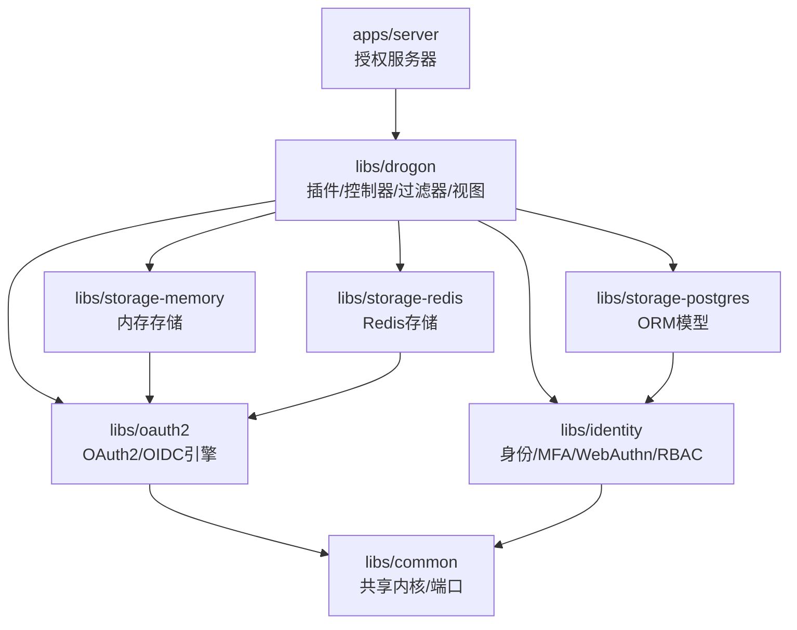
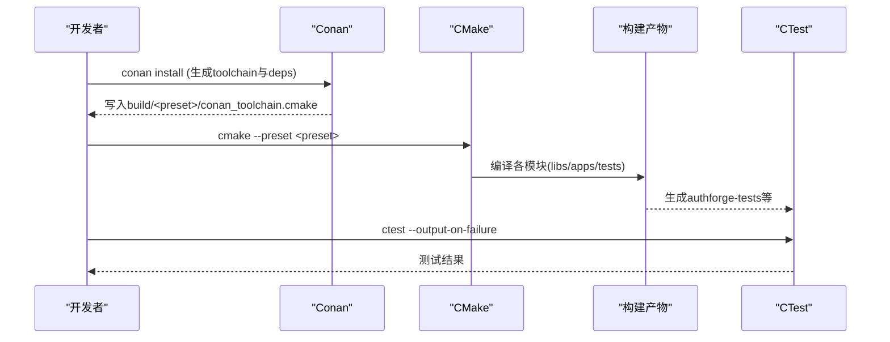
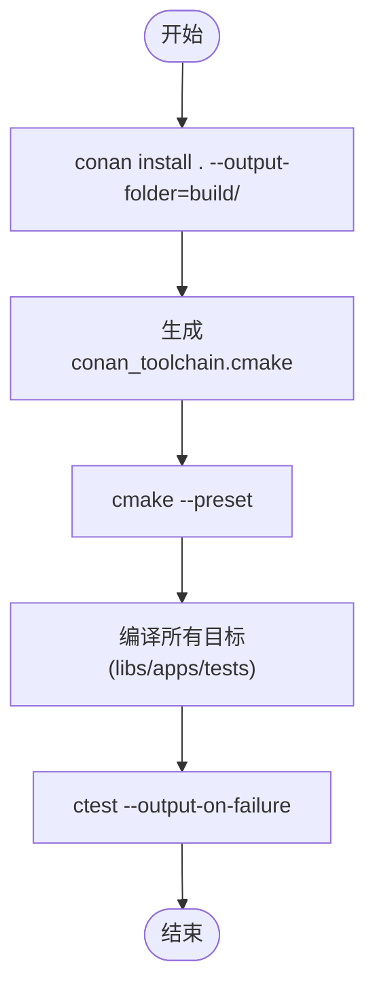
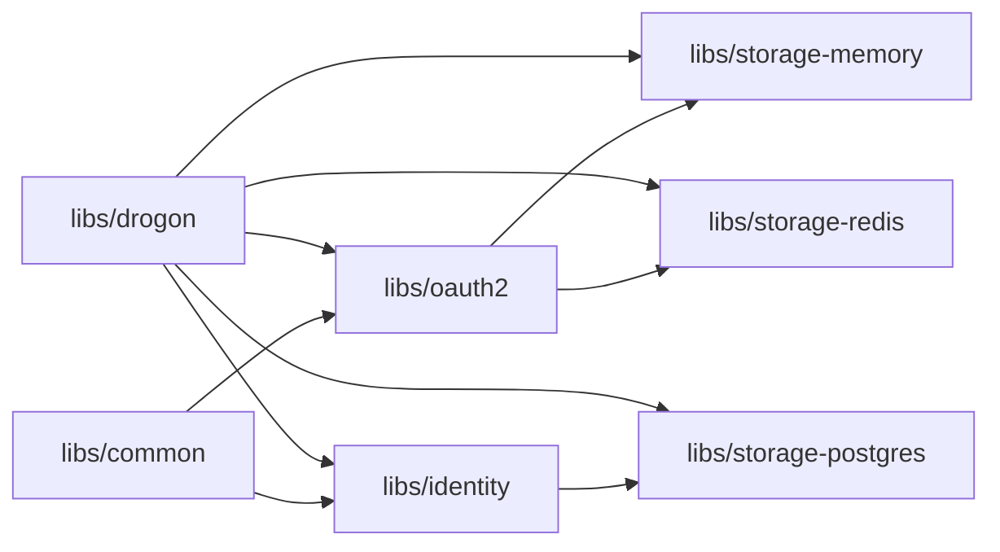
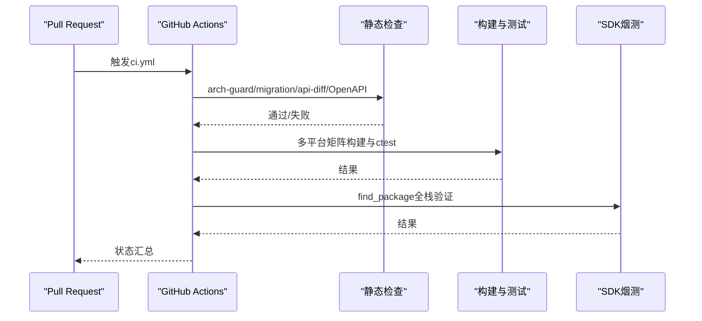

# 开发指南

<cite>
**本文引用的文件**
- [CMakeLists.txt](file://CMakeLists.txt)
- [conanfile.py](file://conanfile.py)
- [README.md](file://README.md)
- [CONTRIBUTING.md](file://CONTRIBUTING.md)
- [CMakePresets.json](file://CMakePresets.json)
- [scripts/backend/build.sh](file://scripts/backend/build.sh)
- [scripts/backend/test.sh](file://scripts/backend/test.sh)
- [cmake/Warnings.cmake](file://cmake/Warnings.cmake)
- [cmake/Sanitizers.cmake](file://cmake/Sanitizers.cmake)
- [.clang-format](file://.clang-format)
- [paths.env](file://paths.env)
- [scripts/backend/env_common.sh](file://scripts/backend/env_common.sh)
- [scripts/backend/env_setup.bat](file://scripts/backend/env_setup.bat)
- [.github/workflows/ci.yml](file://.github/workflows/ci.yml)
</cite>

## 目录
1. [简介](#简介)
2. [项目结构](#项目结构)
3. [核心组件](#核心组件)
4. [架构总览](#架构总览)
5. [详细组件分析](#详细组件分析)
6. [依赖分析](#依赖分析)
7. [性能与构建优化](#性能与构建优化)
8. [调试与工具链](#调试与工具链)
9. [编码规范与代码审查](#编码规范与代码审查)
10. [Git工作流与提交规范](#git工作流与提交规范)
11. [新功能开发指南与最佳实践](#新功能开发指南与最佳实践)
12. [测试驱动开发与持续集成](#测试驱动开发与持续集成)
13. [常见问题与故障排除](#常见问题与故障排除)
14. [结论](#结论)

## 简介
本指南面向贡献者，提供AuthForge的完整开发环境搭建、构建系统使用、编码规范、Git工作流、调试技巧、新功能开发指导、测试与CI配置以及常见问题排查。项目基于C++17、Drogon框架，采用CMake + Conan进行依赖与构建管理，支持Linux/macOS/Windows三平台，并提供完整的后端、前端与管理控制台。

## 项目结构
仓库采用分层模块化组织：
- apps/server：授权服务器后端（Drogon C++）
- libs：SDK库包（common/oauth2/identity/storage-*/drogon）
- frontends/admin、frontends/user：管理端与用户端前端
- examples：SDK消费者示例
- deploy：Docker Compose、Helm、Nginx、可观测性
- tests：后端测试套件（单元/集成/契约/e2e/安全/性能）
- scripts：构建、测试与运维脚本
- docs：项目文档

图表来源
- [README.md:31-49](file://README.md#L31-L49)

章节来源
- [README.md:16-65](file://README.md#L16-L65)
- [CMakeLists.txt:57-120](file://CMakeLists.txt#L57-L120)

## 核心组件
- 构建系统与预设：通过CMakePresets统一多平台构建入口，配合Conan生成toolchain与依赖。
- 依赖管理：conanfile.py集中声明第三方依赖与可选特性开关，映射到CMake变量。
- 警告与错误策略：Warnings.cmake为第一方目标提升警告级别，并支持将警告视为错误。
- 检测器：Sanitizers.cmake提供TSan/ASan开关，仅GCC/Clang生效，建议Debug构建。
- 路径与环境：paths.env作为单一真实源，被脚本与CMake引用；env_common.sh解析预设名与路径。
- 测试与运行：build.sh与test.sh封装Conan安装、CMake配置与ctest执行流程。

章节来源
- [CMakePresets.json:1-234](file://CMakePresets.json#L1-L234)
- [conanfile.py:1-83](file://conanfile.py#L1-L83)
- [cmake/Warnings.cmake:1-63](file://cmake/Warnings.cmake#L1-L63)
- [cmake/Sanitizers.cmake:1-88](file://cmake/Sanitizers.cmake#L1-L88)
- [paths.env:1-75](file://paths.env#L1-L75)
- [scripts/backend/build.sh:1-168](file://scripts/backend/build.sh#L1-L168)
- [scripts/backend/test.sh:1-87](file://scripts/backend/test.sh#L1-L87)
- [scripts/backend/env_common.sh:1-83](file://scripts/backend/env_common.sh#L1-L83)

## 架构总览
后端按领域层与适配层解耦，领域层不依赖Drogon，由CI中的arch-guard强制校验。SDK可通过find_package消费，支持最小化依赖面。

图表来源
- [CMakePresets.json:18-177](file://CMakePresets.json#L18-L177)
- [conanfile.py:70-83](file://conanfile.py#L70-L83)
- [scripts/backend/build.sh:119-156](file://scripts/backend/build.sh#L119-L156)
- [scripts/backend/test.sh:41-81](file://scripts/backend/test.sh#L41-L81)

章节来源
- [README.md:31-49](file://README.md#L31-L49)
- [CMakeLists.txt:57-120](file://CMakeLists.txt#L57-L120)

## 详细组件分析

### 构建系统（CMake + Conan）
- 顶层CMakeLists启用C++17、测试、可选功能开关（WITH_IDENTITY/WITH_SOCIAL/WITH_WEBAUTHN），并按顺序添加子目录以建立依赖方向。
- CMakePresets定义多平台/多配置预设（Release/Debug/ASAN/TSAN），并通过conan-base继承共享设置。
- conanfile.py声明依赖版本与选项，并在generate阶段将with_*映射为CMake缓存变量WITH_*。

图表来源
- [CMakeLists.txt:1-31](file://CMakeLists.txt#L1-L31)
- [CMakeLists.txt:57-120](file://CMakeLists.txt#L57-L120)
- [CMakePresets.json:18-177](file://CMakePresets.json#L18-L177)
- [conanfile.py:70-83](file://conanfile.py#L70-L83)
- [scripts/backend/build.sh:119-156](file://scripts/backend/build.sh#L119-L156)

章节来源
- [CMakeLists.txt:1-171](file://CMakeLists.txt#L1-L171)
- [CMakePresets.json:1-234](file://CMakePresets.json#L1-L234)
- [conanfile.py:1-83](file://conanfile.py#L1-L83)
- [scripts/backend/build.sh:1-168](file://scripts/backend/build.sh#L1-L168)

### 依赖管理与可选特性
- 依赖：Drogon、OpenSSL、jsoncpp、hiredis、libcurl、brotli、zlib、gtest（测试）。
- 可选特性：with_identity/with_social/with_webauthn，默认开启，关闭可缩小依赖面。
- 生成阶段：将Conan选项映射为CMake变量WITH_*，供顶层CMake option()消费。

章节来源
- [conanfile.py:27-83](file://conanfile.py#L27-L83)
- [CMakeLists.txt:33-55](file://CMakeLists.txt#L33-L55)

### 警告与错误策略
- 对第一方目标应用-Wall -Wextra（MSVC /W4），屏蔽第三方头噪音。
- 可通过AUTHFORGE_WERROR将警告视为错误，CI中开启。

章节来源
- [cmake/Warnings.cmake:1-63](file://cmake/Warnings.cmake#L1-L63)

### 检测器（Sanitizers）
- 支持thread/address两种模式，仅GCC/Clang有效，建议Debug构建。
- 通过OAUTH2_SANITIZER缓存变量选择，函数oauth2_apply_sanitizer为目标追加编译与链接选项。

章节来源
- [cmake/Sanitizers.cmake:1-88](file://cmake/Sanitizers.cmake#L1-L88)

### 路径与环境
- paths.env集中定义源码、构建输出、SQL/配置路径，被脚本与CMake引用。
- env_common.sh解析预设名、导出绝对路径，便于跨平台脚本一致性。
- Windows环境检查Conan/CMake可用性。

章节来源
- [paths.env:1-75](file://paths.env#L1-L75)
- [scripts/backend/env_common.sh:1-83](file://scripts/backend/env_common.sh#L1-L83)
- [scripts/backend/env_setup.bat:1-22](file://scripts/backend/env_setup.bat#L1-L22)

### 测试与运行脚本
- build.sh：安装依赖、配置CMake、构建、复制配置文件。
- test.sh：按预设运行ctest，支持标准与CI两套配置。

章节来源
- [scripts/backend/build.sh:1-168](file://scripts/backend/build.sh#L1-L168)
- [scripts/backend/test.sh:1-87](file://scripts/backend/test.sh#L1-L87)

## 依赖分析
- 依赖方向严格：Domain层（common/oauth2/identity）不依赖Drogon；storage-*实现适配器；drogon层聚合插件/控制器/视图。
- CI通过arch-guard静态检查确保分层约束。

图表来源
- [README.md:31-49](file://README.md#L31-L49)
- [CMakeLists.txt:57-120](file://CMakeLists.txt#L57-L120)

章节来源
- [README.md:31-49](file://README.md#L31-L49)
- [CMakeLists.txt:57-120](file://CMakeLists.txt#L57-L120)

## 性能与构建优化
- 使用CMake预设隔离不同平台/配置的构建目录，避免污染。
- 在CI中开启AUTHFORGE_WERROR保证零警告基线。
- 使用Sanitizers在Debug模式下定位内存与线程问题。
- 按需关闭可选特性（with_social/with_webauthn）减少依赖与编译时间。

[本节为通用指导，无需特定文件来源]

## 调试与工具链
- 编译器要求：C++17（MSVC 2019+/GCC 9+/Clang 10+）。
- 构建工具：CMake 3.21+，Conan 2.x。
- 格式化：.clang-format统一风格（缩进、换行、括号位置等）。
- 调试：使用Debug预设或-sanitizer预设；VS/CLion等IDE可通过CMake导入工程。
- 日志：遵循六档日志级别，域层通过ILogger端口记录，便于测试断言。

章节来源
- [README.md:308-318](file://README.md#L308-L318)
- [CONTRIBUTING.md:45-86](file://CONTRIBUTING.md#L45-L86)
- [.clang-format:1-155](file://.clang-format#L1-L155)

## 编码规范与代码审查
- 异步风格：回调函数最后一个参数为std::function<void(result)> &&；捕获时使用auto self = shared_from_this()，禁止CoroMapper。
- ORM模型：由drogon_ctl生成，禁止手工编辑；通过脚本重新生成。
- 数据库访问：优先使用异步Mapper + Criteria；原始SQL仅限DDL、UPDATE...RETURNING与批处理。
- 错误码：稳定字符串代码，注册于ErrorCatalog。
- 架构约束：Domain层不得包含Drogon头；CI通过tools/arch-guard强制执行。
- 无Emoji：代码与程序输出不使用Emoji，使用符号标记。
- 代码审查：PR必须通过CI全部门禁；公共SDK头变更需更新api-baseline。

章节来源
- [CONTRIBUTING.md:45-110](file://CONTRIBUTING.md#L45-L110)
- [.github/workflows/ci.yml:32-72](file://.github/workflows/ci.yml#L32-L72)

## Git工作流与提交规范
- 分支命名：feat/<topic>、fix/<topic>、docs/<topic>。
- 提交信息：遵循Conventional Commits（feat/fix/docs/test/build/ci/refactor）。
- 目标分支：master；所有PR必须通过CI后方可合并。

章节来源
- [CONTRIBUTING.md:88-95](file://CONTRIBUTING.md#L88-L95)

## 新功能开发指南与最佳实践
- 新增领域能力时，优先放入libs/*（如oauth2/identity），保持与Drogon解耦。
- 若涉及存储适配，新建libs/storage-*并实现相应接口。
- 通过CMake option与conanfile.py的with_*开关控制可选功能的编译范围。
- 新增API需同步更新OpenAPI与测试用例，确保CI的api-diff门禁通过。
- 日志与可观测性：域层通过ILogger记录，基础设施层可使用LOG_*。

章节来源
- [CMakeLists.txt:33-55](file://CMakeLists.txt#L33-L55)
- [conanfile.py:32-83](file://conanfile.py#L32-L83)
- [CONTRIBUTING.md:45-86](file://CONTRIBUTING.md#L45-L86)

## 测试驱动开发与持续集成
- 本地测试：使用scripts/backend/test.sh运行ctest，支持标准与CI配置两套运行。
- 分类测试：通过标签Unit/Integration/E2E/Security/Performance筛选。
- CI门禁：
  - 静态检查：arch-guard、migration-check、api-diff、OpenAPI校验。
  - 构建与测试：Linux（GCC+DB）、Windows（MSVC内存存储）、macOS（Clang ARM64）。
  - SDK烟测：examples/full-stack-host通过find_package消费。
  - 前端属性测试：Vitest。
  - 安全检查：敏感信息与依赖EOL检查。

图表来源
- [.github/workflows/ci.yml:32-151](file://.github/workflows/ci.yml#L32-L151)
- [scripts/backend/test.sh:1-87](file://scripts/backend/test.sh#L1-L87)

章节来源
- [.github/workflows/ci.yml:1-151](file://.github/workflows/ci.yml#L1-L151)
- [scripts/backend/test.sh:1-87](file://scripts/backend/test.sh#L1-L87)

## 常见问题与故障排除
- Conan未找到：安装Conan并确保PATH正确；首次运行会初始化profile。
- CMake配置失败：确认已执行conan install并生成toolchain；清理CMakeUserPresets.json后重试。
- 预设解析失败：检查操作系统类型与构建类型是否匹配预设；必要时使用manage.sh自动解析。
- 测试失败：先运行标准配置，再切换至CI配置；查看ctest输出与日志。
- Sanitizer无效：仅在GCC/Clang Debug构建下生效；MSVC不支持TSan。
- 警告视为错误：CI中开启AUTHFORGE_WERROR，本地可按需开启以提前发现问题。

章节来源
- [scripts/backend/build.sh:106-156](file://scripts/backend/build.sh#L106-L156)
- [scripts/backend/env_common.sh:40-74](file://scripts/backend/env_common.sh#L40-L74)
- [cmake/Sanitizers.cmake:50-87](file://cmake/Sanitizers.cmake#L50-L87)
- [cmake/Warnings.cmake:23-63](file://cmake/Warnings.cmake#L23-L63)

## 结论
AuthForge提供了现代化的C++授权服务器与SDK，采用清晰的领域分层与严格的CI门禁。通过CMake + Conan的统一构建、完善的测试与可观测性、规范的编码与Git工作流，贡献者可高效地参与开发、测试与发布。建议在新功能开发中遵循领域解耦、可选特性开关、测试先行与CI门禁原则，确保代码质量与可维护性。