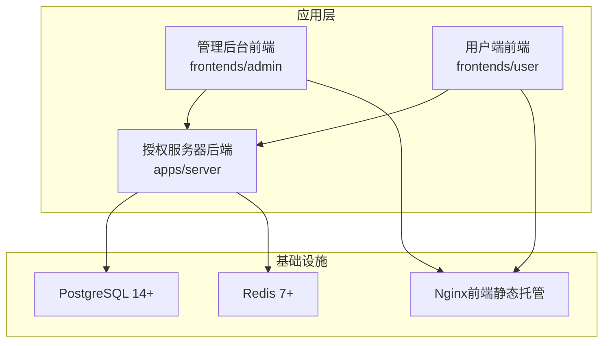
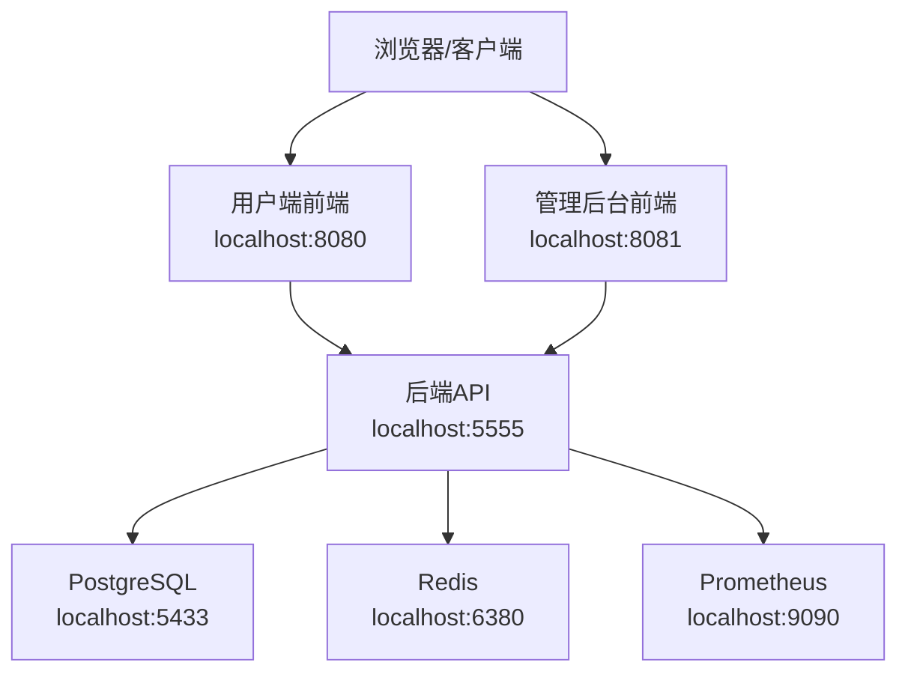
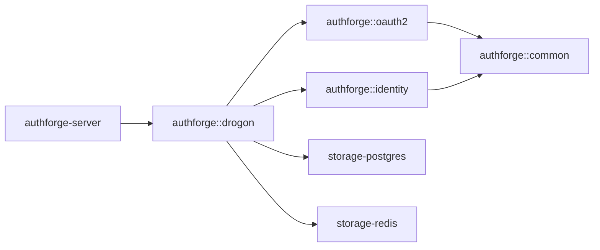

# 快速开始

<cite>
**本文引用的文件**
- [README.zh-CN.md](file://README.zh-CN.md)
- [deploy/docker/docker-compose.yml](file://deploy/docker/docker-compose.yml)
- [deploy/docker/Dockerfile](file://deploy/docker/Dockerfile)
- [deploy/env/docker.env.example](file://deploy/env/docker.env.example)
- [apps/server/config/config.json](file://apps/server/config/config.json)
- [scripts/backend/setup-database.sh](file://scripts/backend/setup-database.sh)
- [scripts/backend/setup_database.bat](file://scripts/backend/setup_database.bat)
- [apps/server/seed/dev_admin_user.sql](file://apps/server/seed/dev_admin_user.sql)
- [CMakePresets.json](file://CMakePresets.json)
- [conanfile.py](file://conanfile.py)
- [docs/backend/sdk-integration-guide.md](file://docs/backend/sdk-integration-guide.md)
</cite>

## 目录
1. [简介](#简介)
2. [项目结构](#项目结构)
3. [核心组件](#核心组件)
4. [架构总览](#架构总览)
5. [详细组件分析](#详细组件分析)
6. [依赖分析](#依赖分析)
7. [性能注意事项](#性能注意事项)
8. [故障排除指南](#故障排除指南)
9. [结论](#结论)
10. [附录](#附录)

## 简介
本指南面向首次接触 AuthForge 的用户，目标是帮助你在最短时间内完成本地环境搭建、服务启动与基本使用。你将学到三种部署路径：
- Docker Compose 部署（推荐用于评估）
- 从源码构建并运行
- 作为 SDK 集成到你的 C++ 宿主

同时会说明环境要求、依赖安装、数据库初始化、默认管理员账户与常用操作入口，以及常见问题排查方法。

## 项目结构
AuthForge 由后端授权服务器、管理后台前端、用户端前端、SDK 库包、部署脚本与文档组成。关键目录职责如下：
- apps/server：授权服务器后端（基于 Drogon C++ 框架）
- frontends/admin：管理后台前端（Vue 3 + TailwindCSS）
- frontends/user：用户端前端（Vue 3 + Vite）
- deploy：Docker Compose、Helm、Nginx、可观测性配置
- libs：SDK 库包（common/oauth2/identity/storage-*等）
- scripts：构建、测试、运维脚本
- docs：项目文档

图表来源
- [deploy/docker/docker-compose.yml:1-127](file://deploy/docker/docker-compose.yml#L1-L127)
- [deploy/docker/Dockerfile:48-99](file://deploy/docker/Dockerfile#L48-L99)

章节来源
- [README.zh-CN.md:16-65](file://README.zh-CN.md#L16-L65)

## 核心组件
- 授权服务器后端：提供 OAuth2/OIDC 协议能力、用户认证、RBAC、审计日志、健康检查等。
- 管理后台前端：用于管理应用、用户、角色、Scope、Token、组织、审计日志等。
- 用户端前端：用户自助服务（登录、注册、密码重置、MFA、WebAuthn、已授权应用管理等）。
- 存储与缓存：PostgreSQL 持久化数据；Redis 缓存会话、令牌等。
- 可观测性：Prometheus 指标导出与健康检查端点。

章节来源
- [README.zh-CN.md:68-134](file://README.zh-CN.md#L68-L134)
- [apps/server/config/config.json:133-171](file://apps/server/config/config.json#L133-L171)

## 架构总览
下图展示了三种部署路径下的组件交互关系与端口映射。

图表来源
- [deploy/docker/docker-compose.yml:1-127](file://deploy/docker/docker-compose.yml#L1-L127)

章节来源
- [deploy/docker/docker-compose.yml:1-127](file://deploy/docker/docker-compose.yml#L1-L127)

## 详细组件分析

### 路径A：Docker Compose 部署（推荐用于评估）
适用场景：快速体验全栈功能，无需本地安装数据库和 Node.js。

步骤
1. 确保已安装 Docker（建议 24+）。
2. 在仓库根目录执行：
   - docker compose -f deploy/docker/docker-compose.yml up -d --build
3. 等待服务就绪后访问：
   - 用户端前端：http://localhost:8080
   - 管理后台前端：http://localhost:8081
   - 后端API：http://localhost:5555
4. 默认管理员账户：
   - 用户名：admin
   - 密码：admin
   - 角色：admin

预期输出
- 浏览器能打开用户端与管理后台页面
- 后端健康检查可用（如 /health）
- Prometheus 指标页面可用（localhost:9090）

章节来源
- [README.zh-CN.md:137-148](file://README.zh-CN.md#L137-L148)
- [deploy/docker/docker-compose.yml:1-127](file://deploy/docker/docker-compose.yml#L1-L127)
- [apps/server/seed/dev_admin_user.sql:1-21](file://apps/server/seed/dev_admin_user.sql#L1-L21)

### 路径B：从源码构建
适用场景：开发者需要修改代码或自定义构建流程。

环境要求
- C++ 编译器：C++17（MSVC 2019+/GCC 9+/Clang 10+）
- CMake：3.21+
- PostgreSQL：14+
- Redis：7+
- Node.js：18+
- Conan 2.x（用于解析 C/C++ 依赖）

构建步骤（Linux/macOS）
1. 解析依赖（Conan）：
   - conan install . --output-folder=build/linux-release --build=missing -s build_type=Release -s compiler.cppstd=17
2. 配置与构建（CMake Preset）：
   - cmake --preset linux-release
   - cmake --build --preset linux-release
3. 运行后端测试套件：
   - ctest --test-dir build/linux-release --output-on-failure

本地运行全栈
- 后端：需先准备 PostgreSQL 与 Redis，然后运行编译产物
- 管理后台前端：cd frontends/admin && npm install && npm run dev（默认 http://localhost:5174/admin/）
- 用户端前端：cd frontends/user && npm install && npm run dev（默认 http://localhost:5173）

数据库初始化（本地 PostgreSQL）
- Linux/macOS：scripts/backend/setup-database.sh
- Windows：scripts/backend/setup_database.bat

注意
- 脚本会创建数据库、应用迁移脚本与种子数据（包含默认管理员账户）
- 若 psql 未加入 PATH，请先安装 PostgreSQL 客户端工具

章节来源
- [README.zh-CN.md:149-181](file://README.zh-CN.md#L149-L181)
- [CMakePresets.json:1-234](file://CMakePresets.json#L1-L234)
- [conanfile.py:1-83](file://conanfile.py#L1-L83)
- [scripts/backend/setup-database.sh:1-66](file://scripts/backend/setup-database.sh#L1-L66)
- [scripts/backend/setup_database.bat:1-36](file://scripts/backend/setup_database.bat#L1-L36)
- [apps/server/seed/dev_admin_user.sql:1-21](file://apps/server/seed/dev_admin_user.sql#L1-L21)

### 路径C：作为 SDK 集成
适用场景：将 AuthForge 嵌入你的 C++ 宿主工程，复用其 OAuth2/OIDC 引擎或完整 HTTP 宿主能力。

前置条件
- 使用仓库的 conanfile.py 与 conan.lock 解析依赖，保证与发布一致
- v1.x 承诺源码级 SemVer，不承诺二进制 ABI；如需稳定 ABI，建议使用源码集成方式

集成步骤（示例）
1. 解包 SDK 或从源码安装（cmake --install）
2. 用 Conan 解析依赖生成 toolchain
3. 在你的工程中通过 find_package 引用：
   - 全栈宿主：find_package(authforge-drogon CONFIG REQUIRED)
   - 仅引擎面：find_package(authforge-oauth2 CONFIG REQUIRED) + find_package(authforge-storage-memory CONFIG REQUIRED)

参考消费方
- examples/full-stack-host：完整 HTTP 宿主，复用 controllers/views
- examples/third-party-host：最小引擎消费方

章节来源
- [docs/backend/sdk-integration-guide.md:1-133](file://docs/backend/sdk-integration-guide.md#L1-L133)
- [README.zh-CN.md:183-199](file://README.zh-CN.md#L183-L199)

## 依赖分析
- 后端依赖：Drogon（HTTP 框架）、OpenSSL、jsoncpp、hiredis、libcurl、brotli、zlib 等
- 运行时依赖：PostgreSQL 14+、Redis 7+
- 前端依赖：Node.js 18+、npm/yarn
- 容器镜像：backend-runtime、frontend-runtime、admin（nginx 静态托管）

图表来源
- [README.zh-CN.md:31-51](file://README.zh-CN.md#L31-L51)
- [conanfile.py:54-68](file://conanfile.py#L54-L68)

章节来源
- [conanfile.py:1-83](file://conanfile.py#L1-L83)
- [README.zh-CN.md:31-65](file://README.zh-CN.md#L31-L65)

## 性能注意事项
- 生产环境建议启用 HTTPS、固定签发密钥、严格校验环境变量（生产模式）
- 合理设置连接池大小、超时与压缩选项（config.json 中 app 与 db_clients/redis_clients）
- 开启 Prometheus 指标采集，监控 QPS、延迟、错误率
- 前端静态资源通过 Nginx 缓存与压缩提升加载速度

章节来源
- [apps/server/config/config.json:1-132](file://apps/server/config/config.json#L1-L132)
- [deploy/env/docker.env.example:1-89](file://deploy/env/docker.env.example#L1-L89)

## 故障排除指南
常见问题与处理建议
- 无法访问前端页面
  - 确认端口映射正确（8080/8081），防火墙放行
  - 检查 compose 服务是否全部 healthy
- 后端无法连接数据库
  - 检查 OAUTH2_DB_HOST/PORT/NAME/USER/PASSWORD 是否与 PostgreSQL 一致
  - 确认数据库已创建且迁移已执行
- 无法连接 Redis
  - 检查 OAUTH2_REDIS_HOST/PORT/PASSWORD 是否正确
  - 确认 Redis 服务已启动且密码匹配
- 管理后台登录失败
  - 确认种子数据已导入（包含默认管理员账户）
  - 若手动重建数据库，请重新执行迁移与种子脚本
- 构建失败
  - 确认 Conan 版本为 2.x，CMake 版本满足要求
  - 清理构建目录后重试 conan install 与 cmake 配置

章节来源
- [scripts/backend/setup-database.sh:1-66](file://scripts/backend/setup-database.sh#L1-L66)
- [scripts/backend/setup_database.bat:1-36](file://scripts/backend/setup_database.bat#L1-L36)
- [deploy/docker/docker-compose.yml:67-103](file://deploy/docker/docker-compose.yml#L67-L103)
- [apps/server/seed/dev_admin_user.sql:1-21](file://apps/server/seed/dev_admin_user.sql#L1-L21)

## 结论
通过 Docker Compose，你可以在几分钟内启动完整的 AuthForge 环境；对于开发者，源码构建提供了更高的灵活性与可控性；对于需要将认证能力嵌入自身系统的团队，SDK 集成是最轻量的选择。建议评估阶段优先使用 Docker Compose，生产环境结合 Helm 与严格的配置管理进行部署。

## 附录

### 环境要求速查
- C++ 编译器：C++17（MSVC 2019+/GCC 9+/Clang 10+）
- CMake：3.21+
- PostgreSQL：14+
- Redis：7+
- Node.js：18+
- Docker：24+（可选）

章节来源
- [README.zh-CN.md:308-318](file://README.zh-CN.md#L308-L318)

### 默认管理员账户与基本操作
- 默认管理员：用户名 admin，密码 admin，角色 admin
- 管理后台地址：http://localhost:8081/admin/
- 用户端地址：http://localhost:8080
- 后端API地址：http://localhost:5555

章节来源
- [README.zh-CN.md:200-205](file://README.zh-CN.md#L200-L205)
- [deploy/docker/docker-compose.yml:1-127](file://deploy/docker/docker-compose.yml#L1-L127)

### 本地开发环境搭建清单
- 安装并启动 PostgreSQL 与 Redis
- 执行数据库初始化脚本（迁移与种子数据）
- 启动后端服务（编译产物或容器）
- 启动前端开发服务器（管理后台与用户端）
- 访问对应端口验证服务可用性

章节来源
- [scripts/backend/setup-database.sh:1-66](file://scripts/backend/setup-database.sh#L1-L66)
- [scripts/backend/setup_database.bat:1-36](file://scripts/backend/setup_database.bat#L1-L36)
- [README.zh-CN.md:169-181](file://README.zh-CN.md#L169-L181)