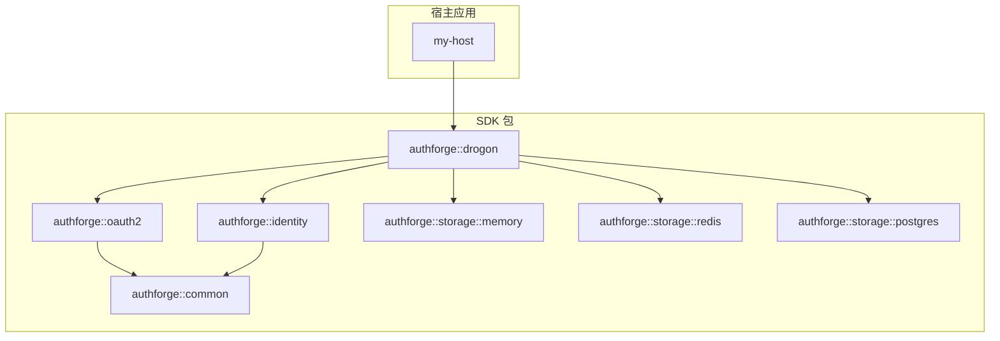
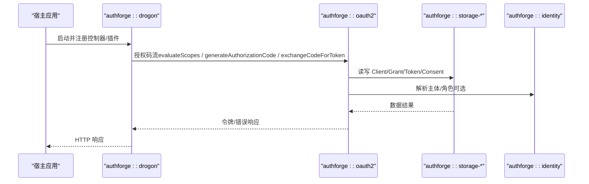
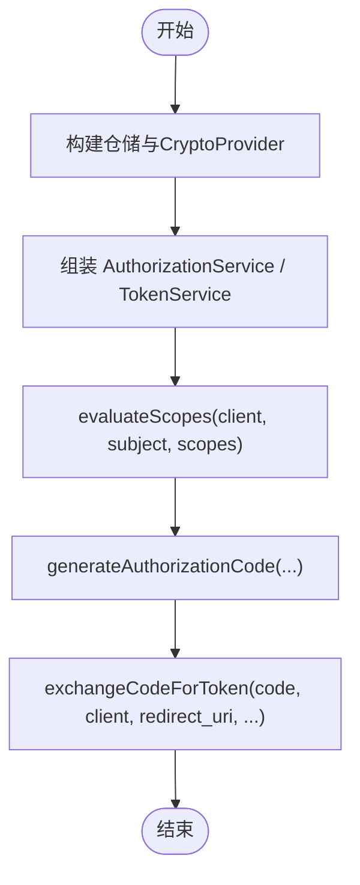
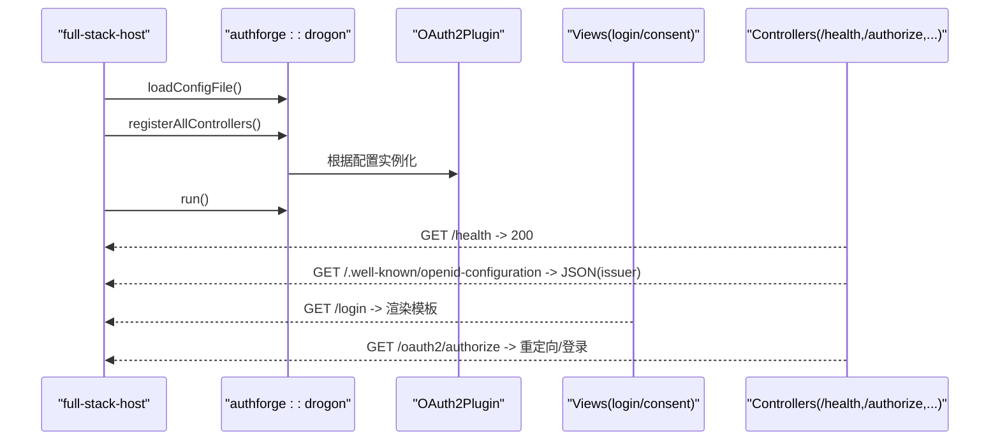
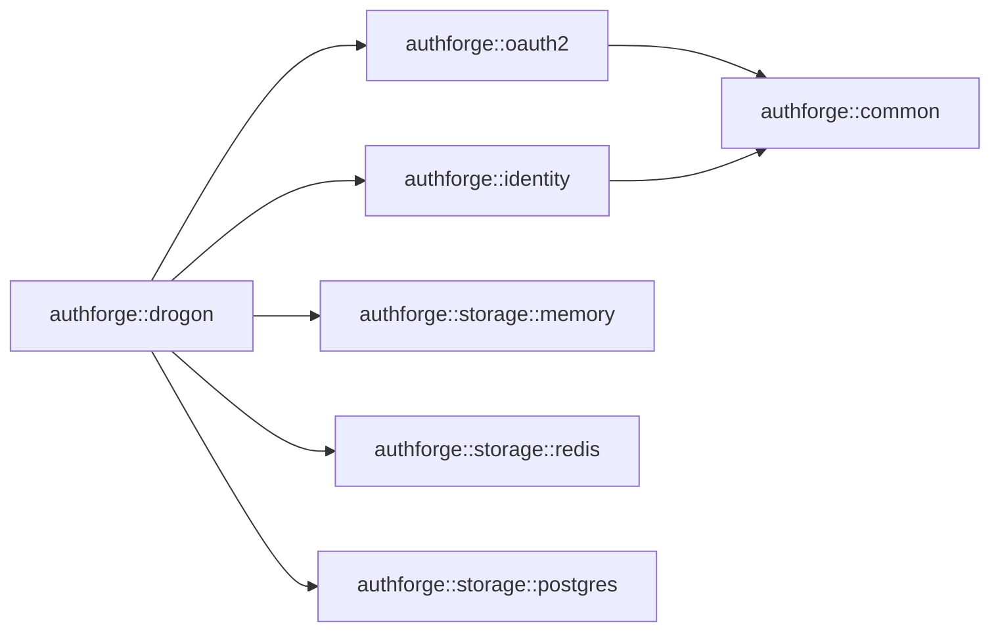

# SDK集成

<cite>
**本文引用的文件**
- [README.md](file://README.md)
- [sdk-integration-guide.md](file://docs/backend/sdk-integration-guide.md)
- [sdk-runtime-contract.md](file://docs/backend/sdk-runtime-contract.md)
- [CMakeLists.txt（根）](file://CMakeLists.txt)
- [AuthForgePackage.cmake](file://cmake/AuthForgePackage.cmake)
- [Version.cmake](file://cmake/Version.cmake)
- [third-party-host 示例 CMakeLists.txt](file://examples/third-party-host/CMakeLists.txt)
- [third-party-host 示例 main.cc](file://examples/third-party-host/src/main.cc)
- [full-stack-host 示例 CMakeLists.txt](file://examples/full-stack-host/CMakeLists.txt)
- [full-stack-host 示例 main.cc](file://examples/full-stack-host/src/main.cc)
- [libs/oauth2 CMakeLists.txt](file://libs/oauth2/CMakeLists.txt)
</cite>

## 目录
1. [简介](#简介)
2. [项目结构](#项目结构)
3. [核心组件](#核心组件)
4. [架构总览](#架构总览)
5. [详细组件分析](#详细组件分析)
6. [依赖分析](#依赖分析)
7. [性能考虑](#性能考虑)
8. [故障排查指南](#故障排查指南)
9. [结论](#结论)
10. [附录](#附录)

## 简介
本指南面向希望将 AuthForge 作为可嵌入 C++ SDK 集成的第三方宿主应用。内容涵盖：
- 使用 find_package 进行 CMake 集成与依赖管理、链接选项
- 第三方主机集成示例（最小引擎消费与全栈 HTTP 宿主）
- SDK 核心功能：OAuth2/OIDC 客户端流程、令牌管理与用户认证
- 配置选项、错误处理与最佳实践
- 版本兼容性与升级指导

## 项目结构
AuthForge 采用分层架构，SDK 以多个 CMake 包形式发布，支持通过 find_package 按需引入：
- authforge::common：共享内核与端口抽象
- authforge::oauth2：OAuth2/OIDC 协议引擎
- authforge::identity：身份、MFA、RBAC 等能力
- authforge::storage-*：存储适配器（内存/Redis/Postgres）
- authforge::drogon：Drogon 适配层（插件、控制器、视图）

图表来源
- [CMakeLists.txt（根）:62-118](file://CMakeLists.txt#L62-L118)
- [libs/oauth2 CMakeLists.txt:44-88](file://libs/oauth2/CMakeLists.txt#L44-L88)

章节来源
- [README.md:16-51](file://README.md#L16-L51)
- [CMakeLists.txt（根）:62-118](file://CMakeLists.txt#L62-L118)

## 核心组件
- 协议引擎（authforge::oauth2）
  - 提供 AuthorizationService、TokenService、ScopeDecisionEngine 等核心能力
  - 纯领域逻辑，零 Drogon 依赖，便于独立集成
- 存储适配器（authforge::storage-*）
  - 内存、Redis、Postgres 三种后端实现，统一接口
- 身份服务（authforge::identity）
  - 用户认证、MFA、WebAuthn、RBAC、会话管理等
- Drogon 适配层（authforge::drogon）
  - 插件、控制器、视图与 HTTP 路由装配

章节来源
- [libs/oauth2 CMakeLists.txt:3-21](file://libs/oauth2/CMakeLists.txt#L3-L21)
- [CMakeLists.txt（根）:79-118](file://CMakeLists.txt#L79-L118)

## 架构总览
下图展示了从宿主到 SDK 各层的调用关系与依赖方向，强调 Domain 层不依赖 Drogon，且通过存储抽象解耦持久化。

图表来源
- [full-stack-host 示例 main.cc:82-106](file://examples/full-stack-host/src/main.cc#L82-L106)
- [third-party-host 示例 main.cc:96-101](file://examples/third-party-host/src/main.cc#L96-L101)
- [libs/oauth2 CMakeLists.txt:44-57](file://libs/oauth2/CMakeLists.txt#L44-L57)

## 详细组件分析

### 通过 find_package 集成 SDK
- 获取 SDK 包或从源码安装树中消费
- 使用仓库的 conanfile.py + conan.lock 解析依赖，确保工具链与闭包一致
- 在 CMake 中通过 find_package 引入所需包，并通过 target_link_libraries 链接

关键要点
- 全栈宿主：find_package(authforge-drogon)，自动拉取完整依赖闭包
- 仅引擎面：find_package(authforge-oauth2) + storage-memory，无 Drogon 依赖
- 版本兼容：SameMajorVersion，可通过 major 锁定

章节来源
- [sdk-integration-guide.md:25-71](file://docs/backend/sdk-integration-guide.md#L25-L71)
- [CMakeLists.txt（根）:128-170](file://CMakeLists.txt#L128-L170)

### 第三方主机集成示例（最小引擎消费）
该示例证明无需产品级 OAuth2Plugin/Drogon，仅通过 SDK 包即可组装 Domain 层并运行授权码流程的核心步骤：
- evaluateScopes：范围决策
- generateAuthorizationCode：发放授权码
- exchangeCodeForToken：换取访问令牌/刷新令牌

集成步骤
- 链接目标：authforge::oauth2、authforge::common、authforge::common::testing、authforge::storage::memory
- 构造仓储与加密提供者，组装 AuthorizationService 与 TokenService
- 调用上述三个核心方法完成端到端验证

图表来源
- [third-party-host 示例 main.cc:71-185](file://examples/third-party-host/src/main.cc#L71-L185)
- [third-party-host 示例 CMakeLists.txt:32-38](file://examples/third-party-host/CMakeLists.txt#L32-L38)

章节来源
- [third-party-host 示例 README.md:1-47](file://examples/third-party-host/README.md#L1-L47)
- [third-party-host 示例 main.cc:71-185](file://examples/third-party-host/src/main.cc#L71-L185)

### 全栈 HTTP 宿主示例（复用产品栈）
该示例通过 find_package 消费整个产品栈，启动真实 HTTP 服务器，复用控制器、OAuth2Plugin 与视图，并在进程内驱动授权码流程进行冒烟测试。

集成步骤
- find_package(authforge-drogon) + Drogon::Drogon + OpenSSL::Crypto
- 编译并嵌入视图（login.csp/consent.csp）
- 注册控制器、装配身份服务、启动事件循环
- 发起 HTTP 请求验证健康检查、发现文档、登录视图渲染与授权入口

图表来源
- [full-stack-host 示例 CMakeLists.txt:28-67](file://examples/full-stack-host/CMakeLists.txt#L28-L67)
- [full-stack-host 示例 main.cc:67-197](file://examples/full-stack-host/src/main.cc#L67-L197)

章节来源
- [full-stack-host 示例 CMakeLists.txt:1-89](file://examples/full-stack-host/CMakeLists.txt#L1-L89)
- [full-stack-host 示例 main.cc:1-212](file://examples/full-stack-host/src/main.cc#L1-L212)

### 核心功能使用：OAuth2/OIDC 客户端流程、令牌管理与用户认证
- 授权码流程（含 PKCE）
  - evaluateScopes：校验客户端、范围与同意策略
  - generateAuthorizationCode：生成授权码（支持 code_challenge/code_challenge_method）
  - exchangeCodeForToken：用授权码换取 access_token/refresh_token
- 令牌管理
  - 令牌过期时间、刷新令牌家族、撤销与探测（API 层面）
- 用户认证
  - 用户名/密码、邮箱验证、MFA（TOTP）、WebAuthn（FIDO2）、社交登录（Google/WeChat/GitHub）

章节来源
- [README.md:70-98](file://README.md#L70-L98)
- [third-party-host 示例 main.cc:105-185](file://examples/third-party-host/src/main.cc#L105-L185)

### 配置选项
- 存储类型：memory/redis/postgres（通过配置文件指定）
- 插件配置：plugins[].name = "OAuth2Plugin"，config 块 schema 稳定
- 特性开关：WITH_IDENTITY/WITH_SOCIAL/WITH_WEBAUTHN 裁剪编译面
- 运行时参数：数据库/缓存连接、迁移开关、签发者地址、令牌 TTL 等

章节来源
- [sdk-integration-guide.md:80-100](file://docs/backend/sdk-integration-guide.md#L80-L100)
- [CMakeLists.txt（根）:33-55](file://CMakeLists.txt#L33-L55)

### 错误处理与最佳实践
- 线程模型
  - Domain 服务不自持事件循环；回调可能在任意 IO 线程触发，消费者需自行线程调度
- 异常安全约定
  - 业务失败通过 Result<T, Error> 返回；仅在不可恢复编程错误抛异常
  - 存储底层异常在 Adapter 层捕获并转为 Error，Domain 回调内无需 try/catch
- 日志抽象
  - 通过 ILogger 输出，默认由 Drogon 适配实现；非 Drogon 宿主可注入自定义实现
- 生命周期
  - 服务对象持有 shared_ptr 仓储句柄；异步续体捕获 self，避免悬垂引用

章节来源
- [sdk-runtime-contract.md:12-47](file://docs/backend/sdk-runtime-contract.md#L12-L47)

### 版本兼容性与升级指导
- v1.x 承诺源码级 SemVer（公共头 include/authforge/**），不承诺二进制 ABI
- 跨编译器/STL 混用预编译二进制不在支持范围；建议源码集成
- 弃用流程：[[deprecated]] 标注 + 至少一个 minor 周期过渡后方可移除
- 版本来源：单一事实源 cmake/Version.cmake，CI 强制一致性

章节来源
- [sdk-runtime-contract.md:24-31](file://docs/backend/sdk-runtime-contract.md#L24-L31)
- [Version.cmake:1-14](file://cmake/Version.cmake#L1-L14)

## 依赖分析
SDK 包导出与依赖闭包由 CMake 模块统一管理，确保 find_package 能正确解析传递依赖。

图表来源
- [AuthForgePackage.cmake:77-136](file://cmake/AuthForgePackage.cmake#L77-L136)
- [libs/oauth2 CMakeLists.txt:56-88](file://libs/oauth2/CMakeLists.txt#L56-L88)

章节来源
- [AuthForgePackage.cmake:1-138](file://cmake/AuthForgePackage.cmake#L1-L138)
- [CMakeLists.txt（根）:62-118](file://CMakeLists.txt#L62-L118)

## 性能考虑
- 存储选择：内存适合快速冒烟与测试；生产建议使用 Redis/Postgres 以获得更好吞吐与持久性
- 令牌 TTL：合理设置 access_token/refresh_token 过期时间，平衡安全性与用户体验
- 并发与回调：注意回调线程亲和性，必要时在宿主侧做线程切换
- 资源释放：避免在服务对象中使用裸指针或栈分配导致生命周期问题

[本节为通用指导，不直接分析具体文件]

## 故障排查指南
常见问题与定位要点
- 找不到插件或控制器
  - 确认已通过 bootstrap::registerAllControllers() 注册控制器
  - 检查配置文件中的 plugins[].name 是否为 "OAuth2Plugin"
- 发现文档缺失 issuer
  - 确认 OAuth2Plugin 已按配置实例化并成功装配
- 视图未渲染
  - 确认 drogon_create_views 已将模板编译进二进制
- 授权码流程失败
  - 检查客户端配置（client_id、redirect_uri、allowed_scopes）
  - 核对 evaluateScopes 是否报错或需要同意
- 存储相关异常
  - 确认 Adapter 层已捕获并转换为 Error；Domain 回调内无需额外 try/catch

章节来源
- [full-stack-host 示例 main.cc:82-197](file://examples/full-stack-host/src/main.cc#L82-L197)
- [sdk-runtime-contract.md:33-47](file://docs/backend/sdk-runtime-contract.md#L33-L47)

## 结论
AuthForge SDK 提供了清晰的层次化设计与稳定的源码级 API 契约，支持通过 find_package 灵活集成。最小引擎消费示例证明了在无 Drogon 的情况下也能运行授权码流程核心步骤；全栈宿主示例则展示了如何复用产品栈快速搭建 HTTP 服务。遵循线程模型、异常安全约定与配置最佳实践，可在现有 C++ 应用中安全、高效地嵌入 AuthForge。

[本节为总结，不直接分析具体文件]

## 附录

### 集成清单与步骤（快速参考）
- 准备环境
  - 使用仓库的 conanfile.py + conan.lock 解析依赖
  - 设置 CMAKE_TOOLCHAIN_FILE 与 CMAKE_PREFIX_PATH
- 选择集成方式
  - 全栈宿主：find_package(authforge-drogon)
  - 仅引擎面：find_package(authforge-oauth2) + storage-memory
- 链接目标
  - target_link_libraries(my-target PRIVATE authforge::...)
- 运行与验证
  - 最小引擎：运行 third-party-host-smoke 验证核心流程
  - 全栈宿主：运行 full-stack-host 冒烟测试

章节来源
- [sdk-integration-guide.md:35-71](file://docs/backend/sdk-integration-guide.md#L35-L71)
- [third-party-host 示例 CMakeLists.txt:32-38](file://examples/third-party-host/CMakeLists.txt#L32-L38)
- [full-stack-host 示例 CMakeLists.txt:28-67](file://examples/full-stack-host/CMakeLists.txt#L28-L67)