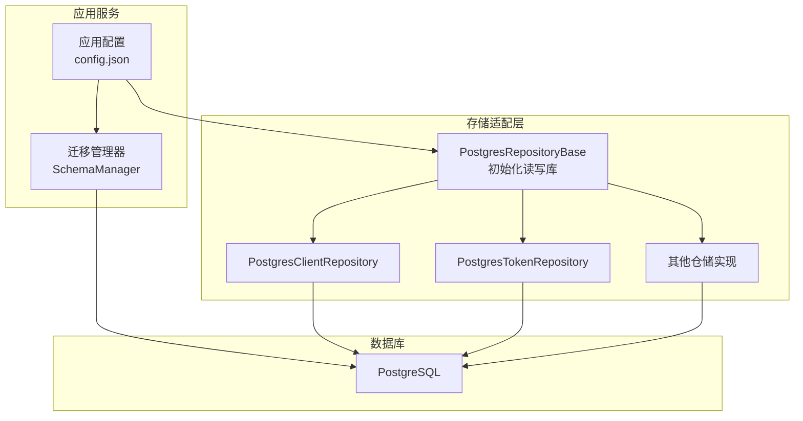
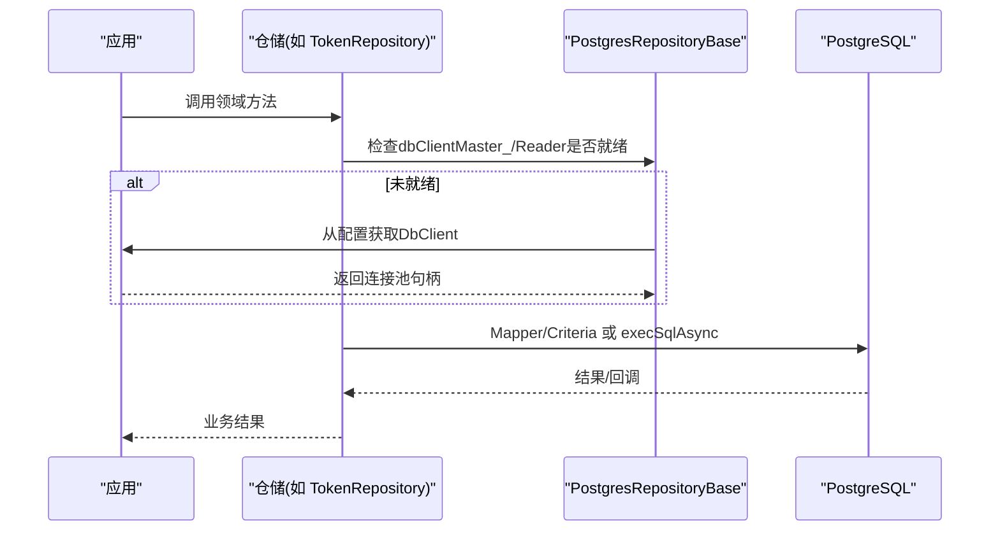
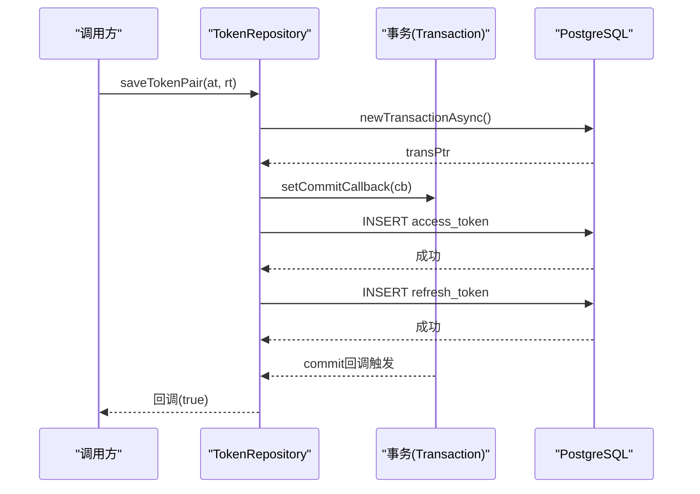
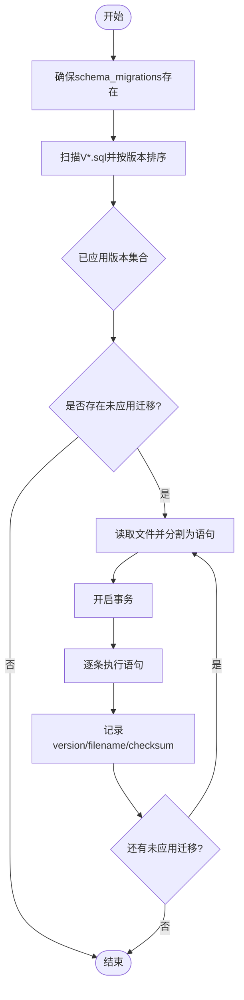
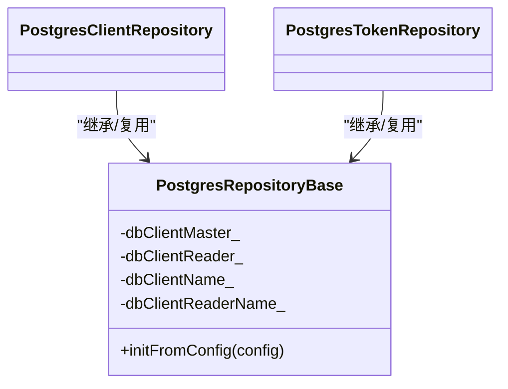

# PostgreSQL存储实现

<cite>
**本文引用的文件**
- [PostgresRepositoryBase.h](file://libs/storage-postgres/include/authforge/storage/postgres/PostgresRepositoryBase.h)
- [PostgresRepositoryBase.cc](file://libs/storage-postgres/src/PostgresRepositoryBase.cc)
- [PostgresClientRepository.cc](file://libs/storage-postgres/src/PostgresClientRepository.cc)
- [PostgresTokenRepository.cc](file://libs/storage-postgres/src/PostgresTokenRepository.cc)
- [SchemaManager.h](file://apps/server/src/SchemasManager.h)
- [SchemaManager.cc](file://apps/server/src/SchemasManager.cc)
- [config.json](file://apps/server/config/config.json)
- [V001__schema_migrations.sql](file://apps/server/migrations/V001__schema_migrations.sql)
- [SKILL.md（ORM模型生成）](file://.claude/skills/orm-gen/SKILL.md)
- [DbLeakVerificationTest.cc](file://tests/security/injection/DbLeakVerificationTest.cc)
</cite>

## 目录
1. [简介](#简介)
2. [项目结构](#项目结构)
3. [核心组件](#核心组件)
4. [架构总览](#架构总览)
5. [详细组件分析](#详细组件分析)
6. [依赖关系分析](#依赖关系分析)
7. [性能考虑](#性能考虑)
8. [故障排查指南](#故障排查指南)
9. [结论](#结论)
10. [附录](#附录)

## 简介
本文件面向PostgreSQL存储适配器的架构与实现，覆盖数据模型映射、查询构建与SQL生成、连接池配置、事务管理与并发控制、迁移脚本管理、错误处理与重试策略、以及性能优化与最佳实践。目标是帮助读者快速理解并高效使用基于Drogon ORM的PostgreSQL存储层。

## 项目结构
PostgreSQL存储实现位于 libs/storage-postgres，采用“仓储”模式拆分：每个聚合域（客户端、令牌、授权码、同意记录、身份、MFA、社交账号、WebAuthn等）对应一个仓库实现，共享基础能力由 PostgresRepositoryBase 提供。应用启动时通过 SchemaManager 执行版本化迁移脚本，确保数据库结构与代码一致。

图表来源
- [config.json:9-27](file://apps/server/config/config.json#L9-L27)
- [SchemaManager.cc:175-233](file://apps/server/src/SchemasManager.cc#L175-L233)
- [PostgresRepositoryBase.cc:7-29](file://libs/storage-postgres/src/PostgresRepositoryBase.cc#L7-L29)

章节来源
- [config.json:9-27](file://apps/server/config/config.json#L9-L27)
- [SchemaManager.cc:175-233](file://apps/server/src/SchemasManager.cc#L175-L233)
- [PostgresRepositoryBase.cc:7-29](file://libs/storage-postgres/src/PostgresRepositoryBase.cc#L7-L29)

## 核心组件
- PostgresRepositoryBase：统一从配置中解析 db_client_name/db_client_reader，获取 Drogon DbClient 主从实例；各仓储复用该能力。
- 仓储实现：以 ClientRepository、TokenRepository 为代表，封装领域操作（查找、校验、保存、撤销、清理等）。
- 迁移管理器：负责 schema_migrations 表维护、扫描 V*.sql 脚本、按序执行并记录版本与校验和。
- ORM模型：由 drogon_ctl 根据数据库结构生成，仓储通过 Mapper/Criteria 进行类型安全查询与更新。

章节来源
- [PostgresRepositoryBase.h:49-70](file://libs/storage-postgres/include/authforge/storage/postgres/PostgresRepositoryBase.h#L49-L70)
- [PostgresRepositoryBase.cc:7-29](file://libs/storage-postgres/src/PostgresRepositoryBase.cc#L7-L29)
- [SchemaManager.h:20-96](file://apps/server/src/SchemasManager.h#L20-L96)
- [SKILL.md（ORM模型生成）:592-626](file://.claude/skills/orm-gen/SKILL.md#L592-L626)

## 架构总览
下图展示请求到数据库的关键路径：配置驱动连接池，仓储按需懒加载读写库，业务方法通过 ORM Mapper 或原生 SQL 访问数据库，迁移在启动阶段保证结构一致。

图表来源
- [PostgresRepositoryBase.cc:7-29](file://libs/storage-postgres/src/PostgresRepositoryBase.cc#L7-L29)
- [PostgresTokenRepository.cc:27-75](file://libs/storage-postgres/src/PostgresTokenRepository.cc#L27-L75)
- [PostgresClientRepository.cc:29-134](file://libs/storage-postgres/src/PostgresClientRepository.cc#L29-L134)

## 详细组件分析

### 连接池与读/写分离
- 连接池配置：通过 config.json 的 db_clients 数组定义多个连接池，包含 host/port/dbname/user/passwd、number_of_connections、timeout、auto_batch、statement_timeout 等。
- 读/写分离：仓储基类支持分别指定 master 与 reader 的连接池名称，默认均为 default；仓储内部对读操作优先走 reader，写操作走 master。
- 懒初始化：仓储方法内若发现 dbClientReader_ 为空，会尝试从全局 app 重新拉取，避免启动顺序导致的空指针。

章节来源
- [config.json:9-27](file://apps/server/config/config.json#L9-L27)
- [PostgresRepositoryBase.h:60-70](file://libs/storage-postgres/include/authforge/storage/postgres/PostgresRepositoryBase.h#L60-L70)
- [PostgresRepositoryBase.cc:7-29](file://libs/storage-postgres/src/PostgresRepositoryBase.cc#L7-L29)
- [PostgresClientRepository.cc:33-56](file://libs/storage-postgres/src/PostgresClientRepository.cc#L33-L56)

### ORM映射、查询构建器与SQL生成
- ORM模型：由 drogon_ctl 根据数据库表结构自动生成，包含列常量、主键类型、CRUD 接口等。
- 查询构建：仓储通过 Mapper<T> + Criteria 构造类型安全的查询条件，框架负责将条件转换为SQL。
- 原生SQL豁免：部分场景（批量操作、原子CAS、归档函数）直接使用 execSqlAsync，以提升性能或满足语义要求。

章节来源
- [SKILL.md（ORM模型生成）:592-626](file://.claude/skills/orm-gen/SKILL.md#L592-L626)
- [PostgresTokenRepository.cc:27-75](file://libs/storage-postgres/src/PostgresTokenRepository.cc#L27-L75)
- [PostgresTokenRepository.cc:408-450](file://libs/storage-postgres/src/PostgresTokenRepository.cc#L408-L450)

### 事务管理与并发控制
- 原子写入：saveTokenPair 使用 newTransactionAsync 获取事务，并在 commit 回调中通知调用方，确保两次插入的原子性与可见性。
- 死锁规避：在事件循环回调中禁止阻塞式事务获取，改用异步接口避免事件循环被阻塞导致死锁。
- CAS撤销：atomicRevokeRefreshToken 使用 UPDATE ... WHERE revoked=false RETURNING * 实现无锁并发下的唯一消费。
- 家族级撤销：revokeTokenFamily 先撤销刷新令牌，再级联撤销关联的访问令牌，保障一致性。

图表来源
- [PostgresTokenRepository.cc:77-227](file://libs/storage-postgres/src/PostgresTokenRepository.cc#L77-L227)

章节来源
- [PostgresTokenRepository.cc:77-227](file://libs/storage-postgres/src/PostgresTokenRepository.cc#L77-L227)
- [PostgresTokenRepository.cc:408-450](file://libs/storage-postgres/src/PostgresTokenRepository.cc#L408-L450)
- [PostgresTokenRepository.cc:452-496](file://libs/storage-postgres/src/PostgresTokenRepository.cc#L452-L496)

### 迁移脚本管理与版本控制
- 版本表：schema_migrations(version, filename, checksum, applied_at) 记录已执行的迁移。
- 扫描与排序：按 V{NNN}__描述.sql 命名规则扫描并按版本号升序执行。
- 语句分割：splitSqlStatements 支持单引号、块注释、行注释、美元引用体，避免误切分。
- 幂等与回滚：每条迁移在一个事务内执行多条语句，失败则整体回滚且不记录版本。
- 校验和：使用统一的SHA-256计算内容校验，跨平台稳定。

图表来源
- [SchemaManager.cc:175-233](file://apps/server/src/SchemasManager.cc#L175-L233)
- [SchemaManager.cc:274-293](file://apps/server/src/SchemasManager.cc#L274-L293)
- [SchemaManager.cc:295-333](file://apps/server/src/SchemasManager.cc#L295-L333)
- [SchemaManager.cc:353-411](file://apps/server/src/SchemasManager.cc#L353-L411)
- [SchemaManager.cc:413-423](file://apps/server/src/SchemasManager.cc#L413-L423)

章节来源
- [SchemaManager.h:20-96](file://apps/server/src/SchemasManager.h#L20-L96)
- [SchemaManager.cc:175-233](file://apps/server/src/SchemasManager.cc#L175-L233)
- [SchemaManager.cc:274-293](file://apps/server/src/SchemasManager.cc#L274-L293)
- [SchemaManager.cc:295-333](file://apps/server/src/SchemasManager.cc#L295-L333)
- [SchemaManager.cc:353-411](file://apps/server/src/SchemasManager.cc#L353-L411)
- [SchemaManager.cc:413-423](file://apps/server/src/SchemasManager.cc#L413-L423)
- [V001__schema_migrations.sql:1-9](file://apps/server/migrations/V001__schema_migrations.sql#L1-L9)

### 错误处理与重试机制
- 仓储层：所有数据库操作均包裹 try/catch，捕获异常后记录日志并通过回调返回安全状态（如 false 或 nullopt），避免上层崩溃。
- 迁移层：执行失败立即停止并记录错误，不记录版本，保证可重复运行。
- 重试策略：当前仓储未内置通用重试逻辑；建议在调用侧（控制器或服务层）针对瞬时网络/连接问题增加指数退避重试，并结合指标监控观察失败率。

章节来源
- [PostgresClientRepository.cc:136-258](file://libs/storage-postgres/src/PostgresClientRepository.cc#L136-L258)
- [PostgresTokenRepository.cc:27-75](file://libs/storage-postgres/src/PostgresTokenRepository.cc#L27-L75)
- [SchemaManager.cc:353-411](file://apps/server/src/SchemasManager.cc#L353-L411)

### 配置示例与最佳实践
- 连接池建议：
  - number_of_connections：根据并发QPS与平均延迟估算，通常设置为 CPU核数×2~4 倍，结合压测调优。
  - timeout：设置合理的 statement_timeout 防止长事务占用连接。
  - auto_batch：开启以提升批量写入吞吐。
- 读/写分离：
  - 生产环境建议配置独立的 reader 连接池，仅用于只读查询，降低写放大影响。
- 迁移：
  - 严格遵循 V{NNN}__描述.sql 命名规范，保持幂等与可重入。
  - 大变更拆分为多步迁移，减少单次事务体积。
- 安全：
  - 敏感信息通过环境变量注入，避免硬编码。
  - 使用参数化查询与ORM，避免SQL注入。

章节来源
- [config.json:9-27](file://apps/server/config/config.json#L9-L27)
- [PostgresRepositoryBase.cc:7-29](file://libs/storage-postgres/src/PostgresRepositoryBase.cc#L7-L29)

## 依赖关系分析
仓储与基础组件的依赖关系如下：

图表来源
- [PostgresRepositoryBase.h:49-70](file://libs/storage-postgres/include/authforge/storage/postgres/PostgresRepositoryBase.h#L49-L70)
- [PostgresClientRepository.cc:29-134](file://libs/storage-postgres/src/PostgresClientRepository.cc#L29-L134)
- [PostgresTokenRepository.cc:27-75](file://libs/storage-postgres/src/PostgresTokenRepository.cc#L27-L75)

章节来源
- [PostgresRepositoryBase.h:49-70](file://libs/storage-postgres/include/authforge/storage/postgres/PostgresRepositoryBase.h#L49-L70)
- [PostgresClientRepository.cc:29-134](file://libs/storage-postgres/src/PostgresClientRepository.cc#L29-L134)
- [PostgresTokenRepository.cc:27-75](file://libs/storage-postgres/src/PostgresTokenRepository.cc#L27-L75)

## 性能考虑
- 索引设计：
  - 为高频查询字段建立索引，如 oauth2_access_tokens(token)、oauth2_refresh_tokens(token)、oauth2_clients(client_id)。
  - 复合索引需覆盖常见过滤条件组合，避免回表。
- 查询优化：
  - 尽量使用 ORM Mapper/Criteria 生成高效查询；复杂批处理可使用原生SQL以减少往返。
  - 避免 SELECT *，仅选择必要字段。
- 连接池调优：
  - 根据压测调整 number_of_connections、timeout、statement_timeout。
  - 读写分离可降低写冲突，提升读吞吐。
- 事务与批处理：
  - 将多次写入合并到同一事务，减少提交开销。
  - 使用异步事务 newTransactionAsync 避免事件循环阻塞。

章节来源
- [PostgresTokenRepository.cc:77-227](file://libs/storage-postgres/src/PostgresTokenRepository.cc#L77-L227)
- [config.json:9-27](file://apps/server/config/config.json#L9-L27)

## 故障排查指南
- 连接泄漏检测：
  - 通过测试用例验证连接池行为，确认在高并发下不会耗尽连接。
- 迁移失败：
  - 检查 schema_migrations 表记录与磁盘脚本的一致性；查看日志中的错误堆栈定位具体语句。
- 查询超时：
  - 调整 statement_timeout 并检查慢查询与缺失索引。
- 并发冲突：
  - 关注 CAS 操作返回值，必要时在调用层增加重试与告警。

章节来源
- [DbLeakVerificationTest.cc:93-118](file://tests/security/injection/DbLeakVerificationTest.cc#L93-L118)
- [SchemaManager.cc:353-411](file://apps/server/src/SchemasManager.cc#L353-L411)

## 结论
PostgreSQL存储层基于Drogon ORM与仓储模式，提供了清晰的读写分离、事务与并发控制、版本化迁移与健壮的错误处理。配合合理的索引设计与连接池调优，可在高并发场景下保持稳定与高性能。建议在生产环境中启用读写分离、合理设置超时与连接池大小，并将迁移纳入CI/CD流程以确保一致性。

## 附录
- 常用命令与工具：
  - 使用 drogon_ctl 生成/更新 ORM 模型，确保与数据库结构同步。
  - 通过 psql 或迁移工具执行/回滚迁移脚本。
- 参考配置项：
  - db_clients.number_of_connections、timeout、auto_batch、connect_options.statement_timeout。

章节来源
- [SKILL.md（ORM模型生成）:592-626](file://.claude/skills/orm-gen/SKILL.md#L592-L626)
- [config.json:9-27](file://apps/server/config/config.json#L9-L27)