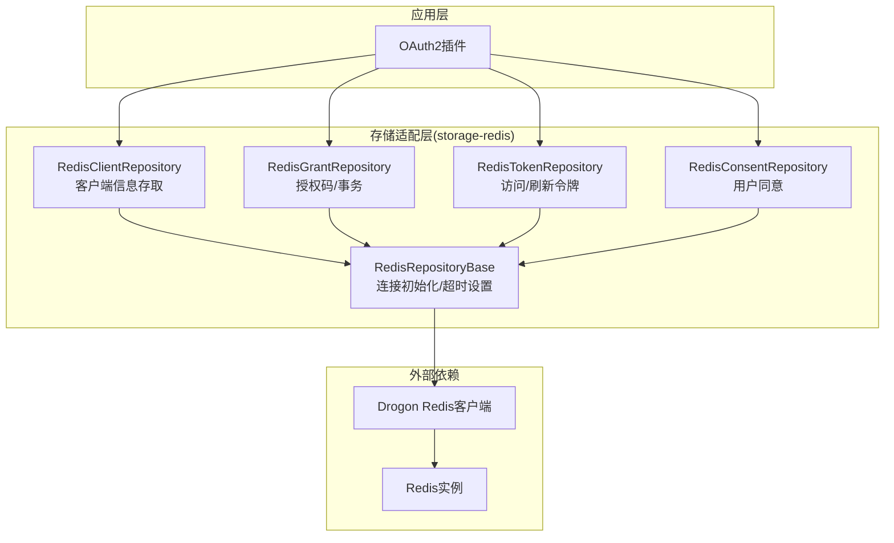
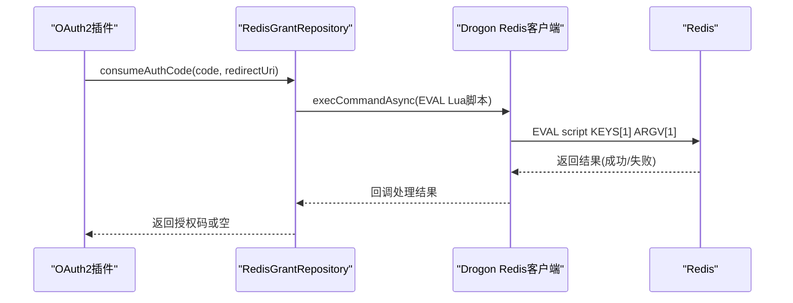
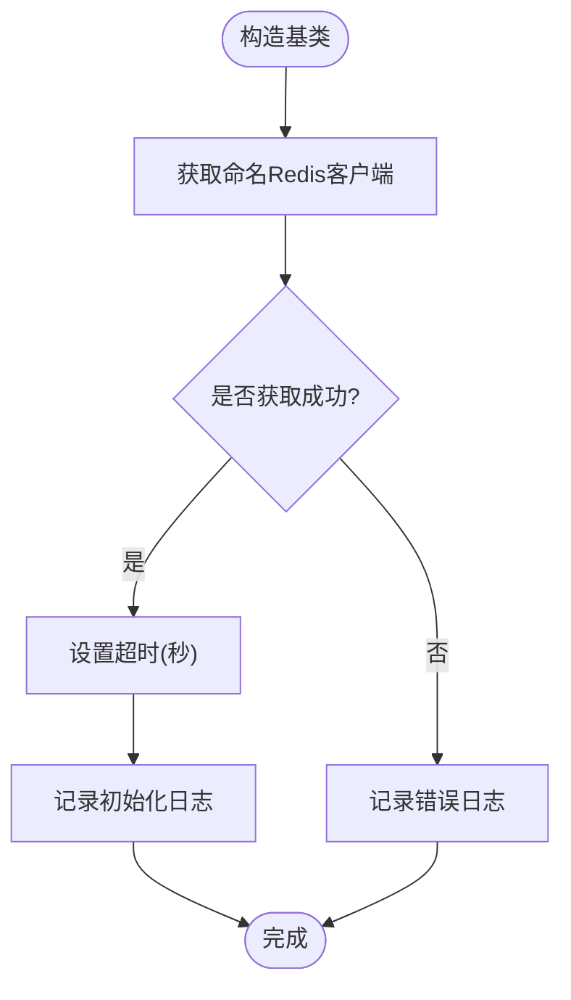
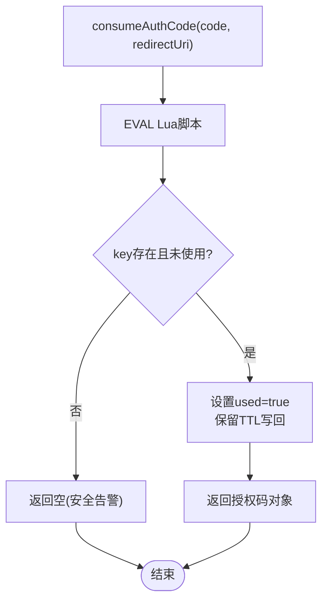
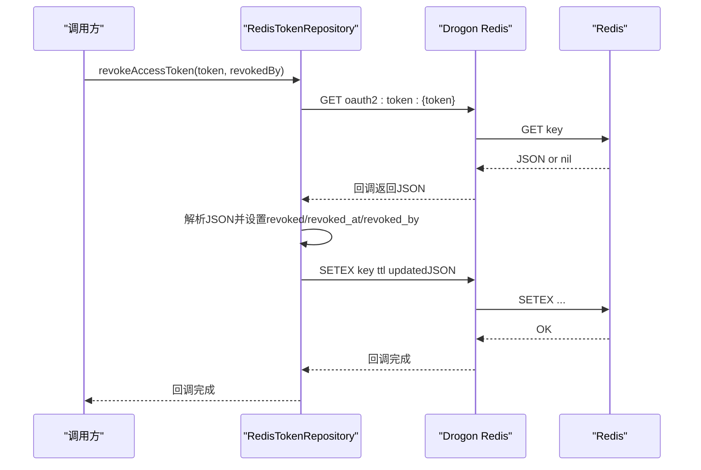
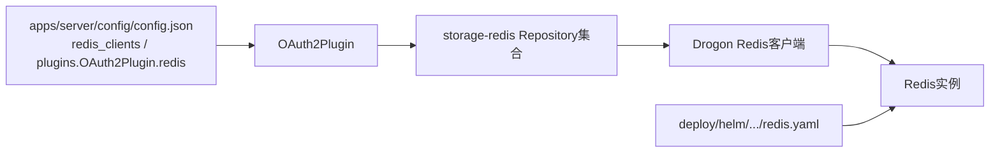

# Redis存储实现

<cite>
**本文引用的文件**
- [RedisRepositoryBase.cc](file://libs/storage-redis/src/RedisRepositoryBase.cc)
- [RedisClientRepository.cc](file://libs/storage-redis/src/RedisClientRepository.cc)
- [RedisTokenRepository.cc](file://libs/storage-redis/src/RedisTokenRepository.cc)
- [RedisGrantRepository.cc](file://libs/storage-redis/src/RedisGrantRepository.cc)
- [RedisConsentRepository.cc](file://libs/storage-redis/src/RedisConsentRepository.cc)
- [config.json](file://apps/server/config/config.json)
- [redis.yaml](file://deploy/helm/authforge/templates/redis.yaml)
</cite>

## 目录
1. [简介](#简介)
2. [项目结构](#项目结构)
3. [核心组件](#核心组件)
4. [架构总览](#架构总览)
5. [详细组件分析](#详细组件分析)
6. [依赖关系分析](#依赖关系分析)
7. [性能考虑](#性能考虑)
8. [故障排查指南](#故障排查指南)
9. [结论](#结论)
10. [附录](#附录)

## 简介
本文件面向AuthForge的Redis存储适配器，系统性阐述其设计原理、缓存策略、数据结构选型、连接与集群配置、故障转移、性能优化、监控指标、缓存预热、数据同步与备份恢复，以及部署最佳实践。内容基于仓库中storage-redis模块的实现与服务器配置、Helm部署模板进行归纳与说明。

## 项目结构
Redis存储适配位于 libs/storage-redis，按业务域拆分为多个Repository：
- 基础连接与生命周期管理：RedisRepositoryBase
- 客户端信息：RedisClientRepository
- 授权码与授权事务：RedisGrantRepository
- 访问令牌与刷新令牌：RedisTokenRepository
- 用户同意记录：RedisConsentRepository

这些组件通过Drogon的Redis客户端获取连接，使用异步命令执行回调模型，结合JSON序列化在Redis中以字符串形式持久化复杂对象。

图表来源
- [RedisRepositoryBase.cc:7-18](file://libs/storage-redis/src/RedisRepositoryBase.cc#L7-L18)
- [RedisClientRepository.cc:55-108](file://libs/storage-redis/src/RedisClientRepository.cc#L55-L108)
- [RedisGrantRepository.cc:48-91](file://libs/storage-redis/src/RedisGrantRepository.cc#L48-L91)
- [RedisTokenRepository.cc:49-97](file://libs/storage-redis/src/RedisTokenRepository.cc#L49-L97)
- [RedisConsentRepository.cc:16-50](file://libs/storage-redis/src/RedisConsentRepository.cc#L16-L50)

章节来源
- [RedisRepositoryBase.cc:7-18](file://libs/storage-redis/src/RedisRepositoryBase.cc#L7-L18)
- [config.json:28-40](file://apps/server/config/config.json#L28-L40)
- [redis.yaml:26-46](file://deploy/helm/authforge/templates/redis.yaml#L26-L46)

## 核心组件
- 连接与超时：所有Repository继承自RedisRepositoryBase，统一从Drogon应用获取命名Redis客户端并设置超时（秒级），失败时记录错误日志。
- 客户端存储：以Hash键“oauth2:client:{clientId}”存储客户端信息；校验时使用HMGET读取secret与salt，计算SHA256后常量时间比较，避免时序侧信道。
- 授权码与事务：授权码以String键“oauth2:code:{code}”+SETEX TTL存储；消费与标记已用通过Lua脚本原子更新，确保幂等与安全（含redirect_uri校验）。
- 令牌存储：访问令牌以String键“oauth2:token:{token}”+SETEX TTL存储；支持RFC 7662字段；撤销采用读改写再SET回的方式（非原子，但可接受为缓存语义）；刷新令牌在Redis模式下为无操作或仅维护家族集合标记。
- 用户同意：以EXISTS判断是否存在“oauth2:consent:{userId}:{clientId}:{scope}”，保存时写入带TTL的键，撤销时DEL。

章节来源
- [RedisRepositoryBase.cc:7-18](file://libs/storage-redis/src/RedisRepositoryBase.cc#L7-L18)
- [RedisClientRepository.cc:55-197](file://libs/storage-redis/src/RedisClientRepository.cc#L55-L197)
- [RedisGrantRepository.cc:48-268](file://libs/storage-redis/src/RedisGrantRepository.cc#L48-L268)
- [RedisTokenRepository.cc:49-429](file://libs/storage-redis/src/RedisTokenRepository.cc#L49-L429)
- [RedisConsentRepository.cc:16-118](file://libs/storage-redis/src/RedisConsentRepository.cc#L16-L118)

## 架构总览
Redis存储适配器作为OAuth2存储后端之一，通过Drogon提供的Redis客户端与Redis交互。各Repository封装了特定领域的CRUD与业务规则，利用JSON序列化承载复杂对象，并通过TTL机制实现过期清理。

图表来源
- [RedisGrantRepository.cc:184-268](file://libs/storage-redis/src/RedisGrantRepository.cc#L184-L268)

章节来源
- [RedisGrantRepository.cc:184-268](file://libs/storage-redis/src/RedisGrantRepository.cc#L184-L268)

## 详细组件分析

### 连接与生命周期（RedisRepositoryBase）
- 从Drogon应用获取命名Redis客户端，设置超时（秒），记录初始化日志。
- 若未获取到客户端，记录错误日志，后续Repository将因redisClient_为空而快速返回。

图表来源
- [RedisRepositoryBase.cc:7-18](file://libs/storage-redis/src/RedisRepositoryBase.cc#L7-L18)

章节来源
- [RedisRepositoryBase.cc:7-18](file://libs/storage-redis/src/RedisRepositoryBase.cc#L7-L18)

### 客户端存储与校验（RedisClientRepository）
- 存储：Hash键“oauth2:client:{clientId}”，包含secret哈希、salt、redirect_uris等。
- 读取：HGETALL解析为OAuth2Client对象。
- 校验：当提供secret时，HMGET secret与salt，拼接后计算SHA256，并进行常量时间比较；不提供secret时仅检查键是否存在。

```mermaid
sequenceDiagram
participant C as "调用方"
participant R as "RedisClientRepository"
participant D as "Drogon Redis"
participant S as "Redis"
C->>R : validateClient(clientId, clientSecret)
alt 提供secret
R->>D : HMGET oauth2 : client : {id} secret salt
D->>S : HMGET ...
S-->>D : [hash, salt]
D-->>R : 回调返回数组
R->>R : 计算SHA256 + 常量时间比较
else 不提供secret
R->>D : EXISTS oauth2 : client : {id}
D->>S : EXISTS ...
S-->>D : 1/0
D-->>R : 回调返回布尔
end
R-->>C : 回调返回验证结果
```

图表来源
- [RedisClientRepository.cc:110-197](file://libs/storage-redis/src/RedisClientRepository.cc#L110-L197)

章节来源
- [RedisClientRepository.cc:55-197](file://libs/storage-redis/src/RedisClientRepository.cc#L55-L197)

### 授权码与授权事务（RedisGrantRepository）
- 存储：String键“oauth2:code:{code}”+SETEX TTL；授权事务“oauth2:transaction:{id}”+SETEX TTL。
- 消费：EVAL Lua脚本原子读取、校验redirect_uri、标记used=true、保留TTL写回。
- 标记已用：EVAL脚本原子设置used=true并保留TTL。
- 事务状态：保存、读取、删除、标记consumed均通过Lua或原生命令保证一致性。

图表来源
- [RedisGrantRepository.cc:184-268](file://libs/storage-redis/src/RedisGrantRepository.cc#L184-L268)

章节来源
- [RedisGrantRepository.cc:48-268](file://libs/storage-redis/src/RedisGrantRepository.cc#L48-L268)
- [RedisGrantRepository.cc:272-468](file://libs/storage-redis/src/RedisGrantRepository.cc#L272-L468)

### 令牌存储与撤销（RedisTokenRepository）
- 访问令牌：String键“oauth2:token:{token}”+SETEX TTL；支持RFC 7662字段（issued_at、issuer、audience、not_before、introspect_count、revoked_at、revoked_by）。
- 刷新令牌：Redis模式下save/get为无操作；revoke通过HSET维护家族标记；atomicRevoke为两步逻辑（get then set），注释指出非原子。
- 撤销访问令牌：先GET JSON，修改revoked/revoked_at/revoked_by，再SETEX回写（非原子，但可接受为缓存语义）。
- 过期清理：依赖Redis TTL，purgeExpired为无操作。

图表来源
- [RedisTokenRepository.cc:347-416](file://libs/storage-redis/src/RedisTokenRepository.cc#L347-L416)

章节来源
- [RedisTokenRepository.cc:49-429](file://libs/storage-redis/src/RedisTokenRepository.cc#L49-L429)

### 用户同意（RedisConsentRepository）
- 查询：EXISTS“oauth2:consent:{userId}:{clientId}:{scope}”。
- 保存：SETEX设置键，TTL为30天。
- 撤销：DEL键。

章节来源
- [RedisConsentRepository.cc:16-118](file://libs/storage-redis/src/RedisConsentRepository.cc#L16-L118)

## 依赖关系分析
- 运行时依赖：Drogon应用提供Redis客户端；OAuth2插件通过配置选择存储类型与Redis客户端名称。
- 配置注入：服务器配置文件定义redis_clients列表，OAuth2Plugin通过redis.client_name引用具体客户端。
- 部署依赖：Helm模板提供Redis Deployment与Service，用于本地/演示环境；生产建议指向托管实例。

图表来源
- [config.json:28-40](file://apps/server/config/config.json#L28-L40)
- [config.json:142-170](file://apps/server/config/config.json#L142-L170)
- [redis.yaml:26-46](file://deploy/helm/authforge/templates/redis.yaml#L26-L46)

章节来源
- [config.json:28-40](file://apps/server/config/config.json#L28-L40)
- [config.json:142-170](file://apps/server/config/config.json#L142-L170)
- [redis.yaml:26-46](file://deploy/helm/authforge/templates/redis.yaml#L26-L46)

## 性能考虑
- 过期策略与清理
  - 授权码、访问令牌、授权事务均使用SETEX设置TTL，由Redis自身负责过期清理，无需额外定时任务。
  - 刷新令牌在Redis模式下不持久化主体数据，撤销通过家族集合标记，降低存储压力。
- 一致性保障
  - 授权码消费与标记使用通过Lua脚本原子执行，避免竞态条件。
  - 令牌撤销采用读改写再SET回，属于最终一致，适合缓存场景；如需强一致，可在上层引入分布式锁或迁移至Postgres。
- 内存与序列化
  - 复杂对象序列化为紧凑JSON，减少冗余；注意合理设置TTL控制内存占用。
- 批量与管道
  - 当前实现主要使用execCommandAsync单条命令；在高吞吐场景可考虑在调用方组装Pipeline批量操作以减少网络往返。
- 监控指标
  - 当前Redis存储层未直接上报OperationTimer指标（为避免循环依赖）；可通过Prometheus Exporter插件暴露服务整体指标。

章节来源
- [RedisGrantRepository.cc:48-91](file://libs/storage-redis/src/RedisGrantRepository.cc#L48-L91)
- [RedisTokenRepository.cc:49-97](file://libs/storage-redis/src/RedisTokenRepository.cc#L49-L97)
- [RedisTokenRepository.cc:347-416](file://libs/storage-redis/src/RedisTokenRepository.cc#L347-L416)
- [config.json:133-140](file://apps/server/config/config.json#L133-L140)

## 故障排查指南
- 连接失败或未初始化
  - 现象：Repository内部redisClient_为空，直接返回空或默认值。
  - 排查：确认Drogon应用已正确加载redis_clients配置；检查Redis实例可达性与认证。
- 客户端校验异常
  - 现象：validateClient返回false或崩溃。
  - 排查：确认HMGET返回的secret与salt字段存在；注意空字段时的类型检查；确认常量时间比较逻辑未被绕过。
- 授权码消费失败
  - 现象：consumeAuthCode返回空。
  - 排查：检查Lua脚本执行结果；确认redirect_uri匹配；关注安全告警日志。
- 令牌撤销不一致
  - 现象：撤销后仍短暂可用。
  - 排查：理解Redis模式下的最终一致语义；必要时延长TTL或在上层增加重试与延迟。
- 用户同意查询误判
  - 现象：hasUserConsent始终返回true。
  - 排查：确认EXISTS返回值类型为整数且值为1才表示存在；修复前版本曾误判类型。

章节来源
- [RedisRepositoryBase.cc:7-18](file://libs/storage-redis/src/RedisRepositoryBase.cc#L7-L18)
- [RedisClientRepository.cc:110-197](file://libs/storage-redis/src/RedisClientRepository.cc#L110-L197)
- [RedisGrantRepository.cc:184-268](file://libs/storage-redis/src/RedisGrantRepository.cc#L184-L268)
- [RedisTokenRepository.cc:347-416](file://libs/storage-redis/src/RedisTokenRepository.cc#L347-L416)
- [RedisConsentRepository.cc:16-50](file://libs/storage-redis/src/RedisConsentRepository.cc#L16-L50)

## 结论
该Redis存储适配器以轻量、高性能为目标，充分利用Redis的TTL与Lua脚本能力，实现了授权码、令牌、客户端信息与用户同意的缓存式存储。通过合理的过期策略与原子脚本，保障了关键路径的一致性与安全性。对于需要强一致性的场景，建议结合Postgres或其他持久化后端。生产部署应使用托管Redis实例，并结合监控与限流策略提升稳定性。

## 附录

### 连接配置与集群支持
- 连接配置
  - 在apps/server/config/config.json中定义redis_clients列表，包含name、host、port、username、passwd、db、number_of_connections、timeout等。
  - OAuth2Plugin通过plugins[].config.redis.client_name引用具体客户端。
- 集群支持
  - 当前代码通过Drogon Redis客户端抽象连接；集群拓扑与故障转移由Drogon及Redis客户端驱动负责。建议在多节点部署时启用Redis Sentinel或Cluster，并在配置中指向对应入口。

章节来源
- [config.json:28-40](file://apps/server/config/config.json#L28-L40)
- [config.json:142-170](file://apps/server/config/config.json#L142-L170)

### 部署最佳实践
- 使用Helm模板中的Redis资源进行本地/演示部署；生产环境建议禁用内嵌Redis，改用托管实例。
- 通过Kubernetes Secret注入密码，避免明文配置。
- 为Redis设置合理的内存上限与淘汰策略，配合TTL控制数据生命周期。
- 开启慢查询日志与监控，结合Prometheus Exporter观察服务指标。

章节来源
- [redis.yaml:26-46](file://deploy/helm/authforge/templates/redis.yaml#L26-L46)

### 缓存预热、数据同步与备份恢复
- 缓存预热
  - 启动后可对热点客户端信息、常用授权码进行预取与写入，降低冷启动延迟。
- 数据同步
  - Redis作为缓存层，主数据建议落库Postgres；变更事件通过消息队列或监听器同步至Redis，保持最终一致。
- 备份恢复
  - 使用Redis RDB/AOF进行快照与增量备份；定期导出并异地留存；恢复时注意TTL与数据一致性校验。

[本节为概念性指导，不直接分析具体文件]