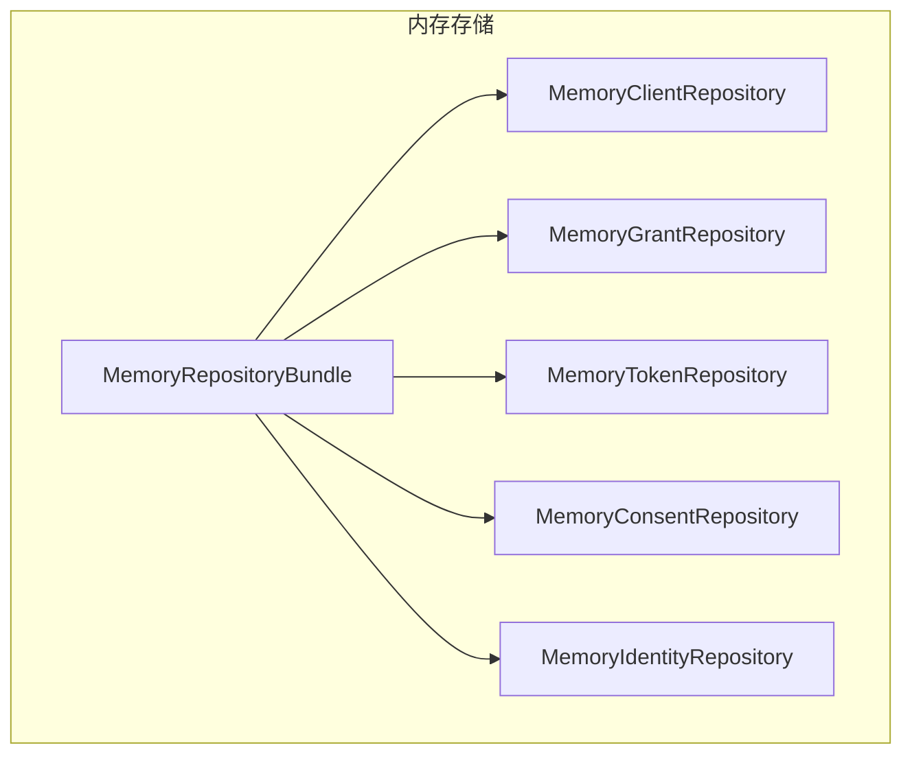
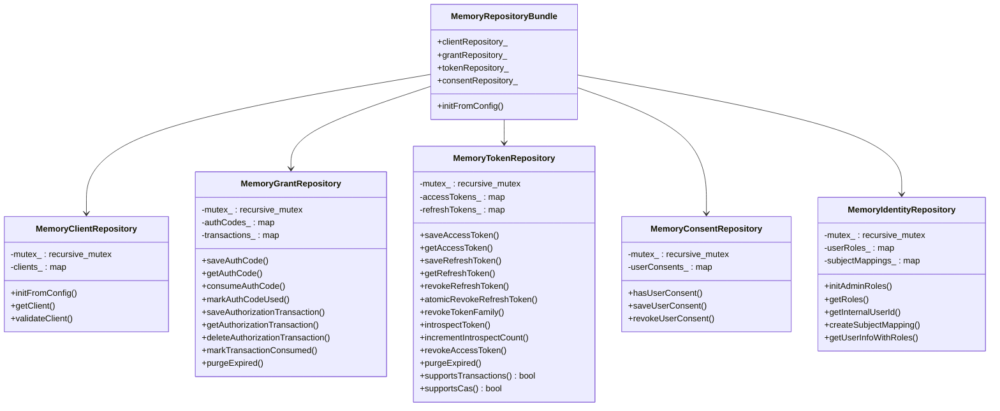
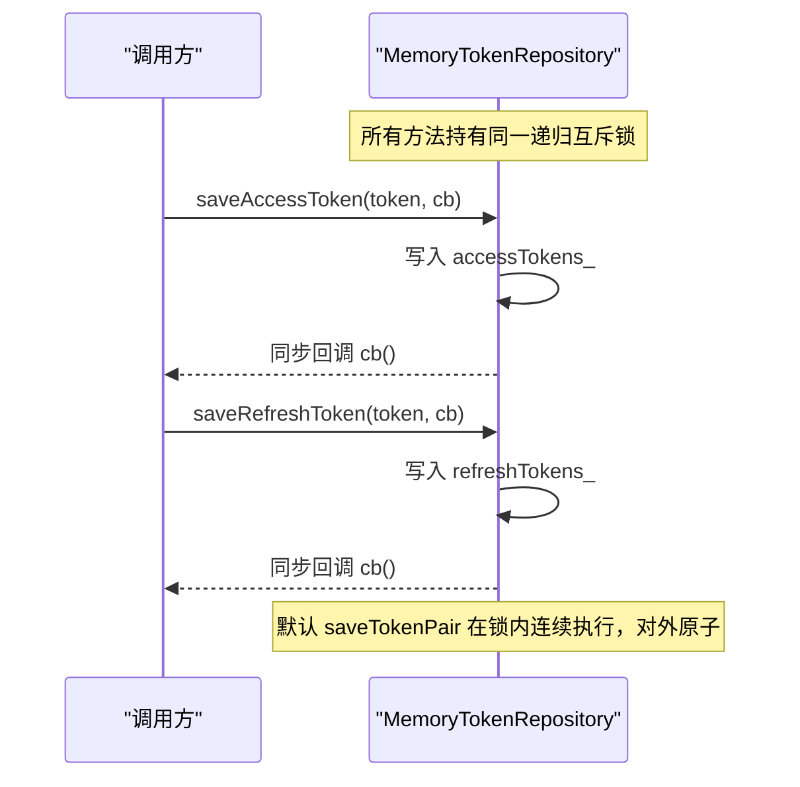
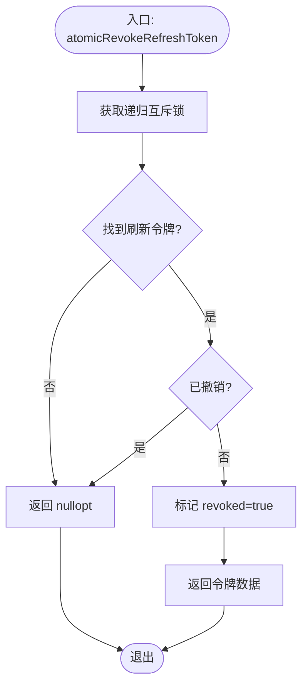
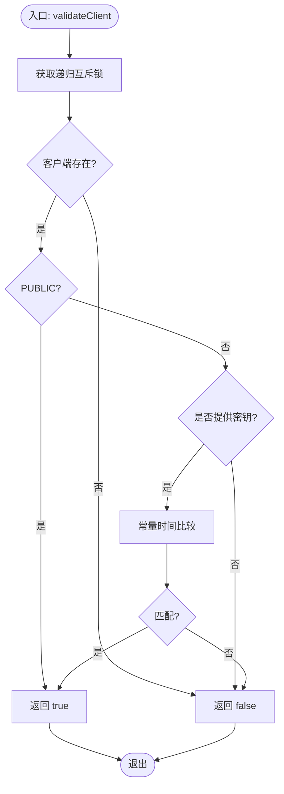
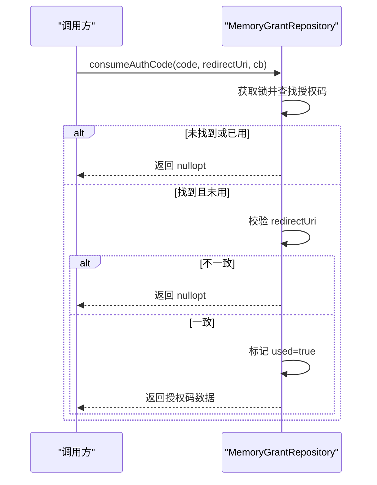
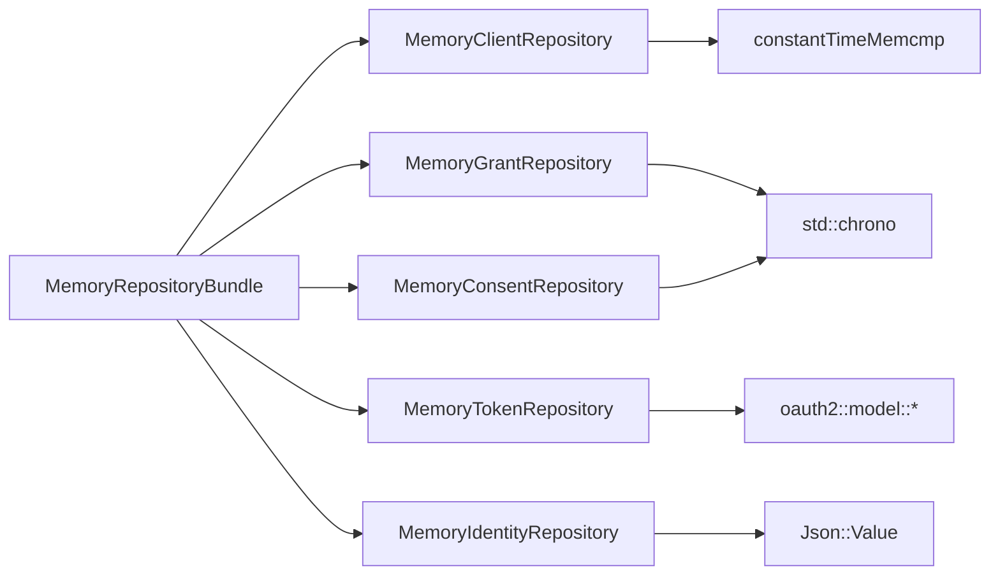

# 内存存储实现

<cite>
**本文引用的文件**
- [MemoryTokenRepository.h](file://libs/storage-memory/include/authforge/storage/memory/MemoryTokenRepository.h)
- [MemoryTokenRepository.cc](file://libs/storage-memory/src/MemoryTokenRepository.cc)
- [MemoryClientRepository.cc](file://libs/storage-memory/src/MemoryClientRepository.cc)
- [MemoryGrantRepository.cc](file://libs/storage-memory/src/MemoryGrantRepository.cc)
- [MemoryConsentRepository.cc](file://libs/storage-memory/src/MemoryConsentRepository.cc)
- [MemoryIdentityRepository.cc](file://libs/storage-memory/src/MemoryIdentityRepository.cc)
- [MemoryRepositoryBundle.cc](file://libs/storage-memory/src/MemoryRepositoryBundle.cc)
- [ContractFixtures.h](file://tests/contract/ContractFixtures.h)
- [TokenRepositoryContractTest.cc](file://tests/contract/TokenRepositoryContractTest.cc)
</cite>

## 目录
1. [简介](#简介)
2. [项目结构](#项目结构)
3. [核心组件](#核心组件)
4. [架构总览](#架构总览)
5. [详细组件分析](#详细组件分析)
6. [依赖关系分析](#依赖关系分析)
7. [性能考量](#性能考量)
8. [故障排查指南](#故障排查指南)
9. [结论](#结论)
10. [附录](#附录)

## 简介
本文件面向 AuthForge 的内存存储实现，系统性说明其设计目标、适用场景、数据结构与并发模型、内存管理策略、性能特征、开发与测试使用方法、配置与调优建议，以及与持久化存储的集成和数据同步策略。内存存储以进程内哈希表为核心，提供线程安全的读写能力，适用于开发、测试与本地验证等对数据持久性要求不高的场景。

## 项目结构
内存存储位于 libs/storage-memory 目录，按领域职责拆分为多个仓库实现：
- 令牌仓库：访问令牌与刷新令牌的保存、查询、撤销、族级撤销、令牌检查（RFC 7662）与过期清理
- 客户端仓库：客户端配置加载、客户端校验（含常量时间比较）
- 授权码仓库：授权码的保存、获取、消费、事务状态维护与过期清理
- 同意仓库：用户同意记录的存在性、保存与撤销
- 身份仓库：角色映射、主题映射、合成用户信息（内存模式无真实用户存储）
- 仓库聚合：将上述仓库组合为可注入的 Bundle

图表来源
- [MemoryRepositoryBundle.cc:6-17](file://libs/storage-memory/src/MemoryRepositoryBundle.cc#L6-L17)

章节来源
- [MemoryRepositoryBundle.cc:1-20](file://libs/storage-memory/src/MemoryRepositoryBundle.cc#L1-L20)

## 核心组件
- MemoryTokenRepository：基于 unordered_map 的令牌存储，使用递归互斥锁保证并发安全；支持原子撤销（CAS）与“事务”语义（在默认 saveTokenPair 中通过回调链在同一锁作用域内完成两次写入）
- MemoryClientRepository：从配置初始化客户端集合，支持 PUBLIC/CONFIDENTIAL 类型与常量时间密钥比对
- MemoryGrantRepository：授权码生命周期管理与授权事务状态维护，包含重定向 URI 一致性校验
- MemoryConsentRepository：用户同意的存在性、保存与撤销
- MemoryIdentityRepository：内存中的角色与主题映射，提供合成用户信息与只读查询
- MemoryRepositoryBundle：统一装配并暴露各仓库实例

章节来源
- [MemoryTokenRepository.h:35-122](file://libs/storage-memory/include/authforge/storage/memory/MemoryTokenRepository.h#L35-L122)
- [MemoryTokenRepository.cc:20-302](file://libs/storage-memory/src/MemoryTokenRepository.cc#L20-L302)
- [MemoryClientRepository.cc:19-155](file://libs/storage-memory/src/MemoryClientRepository.cc#L19-L155)
- [MemoryGrantRepository.cc:20-197](file://libs/storage-memory/src/MemoryGrantRepository.cc#L20-L197)
- [MemoryConsentRepository.cc:16-73](file://libs/storage-memory/src/MemoryConsentRepository.cc#L16-L73)
- [MemoryIdentityRepository.cc:15-194](file://libs/storage-memory/src/MemoryIdentityRepository.cc#L15-L194)

## 架构总览
内存存储采用“按领域拆分 + 聚合装配”的架构。每个仓库独立维护自身状态与锁，避免跨仓库耦合；Bundle 负责组装与配置注入。所有写操作均持有同一仓库内部的递归互斥锁，确保单仓库内的复合操作具备可见性与顺序性保障。

图表来源
- [MemoryTokenRepository.h:78-122](file://libs/storage-memory/include/authforge/storage/memory/MemoryTokenRepository.h#L78-L122)
- [MemoryClientRepository.cc:19-155](file://libs/storage-memory/src/MemoryClientRepository.cc#L19-L155)
- [MemoryGrantRepository.cc:20-197](file://libs/storage-memory/src/MemoryGrantRepository.cc#L20-L197)
- [MemoryConsentRepository.cc:16-73](file://libs/storage-memory/src/MemoryConsentRepository.cc#L16-L73)
- [MemoryIdentityRepository.cc:15-194](file://libs/storage-memory/src/MemoryIdentityRepository.cc#L15-L194)
- [MemoryRepositoryBundle.cc:6-17](file://libs/storage-memory/src/MemoryRepositoryBundle.cc#L6-L17)

## 详细组件分析

### 令牌仓库（MemoryTokenRepository）
- 数据结构：两个 unordered_map 分别保存访问令牌与刷新令牌，键为令牌字符串，值为对应 DTO
- 并发模型：每个方法进入时获取同一 recursive_mutex，回调在锁内同步执行，保证调用方观察到的状态一致
- 关键特性：
  - supportsTransactions() = true：默认 saveTokenPair 调用 saveAccessToken 后在其回调中继续保存刷新令牌，由于回调在锁内同步执行且递归锁允许重入，整个 pair 写入对外表现为原子
  - supportsCas() = true：atomicRevokeRefreshToken 在单一锁作用域内完成“查找-判空-标记已撤销”的 CAS 语义
  - 令牌检查（RFC 7662）：同时检查访问令牌与刷新令牌，返回 active 及必要字段
  - 族级撤销：根据 familyId 批量撤销刷新令牌及其关联的访问令牌
  - 过期清理：purgeExpired 扫描并删除过期条目

图表来源
- [MemoryTokenRepository.cc:26-66](file://libs/storage-memory/src/MemoryTokenRepository.cc#L26-L66)
- [MemoryTokenRepository.h:43-69](file://libs/storage-memory/include/authforge/storage/memory/MemoryTokenRepository.h#L43-L69)

图表来源
- [MemoryTokenRepository.cc:95-116](file://libs/storage-memory/src/MemoryTokenRepository.cc#L95-L116)

章节来源
- [MemoryTokenRepository.h:35-122](file://libs/storage-memory/include/authforge/storage/memory/MemoryTokenRepository.h#L35-L122)
- [MemoryTokenRepository.cc:20-302](file://libs/storage-memory/src/MemoryTokenRepository.cc#L20-L302)
- [TokenRepositoryContractTest.cc:393-455](file://tests/contract/TokenRepositoryContractTest.cc#L393-L455)

### 客户端仓库（MemoryClientRepository）
- 配置加载：从 JSON 配置解析客户端 ID、类型、重定向 URI、允许范围，并填充到内存映射
- 客户端校验：
  - PUBLIC 类型跳过密钥校验
  - CONFIDENTIAL 类型必须提供密钥并使用常量时间比较防止时序攻击
- 并发模型：读取与写入均受递归互斥锁保护

图表来源
- [MemoryClientRepository.cc:107-152](file://libs/storage-memory/src/MemoryClientRepository.cc#L107-L152)

章节来源
- [MemoryClientRepository.cc:19-155](file://libs/storage-memory/src/MemoryClientRepository.cc#L19-L155)

### 授权码仓库（MemoryGrantRepository）
- 授权码生命周期：保存、获取（带过期检查）、标记已用、消费（严格校验 redirect_uri 一致性）
- 授权事务：保存、获取（带过期检查）、删除、标记消费
- 并发模型：每个方法持有递归互斥锁，保证状态一致性
- 过期清理：purgeExpired 仅清理 authCodes_，事务过期在读取时惰性处理

图表来源
- [MemoryGrantRepository.cc:66-97](file://libs/storage-memory/src/MemoryGrantRepository.cc#L66-L97)

章节来源
- [MemoryGrantRepository.cc:20-197](file://libs/storage-memory/src/MemoryGrantRepository.cc#L20-L197)

### 同意仓库（MemoryConsentRepository）
- 数据结构：以“用户ID:客户端ID:范围”作为键的映射，值为时间戳
- 功能：检查是否存在同意、保存同意、撤销同意
- 并发模型：递归互斥锁保护

章节来源
- [MemoryConsentRepository.cc:16-73](file://libs/storage-memory/src/MemoryConsentRepository.cc#L16-L73)

### 身份仓库（MemoryIdentityRepository）
- 角色与主题映射：内存中维护用户角色与第三方主题映射
- 合成用户：在无真实用户存储时生成基础用户信息
- 并发模型：递归互斥锁保护

章节来源
- [MemoryIdentityRepository.cc:15-194](file://libs/storage-memory/src/MemoryIdentityRepository.cc#L15-L194)

### 仓库聚合（MemoryRepositoryBundle）
- 作用：集中创建并持有各仓库实例，提供统一的配置初始化入口
- 扩展点：可通过 initFromConfig 注入客户端配置

章节来源
- [MemoryRepositoryBundle.cc:6-17](file://libs/storage-memory/src/MemoryRepositoryBundle.cc#L6-L17)

## 依赖关系分析
- 内部依赖：
  - TokenRepository 依赖通用模型与回调类型定义
  - ClientRepository 依赖常量时间比较工具
  - GrantRepository 依赖时间戳与日志
  - ConsentRepository 与 IdentityRepository 依赖各自领域模型
- 外部依赖：
  - Drogon 日志与 JSON 库
  - 标准库容器与并发原语（unordered_map、recursive_mutex、chrono）

图表来源
- [MemoryTokenRepository.cc:1-18](file://libs/storage-memory/src/MemoryTokenRepository.cc#L1-L18)
- [MemoryClientRepository.cc:1-12](file://libs/storage-memory/src/MemoryClientRepository.cc#L1-L12)
- [MemoryGrantRepository.cc:1-18](file://libs/storage-memory/src/MemoryGrantRepository.cc#L1-L18)
- [MemoryConsentRepository.cc:1-14](file://libs/storage-memory/src/MemoryConsentRepository.cc#L1-L14)
- [MemoryIdentityRepository.cc:1-13](file://libs/storage-memory/src/MemoryIdentityRepository.cc#L1-L13)
- [MemoryRepositoryBundle.cc:6-17](file://libs/storage-memory/src/MemoryRepositoryBundle.cc#L6-L17)

章节来源
- [MemoryTokenRepository.cc:1-18](file://libs/storage-memory/src/MemoryTokenRepository.cc#L1-L18)
- [MemoryClientRepository.cc:1-12](file://libs/storage-memory/src/MemoryClientRepository.cc#L1-L12)
- [MemoryGrantRepository.cc:1-18](file://libs/storage-memory/src/MemoryGrantRepository.cc#L1-L18)
- [MemoryConsentRepository.cc:1-14](file://libs/storage-memory/src/MemoryConsentRepository.cc#L1-L14)
- [MemoryIdentityRepository.cc:1-13](file://libs/storage-memory/src/MemoryIdentityRepository.cc#L1-L13)
- [MemoryRepositoryBundle.cc:6-17](file://libs/storage-memory/src/MemoryRepositoryBundle.cc#L6-L17)

## 性能考量
- 读写速度
  - 基于 unordered_map 的 O(1) 平均查找/插入，适合高并发短路径
  - 递归互斥锁粒度为仓库级，避免细粒度锁带来的复杂性，但会限制跨键并行度
- 内存占用
  - 所有数据驻留进程内存，随令牌、授权码、同意记录增长而线性增长
  - 无内置容量上限，需由上层控制数据规模或定期清理
- 扩展性限制
  - 单机进程内存储，无法水平扩展
  - 不支持跨进程共享，重启后数据丢失
- 清理策略
  - purgeExpired 周期性扫描并删除过期条目，降低内存压力
  - 授权事务过期采用惰性清理（读取时检查），减少后台开销

[本节为通用性能讨论，不直接分析具体文件]

## 故障排查指南
- 并发问题
  - 若出现竞态条件，优先确认是否在同一仓库内正确持有递归互斥锁
  - 对于 CAS 语义，确认 atomicRevokeRefreshToken 是否在单一锁作用域内完成“查找-判断-标记”
- 令牌失效
  - 检查 expiresAt 与 revoked 标志位是否正确设置
  - 确认 purgeExpired 是否被调用以及调用频率是否合理
- 授权码交换失败
  - 核对 redirectUri 是否与授权阶段记录完全一致
  - 检查授权码是否已被使用或过期
- 客户端校验失败
  - 确认客户端类型与密钥配置
  - 核查常量时间比较是否生效（长度相等且内容一致）

章节来源
- [MemoryTokenRepository.cc:95-116](file://libs/storage-memory/src/MemoryTokenRepository.cc#L95-L116)
- [MemoryGrantRepository.cc:66-97](file://libs/storage-memory/src/MemoryGrantRepository.cc#L66-L97)
- [MemoryClientRepository.cc:107-152](file://libs/storage-memory/src/MemoryClientRepository.cc#L107-L152)

## 结论
内存存储以简洁的数据结构与严格的锁策略实现了高吞吐、低延迟的进程内数据存取能力，并通过能力标志（事务、CAS）向上层提供明确的并发语义。它非常适合开发与测试环境，便于快速验证与回归；在生产环境中应结合持久化存储与缓存层，以实现可扩展与可恢复的数据服务。

[本节为总结性内容，不直接分析具体文件]

## 附录

### 设计与适用场景
- 设计目标
  - 提供与持久化存储一致的接口契约，便于替换与测试
  - 在保证线程安全的前提下最大化本地性能
- 适用场景
  - 单元测试、集成测试、端到端测试
  - 本地开发与调试
  - 小规模演示与原型验证

[本节为概念性内容，不直接分析具体文件]

### 开发与测试使用方法
- 使用步骤
  - 通过 MemoryRepositoryBundle 创建并注入各仓库实例
  - 使用 initFromConfig 加载客户端配置
  - 在测试中通过合同测试验证行为一致性（如 CAS、事务）
- 注意事项
  - 测试结束后无需显式销毁，进程结束时内存自动释放
  - 如需重置状态，可在测试用例间重新构造 Bundle

章节来源
- [MemoryRepositoryBundle.cc:6-17](file://libs/storage-memory/src/MemoryRepositoryBundle.cc#L6-L17)
- [TokenRepositoryContractTest.cc:393-455](file://tests/contract/TokenRepositoryContractTest.cc#L393-L455)

### 配置选项与性能调优
- 配置项
  - 客户端配置：clientId、type、secret、redirect_uri、allowed_scopes
  - 管理员角色：admin_users 映射
- 调优建议
  - 调整 purgeExpired 调用频率以平衡内存与 CPU
  - 控制令牌与授权码的生命周期，减少内存占用
  - 在高并发下评估锁竞争热点，必要时拆分热点键空间

章节来源
- [MemoryClientRepository.cc:19-91](file://libs/storage-memory/src/MemoryClientRepository.cc#L19-L91)
- [MemoryIdentityRepository.cc:15-41](file://libs/storage-memory/src/MemoryIdentityRepository.cc#L15-L41)
- [MemoryGrantRepository.cc:171-194](file://libs/storage-memory/src/MemoryGrantRepository.cc#L171-L194)
- [MemoryTokenRepository.cc:267-299](file://libs/storage-memory/src/MemoryTokenRepository.cc#L267-L299)

### 与持久化存储的集成与数据同步策略
- 集成方式
  - 通过统一接口抽象，内存与持久化实现可互换
  - 在测试中注入内存实现，在生产中注入数据库/缓存实现
- 同步策略
  - 内存作为缓存层时，遵循“写穿透/失效回源”策略
  - 幂等写入与去重机制（如 CAS）确保一致性
  - 定期清理过期数据，保持缓存命中率与内存占用平衡

[本节为概念性内容，不直接分析具体文件]