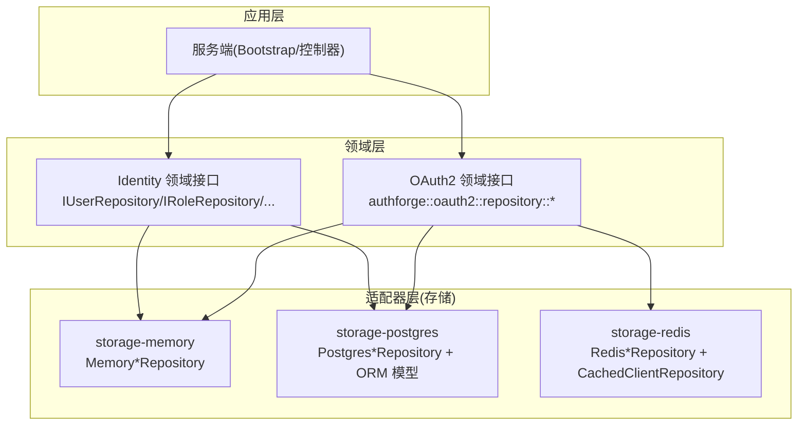
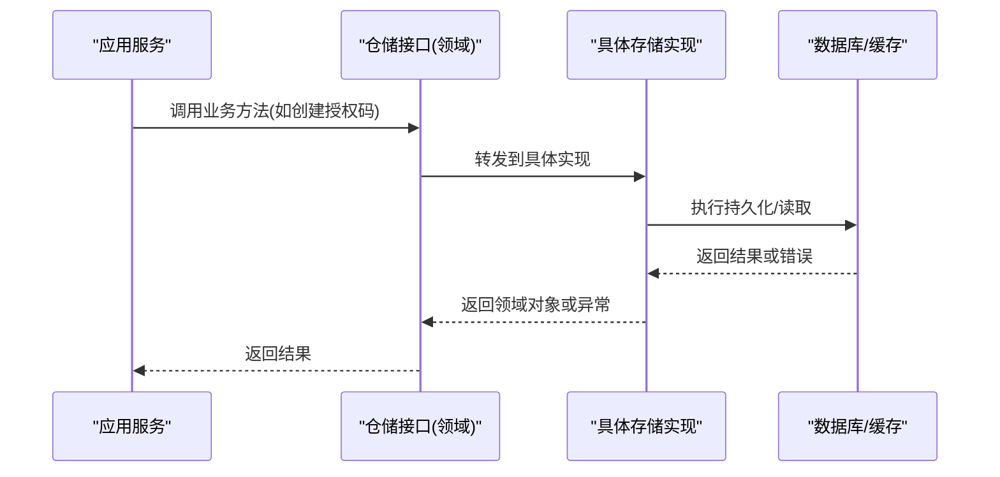
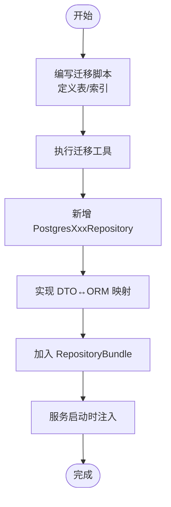
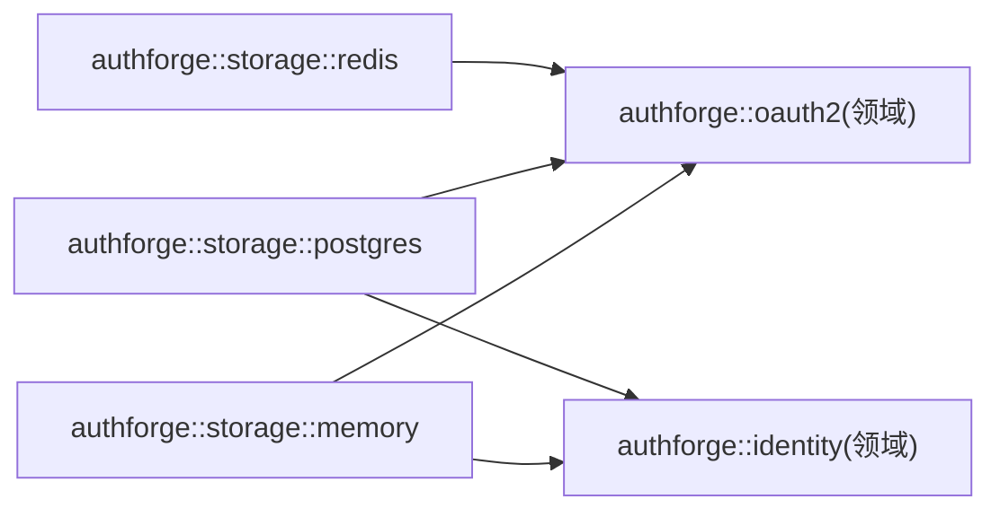

# 存储扩展

<cite>
**本文引用的文件**
- [libs/storage-memory/CMakeLists.txt](file://libs/storage-memory/CMakeLists.txt)
- [libs/storage-postgres/CMakeLists.txt](file://libs/storage-postgres/CMakeLists.txt)
- [libs/storage-redis/CMakeLists.txt](file://libs/storage-redis/CMakeLists.txt)
- [apps/server/src/bootstrap/MigrationRunner.cc](file://apps/server/src/bootstrap/MigrationRunner.cc)
- [apps/server/src/bootstrap/MigrationRunner.h](file://apps/server/src/bootstrap/MigrationRunner.h)
- [apps/server/migrations/V001__schema_migrations.sql](file://apps/server/migrations/V001__schema_migrations.sql)
- [apps/server/migrations/V022__mfa_pending_client_binding.sql](file://apps/server/migrations/V022__mfa_pending_client_binding.sql)
- [tests/integration/storage/AdvancedStorageTest.cc](file://tests/integration/storage/AdvancedStorageTest.cc)
- [tests/integration/storage/UserTest.cc](file://tests/integration/storage/UserTest.cc)
- [tests/performance/benchmark/PerformanceBenchmark.cc](file://tests/performance/benchmark/PerformanceBenchmark.cc)
- [deploy/helm/authforge/values.yaml](file://deploy/helm/authforge/values.yaml)
- [deploy/helm/authforge/templates/postgresql.yaml](file://deploy/helm/authforge/templates/postgresql.yaml)
- [deploy/helm/authforge/templates/redis.yaml](file://deploy/helm/authforge/templates/redis.yaml)
- [scripts/setup-database.sh](file://scripts/setup-database.sh)
- [scripts/full-test.sh](file://scripts/full-test.sh)
</cite>

## 目录
1. [简介](#简介)
2. [项目结构](#项目结构)
3. [核心组件](#核心组件)
4. [架构总览](#架构总览)
5. [详细组件分析](#详细组件分析)
6. [依赖分析](#依赖分析)
7. [性能考虑](#性能考虑)
8. [故障排查指南](#故障排查指南)
9. [结论](#结论)
10. [附录](#附录)

## 简介
本指南面向希望为 AuthForge 开发自定义存储后端的工程师，聚焦存储适配器接口规范与抽象层设计，覆盖数据模型映射、查询构建、事务管理、连接池与性能优化、一致性保障、插件注册与配置管理、测试与基准、以及迁移与备份恢复等主题。文档基于仓库中 storage-memory、storage-postgres、storage-redis 三个存储包及服务器启动、迁移脚本与测试用例进行系统化说明，帮助读者快速理解并实现可扩展的存储层。

## 项目结构
AuthForge 将存储能力以“适配器层”的独立 CMake 包形式组织：
- storage-memory：内存实现，用于开发与测试，提供 OAuth2 与 Identity 相关仓库的内存版本。
- storage-postgres：PostgreSQL 持久化实现，包含 ORM 模型与各类仓库实现。
- storage-redis：Redis 缓存/会话型实现，提供 OAuth2 仓库的 Redis 版本与客户端缓存装饰器。

图表来源
- [libs/storage-memory/CMakeLists.txt:1-75](file://libs/storage-memory/CMakeLists.txt#L1-L75)
- [libs/storage-postgres/CMakeLists.txt:1-138](file://libs/storage-postgres/CMakeLists.txt#L1-L138)
- [libs/storage-redis/CMakeLists.txt:1-85](file://libs/storage-redis/CMakeLists.txt#L1-L85)

章节来源
- [libs/storage-memory/CMakeLists.txt:1-75](file://libs/storage-memory/CMakeLists.txt#L1-L75)
- [libs/storage-postgres/CMakeLists.txt:1-138](file://libs/storage-postgres/CMakeLists.txt#L1-L138)
- [libs/storage-redis/CMakeLists.txt:1-85](file://libs/storage-redis/CMakeLists.txt#L1-L85)

## 核心组件
- 领域接口（Domain）
  - OAuth2 仓储接口：IClientRepository、IGrantRepository、ITokenRepository、IConsentRepository 等。
  - Identity 仓储接口：IUserRepository、IRoleRepository、ISubjectMappingRepository、IMfaRepository、IWebAuthnRepository、ISocialAccountRepository 等。
- 适配器实现（Adapter）
  - storage-memory：提供上述接口的内存实现，便于本地调试与单元测试。
  - storage-postgres：基于 Drogon ORM 生成的模型类，实现所有领域接口；同时提供 PostgresRepositoryBase 等基础能力。
  - storage-redis：提供 Redis 实现的 OAuth2 仓储，并提供 CachedClientRepository 作为 IClientRepository 的缓存装饰器。
- 聚合与装配
  - RepositoryBundle：在各存储包中提供聚合对象，统一暴露一组仓储实例，便于上层注入与替换。

章节来源
- [libs/storage-memory/CMakeLists.txt:41-53](file://libs/storage-memory/CMakeLists.txt#L41-L53)
- [libs/storage-postgres/CMakeLists.txt:80-116](file://libs/storage-postgres/CMakeLists.txt#L80-L116)
- [libs/storage-redis/CMakeLists.txt:3-27](file://libs/storage-redis/CMakeLists.txt#L3-L27)

## 架构总览
存储层遵循“适配器模式”，通过实现领域接口屏蔽底层差异。上层仅依赖领域接口，运行时通过装配选择具体存储后端。

图表来源
- [libs/storage-postgres/CMakeLists.txt:80-116](file://libs/storage-postgres/CMakeLists.txt#L80-L116)
- [libs/storage-redis/CMakeLists.txt:3-27](file://libs/storage-redis/CMakeLists.txt#L3-L27)
- [libs/storage-memory/CMakeLists.txt:41-53](file://libs/storage-memory/CMakeLists.txt#L41-L53)

## 详细组件分析

### 存储适配器接口与抽象层设计
- 接口契约
  - OAuth2 仓储：客户端、授权码、令牌、同意记录等 CRUD 与查询。
  - Identity 仓储：用户、角色、主体映射、MFA、WebAuthn、社交账号等。
- 抽象原则
  - 适配器层实现领域接口，领域层不反向依赖任何存储实现。
  - 通过 RepositoryBundle 聚合多个仓储，简化装配。
  - 使用 Drogon 日志宏进行诊断输出，便于问题定位。

章节来源
- [libs/storage-memory/CMakeLists.txt:41-53](file://libs/storage-memory/CMakeLists.txt#L41-L53)
- [libs/storage-postgres/CMakeLists.txt:80-116](file://libs/storage-postgres/CMakeLists.txt#L80-L116)
- [libs/storage-redis/CMakeLists.txt:3-27](file://libs/storage-redis/CMakeLists.txt#L3-L27)

### 自定义存储后端：数据模型映射、查询构建与事务管理
- 数据模型映射
  - storage-postgres 使用 Drogon ORM 生成模型类，位于 storage-postgres 包内；手写代码负责将领域 DTO 与 ORM 模型相互转换。
  - 生成代码需保持只读，避免被重构工具改写。
- 查询构建
  - 在仓储实现中使用 ORM 提供的查询 API 组合条件，注意索引与分页策略。
  - 对高频查询建立合适索引，避免全表扫描。
- 事务管理
  - 在需要原子性的写操作中开启事务，确保多表/多行操作的一致性。
  - 失败时回滚，成功提交；合理设置隔离级别与超时。

章节来源
- [libs/storage-postgres/CMakeLists.txt:1-28](file://libs/storage-postgres/CMakeLists.txt#L1-L28)
- [libs/storage-postgres/CMakeLists.txt:61-78](file://libs/storage-postgres/CMakeLists.txt#L61-L78)
- [libs/storage-postgres/CMakeLists.txt:80-116](file://libs/storage-postgres/CMakeLists.txt#L80-L116)

### PostgreSQL 存储后端扩展示例
- 新增实体
  - 编写 SQL 迁移脚本，定义表结构与索引。
  - 运行迁移工具更新数据库 schema。
- 新增仓储
  - 在 storage-postgres 中添加新的 PostgresXxxRepository，实现对应领域接口。
  - 复用 PostgresRepositoryBase 的基础能力（连接、事务、日志）。
- 装配与注册
  - 在 RepositoryBundle 中聚合新仓储。
  - 在服务启动阶段注入到需要的模块。

图表来源
- [libs/storage-postgres/CMakeLists.txt:80-116](file://libs/storage-postgres/CMakeLists.txt#L80-L116)
- [apps/server/migrations/V001__schema_migrations.sql](file://apps/server/migrations/V001__schema_migrations.sql)
- [apps/server/migrations/V022__mfa_pending_client_binding.sql](file://apps/server/migrations/V022__mfa_pending_client_binding.sql)

章节来源
- [libs/storage-postgres/CMakeLists.txt:80-116](file://libs/storage-postgres/CMakeLists.txt#L80-L116)
- [apps/server/migrations/V001__schema_migrations.sql](file://apps/server/migrations/V001__schema_migrations.sql)
- [apps/server/migrations/V022__mfa_pending_client_binding.sql](file://apps/server/migrations/V022__mfa_pending_client_binding.sql)

### Redis 存储后端扩展示例
- 适用场景
  - 会话、令牌缓存、短期状态等高性能读写。
- 扩展步骤
  - 在 storage-redis 中新增 RedisXxxRepository，实现 OAuth2 领域接口。
  - 使用 RedisClient 与 CacheMap 进行键值存取与过期控制。
  - 如需缓存增强，可参考 CachedClientRepository 的装饰器模式。
- 注意事项
  - 保证键命名空间隔离与 TTL 策略。
  - 对热点键做分片或限流，避免单点瓶颈。

章节来源
- [libs/storage-redis/CMakeLists.txt:3-27](file://libs/storage-redis/CMakeLists.txt#L3-L27)
- [libs/storage-redis/CMakeLists.txt:57-63](file://libs/storage-redis/CMakeLists.txt#L57-L63)

### 存储连接池管理与性能优化
- 连接池
  - 使用 Drogon 内置连接池管理数据库连接，合理设置最大连接数、空闲超时与重试策略。
  - Redis 连接复用，避免频繁握手。
- 查询优化
  - 针对高频查询建立复合索引，减少回表。
  - 使用分页与投影，避免拉取多余字段。
- 缓存策略
  - 对读多写少的数据采用多级缓存（本地+Redis），注意失效与一致性。
- 并发与锁
  - 在高并发场景下使用分布式锁或乐观锁，避免竞态条件。

章节来源
- [libs/storage-postgres/CMakeLists.txt:80-116](file://libs/storage-postgres/CMakeLists.txt#L80-L116)
- [libs/storage-redis/CMakeLists.txt:3-27](file://libs/storage-redis/CMakeLists.txt#L3-L27)

### 数据一致性保证
- 事务边界
  - 将关联写操作放入同一事务，确保原子性。
- 幂等与去重
  - 对关键操作引入幂等键，防止重复提交。
- 最终一致性
  - 对于跨存储的写入，采用补偿机制或事件驱动的最终一致方案。

章节来源
- [libs/storage-postgres/CMakeLists.txt:80-116](file://libs/storage-postgres/CMakeLists.txt#L80-L116)

### 存储插件注册机制与配置管理
- 插件装配
  - 通过 RepositoryBundle 聚合仓储，并在服务启动时注入到业务模块。
- 配置项
  - 数据库连接串、Redis 地址、连接池大小、超时等通过配置文件或环境变量注入。
- 部署集成
  - Helm Chart 提供 PostgreSQL 与 Redis 的部署模板，便于环境编排。

章节来源
- [libs/storage-postgres/CMakeLists.txt:80-116](file://libs/storage-postgres/CMakeLists.txt#L80-L116)
- [libs/storage-redis/CMakeLists.txt:3-27](file://libs/storage-redis/CMakeLists.txt#L3-L27)
- [deploy/helm/authforge/templates/postgresql.yaml](file://deploy/helm/authforge/templates/postgresql.yaml)
- [deploy/helm/authforge/templates/redis.yaml](file://deploy/helm/authforge/templates/redis.yaml)
- [deploy/helm/authforge/values.yaml](file://deploy/helm/authforge/values.yaml)

### 存储扩展的测试方法与性能基准测试
- 单元测试
  - 使用 storage-memory 实现 Mock 仓储，验证业务逻辑正确性。
- 集成测试
  - 使用 storage-postgres 或 storage-redis 进行端到端验证，覆盖正常路径与异常分支。
- 性能基准
  - 使用 PerformanceBenchmark 进行吞吐与延迟评估，对比不同后端表现。
- 测试数据准备
  - 通过迁移脚本初始化测试库，或使用种子数据填充。

章节来源
- [libs/storage-memory/CMakeLists.txt:41-53](file://libs/storage-memory/CMakeLists.txt#L41-L53)
- [tests/integration/storage/AdvancedStorageTest.cc](file://tests/integration/storage/AdvancedStorageTest.cc)
- [tests/integration/storage/UserTest.cc](file://tests/integration/storage/UserTest.cc)
- [tests/performance/benchmark/PerformanceBenchmark.cc](file://tests/performance/benchmark/PerformanceBenchmark.cc)
- [scripts/setup-database.sh](file://scripts/setup-database.sh)

### 存储迁移与数据备份恢复
- 迁移
  - 使用迁移脚本按版本号顺序执行，确保 schema 演进可追溯。
  - 在 CI/CD 中自动执行迁移，保证环境一致性。
- 备份恢复
  - 定期备份 PostgreSQL 数据，制定恢复演练计划。
  - 对 Redis 数据采用 RDB/AOF 策略，结合外部备份工具。

章节来源
- [apps/server/migrations/V001__schema_migrations.sql](file://apps/server/migrations/V001__schema_migrations.sql)
- [apps/server/migrations/V022__mfa_pending_client_binding.sql](file://apps/server/migrations/V022__mfa_pending_client_binding.sql)
- [scripts/setup-database.sh](file://scripts/setup-database.sh)

## 依赖分析
存储包之间的依赖关系清晰，适配器层依赖领域层，不反向依赖。

图表来源
- [libs/storage-memory/CMakeLists.txt:41-53](file://libs/storage-memory/CMakeLists.txt#L41-L53)
- [libs/storage-postgres/CMakeLists.txt:80-116](file://libs/storage-postgres/CMakeLists.txt#L80-L116)
- [libs/storage-redis/CMakeLists.txt:3-27](file://libs/storage-redis/CMakeLists.txt#L3-L27)

章节来源
- [libs/storage-memory/CMakeLists.txt:41-53](file://libs/storage-memory/CMakeLists.txt#L41-L53)
- [libs/storage-postgres/CMakeLists.txt:80-116](file://libs/storage-postgres/CMakeLists.txt#L80-L116)
- [libs/storage-redis/CMakeLists.txt:3-27](file://libs/storage-redis/CMakeLists.txt#L3-L27)

## 性能考虑
- 连接池调优
  - 根据 QPS 与 CPU 核数调整最大连接数，避免过多上下文切换。
- 查询优化
  - 使用 EXPLAIN 分析慢查询，补充必要索引。
- 缓存命中
  - 提高缓存命中率，降低数据库压力。
- 批处理
  - 批量写入减少往返次数，提升吞吐。
- 监控告警
  - 采集连接池使用率、慢查询、缓存命中率等指标，设置阈值告警。

[本节为通用指导，不直接分析具体文件]

## 故障排查指南
- 常见问题
  - 连接失败：检查数据库/Redis 地址、端口、认证信息。
  - 迁移失败：核对迁移脚本版本与内容，确认目标库权限。
  - 性能退化：查看慢查询日志与连接池状态。
- 定位手段
  - 启用详细日志，关注 Drogon LOG_* 输出。
  - 使用集成测试复现问题，缩小范围。
- 恢复策略
  - 回滚迁移脚本，恢复至稳定版本。
  - 重启服务或重建连接池，缓解瞬时拥塞。

章节来源
- [libs/storage-postgres/CMakeLists.txt:80-116](file://libs/storage-postgres/CMakeLists.txt#L80-L116)
- [libs/storage-redis/CMakeLists.txt:3-27](file://libs/storage-redis/CMakeLists.txt#L3-L27)
- [scripts/setup-database.sh](file://scripts/setup-database.sh)

## 结论
AuthForge 的存储扩展体系以清晰的领域接口与适配器分层为核心，支持多种后端无缝替换。通过统一的 RepositoryBundle 与完善的迁移、测试与部署工具链，开发者可以快速实现自定义存储后端，并在生产环境中获得良好的性能与一致性保障。建议在新扩展中严格遵循接口契约、完善事务与索引设计、建立全面的测试与基准，并结合监控持续优化。

## 附录
- 常用命令
  - 运行集成测试：参考 full-test 脚本。
  - 初始化数据库：参考 setup-database 脚本。
- 参考文件
  - 迁移脚本：V001__schema_migrations.sql 至 V022__mfa_pending_client_binding.sql。
  - Helm 模板：postgresql.yaml、redis.yaml 与 values.yaml。

章节来源
- [scripts/full-test.sh](file://scripts/full-test.sh)
- [scripts/setup-database.sh](file://scripts/setup-database.sh)
- [apps/server/migrations/V001__schema_migrations.sql](file://apps/server/migrations/V001__schema_migrations.sql)
- [apps/server/migrations/V022__mfa_pending_client_binding.sql](file://apps/server/migrations/V022__mfa_pending_client_binding.sql)
- [deploy/helm/authforge/templates/postgresql.yaml](file://deploy/helm/authforge/templates/postgresql.yaml)
- [deploy/helm/authforge/templates/redis.yaml](file://deploy/helm/authforge/templates/redis.yaml)
- [deploy/helm/authforge/values.yaml](file://deploy/helm/authforge/values.yaml)